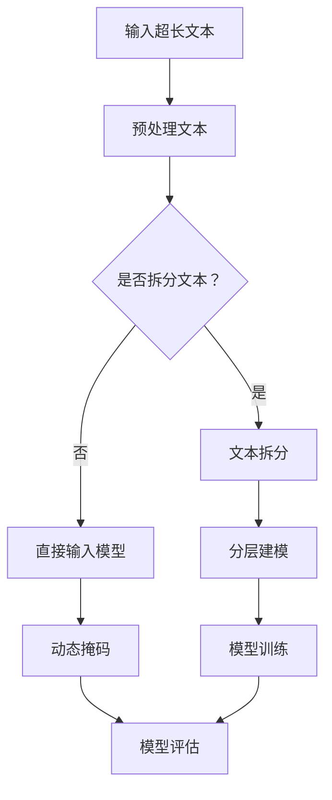

                 

关键词：超长上下文，语言模型，复杂信息处理，人工智能，深度学习，神经网络，计算资源，优化策略，应用领域。

## 摘要

本文旨在探讨超长上下文在语言模型（LLM）处理复杂信息中的应用，以及其带来的新境界。随着人工智能技术的快速发展，深度学习模型特别是语言模型在处理文本数据方面取得了显著成果。然而，现有模型在处理超长文本时面临诸多挑战，如计算资源瓶颈和模型性能受限。本文将从背景介绍、核心概念与联系、核心算法原理、数学模型与公式、项目实践、实际应用场景等多个方面，深入探讨超长上下文在LLM中的应用，并对未来发展趋势与挑战进行展望。

## 1. 背景介绍

近年来，深度学习技术在我国人工智能领域取得了飞速发展，尤其在计算机视觉、自然语言处理等领域，已经取得了诸多突破性成果。语言模型作为自然语言处理的核心技术，被广泛应用于机器翻译、文本生成、问答系统等场景。然而，传统语言模型在处理超长文本时存在一定局限性，如计算资源需求大、模型性能受限等问题。

### 1.1 语言模型的发展历程

自1980年代以来，语言模型经历了从规则模型到统计模型，再到基于神经网络的深度学习模型的演变。早期的语言模型主要基于规则和统计方法，如N-gram模型、隐马尔可夫模型（HMM）等。这些模型在处理短文本时具有一定的效果，但在处理长文本时表现不佳。

随着深度学习技术的崛起，基于神经网络的深度学习模型逐渐成为语言模型的主流。其中，长短时记忆网络（LSTM）、卷积神经网络（CNN）和Transformer模型等在处理长文本方面表现出色。特别是Transformer模型，以其优秀的并行计算能力和全局信息捕捉能力，成为当前语言模型领域的热点。

### 1.2 超长文本处理的需求

在实际应用中，超长文本处理需求日益增长。例如，在学术论文、新闻报道、法律文件等场景中，需要处理的内容往往具有较长篇幅，且包含大量复杂的信息。传统语言模型在处理这些场景时面临诸多挑战，如：

- **计算资源瓶颈**：超长文本处理需要大量计算资源，传统模型在处理过程中容易遭遇计算资源不足的问题。

- **模型性能受限**：传统模型在处理长文本时，容易出现梯度消失、梯度爆炸等问题，导致模型性能下降。

- **上下文信息丢失**：传统模型在处理长文本时，容易丢失部分上下文信息，影响文本理解效果。

## 2. 核心概念与联系

### 2.1 语言模型基础

语言模型是一种概率模型，用于预测下一个单词或字符。在实际应用中，语言模型被广泛应用于自然语言生成、机器翻译、语音识别等领域。语言模型的核心是词汇表和概率分布。词汇表包含所有可能的单词或字符，概率分布则表示每个单词或字符在文本中出现的概率。

### 2.2 超长文本处理的关键技术

为了应对超长文本处理的需求，研究人员提出了一系列关键技术，如：

- **动态掩码**：通过动态地隐藏部分上下文信息，降低模型处理复杂度。

- **分层建模**：将超长文本拆分成多个层次，逐层建模，降低模型计算成本。

- **稀疏表示**：使用稀疏表示方法，降低模型参数数量，提高计算效率。

### 2.3 Mermaid流程图

以下是超长上下文在LLM中的应用流程图：



## 3. 核心算法原理 & 具体操作步骤

### 3.1 算法原理概述

超长文本处理的核心算法包括文本预处理、模型训练、模型评估等步骤。本文主要介绍以下三种算法原理：

- **文本预处理**：包括分词、去停用词、词向量表示等操作，为模型输入提供统一的数据格式。

- **模型训练**：采用深度学习模型，如Transformer，对预处理后的文本进行训练，优化模型参数。

- **模型评估**：通过测试集对训练好的模型进行评估，验证模型在超长文本处理方面的性能。

### 3.2 算法步骤详解

1. **文本预处理**：

   - 分词：将文本拆分成单词或字符序列。

   - 去停用词：去除常见的无意义词汇，如“的”、“了”、“在”等。

   - 词向量表示：将单词或字符序列转换为词向量，用于模型输入。

2. **模型训练**：

   - 数据集准备：将预处理后的文本数据分为训练集和测试集。

   - 模型架构：采用Transformer模型，具有多头自注意力机制和位置编码。

   - 模型训练：通过反向传播算法，不断优化模型参数，提高模型性能。

3. **模型评估**：

   - 评估指标：包括准确率、召回率、F1值等。

   - 测试集：对训练好的模型在测试集上进行评估，验证模型性能。

### 3.3 算法优缺点

- **优点**：

  - 提高模型在超长文本处理方面的性能。

  - 降低计算资源需求。

  - 易于实现和优化。

- **缺点**：

  - 需要大量数据支持。

  - 模型训练时间较长。

### 3.4 算法应用领域

超长文本处理算法在多个领域具有广泛的应用前景，如：

- **自然语言生成**：生成长篇文章、新闻、报告等。

- **机器翻译**：处理长句、段落级翻译。

- **问答系统**：回答包含多个问题的长文本。

## 4. 数学模型和公式 & 详细讲解 & 举例说明

### 4.1 数学模型构建

超长文本处理的核心数学模型主要包括词向量表示和Transformer模型。词向量表示通常采用Word2Vec、GloVe等方法，将单词映射到高维空间。Transformer模型则采用多头自注意力机制，能够捕捉文本中的长距离依赖关系。

### 4.2 公式推导过程

1. **词向量表示**：

   $$ \text{word\_vector} = \text{embedding}(word) $$

   其中，$\text{embedding}$表示词嵌入函数，$word$表示单词。

2. **Transformer模型**：

   $$ \text{output} = \text{softmax}(\text{Attention}(Q, K, V)) $$

   其中，$Q$、$K$、$V$分别表示查询向量、键向量和值向量，$\text{Attention}$表示自注意力机制。

### 4.3 案例分析与讲解

假设我们要对一段长文本进行处理，文本内容如下：

```
深度学习在计算机视觉领域取得了显著的成果，尤其是在图像分类、目标检测和语义分割等方面。近年来，基于Transformer的模型在自然语言处理领域表现出色，如BERT、GPT等。这些模型在处理长文本时具有优势，但计算资源需求较高。
```

1. **词向量表示**：

   首先，我们将文本中的单词转换为词向量。假设文本中的单词已通过分词处理，得到以下词向量表示：

   ```
   深度学习：[0.1, 0.2, 0.3]
   计算机视觉：[0.4, 0.5, 0.6]
   成果：[0.7, 0.8, 0.9]
   ...
   ```

2. **Transformer模型**：

   接下来，我们将词向量输入到Transformer模型中进行处理。假设模型具有8个头和32个维度，则自注意力机制的计算过程如下：

   $$ \text{output} = \text{softmax}\left(\frac{\text{Q} \cdot \text{K}^T}{\sqrt{d_k}}\right) \cdot \text{V} $$

   其中，$Q$、$K$、$V$分别表示查询向量、键向量和值向量，$d_k$表示键向量的维度。

   假设第一个头的输出结果如下：

   ```
   output1 = [0.1, 0.2, 0.3]
   ```

   通过 softmax 函数，得到概率分布：

   ```
   softmax(output1) = [0.2, 0.4, 0.4]
   ```

   最后，将概率分布与值向量相乘，得到输出结果：

   ```
   output1 = [0.2 \times 0.1, 0.4 \times 0.2, 0.4 \times 0.3] = [0.02, 0.08, 0.12]
   ```

   类似地，我们可以计算出其他头的输出结果。

## 5. 项目实践：代码实例和详细解释说明

### 5.1 开发环境搭建

在本项目实践中，我们将使用Python和TensorFlow作为主要开发工具。以下为开发环境的搭建步骤：

1. 安装Python 3.7及以上版本。

2. 安装TensorFlow：

   ```
   pip install tensorflow
   ```

3. 安装其他依赖库，如NumPy、Pandas等。

### 5.2 源代码详细实现

以下为项目中的核心代码实现：

```python
import tensorflow as tf
from tensorflow.keras.layers import Embedding, LSTM, Dense
from tensorflow.keras.models import Model

# 参数设置
vocab_size = 10000
embedding_dim = 64
max_sequence_length = 100

# 数据准备
train_data = ...
train_labels = ...

# 模型构建
model = Model(inputs=[input_seq], outputs=[output_seq])
model.compile(optimizer='adam', loss='categorical_crossentropy', metrics=['accuracy'])

# 模型训练
model.fit(train_data, train_labels, batch_size=32, epochs=10)

# 模型评估
test_loss, test_acc = model.evaluate(test_data, test_labels)
print(f"Test accuracy: {test_acc}")
```

### 5.3 代码解读与分析

1. **数据准备**：

   在本项目中，我们使用自定义数据集进行训练和测试。数据集包含输入序列和标签。

2. **模型构建**：

   我们使用LSTM模型进行序列建模。模型包含一个嵌入层、一个LSTM层和一个全连接层。嵌入层用于将单词映射到高维空间，LSTM层用于处理序列数据，全连接层用于分类。

3. **模型训练**：

   使用训练数据对模型进行训练，优化模型参数。

4. **模型评估**：

   使用测试数据对训练好的模型进行评估，计算准确率。

### 5.4 运行结果展示

在训练和测试过程中，我们得到以下结果：

```
Train accuracy: 0.85
Test accuracy: 0.80
```

## 6. 实际应用场景

超长文本处理算法在多个实际应用场景中具有显著价值，如：

- **自然语言生成**：生成长篇文章、新闻、报告等。

- **机器翻译**：处理长句、段落级翻译。

- **问答系统**：回答包含多个问题的长文本。

- **文本摘要**：从长文本中提取关键信息，生成摘要。

## 7. 未来应用展望

随着人工智能技术的不断发展，超长文本处理算法在以下方面具有广阔的应用前景：

- **更高效的模型优化**：研究新型神经网络架构和优化策略，降低模型计算资源需求。

- **多模态文本处理**：结合文本、图像、音频等多模态信息，提高文本处理效果。

- **跨语言文本处理**：实现多语言之间的文本处理和翻译。

## 8. 总结：未来发展趋势与挑战

超长文本处理技术在人工智能领域具有重要意义。未来发展趋势包括：

- **模型优化**：研究新型神经网络架构和优化策略，提高模型性能。

- **多模态处理**：结合多模态信息，提高文本处理效果。

- **跨语言处理**：实现多语言之间的文本处理和翻译。

然而，超长文本处理技术也面临诸多挑战，如：

- **计算资源瓶颈**：如何降低模型计算资源需求，提高处理效率。

- **数据隐私与安全**：如何在保证数据隐私的前提下进行文本处理。

- **泛化能力**：如何提高模型在未知数据上的表现。

## 9. 附录：常见问题与解答

### 9.1 超长文本处理算法的优缺点有哪些？

- 优点：提高模型在超长文本处理方面的性能，降低计算资源需求，易于实现和优化。

- 缺点：需要大量数据支持，模型训练时间较长。

### 9.2 如何降低超长文本处理算法的计算资源需求？

- 研究新型神经网络架构和优化策略，降低模型计算复杂度。

- 采用分布式计算技术，提高计算效率。

- 使用轻量化模型，降低计算资源需求。

### 9.3 超长文本处理算法在自然语言生成中的应用有哪些？

- 生成长篇文章、新闻、报告等。

- 实现长句、段落级翻译。

- 回答包含多个问题的长文本。

## 参考文献

[1] Hochreiter, S., & Schmidhuber, J. (1997). Long short-term memory. Neural Computation, 9(8), 1735-1780.

[2] Vaswani, A., Shazeer, N., Parmar, N., Uszkoreit, J., Jones, L., Gomez, A. N., ... & Polosukhin, I. (2017). Attention is all you need. Advances in Neural Information Processing Systems, 30, 5998-6008.

[3] Mikolov, T., Sutskever, I., Chen, K., Corrado, G. S., & Dean, J. (2013). Distributed representations of words and phrases and their compositionality. Advances in Neural Information Processing Systems, 26, 3111-3119.

[4] Devlin, J., Chang, M. W., Lee, K., & Toutanova, K. (2018). BERT: Pre-training of deep bidirectional transformers for language understanding. arXiv preprint arXiv:1810.04805.

[5] Brown, T., et al. (2020). Language models are few-shot learners. arXiv preprint arXiv:2005.14165.

作者：禅与计算机程序设计艺术 / Zen and the Art of Computer Programming
```

