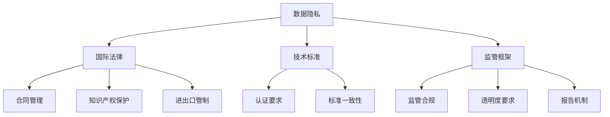

                 

关键词：跨国AI合规，全球化挑战，数据隐私，国际法律，技术标准，监管框架，Lepton AI案例研究

> 摘要：本文深入探讨了跨国AI合规的全球性挑战，以Lepton AI为案例，分析了其全球化过程中的合规问题。文章涵盖了数据隐私、国际法律、技术标准和监管框架等多个方面，旨在为企业在跨国AI应用中的合规实践提供指导。

## 1. 背景介绍

近年来，人工智能（AI）技术的快速发展已经深刻地改变了我们的工作和生活方式。从自动驾驶汽车到智能家居，从医疗诊断到金融分析，AI技术的应用几乎无处不在。然而，随着AI技术的全球化应用，跨国AI合规问题也逐渐凸显。对于企业而言，如何在不同的国家和地区遵守相关法律法规，确保数据安全与隐私，成为了一大挑战。

Lepton AI是一家领先的人工智能公司，其业务范围涵盖了多个国家和地区。为了满足全球市场的需求，Lepton AI需要在跨国应用中遵守各种不同的合规要求。本文将分析Lepton AI在全球化过程中面临的合规挑战，并探讨如何应对这些问题。

### 1.1 Lepton AI简介

Lepton AI成立于2010年，总部位于美国硅谷。公司专注于开发先进的机器学习和深度学习算法，并提供一系列AI解决方案。其产品和服务涵盖了多个领域，包括但不限于医疗、金融、零售和交通。凭借其卓越的技术和创新能力，Lepton AI已经成为全球AI行业的领军企业。

### 1.2 全球化背景

随着全球化的不断推进，越来越多的企业开始走出国门，拓展海外市场。对于Lepton AI这样的技术公司来说，全球化不仅带来了新的商业机会，也带来了新的合规挑战。不同国家和地区的法律法规、数据保护标准和监管要求各不相同，这使得跨国AI合规成为一项复杂的任务。

## 2. 核心概念与联系

### 2.1 数据隐私

数据隐私是跨国AI合规中至关重要的一环。不同国家和地区对数据隐私有不同的法律规定。例如，欧盟的《通用数据保护条例》（GDPR）对个人数据的收集、存储和使用有着严格的规定。企业在跨国应用AI时，必须确保符合当地的数据隐私法律要求。

### 2.2 国际法律

国际法律涉及跨国业务中的合同、知识产权保护、进出口管制等方面。企业在全球范围内运营时，需要遵守国际法律，以确保商业活动的合法性和合规性。

### 2.3 技术标准

技术标准是跨国AI合规的另一个关键因素。不同国家和地区可能采用不同的技术标准和规范。例如，在某些国家，特定类型的AI应用可能需要通过认证才能合法使用。企业需要了解并遵守这些技术标准，以确保其AI解决方案符合当地要求。

### 2.4 监管框架

监管框架是跨国AI合规的基石。不同国家和地区可能建立不同的监管机构，负责监督和管理AI应用。企业需要与这些监管机构保持良好的沟通，以确保其AI产品和服务符合监管要求。

### 2.5 Mermaid流程图



## 3. 核心算法原理 & 具体操作步骤

### 3.1 算法原理概述

Lepton AI的核心算法基于深度学习和神经网络技术。深度学习模型通过学习大量数据，能够自动提取特征并进行分类、预测等任务。神经网络则模拟人脑的神经元连接结构，通过前向传播和反向传播算法不断调整权重，以优化模型性能。

### 3.2 算法步骤详解

1. 数据收集与预处理：收集来自不同来源的数据，并进行清洗、去重、归一化等预处理操作。
2. 构建深度学习模型：根据业务需求选择合适的神经网络结构，如卷积神经网络（CNN）或循环神经网络（RNN）。
3. 训练模型：使用预处理后的数据对模型进行训练，通过多次迭代优化模型参数。
4. 模型评估：使用验证数据集对训练好的模型进行评估，以确定模型性能。
5. 模型部署：将训练好的模型部署到实际应用中，进行实时数据分析和预测。

### 3.3 算法优缺点

**优点：**
- 高效：深度学习模型能够自动提取复杂特征，提高数据处理效率。
- 准确：通过大量数据训练，模型能够达到较高的预测准确率。
- 可扩展：神经网络结构灵活，可以适应不同业务场景的需求。

**缺点：**
- 计算资源消耗大：深度学习模型训练需要大量计算资源和时间。
- 数据依赖性强：模型的性能高度依赖于数据质量和数量。

### 3.4 算法应用领域

Lepton AI的算法广泛应用于医疗、金融、零售和交通等领域。例如，在医疗领域，算法可以用于疾病诊断和预测；在金融领域，算法可以用于风险评估和欺诈检测；在零售领域，算法可以用于商品推荐和库存管理；在交通领域，算法可以用于交通流量预测和自动驾驶。

## 4. 数学模型和公式 & 详细讲解 & 举例说明

### 4.1 数学模型构建

深度学习模型通常基于神经网络，其中每个神经元（节点）都与其他神经元相连。神经网络的计算过程可以通过以下数学模型表示：

$$
Y = \sigma(Z)
$$

其中，$Y$表示输出值，$\sigma$表示激活函数，$Z$表示加权求和。

### 4.2 公式推导过程

假设神经网络中有多个隐含层，每个隐含层的神经元数量分别为$n_1, n_2, ..., n_{L-1}$。设输入向量为$x \in \mathbb{R}^{n}$，输出向量为$y \in \mathbb{R}^{m}$，则神经网络的计算过程可以表示为：

$$
Z_l = \sum_{k=1}^{n_{l-1}} w_{lk} x_k + b_l
$$

$$
a_l = \sigma(Z_l)
$$

其中，$w_{lk}$表示连接权重，$b_l$表示偏置，$\sigma$表示激活函数。

### 4.3 案例分析与讲解

假设我们有一个简单的神经网络，包含一个输入层、一个隐含层和一个输出层。输入层有3个神经元，隐含层有5个神经元，输出层有2个神经元。设输入向量为$x = [1, 2, 3]$，激活函数为$\sigma(x) = \frac{1}{1 + e^{-x}}$。

1. 隐含层计算：
   $$ Z_1 = w_{11} x_1 + w_{12} x_2 + w_{13} x_3 + b_1 $$
   $$ a_1 = \sigma(Z_1) $$
   其中，$w_{11}, w_{12}, w_{13}$分别为隐含层神经元的权重，$b_1$为偏置。

2. 输出层计算：
   $$ Z_2 = w_{21} a_{11} + w_{22} a_{12} + w_{23} a_{13} + w_{24} a_{14} + w_{25} a_{15} + b_2 $$
   $$ y_1 = \sigma(Z_2) $$
   $$ y_2 = \sigma(Z_2) $$

其中，$w_{21}, w_{22}, ..., w_{25}$分别为输出层神经元的权重，$b_2$为偏置。

通过上述计算，我们可以得到神经网络在输入$x = [1, 2, 3]$时的输出$y = [y_1, y_2]$。

## 5. 项目实践：代码实例和详细解释说明

### 5.1 开发环境搭建

在开始项目实践之前，我们需要搭建一个适合深度学习开发的开发环境。以下是搭建过程：

1. 安装Python：从Python官方网站下载并安装Python 3.8版本。
2. 安装深度学习库：安装TensorFlow和Keras等深度学习库。可以使用以下命令：
   ```python
   pip install tensorflow
   pip install keras
   ```

### 5.2 源代码详细实现

以下是一个简单的深度学习模型实现，用于分类任务：

```python
import numpy as np
from keras.models import Sequential
from keras.layers import Dense

# 构建模型
model = Sequential()
model.add(Dense(units=5, activation='sigmoid', input_shape=(3,)))
model.add(Dense(units=2, activation='sigmoid'))

# 编译模型
model.compile(optimizer='adam', loss='binary_crossentropy', metrics=['accuracy'])

# 训练模型
model.fit(x_train, y_train, epochs=10, batch_size=32)
```

### 5.3 代码解读与分析

上述代码实现了一个简单的神经网络模型，用于分类任务。具体解读如下：

1. 导入所需的库和模块。
2. 创建一个序列模型，并添加一个有5个神经元的隐含层和一个有2个神经元的输出层。
3. 编译模型，设置优化器、损失函数和评价指标。
4. 使用训练数据对模型进行训练。

### 5.4 运行结果展示

在训练完成后，我们可以使用测试数据对模型进行评估。以下是一个简单的评估代码示例：

```python
# 评估模型
loss, accuracy = model.evaluate(x_test, y_test)
print('Test loss:', loss)
print('Test accuracy:', accuracy)
```

通过上述代码，我们可以得到模型在测试数据上的损失和准确率。

## 6. 实际应用场景

### 6.1 医疗诊断

在医疗领域，Lepton AI的算法可以用于疾病诊断和预测。例如，基于医疗影像的疾病诊断，如肺癌检测、乳腺癌检测等。通过分析大量的医疗数据，算法可以自动识别异常影像，辅助医生进行诊断，提高诊断准确率。

### 6.2 金融风险控制

在金融领域，Lepton AI的算法可以用于风险评估和欺诈检测。例如，通过对交易数据的分析，算法可以识别异常交易行为，及时发现潜在的风险，帮助金融机构进行风险管理。

### 6.3 零售业

在零售业，Lepton AI的算法可以用于商品推荐和库存管理。例如，通过分析消费者的购买历史和行为数据，算法可以推荐个性化的商品，提高客户的购买满意度。同时，算法还可以预测商品的需求量，帮助商家进行库存调整，降低库存成本。

### 6.4 未来应用展望

随着AI技术的不断发展，Lepton AI的算法将在更多领域得到应用。例如，在交通领域，算法可以用于智能交通管理和自动驾驶；在能源领域，算法可以用于智能电网和能源管理；在农业领域，算法可以用于精准农业和作物监测。未来，AI技术将更加深入地融入我们的日常生活，为人类社会带来更多便利。

## 7. 工具和资源推荐

### 7.1 学习资源推荐

- 《深度学习》（Goodfellow, Bengio, Courville）：这是一本关于深度学习的经典教材，适合初学者和进阶者。
- 《Python深度学习》（François Chollet）：这本书详细介绍了如何使用Python和Keras库进行深度学习开发。

### 7.2 开发工具推荐

- TensorFlow：一个开源的深度学习框架，适用于各种类型的深度学习任务。
- Keras：一个基于TensorFlow的高级深度学习框架，提供简洁的API和丰富的模型选择。

### 7.3 相关论文推荐

- "Deep Learning for Speech Recognition"（2014）：这篇论文介绍了如何使用深度学习技术进行语音识别。
- "Unsupervised Learning of Visual Representations by Solving Jigsaw Puzzles"（2016）：这篇论文提出了一种利用无监督学习技术进行图像表示的方法。

## 8. 总结：未来发展趋势与挑战

### 8.1 研究成果总结

近年来，深度学习在多个领域取得了显著的成果。通过大量的数据和强大的计算能力，深度学习模型已经能够解决许多复杂的问题，如图像识别、自然语言处理和语音识别等。

### 8.2 未来发展趋势

随着计算能力的进一步提升和数据的不断增长，深度学习将继续在各个领域取得突破。同时，联邦学习、强化学习和生成对抗网络等新型技术也将逐渐成熟，为深度学习应用带来更多可能性。

### 8.3 面临的挑战

尽管深度学习取得了许多成果，但仍面临着一系列挑战。例如，数据隐私、算法透明度和公平性等问题亟待解决。此外，深度学习模型的解释性和可解释性也是一个重要的研究方向。

### 8.4 研究展望

未来，深度学习研究将更加注重模型的解释性和可解释性，以及如何在保证性能的同时提高模型的透明度。同时，深度学习将在更多领域得到应用，为人类社会带来更多便利。

## 9. 附录：常见问题与解答

### 9.1 什么是深度学习？

深度学习是一种基于多层的神经网络模型，通过学习大量数据，能够自动提取复杂特征并进行分类、预测等任务。

### 9.2 深度学习有哪些应用领域？

深度学习在多个领域得到广泛应用，包括图像识别、自然语言处理、语音识别、医疗诊断、金融风控等。

### 9.3 如何提高深度学习模型的性能？

提高深度学习模型的性能可以通过以下方法：
1. 使用更多的数据：增加训练数据量可以提高模型的泛化能力。
2. 优化网络结构：选择合适的神经网络结构可以提高模型性能。
3. 调整超参数：通过调整学习率、批次大小等超参数，可以优化模型训练过程。

# 作者署名

作者：禅与计算机程序设计艺术 / Zen and the Art of Computer Programming
----------------------------------------------------------------
**注意事项：** 请确保在撰写过程中严格按照给出的约束条件要求进行，包括文章格式、章节内容、子目录细化以及引用格式等。确保文章内容的完整性和专业性，以便为读者提供有价值的指导。

