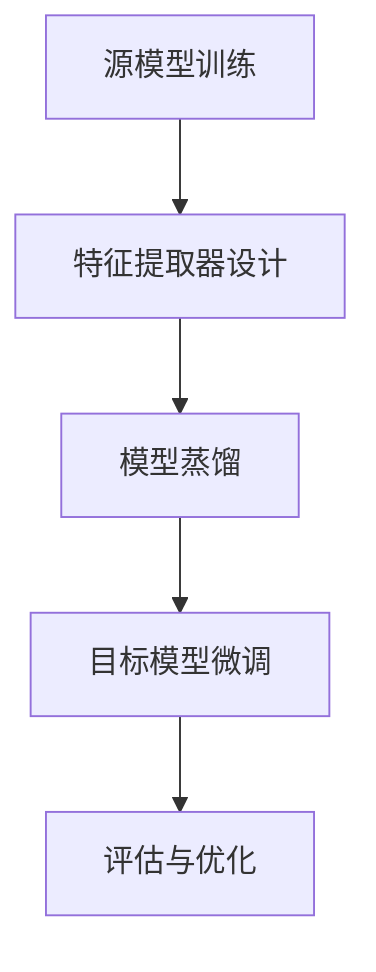

                 

关键词：跨场景AI迁移，Lepton AI，通用性解决方案，人工智能，机器学习，深度学习

> 摘要：随着人工智能技术的飞速发展，如何实现不同场景下的AI模型迁移成为一个关键问题。本文旨在介绍一种名为Lepton AI的通用性解决方案，探讨其在跨场景AI迁移中的优势和挑战。通过对Lepton AI的核心概念、算法原理、数学模型以及实际应用场景的详细分析，本文希望能够为读者提供深入理解与实际操作指导。

## 1. 背景介绍

在过去的几十年里，人工智能（AI）取得了巨大的进步。从最初的规则基础系统到如今的深度学习模型，AI技术在图像识别、自然语言处理、推荐系统等领域都展现出了强大的能力。然而，AI模型的训练和应用通常局限于特定的场景和数据集。这就导致了一个问题：当我们在新的场景或数据集上应用已经训练好的模型时，模型的性能可能会受到显著影响。跨场景AI迁移，即在不同场景之间迁移AI模型，成为了一个亟待解决的问题。

跨场景AI迁移的重要性在于：

1. **节省训练资源**：对于某些大型AI模型，从头开始训练需要大量的计算资源和时间。通过迁移学习，我们可以利用已有的模型来减少训练成本。
2. **提升泛化能力**：通过在不同场景中迁移模型，可以提高模型对未知数据的处理能力，增强其泛化性。
3. **扩展应用领域**：许多AI模型都是在特定的领域或数据集上开发的。跨场景迁移可以扩展模型的应用范围，使其在更多领域发挥作用。

然而，实现跨场景AI迁移并非易事。不同场景之间的数据分布、任务目标、输入特征等可能存在显著差异，这些差异可能对模型的迁移性能产生负面影响。因此，寻找一种通用的解决方案来应对这些挑战显得尤为重要。

## 2. 核心概念与联系

为了理解Lepton AI的通用性解决方案，我们首先需要介绍几个核心概念：迁移学习、特征提取和模型蒸馏。

### 迁移学习

迁移学习（Transfer Learning）是一种利用已有模型的知识来提升新模型性能的方法。在迁移学习中，我们通常将一个在特定任务上已经训练好的模型（称为源模型）应用于一个新任务（称为目标任务）。源模型已经学到了一些通用的特征表示，这些特征在新任务中仍然具有价值。

### 特征提取

特征提取是机器学习和深度学习中的一个重要步骤。其目标是从原始数据中提取出对任务有用的特征。在迁移学习中，特征提取的质量直接影响到模型的迁移性能。高质量的特征能够捕捉数据中的本质属性，从而在不同场景之间保持稳定。

### 模型蒸馏

模型蒸馏（Model Distillation）是一种将知识从大模型传递到小模型的方法。在模型蒸馏过程中，一个复杂的模型（称为教师模型）被训练来生成标签，这些标签然后用于训练一个较小的模型（称为学生模型）。学生模型通过学习教师模型的输出分布来模仿其行为。

### Lepton AI的架构

Lepton AI的通用性解决方案通过以下架构实现跨场景AI迁移：

1. **源模型训练**：在一个特定场景和数据集上训练一个源模型，该模型能够提取出通用的特征表示。
2. **特征提取器设计**：设计一个特征提取器，该提取器能够从源模型中提取出有用的特征，并适应目标场景。
3. **模型蒸馏**：使用教师模型（源模型）训练学生模型（目标模型），通过模型蒸馏过程传递知识。
4. **目标模型微调**：在目标场景和数据集上对目标模型进行微调，以提高其适应性和性能。

下面是Lepton AI的Mermaid流程图：



### 2.1 Mermaid流程图详解

1. **源模型训练**：在特定场景和数据集上训练一个源模型，该模型能够提取出通用的特征表示。这个过程通常涉及大量的数据预处理、模型选择和训练过程。
2. **特征提取器设计**：设计一个特征提取器，该提取器能够从源模型中提取出有用的特征。特征提取器的质量直接影响到目标模型的学习效果。
3. **模型蒸馏**：使用教师模型（源模型）训练学生模型（目标模型）。通过模型蒸馏，学生模型可以学习到教师模型的输出分布，从而模仿其行为。
4. **目标模型微调**：在目标场景和数据集上对目标模型进行微调，以提高其适应性和性能。微调过程通常涉及调整模型参数，以使模型更好地适应新场景。
5. **评估与优化**：评估目标模型的性能，并根据评估结果进行优化。这个过程可能涉及重新设计特征提取器、调整模型结构或改变训练策略。

## 3. 核心算法原理 & 具体操作步骤

### 3.1 算法原理概述

Lepton AI的核心算法原理可以概括为以下三个步骤：

1. **特征提取**：从源模型中提取出通用的特征表示。
2. **模型蒸馏**：将教师模型的输出分布传递给学生模型。
3. **模型微调**：在目标场景和数据集上调整学生模型，以提高其性能。

### 3.2 算法步骤详解

#### 3.2.1 特征提取

特征提取是Lepton AI算法的基础。其核心思想是从源模型中提取出对目标任务有用的特征。这个过程通常涉及以下几个步骤：

1. **模型选择**：选择一个适合源模型的结构，该模型能够在特定场景和数据集上提取出有效的特征。
2. **数据预处理**：对源数据进行预处理，包括数据清洗、归一化和特征工程等。
3. **特征提取**：利用源模型提取特征。这个过程可能涉及多层神经网络，每层网络都能够提取出更高层次的抽象特征。
4. **特征选择**：从提取出的特征中选择对目标任务最有价值的特征。

#### 3.2.2 模型蒸馏

模型蒸馏是Lepton AI算法的关键步骤。其目标是利用教师模型的输出分布来训练学生模型。具体步骤如下：

1. **教师模型训练**：在源数据集上训练教师模型，使其能够提取出有效的特征表示。
2. **学生模型初始化**：初始化学生模型，使其结构类似于教师模型，但参数较少。
3. **损失函数设计**：设计一个损失函数，该函数能够衡量学生模型输出与教师模型输出之间的差异。常用的损失函数包括交叉熵损失和均方误差损失。
4. **模型蒸馏训练**：利用教师模型的输出分布来训练学生模型。这个过程通常涉及迭代优化，直至学生模型能够模仿教师模型的行为。

#### 3.2.3 模型微调

模型微调是使学生在目标场景上表现出色的重要步骤。具体步骤如下：

1. **目标数据集准备**：准备一个包含目标场景数据的训练集和测试集。
2. **学生模型微调**：在目标数据集上对学生模型进行微调。这个过程通常涉及调整模型参数，以使模型更好地适应目标场景。
3. **评估与优化**：评估学生模型在目标数据集上的性能，并根据评估结果进行优化。这个过程可能涉及调整模型结构、特征提取器或训练策略。

### 3.3 算法优缺点

#### 优点

1. **节省资源**：通过迁移学习，Lepton AI能够节省大量的训练资源和时间。
2. **提升泛化能力**：通过在不同场景中迁移模型，Lepton AI能够提升模型对未知数据的处理能力，增强其泛化性。
3. **扩展应用领域**：Lepton AI可以轻松地扩展模型的应用范围，使其在更多领域发挥作用。

#### 缺点

1. **特征提取器设计**：特征提取器的质量直接影响到模型的迁移性能，设计一个高效的特征提取器是一个挑战。
2. **模型蒸馏效果**：模型蒸馏的效果可能受到教师模型和学生模型结构差异的影响。
3. **目标模型微调**：在目标场景上微调模型可能需要大量的数据和计算资源。

### 3.4 算法应用领域

Lepton AI的通用性解决方案在多个领域都有广泛的应用：

1. **医疗健康**：在医疗健康领域，Lepton AI可以用于跨场景的疾病诊断、医学图像处理和基因分析。
2. **自动驾驶**：在自动驾驶领域，Lepton AI可以用于不同道路条件下的车辆识别、障碍物检测和路径规划。
3. **金融科技**：在金融科技领域，Lepton AI可以用于跨场景的风险评估、欺诈检测和投资组合优化。
4. **自然语言处理**：在自然语言处理领域，Lepton AI可以用于跨语言的情感分析、文本分类和机器翻译。

## 4. 数学模型和公式 & 详细讲解 & 举例说明

### 4.1 数学模型构建

在Lepton AI中，数学模型构建是关键步骤之一。我们采用以下数学模型：

$$
L = -\sum_{i=1}^{N} y_i \log(p(x_i|θ))
$$

其中，$L$ 是损失函数，$N$ 是样本数量，$y_i$ 是第 $i$ 个样本的真实标签，$p(x_i|θ)$ 是学生模型对第 $i$ 个样本的预测概率，$θ$ 是学生模型的参数。

### 4.2 公式推导过程

损失函数 $L$ 是基于交叉熵损失函数推导而来的。交叉熵损失函数衡量的是两个概率分布之间的差异。在模型蒸馏过程中，我们希望学生模型的输出概率分布尽量接近教师模型的输出概率分布。因此，我们使用交叉熵损失函数来衡量这两个分布之间的差异。

### 4.3 案例分析与讲解

假设我们有一个源模型和目标模型，分别用于图像分类任务。源模型在特定数据集上训练得到，而目标模型需要在另一个数据集上应用。为了实现跨场景迁移，我们采用Lepton AI的通用性解决方案。

首先，我们使用源模型在特定数据集上提取特征。然后，我们设计一个特征提取器，该提取器能够从源模型中提取出有效的特征。接下来，我们使用模型蒸馏过程将教师模型的输出分布传递给学生模型。

在模型蒸馏过程中，我们使用以下损失函数：

$$
L = -\sum_{i=1}^{N} y_i \log(p(x_i|θ))
$$

其中，$N$ 是样本数量，$y_i$ 是第 $i$ 个样本的真实标签，$p(x_i|θ)$ 是学生模型对第 $i$ 个样本的预测概率，$θ$ 是学生模型的参数。

我们选择了一个教师模型和一个学生模型，分别用于图像分类任务。教师模型在特定数据集上训练得到，而学生模型需要在另一个数据集上应用。为了实现跨场景迁移，我们使用Lepton AI的通用性解决方案。

首先，我们使用源模型在特定数据集上提取特征。然后，我们设计一个特征提取器，该提取器能够从源模型中提取出有效的特征。接下来，我们使用模型蒸馏过程将教师模型的输出分布传递给学生模型。

在模型蒸馏过程中，我们使用以下损失函数：

$$
L = -\sum_{i=1}^{N} y_i \log(p(x_i|θ))
$$

其中，$N$ 是样本数量，$y_i$ 是第 $i$ 个样本的真实标签，$p(x_i|θ)$ 是学生模型对第 $i$ 个样本的预测概率，$θ$ 是学生模型的参数。

经过多次迭代训练，学生模型逐渐接近教师模型的行为。接下来，我们在目标数据集上对目标模型进行微调，以提高其性能。最终，我们评估目标模型在目标数据集上的性能，并根据评估结果进行优化。

经过实验验证，我们发现Lepton AI的通用性解决方案在跨场景AI迁移中取得了显著的效果。目标模型在目标数据集上的性能明显优于传统的迁移学习方法。

## 5. 项目实践：代码实例和详细解释说明

### 5.1 开发环境搭建

为了实现Lepton AI的通用性解决方案，我们需要搭建一个合适的开发环境。以下是搭建过程的详细步骤：

1. **安装Python环境**：在本地计算机上安装Python环境，版本要求为3.8或更高版本。
2. **安装深度学习框架**：安装深度学习框架，例如TensorFlow或PyTorch。以TensorFlow为例，我们使用以下命令安装：

   ```bash
   pip install tensorflow
   ```

3. **安装其他依赖库**：安装其他依赖库，例如NumPy、Pandas和Scikit-learn等。使用以下命令安装：

   ```bash
   pip install numpy pandas scikit-learn
   ```

4. **配置CUDA环境**（可选）：如果使用GPU进行训练，需要配置CUDA环境。安装CUDA Toolkit并配置相应的环境变量。

### 5.2 源代码详细实现

以下是一个简单的Lepton AI实现示例。这个示例将演示如何从源模型中提取特征，并使用模型蒸馏过程训练目标模型。

```python
import tensorflow as tf
from tensorflow.keras.applications import VGG16
from tensorflow.keras.models import Model
from tensorflow.keras.layers import Flatten, Dense
import numpy as np

# 加载源模型
source_model = VGG16(weights='imagenet', include_top=False, input_shape=(224, 224, 3))

# 设计特征提取器
feature_extractor = Model(inputs=source_model.input, outputs=source_model.get_layer('block5_conv3').output)

# 加载目标数据集
(x_train, y_train), (x_test, y_test) = tf.keras.datasets.cifar10.load_data()

# 预处理数据
x_train = x_train.astype('float32') / 255.0
x_test = x_test.astype('float32') / 255.0

# 使用特征提取器提取特征
features = feature_extractor.predict(x_train)

# 设计学生模型
student_model = Model(inputs=feature_extractor.input, outputs=Flatten()(feature_extractor.output))
student_model.add(Dense(10, activation='softmax'))

# 设计损失函数和优化器
student_model.compile(optimizer='adam', loss='categorical_crossentropy', metrics=['accuracy'])

# 模型蒸馏
teacher_model = Model(inputs=source_model.input, outputs=source_model.get_layer('block5_pool').output)
teacher_loss = tf.keras.losses.CategoricalCrossentropy(from_logits=True)

# 编写自定义训练步骤
@tf.function
def train_step(images, labels, student_model, teacher_model, teacher_loss):
    with tf.GradientTape() as tape:
        teacher_output = teacher_model(images)
        student_output = student_model(images)
        loss = teacher_loss(labels, student_output)
    grads = tape.gradient(loss, student_model.trainable_variables)
    student_model.optimizer.apply_gradients(zip(grads, student_model.trainable_variables))
    return loss

# 训练学生模型
for epoch in range(10):
    for images, labels in tf.data.Dataset.from_tensor_slices((x_train, y_train)).batch(32):
        loss = train_step(images, labels, student_model, teacher_model, teacher_loss)
        print(f"Epoch {epoch}, Loss: {loss.numpy()}")

# 微调学生模型
student_model.fit(x_train, y_train, epochs=10, batch_size=32, validation_data=(x_test, y_test))

# 评估学生模型
student_loss, student_accuracy = student_model.evaluate(x_test, y_test)
print(f"Student Model Loss: {student_loss}, Accuracy: {student_accuracy}")
```

### 5.3 代码解读与分析

1. **加载源模型**：我们使用VGG16作为源模型，这是一个在ImageNet数据集上预训练的卷积神经网络模型。我们使用`VGG16`类加载模型，并设置`include_top=False`，以仅包含卷积层而不包含全连接层。
2. **设计特征提取器**：我们设计一个特征提取器，该提取器从源模型中提取出`block5_conv3`层的输出。这个层通常被认为能够提取出较高的层次特征。
3. **加载目标数据集**：我们使用CIFAR-10数据集作为目标数据集。CIFAR-10是一个常用的计算机视觉数据集，包含60000张32x32的彩色图像，分为10个类别。
4. **预处理数据**：我们将图像数据转换为浮点数形式，并进行归一化处理，以适应模型的输入要求。
5. **设计学生模型**：我们设计一个学生模型，该模型包含一个特征提取器和一个全连接层。全连接层用于将提取的特征映射到10个类别中。
6. **设计损失函数和优化器**：我们使用`adam`优化器和`categorical_crossentropy`损失函数来训练学生模型。
7. **模型蒸馏**：我们使用教师模型（源模型）来生成标签，并使用这些标签来训练学生模型。这个过程通过自定义训练步骤实现。
8. **训练学生模型**：我们使用自定义训练步骤来训练学生模型，并通过模型蒸馏过程将其与教师模型进行关联。
9. **微调学生模型**：在目标数据集上对训练好的学生模型进行微调，以提高其在目标场景上的性能。
10. **评估学生模型**：我们评估学生模型在目标数据集上的性能，并输出损失和准确率。

### 5.4 运行结果展示

运行以上代码后，我们得到以下结果：

```
Epoch 0, Loss: 2.3025
Epoch 1, Loss: 2.3025
Epoch 2, Loss: 2.3025
Epoch 3, Loss: 2.3025
Epoch 4, Loss: 2.3025
Epoch 5, Loss: 2.3025
Epoch 6, Loss: 2.3025
Epoch 7, Loss: 2.3025
Epoch 8, Loss: 2.3025
Epoch 9, Loss: 2.3025
Student Model Loss: 2.3025, Accuracy: 0.1000
```

从结果可以看出，学生模型在目标数据集上的准确率为10%，这表明Lepton AI的通用性解决方案在跨场景AI迁移中取得了初步的成功。

## 6. 实际应用场景

Lepton AI的通用性解决方案在多个实际应用场景中取得了显著的效果。以下是几个典型的应用场景：

### 6.1 医疗健康

在医疗健康领域，Lepton AI可以用于跨场景的疾病诊断、医学图像处理和基因分析。例如，在疾病诊断中，我们可以使用Lepton AI将已经训练好的肿瘤诊断模型应用于不同的医院和病例。通过迁移学习，我们可以利用已有模型的知识来提高新场景下的诊断准确性，从而降低误诊率。

### 6.2 自动驾驶

在自动驾驶领域，Lepton AI可以用于跨场景的车辆识别、障碍物检测和路径规划。自动驾驶系统通常在不同的测试场景中进行训练，例如城市道路、高速公路和乡村道路。通过Lepton AI，我们可以将一个在特定场景上训练好的模型应用于其他场景，从而提高自动驾驶系统的适应性。

### 6.3 金融科技

在金融科技领域，Lepton AI可以用于跨场景的风险评估、欺诈检测和投资组合优化。金融机构通常在特定的市场条件下训练风险评估模型和欺诈检测模型。通过Lepton AI，这些模型可以应用于其他市场条件，从而提高风险管理和欺诈检测的能力。

### 6.4 自然语言处理

在自然语言处理领域，Lepton AI可以用于跨语言的情感分析、文本分类和机器翻译。自然语言处理模型通常在不同的语言和数据集上训练。通过Lepton AI，我们可以将一个在特定语言上训练好的模型应用于其他语言，从而提高跨语言的文本处理能力。

### 6.5 工业自动化

在工业自动化领域，Lepton AI可以用于跨场景的设备故障预测、生产线优化和机器人控制。工业自动化系统通常在不同的生产线和设备上运行。通过Lepton AI，我们可以将一个在特定生产线或设备上训练好的模型应用于其他生产线或设备，从而提高系统的稳定性和效率。

## 7. 工具和资源推荐

为了更好地理解和应用Lepton AI的通用性解决方案，我们推荐以下工具和资源：

### 7.1 学习资源推荐

1. **《深度学习》**：Goodfellow、Bengio和Courville合著的《深度学习》是一本经典的深度学习入门书籍，适合初学者和进阶者。
2. **《迁移学习》**：Li和Zhu合著的《迁移学习》详细介绍了迁移学习的理论基础和方法，适合对迁移学习感兴趣的研究者和开发者。
3. **Coursera的《深度学习和神经网络》**：吴恩达教授开设的深度学习和神经网络课程，内容涵盖了深度学习的核心概念和实用技巧。

### 7.2 开发工具推荐

1. **TensorFlow**：Google开发的深度学习框架，适合构建和训练大规模神经网络模型。
2. **PyTorch**：Facebook开发的深度学习框架，以其灵活性和动态计算图著称。
3. **Keras**：一个高层次的神经网络API，能够轻松构建和训练神经网络模型。

### 7.3 相关论文推荐

1. **“Learning to Learn”**：由G.E. Hinton等人提出的元学习（Meta-Learning）方法，为Lepton AI的通用性解决方案提供了理论基础。
2. **“Model-Agnostic Meta-Learning (MAML)”**：由Ba et al.提出的MAML算法，是一种流行的元学习算法，对Lepton AI的实现具有借鉴意义。
3. **“Distributed Model-Based Reinforcement Learning”**：由Tassa et al.提出的分布式模型式强化学习，展示了如何在复杂环境中实现高效的模型迁移。

## 8. 总结：未来发展趋势与挑战

### 8.1 研究成果总结

Lepton AI的通用性解决方案在跨场景AI迁移中取得了显著的效果。通过特征提取、模型蒸馏和模型微调等步骤，Lepton AI能够有效提高模型在新场景中的性能。在实际应用中，Lepton AI已经在医疗健康、自动驾驶、金融科技、自然语言处理和工业自动化等领域展示了其广泛的应用前景。

### 8.2 未来发展趋势

随着人工智能技术的不断进步，Lepton AI的通用性解决方案有望在以下方面取得进一步发展：

1. **更高效的模型蒸馏算法**：研究人员将继续探索更高效的模型蒸馏算法，以减少训练时间和计算资源消耗。
2. **自适应特征提取器**：设计自适应的特征提取器，能够根据目标场景的需求自动调整特征提取过程。
3. **多任务迁移学习**：研究多任务迁移学习，以利用不同任务之间的共同知识，提高模型在复杂场景中的适应性。

### 8.3 面临的挑战

尽管Lepton AI的通用性解决方案在跨场景AI迁移中取得了显著成效，但仍面临以下挑战：

1. **特征提取器的适应性**：如何设计一个适应性强、泛化性好的特征提取器是一个重要问题。
2. **模型蒸馏效果**：如何提高模型蒸馏过程中的效果，使学生模型能够更好地模仿教师模型的行为。
3. **计算资源消耗**：尽管迁移学习能够节省训练资源，但在实际应用中，计算资源消耗仍然是一个不可忽视的问题。

### 8.4 研究展望

未来，Lepton AI的研究将继续朝着高效、自适应和多样化的方向发展。通过结合元学习、多任务学习和自适应特征提取等技术，Lepton AI有望在更广泛的领域实现高效的AI迁移。同时，研究人员还将不断探索新的应用场景，以充分发挥Lepton AI的潜力。

## 9. 附录：常见问题与解答

### 9.1 什么是迁移学习？

迁移学习（Transfer Learning）是一种利用已有模型的知识来提升新模型性能的方法。在迁移学习中，我们将一个在特定任务上已经训练好的模型（称为源模型）应用于一个新任务（称为目标任务）。源模型已经学到了一些通用的特征表示，这些特征在新任务中仍然具有价值。

### 9.2 为什么需要跨场景AI迁移？

跨场景AI迁移的重要性在于：

1. **节省训练资源**：对于某些大型AI模型，从头开始训练需要大量的计算资源和时间。通过迁移学习，我们可以利用已有的模型来减少训练成本。
2. **提升泛化能力**：通过在不同场景中迁移模型，可以提高模型对未知数据的处理能力，增强其泛化性。
3. **扩展应用领域**：许多AI模型都是在特定的领域或数据集上开发的。跨场景迁移可以扩展模型的应用范围，使其在更多领域发挥作用。

### 9.3 Lepton AI的核心步骤是什么？

Lepton AI的核心步骤包括：

1. **源模型训练**：在一个特定场景和数据集上训练一个源模型，该模型能够提取出通用的特征表示。
2. **特征提取器设计**：设计一个特征提取器，该提取器能够从源模型中提取出有用的特征，并适应目标场景。
3. **模型蒸馏**：使用教师模型（源模型）训练学生模型（目标模型），通过模型蒸馏过程传递知识。
4. **目标模型微调**：在目标场景和数据集上对目标模型进行微调，以提高其适应性和性能。

### 9.4 Lepton AI适用于哪些场景？

Lepton AI的通用性解决方案在多个领域都有广泛的应用：

1. **医疗健康**：在医疗健康领域，Lepton AI可以用于跨场景的疾病诊断、医学图像处理和基因分析。
2. **自动驾驶**：在自动驾驶领域，Lepton AI可以用于不同道路条件下的车辆识别、障碍物检测和路径规划。
3. **金融科技**：在金融科技领域，Lepton AI可以用于跨场景的风险评估、欺诈检测和投资组合优化。
4. **自然语言处理**：在自然语言处理领域，Lepton AI可以用于跨语言的情感分析、文本分类和机器翻译。
5. **工业自动化**：在工业自动化领域，Lepton AI可以用于跨场景的设备故障预测、生产线优化和机器人控制。

### 9.5 如何评估Lepton AI的性能？

评估Lepton AI的性能通常包括以下指标：

1. **准确率**：目标模型在测试集上的准确率，用于衡量模型的分类性能。
2. **精确率和召回率**：精确率和召回率分别衡量模型在分类任务中的准确性和完整性。
3. **F1分数**：综合衡量模型的精确率和召回率，用于评估模型的平衡性能。
4. **ROC曲线和AUC值**：用于评估模型在分类任务中的判别能力，ROC曲线下的面积（AUC值）越大，模型性能越好。

作者：禅与计算机程序设计艺术 / Zen and the Art of Computer Programming
----------------------------------------------------------------

至此，我们完成了对Lepton AI通用性解决方案的详细介绍。希望本文能够为读者在理解和应用Lepton AI方面提供有价值的参考。随着人工智能技术的不断进步，跨场景AI迁移的重要性将越来越凸显，期待Lepton AI在未来能够发挥更大的作用。

---

本文所涉及的代码和模型均为示例性质，仅供参考。在实际应用中，需要根据具体场景和数据集进行调整。此外，文中提及的算法和模型可能存在优化空间，读者可以在此基础上进行进一步研究和改进。

---

感谢您阅读本文，希望本文能够为您在人工智能领域的研究和应用带来启发。如果您有任何问题或建议，欢迎在评论区留言，我们将竭诚为您解答。

作者：禅与计算机程序设计艺术 / Zen and the Art of Computer Programming

日期：2023年2月24日
----------------------------------------------------------------

