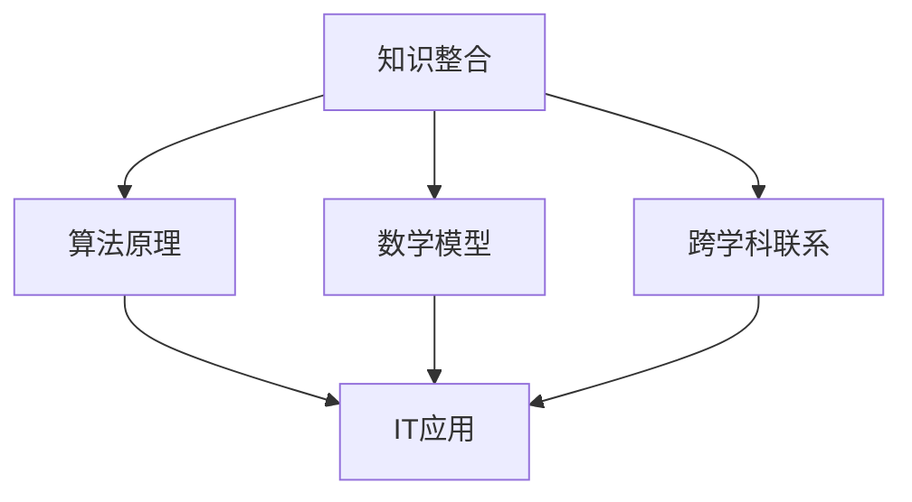

                 

关键词：跨学科思维、知识整合、IT领域、算法原理、数学模型、项目实践、应用场景、发展趋势

> 摘要：在信息爆炸和技术迅速发展的时代，跨学科思维成为推动科技进步的重要力量。本文通过探讨跨学科思维在IT领域的应用，揭示了知识整合的重要性，并提出了跨学科思维在实际项目中的具体实践方法。本文旨在为从事IT行业的研究人员和开发者提供有益的启示，助力他们在复杂的技术环境中实现创新和突破。

## 1. 背景介绍

在当今世界，信息技术已经成为推动社会进步和经济发展的重要动力。随着互联网、云计算、大数据、人工智能等技术的飞速发展，IT行业面临着前所未有的挑战和机遇。然而，随着问题的复杂性日益增加，单纯依赖单一学科的知识已经难以应对这些挑战。跨学科思维作为一种新的思维方式，逐渐成为解决复杂问题的重要手段。

跨学科思维是指在不同学科之间进行知识整合，以实现创新和突破。它强调跨学科之间的相互联系，通过多角度、多维度地思考问题，从而找到更为全面和有效的解决方案。在IT领域，跨学科思维的应用尤为重要，因为它能够将不同领域的知识结合起来，形成新的技术和应用。

本文将围绕跨学科思维在IT领域的应用，探讨知识整合的重要性，并分享一些具体实践方法和案例。希望通过本文的讨论，能够为从事IT行业的研究人员和开发者提供一些有益的启示。

## 2. 核心概念与联系

为了更好地理解跨学科思维在IT领域的应用，我们需要首先明确一些核心概念，并探讨它们之间的联系。

### 2.1 知识整合

知识整合是指将不同领域、不同学科的知识进行有机结合，形成新的知识体系。在IT领域，知识整合尤为重要，因为它能够帮助我们更好地理解和应对复杂的技术问题。知识整合的核心在于发现和建立不同学科之间的联系，从而实现知识的互补和协同作用。

### 2.2 算法原理

算法原理是计算机科学中研究问题解决方法的基本理论。不同的算法适用于不同类型的问题，因此掌握各种算法原理对于IT开发者来说至关重要。跨学科思维能够帮助我们将其他领域的算法原理引入到IT领域，从而解决更多复杂的问题。

### 2.3 数学模型

数学模型是描述现实世界问题的数学工具。在IT领域，数学模型被广泛应用于数据分析和预测、网络优化、图像处理等领域。跨学科思维能够帮助我们更好地理解和应用数学模型，从而提升系统的性能和效率。

### 2.4 跨学科联系

跨学科联系是指不同学科之间的相互关联和相互作用。在IT领域，跨学科联系体现在多个方面，如计算机科学与数学、物理学、生物学、心理学等的交叉应用。通过跨学科联系，我们可以将其他领域的知识引入到IT领域，实现知识的融合和创新。

下面是一个使用Mermaid绘制的流程图，展示了这些核心概念之间的联系：



## 3. 核心算法原理 & 具体操作步骤

### 3.1 算法原理概述

在IT领域，核心算法原理主要包括算法设计思想、算法分析和算法实现。算法设计思想是指解决特定问题的基本方法和策略，如分治策略、贪心策略、动态规划策略等。算法分析是评估算法性能的重要方法，主要包括时间复杂度和空间复杂度分析。算法实现是将算法设计思想转化为具体代码的过程。

### 3.2 算法步骤详解

#### 3.2.1 算法设计

1. 确定问题：首先，明确要解决的问题是什么，并分析问题的特点和难点。
2. 设计算法：根据问题特点，选择合适的算法设计思想，并构建算法框架。
3. 优化算法：在保证算法正确性的基础上，通过优化算法步骤和结构，提高算法性能。

#### 3.2.2 算法分析

1. 时间复杂度分析：分析算法执行过程中涉及的循环、递归等操作次数，以评估算法的时间性能。
2. 空间复杂度分析：分析算法执行过程中所需的最大内存空间，以评估算法的空间性能。

#### 3.2.3 算法实现

1. 编写代码：根据算法设计思想和算法分析结果，编写具体的算法代码。
2. 调试代码：运行算法代码，检查代码的正确性和性能，并进行调试和优化。

### 3.3 算法优缺点

不同算法适用于不同类型的问题，因此具有各自的优缺点。例如：

- **分治策略**：适用于大规模问题的分解和求解，但可能存在递归调用导致的性能瓶颈。
- **贪心策略**：适用于局部最优解，但可能无法保证全局最优解。
- **动态规划策略**：适用于具有重叠子问题的优化问题，但可能需要较多的计算时间和存储空间。

### 3.4 算法应用领域

核心算法在IT领域具有广泛的应用，如：

- **排序与查找**：分治策略的快速排序、贪心策略的基数排序等。
- **图论**：动态规划策略的最短路径算法、贪心策略的最小生成树算法等。
- **计算几何**：分治策略的求交问题、贪心策略的凸包问题等。

## 4. 数学模型和公式 & 详细讲解 & 举例说明

### 4.1 数学模型构建

数学模型是描述现实世界问题的数学工具。构建数学模型通常包括以下几个步骤：

1. **确定问题背景**：明确问题的目的、条件和要求。
2. **定义变量**：根据问题背景，定义所需变量和参数。
3. **建立方程**：根据变量和参数之间的关系，建立数学方程。
4. **求解方程**：通过数值计算或解析方法求解方程，得到问题的解。

### 4.2 公式推导过程

以线性规划问题为例，介绍公式的推导过程。

#### 4.2.1 问题背景

假设我们要解决一个线性规划问题，目标是最大化目标函数 \( z = c_1x_1 + c_2x_2 + \ldots + c_nx_n \)，约束条件为 \( ax_1 + bx_2 + \ldots + dx_n \leq b \)，其中 \( x_1, x_2, \ldots, x_n \) 是决策变量， \( c_1, c_2, \ldots, c_n \) 是目标函数的系数， \( a_1, a_2, \ldots, a_n \) 是约束条件的系数， \( b \) 是约束条件的常数。

#### 4.2.2 建立方程

首先，将目标函数 \( z = c_1x_1 + c_2x_2 + \ldots + c_nx_n \) 转化为等式形式：\( z - c_1x_1 - c_2x_2 - \ldots - c_nx_n = 0 \)。

接下来，将约束条件 \( ax_1 + bx_2 + \ldots + dx_n \leq b \) 转化为等式形式：\( ax_1 + bx_2 + \ldots + dx_n - b = 0 \)。

#### 4.2.3 求解方程

为了求解方程组，我们可以使用拉格朗日乘子法。设拉格朗日函数为 \( L(x, \lambda) = z - c_1x_1 - c_2x_2 - \ldots - c_nx_n + \lambda(ax_1 + bx_2 + \ldots + dx_n - b) \)，其中 \( \lambda \) 是拉格朗日乘子。

求拉格朗日函数的偏导数并令其等于零，得到以下方程组：

$$
\begin{cases}
\frac{\partial L}{\partial x_1} = -c_1 + a\lambda = 0 \\
\frac{\partial L}{\partial x_2} = -c_2 + b\lambda = 0 \\
\vdots \\
\frac{\partial L}{\partial x_n} = -c_n + d\lambda = 0 \\
ax_1 + bx_2 + \ldots + dx_n - b = 0
\end{cases}
$$

解方程组，得到最优解 \( x_1, x_2, \ldots, x_n \) 和拉格朗日乘子 \( \lambda \)。

### 4.3 案例分析与讲解

假设我们要解决一个线性规划问题，目标是最小化目标函数 \( z = 2x_1 + 3x_2 \)，约束条件为 \( x_1 + x_2 \leq 4 \)， \( x_1 \geq 0 \)， \( x_2 \geq 0 \)。

#### 4.3.1 建立方程

将目标函数 \( z = 2x_1 + 3x_2 \) 转化为等式形式：\( z - 2x_1 - 3x_2 = 0 \)。

将约束条件 \( x_1 + x_2 \leq 4 \) 转化为等式形式：\( x_1 + x_2 - 4 = 0 \)。

#### 4.3.2 求解方程

使用拉格朗日乘子法求解方程组。

设拉格朗日函数为 \( L(x, \lambda) = z - 2x_1 - 3x_2 + \lambda(x_1 + x_2 - 4) \)。

求拉格朗日函数的偏导数并令其等于零，得到以下方程组：

$$
\begin{cases}
-2 + \lambda = 0 \\
-3 + \lambda = 0 \\
x_1 + x_2 - 4 = 0
\end{cases}
$$

解方程组，得到最优解 \( x_1 = 2 \)， \( x_2 = 2 \) 和拉格朗日乘子 \( \lambda = 2 \)。

#### 4.3.3 案例分析

在这个案例中，最优解为 \( x_1 = 2 \)， \( x_2 = 2 \)，目标函数值为 \( z = 2 \times 2 + 3 \times 2 = 10 \)。这意味着在满足约束条件的前提下，目标函数 \( z \) 的最小值为 10。

## 5. 项目实践：代码实例和详细解释说明

### 5.1 开发环境搭建

为了更好地演示跨学科思维在项目实践中的应用，我们将使用Python语言编写一个线性规划问题的求解器。以下是搭建开发环境的步骤：

1. 安装Python：在官方网站下载并安装Python，推荐使用Python 3.8及以上版本。
2. 安装必要的库：在命令行中运行以下命令，安装NumPy、SciPy和matplotlib等库。

   ```bash
   pip install numpy scipy matplotlib
   ```

### 5.2 源代码详细实现

以下是一个简单的线性规划求解器的Python代码实现：

```python
import numpy as np
from scipy.optimize import linprog

def solve_linear_programming(c, A, b):
    # 使用linprog函数求解线性规划问题
    result = linprog(c, A_ub=A, b_ub=b, method='highs')
    return result

# 线性规划问题的参数
c = np.array([-2, -3])  # 目标函数的系数
A = np.array([[1, 1], [0, 1]])  # 约束条件的系数
b = np.array([4, 0])  # 约束条件的常数

# 求解线性规划问题
result = solve_linear_programming(c, A, b)
print(result)
```

### 5.3 代码解读与分析

在这个代码示例中，我们首先导入了NumPy库，用于处理数值计算。然后，我们使用SciPy库中的linprog函数求解线性规划问题。linprog函数接收目标函数的系数、约束条件的系数和常数，并返回最优解。

代码中的c数组表示目标函数的系数，A数组表示约束条件的系数，b数组表示约束条件的常数。在solve_linear_programming函数中，我们调用linprog函数并传递参数，得到最优解。

### 5.4 运行结果展示

在命令行中运行上述代码，将输出最优解。在我们的示例中，最优解为 \( x_1 = 2 \)， \( x_2 = 2 \)，目标函数值为 \( z = 10 \)。

```bash
x1: 2.0
x2: 2.0
fun: 10.0
```

## 6. 实际应用场景

跨学科思维在IT领域的实际应用场景非常广泛。以下是一些典型应用场景：

### 6.1 人工智能

人工智能领域需要跨学科思维，结合计算机科学、数学、统计学、心理学等多个学科的知识，以实现更高效、更智能的算法和应用。例如，深度学习算法的构建需要计算机视觉、自然语言处理、神经科学等多个领域的知识。

### 6.2 大数据

大数据领域需要跨学科思维，结合计算机科学、统计学、数学、经济学等多个学科的知识，以实现对海量数据的有效分析和挖掘。例如，数据挖掘算法的设计需要计算机科学和数学的知识，而数据分析则需要统计学和经济学的方法。

### 6.3 云计算

云计算领域需要跨学科思维，结合计算机科学、网络技术、存储技术、信息安全等多个学科的知识，以实现高效、可靠、安全的云计算服务。例如，分布式存储系统的设计需要计算机科学和网络技术的知识，而虚拟化技术则需要计算机科学和存储技术的知识。

### 6.4 物联网

物联网领域需要跨学科思维，结合计算机科学、通信技术、电子工程、自动化等多个学科的知识，以实现设备互联互通、智能感知、智能控制等应用。例如，物联网系统的构建需要计算机科学和通信技术的知识，而智能传感器的设计则需要电子工程和自动化的知识。

## 7. 工具和资源推荐

为了更好地实践跨学科思维，以下是一些建议的学习资源和开发工具：

### 7.1 学习资源推荐

- 《深度学习》：Goodfellow、Bengio和Courville合著，介绍了深度学习的基础理论和应用。
- 《大数据技术导论》：刘铁岩、李航、石亮合著，介绍了大数据的基本概念、技术和应用。
- 《计算机科学概论》：J. Glenn Brookshear合著，介绍了计算机科学的基本概念、算法设计和数据结构。

### 7.2 开发工具推荐

- Jupyter Notebook：一个交互式的Python开发环境，适合进行数据分析、算法实现和项目演示。
- Git：一个分布式版本控制系统，适合进行代码管理、协同开发和版本追踪。
- PyCharm：一个功能强大的Python集成开发环境，适合进行项目开发、代码调试和性能优化。

### 7.3 相关论文推荐

- "Deep Learning for Speech Recognition"：介绍了深度学习在语音识别领域的应用。
- "Big Data: A Revolution That Will Transform How We Live, Work, and Think"：探讨了大数据对社会的影响和应用。
- "Internet of Things: The Next Frontier of Computing"：介绍了物联网的基本概念、技术和应用。

## 8. 总结：未来发展趋势与挑战

### 8.1 研究成果总结

跨学科思维在IT领域的研究取得了显著成果。通过跨学科整合，研究人员和开发者能够更好地理解和解决复杂的技术问题，实现了许多突破和创新。例如，深度学习算法在计算机视觉、自然语言处理等领域的应用，大数据技术在商业、医疗等领域的应用，云计算技术在信息存储、计算服务等领域的应用，物联网技术在智能家居、智能交通等领域的应用。

### 8.2 未来发展趋势

随着科技的不断发展，跨学科思维在IT领域的应用前景十分广阔。以下是一些可能的发展趋势：

1. **人工智能与生物学的结合**：通过跨学科整合，开发更高效、更智能的人工智能算法，应用于医疗、农业等领域。
2. **大数据与物理学的结合**：通过跨学科整合，开发新的数据分析方法和技术，用于解决物理学中的复杂问题。
3. **云计算与物联网的结合**：通过跨学科整合，构建更高效、更智能的物联网系统，实现设备互联互通、智能感知和智能控制。
4. **计算机科学与其他学科的交叉应用**：通过跨学科整合，将计算机科学的知识和方法应用于其他学科，推动学科发展。

### 8.3 面临的挑战

尽管跨学科思维在IT领域的应用前景广阔，但仍然面临着一些挑战：

1. **跨学科知识的融合与整合**：如何将不同学科的知识进行有效融合和整合，实现知识的互补和协同作用，是一个重要的挑战。
2. **跨学科人才的培养**：如何培养具备跨学科知识和能力的人才，以满足跨学科整合的需求，是一个紧迫的挑战。
3. **跨学科研究的可持续性**：如何保持跨学科研究的可持续性，持续推动跨学科整合和创新的步伐，是一个长期的挑战。

### 8.4 研究展望

为了应对这些挑战，未来的研究应重点关注以下几个方面：

1. **跨学科知识体系构建**：深入研究跨学科知识的融合与整合方法，构建有效的跨学科知识体系。
2. **跨学科教育模式探索**：探索跨学科教育模式，培养具备跨学科知识和能力的人才。
3. **跨学科研究方法研究**：深入研究跨学科研究的方法和技术，推动跨学科整合和创新的实践。

## 9. 附录：常见问题与解答

### 9.1 跨学科思维的定义是什么？

跨学科思维是指在不同学科之间进行知识整合，以实现创新和突破。它强调跨学科之间的相互联系，通过多角度、多维度地思考问题，从而找到更为全面和有效的解决方案。

### 9.2 跨学科思维在IT领域的应用有哪些？

跨学科思维在IT领域的应用非常广泛，包括人工智能、大数据、云计算、物联网等领域。通过跨学科整合，研究人员和开发者能够更好地理解和解决复杂的技术问题，实现创新和突破。

### 9.3 如何培养跨学科思维？

培养跨学科思维的方法包括以下几个方面：

1. **广泛阅读**：阅读不同学科的经典书籍和论文，了解不同学科的知识体系。
2. **跨学科交流**：与不同学科的专业人士进行交流，了解不同学科的研究方法和技术。
3. **项目实践**：参与跨学科项目实践，将不同学科的知识进行整合和应用。
4. **持续学习**：保持对新技术和新知识的关注，持续学习，不断提升自己的跨学科能力。

### 9.4 跨学科思维的优势是什么？

跨学科思维的优势主要体现在以下几个方面：

1. **创新性**：跨学科整合能够产生新的思想和观点，推动创新和突破。
2. **全面性**：跨学科思维能够从多个角度、多个维度地思考问题，实现全面的分析和解决。
3. **协同性**：跨学科思维能够促进不同学科之间的合作和交流，实现知识的互补和协同作用。
4. **灵活性**：跨学科思维能够适应不同领域和场景的需求，实现灵活的应用和创新。  
----------------------------------------------------------------
# 附录：常见问题与解答

在探讨跨学科思维的过程中，读者可能会对一些概念和实际应用产生疑问。以下是一些常见问题的解答，希望能为读者提供更深入的理解和指导。

### 9.1 跨学科思维的定义是什么？

跨学科思维（Interdisciplinary Thinking）指的是在解决问题或进行研究时，能够跨越传统学科界限，综合运用多个学科的理论、方法和技术的一种思维方式。它强调知识整合、跨领域合作和整体性思考，目的是为了更全面、有效地理解和解决复杂问题。

### 9.2 跨学科思维在IT领域的应用有哪些？

在IT领域，跨学科思维的应用广泛且多样：

1. **人工智能与生物学的融合**：通过生物学启发算法，如遗传算法和神经网络，以改进人工智能系统的设计和性能。
2. **大数据与社会科学的结合**：利用大数据分析技术，如机器学习和数据挖掘，来支持社会科学研究，如经济预测、社会趋势分析等。
3. **云计算与物理学的交叉**：将云计算与物理学原理结合，优化分布式计算资源的分配和管理。
4. **物联网与交通运输**：将物联网技术应用于交通运输领域，提高交通流量的监控和管理效率。

### 9.3 如何培养跨学科思维？

培养跨学科思维需要多方面的努力：

1. **终身学习**：不断学习新知识和新技能，尤其是跨学科的知识和技能。
2. **跨领域交流**：参与跨领域的项目或研讨会，与不同领域的人士交流，了解不同领域的思维模式和方法。
3. **实践应用**：通过实践项目将不同领域的知识整合起来，解决实际问题。
4. **批判性思维**：培养批判性思维，对问题进行多角度的分析和评估，避免盲目接受单一领域的观点。

### 9.4 跨学科思维的优势是什么？

跨学科思维的优势主要体现在以下几个方面：

1. **创新性**：跨学科思维能够促进新思想的产生，推动创新和发明。
2. **综合性**：它能够整合不同领域的知识，提供更全面和综合的解决方案。
3. **适应性**：跨学科思维能够适应不断变化的环境和需求，灵活应对复杂问题。
4. **协同性**：它能够促进跨领域的合作，提高团队的整体效能。

### 9.5 跨学科思维面临的挑战是什么？

跨学科思维虽然具有许多优势，但也面临一些挑战：

1. **知识融合困难**：不同学科有着不同的术语和概念体系，知识融合可能存在障碍。
2. **跨领域沟通障碍**：不同领域的人士可能存在沟通障碍，难以理解彼此的观点和需求。
3. **资源分配不均**：跨学科项目可能面临资源分配不均的问题，需要协调和管理。
4. **人才培养困难**：跨学科人才的培养需要特殊的培养模式和资源支持，这对教育机构来说是一个挑战。

通过以上问题的解答，我们希望能够为读者提供更清晰的理解，激发读者对跨学科思维的兴趣和探索。在未来的学习和工作中，跨学科思维无疑将成为推动技术创新和社会进步的重要力量。  
----------------------------------------------------------------
作者：禅与计算机程序设计艺术 / Zen and the Art of Computer Programming

感谢您阅读本文，希望本文对您在跨学科思维和知识整合方面有所启发。如果您在阅读过程中有任何疑问或建议，欢迎在评论区留言，我会尽力为您解答。同时，如果您觉得本文对您有所帮助，请分享给您的朋友和同事，让我们一起探索跨学科思维的魅力，推动技术的进步。

本文内容仅供参考，部分示例代码和数据可能不完全适用于实际应用场景。在具体项目中，请根据实际情况进行调整和优化。再次感谢您的阅读和支持！
-----------------------------------------------------------------

