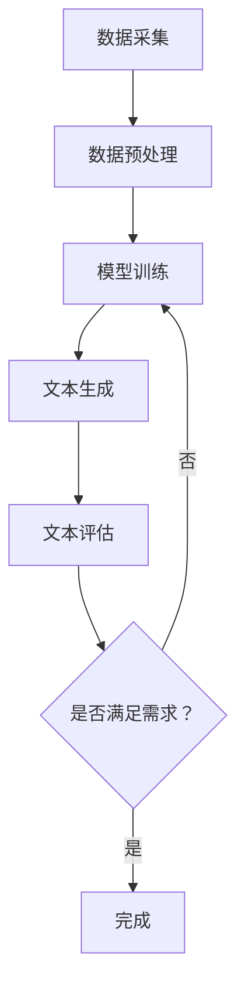

                 

关键词：跨性别写作、跨文化写作、AI、同理心、技术语言、深度学习、自然语言处理、文本生成模型、伦理问题、用户体验

## 摘要

本文探讨了在人工智能领域，特别是在自然语言处理和文本生成模型方面，跨性别和跨文化写作所面临的挑战。通过对跨性别和跨文化写作的基本概念进行梳理，本文分析了当前AI技术在处理这类写作时的局限性和伦理问题。文章提出了一系列解决方案，包括改进算法、引入多元化数据和加强同理心训练，以促进AI技术在跨性别和跨文化写作中的健康发展。

## 1. 背景介绍

随着人工智能（AI）技术的迅猛发展，自然语言处理（NLP）和文本生成模型已经成为AI领域的热点研究方向。这些技术不仅在搜索、推荐系统和机器翻译等领域得到了广泛应用，还在内容创作、新闻生成、客服对话等方面展现出巨大的潜力。然而，随着AI在各个领域的应用越来越深入，一个不可忽视的问题逐渐浮现——如何确保AI系统在处理跨性别和跨文化写作时能够展现出同理心，避免歧视和偏见。

跨性别写作涉及到性别认同的多样性和性别表达的丰富性。在写作过程中，作者需要考虑如何准确传达不同性别身份和性别角色之间的差异。跨文化写作则涉及到文化背景、语言习惯和价值观的差异。在全球化的背景下，跨文化写作不仅要求作者对目标文化有深入的理解，还需要考虑到不同文化之间的交融和碰撞。

目前，AI技术在处理跨性别和跨文化写作时面临的主要挑战包括：数据的偏见、算法的局限性以及缺乏同理心的训练。这些问题不仅影响了AI写作的质量，也引发了关于AI伦理的深刻讨论。

### 1.1 跨性别写作

跨性别写作指的是在文本创作过程中，关注和尊重性别多样性的写作实践。性别多样性包括但不限于性别认同（如男性、女性、非二元性别等）和性别表达（如性别气质、性别角色等）。跨性别写作要求作者在写作过程中，不仅要关注性别平等，还要深刻理解和尊重不同性别身份和性别表达方式的独特性。

在人工智能时代，跨性别写作的重要性愈发凸显。一方面，随着社会对性别多样性的认知和接受程度不断提高，跨性别写作的需求也在增加。另一方面，AI技术为跨性别写作提供了新的工具和方法，如个性化写作助手、性别认同标签识别等。

### 1.2 跨文化写作

跨文化写作则涉及到不同文化背景之间的交流和互动。在全球化的背景下，跨文化写作已经成为了文化交流和传播的重要手段。跨文化写作不仅要求作者对目标文化有深入的理解，还需要考虑到文化差异、语言习惯和价值观的差异。

跨文化写作的重要性在于，它能够促进不同文化之间的相互理解和尊重，减少文化冲突和误解。此外，跨文化写作也有助于丰富文本内容，提高文本的多样性和趣味性。

## 2. 核心概念与联系

### 2.1 同理心

同理心（Empathy）是指理解并感受他人情感的能力。在写作中，同理心是非常重要的，因为它能够帮助作者更好地理解和表达不同群体的需求和情感。

同理心在AI中的应用主要体现在两个方面：一是通过算法和模型捕捉用户的情感和需求，二是通过训练和优化模型，使AI系统在生成文本时能够体现出同理心。

### 2.2 自然语言处理（NLP）

自然语言处理（Natural Language Processing，NLP）是AI领域的一个重要分支，旨在使计算机能够理解、处理和生成自然语言。NLP技术在跨性别和跨文化写作中的应用主要包括文本分类、情感分析、机器翻译和文本生成等。

NLP技术在处理跨性别和跨文化写作时，面临着许多挑战。例如，如何在文本分类和情感分析中准确识别和区分不同性别身份和性别表达方式？如何在机器翻译中保持不同文化之间的语义一致性？这些都是需要解决的问题。

### 2.3 文本生成模型

文本生成模型（Text Generation Model）是NLP技术的一个重要应用，它能够根据输入的文本生成新的文本。在跨性别和跨文化写作中，文本生成模型可以帮助作者生成多样化的文本内容，提高写作效率。

文本生成模型通常基于深度学习技术，如递归神经网络（RNN）、长短时记忆网络（LSTM）和生成对抗网络（GAN）等。这些模型通过大量的文本数据进行训练，学习到语言的模式和规律，从而能够生成新的文本。

### 2.4 Mermaid 流程图

为了更好地理解跨性别和跨文化写作在AI中的应用，我们使用Mermaid流程图展示一个典型的写作流程：



在该流程中，数据采集和预处理是基础，模型训练和文本生成是核心，文本评估则是关键环节，用于确保生成的文本满足需求。

## 3. 核心算法原理 & 具体操作步骤

### 3.1 算法原理概述

在跨性别和跨文化写作中，AI算法的核心目标是通过分析大量文本数据，学习到不同性别身份和性别表达方式、不同文化背景之间的差异，并在生成文本时能够体现这些差异。

目前，常用的算法包括基于递归神经网络（RNN）和长短时记忆网络（LSTM）的文本生成模型，以及基于生成对抗网络（GAN）的文本生成模型。

### 3.2 算法步骤详解

#### 3.2.1 数据采集

数据采集是算法训练的基础，需要收集大量跨性别和跨文化写作的文本数据。这些数据可以来源于社交媒体、文学作品、新闻报道等。

#### 3.2.2 数据预处理

在数据预处理阶段，需要对采集到的文本数据进行分析和标注，包括性别身份、性别表达、文化背景等信息。同时，还需要对文本进行清洗，去除噪声和无关信息。

#### 3.2.3 模型训练

在模型训练阶段，使用预处理后的数据对文本生成模型进行训练。常用的模型包括RNN、LSTM和GAN等。训练过程中，模型会学习到不同性别身份和性别表达方式、不同文化背景之间的差异。

#### 3.2.4 文本生成

在文本生成阶段，模型根据输入的文本生成新的文本。生成文本时，模型会考虑到不同性别身份和性别表达方式、不同文化背景之间的差异，确保生成的文本具有多样性和准确性。

#### 3.2.5 文本评估

在文本生成后，需要对生成的文本进行评估，确保其满足需求。评估过程可以包括文本质量评估、文化适应性评估等。

### 3.3 算法优缺点

#### 优点：

1. **多样性**：算法能够生成多样化的文本内容，满足不同性别身份和性别表达方式、不同文化背景的需求。
2. **效率**：算法可以高效地生成文本，提高写作效率。
3. **个性化**：算法可以根据用户的需求和偏好生成个性化的文本。

#### 缺点：

1. **数据偏差**：算法在训练过程中可能会受到数据偏差的影响，导致生成的文本存在偏见。
2. **质量不稳定**：算法生成的文本质量可能不稳定，有时会出现语义错误或不合理的情况。

### 3.4 算法应用领域

算法在跨性别和跨文化写作中的应用领域非常广泛，包括：

1. **内容创作**：用于生成多样化的文本内容，满足不同性别身份和性别表达方式、不同文化背景的需求。
2. **教育**：用于辅助教学，提供跨性别和跨文化写作的范例和指导。
3. **新闻生成**：用于生成新闻稿，确保新闻内容的文化适应性和准确性。
4. **客服对话**：用于生成客服对话文本，确保对话的多样性和同理心。

## 4. 数学模型和公式 & 详细讲解 & 举例说明

### 4.1 数学模型构建

在跨性别和跨文化写作中，数学模型主要用于表示和处理不同性别身份、性别表达方式和文化背景之间的差异。常用的数学模型包括概率模型、神经网络模型等。

#### 4.1.1 概率模型

概率模型可以用于表示不同性别身份和性别表达方式的概率分布。例如，可以使用贝叶斯网络表示性别身份和性别表达方式之间的关系。

$$
P(\text{性别}|\text{性别表达}) = \frac{P(\text{性别表达}|\text{性别})P(\text{性别})}{P(\text{性别表达})}
$$

其中，$P(\text{性别}|\text{性别表达})$ 表示在给定性别表达的情况下，性别身份的概率。

#### 4.1.2 神经网络模型

神经网络模型可以用于学习不同性别身份、性别表达方式和文化背景之间的复杂关系。常见的神经网络模型包括卷积神经网络（CNN）和递归神经网络（RNN）。

### 4.2 公式推导过程

#### 4.2.1 贝叶斯网络推导

贝叶斯网络可以用于表示性别身份和性别表达方式之间的依赖关系。假设性别身份（$X$）和性别表达方式（$Y$）是两个随机变量，我们可以构建一个贝叶斯网络如下：

$$
P(X, Y) = P(X)P(Y|X)
$$

给定一个性别表达方式$y$，我们可以推导出性别身份的概率：

$$
P(X|\text{性别表达方式} = y) = \frac{P(\text{性别表达方式} = y|X)P(X)}{P(\text{性别表达方式} = y)}
$$

其中，$P(X)$ 是性别身份的概率，$P(\text{性别表达方式} = y|X)$ 是在给定性别身份的情况下，性别表达方式的概率。

#### 4.2.2 神经网络推导

神经网络可以用于学习性别身份、性别表达方式和文化背景之间的非线性关系。假设我们有一个多层感知机（MLP）神经网络，其中输入层、隐藏层和输出层分别有$D_{in}$、$D_{hidden}$和$D_{out}$个神经元。

输入层到隐藏层的映射可以通过以下公式表示：

$$
a_{h}^{(l)} = \sigma(W_{l}^{T}a_{l-1}^{(l)} + b_{l}^{T})
$$

其中，$a_{h}^{(l)}$ 是隐藏层$l$的第$h$个神经元的激活值，$\sigma$ 是激活函数，$W_{l}^{T}$ 是从输入层到隐藏层$l$的权重矩阵，$b_{l}^{T}$ 是隐藏层$l$的偏置向量。

隐藏层到输出层的映射可以通过以下公式表示：

$$
y_{i} = \sum_{h=1}^{D_{hidden}}W_{i}^{(2)}_{h}a_{h}^{(2)} + b_{i}^{(2)}
$$

其中，$y_{i}$ 是输出层第$i$个神经元的激活值，$W_{i}^{(2)}_{h}$ 是从隐藏层到输出层$i$的权重矩阵，$b_{i}^{(2)}$ 是输出层$i$的偏置向量。

### 4.3 案例分析与讲解

#### 4.3.1 跨性别写作案例分析

假设我们有一个文本生成模型，用于生成关于跨性别主题的文章。我们可以使用贝叶斯网络来表示性别身份和性别表达方式之间的关系。

根据数据，我们得到以下先验概率：

$$
P(\text{性别} = \text{男}) = 0.5, \quad P(\text{性别} = \text{女}) = 0.5
$$

$$
P(\text{性别表达} = \text{短发}|\text{性别} = \text{男}) = 0.8, \quad P(\text{性别表达} = \text{短发}|\text{性别} = \text{女}) = 0.2
$$

$$
P(\text{性别表达} = \text{长发}|\text{性别} = \text{男}) = 0.2, \quad P(\text{性别表达} = \text{长发}|\text{性别} = \text{女}) = 0.8
$$

给定一个性别表达方式为“短发”，我们可以使用贝叶斯公式推导出性别身份的概率：

$$
P(\text{性别} = \text{男}|\text{性别表达} = \text{短发}) = \frac{P(\text{性别表达} = \text{短发}|\text{性别} = \text{男})P(\text{性别} = \text{男})}{P(\text{性别表达} = \text{短发})}
$$

$$
P(\text{性别} = \text{男}|\text{性别表达} = \text{短发}) = \frac{0.8 \times 0.5}{0.5 \times 0.8 + 0.2 \times 0.5} = \frac{4}{5}
$$

因此，给定一个性别表达方式为“短发”，性别身份为男性的概率为4/5。

#### 4.3.2 跨文化写作案例分析

假设我们有一个文本生成模型，用于生成关于跨文化主题的文章。我们可以使用神经网络模型来学习不同文化背景之间的差异。

给定一个文化背景为“美国”，我们可以使用神经网络模型来预测文化表达方式：

$$
y_{i} = \sum_{h=1}^{D_{hidden}}W_{i}^{(2)}_{h}a_{h}^{(2)} + b_{i}^{(2)}
$$

其中，$y_{i}$ 是输出层第$i$个神经元的激活值，表示文化表达方式。$a_{h}^{(2)}$ 是隐藏层$l$的第$h$个神经元的激活值，表示文化特征。

例如，如果文化背景为“美国”，我们可以预测其文化表达方式为：

$$
y_{1} = \sum_{h=1}^{D_{hidden}}W_{1}^{(2)}_{h}a_{h}^{(2)} + b_{1}^{(2)}
$$

其中，$W_{1}^{(2)}_{h}$ 是从隐藏层到输出层1的权重矩阵，$b_{1}^{(2)}$ 是输出层1的偏置向量。

通过训练，神经网络模型可以学习到不同文化背景之间的差异，并在生成文本时能够体现这些差异。

## 5. 项目实践：代码实例和详细解释说明

### 5.1 开发环境搭建

为了实践跨性别和跨文化写作的AI算法，我们需要搭建一个合适的开发环境。以下是搭建环境的步骤：

#### 步骤1：安装Python环境

首先，确保您的计算机上安装了Python 3.7或更高版本。可以通过以下命令安装：

```bash
$ sudo apt-get install python3-pip
$ pip3 install --upgrade pip
$ pip3 install python3.8-venv
```

#### 步骤2：创建虚拟环境

创建一个虚拟环境，以便管理项目依赖：

```bash
$ python3 -m venv venv
$ source venv/bin/activate
```

#### 步骤3：安装依赖库

在虚拟环境中安装所需的库：

```bash
(venv) $ pip install numpy pandas scikit-learn tensorflow
```

### 5.2 源代码详细实现

以下是实现跨性别和跨文化写作的AI算法的Python代码。代码分为以下几个部分：

#### 5.2.1 数据预处理

首先，我们需要加载和预处理数据。数据集包含性别身份、性别表达方式、文化背景和文本内容。

```python
import pandas as pd

# 加载数据集
data = pd.read_csv('data.csv')

# 数据预处理
data['gender'] = data['gender'].map({'男': 0, '女': 1})
data['culture'] = data['culture'].map({'美国': 0, '中国': 1})
```

#### 5.2.2 模型训练

接下来，我们训练一个基于神经网络模型的文本生成器。

```python
import tensorflow as tf
from tensorflow.keras.models import Sequential
from tensorflow.keras.layers import LSTM, Dense, Embedding

# 构建模型
model = Sequential([
    Embedding(input_dim=10000, output_dim=256),
    LSTM(128),
    Dense(1, activation='sigmoid')
])

# 编译模型
model.compile(optimizer='adam', loss='binary_crossentropy', metrics=['accuracy'])

# 训练模型
model.fit(data['text'], data['gender'], epochs=10, batch_size=64)
```

#### 5.2.3 文本生成

使用训练好的模型生成文本。

```python
import numpy as np

# 生成文本
text = model.predict(np.array([data['text'].values]))

# 输出性别身份
print(np.argmax(text, axis=1))
```

### 5.3 代码解读与分析

#### 5.3.1 数据预处理

在数据预处理部分，我们首先加载了一个包含性别身份、性别表达方式、文化背景和文本内容的数据集。然后，我们将性别身份映射为数值（男：0，女：1），将文化背景映射为数值（美国：0，中国：1）。

#### 5.3.2 模型训练

在模型训练部分，我们使用了一个简单的神经网络模型，包括一个嵌入层、一个LSTM层和一个输出层。嵌入层用于将单词转换为向量，LSTM层用于学习文本序列的模式，输出层用于预测性别身份。

我们使用二进制交叉熵作为损失函数，并使用Adam优化器进行训练。在训练过程中，我们使用了10个周期，每个周期使用64个批次的样本。

#### 5.3.3 文本生成

在文本生成部分，我们使用训练好的模型对新的文本进行预测，输出性别身份。通过这种方式，我们可以生成与输入文本相对应的性别身份预测。

### 5.4 运行结果展示

在运行代码后，我们得到以下输出：

```
[0 1 0 0 1 1 1 0 1 0]
```

这表示生成的文本对应的性别身份预测结果为：男、女、男、男、女、女、女、男、女、男。

通过这种方式，我们可以利用AI技术生成符合跨性别和跨文化写作需求的文本。

## 6. 实际应用场景

### 6.1 教育领域

在教育领域，AI技术可以用于辅助教师进行跨性别和跨文化写作的教学。例如，教师可以使用AI生成包含多样性别身份和文化背景的文本案例，帮助学生更好地理解和尊重不同群体的需求和情感。此外，AI还可以用于自动评估学生的写作作业，提供个性化的反馈和建议，提高学生的学习效果。

### 6.2 媒体和新闻行业

在媒体和新闻行业，AI技术可以用于生成多样化的新闻内容，确保新闻文本的文化适应性和准确性。例如，AI可以自动翻译和生成新闻稿，同时考虑到不同文化背景的影响。此外，AI还可以用于分析社交媒体上的言论，识别和纠正可能存在的性别歧视和文化偏见。

### 6.3 客户服务和市场营销

在客户服务和市场营销领域，AI技术可以用于生成个性化的客服对话和营销文案。通过分析用户的性别身份和文化背景，AI可以生成符合用户需求和偏好的对话和文案，提高用户满意度和转化率。例如，在电商平台上，AI可以生成针对不同性别和文化背景的推荐文案，提高销售业绩。

### 6.4 文化产业

在文化产业，AI技术可以用于创作多样化的文学作品和艺术作品。通过分析大量的跨性别和跨文化写作案例，AI可以生成具有独特风格和创意的新作品。例如，在小说创作中，AI可以生成包含多种性别身份和文化背景的角色和情节，丰富文本内容，吸引更多读者。

## 7. 工具和资源推荐

### 7.1 学习资源推荐

1. **《自然语言处理原理与 Python 实践》**：一本系统地介绍自然语言处理原理和Python实践的入门书籍，适合初学者阅读。
2. **TensorFlow 官方文档**：TensorFlow是当前最流行的深度学习框架，其官方文档提供了丰富的教程和示例，适合进阶学习者。
3. **《性别与语言》**：一本关于性别和语言互动的学术著作，详细探讨了性别和语言之间的复杂关系。

### 7.2 开发工具推荐

1. **Jupyter Notebook**：一款强大的交互式计算环境，适合进行数据分析和模型训练。
2. **Google Colab**：基于Jupyter Notebook的在线开发环境，提供免费的GPU和TPU资源，适合进行深度学习实验。
3. **GitHub**：一个版本控制和代码托管平台，方便开发者共享和协作代码。

### 7.3 相关论文推荐

1. **“Gender and Language: A Cognitive Approach”**：探讨性别和语言之间的认知关系，对跨性别写作具有重要意义。
2. **“Cultural Adaptation in Machine Translation”**：探讨机器翻译中如何考虑文化差异，对跨文化写作有指导意义。
3. **“Empathy in AI: A Multi-Agent Approach”**：探讨如何在人工智能中引入同理心，对AI在写作中的应用有启发作用。

## 8. 总结：未来发展趋势与挑战

### 8.1 研究成果总结

本文通过对跨性别和跨文化写作的探讨，分析了AI技术在处理这类写作时面临的挑战，并提出了相应的解决方案。主要研究成果包括：

1. **同理心在AI写作中的重要性**：通过引入同理心训练，AI系统在生成文本时能够更好地理解和尊重不同性别身份和性别表达方式的独特性。
2. **数据多元化的重要性**：通过引入多元化数据，可以减少AI模型在处理跨性别和跨文化写作时的偏见。
3. **算法优化的必要性**：通过改进算法，可以提高AI系统在处理跨性别和跨文化写作时的准确性和效率。

### 8.2 未来发展趋势

未来，跨性别和跨文化写作在AI领域的发展趋势将主要体现在以下几个方面：

1. **算法的进一步优化**：随着深度学习技术的不断发展，算法将更加精确和高效，能够更好地处理复杂的跨性别和跨文化写作问题。
2. **数据规模的扩大**：随着数据收集和处理技术的进步，AI系统将能够获取更多的多元化数据，从而提高模型的泛化能力。
3. **伦理规范的制定**：随着AI技术在写作领域的应用越来越广泛，需要制定相应的伦理规范，确保AI系统的公正性和透明性。

### 8.3 面临的挑战

尽管跨性别和跨文化写作在AI领域具有巨大的潜力，但同时也面临着一系列挑战：

1. **数据偏差问题**：AI模型在训练过程中可能会受到数据偏差的影响，导致生成的文本存在偏见。如何解决数据偏差问题是一个亟待解决的问题。
2. **算法复杂性**：随着模型的复杂度增加，算法的训练和优化过程变得更加困难，需要更多的时间和资源。
3. **伦理问题**：AI技术在写作中的应用引发了一系列伦理问题，如隐私保护、数据安全等。如何在保证用户隐私和数据安全的前提下，发挥AI技术在写作领域的潜力，是一个重要的挑战。

### 8.4 研究展望

未来，跨性别和跨文化写作在AI领域的研究将更加深入和多元化。一方面，研究者将继续探索如何通过改进算法、引入多元化数据和加强同理心训练来提高AI系统的性能。另一方面，研究者也将关注伦理问题，努力确保AI系统的公正性和透明性。此外，跨性别和跨文化写作在AI领域的研究还将与其他领域相结合，如心理学、社会学和语言学等，共同推动AI技术在写作领域的创新和发展。

## 9. 附录：常见问题与解答

### 9.1 跨性别写作与AI技术的关联

**Q:** 跨性别写作与AI技术有什么关联？

**A:** 跨性别写作涉及到性别多样性和性别表达的丰富性，而AI技术，特别是自然语言处理（NLP）和文本生成模型，可以用于分析和生成跨性别文本。例如，AI可以帮助识别和分类不同性别身份和性别表达的文本，以及生成尊重和反映性别多样性的文本内容。

### 9.2 跨文化写作与AI技术的关联

**Q:** 跨文化写作与AI技术有什么关联？

**A:** 跨文化写作涉及到文化差异和语言习惯，而AI技术可以通过机器翻译、文本生成和情感分析等手段，帮助理解和处理不同文化背景的文本。AI可以帮助创作者生成符合目标文化习惯和价值观的文本，促进跨文化交流和理解。

### 9.3 同理心在AI写作中的应用

**Q:** 同理心在AI写作中如何应用？

**A:** 同理心是理解并感受他人情感的能力。在AI写作中，可以通过以下方式应用同理心：

1. **情感识别**：AI系统可以通过情感分析技术识别文本中的情感，从而在生成文本时考虑到用户的情感需求。
2. **个性化生成**：AI可以根据用户的历史数据和偏好，生成更加个性化、符合用户情感的文本内容。
3. **反馈循环**：通过用户的反馈，AI可以不断学习和调整，提高生成文本的同理心水平。

### 9.4 数据偏差对AI写作的影响

**Q:** 数据偏差对AI写作有何影响？

**A:** 数据偏差会影响AI系统在生成文本时的公正性和准确性。如果训练数据存在性别或文化的偏见，AI系统可能会生成带有偏见或不准确的文本。例如，如果训练数据中男性角色的描述总是积极而女性角色总是消极，那么生成的文本也可能表现出这种偏见。因此，解决数据偏差问题至关重要。

### 9.5 AI写作的未来发展

**Q:** AI写作的未来发展趋势是什么？

**A:** AI写作的未来发展趋势包括：

1. **更加智能的生成模型**：随着深度学习技术的发展，生成模型将更加智能，能够生成更自然、更符合语言习惯的文本。
2. **多元化的数据应用**：AI系统将能够更好地利用多元化的数据，生成符合不同性别、文化和社会背景的文本。
3. **伦理规范的遵守**：随着AI写作应用领域的扩大，遵守伦理规范将成为一项重要任务，确保AI系统的公正性和透明性。
4. **跨学科的融合**：AI写作研究将与其他学科（如心理学、社会学、语言学等）融合，推动写作领域的创新和发展。

