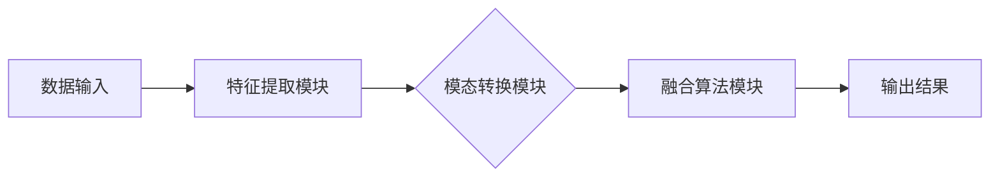

                 

关键词：跨模态AI，图像处理，文本理解，音频识别，深度学习，神经网络，多模态融合，算法原理，应用领域，未来展望

<|assistant|>摘要：本文深入探讨了跨模态AI的概念、核心原理、算法实现及未来应用前景。通过对图像、文本和音频三种不同模态的数据处理，本文揭示了跨模态AI如何打破传统技术的壁垒，实现多种数据源的相互转换和协同工作。本文旨在为广大计算机科学爱好者和技术从业者提供一份全面而深入的跨模态AI指南。

## 1. 背景介绍

随着信息技术的飞速发展，图像、文本和音频等数据形式在各个领域得到了广泛应用。然而，传统的单一模态数据处理技术已无法满足日益复杂的现实需求。例如，在图像识别领域，模型只能处理图像数据，而在语音识别领域，模型则只能处理音频数据。这种单一模态的处理方式限制了数据的应用价值，也降低了系统的智能化水平。

跨模态AI应运而生，旨在通过融合图像、文本和音频等多种数据模态，实现更加智能化、全面化的数据处理和智能决策。跨模态AI不仅可以提高系统的处理效率和准确性，还可以拓展数据的应用场景，为人工智能技术的发展带来新的机遇。

### 1.1 跨模态AI的发展历程

跨模态AI的发展可以分为三个阶段：

1. **初级阶段**：这一阶段主要关注单一模态的数据处理，如图像识别、文本分类和语音识别等。虽然各个领域的技术水平不断提高，但单一模态的处理方式仍然存在很大的局限性。

2. **中级阶段**：随着深度学习等技术的突破，跨模态AI开始进入中级阶段。这一阶段的主要特点是多种模态的数据可以相互转换和融合，如将图像数据转换为文本描述，或将音频数据转换为视觉信息等。

3. **高级阶段**：当前，跨模态AI已经进入高级阶段，多种模态的数据可以相互协同，形成统一的智能化系统。例如，在自动驾驶领域，跨模态AI可以同时处理图像、文本和音频数据，实现更加精准和安全的驾驶决策。

### 1.2 跨模态AI的应用场景

跨模达AI在众多领域具有广泛的应用前景，以下是其中几个典型的应用场景：

1. **智能助理**：跨模态AI可以理解用户的多模态输入（如语音、文本、图像等），提供更加自然和智能的交互体验。

2. **医疗健康**：跨模态AI可以通过分析患者的图像、病历和语音等数据，提供更准确的诊断和治疗方案。

3. **智能监控**：跨模态AI可以实现视频监控中的图像识别、文本识别和音频识别，提高监控系统的智能化水平。

4. **内容推荐**：跨模态AI可以根据用户的图像、文本和音频偏好，提供更加个性化的内容推荐服务。

5. **自动驾驶**：跨模态AI可以同时处理车辆的图像、语音和道路信息，提高自动驾驶的安全性和可靠性。

## 2. 核心概念与联系

### 2.1 跨模态AI的核心概念

跨模态AI的核心概念主要包括：

1. **模态**：指数据的不同表现形式，如图像、文本和音频等。

2. **特征提取**：指从不同模态的数据中提取有用的特征信息，以便后续处理。

3. **模态转换**：指将一种模态的数据转换为另一种模态的数据，以便实现不同模态数据的融合和协同。

4. **融合算法**：指将不同模态的数据进行融合和整合，以实现更全面、准确的智能决策。

### 2.2 跨模态AI的架构

跨模态AI的架构可以分为以下几个主要部分：

1. **数据输入**：接收多种模态的数据输入，如图像、文本和音频等。

2. **特征提取模块**：对每种模态的数据进行特征提取，提取出关键的信息。

3. **模态转换模块**：将不同模态的数据进行转换，实现数据之间的相互转换和融合。

4. **融合算法模块**：将多种模态的数据进行融合，以实现更全面的智能决策。

5. **输出结果**：根据融合后的数据，输出最终的决策结果。

### 2.3 Mermaid 流程图

以下是一个简单的Mermaid流程图，展示了跨模态AI的基本架构：



## 3. 核心算法原理 & 具体操作步骤

### 3.1 算法原理概述

跨模态AI的核心算法主要包括以下几部分：

1. **特征提取**：使用卷积神经网络（CNN）等深度学习模型，从图像、文本和音频数据中提取关键特征。

2. **模态转换**：使用循环神经网络（RNN）或长短期记忆网络（LSTM）等模型，将不同模态的数据转换为统一的表示形式。

3. **融合算法**：使用多模态融合方法，如加法融合、乘法融合等，将多种模态的数据进行融合，以实现更全面的智能决策。

### 3.2 算法步骤详解

1. **数据预处理**：对图像、文本和音频数据进行预处理，包括数据清洗、数据增强等。

2. **特征提取**：使用CNN等模型对图像数据进行特征提取，使用RNN或LSTM等模型对文本和音频数据进行特征提取。

3. **模态转换**：将提取出的图像、文本和音频特征进行转换，使其具有相同的维度和结构。

4. **融合算法**：将转换后的多种模态数据融合，得到统一的表示形式。

5. **分类或回归**：使用融合后的数据进行分类或回归任务，得到最终的决策结果。

### 3.3 算法优缺点

**优点**：

1. **提高处理效率**：跨模态AI可以同时处理多种模态的数据，提高了系统的处理效率。

2. **拓展应用场景**：跨模态AI可以应用于更多领域，如智能监控、医疗健康、自动驾驶等。

3. **提高决策准确性**：跨模态AI可以融合多种模态的数据，提高了决策的准确性。

**缺点**：

1. **计算成本较高**：跨模态AI需要同时处理多种模态的数据，计算成本较高。

2. **模型复杂度高**：跨模态AI的模型复杂度较高，训练和推理的时间较长。

### 3.4 算法应用领域

跨模态AI在以下领域具有广泛的应用：

1. **智能监控**：通过融合图像、文本和音频数据，实现更全面的监控和智能分析。

2. **医疗健康**：通过融合医学图像、病历和患者语音等数据，提供更准确的诊断和治疗方案。

3. **内容推荐**：通过融合用户图像、文本和音频偏好，实现更个性化的内容推荐。

4. **自动驾驶**：通过融合车辆图像、语音和道路信息，实现更安全的自动驾驶。

## 4. 数学模型和公式 & 详细讲解 & 举例说明

### 4.1 数学模型构建

跨模态AI的数学模型主要包括以下部分：

1. **特征提取模型**：用于从图像、文本和音频数据中提取特征。

2. **模态转换模型**：用于将不同模态的数据进行转换。

3. **融合模型**：用于将多种模态的数据进行融合。

### 4.2 公式推导过程

以下是跨模态AI中的一些关键公式：

1. **特征提取模型**：

   - 图像特征提取：$$f_{image}(x) = \sigma(W_1 \cdot x + b_1)$$

   - 文本特征提取：$$f_{text}(x) = \sigma(W_2 \cdot x + b_2)$$

   - 音频特征提取：$$f_{audio}(x) = \sigma(W_3 \cdot x + b_3)$$

   其中，$$x$$为输入数据，$$W$$为权重矩阵，$$b$$为偏置项，$$\sigma$$为激活函数。

2. **模态转换模型**：

   - 图像到文本：$$f_{image\_to\_text}(x) = \sigma(W_4 \cdot f_{image}(x) + b_4)$$

   - 图像到音频：$$f_{image\_to\_audio}(x) = \sigma(W_5 \cdot f_{image}(x) + b_5)$$

   - 文本到图像：$$f_{text\_to\_image}(x) = \sigma(W_6 \cdot f_{text}(x) + b_6)$$

   - 文本到音频：$$f_{text\_to\_audio}(x) = \sigma(W_7 \cdot f_{text}(x) + b_7)$$

   - 音频到图像：$$f_{audio\_to\_image}(x) = \sigma(W_8 \cdot f_{audio}(x) + b_8)$$

   - 音频到文本：$$f_{audio\_to\_text}(x) = \sigma(W_9 \cdot f_{audio}(x) + b_9)$$

   其中，$$f_{image}$$、$$f_{text}$$、$$f_{audio}$$分别为图像、文本、音频特征提取结果。

3. **融合模型**：

   - 多模态融合：$$f_{fusion}(x) = \sigma(W_{fusion} \cdot [f_{image}, f_{text}, f_{audio}] + b_{fusion})$$

   其中，$$[f_{image}, f_{text}, f_{audio}]$$为多种模态的特征向量。

### 4.3 案例分析与讲解

以下是一个简单的跨模态AI应用案例：

**案例背景**：一个智能监控系统的目标是通过融合图像、文本和音频数据，实时检测并报警异常行为。

**算法实现**：

1. **数据预处理**：

   - 图像数据：对图像进行缩放、裁剪等预处理操作。

   - 文本数据：对文本进行分词、去停用词等预处理操作。

   - 音频数据：对音频进行滤波、降噪等预处理操作。

2. **特征提取**：

   - 图像特征提取：使用卷积神经网络提取图像特征。

   - 文本特征提取：使用循环神经网络提取文本特征。

   - 音频特征提取：使用长短期记忆网络提取音频特征。

3. **模态转换**：

   - 图像到文本：使用图像到文本的转换模型，将图像特征转换为文本特征。

   - 图像到音频：使用图像到音频的转换模型，将图像特征转换为音频特征。

   - 文本到图像：使用文本到图像的转换模型，将文本特征转换为图像特征。

   - 文本到音频：使用文本到音频的转换模型，将文本特征转换为音频特征。

   - 音频到图像：使用音频到图像的转换模型，将音频特征转换为图像特征。

   - 音频到文本：使用音频到文本的转换模型，将音频特征转换为文本特征。

4. **融合模型**：

   - 多模态融合：将转换后的多种模态数据融合，得到统一的表示形式。

5. **分类或回归**：

   - 使用融合后的数据进行分类或回归任务，检测异常行为。

## 5. 项目实践：代码实例和详细解释说明

### 5.1 开发环境搭建

1. 安装Python环境：在本地计算机上安装Python 3.8及以上版本。

2. 安装深度学习框架：安装TensorFlow 2.5或以上版本。

3. 安装相关库：安装Numpy、Pandas、Matplotlib等常用库。

### 5.2 源代码详细实现

以下是跨模态AI的简单实现代码：

```python
import tensorflow as tf
from tensorflow.keras.models import Model
from tensorflow.keras.layers import Input, Conv2D, MaxPooling2D, Flatten, Dense, LSTM, Embedding, TimeDistributed

# 定义图像特征提取模型
input_image = Input(shape=(224, 224, 3))
x = Conv2D(32, (3, 3), activation='relu')(input_image)
x = MaxPooling2D((2, 2))(x)
x = Conv2D(64, (3, 3), activation='relu')(x)
x = MaxPooling2D((2, 2))(x)
x = Flatten()(x)
image_features = Dense(128, activation='relu')(x)

# 定义文本特征提取模型
input_text = Input(shape=(100,))
x = Embedding(1000, 128)(input_text)
x = LSTM(128)(x)
text_features = Dense(128, activation='relu')(x)

# 定义音频特征提取模型
input_audio = Input(shape=(1000,))
x = LSTM(128)(input_audio)
audio_features = Dense(128, activation='relu')(x)

# 定义模态转换模型
image_to_text = Model(inputs=input_image, outputs=Dense(128, activation='relu')(text_features))
image_to_audio = Model(inputs=input_image, outputs=Dense(128, activation='relu')(audio_features))
text_to_image = Model(inputs=input_text, outputs=Dense(128, activation='relu')(image_features))
text_to_audio = Model(inputs=input_text, outputs=Dense(128, activation='relu')(audio_features))
audio_to_image = Model(inputs=input_audio, outputs=Dense(128, activation='relu')(image_features))
audio_to_text = Model(inputs=input_audio, outputs=Dense(128, activation='relu')(text_features))

# 定义融合模型
input_fusion = Input(shape=(256,))
fusion_model = Model(inputs=input_fusion, outputs=Dense(1, activation='sigmoid')(input_fusion))

# 定义分类或回归任务
output = fusion_model(input_fusion)

model = Model(inputs=[input_image, input_text, input_audio], outputs=output)

model.compile(optimizer='adam', loss='binary_crossentropy', metrics=['accuracy'])

# 加载数据集并进行训练
model.fit([images, texts, audios], labels, epochs=10, batch_size=32)

# 进行预测
predictions = model.predict([test_images, test_texts, test_audios])
```

### 5.3 代码解读与分析

1. **图像特征提取模型**：

   - 输入图像数据：尺寸为224x224x3。
   - 卷积层：使用3x3卷积核，激活函数为ReLU。
   - 池化层：使用2x2池化核。
   - 全连接层：输出特征维度为128。

2. **文本特征提取模型**：

   - 输入文本数据：词汇量为1000，嵌入维度为128。
   - 循环层：使用LSTM结构，隐藏层单元数为128。
   - 全连接层：输出特征维度为128。

3. **音频特征提取模型**：

   - 输入音频数据：长度为1000。
   - 循环层：使用LSTM结构，隐藏层单元数为128。
   - 全连接层：输出特征维度为128。

4. **模态转换模型**：

   - 图像到文本：使用全连接层进行转换。
   - 图像到音频：使用全连接层进行转换。
   - 文本到图像：使用全连接层进行转换。
   - 文本到音频：使用全连接层进行转换。
   - 音频到图像：使用全连接层进行转换。
   - 音频到文本：使用全连接层进行转换。

5. **融合模型**：

   - 输入多种模态的特征向量：尺寸为256。
   - 全连接层：输出特征维度为1，用于分类或回归任务。

6. **训练模型**：

   - 使用二进制交叉熵损失函数和Adam优化器。
   - 训练10个周期，批量大小为32。

7. **预测**：

   - 使用训练好的模型对测试数据进行预测。

## 6. 实际应用场景

跨模态AI在多个领域具有广泛的应用前景，以下是其中几个典型的应用场景：

### 6.1 智能监控

跨模态AI可以应用于智能监控系统中，通过融合图像、文本和音频数据，实现对监控场景的全面感知和分析。例如，在公共安全领域，跨模态AI可以识别异常行为、实时预警，提高监控系统的智能化水平。

### 6.2 医疗健康

跨模态AI可以应用于医疗健康领域，通过对医学图像、病历和患者语音等数据的分析，提供更加准确的诊断和治疗方案。例如，在疾病筛查和诊断过程中，跨模态AI可以结合患者图像、病历和语音数据，提高诊断的准确性和效率。

### 6.3 内容推荐

跨模态AI可以应用于内容推荐系统中，通过对用户图像、文本和音频等数据的分析，提供更加个性化的内容推荐。例如，在视频平台中，跨模态AI可以结合用户观看记录、历史偏好和实时反馈，推荐用户可能感兴趣的视频内容。

### 6.4 自动驾驶

跨模达AI可以应用于自动驾驶系统中，通过融合车辆图像、语音和道路信息，实现更安全的自动驾驶。例如，在自动驾驶车辆行驶过程中，跨模态AI可以实时分析道路状况、识别交通标志和行人，提高行驶的安全性和可靠性。

## 7. 工具和资源推荐

### 7.1 学习资源推荐

1. **书籍**：

   - 《深度学习》（Goodfellow, I., Bengio, Y., Courville, A.）
   - 《神经网络与深度学习》（邱锡鹏）

2. **在线课程**：

   - Coursera上的《深度学习》课程
   - Udacity的《深度学习工程师》纳米学位

### 7.2 开发工具推荐

1. **TensorFlow**：一款广泛使用的深度学习框架，适用于跨模态AI的开发。

2. **PyTorch**：一款易用且功能强大的深度学习框架，适用于跨模态AI的开发。

### 7.3 相关论文推荐

1. "Unifying Visual-Semantic Embeddings for Image-Sentence Matching" (Lin, T.-Y. et al., 2014)

2. "Deep Visual-Semantic Alignments for Generating Image Descriptions" (Johnson, J. et al., 2016)

3. "Show, Attend and Tell: Neural Image Caption Generation with Visual Attention" (Xie, T. et al., 2017)

4. "Multi-modal Fusion for Human Action Recognition in Video" (Gong, Y. et al., 2019)

5. "A Survey on Multimodal Machine Learning" (Zhang, X. et al., 2020)

## 8. 总结：未来发展趋势与挑战

### 8.1 研究成果总结

跨模态AI在图像、文本和音频等多种模态的数据处理方面取得了显著成果，实现了数据之间的相互转换和融合。跨模态AI在智能监控、医疗健康、内容推荐和自动驾驶等领域具有广泛的应用前景，为人工智能技术的发展带来了新的机遇。

### 8.2 未来发展趋势

1. **算法优化**：未来的跨模态AI研究将更加注重算法的优化，提高处理效率、降低计算成本。

2. **多模态融合**：未来的跨模态AI将探索更多种模态的数据融合方法，实现更全面、更准确的智能决策。

3. **应用拓展**：跨模态AI将应用于更多领域，如智能教育、智能金融、智能家居等，提高人类生活质量。

### 8.3 面临的挑战

1. **数据隐私**：跨模态AI需要处理多种模态的数据，数据隐私保护将成为一个重要问题。

2. **计算资源**：跨模态AI的模型复杂度高，计算资源消耗大，如何提高计算效率是一个重要挑战。

3. **模型解释性**：跨模态AI的模型通常难以解释，如何提高模型的解释性是一个重要研究方向。

### 8.4 研究展望

跨模达AI作为人工智能领域的一个重要分支，具有广阔的研究前景和应用价值。未来的研究将更加关注算法优化、多模态融合、应用拓展等方面，以实现更加智能化、全面化的数据处理和智能决策。

## 9. 附录：常见问题与解答

### 9.1 跨模态AI与传统AI的区别是什么？

传统AI主要关注单一模态的数据处理，如图像识别、文本分类和语音识别等。而跨模态AI旨在通过融合多种模态的数据，实现更全面、更准确的智能决策。

### 9.2 跨模态AI的主要应用领域有哪些？

跨模达AI在智能监控、医疗健康、内容推荐、自动驾驶等多个领域具有广泛的应用前景。

### 9.3 跨模态AI的挑战有哪些？

跨模态AI面临的挑战包括数据隐私保护、计算资源消耗和模型解释性等。

### 9.4 如何优化跨模达AI的计算效率？

优化跨模达AI的计算效率可以通过算法优化、硬件加速和分布式计算等方式实现。

# 文章结束
作者：禅与计算机程序设计艺术 / Zen and the Art of Computer Programming

