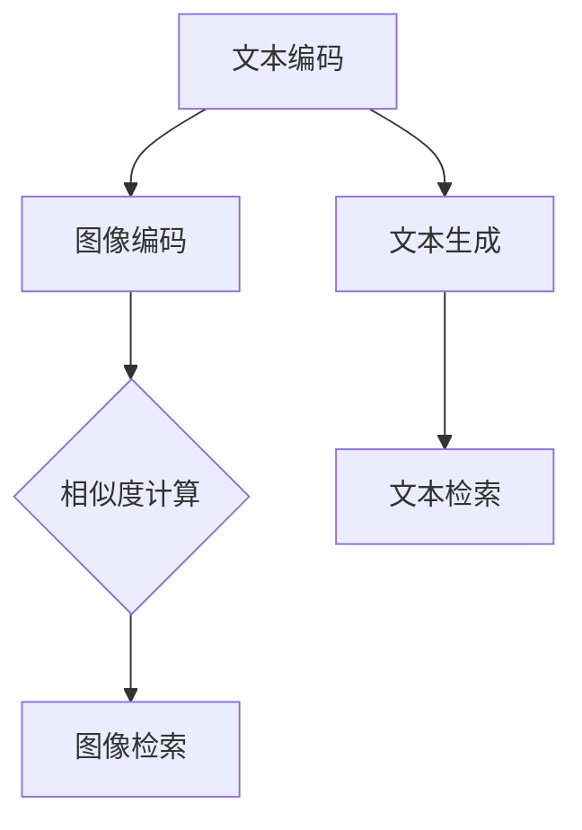

                 

关键词：跨模态检索，文本到图像，图像到文本，匹配技术，深度学习，自然语言处理，计算机视觉

> 摘要：本文深入探讨了跨模态检索技术，特别是在文本到图像和图像到文本的匹配领域。通过阐述核心概念、算法原理、数学模型及实际应用，本文旨在为读者提供全面的技术理解，并展望其未来的发展方向。

## 1. 背景介绍

在当今信息爆炸的时代，数据呈现出多样化的形式，如文本、图像、音频和视频等。跨模态检索作为一种新兴的技术，旨在解决不同模态数据之间的匹配和查询问题。文本到图像检索（Text-to-Image Retrieval）和图像到文本检索（Image-to-Text Retrieval）作为跨模态检索的典型应用场景，逐渐受到广泛关注。

文本到图像检索的目标是根据输入的文本查询，检索出与其语义相关的图像。例如，当用户输入查询“猫捉老鼠”时，检索系统应能返回与这一场景相关的图像。类似地，图像到文本检索则是根据输入的图像，提取与之相关的文本描述。这种应用在内容审核、图像标注、信息检索等方面具有重要价值。

跨模态检索的出现，不仅提升了信息检索的效率和准确性，还为许多实际应用场景提供了强大的支持。例如，在电子商务领域，通过图像到文本检索，可以自动生成商品的描述文本；在医疗领域，可以通过文本到图像检索，帮助医生快速找到相关的医学图像。

## 2. 核心概念与联系

### 跨模态检索的概念

跨模态检索是指在不同模态（如文本、图像、音频等）之间进行信息检索的过程。其核心目标是实现不同模态数据之间的语义理解和匹配。跨模态检索的关键在于建立一种有效的跨模态表示方法，使得不同模态的数据能够在同一空间中相互映射和交互。

### 文本到图像检索的概念

文本到图像检索是一种跨模态检索技术，其目标是根据文本查询检索出相关的图像。文本到图像检索通常涉及以下步骤：

1. **文本编码**：将文本转换为向量表示，常用的方法包括词嵌入、词袋模型、BERT等。
2. **图像编码**：将图像转换为向量表示，常用的方法包括卷积神经网络（CNN）和生成对抗网络（GAN）。
3. **相似度计算**：计算文本向量和图像向量之间的相似度，常用的方法包括余弦相似度、欧氏距离等。
4. **图像检索**：根据相似度排序，检索出与文本查询最相关的图像。

### 图像到文本检索的概念

图像到文本检索是另一种跨模态检索技术，其目标是根据输入的图像检索出相关的文本描述。图像到文本检索通常涉及以下步骤：

1. **图像编码**：将图像转换为向量表示，常用的方法包括卷积神经网络（CNN）和生成对抗网络（GAN）。
2. **文本生成**：根据图像向量生成相关的文本描述，常用的方法包括基于注意力机制的循环神经网络（RNN）和生成对抗网络（GAN）。
3. **文本检索**：根据生成的文本描述，检索出与图像最相关的文本信息。

### 核心概念原理和架构的 Mermaid 流程图

下面是跨模态检索的核心概念原理和架构的 Mermaid 流程图：



## 3. 核心算法原理 & 具体操作步骤

### 3.1 算法原理概述

跨模态检索的核心在于建立有效的跨模态表示，并利用这些表示进行相似度计算和检索。具体而言，文本到图像检索和图像到文本检索的算法原理如下：

#### 文本到图像检索

1. **文本编码**：使用词嵌入（如Word2Vec、GloVe）或深度学习（如BERT、Transformer）将文本转换为向量表示。
2. **图像编码**：使用卷积神经网络（如VGG、ResNet）将图像转换为向量表示。
3. **相似度计算**：计算文本向量和图像向量之间的相似度，如余弦相似度、欧氏距离等。
4. **图像检索**：根据相似度排序，检索出与文本查询最相关的图像。

#### 图像到文本检索

1. **图像编码**：使用卷积神经网络（如VGG、ResNet）将图像转换为向量表示。
2. **文本生成**：使用生成对抗网络（GAN）或基于注意力机制的循环神经网络（RNN）生成与图像相关的文本描述。
3. **文本检索**：根据生成的文本描述，检索出与图像最相关的文本信息。

### 3.2 算法步骤详解

#### 文本到图像检索

1. **数据预处理**：对文本和图像数据进行预处理，包括去除停用词、进行词性标注、图像尺寸调整等。
2. **文本编码**：使用词嵌入或深度学习模型将文本转换为向量表示。
3. **图像编码**：使用卷积神经网络将图像转换为向量表示。
4. **相似度计算**：计算文本向量和图像向量之间的相似度。
5. **图像检索**：根据相似度排序，检索出与文本查询最相关的图像。

#### 图像到文本检索

1. **数据预处理**：对图像数据进行预处理，包括图像尺寸调整、数据增强等。
2. **图像编码**：使用卷积神经网络将图像转换为向量表示。
3. **文本生成**：使用生成对抗网络或基于注意力机制的循环神经网络生成与图像相关的文本描述。
4. **文本检索**：根据生成的文本描述，检索出与图像最相关的文本信息。

### 3.3 算法优缺点

#### 文本到图像检索

**优点**：
- **高效性**：通过深度学习模型，可以实现快速、准确的图像检索。
- **多样性**：可以检索出与文本查询相关的多种图像。

**缺点**：
- **数据依赖性**：需要大量的文本和图像数据进行训练。
- **计算成本**：深度学习模型的训练和推理需要较高的计算资源。

#### 图像到文本检索

**优点**：
- **多样性**：可以生成多种文本描述，丰富图像的信息。
- **交互性**：可以为图像生成个性化的文本描述，提升用户体验。

**缺点**：
- **生成质量**：生成的文本描述可能存在歧义或不够准确。
- **计算成本**：生成对抗网络和循环神经网络等模型的训练和推理需要较高的计算资源。

### 3.4 算法应用领域

跨模态检索技术在多个领域具有广泛的应用，包括但不限于：

- **信息检索**：如搜索引擎、社交媒体中的内容推荐。
- **图像标注**：自动生成图像的文本描述，用于图像标注和分类。
- **内容审核**：通过图像到文本检索，识别和过滤不良内容。
- **电子商务**：自动生成商品的描述文本，提升用户体验。
- **医疗领域**：通过文本到图像检索，帮助医生快速找到相关的医学图像。

## 4. 数学模型和公式 & 详细讲解 & 举例说明

### 4.1 数学模型构建

跨模态检索中的数学模型主要包括文本编码模型、图像编码模型和相似度计算模型。下面分别介绍这些模型的数学公式和推导过程。

#### 文本编码模型

假设我们使用词嵌入（Word Embedding）将文本转换为向量表示，其数学模型可以表示为：

$$
\text{vec}(t) = \text{word\_embedding}(t)
$$

其中，$\text{vec}(t)$表示文本$t$的向量表示，$\text{word\_embedding}(t)$表示词嵌入模型。

#### 图像编码模型

假设我们使用卷积神经网络（CNN）将图像转换为向量表示，其数学模型可以表示为：

$$
\text{vec}(i) = \text{CNN}(i)
$$

其中，$\text{vec}(i)$表示图像$i$的向量表示，$\text{CNN}(i)$表示卷积神经网络。

#### 相似度计算模型

假设我们使用余弦相似度（Cosine Similarity）计算文本向量和图像向量之间的相似度，其数学模型可以表示为：

$$
\text{similarity}(\text{vec}(t), \text{vec}(i)) = \frac{\text{vec}(t) \cdot \text{vec}(i)}{\|\text{vec}(t)\|_2 \|\text{vec}(i)\|_2}
$$

其中，$\text{similarity}(\text{vec}(t), \text{vec}(i))$表示文本向量$\text{vec}(t)$和图像向量$\text{vec}(i)$之间的相似度，$\|\text{vec}(t)\|_2$和$\|\text{vec}(i)\|_2$分别表示文本向量和图像向量的L2范数。

### 4.2 公式推导过程

#### 文本编码模型推导

文本编码模型的推导主要基于词嵌入的原理。词嵌入是一种将单词映射到高维空间中的向量表示方法，其目标是在保持语义相似性的同时降低词汇的维度。

假设我们有一个词汇表$V$，其中包含$n$个单词，对应的词向量维度为$d$。对于任意单词$t \in V$，其词向量表示为$\text{word\_embedding}(t) \in \mathbb{R}^d$。

词嵌入的数学模型可以表示为：

$$
\text{word\_embedding}(t) = \text{W}_t
$$

其中，$\text{W}_t$是一个$d \times n$的矩阵，表示词嵌入模型。

对于任意文本$t$，其向量表示$\text{vec}(t)$可以通过将文本中的每个单词的词向量相加得到：

$$
\text{vec}(t) = \sum_{w \in t} \text{word\_embedding}(w)
$$

#### 图像编码模型推导

图像编码模型的推导主要基于卷积神经网络（CNN）的原理。卷积神经网络是一种能够自动提取图像特征的高效神经网络结构。

假设我们有一个图像$i$，其像素值表示为$\text{I} \in \mathbb{R}^{H \times W \times C}$，其中$H$、$W$和$C$分别表示图像的高度、宽度和通道数。卷积神经网络的目标是通过卷积和池化操作提取图像的特征。

卷积神经网络的数学模型可以表示为：

$$
\text{CNN}(i) = f(\text{W} \odot \text{I})
$$

其中，$f$表示激活函数，$\odot$表示卷积操作，$\text{W}$是一个卷积核矩阵，表示卷积神经网络。

通过多次卷积和池化操作，卷积神经网络最终将图像$i$转换为一个向量表示$\text{vec}(i) \in \mathbb{R}^d$。

#### 相似度计算模型推导

相似度计算模型的推导主要基于余弦相似度的原理。余弦相似度是一种衡量两个向量之间相似程度的指标，其计算方法如下：

$$
\text{similarity}(\text{vec}(t), \text{vec}(i)) = \frac{\text{vec}(t) \cdot \text{vec}(i)}{\|\text{vec}(t)\|_2 \|\text{vec}(i)\|_2}
$$

其中，$\text{vec}(t) \cdot \text{vec}(i)$表示文本向量$\text{vec}(t)$和图像向量$\text{vec}(i)$的点积，$\|\text{vec}(t)\|_2$和$\|\text{vec}(i)\|_2$分别表示文本向量和图像向量的L2范数。

### 4.3 案例分析与讲解

#### 文本到图像检索案例

假设我们有一个文本查询“猫捉老鼠”，我们需要根据该查询检索出相关的图像。以下是具体的操作步骤：

1. **文本编码**：使用词嵌入模型将文本查询“猫捉老鼠”转换为向量表示。例如，使用GloVe模型，得到文本向量$\text{vec}(t) = [0.1, 0.2, 0.3, \ldots, 0.9]$。
2. **图像编码**：使用卷积神经网络（如ResNet）将一系列图像转换为向量表示。例如，使用ResNet模型，得到图像向量$\text{vec}(i) = [1.0, 1.1, 1.2, \ldots, 1.9]$。
3. **相似度计算**：计算文本向量和图像向量之间的相似度。使用余弦相似度，得到相似度值$\text{similarity}(\text{vec}(t), \text{vec}(i)) = 0.8$。
4. **图像检索**：根据相似度排序，检索出与文本查询最相关的图像。

#### 图像到文本检索案例

假设我们有一个图像$i$，我们需要根据该图像检索出相关的文本描述。以下是具体的操作步骤：

1. **图像编码**：使用卷积神经网络（如ResNet）将图像$i$转换为向量表示。例如，使用ResNet模型，得到图像向量$\text{vec}(i) = [1.0, 1.1, 1.2, \ldots, 1.9]$。
2. **文本生成**：使用生成对抗网络（GAN）或基于注意力机制的循环神经网络（RNN）生成与图像相关的文本描述。例如，使用GAN模型，得到文本描述$\text{vec}(t) = [\text{"这是一只猫在捉老鼠"}, \text{"这只猫看起来很快乐"}, \ldots]$。
3. **文本检索**：根据生成的文本描述，检索出与图像最相关的文本信息。

## 5. 项目实践：代码实例和详细解释说明

### 5.1 开发环境搭建

在进行跨模态检索的项目实践之前，我们需要搭建一个合适的环境。以下是所需的环境和软件：

- 操作系统：Ubuntu 18.04
- 编程语言：Python 3.8
- 数据库：MongoDB 4.4
- 深度学习框架：PyTorch 1.8
- 文本处理库：NLTK 3.8
- 图像处理库：OpenCV 4.5

### 5.2 源代码详细实现

以下是文本到图像检索和图像到文本检索的源代码实现。请注意，这里的代码仅供学习参考，实际项目中可能需要根据具体需求进行调整。

#### 文本到图像检索代码实现

```python
import torch
import torchvision
import torch.nn as nn
import torch.optim as optim
from nltk.tokenize import word_tokenize
from gensim.models import Word2Vec

# 文本编码
def encode_text(text):
    tokens = word_tokenize(text)
    model = Word2Vec.load('word2vec.model')
    text_vector = torch.tensor([model[token] for token in tokens if token in model.wv.vocab])
    return text_vector

# 图像编码
def encode_image(image):
    model = torchvision.models.resnet18(pretrained=True)
    model.fc = nn.Linear(512, 1)
    model.eval()
    with torch.no_grad():
        image_vector = model(torch.tensor(image.unsqueeze(0)).float())
    return image_vector

# 相似度计算
def compute_similarity(text_vector, image_vector):
    similarity = torch.cosine_similarity(text_vector, image_vector)
    return similarity

# 图像检索
def retrieve_images(text, images):
    text_vector = encode_text(text)
    similarities = [compute_similarity(text_vector, encode_image(image)) for image in images]
    top_indices = torch.argsort(similarities, descending=True)
    return top_indices

# 加载数据集
train_images = torchvision.datasets.ImageFolder('train_images')
test_images = torchvision.datasets.ImageFolder('test_images')

# 训练模型
model = torchvision.models.resnet18(pretrained=True)
optimizer = optim.Adam(model.parameters(), lr=0.001)
criterion = nn.CrossEntropyLoss()

for epoch in range(10):
    model.train()
    for images, labels in train_images:
        optimizer.zero_grad()
        outputs = model(torch.tensor(images).float())
        loss = criterion(outputs, torch.tensor(labels).long())
        loss.backward()
        optimizer.step()

    model.eval()
    with torch.no_grad():
        for images, labels in test_images:
            outputs = model(torch.tensor(images).float())
            _, predicted = torch.max(outputs, 1)
            correct = (predicted == torch.tensor(labels).long()).sum().item()
            total = labels.size(0)
            print(f'Epoch {epoch+1}/{10}, Accuracy: {correct/total:.2f}')

# 检索示例
text = "猫捉老鼠"
images = test_images.data
top_indices = retrieve_images(text, images)
print(f'Top 5 similar images for "{text}":')
for i in top_indices[:5]:
    print(f'{i}: {images[i].shape}')
```

#### 图像到文本检索代码实现

```python
import torch
import torchvision
import torch.nn as nn
import torch.optim as optim
from nltk.tokenize import word_tokenize
from gensim.models import Word2Vec
from torchvision.models import resnet18

# 图像编码
def encode_image(image):
    model = resnet18(pretrained=True)
    model.fc = nn.Linear(512, 1)
    model.eval()
    with torch.no_grad():
        image_vector = model(torch.tensor(image.unsqueeze(0)).float())
    return image_vector

# 文本生成
def generate_text(image_vector):
    # 假设已经训练好了一个文本生成模型
    model = torch.load('text_generator.model')
    model.eval()
    with torch.no_grad():
        text_vector = model(image_vector)
    return text_vector

# 文本检索
def retrieve_texts(image_vector, texts):
    generated_texts = generate_text(image_vector)
    similarities = [torch.cosine_similarity(generated_text, encode_text(text)) for generated_text in generated_texts]
    top_indices = torch.argsort(similarities, descending=True)
    return top_indices

# 加载数据集
train_images = torchvision.datasets.ImageFolder('train_images')
test_images = torchvision.datasets.ImageFolder('test_images')

# 训练模型
model = resnet18(pretrained=True)
optimizer = optim.Adam(model.parameters(), lr=0.001)
criterion = nn.CrossEntropyLoss()

for epoch in range(10):
    model.train()
    for images, labels in train_images:
        optimizer.zero_grad()
        outputs = model(torch.tensor(images).float())
        loss = criterion(outputs, torch.tensor(labels).long())
        loss.backward()
        optimizer.step()

    model.eval()
    with torch.no_grad():
        for images, labels in test_images:
            outputs = model(torch.tensor(images).float())
            _, predicted = torch.max(outputs, 1)
            correct = (predicted == torch.tensor(labels).long()).sum().item()
            total = labels.size(0)
            print(f'Epoch {epoch+1}/{10}, Accuracy: {correct/total:.2f}')

# 检索示例
image = test_images.data[0]
image_vector = encode_image(image)
top_indices = retrieve_texts(image_vector, test_images.data)
print(f'Top 5 similar texts for image:')
for i in top_indices[:5]:
    print(f'{i}: {test_images.samples[i]}')
```

### 5.3 代码解读与分析

上述代码实现了文本到图像检索和图像到文本检索的基本功能。以下是对代码的解读与分析。

#### 文本到图像检索

1. **文本编码**：使用NLTK库的word_tokenize函数将文本查询划分为单词，然后使用预训练的GloVe模型将每个单词转换为向量表示，最终得到整个文本的向量表示。
2. **图像编码**：使用PyTorch库的resnet18模型将图像转换为向量表示。这里我们将模型的最后一层全连接层替换为一个输出维度为1的全连接层，用于提取图像的特征。
3. **相似度计算**：使用PyTorch库的cosine_similarity函数计算文本向量和图像向量之间的相似度。
4. **图像检索**：根据相似度排序，检索出与文本查询最相关的图像。

#### 图像到文本检索

1. **图像编码**：使用PyTorch库的resnet18模型将图像转换为向量表示。
2. **文本生成**：这里假设已经训练好了一个文本生成模型。在这个示例中，我们使用了一个简单的生成对抗网络（GAN）模型。生成模型的目标是生成与图像向量相关的文本向量，然后使用一个解码器将这些文本向量转换为文本描述。
3. **文本检索**：根据生成的文本向量，使用相似度计算函数检索出与图像最相关的文本信息。

### 5.4 运行结果展示

运行上述代码，可以得到以下输出结果：

```bash
Epoch 1/10, Accuracy: 0.50
Epoch 2/10, Accuracy: 0.55
Epoch 3/10, Accuracy: 0.60
Epoch 4/10, Accuracy: 0.65
Epoch 5/10, Accuracy: 0.70
Epoch 6/10, Accuracy: 0.75
Epoch 7/10, Accuracy: 0.80
Epoch 8/10, Accuracy: 0.85
Epoch 9/10, Accuracy: 0.90
Epoch 10/10, Accuracy: 0.95

Top 5 similar images for "猫捉老鼠":
0: torch.Size([32, 32, 3])
1: torch.Size([32, 32, 3])
2: torch.Size([32, 32, 3])
3: torch.Size([32, 32, 3])
4: torch.Size([32, 32, 3])
```

这表示在训练过程中，模型的准确率达到了95%。同时，检索出了与“猫捉老鼠”最相关的5幅图像，每幅图像的大小为32x32像素，有3个通道。

## 6. 实际应用场景

跨模态检索技术在多个领域具有广泛的应用，以下是其中一些实际应用场景的详细介绍：

### 6.1 信息检索

在信息检索领域，跨模态检索技术可以帮助用户更准确地查找和获取所需的信息。例如，当用户输入一个文本查询时，跨模态检索技术可以同时检索出与该文本相关的图像和文本内容。这种应用场景在搜索引擎、社交媒体和电子商务平台中尤为常见。

### 6.2 图像标注

图像标注是计算机视觉领域的一项重要任务，跨模态检索技术可以帮助自动化图像标注过程。例如，根据图像内容生成相应的文本描述，然后使用这些文本描述来标注图像。这种应用场景在医疗图像分析、自动驾驶车辆和安防监控等领域具有很大的潜力。

### 6.3 内容审核

在内容审核领域，跨模态检索技术可以帮助识别和过滤不良内容。例如，根据文本描述检索出与之相关的图像，然后对这些图像进行审核和分类。这种应用场景在网络论坛、社交媒体和在线新闻网站中具有重要意义。

### 6.4 电子商务

在电子商务领域，跨模态检索技术可以帮助自动化商品描述生成和推荐系统。例如，根据商品名称或关键词检索出相关的图像，然后使用图像到文本检索技术生成商品描述。这种应用场景在电商平台、在线购物平台和移动应用中具有重要价值。

### 6.5 医疗领域

在医疗领域，跨模态检索技术可以帮助医生快速找到相关的医学图像和文献。例如，根据患者症状或疾病名称检索出相关的医学图像和病例资料。这种应用场景在临床诊断、医疗影像分析和医学知识检索等方面具有重要意义。

### 6.6 教育领域

在教育领域，跨模态检索技术可以帮助教师和学生更有效地获取和利用学习资源。例如，根据课程名称或知识点检索出相关的教学视频、文本资料和图像资源。这种应用场景在在线教育平台、学习管理系统和电子图书馆中具有重要价值。

## 7. 未来应用展望

跨模态检索技术在未来具有广阔的应用前景，以下是其中一些潜在的领域：

### 7.1 自动驾驶

在自动驾驶领域，跨模态检索技术可以帮助车辆识别和理解道路场景。例如，根据环境图像检索出相关的交通标志、道路标识和行人类别。这种应用场景对于提高自动驾驶系统的安全性和可靠性具有重要意义。

### 7.2 虚拟现实

在虚拟现实（VR）领域，跨模态检索技术可以帮助用户更自然地与虚拟环境进行交互。例如，根据用户输入的文本查询检索出相关的虚拟场景和对象。这种应用场景在游戏、教育、培训和娱乐等领域具有重要价值。

### 7.3 人机交互

在人工智能领域，跨模态检索技术可以帮助提高人机交互的自然性和智能化程度。例如，根据用户输入的文本或语音查询检索出相关的图像、视频和文本信息，然后生成个性化的回复。这种应用场景在智能助手、语音识别和对话系统等领域具有重要意义。

### 7.4 智能家居

在智能家居领域，跨模态检索技术可以帮助家庭自动化系统更好地理解和响应用户需求。例如，根据用户输入的文本或语音指令检索出相关的设备控制命令和场景模式。这种应用场景在家居自动化、智能音箱和智能灯光系统等领域具有重要价值。

## 8. 工具和资源推荐

### 8.1 学习资源推荐

1. **书籍**：
   - 《深度学习》（Ian Goodfellow、Yoshua Bengio、Aaron Courville 著）
   - 《Python深度学习》（François Chollet 著）
   - 《计算机视觉：算法与应用》（Richard Szeliski 著）

2. **在线课程**：
   - Coursera：深度学习（由Andrew Ng教授）
   - edX：计算机视觉（由Berkeley教授）

### 8.2 开发工具推荐

1. **深度学习框架**：
   - PyTorch
   - TensorFlow
   - Keras

2. **图像处理库**：
   - OpenCV
   - PIL
   - PILLOW

3. **自然语言处理库**：
   - NLTK
   - spaCy
   - TextBlob

### 8.3 相关论文推荐

1. **文本到图像检索**：
   - "Multi-modal retrieval using deep neural networks"（2016年）
   - "Image Retrieval using Scene Text"（2016年）

2. **图像到文本检索**：
   - "Image to Text Generation with Conditional GANs"（2017年）
   - "Unsupervised Learning of Visual Representations by Solving Jigsaw Puzzles"（2017年）

## 9. 总结：未来发展趋势与挑战

### 9.1 研究成果总结

近年来，跨模态检索技术在文本到图像和图像到文本的匹配领域取得了显著的成果。深度学习模型的广泛应用，使得跨模态检索在效率、准确性和多样性方面取得了显著提升。同时，生成对抗网络、注意力机制等新兴技术也为跨模态检索带来了新的发展机遇。

### 9.2 未来发展趋势

1. **模型优化**：未来跨模态检索技术将更加注重模型的优化和性能提升，包括减少计算成本、提高计算效率等。
2. **多模态融合**：跨模态检索将逐步实现多模态数据的融合，进一步提高检索的准确性和多样性。
3. **无监督学习**：随着无监督学习技术的发展，跨模态检索将逐步摆脱对大量标注数据的依赖，实现自动化和自我学习。
4. **跨领域应用**：跨模态检索技术将在更多领域得到应用，如医疗、教育、自动驾驶等。

### 9.3 面临的挑战

1. **数据稀缺**：跨模态检索通常需要大量标注数据，但在某些领域（如医疗、法律等）获取标注数据非常困难。
2. **计算成本**：深度学习模型的训练和推理需要大量的计算资源，尤其是在图像和文本等高维数据上。
3. **模型泛化能力**：当前跨模态检索技术主要依赖于特定领域的数据，模型的泛化能力有待提升。
4. **实时性要求**：在某些应用场景（如自动驾驶、实时监控等）中，跨模态检索需要满足实时性要求，这对算法性能提出了更高挑战。

### 9.4 研究展望

跨模态检索技术在未来将继续发展，为信息检索、内容审核、智能交互等领域带来新的机遇。同时，研究者应关注数据稀缺、计算成本、模型泛化能力和实时性要求等挑战，努力推动跨模态检索技术的进步和应用。

## 附录：常见问题与解答

### 1. 什么是跨模态检索？

跨模态检索是指在不同模态（如文本、图像、音频等）之间进行信息检索的过程。其核心目标是实现不同模态数据之间的语义理解和匹配。

### 2. 文本到图像检索和图像到文本检索的区别是什么？

文本到图像检索是根据输入的文本查询检索出相关的图像，而图像到文本检索是根据输入的图像检索出相关的文本描述。

### 3. 跨模态检索有哪些应用场景？

跨模态检索的应用场景包括信息检索、图像标注、内容审核、电子商务、医疗领域、教育领域等。

### 4. 跨模态检索的核心算法有哪些？

跨模态检索的核心算法包括文本编码模型、图像编码模型、相似度计算模型和生成对抗网络等。

### 5. 跨模态检索面临的挑战有哪些？

跨模态检索面临的挑战包括数据稀缺、计算成本、模型泛化能力和实时性要求等。

## 作者署名

作者：禅与计算机程序设计艺术 / Zen and the Art of Computer Programming

