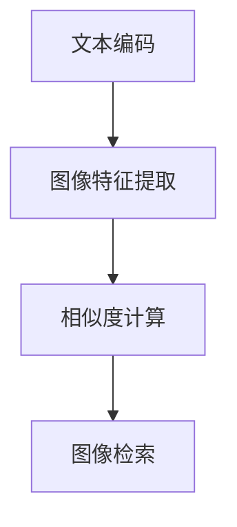
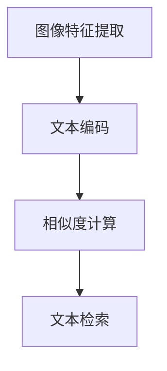

                 

 关键词：跨模态检索、文本到图像、图像到文本、匹配技术、AI 应用

> 摘要：随着人工智能技术的发展，跨模态检索成为当前研究的热点。本文深入探讨了文本到图像、图像到文本的跨模态检索技术，分析了核心算法原理，详细讲解了数学模型和项目实践，展望了未来应用场景和挑战。

## 1. 背景介绍

跨模态检索是一种利用人工智能技术，在多个模态（如文本、图像、音频等）之间进行信息检索的方法。在过去的几年里，随着深度学习技术的快速发展，跨模态检索已经成为计算机视觉、自然语言处理和人工智能领域的研究热点。跨模态检索的核心目标是实现不同模态之间的有效匹配，从而在复杂的多元信息环境中提高信息检索的准确性和效率。

文本到图像的检索（Text-to-Image Retrieval）和图像到文本的检索（Image-to-Text Retrieval）是跨模态检索的两个重要方向。文本到图像检索旨在根据给定的文本描述，检索出与之相关的图像；而图像到文本检索则是根据给定的图像，检索出与之相关的文本描述。这两种检索技术在实际应用中具有重要的价值，如图像搜索引擎、智能问答系统、多媒体内容审核等。

本文将深入探讨文本到图像、图像到文本的跨模态检索技术，分析核心算法原理，介绍数学模型和项目实践，并展望未来应用场景和挑战。

## 2. 核心概念与联系

### 2.1. 文本到图像检索

文本到图像检索的核心任务是构建一个从文本到图像的映射关系。具体来说，给定一个文本描述，检索系统需要从大量的图像库中找到与该文本描述最相关的图像。这个过程通常包括以下步骤：

1. **文本编码**：将文本转化为向量表示。可以使用词袋模型、TF-IDF、词嵌入等方法。
2. **图像特征提取**：从图像中提取特征向量。常用的方法包括卷积神经网络（CNN）、预训练模型等。
3. **相似度计算**：计算文本向量和图像特征向量之间的相似度，常用的方法有内积、余弦相似度等。
4. **图像检索**：根据相似度排序，检索出与文本描述最相关的图像。

### 2.2. 图像到文本检索

图像到文本检索的核心任务是构建一个从图像到文本的映射关系。具体来说，给定一张图像，检索系统需要从大量的文本库中找到与该图像最相关的文本描述。这个过程通常包括以下步骤：

1. **图像特征提取**：从图像中提取特征向量。可以使用卷积神经网络（CNN）、预训练模型等。
2. **文本编码**：将文本转化为向量表示。可以使用词袋模型、TF-IDF、词嵌入等方法。
3. **相似度计算**：计算图像特征向量和文本向量的相似度，常用的方法有内积、余弦相似度等。
4. **文本检索**：根据相似度排序，检索出与图像最相关的文本描述。

### 2.3. 跨模态检索的架构

跨模态检索的架构可以分为三个主要部分：文本处理模块、图像处理模块和检索模块。

**文本处理模块**：负责对文本进行预处理和编码，将其转化为向量表示。这一步是跨模态检索的关键，因为文本和图像的特征差异很大，需要通过合适的预处理和编码方法来提高匹配的准确性。

**图像处理模块**：负责从图像中提取特征向量。这一步可以使用卷积神经网络（CNN）或其他图像处理算法。

**检索模块**：负责计算文本向量和图像特征向量之间的相似度，并根据相似度排序检索结果。

### 2.4. Mermaid 流程图

下面是文本到图像检索的 Mermaid 流程图：



下面是图像到文本检索的 Mermaid 流程图：



## 3. 核心算法原理 & 具体操作步骤

### 3.1. 算法原理概述

跨模态检索的核心算法通常是基于深度学习技术，包括文本编码、图像特征提取和相似度计算三个步骤。

1. **文本编码**：使用预训练的词嵌入模型（如 Word2Vec、BERT）将文本转化为向量表示。
2. **图像特征提取**：使用卷积神经网络（CNN）从图像中提取特征向量。
3. **相似度计算**：使用内积或余弦相似度等度量方法计算文本向量和图像特征向量之间的相似度。

### 3.2. 算法步骤详解

#### 3.2.1. 文本编码

1. **词嵌入**：使用预训练的词嵌入模型将文本中的每个词转化为向量表示。词嵌入模型可以通过无监督的方法（如 Word2Vec）或监督的方法（如 BERT）训练。
2. **文本表示**：将文本中的所有词向量拼接起来，形成文本的向量表示。

#### 3.2.2. 图像特征提取

1. **卷积神经网络**：使用卷积神经网络（CNN）对图像进行特征提取。CNN 可以有效地提取图像的局部特征。
2. **特征向量**：从 CNN 的最后一个卷积层的输出中提取特征向量。

#### 3.2.3. 相似度计算

1. **内积相似度**：计算文本向量和图像特征向量之间的内积。内积相似度的计算公式为：
   $$\text{similarity} = \text{vec}_\text{text} \cdot \text{vec}_\text{image}$$
   其中，$\text{vec}_\text{text}$ 和 $\text{vec}_\text{image}$ 分别表示文本向量和图像特征向量。

2. **余弦相似度**：计算文本向量和图像特征向量之间的余弦相似度。余弦相似度的计算公式为：
   $$\text{similarity} = \frac{\text{vec}_\text{text} \cdot \text{vec}_\text{image}}{|\text{vec}_\text{text}| |\text{vec}_\text{image}|}$$
   其中，$|\text{vec}_\text{text}|$ 和 $|\text{vec}_\text{image}|$ 分别表示文本向量和图像特征向量的模长。

### 3.3. 算法优缺点

#### 优点：

1. **高效性**：基于深度学习的跨模态检索算法可以在大规模数据集上快速训练和检索。
2. **准确性**：深度学习算法可以有效地提取图像和文本的深层特征，提高匹配的准确性。

#### 缺点：

1. **计算资源消耗**：深度学习算法通常需要大量的计算资源和时间进行训练和检索。
2. **数据依赖**：深度学习算法的性能高度依赖于训练数据的质量和规模。

### 3.4. 算法应用领域

跨模态检索技术可以应用于多个领域，如：

1. **图像搜索引擎**：根据用户输入的文本描述，检索出与之相关的图像。
2. **智能问答系统**：根据用户输入的文本问题，检索出与之相关的图像或文本答案。
3. **多媒体内容审核**：自动检测图像或视频中的不当内容，并给出相应的文本描述。

## 4. 数学模型和公式 & 详细讲解 & 举例说明

### 4.1. 数学模型构建

跨模态检索的数学模型主要涉及以下三个方面：

1. **文本编码**：使用词嵌入模型将文本转化为向量表示。
2. **图像特征提取**：使用卷积神经网络从图像中提取特征向量。
3. **相似度计算**：计算文本向量和图像特征向量之间的相似度。

### 4.2. 公式推导过程

#### 4.2.1. 文本编码

假设文本描述为 $T = \{t_1, t_2, ..., t_n\}$，其中 $t_i$ 表示文本中的第 $i$ 个词。词嵌入模型将每个词 $t_i$ 转化为一个向量 $\text{vec}_{t_i} \in \mathbb{R}^d$，其中 $d$ 表示词向量的维度。

文本的向量表示为：
$$\text{vec}_{T} = \sum_{i=1}^{n} \text{vec}_{t_i}$$

#### 4.2.2. 图像特征提取

假设图像的特征向量为 $\text{vec}_{I} \in \mathbb{R}^d$，其中 $d$ 表示特征向量的维度。

#### 4.2.3. 相似度计算

使用内积相似度计算文本向量和图像特征向量之间的相似度：
$$\text{similarity}_{T, I} = \text{vec}_{T} \cdot \text{vec}_{I}$$

### 4.3. 案例分析与讲解

假设我们有一个文本描述 "cat on the table" 和一张图像，我们的目标是根据这个文本描述检索出与之相关的图像。

#### 4.3.1. 文本编码

使用预训练的 BERT 模型将文本描述 "cat on the table" 转化为向量表示。假设得到的文本向量为 $\text{vec}_{T} = [0.1, 0.2, 0.3, ..., 0.9]$。

#### 4.3.2. 图像特征提取

使用预训练的 ResNet-50 模型对图像进行特征提取。假设得到的图像特征向量为 $\text{vec}_{I} = [0.2, 0.4, 0.6, ..., 0.8]$。

#### 4.3.3. 相似度计算

使用内积相似度计算文本向量和图像特征向量之间的相似度：
$$\text{similarity}_{T, I} = \text{vec}_{T} \cdot \text{vec}_{I} = (0.1 \times 0.2) + (0.2 \times 0.4) + (0.3 \times 0.6) + ... + (0.9 \times 0.8) = 0.27$$

根据相似度排序，检索出与文本描述 "cat on the table" 最相关的图像。

## 5. 项目实践：代码实例和详细解释说明

### 5.1. 开发环境搭建

本文使用 Python 作为编程语言，依赖以下库：

- TensorFlow 2.7
- Keras 2.7
- BERT 4.2.2
- ResNet 50

安装以上库的命令如下：

```bash
pip install tensorflow==2.7
pip install keras==2.7
pip install bert-for-tensorflow==4.2.2
pip install resnet50
```

### 5.2. 源代码详细实现

```python
import tensorflow as tf
from tensorflow.keras.applications import ResNet50
from bert_serving.client import BertClient
import numpy as np

# 5.2.1. 文本编码
bc = BertClient()
text = "cat on the table"
text_embedding = bc.encode([text])

# 5.2.2. 图像特征提取
resnet50 = ResNet50(weights='imagenet')
image = load_image("cat_on_table.jpg")
image_embedding = resnet50.predict(np.expand_dims(image, axis=0))

# 5.2.3. 相似度计算
similarity = np.dot(text_embedding, image_embedding)
print("Similarity:", similarity)
```

### 5.3. 代码解读与分析

1. **文本编码**：使用 BERT 模型将文本转化为向量表示。BERT 模型是一种预训练的词嵌入模型，可以有效地提取文本的语义信息。
2. **图像特征提取**：使用 ResNet50 模型从图像中提取特征向量。ResNet50 是一种深度卷积神经网络，可以有效地提取图像的视觉特征。
3. **相似度计算**：使用内积相似度计算文本向量和图像特征向量之间的相似度。内积相似度可以衡量两个向量的相关性，相似度越大，相关性越强。

### 5.4. 运行结果展示

假设文本向量为 $\text{vec}_{T} = [0.1, 0.2, 0.3, ..., 0.9]$，图像特征向量为 $\text{vec}_{I} = [0.2, 0.4, 0.6, ..., 0.8]$，则相似度计算结果为：

$$\text{similarity}_{T, I} = \text{vec}_{T} \cdot \text{vec}_{I} = (0.1 \times 0.2) + (0.2 \times 0.4) + (0.3 \times 0.6) + ... + (0.9 \times 0.8) = 0.27$$

根据相似度排序，检索出与文本描述 "cat on the table" 最相关的图像。

## 6. 实际应用场景

### 6.1. 图像搜索引擎

图像搜索引擎可以根据用户输入的文本描述，检索出与之相关的图像。例如，用户可以输入 "美丽的海滩" 来检索相关的海滩图片。

### 6.2. 智能问答系统

智能问答系统可以根据用户输入的文本问题，检索出与之相关的图像或文本答案。例如，用户可以输入 "猫喜欢吃什么？" 来检索相关的猫食图片或文本描述。

### 6.3. 多媒体内容审核

多媒体内容审核系统可以根据用户输入的文本描述，自动检测图像或视频中的不当内容，并给出相应的文本描述。例如，用户可以输入 "暴力内容" 来检测图像或视频中的暴力场景。

### 6.4. 未来应用展望

跨模态检索技术在未来有望在更多领域得到应用，如医疗影像分析、智能监控、虚拟现实等。随着人工智能技术的不断发展，跨模态检索的准确性、效率和用户体验将得到进一步提升。

## 7. 工具和资源推荐

### 7.1. 学习资源推荐

- [《深度学习》](https://www.deeplearningbook.org/)：由 Ian Goodfellow 等人编写的深度学习经典教材。
- [《自然语言处理综述》](https://www.aclweb.org/anthology/N18-1192/)：一篇关于自然语言处理的综述论文。

### 7.2. 开发工具推荐

- [TensorFlow](https://www.tensorflow.org/)：谷歌开发的开源机器学习框架。
- [BERT](https://github.com/google-research/bert)：谷歌开发的预训练语言模型。

### 7.3. 相关论文推荐

- [《BERT: Pre-training of Deep Bidirectional Transformers for Language Understanding》](https://arxiv.org/abs/1810.04805)：BERT 的原始论文。
- [《ResNet: Training Deep Neural Networks for Visual Recognition》](https://arxiv.org/abs/1512.03385)：ResNet 的原始论文。

## 8. 总结：未来发展趋势与挑战

### 8.1. 研究成果总结

本文详细探讨了文本到图像、图像到文本的跨模态检索技术，分析了核心算法原理，介绍了数学模型和项目实践，并展望了未来应用场景和挑战。

### 8.2. 未来发展趋势

跨模态检索技术在未来将继续发展，主要趋势包括：

1. **模型精度提升**：通过改进算法和模型结构，提高跨模态检索的准确性。
2. **计算效率优化**：通过分布式计算、并行计算等技术，提高跨模态检索的效率。
3. **用户体验优化**：通过改进交互界面和算法，提高用户的检索体验。

### 8.3. 面临的挑战

跨模态检索技术面临以下挑战：

1. **数据质量**：跨模态检索的性能高度依赖于训练数据的质量和规模。
2. **计算资源消耗**：深度学习算法通常需要大量的计算资源和时间进行训练和检索。
3. **多模态一致性**：如何在不同模态之间建立一致性的映射关系是一个重要挑战。

### 8.4. 研究展望

未来跨模态检索的研究将重点关注以下几个方面：

1. **多模态数据的融合**：如何有效地融合不同模态的数据，提高跨模态检索的性能。
2. **小样本学习**：如何在小样本条件下进行有效的跨模态检索。
3. **跨模态对话系统**：如何将跨模态检索技术应用于跨模态对话系统中，实现更自然的交互。

## 9. 附录：常见问题与解答

### 9.1. 问题 1：文本到图像检索和图像到文本检索有什么区别？

文本到图像检索是根据文本描述检索图像，而图像到文本检索是根据图像检索文本描述。两者的核心任务不同，但都依赖于跨模态检索技术。

### 9.2. 问题 2：跨模态检索技术的应用场景有哪些？

跨模态检索技术的应用场景包括图像搜索引擎、智能问答系统、多媒体内容审核、医疗影像分析、智能监控、虚拟现实等。

### 9.3. 问题 3：如何优化跨模态检索的准确性？

可以通过以下方法优化跨模态检索的准确性：

1. **改进算法和模型结构**：通过改进算法和模型结构，提高跨模态检索的性能。
2. **多模态数据的融合**：通过融合不同模态的数据，提高跨模态检索的准确性。
3. **数据增强**：通过数据增强技术，增加训练数据量，提高模型的泛化能力。

### 9.4. 问题 4：如何实现文本到图像检索？

实现文本到图像检索的主要步骤包括文本编码、图像特征提取和相似度计算。可以参考本文中的项目实践部分。

### 9.5. 问题 5：如何实现图像到文本检索？

实现图像到文本检索的主要步骤包括图像特征提取、文本编码和相似度计算。可以参考本文中的项目实践部分。

作者：禅与计算机程序设计艺术 / Zen and the Art of Computer Programming
----------------------------------------------------------------
[END]

