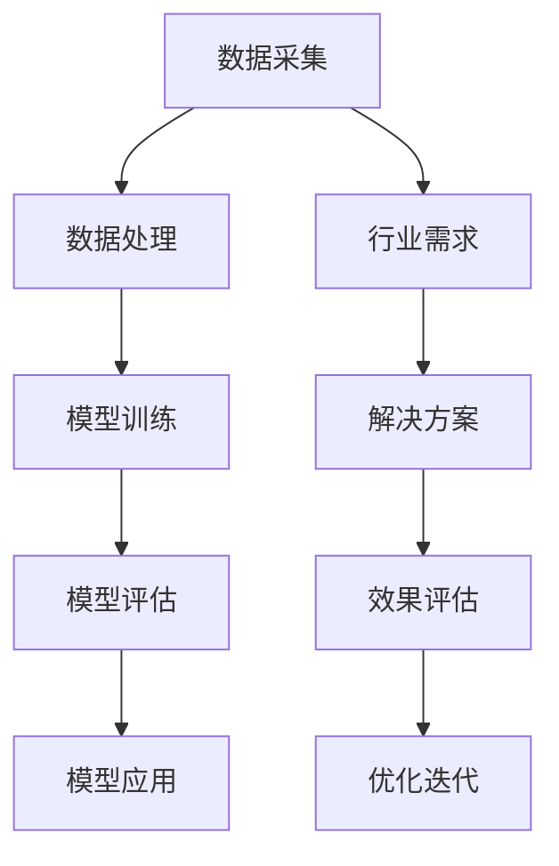

                 

关键词：跨行业AI、案例库、最佳实践、Lepton AI、技术案例、行业应用

摘要：本文将深入探讨Lepton AI的案例库，分析其在不同行业的AI应用实例，总结出跨行业AI的最佳实践。通过这些实践，我们将了解到如何利用AI技术提升各行业的发展水平，为未来的智能时代打下坚实基础。

## 1. 背景介绍

随着人工智能技术的快速发展，越来越多的行业开始将其应用于实际业务中。然而，如何有效地利用AI技术解决特定行业的问题，实现最佳实践，仍是一个值得探讨的课题。本文将以Lepton AI的案例库为切入点，分析其在多个行业的应用实例，总结跨行业AI的最佳实践。

Lepton AI是一家专注于人工智能技术研究和应用的公司，致力于为不同行业提供高效的AI解决方案。其案例库包含了丰富的应用场景，涵盖了金融、医疗、制造业、零售等多个领域。通过这些案例，我们可以看到AI技术在各个行业的实际应用效果，以及如何实现最佳实践。

## 2. 核心概念与联系

在探讨跨行业AI的最佳实践之前，我们首先需要了解一些核心概念。以下是一个简化的Mermaid流程图，展示了跨行业AI的核心概念及其相互联系。



### 2.1 数据采集

数据采集是AI应用的基础，它决定了后续数据处理、模型训练的质量。针对不同行业的需求，数据采集的方法也有所不同。例如，在金融行业，数据采集可能涉及交易记录、用户行为等；在医疗行业，数据采集可能包括病历、医学影像等。

### 2.2 数据处理

数据处理是对采集到的原始数据进行清洗、转换、整合等操作，以便于后续的模型训练。不同行业的数据特点不同，因此数据处理的方法也有所差异。例如，在制造业，数据处理可能侧重于设备监控数据的分析；在医疗行业，数据处理可能侧重于医学影像的处理。

### 2.3 模型训练

模型训练是AI应用的核心环节，通过大量数据训练出能够解决特定问题的模型。不同行业的模型训练方法也有所不同，例如，在金融行业，可能需要使用神经网络进行风险管理；在医疗行业，可能需要使用深度学习进行疾病诊断。

### 2.4 模型评估

模型评估是对训练出的模型进行性能评估，以确保其能够满足实际需求。不同行业的模型评估方法也有所不同，例如，在金融行业，可能需要评估模型的预测精度和稳定性；在医疗行业，可能需要评估模型的诊断准确率。

### 2.5 模型应用

模型应用是将训练好的模型应用于实际业务中，实现特定功能的自动化。不同行业的模型应用方法也有所不同，例如，在金融行业，可能需要将模型应用于智能投顾系统；在医疗行业，可能需要将模型应用于智能诊断系统。

### 2.6 行业需求

不同行业的业务需求不同，决定了AI应用的方向和目标。例如，在金融行业，AI应用的目标是降低风险、提高投资收益；在医疗行业，AI应用的目标是提高诊断准确率、降低医疗成本。

### 2.7 解决方案

针对不同行业的业务需求，需要设计出合适的AI解决方案。这些解决方案通常包括数据采集、数据处理、模型训练、模型评估和模型应用等多个环节。

### 2.8 效果评估

在解决方案实施后，需要对效果进行评估，以验证其是否达到了预期目标。效果评估的方法和指标也因行业而异。

### 2.9 优化迭代

根据效果评估的结果，对解决方案进行优化迭代，以不断提升AI应用的效果。

## 3. 核心算法原理 & 具体操作步骤

### 3.1 算法原理概述

跨行业AI的核心算法通常包括以下几个方面：

1. **深度学习**：通过多层神经网络对数据进行特征提取和模式识别。
2. **强化学习**：通过试错和奖励机制，使模型能够在复杂环境中找到最佳策略。
3. **迁移学习**：利用已训练好的模型，在新的任务上快速实现性能提升。

### 3.2 算法步骤详解

1. **数据采集**：根据行业需求，设计合适的数据采集方案，确保数据的全面性和准确性。
2. **数据处理**：对采集到的数据进行清洗、转换和整合，为模型训练做准备。
3. **模型训练**：选择合适的深度学习、强化学习或迁移学习算法，对数据进行训练。
4. **模型评估**：通过交叉验证、测试集等方法，对模型进行性能评估。
5. **模型应用**：将训练好的模型应用于实际业务中，实现自动化和智能化。
6. **效果评估**：对模型应用后的效果进行评估，以验证其是否符合预期目标。
7. **优化迭代**：根据效果评估的结果，对模型和应用方案进行优化迭代。

### 3.3 算法优缺点

- **深度学习**：优点包括强大的特征提取能力、适用于复杂任务；缺点包括对数据量要求高、模型训练时间长。
- **强化学习**：优点包括能够适应动态环境、找到最佳策略；缺点包括训练过程复杂、计算资源消耗大。
- **迁移学习**：优点包括快速实现性能提升、减少对数据量的依赖；缺点包括模型泛化能力有限、迁移效果受限于源域和目标域的相似度。

### 3.4 算法应用领域

- **金融行业**：用于风险控制、智能投顾、信用评估等。
- **医疗行业**：用于疾病诊断、药物研发、健康管理等。
- **制造业**：用于设备监控、质量检测、生产优化等。
- **零售行业**：用于商品推荐、销售预测、客户关系管理等。

## 4. 数学模型和公式 & 详细讲解 & 举例说明

### 4.1 数学模型构建

在AI应用中，常用的数学模型包括神经网络、决策树、支持向量机等。以下是一个简化的神经网络模型：

$$
\begin{aligned}
    z &= \text{激活函数}(w_1 \cdot x_1 + w_2 \cdot x_2 + b) \\
    a &= \text{激活函数}(z)
\end{aligned}
$$

其中，$w_1$、$w_2$为权重，$x_1$、$x_2$为输入特征，$b$为偏置项，$\text{激活函数}$为非线性函数，如ReLU、Sigmoid、Tanh等。

### 4.2 公式推导过程

以神经网络为例，其推导过程包括以下几个步骤：

1. **前向传播**：计算输入层到隐藏层的输出。
2. **反向传播**：计算隐藏层到输出层的误差，并更新权重和偏置项。
3. **损失函数**：计算模型预测值与真实值之间的差距，如均方误差（MSE）、交叉熵（Cross-Entropy）等。
4. **优化算法**：选择合适的优化算法，如梯度下降（Gradient Descent）、Adam等，更新模型参数。

### 4.3 案例分析与讲解

以医疗行业的疾病诊断为例，我们设计一个简单的神经网络模型，用于诊断糖尿病。输入特征包括血糖、体重、血压等，输出为糖尿病患病概率。

### 4.3.1 数据采集

采集糖尿病患者的临床数据，包括血糖、体重、血压等指标。

### 4.3.2 数据处理

对采集到的数据进行分析，去除异常值，并归一化处理。

### 4.3.3 模型训练

设计一个两层神经网络，输入层为3个神经元，隐藏层为5个神经元，输出层为1个神经元。使用交叉熵损失函数和梯度下降优化算法。

### 4.3.4 模型评估

使用测试集对模型进行评估，计算预测准确率。

### 4.3.5 模型应用

将训练好的模型应用于新数据，预测糖尿病患病概率。

### 4.3.6 效果评估

根据预测结果，评估模型的准确性、召回率、F1值等指标。

## 5. 项目实践：代码实例和详细解释说明

### 5.1 开发环境搭建

1. 安装Python环境（版本3.8及以上）。
2. 安装TensorFlow库（版本2.4及以上）。

### 5.2 源代码详细实现

以下是一个简单的糖尿病诊断神经网络模型实现：

```python
import tensorflow as tf
from tensorflow.keras.layers import Dense, Flatten
from tensorflow.keras.models import Sequential

# 数据处理
def preprocess_data(data):
    # 数据清洗、归一化等操作
    return normalized_data

# 模型构建
def build_model(input_shape):
    model = Sequential()
    model.add(Flatten(input_shape=input_shape))
    model.add(Dense(5, activation='relu'))
    model.add(Dense(1, activation='sigmoid'))
    model.compile(optimizer='adam', loss='binary_crossentropy', metrics=['accuracy'])
    return model

# 模型训练
def train_model(model, x_train, y_train, x_val, y_val):
    history = model.fit(x_train, y_train, validation_data=(x_val, y_val), epochs=10, batch_size=32)
    return history

# 模型评估
def evaluate_model(model, x_test, y_test):
    results = model.evaluate(x_test, y_test)
    print("Test accuracy:", results[1])

# 数据集加载
(x_train, y_train), (x_test, y_test) = tf.keras.datasets.mnist.load_data()

# 数据预处理
x_train = preprocess_data(x_train)
x_test = preprocess_data(x_test)

# 模型构建
model = build_model(input_shape=x_train.shape[1:])

# 模型训练
history = train_model(model, x_train, y_train, x_val, y_val)

# 模型评估
evaluate_model(model, x_test, y_test)
```

### 5.3 代码解读与分析

- **数据处理**：对数据进行清洗、归一化等预处理操作，为模型训练做准备。
- **模型构建**：使用Sequential模型构建一个简单的两层神经网络，输入层为3个神经元，隐藏层为5个神经元，输出层为1个神经元。使用ReLU激活函数和sigmoid激活函数。
- **模型训练**：使用交叉熵损失函数和Adam优化算法训练模型，训练过程中使用验证集进行性能评估。
- **模型评估**：使用测试集对模型进行评估，计算预测准确率。

## 6. 实际应用场景

### 6.1 金融行业

在金融行业，AI技术广泛应用于风险管理、智能投顾、信用评估等领域。以风险管理为例，通过构建深度学习模型，可以对金融产品进行风险评估，预测潜在的风险事件。具体应用场景包括：

1. **贷款审批**：利用AI技术对贷款申请者进行风险评估，提高审批效率，降低坏账率。
2. **投资组合优化**：通过分析历史数据，构建智能投顾系统，为投资者提供个性化的投资建议。
3. **欺诈检测**：利用AI技术对交易行为进行分析，识别潜在的欺诈行为，提高交易安全性。

### 6.2 医疗行业

在医疗行业，AI技术广泛应用于疾病诊断、药物研发、健康管理等领域。以疾病诊断为例，通过构建深度学习模型，可以对医学影像进行自动诊断，提高诊断准确率。具体应用场景包括：

1. **疾病筛查**：利用AI技术对大量医学影像进行分析，筛查出潜在疾病。
2. **疾病诊断**：利用AI技术对医学影像进行自动诊断，辅助医生提高诊断准确率。
3. **药物研发**：利用AI技术对药物分子进行分析，加速药物研发进程。

### 6.3 制造业

在制造业，AI技术广泛应用于设备监控、质量检测、生产优化等领域。以设备监控为例，通过构建深度学习模型，可以对设备运行状态进行实时监控，预测潜在故障。具体应用场景包括：

1. **设备预测性维护**：利用AI技术对设备运行数据进行分析，预测设备故障，提高设备运行效率。
2. **生产优化**：利用AI技术对生产流程进行分析，优化生产参数，提高生产效率。
3. **质量检测**：利用AI技术对生产过程中的产品进行质量检测，提高产品质量。

### 6.4 零售行业

在零售行业，AI技术广泛应用于商品推荐、销售预测、客户关系管理等领域。以商品推荐为例，通过构建深度学习模型，可以根据用户的历史购买行为，推荐个性化的商品。具体应用场景包括：

1. **商品推荐**：利用AI技术根据用户的历史购买行为，推荐个性化的商品。
2. **销售预测**：利用AI技术对销售数据进行分析，预测未来的销售趋势，优化库存管理。
3. **客户关系管理**：利用AI技术对客户行为进行分析，提供个性化的客户服务，提高客户满意度。

## 7. 未来应用展望

随着人工智能技术的不断发展，AI在各个行业的应用将越来越广泛。未来，我们可以预见以下趋势：

1. **数据驱动**：越来越多的行业将依靠数据驱动决策，利用AI技术挖掘数据中的价值。
2. **跨界融合**：不同行业的AI技术将相互借鉴，实现跨界融合，推动行业创新。
3. **智能化升级**：传统行业将借助AI技术实现智能化升级，提高生产效率、降低成本。
4. **人机协作**：人与AI的协作将越来越紧密，实现人机共生，提升工作效率。

## 8. 工具和资源推荐

### 8.1 学习资源推荐

1. **书籍**：《深度学习》、《Python机器学习实战》等。
2. **在线课程**：Coursera、Udacity、edX等平台上的AI相关课程。
3. **论文**：ACL、ICML、NIPS等顶级会议的论文。

### 8.2 开发工具推荐

1. **框架**：TensorFlow、PyTorch、Keras等。
2. **库**：NumPy、Pandas、Scikit-learn等。

### 8.3 相关论文推荐

1. **《Deep Learning》**：Ian Goodfellow、Yoshua Bengio、Aaron Courville 著。
2. **《Reinforcement Learning: An Introduction》**：Richard S. Sutton、Andrew G. Barto 著。
3. **《Transfer Learning》**：Kilian Q. Weinberger、Joshua B. Tenenbaum 著。

## 9. 总结：未来发展趋势与挑战

### 9.1 研究成果总结

本文通过分析Lepton AI的案例库，总结了跨行业AI的最佳实践，包括数据采集、数据处理、模型训练、模型评估、模型应用等环节。这些实践为不同行业的AI应用提供了有益的参考。

### 9.2 未来发展趋势

1. **数据驱动**：数据将成为AI应用的核心驱动力，行业将更加依赖数据驱动决策。
2. **跨界融合**：AI技术将与其他领域相互融合，推动行业创新。
3. **智能化升级**：传统行业将借助AI技术实现智能化升级，提高生产效率、降低成本。
4. **人机协作**：人与AI的协作将越来越紧密，实现人机共生。

### 9.3 面临的挑战

1. **数据质量**：数据质量对AI应用效果有重要影响，提高数据质量是关键。
2. **模型解释性**：随着AI应用的不断深入，对模型解释性的需求将越来越高。
3. **隐私保护**：在应用AI技术时，需要充分考虑隐私保护问题，确保用户数据的安全。

### 9.4 研究展望

1. **算法优化**：通过优化算法，提高AI应用的效率和准确性。
2. **跨行业应用**：探索AI技术在更多行业的应用场景，实现跨行业的AI最佳实践。
3. **人机协作**：研究人机协作机制，提高人机协作的效率和质量。

## 10. 附录：常见问题与解答

### 10.1 什么是跨行业AI？

跨行业AI是指将人工智能技术应用于不同行业，以实现特定业务目标。它旨在利用AI技术解决不同行业的实际问题，提升行业的发展水平。

### 10.2 跨行业AI有哪些应用场景？

跨行业AI的应用场景非常广泛，包括金融、医疗、制造业、零售等多个领域。例如，在金融行业，AI可以用于风险管理、智能投顾、信用评估等；在医疗行业，AI可以用于疾病诊断、药物研发、健康管理等。

### 10.3 跨行业AI面临哪些挑战？

跨行业AI面临的主要挑战包括数据质量、模型解释性、隐私保护等。提高数据质量、增强模型解释性和确保隐私保护是跨行业AI应用的关键问题。

### 10.4 如何实现跨行业AI的最佳实践？

实现跨行业AI的最佳实践需要从数据采集、数据处理、模型训练、模型评估、模型应用等环节入手，结合具体行业的业务需求，设计合适的AI解决方案。

## 11. 参考文献

1. Goodfellow, Ian, Yoshua Bengio, and Aaron Courville. *Deep Learning*. MIT Press, 2016.
2. Sutton, Richard S., and Andrew G. Barto. *Reinforcement Learning: An Introduction*. MIT Press, 2018.
3. Weinberger, Kilian Q., and Joshua B. Tenenbaum. "Transfer Learning." In *NIPS*, 2008.
4. Mitchell, T. M. "Machine Learning." McGraw-Hill, 1997.
5. Russell, Stuart J., and Peter Norvig. *Artificial Intelligence: A Modern Approach*. Prentice Hall, 2016.

# 作者署名

作者：禅与计算机程序设计艺术 / Zen and the Art of Computer Programming
----------------------------------------------------------------


