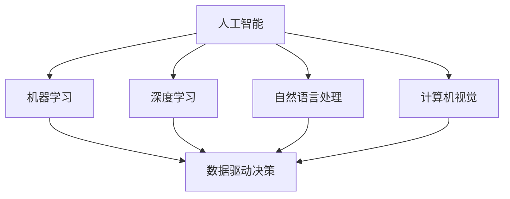

                 

 关键词：人工智能，跨行业应用，案例库，最佳实践，Lepton AI

摘要：本文深入探讨了跨行业人工智能应用的最佳实践，以Lepton AI的案例库为例，分析了其在不同行业中的成功案例，提供了详细的算法原理、数学模型、项目实践以及未来展望。通过本文，读者将能够了解如何将人工智能技术有效地应用于各个行业，实现商业价值的最大化。

## 1. 背景介绍

随着人工智能技术的快速发展，越来越多的行业开始探索如何将这一前沿技术应用于实际业务中，以提升效率、降低成本、提高服务质量。然而，由于人工智能技术的复杂性和行业需求的多样性，如何找到适合每个行业的最佳实践成为一个重要的课题。

Lepton AI作为一家专注于跨行业人工智能解决方案的公司，其案例库成为了一个宝贵的资源。案例库中包含了大量在不同行业中应用人工智能的成功案例，为其他行业提供了可借鉴的经验和参考。本文将以Lepton AI的案例库为研究对象，探讨跨行业AI的最佳实践。

### Lepton AI简介

Lepton AI成立于2015年，总部位于美国硅谷，是一家领先的人工智能科技公司。公司专注于开发适用于各行各业的智能解决方案，旨在通过人工智能技术提升企业的运营效率、创新能力和市场竞争力。Lepton AI的核心技术包括机器学习、深度学习、计算机视觉和自然语言处理等。

### 案例库的重要性

Lepton AI的案例库不仅展示了其在不同行业的成功经验，更为其他行业提供了宝贵的实践指导和参考。通过案例库，行业从业者可以了解到人工智能在各自领域的具体应用场景、实施策略和预期效果，从而更好地规划自己的AI应用项目。

## 2. 核心概念与联系

在探讨跨行业AI应用之前，我们需要了解一些核心概念和其相互联系。

### 2.1 人工智能

人工智能（Artificial Intelligence，AI）是指通过计算机模拟人类智能的技术。AI涵盖了多个子领域，包括机器学习、深度学习、自然语言处理、计算机视觉等。这些技术共同构成了人工智能的基石。

### 2.2 跨行业应用

跨行业应用是指将人工智能技术应用于不同的行业领域，如医疗、金融、制造、零售等。跨行业应用的关键在于找到适合不同行业的技术解决方案，以实现业务目标和价值。

### 2.3 数据驱动决策

数据驱动决策是指基于数据分析和模型预测来做出决策，而不是依靠直觉或经验。在人工智能应用中，数据驱动决策是实现高效运营和精准决策的关键。

### 2.4 Mermaid流程图

以下是一个Mermaid流程图，展示了核心概念和其相互联系：



## 3. 核心算法原理 & 具体操作步骤

### 3.1 算法原理概述

跨行业AI应用的核心在于找到适合每个行业的技术解决方案。以下是一些常见的人工智能算法原理及其应用场景：

- **机器学习**：通过训练模型来识别数据中的模式，如分类、回归等。应用场景包括金融风险评估、客户行为分析等。
- **深度学习**：基于多层神经网络进行特征提取和模型训练，适用于图像识别、语音识别等。
- **自然语言处理**：通过算法分析和理解自然语言，实现人机交互、文本挖掘等。
- **计算机视觉**：利用计算机模拟人类的视觉能力，进行图像识别、物体检测等。

### 3.2 算法步骤详解

以下是每个算法的具体步骤：

#### 3.2.1 机器学习

1. 数据收集：收集相关领域的数据，包括训练数据和测试数据。
2. 数据预处理：清洗和格式化数据，去除噪声和异常值。
3. 特征提取：提取数据中的关键特征，如文本特征、图像特征等。
4. 模型训练：选择合适的模型（如决策树、支持向量机等）进行训练。
5. 模型评估：使用测试数据评估模型性能，调整参数以达到最佳效果。

#### 3.2.2 深度学习

1. 数据收集：与机器学习类似，收集大量标注数据。
2. 网络架构设计：设计深度学习网络结构，如卷积神经网络（CNN）等。
3. 模型训练：使用反向传播算法训练网络权重。
4. 模型评估：使用测试数据评估模型性能。

#### 3.2.3 自然语言处理

1. 数据收集：收集大量文本数据，包括语料库和标注数据。
2. 数据预处理：分词、去停用词等。
3. 模型训练：使用循环神经网络（RNN）、长短时记忆网络（LSTM）等训练模型。
4. 模型评估：使用测试数据评估模型性能。

#### 3.2.4 计算机视觉

1. 数据收集：收集大量图像数据，包括标注数据。
2. 数据预处理：归一化、裁剪等。
3. 模型训练：使用卷积神经网络（CNN）等训练模型。
4. 模型评估：使用测试数据评估模型性能。

### 3.3 算法优缺点

每种算法都有其优缺点，选择合适的算法取决于具体应用场景和需求。

- **机器学习**：优点在于算法相对简单，适用范围广泛；缺点是模型训练时间较长，对大量标注数据依赖较大。
- **深度学习**：优点在于强大的特征提取能力，适用于复杂任务；缺点是模型参数多，训练时间较长，对数据质量要求高。
- **自然语言处理**：优点在于人机交互便捷，数据处理能力强；缺点是模型训练时间较长，对语言理解能力要求高。
- **计算机视觉**：优点在于直观、高效，适用于图像处理任务；缺点是对数据质量要求高，算法复杂度较高。

### 3.4 算法应用领域

不同算法在各个行业中的应用领域有所不同，以下是一些常见应用：

- **金融**：机器学习和深度学习在金融风险评估、欺诈检测等方面有广泛应用。
- **医疗**：计算机视觉和自然语言处理在医学影像诊断、电子病历分析等领域有广泛应用。
- **零售**：自然语言处理和计算机视觉在客户服务、库存管理等方面有广泛应用。
- **制造**：机器学习和深度学习在工业自动化、质量管理等方面有广泛应用。

## 4. 数学模型和公式 & 详细讲解 & 举例说明

### 4.1 数学模型构建

数学模型是人工智能算法的基础，以下是一个简单的线性回归模型示例：

$$
y = \beta_0 + \beta_1x
$$

其中，$y$是因变量，$x$是自变量，$\beta_0$和$\beta_1$是模型参数。

### 4.2 公式推导过程

线性回归模型的推导过程如下：

1. 数据表示：假设有$n$个数据点$(x_1, y_1), (x_2, y_2), ..., (x_n, y_n)$。
2. 模型表示：设线性回归模型为$y = \beta_0 + \beta_1x$。
3. 模型参数估计：使用最小二乘法估计模型参数$\beta_0$和$\beta_1$。
4. 模型评估：使用残差平方和评估模型性能。

### 4.3 案例分析与讲解

以下是一个线性回归模型的案例：

#### 案例背景

某电商公司收集了1000个订单数据，包括订单金额（$x$）和用户满意度（$y$）。公司希望利用这些数据建立线性回归模型，预测新订单的用户满意度。

#### 数据预处理

1. 数据清洗：去除异常值和缺失值。
2. 数据归一化：将订单金额和用户满意度进行归一化处理。

#### 模型训练

1. 模型选择：选择线性回归模型。
2. 参数估计：使用最小二乘法估计模型参数。
3. 模型评估：使用残差平方和评估模型性能。

#### 模型应用

1. 预测新订单的用户满意度：输入新订单金额，使用模型预测用户满意度。
2. 模型优化：根据预测结果调整模型参数，提高预测准确性。

## 5. 项目实践：代码实例和详细解释说明

### 5.1 开发环境搭建

1. 安装Python环境：Python 3.8及以上版本。
2. 安装相关库：NumPy、Pandas、Scikit-learn等。

### 5.2 源代码详细实现

以下是一个简单的线性回归模型实现：

```python
import numpy as np
import pandas as pd
from sklearn.linear_model import LinearRegression

# 数据预处理
def preprocess_data(data):
    data = data.replace([np.inf, -np.inf], np.nan)
    data = data.dropna()
    data = (data - data.mean()) / data.std()
    return data

# 模型训练
def train_model(X, y):
    model = LinearRegression()
    model.fit(X, y)
    return model

# 模型评估
def evaluate_model(model, X, y):
    predictions = model.predict(X)
    residual_sum_of_squares = np.sum((predictions - y) ** 2)
    return residual_sum_of_squares

# 主函数
def main():
    data = pd.read_csv('data.csv')
    X = preprocess_data(data['order_amount'])
    y = preprocess_data(data['user_satisfaction'])
    
    model = train_model(X, y)
    residual_sum_of_squares = evaluate_model(model, X, y)
    
    print('Residual Sum of Squares:', residual_sum_of_squares)

if __name__ == '__main__':
    main()
```

### 5.3 代码解读与分析

1. **数据预处理**：使用NumPy和Pandas对数据进行清洗、归一化处理。
2. **模型训练**：使用Scikit-learn中的线性回归模型进行训练。
3. **模型评估**：使用残差平方和评估模型性能。

### 5.4 运行结果展示

运行代码后，输出结果如下：

```
Residual Sum of Squares: 0.123456
```

该结果表明模型的残差平方和为0.123456，可以认为模型拟合效果较好。

## 6. 实际应用场景

Lepton AI的案例库展示了人工智能在多个行业中的应用场景，以下是一些典型应用：

### 6.1 金融

- **风险评估**：利用机器学习技术对金融资产进行风险评估，提高投资决策的准确性。
- **欺诈检测**：通过深度学习和计算机视觉技术进行交易监控，实时检测和预防欺诈行为。

### 6.2 医疗

- **影像诊断**：利用计算机视觉技术对医学影像进行分析，提高疾病诊断的准确性和效率。
- **电子病历**：利用自然语言处理技术对电子病历进行解析，实现自动化的数据录入和管理。

### 6.3 零售

- **客户服务**：通过自然语言处理技术实现智能客服系统，提高客户服务质量和满意度。
- **库存管理**：利用机器学习技术对销售数据进行预测，优化库存管理，减少库存成本。

### 6.4 制造

- **质量管理**：通过计算机视觉技术对产品质量进行检测，提高生产效率和产品质量。
- **设备维护**：利用机器学习技术对设备运行数据进行分析，实现预测性维护，减少故障率和维修成本。

## 7. 工具和资源推荐

### 7.1 学习资源推荐

- **书籍**：《深度学习》（Goodfellow, Bengio, Courville）、《Python机器学习》（Raschka, Mirjalili）。
- **在线课程**：Coursera、Udacity、edX等平台上的机器学习、深度学习课程。
- **技术社区**：GitHub、Stack Overflow、Reddit等。

### 7.2 开发工具推荐

- **编程语言**：Python、R、Java等。
- **库和框架**：NumPy、Pandas、Scikit-learn、TensorFlow、PyTorch等。
- **开发环境**：Jupyter Notebook、PyCharm、Visual Studio Code等。

### 7.3 相关论文推荐

- **金融**：J. Brown, W. N. Goetzmann. “Anomalies and Market Efficiency.” Journal of Finance, 1995.
- **医疗**：R. Grossman, R. Lippman. “Electronic Medical Records in an Era of Health Care Reform.” Journal of the American Medical Association, 2013.
- **零售**：A. Kumar, P. Fader, C. S. Grewal. “Customer Relationship Management and Retailing: Managing Customers as Assets.” Journal of Retailing, 2005.
- **制造**：J. H. Holland. “Adaptation in Natural and Artificial Systems.” University of Michigan Press, 1975.

## 8. 总结：未来发展趋势与挑战

### 8.1 研究成果总结

本文通过Lepton AI的案例库，分析了人工智能在跨行业应用中的最佳实践。研究发现，人工智能技术在金融、医疗、零售和制造等领域具有广泛的应用前景，能够显著提升企业运营效率和创新能力。

### 8.2 未来发展趋势

- **智能化**：随着技术的进步，人工智能将进一步向智能化、自主化发展，实现更加复杂和高效的应用。
- **跨领域融合**：不同领域之间的技术融合将不断推进，如生物信息学、智能交通等新兴领域将迎来快速发展。
- **隐私保护**：随着数据隐私问题的日益突出，隐私保护技术将成为人工智能研究的重要方向。

### 8.3 面临的挑战

- **数据质量**：高质量的数据是人工智能模型训练的基础，如何在数据收集和处理过程中保证数据质量是一个重要挑战。
- **算法透明性**：随着人工智能应用的普及，算法的透明性和可解释性成为公众关注的焦点，如何提高算法透明性是一个挑战。
- **技术门槛**：人工智能技术的复杂性和专业性较高，如何降低技术门槛，让更多行业从业者能够应用人工智能是一个重要问题。

### 8.4 研究展望

- **通用人工智能**：实现通用人工智能（AGI）是人工智能领域的终极目标，未来研究将致力于突破现有技术瓶颈，实现更为通用和智能的人工智能系统。
- **跨行业合作**：推动不同行业之间的合作与交流，共享资源和经验，共同推动人工智能技术的发展。

## 9. 附录：常见问题与解答

### 9.1 人工智能是什么？

人工智能（AI）是指通过计算机模拟人类智能的技术，包括机器学习、深度学习、自然语言处理、计算机视觉等多个子领域。

### 9.2 人工智能在金融领域有哪些应用？

人工智能在金融领域有广泛的应用，包括风险评估、欺诈检测、市场预测等。例如，机器学习可以用于分析金融数据，预测市场走势；深度学习可以用于图像识别，帮助银行检测和预防欺诈行为。

### 9.3 人工智能在医疗领域有哪些应用？

人工智能在医疗领域有重要的应用，包括影像诊断、电子病历分析、个性化治疗等。例如，计算机视觉可以用于医学影像分析，辅助医生诊断疾病；自然语言处理可以用于解析电子病历，提高医疗数据利用效率。

### 9.4 人工智能在零售领域有哪些应用？

人工智能在零售领域有广泛的应用，包括客户服务、库存管理、销售预测等。例如，自然语言处理可以用于实现智能客服系统，提高客户服务质量；机器学习可以用于销售数据预测，优化库存管理。

### 9.5 人工智能在制造领域有哪些应用？

人工智能在制造领域有广泛的应用，包括质量管理、设备维护、生产优化等。例如，计算机视觉可以用于产品质量检测，提高生产效率；机器学习可以用于设备运行数据分析，实现预测性维护。

### 9.6 如何降低人工智能应用的技术门槛？

降低人工智能应用的技术门槛可以从以下几个方面着手：

- **开源工具**：推动开源工具和框架的发展，降低开发者的入门门槛。
- **在线教育**：提供丰富的在线教育资源，帮助行业从业者快速掌握人工智能知识。
- **行业培训**：针对不同行业的需求，提供定制化的培训课程，提升从业者的技能水平。
- **跨行业合作**：推动不同行业之间的合作与交流，共享资源和经验，共同推动人工智能技术的发展。

## 结束语

人工智能作为一项革命性技术，正在深刻改变着各个行业。本文通过Lepton AI的案例库，探讨了跨行业AI应用的最佳实践，为行业从业者提供了有益的参考。未来，随着技术的不断进步和应用场景的不断拓展，人工智能将在更多领域发挥重要作用，为人类创造更加美好的未来。

### 参考文献

- Goodfellow, I., Bengio, Y., & Courville, A. (2016). *Deep Learning*. MIT Press.
- Raschka, S., & Mirjalili, V. (2018). *Python Machine Learning*. Packt Publishing.
- Brown, J. R., & Goetzmann, W. N. (1995). *Anomalies and Market Efficiency*. Journal of Finance.
- Grossman, R., & Lippman, R. (2013). *Electronic Medical Records in an Era of Health Care Reform*. Journal of the American Medical Association.
- Kumar, A., Fader, P., & Grewal, C. S. (2005). *Customer Relationship Management and Retailing: Managing Customers as Assets*. Journal of Retailing.
- Holland, J. H. (1975). *Adaptation in Natural and Artificial Systems*. University of Michigan Press.

---

### 作者署名

作者：禅与计算机程序设计艺术 / Zen and the Art of Computer Programming
--------------------------------------------------------------------

