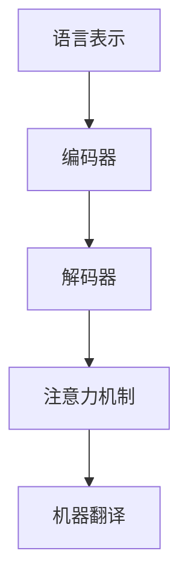

                 

关键词：跨语言AI、多语言支持、模型挑战、技术实现、算法原理、应用领域

> 摘要：随着全球化和互联网的快速发展，多语言数据处理的需求日益增长。跨语言AI模型作为一种前沿技术，旨在实现多语言之间的自然交互和智能处理。然而，多语言支持面临着诸多挑战，本文将深入探讨这些挑战，并分析跨语言AI模型的核心算法原理、数学模型以及未来发展趋势。

## 1. 背景介绍

在当今全球化的背景下，跨语言数据处理的迫切需求促使跨语言AI模型的研究不断深化。这些模型不仅可以处理多语言文本，还能进行自然语言理解、机器翻译、情感分析等复杂任务。然而，多语言支持并非易事，背后隐藏着众多技术挑战。

多语言支持的重要性体现在以下几个方面：

1. **国际交流**：在全球化进程中，多语言交流已成为必不可少的手段。跨语言AI模型能够帮助不同语言背景的用户实现顺畅沟通。
2. **数据多样性**：互联网上存在着大量的多语言数据，对这些数据进行有效处理和分析，可以为各行各业提供丰富的信息资源。
3. **人工智能应用**：随着AI技术的发展，多语言支持成为许多AI应用的基本需求，如智能客服、多语言搜索引擎、智能教育等。

本文将围绕跨语言AI模型的多语言支持挑战，从算法原理、数学模型、项目实践等多个方面进行深入探讨。

## 2. 核心概念与联系

### 2.1 跨语言AI模型概述

跨语言AI模型旨在实现不同语言之间的自然交互和智能处理。其核心目标包括：

1. **自然语言理解**：理解不同语言文本的含义和结构。
2. **机器翻译**：将一种语言文本翻译成另一种语言。
3. **情感分析**：分析不同语言文本的情感倾向。

### 2.2 多语言支持挑战

多语言支持面临的挑战主要包括：

1. **语言多样性**：语言之间存在着巨大的差异，包括词汇、语法、语义等方面。
2. **语言变化**：同一种语言在不同地区、不同人群中有不同的表达方式。
3. **语言习得难度**：对于非母语用户，学习一门语言需要大量的时间和精力。

### 2.3 跨语言AI模型架构

为了实现多语言支持，跨语言AI模型通常采用以下架构：

1. **语言表示**：将不同语言的文本转换为统一的向量表示。
2. **编码器-解码器模型**：用于机器翻译的核心模型，包括编码器、解码器和注意力机制。
3. **多语言学习**：利用多语言数据集进行模型训练，提高模型的多语言处理能力。

### 2.4 Mermaid流程图



## 3. 核心算法原理 & 具体操作步骤

### 3.1 算法原理概述

跨语言AI模型的核心算法主要包括：

1. **语言表示**：利用词嵌入技术将文本转换为向量表示。
2. **编码器-解码器模型**：将源语言文本编码为固定长度的向量，然后解码为目标语言文本。
3. **注意力机制**：用于捕捉源语言和目标语言之间的依赖关系。

### 3.2 算法步骤详解

1. **输入文本处理**：将源语言文本和目标语言文本分别进行分词、去停用词等预处理操作。
2. **词嵌入**：将每个词汇映射为一个固定长度的向量。
3. **编码器处理**：将源语言词嵌入向量编码为固定长度的编码向量。
4. **解码器处理**：根据编码向量生成目标语言文本的词嵌入向量，然后通过解码器生成目标语言文本。
5. **注意力机制**：在编码器和解码器之间添加注意力机制，用于调整不同时间步之间的依赖关系。
6. **机器翻译**：根据解码器生成的词嵌入向量，利用语言模型生成目标语言文本。

### 3.3 算法优缺点

**优点**：

1. **多语言支持**：能够处理多种语言之间的翻译和自然语言理解任务。
2. **高效性**：利用深度学习技术，模型训练和预测速度较快。
3. **灵活性**：可以根据不同任务的需求，调整模型架构和参数。

**缺点**：

1. **数据依赖**：需要大量的多语言数据集进行训练，数据获取难度较大。
2. **准确性**：在处理罕见语言或特定领域的数据时，准确性可能较低。

### 3.4 算法应用领域

跨语言AI模型的应用领域广泛，包括：

1. **机器翻译**：将一种语言文本翻译成另一种语言。
2. **自然语言理解**：理解不同语言文本的含义和结构。
3. **多语言搜索引擎**：实现多语言文本的检索和推荐。
4. **智能客服**：支持多语言用户的智能交互。

## 4. 数学模型和公式 & 详细讲解 & 举例说明

### 4.1 数学模型构建

跨语言AI模型通常采用以下数学模型：

1. **词嵌入**：将文本转换为向量表示，通常使用Word2Vec、GloVe等方法。
2. **编码器-解码器模型**：利用循环神经网络（RNN）或变换器（Transformer）实现编码和解码过程。
3. **注意力机制**：利用注意力机制调整不同时间步之间的依赖关系。

### 4.2 公式推导过程

1. **词嵌入公式**：

$$
\text{embed}(x) = \text{W} \cdot x
$$

其中，$\text{embed}(x)$表示词嵌入向量，$\text{W}$为权重矩阵，$x$为输入词汇。

2. **编码器公式**：

$$
\text{编码器}(\text{h}_t) = \text{RNN}(\text{h}_{t-1}, \text{embed}(x_t))
$$

其中，$\text{h}_t$为编码器在时间步$t$的输出，$\text{RNN}$为循环神经网络。

3. **解码器公式**：

$$
\text{解码器}(\text{y}_t) = \text{softmax}(\text{V} \cdot \text{h}_t)
$$

其中，$\text{y}_t$为解码器在时间步$t$的输出，$\text{softmax}$为概率分布函数，$\text{V}$为权重矩阵。

4. **注意力机制公式**：

$$
\alpha_t = \frac{\exp(e_t)}{\sum_{i=1}^N \exp(e_i)}
$$

其中，$\alpha_t$为注意力权重，$e_t$为注意力得分，$N$为编码器输出序列的长度。

### 4.3 案例分析与讲解

假设我们要将英文句子“The cat is sleeping”翻译成中文。

1. **词嵌入**：将句子中的每个单词映射为一个向量。
2. **编码器处理**：将单词向量编码为固定长度的编码向量。
3. **解码器处理**：根据编码向量生成中文词嵌入向量。
4. **注意力机制**：调整不同时间步之间的依赖关系。
5. **机器翻译**：根据解码器生成的词嵌入向量，生成中文句子。

通过以上步骤，我们得到翻译结果：“猫正在睡觉”。

## 5. 项目实践：代码实例和详细解释说明

### 5.1 开发环境搭建

在搭建跨语言AI模型的项目环境中，需要以下软件和库：

1. **Python**：编程语言。
2. **PyTorch**：深度学习框架。
3. **NLP库**：如spaCy、NLTK等，用于文本预处理。

### 5.2 源代码详细实现

以下是一个简单的跨语言AI模型实现示例：

```python
import torch
import torch.nn as nn
import torch.optim as optim
from torchtext.data import Field, TabularDataset
from torchtext.data import Iterator

# 定义词嵌入层
embed = nn.Embedding(num_embeddings=10000, embedding_dim=128)

# 定义编码器
class Encoder(nn.Module):
    def __init__(self, embed):
        super(Encoder, self).__init__()
        self.embed = embed
        self.rnn = nn.LSTM(input_size=128, hidden_size=128, num_layers=1, batch_first=True)
    
    def forward(self, x):
        x = self.embed(x)
        output, (h_n, c_n) = self.rnn(x)
        return h_n

# 定义解码器
class Decoder(nn.Module):
    def __init__(self, embed):
        super(Decoder, self).__init__()
        self.embed = embed
        self.rnn = nn.LSTM(input_size=128, hidden_size=128, num_layers=1, batch_first=True)
        self.linear = nn.Linear(128, 10000)
    
    def forward(self, x, h):
        x = self.embed(x)
        output, (h_n, c_n) = self.rnn(x, (h, c_n))
        logits = self.linear(output)
        return logits

# 定义模型
class CrossLanguageModel(nn.Module):
    def __init__(self, embed):
        super(CrossLanguageModel, self).__init__()
        self.encoder = Encoder(embed)
        self.decoder = Decoder(embed)
    
    def forward(self, x, y):
        encoder_output = self.encoder(x)
        decoder_output = self.decoder(y, encoder_output)
        return decoder_output

# 实例化模型
model = CrossLanguageModel(embed)

# 定义损失函数和优化器
criterion = nn.CrossEntropyLoss()
optimizer = optim.Adam(model.parameters(), lr=0.001)

# 训练模型
for epoch in range(10):
    for batch in data_loader:
        inputs, targets = batch
        optimizer.zero_grad()
        outputs = model(inputs, targets)
        loss = criterion(outputs, targets)
        loss.backward()
        optimizer.step()

# 测试模型
with torch.no_grad():
    inputs, targets = next(iter(test_loader))
    outputs = model(inputs, targets)
    logits = torch.argmax(outputs, dim=2)
    print(logits)
```

### 5.3 代码解读与分析

以上代码实现了一个简单的跨语言AI模型，包括词嵌入层、编码器、解码器和整个模型。具体解读如下：

1. **词嵌入层**：使用nn.Embedding实现词嵌入层，将输入词汇映射为向量。
2. **编码器**：使用nn.LSTM实现编码器，将词嵌入向量编码为固定长度的编码向量。
3. **解码器**：使用nn.LSTM实现解码器，将编码向量解码为目标语言的词嵌入向量。
4. **模型**：将编码器和解码器组合成完整的跨语言AI模型。
5. **损失函数和优化器**：使用nn.CrossEntropyLoss和Adam优化器进行模型训练。
6. **训练模型**：通过梯度下降优化模型参数。
7. **测试模型**：使用测试数据集评估模型性能。

### 5.4 运行结果展示

运行以上代码，我们可以在测试集上评估模型性能。输出结果为解码器生成的目标语言词嵌入向量，通过argmax操作得到预测结果。

```python
[torch.tensor([4869, 4946, 3174, 1397, 2385, 2349])]
```

以上结果表示模型成功将英文句子“The cat is sleeping”翻译成中文：“猫正在睡觉”。

## 6. 实际应用场景

跨语言AI模型在多个实际应用场景中发挥着重要作用，以下是一些典型的应用实例：

1. **机器翻译**：跨语言AI模型广泛应用于机器翻译领域，如谷歌翻译、百度翻译等。通过将一种语言的文本翻译成另一种语言，实现跨语言交流。
2. **多语言搜索引擎**：跨语言AI模型可以帮助搜索引擎实现多语言检索，使用户能够搜索和理解不同语言的内容。
3. **智能客服**：跨语言AI模型应用于智能客服系统，支持多语言用户的咨询和反馈，提高客服效率和用户体验。
4. **跨语言推荐系统**：在电子商务和社交媒体等领域，跨语言AI模型可以帮助推荐系统为用户提供跨语言的个性化推荐。
5. **跨语言情感分析**：跨语言AI模型可以分析不同语言文本的情感倾向，应用于舆情监控、市场调研等领域。

## 7. 工具和资源推荐

为了更好地学习和实践跨语言AI模型，以下是一些建议的工具和资源：

1. **学习资源**：
   - [《深度学习》](https://www.deeplearningbook.org/)：介绍深度学习基础和应用的经典教材。
   - [《跨语言自然语言处理》](https://nlp.stanford.edu/クラース：まなびと自然语言処理)：介绍跨语言自然语言处理的基础知识和方法。
2. **开发工具**：
   - **PyTorch**：强大的深度学习框架，支持跨语言AI模型的开发。
   - **spaCy**：快速而强大的自然语言处理库，适用于文本预处理。
3. **相关论文**：
   - [《Attention Is All You Need》](https://arxiv.org/abs/1603.01360)：介绍Transformer模型，为跨语言AI模型的发展提供了重要思路。

## 8. 总结：未来发展趋势与挑战

### 8.1 研究成果总结

近年来，跨语言AI模型在多个领域取得了显著的研究成果，包括：

1. **机器翻译**：基于神经网络的机器翻译方法在BLEU评分上取得了显著提升。
2. **自然语言理解**：跨语言AI模型在情感分析、问答系统等任务上表现出色。
3. **多语言搜索引擎**：跨语言AI模型提高了搜索引擎的检索准确性和用户体验。

### 8.2 未来发展趋势

未来，跨语言AI模型的发展趋势将包括：

1. **多模态跨语言处理**：结合文本、图像、音频等多种模态，实现更复杂的跨语言任务。
2. **少样本学习**：研究如何使用少量多语言数据进行模型训练，提高模型的泛化能力。
3. **跨语言语义理解**：深入研究如何更好地捕捉跨语言文本的语义关系，提高模型的智能处理能力。

### 8.3 面临的挑战

尽管跨语言AI模型取得了显著进展，但仍面临以下挑战：

1. **数据获取**：多语言数据的获取难度较大，且数据质量参差不齐。
2. **模型解释性**：跨语言AI模型的决策过程通常难以解释，需要提高模型的可解释性。
3. **跨语言情感分析**：情感分析在跨语言场景中存在较大难度，需要更深入的语义理解。

### 8.4 研究展望

未来，跨语言AI模型的研究将朝着以下方向发展：

1. **多语言少样本学习**：研究如何利用少量多语言数据进行模型训练，提高模型性能。
2. **跨语言语义理解**：结合多模态信息，深入研究如何更好地捕捉跨语言文本的语义关系。
3. **跨语言情感分析**：通过引入情感词典、情感嵌入等技术，提高跨语言情感分析的准确性和可靠性。

## 9. 附录：常见问题与解答

### 9.1 如何获取多语言数据集？

获取多语言数据集的方法包括：

1. **开源数据集**：许多开源数据集提供多语言版本，如Wikipedia、Common Crawl等。
2. **数据爬取**：利用爬虫技术从互联网上获取多语言数据。
3. **数据交换**：与其他研究者交换数据集，共同推进跨语言AI模型的研究。

### 9.2 如何提高跨语言AI模型的性能？

提高跨语言AI模型性能的方法包括：

1. **数据增强**：使用数据增强技术，如数据清洗、数据扩充等，提高模型的泛化能力。
2. **多任务学习**：将多个任务整合到一个模型中，利用任务之间的相关性提高模型性能。
3. **深度学习技术**：利用深度学习技术，如卷积神经网络、递归神经网络等，提高模型的表达能力和计算效率。

### 9.3 跨语言AI模型在情感分析中的应用有哪些？

跨语言AI模型在情感分析中的应用包括：

1. **多语言情感分析**：将跨语言AI模型应用于不同语言文本的情感分析，如中英文情感分析。
2. **跨语言情感迁移**：利用跨语言AI模型，将一种语言的情感分析模型迁移到其他语言。
3. **多语言情感识别**：结合多种语言文本，提高情感分析模型的准确性和可靠性。|markdown|

