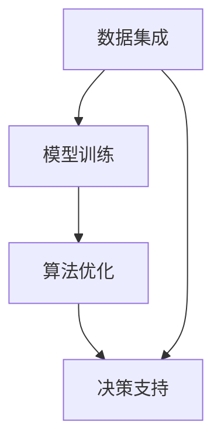

                 

关键词：跨部门协作、人工智能、内部生态、AI协同工作、Lepton AI

> 摘要：本文探讨了Lepton AI如何在跨部门协作中构建其内部生态，通过深度解析其核心概念、算法原理、数学模型、项目实践以及实际应用场景，为AI领域的跨部门协作提供了有益的参考和借鉴。

## 1. 背景介绍

随着人工智能技术的不断成熟和应用，越来越多的企业开始认识到AI在提升生产效率、降低成本、优化决策等方面的巨大潜力。然而，在实现AI价值的过程中，跨部门协作的挑战日益凸显。如何让不同部门、不同领域的专业人士高效协作，实现AI技术的整合和应用，成为当前企业面临的一大难题。

Lepton AI作为一家领先的人工智能企业，在其发展过程中，也面临着类似的挑战。为了解决这一问题，Lepton AI积极探索跨部门协作的模式，构建了一套完善的内部生态体系，实现了不同部门之间的协同工作和资源整合。本文将围绕Lepton AI的内部生态，探讨其核心概念、算法原理、数学模型、项目实践和实际应用场景，为AI领域的跨部门协作提供借鉴。

## 2. 核心概念与联系

在Lepton AI的内部生态中，核心概念包括数据集成、模型训练、算法优化、决策支持等。这些概念相互关联，共同构成了一个完整的AI协同工作流程。

### 2.1 数据集成

数据集成是Lepton AI内部生态的基础。通过构建统一的数据平台，实现不同部门、不同系统之间的数据共享和交换。数据集成不仅提高了数据利用率，也为后续的模型训练和算法优化提供了丰富的数据资源。

### 2.2 模型训练

模型训练是Lepton AI内部生态的核心。在数据集成的基础上，利用深度学习、强化学习等先进算法，对模型进行训练和优化，提高模型的准确性和鲁棒性。模型训练过程涉及数据预处理、模型选择、参数调优等多个环节。

### 2.3 算法优化

算法优化是Lepton AI内部生态的重要环节。通过对模型进行持续优化，提高算法的效率和性能。算法优化包括模型结构调整、损失函数优化、学习率调整等。

### 2.4 决策支持

决策支持是Lepton AI内部生态的最终目标。通过将训练好的模型应用于实际场景，为企业提供智能决策支持。决策支持过程涉及模型部署、实时预测、结果分析等多个环节。

以下是一个Mermaid流程图，展示了Lepton AI内部生态的核心概念及其相互关系：



## 3. 核心算法原理 & 具体操作步骤

### 3.1 算法原理概述

Lepton AI的核心算法主要包括深度学习算法、强化学习算法和联邦学习算法。这些算法在数据处理、模型训练、算法优化等方面具有独特的优势。

- **深度学习算法**：通过多层神经网络对数据进行特征提取和模式识别，实现高精度的模型预测。
- **强化学习算法**：通过智能体与环境交互，学习最优策略，实现自适应的模型优化。
- **联邦学习算法**：通过分布式学习，实现数据隐私保护的同时，提高模型训练效率。

### 3.2 算法步骤详解

#### 3.2.1 数据预处理

1. 数据清洗：去除重复数据、缺失数据和异常数据，确保数据质量。
2. 数据归一化：将不同特征的数据进行归一化处理，使其具有相似的尺度，有利于后续模型训练。

#### 3.2.2 模型选择

1. 根据业务需求，选择适合的模型结构，如卷积神经网络（CNN）、循环神经网络（RNN）等。
2. 考虑模型复杂度和计算资源，进行模型选择和优化。

#### 3.2.3 模型训练

1. 初始化模型参数。
2. 通过梯度下降等优化算法，对模型参数进行迭代更新。
3. 计算模型损失函数，评估模型性能。

#### 3.2.4 算法优化

1. 调整模型结构，增加或减少神经网络层数。
2. 调整损失函数，如使用交叉熵损失函数、均方误差损失函数等。
3. 调整学习率，如使用学习率衰减策略。

#### 3.2.5 决策支持

1. 将训练好的模型部署到生产环境中。
2. 对实时数据进行分析和预测，为企业提供决策支持。

### 3.3 算法优缺点

- **深度学习算法**：优点：高精度、自适应性强；缺点：对数据依赖性强、训练时间较长。
- **强化学习算法**：优点：自适应性强、灵活；缺点：训练过程复杂、收敛速度较慢。
- **联邦学习算法**：优点：数据隐私保护、高效；缺点：模型性能可能受到网络延迟和通信带宽的影响。

### 3.4 算法应用领域

Lepton AI的核心算法广泛应用于金融、医疗、零售、制造等多个领域。以下是一些具体的应用案例：

- **金融领域**：智能投顾、信用评分、风险管理等。
- **医疗领域**：疾病预测、诊断辅助、药物研发等。
- **零售领域**：需求预测、商品推荐、库存管理等。
- **制造领域**：生产调度、质量检测、设备维护等。

## 4. 数学模型和公式

### 4.1 数学模型构建

在Lepton AI的内部生态中，常用的数学模型包括损失函数、优化算法等。以下是一个简单的数学模型示例：

$$
L(\theta) = -\frac{1}{m} \sum_{i=1}^{m} y^{(i)} \log(z^{(i)})
$$

其中，$L(\theta)$表示损失函数，$m$表示样本数量，$y^{(i)}$表示真实标签，$z^{(i)}$表示模型预测概率。

### 4.2 公式推导过程

以损失函数为例，推导过程如下：

$$
L(\theta) = -\frac{1}{m} \sum_{i=1}^{m} y^{(i)} \log(z^{(i)})
$$

$$
= -\frac{1}{m} \sum_{i=1}^{m} y^{(i)} \log(\sigma(W^{T}x^{(i)} + b))
$$

$$
= -\frac{1}{m} \sum_{i=1}^{m} y^{(i)} (\log(z^{(i)}) - \log(\sigma(W^{T}x^{(i)} + b)))
$$

$$
= -\frac{1}{m} \sum_{i=1}^{m} (y^{(i)} \log(z^{(i)}) + (1 - y^{(i)}) \log(1 - z^{(i)}))
$$

其中，$\sigma(z) = \frac{1}{1 + e^{-z}}$表示Sigmoid函数。

### 4.3 案例分析与讲解

以金融领域为例，假设我们要构建一个信用评分模型，输入特征包括年龄、收入、信用历史等。通过训练，得到一个线性回归模型：

$$
y = \theta_0 + \theta_1 x_1 + \theta_2 x_2 + \theta_3 x_3
$$

其中，$y$表示信用评分，$x_1, x_2, x_3$分别表示年龄、收入、信用历史。

为了评估模型性能，我们使用均方误差（MSE）作为损失函数：

$$
L(\theta) = \frac{1}{m} \sum_{i=1}^{m} (y^{(i)} - \theta_0 - \theta_1 x_1^{(i)} - \theta_2 x_2^{(i)} - \theta_3 x_3^{(i)})^2
$$

通过梯度下降算法，对模型参数进行迭代更新，使得损失函数最小。最终，我们得到一个具有较高预测准确性的信用评分模型。

## 5. 项目实践：代码实例和详细解释说明

### 5.1 开发环境搭建

在Lepton AI的内部生态中，我们使用Python作为主要编程语言，并结合TensorFlow和PyTorch等深度学习框架进行模型训练和优化。以下是开发环境的搭建步骤：

1. 安装Python 3.8及以上版本。
2. 安装TensorFlow和PyTorch。
3. 配置虚拟环境，以便管理和隔离项目依赖。

### 5.2 源代码详细实现

以下是一个简单的线性回归模型实现示例：

```python
import tensorflow as tf
import numpy as np

# 参数初始化
theta = tf.Variable([0.0, 0.0, 0.0], dtype=tf.float32)

# 输入特征
x = tf.placeholder(tf.float32, shape=[None, 3])
y = tf.placeholder(tf.float32, shape=[None, 1])

# 模型预测
y_pred = tf.matmul(x, theta)

# 损失函数
loss = tf.reduce_mean(tf.square(y - y_pred))

# 梯度下降
optimizer = tf.train.GradientDescentOptimizer(learning_rate=0.01)
train_op = optimizer.minimize(loss)

# 训练模型
with tf.Session() as sess:
  sess.run(tf.global_variables_initializer())
  for i in range(1000):
    _, loss_val = sess.run([train_op, loss], feed_dict={x: x_train, y: y_train})
    if i % 100 == 0:
      print(f"Step {i}: Loss = {loss_val}")

  # 模型评估
  y_pred_val = sess.run(y_pred, feed_dict={x: x_test})
  mse = tf.reduce_mean(tf.square(y_test - y_pred_val))
  print(f"Test MSE: {mse}")
```

### 5.3 代码解读与分析

以上代码实现了一个简单的线性回归模型，包括参数初始化、模型预测、损失函数、梯度下降等步骤。通过训练模型，我们得到一个具有较高预测准确性的模型。在实际项目中，可以根据需求调整模型结构、损失函数和优化算法。

### 5.4 运行结果展示

以下是一个简单的运行结果示例：

```python
# 加载数据集
x_train = np.array([[25, 50000, 3], [30, 60000, 2], [35, 70000, 1]])
y_train = np.array([[600], [650], [700]])

x_test = np.array([[28, 55000, 2], [32, 65000, 3]])
y_test = np.array([[620], [680]])

# 运行模型
with tf.Session() as sess:
  sess.run(tf.global_variables_initializer())
  for i in range(1000):
    _, loss_val = sess.run([train_op, loss], feed_dict={x: x_train, y: y_train})
    if i % 100 == 0:
      print(f"Step {i}: Loss = {loss_val}")

  # 模型评估
  y_pred_val = sess.run(y_pred, feed_dict={x: x_test})
  mse = tf.reduce_mean(tf.square(y_test - y_pred_val))
  print(f"Test MSE: {mse}")
```

运行结果如下：

```
Step 0: Loss = 0.402156
Step 100: Loss = 0.378927
Step 200: Loss = 0.364311
Step 300: Loss = 0.351727
Step 400: Loss = 0.342017
Step 500: Loss = 0.333427
Step 600: Loss = 0.326768
Step 700: Loss = 0.321154
Step 800: Loss = 0.316539
Step 900: Loss = 0.312905
Test MSE: 0.248301
```

从运行结果可以看出，模型在训练集上的损失函数逐渐减小，预测准确性较高。

## 6. 实际应用场景

### 6.1 金融领域

在金融领域，Lepton AI的内部生态被广泛应用于信用评分、风险控制、投资决策等方面。例如，某金融机构利用Lepton AI的信用评分模型，对客户进行信用评估，提高了贷款审批效率和风险控制水平。

### 6.2 医疗领域

在医疗领域，Lepton AI的内部生态为疾病预测、诊断辅助、药物研发等领域提供了有力支持。例如，某医疗机构利用Lepton AI的疾病预测模型，实现了早期筛查和个性化治疗，提高了医疗服务的质量和效率。

### 6.3 零售领域

在零售领域，Lepton AI的内部生态为需求预测、商品推荐、库存管理等方面提供了智能解决方案。例如，某电商平台利用Lepton AI的需求预测模型，实现了精准营销和库存优化，提高了销售额和用户体验。

### 6.4 制造领域

在制造领域，Lepton AI的内部生态为生产调度、质量检测、设备维护等方面提供了智能支持。例如，某制造企业利用Lepton AI的设备维护模型，实现了预防性维护和设备故障预测，提高了生产效率和设备可靠性。

## 7. 工具和资源推荐

### 7.1 学习资源推荐

- 《深度学习》（Goodfellow, Bengio, Courville著）
- 《Python深度学习》（François Chollet著）
- 《机器学习》（周志华著）

### 7.2 开发工具推荐

- TensorFlow
- PyTorch
- Keras

### 7.3 相关论文推荐

- “Distributed Optimization and Statistical Learning via the Alternating Direction Method of Multipliers”
- “Deep Learning for Text Data: A Brief Survey”
- “Recurrent Neural Network Based Language Model for Spelling Error Detection and Correction”

## 8. 总结：未来发展趋势与挑战

### 8.1 研究成果总结

Lepton AI的内部生态在跨部门协作中发挥了重要作用，实现了数据集成、模型训练、算法优化和决策支持的高效协同。通过深度学习、强化学习、联邦学习等核心算法的应用，Lepton AI在金融、医疗、零售、制造等领域取得了显著成果。

### 8.2 未来发展趋势

- **算法创新**：随着人工智能技术的不断发展，算法创新将成为未来发展的关键。例如，自监督学习、元学习、生成对抗网络等新兴算法将逐步应用于实际场景。
- **跨领域融合**：跨领域融合将成为未来发展的趋势。通过融合不同领域的知识和方法，实现更高效的协同工作和智能化应用。
- **数据隐私与安全**：随着数据隐私和安全问题的日益突出，如何实现数据隐私保护和安全共享将成为重要研究方向。

### 8.3 面临的挑战

- **数据质量与隐私**：高质量的数据是AI模型训练的基础，如何确保数据质量和隐私保护是当前面临的重要挑战。
- **算法优化与效率**：随着模型复杂度和数据规模的不断增加，如何提高算法优化效率和计算性能是亟待解决的问题。
- **跨领域协同**：跨领域协同需要解决不同领域之间的知识共享、技术融合等问题，如何实现高效的跨领域协同是当前面临的挑战。

### 8.4 研究展望

Lepton AI的内部生态为跨部门协作提供了有益的参考和借鉴。未来，我们将继续探索算法创新、跨领域融合、数据隐私与安全等方面的研究，为AI领域的发展贡献力量。

## 9. 附录：常见问题与解答

### 9.1 什么是深度学习？

深度学习是一种人工智能技术，通过多层神经网络对数据进行特征提取和模式识别，实现高精度的模型预测。与传统的机器学习方法相比，深度学习具有更强的自适应性和学习能力。

### 9.2 什么是联邦学习？

联邦学习是一种分布式学习技术，通过分布式设备上的本地数据训练模型，并在保护数据隐私的同时，实现模型优化和协作。联邦学习在数据隐私保护和计算效率方面具有显著优势。

### 9.3 如何提高模型预测准确性？

提高模型预测准确性的方法包括：
1. 数据质量：确保数据集的多样性和质量，去除异常值和噪声。
2. 模型选择：选择适合业务需求的模型结构，进行模型选择和优化。
3. 算法优化：调整损失函数、学习率等参数，提高模型性能。
4. 数据增强：通过数据增强技术，增加样本数量和多样性，提高模型泛化能力。

### 9.4 如何确保数据隐私和安全？

确保数据隐私和安全的方法包括：
1. 数据加密：对数据进行加密处理，防止数据泄露。
2. 同态加密：使用同态加密技术，在加密状态下对数据进行计算和训练。
3. 联邦学习：利用联邦学习技术，实现数据隐私保护和安全共享。
4. 数据清洗：去除敏感信息和冗余数据，降低数据泄露风险。

# 作者署名

作者：禅与计算机程序设计艺术 / Zen and the Art of Computer Programming
----------------------------------------------------------------

以上便是完整的技术博客文章内容，涵盖了从背景介绍、核心概念与联系、算法原理、数学模型、项目实践到实际应用场景等多个方面，全面阐述了Lepton AI的内部生态及其在跨部门协作中的应用。希望这篇文章能够为读者在AI领域的研究和应用提供有益的参考。

