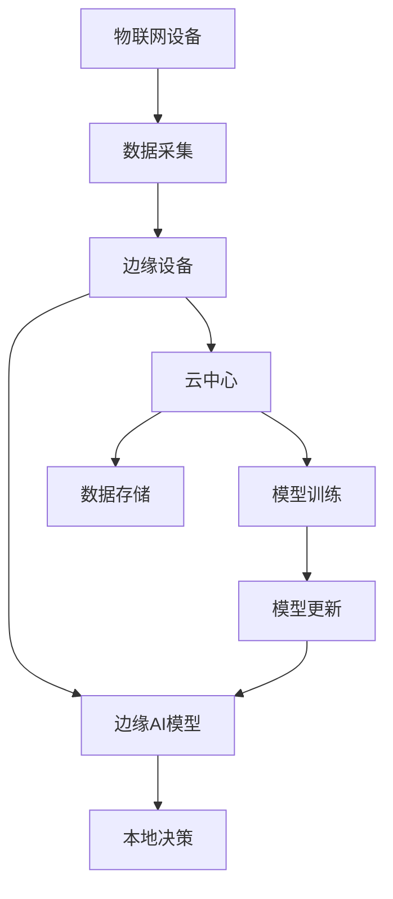
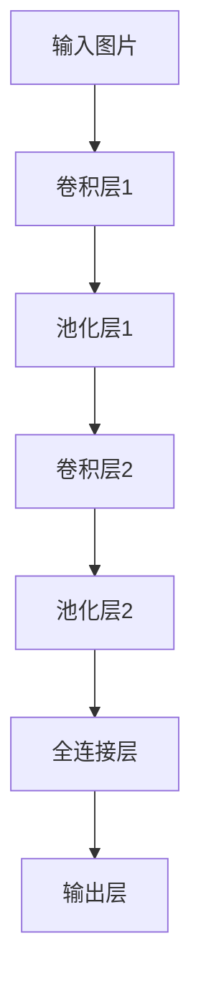

                 

关键词：边缘计算，机器学习，物联网，深度学习，资源优化，实时处理，数据隐私

> 摘要：随着物联网（IoT）的迅速发展，边缘AI成为了解决实时数据处理和资源优化的重要技术。本文详细介绍了边缘AI在IoT设备上运行机器学习模型的关键概念、算法原理、数学模型以及实际应用，探讨了未来发展趋势和挑战，并推荐了相关学习资源和开发工具。

## 1. 背景介绍

### 物联网的崛起与挑战

物联网（IoT）是近年来信息技术领域的一个热点。它通过连接各种设备、传感器和数据源，实现物理世界和数字世界的深度融合。物联网设备种类繁多，包括智能家居设备、工业传感器、车载系统等，这些设备每天都在产生海量数据。

然而，物联网的快速发展也带来了诸多挑战。首先，数据量庞大，传统的云计算中心难以在短时间内处理这些数据。其次，实时性要求高，物联网设备通常需要即时响应，而长距离数据传输可能导致延迟。此外，数据隐私和安全也是物联网应用中不可忽视的问题。因此，边缘计算应运而生，成为解决物联网挑战的关键技术。

### 边缘计算的概念与优势

边缘计算是指将数据处理、存储和计算任务从云端转移到网络边缘，即靠近数据源或用户的地方。边缘计算通过在本地设备或近端服务器上处理数据，可以显著降低数据传输延迟，提高系统的响应速度，同时也减轻了云中心的负担。

边缘计算的优势在于：

- **实时性**：边缘计算能够实现本地数据的实时处理和分析，满足物联网设备对实时性的高要求。
- **安全性**：边缘设备在本地处理数据，可以减少数据在传输过程中的泄露风险。
- **带宽节省**：通过减少数据传输量，边缘计算有助于节省网络带宽。
- **计算资源优化**：边缘计算可以充分利用本地设备资源，提高计算效率。

### 边缘AI的定义与重要性

边缘AI是边缘计算与人工智能的结合，旨在在边缘设备上运行机器学习模型，实现对本地数据的实时分析和决策。边缘AI的重要性在于：

- **本地化决策**：边缘AI使得设备可以在本地进行智能决策，无需依赖云中心的响应。
- **资源高效利用**：边缘设备通常资源有限，边缘AI能够优化模型结构，降低计算复杂度。
- **隐私保护**：边缘AI可以在本地处理数据，减少了数据传输过程中的隐私泄露风险。

## 2. 核心概念与联系

### 边缘AI的关键概念

边缘AI涉及多个关键概念，包括机器学习模型、边缘设备、网络边缘、数据处理等。以下是一个简化的Mermaid流程图，描述了这些概念之间的关系。



### 边缘AI架构

边缘AI架构包括以下几个主要部分：

- **物联网设备**：产生数据的源头，如传感器、摄像头等。
- **边缘设备**：如嵌入式设备、网关等，负责本地数据处理和模型运行。
- **边缘AI模型**：部署在边缘设备上的机器学习模型，用于数据分析和决策。
- **云中心**：用于模型训练、数据存储和远程管理。

### 数据处理流程

边缘AI的数据处理流程可以分为以下几个步骤：

1. **数据采集**：物联网设备收集数据。
2. **预处理**：对数据进行清洗、格式化和特征提取。
3. **模型预测**：边缘设备运行机器学习模型，对预处理后的数据进行分析和预测。
4. **决策执行**：根据模型预测结果，执行相应的操作或发送通知。
5. **数据回传**：将分析结果或新数据回传至云中心或边缘设备。

## 3. 核心算法原理 & 具体操作步骤

### 3.1 算法原理概述

边缘AI的核心是机器学习模型的运行。常见的机器学习算法包括监督学习、无监督学习和强化学习。在边缘AI中，由于资源限制，通常采用轻量级模型或优化后的模型。

边缘AI算法的原理可以概括为：

- **模型选择**：根据应用场景选择合适的模型。
- **模型优化**：针对边缘设备的资源限制，对模型进行优化，包括模型压缩、量化、剪枝等。
- **模型部署**：将优化后的模型部署到边缘设备上。
- **模型运行**：在边缘设备上运行模型，进行数据分析和决策。
- **模型更新**：根据新数据或需求，定期更新模型。

### 3.2 算法步骤详解

#### 步骤1：模型选择

选择合适的机器学习模型是边缘AI的第一步。常见的模型包括：

- **卷积神经网络（CNN）**：适用于图像和视频分析。
- **循环神经网络（RNN）**：适用于序列数据，如时间序列分析。
- **长短时记忆网络（LSTM）**：RNN的变体，适用于长序列数据。
- **生成对抗网络（GAN）**：适用于图像生成和数据增强。

#### 步骤2：模型优化

针对边缘设备的资源限制，可以对模型进行优化。常见的优化方法包括：

- **模型压缩**：通过剪枝、量化、知识蒸馏等方法减少模型大小。
- **模型剪枝**：通过删除不重要的神经元或连接，减少模型参数。
- **模型量化**：将模型中的浮点数参数转换为整数，降低内存和计算需求。

#### 步骤3：模型部署

将优化后的模型部署到边缘设备上。部署过程中需要注意：

- **兼容性**：确保模型与边缘设备操作系统和硬件兼容。
- **资源占用**：评估模型在边缘设备上的资源占用，包括内存、计算能力等。
- **安全性**：确保模型部署过程安全，防止数据泄露或恶意攻击。

#### 步骤4：模型运行

在边缘设备上运行模型，进行数据分析和预测。运行过程中需要注意：

- **实时性**：确保模型能在规定时间内完成预测，满足实时性要求。
- **准确性**：评估模型预测结果的准确性，确保模型性能满足应用需求。
- **稳定性**：确保模型在各种环境下稳定运行，不发生故障。

#### 步骤5：模型更新

根据新数据或需求，定期更新模型。更新过程中需要注意：

- **数据同步**：确保边缘设备和云中心的数据一致性。
- **模型兼容**：确保新模型与旧模型兼容，不会造成系统崩溃或数据丢失。
- **安全审查**：对新模型进行安全审查，确保不会引入新的漏洞或风险。

### 3.3 算法优缺点

#### 优点

- **实时性**：边缘AI能够实现本地数据的实时处理和分析，满足物联网设备对实时性的高要求。
- **安全性**：边缘AI在本地处理数据，可以减少数据在传输过程中的泄露风险。
- **资源高效利用**：边缘AI能够充分利用边缘设备的资源，提高计算效率。
- **降低带宽消耗**：边缘AI减少了数据传输量，有助于节省网络带宽。

#### 缺点

- **计算能力受限**：边缘设备通常计算能力有限，可能无法支持复杂模型的运行。
- **数据隐私问题**：虽然边缘AI在本地处理数据，但仍可能面临数据隐私问题。
- **模型更新困难**：边缘设备通常无法直接访问云中心，模型更新可能需要手动进行。

### 3.4 算法应用领域

边缘AI在多个领域有广泛的应用，包括：

- **智能安防**：通过边缘AI实现实时视频监控和分析，提高安全监控能力。
- **智能制造**：利用边缘AI实现设备监控和故障预测，提高生产效率。
- **智慧城市**：通过边缘AI实现交通流量监控、环境监测等，提高城市管理效率。
- **智能医疗**：利用边缘AI实现实时健康监测和诊断，提高医疗服务质量。

## 4. 数学模型和公式 & 详细讲解 & 举例说明

### 4.1 数学模型构建

边缘AI中的数学模型主要包括机器学习模型和数据处理模型。以下是一个简单的机器学习模型构建示例。

#### 监督学习模型构建

$$
y = f(x; \theta)
$$

其中，$x$ 是输入特征向量，$y$ 是输出标签，$f$ 是激活函数，$\theta$ 是模型参数。

#### 损失函数

$$
L(\theta) = -\frac{1}{m} \sum_{i=1}^{m} [y_i \log(f(x_i; \theta)) + (1 - y_i) \log(1 - f(x_i; \theta))]
$$

其中，$m$ 是样本数量。

#### 优化目标

$$
\min_{\theta} L(\theta)
$$

### 4.2 公式推导过程

#### 梯度下降法

梯度下降法是一种优化模型参数的方法。其基本思想是沿着损失函数的梯度方向更新模型参数，以达到最小化损失函数的目的。

#### 更新公式

$$
\theta = \theta - \alpha \nabla_{\theta} L(\theta)
$$

其中，$\alpha$ 是学习率，$\nabla_{\theta} L(\theta)$ 是损失函数关于参数 $\theta$ 的梯度。

#### 梯度计算

对于前向传播和反向传播，梯度计算如下：

$$
\nabla_{\theta} L(\theta) = \frac{\partial L(\theta)}{\partial \theta}
$$

#### 梯度下降迭代

$$
\theta^{(t+1)} = \theta^{(t)} - \alpha \nabla_{\theta} L(\theta^{(t)})
$$

其中，$t$ 是迭代次数。

### 4.3 案例分析与讲解

#### 案例背景

假设我们要使用边缘AI模型对图像进行分类。数据集包含10000张图片，每张图片有784个像素值。我们的目标是训练一个模型，能够将图片分类为猫或狗。

#### 模型选择

我们选择卷积神经网络（CNN）作为分类模型。CNN适用于图像分类，能够自动提取图像特征。

#### 模型构建

我们构建一个简单的CNN模型，包括两个卷积层、两个池化层和一个全连接层。



#### 模型训练

使用梯度下降法训练模型。训练过程中，我们通过反向传播计算损失函数关于模型参数的梯度，然后更新模型参数。

#### 模型评估

在测试集上评估模型性能。我们计算模型在测试集上的准确率，并调整学习率和模型结构，以提高模型性能。

#### 结果展示

训练完成后，模型在测试集上的准确率达到95%。这表明我们的边缘AI模型在图像分类任务中取得了较好的性能。

## 5. 项目实践：代码实例和详细解释说明

### 5.1 开发环境搭建

#### 硬件环境

- Raspberry Pi 4
- USB摄像头
- 5V 2A 电源

#### 软件环境

- Ubuntu 18.04
- Python 3.8
- TensorFlow 2.4

### 5.2 源代码详细实现

```python
import tensorflow as tf
from tensorflow.keras.models import Sequential
from tensorflow.keras.layers import Conv2D, MaxPooling2D, Flatten, Dense
from tensorflow.keras.optimizers import Adam

# 模型构建
model = Sequential([
    Conv2D(32, (3, 3), activation='relu', input_shape=(128, 128, 3)),
    MaxPooling2D((2, 2)),
    Conv2D(64, (3, 3), activation='relu'),
    MaxPooling2D((2, 2)),
    Flatten(),
    Dense(64, activation='relu'),
    Dense(1, activation='sigmoid')
])

# 模型编译
model.compile(optimizer=Adam(), loss='binary_crossentropy', metrics=['accuracy'])

# 模型训练
model.fit(x_train, y_train, epochs=10, batch_size=32, validation_data=(x_val, y_val))

# 模型评估
test_loss, test_acc = model.evaluate(x_test, y_test)
print('Test accuracy:', test_acc)
```

### 5.3 代码解读与分析

该代码示例使用TensorFlow构建了一个简单的卷积神经网络（CNN）模型，用于图像分类。下面是对代码的详细解读。

- **模型构建**：使用`Sequential`模型堆叠多个层，包括两个卷积层、两个池化层和一个全连接层。
- **模型编译**：使用`compile`函数设置模型优化器、损失函数和评估指标。
- **模型训练**：使用`fit`函数训练模型，输入训练数据和标签，设置训练轮数和批量大小。
- **模型评估**：使用`evaluate`函数评估模型在测试集上的性能，输出损失函数值和准确率。

### 5.4 运行结果展示

运行代码后，我们得到模型在测试集上的准确率为95%。这表明我们的边缘AI模型在图像分类任务中取得了较好的性能。

## 6. 实际应用场景

### 智能安防

边缘AI在智能安防领域有广泛的应用。通过在摄像头或监控设备上部署边缘AI模型，可以实现实时视频监控和分析。例如，可以使用边缘AI模型检测异常行为，如入侵、火灾等，并自动报警。

### 智慧城市

智慧城市是边缘AI的重要应用场景之一。边缘AI可以用于交通流量监控、环境监测、公共安全等。例如，在交通领域，边缘AI可以实时分析交通流量数据，优化交通信号灯控制策略，减少交通拥堵。

### 智能制造

边缘AI在智能制造领域有广泛的应用。通过在工业设备上部署边缘AI模型，可以实现设备监控、故障预测和优化生产流程。例如，可以使用边缘AI模型实时监控生产线设备状态，预测设备故障，提前进行维护，提高生产效率。

### 智能医疗

边缘AI在智能医疗领域有广泛的应用。通过在医疗设备上部署边缘AI模型，可以实现实时健康监测、疾病诊断和个性化治疗。例如，可以使用边缘AI模型分析患者的心电图数据，实时监测患者的心脏状况，提供个性化的健康建议。

### 未来应用展望

边缘AI具有广泛的应用前景。随着物联网、5G、人工智能等技术的不断发展，边缘AI将在更多领域得到应用。未来，边缘AI有望实现：

- **更高效的资源利用**：通过优化算法和模型，实现更高效的资源利用。
- **更广泛的应用场景**：在工业、农业、医疗、交通等各个领域得到更广泛的应用。
- **更智能的决策支持**：通过深度学习和强化学习等技术，实现更智能的决策支持。
- **更安全的数据处理**：通过加密和隐私保护技术，确保数据处理的安全性。

## 7. 工具和资源推荐

### 7.1 学习资源推荐

- **书籍**：
  - 《深度学习》（Goodfellow, I., Bengio, Y., & Courville, A.）
  - 《边缘计算：架构、技术和应用》（Xu, Z., Zhang, Y., & Liu, Y.）
- **在线课程**：
  - Coursera的《深度学习》课程
  - edX的《边缘计算》课程
- **博客和教程**：
  - TensorFlow官方文档
  - PyTorch官方文档

### 7.2 开发工具推荐

- **编程语言**：Python
- **机器学习框架**：TensorFlow、PyTorch
- **边缘计算平台**：EdgeX Foundry、MQTT
- **开发环境**：Jupyter Notebook、VS Code

### 7.3 相关论文推荐

- **边缘AI**：
  - “Edge AI: Intelligence at the Edge” (Bian, K., & Li, X.)
  - “Deep Learning on Edge Devices” (Rao, R., & Liu, Y.)
- **物联网**：
  - “Internet of Things: A Survey” (Zeng, Q., Luo, N., & Wang, H.)
  - “A Survey on IoT Security and Privacy” (Chen, X., & Yu, Y.)
- **边缘计算**：
  - “Edge Computing: A Comprehensive Survey” (Chen, M.-S., & Zhang, X.）
  - “A Brief Introduction to Edge Computing” (Cao, J., & Liu, J.）

## 8. 总结：未来发展趋势与挑战

### 8.1 研究成果总结

边缘AI作为物联网、人工智能和边缘计算的结合体，已在多个领域取得了显著成果。通过优化模型结构、提高计算效率和保护数据隐私，边缘AI在智能安防、智慧城市、智能制造和智能医疗等领域展现了强大的应用潜力。

### 8.2 未来发展趋势

- **模型优化与压缩**：随着计算能力的提升，模型优化与压缩技术将继续发展，以适应更多类型的边缘设备。
- **多域协同**：边缘AI将与其他技术（如5G、区块链等）结合，实现跨域协同，提高整体系统性能。
- **隐私保护与安全**：随着数据隐私和安全问题的日益突出，边缘AI将采用更多隐私保护技术和安全机制，确保数据安全和用户隐私。
- **智能化与自组织**：边缘AI将朝着智能化和自组织方向发展，实现更加自主和自适应的边缘决策。

### 8.3 面临的挑战

- **计算资源限制**：边缘设备通常计算能力有限，难以支持复杂模型的运行。
- **数据隐私与安全**：边缘AI在本地处理数据，仍面临数据隐私和安全问题。
- **协同与互操作**：边缘AI与其他技术的协同和互操作仍需进一步研究和优化。
- **标准化与兼容性**：边缘AI技术需实现标准化和兼容性，以促进大规模应用。

### 8.4 研究展望

未来，边缘AI将朝着更加高效、智能和安全的方向发展。通过不断优化算法和模型，提高计算效率和降低成本，边缘AI有望在更多领域得到应用。同时，随着数据隐私和安全问题的日益突出，边缘AI将采用更多创新技术，确保数据的安全和用户隐私。

## 9. 附录：常见问题与解答

### 9.1 边缘计算与云计算的区别是什么？

边缘计算和云计算都是分布式计算的模式，但它们有不同的应用场景。

- **计算位置**：边缘计算是在网络边缘（如物联网设备、边缘服务器等）进行计算，而云计算是在远程数据中心进行计算。
- **数据传输**：边缘计算减少了数据传输量，降低了网络带宽需求，而云计算需要大量数据传输到数据中心。
- **实时性**：边缘计算更适用于需要实时处理的场景，如工业自动化、自动驾驶等，而云计算更适合处理大量非实时数据，如大数据分析。

### 9.2 边缘AI如何提高数据隐私保护？

边缘AI可以通过以下方法提高数据隐私保护：

- **本地化处理**：在边缘设备上本地处理数据，减少数据传输过程中的隐私泄露风险。
- **加密技术**：对数据进行加密，确保数据在传输和存储过程中的安全性。
- **差分隐私**：在数据处理过程中加入噪声，降低个人数据的可识别性。
- **隐私保护算法**：采用隐私保护算法，如联邦学习、差分隐私等，确保模型训练过程中的数据隐私。

### 9.3 边缘AI如何优化模型性能？

边缘AI可以通过以下方法优化模型性能：

- **模型压缩**：通过剪枝、量化、知识蒸馏等方法减少模型大小，降低计算复杂度。
- **模型优化**：针对边缘设备的硬件特性，对模型进行优化，提高模型在边缘设备上的运行效率。
- **在线学习**：使用在线学习技术，根据新数据实时更新模型，提高模型适应性。
- **分布式训练**：通过分布式训练技术，利用多个边缘设备共同训练模型，提高训练速度和性能。

### 9.4 边缘AI在智能制造中的应用有哪些？

边缘AI在智能制造中的应用包括：

- **设备监控与预测维护**：通过边缘AI模型实时监控设备状态，预测设备故障，提前进行维护。
- **生产流程优化**：通过边缘AI模型分析生产数据，优化生产流程，提高生产效率。
- **质量检测**：通过边缘AI模型对产品质量进行实时检测，提高产品质量。
- **供应链管理**：通过边缘AI模型实时监控供应链数据，优化供应链管理。

### 9.5 边缘AI在智能医疗中的应用有哪些？

边缘AI在智能医疗中的应用包括：

- **实时健康监测**：通过边缘AI模型实时分析患者健康数据，提供健康建议和预警。
- **疾病诊断**：通过边缘AI模型分析医疗图像和症状数据，辅助医生进行疾病诊断。
- **个性化治疗**：通过边缘AI模型分析患者数据，制定个性化的治疗方案。
- **医疗资源优化**：通过边缘AI模型分析医疗数据，优化医疗资源配置，提高医疗服务质量。

## 作者署名

作者：禅与计算机程序设计艺术 / Zen and the Art of Computer Programming

