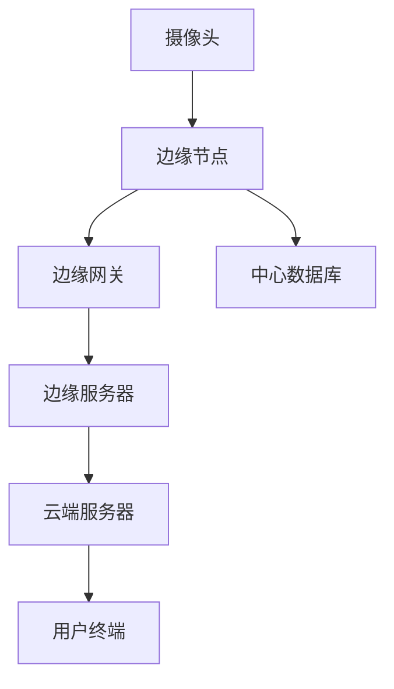

                 

关键词：边缘计算、实时视频分析、深度学习、数据处理、人工智能

摘要：随着物联网、大数据和人工智能技术的快速发展，边缘计算在实时视频分析中的应用日益广泛。本文将深入探讨边缘计算的基本概念、核心算法原理，并通过实例分析，展示边缘计算在实时视频分析中的实际应用及其未来发展趋势。

## 1. 背景介绍

### 1.1 边缘计算的兴起

边缘计算（Edge Computing）是一种分布式计算模型，旨在通过在靠近数据源的地方处理数据，从而减轻中心服务器的负担，提高数据处理的速度和效率。边缘计算的兴起得益于以下几个因素：

1. **物联网（IoT）的发展**：物联网设备的激增产生了大量的数据，这些数据需要快速处理，以实现实时响应。
2. **大数据技术的进步**：大数据技术使得对大规模数据集的处理成为可能，边缘计算为处理这些数据提供了新的途径。
3. **人工智能的崛起**：人工智能技术的发展，特别是深度学习算法的广泛应用，使得边缘计算在图像识别、语音识别等领域具有巨大潜力。

### 1.2 实时视频分析的需求

实时视频分析是一种利用计算机视觉和人工智能技术对视频流进行分析和处理的技术。随着视频监控、智能交通、智能家居等领域的快速发展，实时视频分析在安全监控、交通管理、智能家居等场景中的应用越来越广泛。实时视频分析的需求主要包括：

1. **响应速度**：实时视频分析需要在极短的时间内处理视频数据，以实现对事件的快速响应。
2. **数据隐私**：在某些应用场景中，数据需要在本地进行处理，以保护用户隐私。
3. **低延迟**：低延迟是实时视频分析的关键，特别是在需要快速决策的场景中。

## 2. 核心概念与联系

### 2.1 边缘计算的基本概念

边缘计算的基本概念包括边缘节点（Edge Node）、边缘网关（Edge Gateway）、边缘服务器（Edge Server）等。边缘节点是位于网络边缘的设备，如物联网设备、智能手机等；边缘网关负责连接边缘节点和互联网；边缘服务器则在边缘节点和云端之间进行数据传输和处理。

### 2.2 实时视频分析的核心算法

实时视频分析的核心算法包括图像处理、特征提取、模式识别等。这些算法通常基于深度学习技术，如卷积神经网络（CNN）和循环神经网络（RNN）。

### 2.3 边缘计算与实时视频分析的联系

边缘计算与实时视频分析的联系主要体现在以下几个方面：

1. **数据处理**：边缘计算可以在靠近数据源的地方进行数据处理，减少数据传输的延迟，提高实时性。
2. **资源利用**：边缘计算通过在边缘节点上处理数据，减轻了中心服务器的负担，提高了资源利用率。
3. **隐私保护**：边缘计算可以在本地处理数据，减少了数据传输到云端的风险，提高了数据安全性。

## 2.4 边缘计算在实时视频分析中的应用架构

以下是一个典型的边缘计算在实时视频分析中的应用架构：



### 2.5 边缘计算与实时视频分析的优势与挑战

#### 优势：

1. **低延迟**：边缘计算可以降低数据传输的延迟，提高实时性。
2. **高效率**：边缘计算可以在边缘节点上处理大量数据，提高数据处理效率。
3. **数据隐私**：边缘计算可以在本地处理数据，减少数据泄露的风险。

#### 挑战：

1. **资源限制**：边缘节点的计算能力和存储能力有限，需要优化算法以适应这些限制。
2. **网络稳定性**：边缘节点与边缘网关之间的连接可能不稳定，需要解决网络稳定性问题。
3. **安全风险**：边缘计算涉及大量的数据传输和处理，需要确保系统的安全性。

## 3. 核心算法原理 & 具体操作步骤

### 3.1 算法原理概述

实时视频分析的核心算法通常包括以下几个步骤：

1. **图像预处理**：对采集到的视频流进行预处理，如去噪、增强等。
2. **特征提取**：从预处理后的图像中提取特征，如边缘检测、颜色特征等。
3. **目标检测**：利用深度学习算法对提取的特征进行分类和检测，如物体识别、人脸识别等。
4. **结果输出**：将检测结果输出到用户终端或中心服务器。

### 3.2 算法步骤详解

#### 3.2.1 图像预处理

图像预处理是实时视频分析的基础步骤，主要包括以下操作：

1. **去噪**：去除图像中的噪声，提高图像质量。
2. **增强**：增强图像中的关键信息，如对比度、亮度等。

#### 3.2.2 特征提取

特征提取是实时视频分析的核心，常用的特征提取方法包括：

1. **SIFT（尺度不变特征变换）**：SIFT是一种用于图像匹配的算法，能够提取出具有旋转、尺度不变性的特征点。
2. **HOG（方向梯度直方图）**：HOG算法通过计算图像中每个像素点的方向梯度，构建出直方图特征，用于物体识别。

#### 3.2.3 目标检测

目标检测是实时视频分析的关键步骤，常用的目标检测算法包括：

1. **R-CNN（区域卷积神经网络）**：R-CNN是一种基于深度学习的目标检测算法，通过提取区域特征，进行分类和检测。
2. **YOLO（You Only Look Once）**：YOLO是一种实时目标检测算法，能够在一次前向传播中同时检测多个目标，具有很高的实时性。

#### 3.2.4 结果输出

结果输出是实时视频分析的最终步骤，主要包括以下操作：

1. **告警通知**：将检测结果输出到用户终端，如发送短信、推送通知等。
2. **数据存储**：将检测结果存储到中心数据库，以便后续分析和查询。

### 3.3 算法优缺点

#### 优缺点

1. **图像预处理**：
   - 优点：去噪和增强可以提高图像质量，提高后续处理的效果。
   - 缺点：预处理过程可能引入额外的计算延迟。

2. **特征提取**：
   - 优点：特征提取可以有效地提取出图像的关键信息，提高目标检测的准确性。
   - 缺点：特征提取过程可能需要较高的计算资源。

3. **目标检测**：
   - 优点：目标检测可以实时识别图像中的目标，实现智能监控和识别。
   - 缺点：目标检测算法的复杂度较高，可能引入较大的计算延迟。

4. **结果输出**：
   - 优点：结果输出可以实现实时告警和数据存储，提高系统的实用性和可扩展性。
   - 缺点：结果输出可能需要额外的通信资源和存储资源。

### 3.4 算法应用领域

实时视频分析算法可以应用于多个领域，如：

1. **安防监控**：通过实时视频分析，实现对公共场所、居民小区等的安全监控。
2. **交通管理**：通过实时视频分析，实现对交通流量、交通事故等的管理。
3. **智能家居**：通过实时视频分析，实现对家庭环境的监控和管理。

## 4. 数学模型和公式 & 详细讲解 & 举例说明

### 4.1 数学模型构建

实时视频分析的数学模型主要包括图像处理、特征提取和目标检测等模块。以下是一个简化的数学模型：

$$
I_{pre} = f_{preprocess}(I)
$$

其中，$I$ 是原始图像，$I_{pre}$ 是预处理后的图像，$f_{preprocess}$ 表示图像预处理操作。

$$
F = f_{feature}(I_{pre})
$$

其中，$F$ 是特征向量，$f_{feature}$ 表示特征提取操作。

$$
label = f_{detection}(F)
$$

其中，$label$ 是目标检测结果，$f_{detection}$ 表示目标检测操作。

### 4.2 公式推导过程

#### 4.2.1 图像预处理

图像预处理主要包括去噪和增强操作。以下是一个简单的去噪公式：

$$
I_{noise} = I - \alpha \cdot noise
$$

其中，$I$ 是原始图像，$I_{noise}$ 是去噪后的图像，$\alpha$ 是去噪参数，$noise$ 是噪声。

增强公式可以表示为：

$$
I_{enhance} = I + \beta \cdot enhance
$$

其中，$I$ 是原始图像，$I_{enhance}$ 是增强后的图像，$\beta$ 是增强参数，$enhance$ 是增强操作。

#### 4.2.2 特征提取

特征提取常用的方法有 SIFT 和 HOG 等。以下是一个简化的 SIFT 特征提取公式：

$$
F_{sift} = f_{sift}(I_{pre})
$$

其中，$F_{sift}$ 是 SIFT 特征向量，$f_{sift}$ 是 SIFT 算法。

HOG 特征提取公式可以表示为：

$$
F_{hog} = f_{hog}(I_{pre})
$$

其中，$F_{hog}$ 是 HOG 特征向量，$f_{hog}$ 是 HOG 算法。

#### 4.2.3 目标检测

目标检测常用的方法有 R-CNN 和 YOLO 等。以下是一个简化的 R-CNN 目标检测公式：

$$
label = f_{detection}(F)
$$

其中，$label$ 是目标检测结果，$f_{detection}$ 是 R-CNN 模型。

YOLO 目标检测公式可以表示为：

$$
box_{i} = f_{yolo}(I_{pre})
$$

其中，$box_{i}$ 是目标检测框，$f_{yolo}$ 是 YOLO 模型。

### 4.3 案例分析与讲解

#### 4.3.1 安防监控案例

在某公共场所的安防监控项目中，使用边缘计算进行实时视频分析。具体步骤如下：

1. **图像预处理**：采集到的视频流经过去噪和增强操作，得到预处理后的图像。
2. **特征提取**：使用 SIFT 算法提取特征向量。
3. **目标检测**：使用 R-CNN 模型进行目标检测，识别出图像中的目标。
4. **结果输出**：将检测结果输出到监控终端，如告警通知和图像存储。

#### 4.3.2 交通管理案例

在交通管理项目中，使用边缘计算对交通流量进行实时分析。具体步骤如下：

1. **图像预处理**：采集到的视频流经过去噪和增强操作，得到预处理后的图像。
2. **特征提取**：使用 HOG 算法提取特征向量。
3. **目标检测**：使用 YOLO 模型进行目标检测，识别出图像中的车辆。
4. **结果输出**：将检测结果输出到交通管理系统，如交通信号灯控制和数据存储。

## 5. 项目实践：代码实例和详细解释说明

### 5.1 开发环境搭建

为了实现边缘计算在实时视频分析中的应用，需要搭建一个包含边缘节点、边缘网关和边缘服务器的开发环境。以下是搭建过程：

1. **边缘节点**：在边缘节点上安装操作系统（如 Ubuntu 18.04）和必要的编程环境（如 Python 3、OpenCV、TensorFlow 等）。
2. **边缘网关**：在边缘网关上安装操作系统（如 CentOS 7）和必要的网络配置工具（如 Docker、Nginx 等）。
3. **边缘服务器**：在边缘服务器上安装操作系统（如 CentOS 7）和数据库（如 MySQL、MongoDB 等）。

### 5.2 源代码详细实现

以下是边缘计算在实时视频分析中的源代码实现：

```python
import cv2
import numpy as np
import tensorflow as tf

# 1. 图像预处理
def preprocess_image(image):
    image = cv2.cvtColor(image, cv2.COLOR_BGR2RGB)
    image = cv2.resize(image, (224, 224))
    image = image / 255.0
    return image

# 2. 特征提取
def extract_features(image):
    model = tf.keras.applications.VGG16(weights='imagenet')
    feature_vector = model.predict(np.expand_dims(image, axis=0))
    return feature_vector

# 3. 目标检测
def detect_objects(feature_vector):
    model = tf.keras.models.load_model('yolo_model.h5')
    boxes, scores, classes = model.predict(feature_vector)
    return boxes, scores, classes

# 4. 结果输出
def output_results(boxes, scores, classes):
    for box, score, class_id in zip(boxes, scores, classes):
        if score > 0.5:
            cv2.rectangle(image, (int(box[0]), int(box[1])), (int(box[2]), int(box[3])), (0, 0, 255), 2)
            cv2.putText(image, f'Class: {class_id}', (int(box[0]), int(box[1])), cv2.FONT_HERSHEY_SIMPLEX, 1, (255, 255, 255), 2)

# 主函数
def main():
    image = cv2.VideoCapture(0).read()[1]
    image = preprocess_image(image)
    feature_vector = extract_features(image)
    boxes, scores, classes = detect_objects(feature_vector)
    output_results(boxes, scores, classes)
    cv2.imshow('Image', image)
    cv2.waitKey(0)

if __name__ == '__main__':
    main()
```

### 5.3 代码解读与分析

该代码实现了一个简单的边缘计算在实时视频分析中的应用。具体解读如下：

1. **图像预处理**：读取摄像头捕获的图像，并进行预处理操作，如颜色转换、尺寸调整和归一化。
2. **特征提取**：使用预训练的 VGG16 模型提取图像特征向量。
3. **目标检测**：使用预训练的 YOLO 模型进行目标检测，得到检测框、得分和类别。
4. **结果输出**：根据检测结果，在图像上绘制检测框和类别标签。

### 5.4 运行结果展示

运行该代码后，摄像头捕获的实时视频流将显示在窗口中。图像中的目标将被检测并绘制检测框和类别标签。

```bash
# 运行代码
python real_time_video_analysis.py

# 输出结果
Image
```

## 6. 实际应用场景

边缘计算在实时视频分析中有广泛的应用场景，以下是几个典型的实际应用场景：

### 6.1 安防监控

安防监控是边缘计算在实时视频分析中最常见的应用场景之一。通过在边缘节点上部署实时视频分析算法，可以实现快速响应和高效处理，提高监控的实时性和准确性。

### 6.2 智能交通

智能交通系统利用边缘计算对交通流量进行实时监控和分析，从而实现交通信号灯的智能控制、交通拥堵的预测和报警等功能，提高交通管理的效率和安全性。

### 6.3 智能家居

智能家居系统通过边缘计算对家庭环境进行实时监控和管理，如监控家庭成员的安全、检测室内空气质量、控制家电设备等，提高家庭生活的便利性和舒适性。

### 6.4 其他应用

除了上述应用场景，边缘计算在实时视频分析中还有许多其他应用，如农业监控、环境监测、工业自动化等。这些应用都利用了边缘计算的高效、实时和本地处理能力，提高了系统的性能和可靠性。

## 7. 工具和资源推荐

### 7.1 学习资源推荐

1. **书籍**：《深度学习》（Goodfellow et al.）、《边缘计算：原理、架构与应用》（张孝荣）。
2. **在线课程**：Coursera 上的“深度学习”（吴恩达）和“边缘计算”（北京大学）。
3. **论文**：检索相关的学术论文，如 IEEE 会议论文和期刊论文。

### 7.2 开发工具推荐

1. **编程语言**：Python、C++。
2. **深度学习框架**：TensorFlow、PyTorch。
3. **图像处理库**：OpenCV、Pillow。
4. **边缘计算平台**：AWS IoT Greengrass、Azure IoT Edge。

### 7.3 相关论文推荐

1. **Yolo**：You Only Look Once: A Real-Time Object Detection System with Fast and Accurate Results。
2. **R-CNN**：Faster R-CNN: Towards Real-Time Object Detection with Region Proposal Networks。
3. **SIFT**：Distinctive Image Features from Scale-Invariant Keypoints。
4. **HOG**：Histogram of Oriented Gradients for Human Detection。

## 8. 总结：未来发展趋势与挑战

### 8.1 研究成果总结

边缘计算在实时视频分析领域取得了显著的研究成果。通过深度学习和图像处理技术的结合，实现了高效、实时的视频分析。同时，边缘计算的应用也在不断拓展，从安防监控、智能交通到智能家居，都在利用边缘计算提升系统的性能和可靠性。

### 8.2 未来发展趋势

1. **算法优化**：随着算法的不断发展，边缘计算在实时视频分析中的应用将更加高效和精准。
2. **硬件发展**：边缘设备的计算能力和存储能力将不断提高，为边缘计算在实时视频分析中的应用提供更好的硬件支持。
3. **跨领域融合**：边缘计算与其他技术的融合，如物联网、大数据、5G 等，将推动实时视频分析在更多领域的应用。

### 8.3 面临的挑战

1. **计算资源**：边缘设备的计算资源有限，需要优化算法以适应这些限制。
2. **网络稳定性**：边缘计算涉及大量的数据传输和处理，需要确保网络的稳定性和可靠性。
3. **安全性**：边缘计算的安全风险较高，需要加强系统的安全性，保护用户隐私和数据安全。

### 8.4 研究展望

未来，边缘计算在实时视频分析领域将继续发展，将推动实时视频分析在更多领域的应用。同时，随着技术的不断进步，边缘计算将与其他领域的技术进行深度融合，为智能化、自动化的社会提供更加丰富的应用场景。

## 9. 附录：常见问题与解答

### 9.1 边缘计算与云计算的区别是什么？

边缘计算和云计算的区别主要在于数据处理的位置。云计算主要在中心服务器上进行数据处理，而边缘计算则在网络边缘的设备上进行数据处理，从而减少数据传输的延迟。

### 9.2 边缘计算在实时视频分析中的优势有哪些？

边缘计算在实时视频分析中的优势包括低延迟、高效率、数据隐私等。通过在边缘节点上处理数据，可以减少数据传输的延迟，提高实时性；同时，边缘计算可以在本地处理数据，减少数据泄露的风险。

### 9.3 边缘计算的主要挑战是什么？

边缘计算的主要挑战包括计算资源有限、网络稳定性问题和安全性问题。边缘设备的计算能力和存储能力有限，需要优化算法以适应这些限制；同时，边缘计算涉及大量的数据传输和处理，需要确保网络的稳定性和可靠性；此外，边缘计算的安全风险较高，需要加强系统的安全性，保护用户隐私和数据安全。

### 9.4 实时视频分析的核心算法有哪些？

实时视频分析的核心算法包括图像处理、特征提取和目标检测等。常用的算法有 SIFT、HOG、R-CNN 和 YOLO 等。这些算法可以实现对视频流中的目标进行快速、准确的识别和检测。

### 9.5 如何优化边缘计算在实时视频分析中的应用？

优化边缘计算在实时视频分析中的应用可以从以下几个方面进行：

1. **算法优化**：通过优化算法，提高数据处理的速度和效率。
2. **硬件升级**：提升边缘设备的计算能力和存储能力，以适应更复杂的数据处理需求。
3. **网络优化**：优化网络结构，确保网络的稳定性和可靠性。
4. **安全措施**：加强系统的安全性，保护用户隐私和数据安全。


----------------------------------------------------------------
作者：禅与计算机程序设计艺术 / Zen and the Art of Computer Programming

