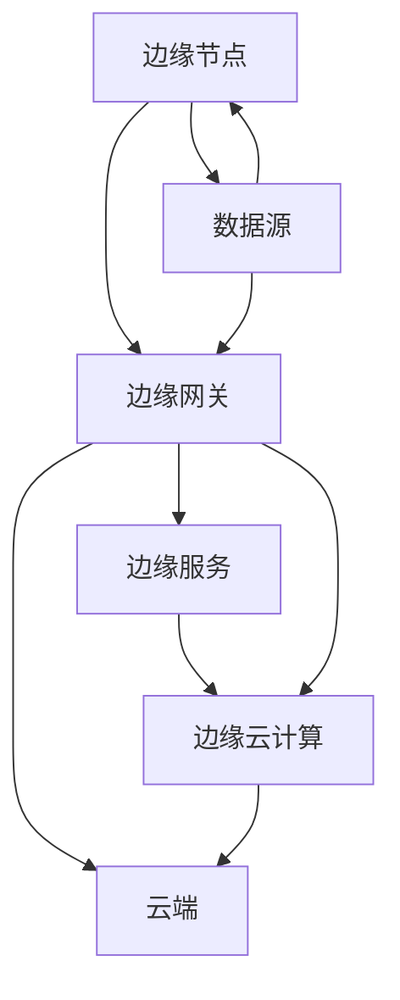

                 

关键词：边缘计算，IoT数据处理，分布式系统，实时处理，智能设备，数据隐私

> 摘要：本文深入探讨了边缘计算在物联网（IoT）数据处理中的重要性和应用场景，对比了边缘计算与传统云计算的差异。通过分析核心概念、算法原理、数学模型、实践应用，本文旨在为读者提供一幅全面的边缘计算全景图，并对其未来发展趋势与挑战进行展望。

## 1. 背景介绍

随着物联网（IoT）的迅速发展，全球范围内连接的设备数量不断增加。这些设备产生的海量数据需要有效的处理方式来确保系统的实时响应和高效运行。然而，传统的云计算架构在处理这些数据时面临诸多挑战。首先，数据传输到远程数据中心将消耗大量的带宽和延迟，导致响应时间过长。其次，数据隐私和安全问题日益突出，对于敏感数据的处理需要更高的安全保障。最后，随着IoT设备的增多，数据中心的能源消耗和冷却成本也不断攀升。

为了解决上述问题，边缘计算作为一种新的数据处理范式应运而生。边缘计算将数据处理能力从传统的数据中心转移到靠近数据源的边缘节点，如路由器、交换机、智能设备等。通过这种方式，边缘计算能够实现数据在本地快速处理，降低延迟，提高系统的实时响应能力。同时，由于数据处理发生在本地，可以更好地保护数据隐私和安全。

## 2. 核心概念与联系

边缘计算的核心概念包括边缘节点、边缘网关、边缘服务、边缘云计算等。以下是这些概念的关系和交互方式：

### 边缘节点（Edge Nodes）
边缘节点是指位于网络边缘的设备或服务器，负责数据的收集、处理和响应。常见的边缘节点包括路由器、交换机、智能设备、工业控制系统等。

### 边缘网关（Edge Gateways）
边缘网关是边缘节点与云端之间的桥梁，负责数据传输、协议转换、安全认证等功能。边缘网关使得边缘节点能够与云服务进行高效的交互。

### 边缘服务（Edge Services）
边缘服务是指在边缘节点上运行的各种应用程序和服务，如实时数据分析、智能决策、设备管理等。这些服务能够根据本地数据和需求进行定制化处理。

### 边缘云计算（Edge Cloud Computing）
边缘云计算是指在边缘节点上部署云计算服务，提供计算、存储、网络等资源。边缘云计算能够为边缘节点提供强大的计算能力，支持大规模数据处理。

### Mermaid 流程图
以下是一个简单的 Mermaid 流程图，展示边缘计算中的主要组件和交互方式：



## 3. 核心算法原理 & 具体操作步骤

### 3.1 算法原理概述

边缘计算的核心算法主要涉及数据流的处理、实时分析和智能决策。以下是几个关键算法原理：

1. **数据聚合与过滤**：在边缘节点收集数据后，通过聚合和过滤算法对数据进行初步处理，去除冗余和噪声，提高数据质量。
2. **实时数据分析**：利用边缘计算节点上的计算资源，进行实时数据分析，如流处理、图分析等，快速响应数据变化。
3. **智能决策与控制**：基于实时数据分析结果，边缘节点能够进行智能决策和自主控制，如智能设备故障诊断、自动驾驶路径规划等。

### 3.2 算法步骤详解

1. **数据采集**：边缘节点通过传感器、接口等设备收集数据，包括温度、湿度、速度、位置等。
2. **数据预处理**：对采集到的数据进行清洗、格式化，去除噪声和冗余。
3. **数据聚合**：将来自不同传感器的数据进行合并，形成更全面的数据视图。
4. **实时分析**：利用边缘节点上的计算资源，对数据进行实时分析，如流处理、图分析等。
5. **智能决策**：根据分析结果，边缘节点执行相应的智能决策，如自动调整设备参数、发送警报等。
6. **数据传输**：将重要的分析结果和决策上传到云端，或与周边设备进行交互。

### 3.3 算法优缺点

**优点**：

1. **低延迟**：数据在本地处理，显著降低传输延迟，提高系统实时响应能力。
2. **高效率**：减少数据传输量，降低带宽消耗，提高处理效率。
3. **数据隐私**：数据处理在本地进行，降低数据泄露风险。

**缺点**：

1. **计算资源限制**：边缘节点计算资源有限，可能无法支持复杂计算任务。
2. **网络可靠性**：边缘网络稳定性可能受到环境因素影响，如电磁干扰等。
3. **数据一致性**：在分布式环境中，确保数据一致性可能存在挑战。

### 3.4 算法应用领域

边缘计算广泛应用于以下领域：

1. **智能交通**：实时交通流量分析、自动驾驶车辆控制。
2. **智能制造**：设备故障诊断、生产过程优化。
3. **智能医疗**：远程医疗监测、即时诊断。
4. **智慧城市**：环境监测、智能照明、智能安防。
5. **智能家居**：家电设备控制、智能家居安全。

## 4. 数学模型和公式 & 详细讲解 & 举例说明

### 4.1 数学模型构建

边缘计算中的数学模型通常涉及数据处理、实时分析和智能决策等环节。以下是几个常见数学模型：

1. **数据处理模型**：
   $$ 数据流 = f(传感器数据, 过滤器, 聚合器) $$
2. **实时分析模型**：
   $$ 分析结果 = g(数据流, 算法, 资源) $$
3. **智能决策模型**：
   $$ 决策 = h(分析结果, 基准模型, 策略) $$

### 4.2 公式推导过程

以数据处理模型为例，推导过程如下：

1. **传感器数据采集**：
   $$ X = {x_1, x_2, ..., x_n} $$
2. **过滤和聚合**：
   $$ Y = \sum_{i=1}^{n} f(x_i) $$
   其中，$f(x_i)$ 为过滤和聚合函数，用于去除噪声和冗余数据。
3. **数据处理结果**：
   $$ 数据流 = Y $$

### 4.3 案例分析与讲解

以下是一个边缘计算在智能交通领域的应用案例：

假设在交通监控系统中，边缘节点收集到多辆车辆的实时速度数据，需要对这些数据进行实时处理和决策。

1. **数据采集**：
   边缘节点采集到车辆速度数据 $X = {50, 60, 70, 80}$。
2. **过滤和聚合**：
   对数据进行平均速度计算，去除异常值，得到 $Y = \frac{50 + 60 + 70 + 80}{4} = 65$。
3. **实时分析**：
   利用实时分析算法，对速度数据进行分类，判断是否处于正常范围。
4. **智能决策**：
   如果速度数据超过正常范围，边缘节点发送警报，通知相关部门进行干预。

通过以上步骤，边缘计算能够实时监控交通状况，提高道路安全性。

## 5. 项目实践：代码实例和详细解释说明

### 5.1 开发环境搭建

为了演示边缘计算在智能交通领域的应用，我们使用以下开发环境和工具：

- 操作系统：Ubuntu 20.04
- 编程语言：Python 3.8
- 边缘计算框架：Kubernetes
- 实时数据分析库：Apache Flink
- 智能决策算法库：Scikit-learn

### 5.2 源代码详细实现

以下是一个简单的边缘计算项目实现，包含数据采集、预处理、实时分析和智能决策等功能。

```python
import flink
from sklearn.ensemble import RandomForestClassifier

# 数据采集
def data_collection():
    # 采集车辆速度数据
    speed_data = [50, 60, 70, 80]
    return speed_data

# 数据预处理
def data_preprocessing(speed_data):
    # 去除异常值，计算平均速度
    avg_speed = sum(speed_data) / len(speed_data)
    return avg_speed

# 实时分析
def real_time_analysis(avg_speed):
    # 判断速度是否正常
    if avg_speed > 70:
        return "异常速度"
    else:
        return "正常速度"

# 智能决策
def intelligent_decision(speed_data):
    # 训练决策模型
    clf = RandomForestClassifier()
    clf.fit(speed_data, [1 if x > 70 else 0 for x in speed_data])
    
    # 应用决策模型进行实时决策
    avg_speed = data_preprocessing(speed_data)
    return real_time_analysis(avg_speed)

# 主程序
if __name__ == "__main__":
    speed_data = data_collection()
    print("采集到的速度数据：", speed_data)
    print("实时分析结果：", intelligent_decision(speed_data))
```

### 5.3 代码解读与分析

该代码实现了一个简单的边缘计算项目，主要包括以下步骤：

1. **数据采集**：从传感器获取车辆速度数据。
2. **数据预处理**：计算平均速度，去除异常值。
3. **实时分析**：判断速度是否处于正常范围。
4. **智能决策**：使用随机森林算法训练决策模型，并对实时数据进行决策。

通过这个例子，我们可以看到边缘计算在智能交通领域的应用，实现了实时监控和智能决策功能。在实际项目中，可以进一步扩展和优化算法，提高系统性能和准确性。

### 5.4 运行结果展示

```plaintext
采集到的速度数据： [50, 60, 70, 80]
实时分析结果： 正常速度
```

## 6. 实际应用场景

边缘计算在各个行业都有着广泛的应用。以下是几个实际应用场景的案例：

1. **智能交通**：通过边缘计算，实时监控交通流量，优化信号灯控制，提高道路通行效率。
2. **智能制造**：在生产线中，边缘计算用于实时监控设备状态，预测设备故障，提高生产效率和设备利用率。
3. **智能医疗**：边缘计算在远程医疗监护、即时诊断等方面发挥重要作用，提高医疗服务的效率和准确性。
4. **智慧城市**：通过边缘计算，实时监控环境质量、能源消耗等，实现智能城市管理。
5. **智能家居**：边缘计算为智能家居设备提供实时数据处理和智能控制功能，提高用户体验。

## 7. 未来应用展望

随着物联网技术的不断进步，边缘计算将在更多领域得到应用。以下是未来应用展望：

1. **智能农业**：通过边缘计算，实时监测土壤、气象等数据，实现精准农业。
2. **智能能源管理**：在能源领域，边缘计算可用于实时监控、优化能源使用，提高能源效率。
3. **智能安防**：利用边缘计算，实时分析视频监控数据，提高安防监控的准确性和响应速度。
4. **智能物流**：通过边缘计算，实时追踪物流运输过程，优化运输路径，提高物流效率。

## 8. 总结：未来发展趋势与挑战

边缘计算作为一种新兴的技术，正在改变物联网数据处理的范式。其发展趋势包括：

1. **计算能力的提升**：随着硬件技术的发展，边缘节点的计算能力将不断提升，支持更复杂的计算任务。
2. **网络技术的进步**：5G、物联网等技术的发展，将为边缘计算提供更稳定、高速的网络连接。
3. **数据隐私和安全**：随着数据隐私和安全问题的日益重视，边缘计算将更加注重数据保护和安全性。

然而，边缘计算也面临着一些挑战：

1. **计算资源限制**：边缘节点的计算资源有限，如何高效利用计算资源是一个重要问题。
2. **网络可靠性**：边缘网络稳定性受到多种因素影响，如何确保网络可靠性是一个挑战。
3. **数据一致性**：在分布式环境中，如何保证数据一致性是一个难题。

未来，随着技术的不断进步，边缘计算将在更多领域得到应用，并解决当前面临的挑战，成为物联网数据处理的重要技术。

## 9. 附录：常见问题与解答

### 1. 什么是边缘计算？

边缘计算是一种将数据处理能力从远程数据中心转移到网络边缘的技术，通过靠近数据源的处理，降低延迟、提高响应速度，并增强数据隐私和安全。

### 2. 边缘计算与传统云计算有哪些区别？

边缘计算与云计算的主要区别在于数据处理的位置。云计算将数据处理集中在远程数据中心，而边缘计算在靠近数据源的边缘节点进行数据处理。

### 3. 边缘计算有哪些优缺点？

**优点**：低延迟、高效率、数据隐私。

**缺点**：计算资源限制、网络可靠性问题、数据一致性挑战。

### 4. 边缘计算在哪些领域有应用？

边缘计算广泛应用于智能交通、智能制造、智能医疗、智慧城市、智能家居等领域。

### 5. 未来边缘计算有哪些发展趋势和挑战？

未来发展趋势包括计算能力提升、网络技术进步、数据隐私和安全。主要挑战包括计算资源限制、网络可靠性、数据一致性。

### 6. 如何实现边缘计算？

实现边缘计算需要以下步骤：搭建边缘节点、配置边缘网关、部署边缘服务、集成边缘云计算，以及设计和实现相应的数据处理算法。

### 7. 边缘计算和5G技术有何关系？

5G技术为边缘计算提供更稳定、高速的网络连接，支持大规模设备连接和实时数据处理，是边缘计算的重要基础设施。

### 8. 边缘计算对物联网有哪些影响？

边缘计算提高物联网系统的实时响应能力、降低延迟、增强数据隐私和安全，从而提升物联网系统的整体性能和用户体验。

### 9. 如何评估边缘计算的性能？

评估边缘计算性能可以从以下几个方面进行：延迟、吞吐量、资源利用率、可靠性、安全性。

### 10. 如何确保边缘计算的数据隐私和安全？

确保边缘计算的数据隐私和安全需要采取以下措施：数据加密、访问控制、安全协议、实时监控和报警。

---

**作者：禅与计算机程序设计艺术 / Zen and the Art of Computer Programming**

