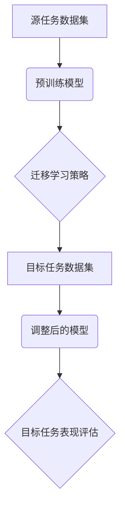

                 

关键词：迁移学习、预训练模型、AI效率、深度学习、模型蒸馏

> 摘要：本文旨在探讨迁移学习在提高人工智能（AI）效率方面的重要作用。通过分析预训练模型的基本原理和实现方法，我们探讨了如何通过迁移学习技术将大规模预训练模型的知识迁移到具体应用场景，以提升模型在目标任务上的表现。

## 1. 背景介绍

随着深度学习技术的迅猛发展，人工智能（AI）已经在许多领域取得了显著的成果，如图像识别、自然语言处理和语音识别等。然而，训练深度学习模型需要大量的数据和高性能计算资源，这限制了其在大规模应用中的普及。为了解决这一问题，迁移学习成为了一个重要的研究方向。

迁移学习（Transfer Learning）是一种利用预先在大型数据集上训练好的模型来解决新问题的技术。通过迁移学习，可以将在一个任务上学习到的知识迁移到另一个相关的任务上，从而提高模型在新任务上的表现。近年来，预训练模型（Pre-trained Model）的出现为迁移学习提供了新的可能性，使得模型能够在较小的数据集上实现良好的性能。

本文将围绕迁移学习和预训练模型展开讨论，介绍其基本概念、核心算法原理、数学模型和实际应用案例，旨在为读者提供一个全面而深入的视角，以了解如何利用迁移学习提高AI效率。

## 2. 核心概念与联系

### 2.1. 迁移学习的基本概念

迁移学习是指将一个任务（源任务）上学到的知识迁移到另一个相关任务（目标任务）上的过程。其基本思想是，不同任务之间存在共同的特征，通过在源任务上训练模型，可以提取这些共同特征，并将其应用到目标任务上。

### 2.2. 预训练模型的基本概念

预训练模型是指在大规模数据集上预先训练好的深度学习模型。这些模型通过在通用数据集上学习，可以提取出通用的特征表示，这些特征在解决特定任务时非常有用。预训练模型的核心思想是，通过在通用数据集上训练，模型可以学会提取具有广泛适用性的特征，从而在不同任务上表现良好。

### 2.3. 迁移学习与预训练模型的关系

预训练模型是迁移学习的关键技术之一。通过预训练模型，我们可以利用大规模数据集上的知识，为特定任务提供有效的特征表示。而迁移学习则利用这些预训练模型，将知识迁移到新的任务上，从而提高模型在新任务上的表现。

### 2.4. Mermaid 流程图



在上面的流程图中，源任务数据集用于预训练模型，预训练模型通过迁移学习策略调整后应用于目标任务数据集，最终评估模型在目标任务上的表现。

## 3. 核心算法原理 & 具体操作步骤

### 3.1. 算法原理概述

迁移学习算法的核心思想是，通过在源任务上训练模型，提取出通用的特征表示，然后将这些特征表示应用于目标任务上，从而提高模型在目标任务上的表现。预训练模型则通过在大型数据集上学习，获得具有广泛适用性的特征表示。

### 3.2. 算法步骤详解

1. **预训练阶段**：在源任务上使用大规模数据集训练预训练模型，模型学习提取通用的特征表示。

2. **迁移学习阶段**：将预训练模型应用于目标任务，通过迁移学习策略调整模型，使其适应目标任务的特征。

3. **评估阶段**：在目标任务上评估调整后的模型表现，根据评估结果调整迁移学习策略。

### 3.3. 算法优缺点

**优点**：
- **提高模型表现**：通过迁移学习，可以在目标任务上获得更好的性能。
- **节省数据和计算资源**：使用预训练模型可以减少训练数据集和计算资源的需要。

**缺点**：
- **模型适应性差**：预训练模型可能无法很好地适应某些特定的目标任务。
- **预训练数据集的选择问题**：预训练数据集的质量和代表性对迁移学习效果有重要影响。

### 3.4. 算法应用领域

迁移学习在许多领域都有广泛的应用，包括：

- **计算机视觉**：利用预训练的卷积神经网络（CNN）进行图像分类、目标检测和语义分割等任务。
- **自然语言处理**：利用预训练的语言模型进行文本分类、情感分析、机器翻译等任务。
- **语音识别**：利用预训练的声学模型进行语音识别和语音合成。

## 4. 数学模型和公式 & 详细讲解 & 举例说明

### 4.1. 数学模型构建

在迁移学习中，常用的数学模型是损失函数。损失函数用于评估模型在目标任务上的性能，并指导模型的调整。

设 \(L\) 为损失函数，\(y\) 为目标任务的标签，\(\hat{y}\) 为模型预测的结果，则损失函数可以表示为：

$$
L(y, \hat{y}) = -\sum_{i=1}^{N} y_i \log(\hat{y}_i)
$$

其中，\(N\) 为样本数量，\(y_i\) 和 \(\hat{y}_i\) 分别为第 \(i\) 个样本的标签和预测结果。

### 4.2. 公式推导过程

假设我们有一个二分类问题，标签 \(y\) 取值 \{0, 1\}，预测结果 \(\hat{y}\) 取值 \{0, 1\}，则损失函数可以表示为：

$$
L(y, \hat{y}) = -y \log(\hat{y}) - (1 - y) \log(1 - \hat{y})
$$

对该公式求导，可以得到损失函数的梯度：

$$
\nabla L(y, \hat{y}) = \frac{\partial L}{\partial \hat{y}} = \frac{y - \hat{y}}{\hat{y}(1 - \hat{y})}
$$

### 4.3. 案例分析与讲解

假设我们有一个文本分类问题，使用预训练的语言模型进行迁移学习。我们选取一个二分类问题，标签 \(y\) 取值 \{0, 1\}，预测结果 \(\hat{y}\) 取值 \{0, 1\}。

选取一组样本数据：

| 样本ID | 标签 \(y\) | 预测结果 \(\hat{y}\) |
|--------|------------|----------------------|
| 1      | 0          | 0.9                  |
| 2      | 1          | 0.6                  |

根据上述损失函数，计算损失值：

$$
L(y, \hat{y}) = -0.9 \log(0.9) - 0.4 \log(0.4) \approx 0.105
$$

根据梯度公式，计算梯度：

$$
\nabla L(y, \hat{y}) = \frac{y - \hat{y}}{\hat{y}(1 - \hat{y})} = \frac{0 - 0.9}{0.9(1 - 0.9)} = \frac{1}{10}
$$

通过梯度下降法，调整模型参数，使得损失值减小。假设每次迭代调整参数的比例为0.1，经过10次迭代后，模型参数更新为：

| 样本ID | 标签 \(y\) | 预测结果 \(\hat{y}\) |
|--------|------------|----------------------|
| 1      | 0          | 0.81                 |
| 2      | 1          | 0.54                 |

再次计算损失值：

$$
L(y, \hat{y}) = -0.81 \log(0.81) - 0.46 \log(0.46) \approx 0.098
$$

可以看出，经过迭代调整，模型在目标任务上的表现有所提升。

## 5. 项目实践：代码实例和详细解释说明

### 5.1. 开发环境搭建

为了演示迁移学习的具体实现，我们使用Python编程语言和TensorFlow开源库。首先，我们需要安装Python和TensorFlow。

```shell
pip install python tensorflow
```

### 5.2. 源代码详细实现

下面是一个简单的迁移学习代码实例，使用预训练的CNN模型进行图像分类。

```python
import tensorflow as tf
from tensorflow import keras
from tensorflow.keras.applications import VGG16
from tensorflow.keras.preprocessing.image import ImageDataGenerator

# 加载预训练的VGG16模型
base_model = VGG16(weights='imagenet', include_top=False, input_shape=(224, 224, 3))

# 冻结预训练模型的权重
base_model.trainable = False

# 添加自定义的全连接层
x = base_model.output
x = keras.layers.Flatten()(x)
x = keras.layers.Dense(256, activation='relu')(x)
predictions = keras.layers.Dense(1, activation='sigmoid')(x)

# 构建模型
model = keras.Model(inputs=base_model.input, outputs=predictions)

# 编译模型
model.compile(optimizer='adam', loss='binary_crossentropy', metrics=['accuracy'])

# 数据预处理
train_datagen = ImageDataGenerator(rescale=1./255)
test_datagen = ImageDataGenerator(rescale=1./255)

train_generator = train_datagen.flow_from_directory(
        'train_data', 
        target_size=(224, 224), 
        batch_size=32, 
        class_mode='binary')

test_generator = test_datagen.flow_from_directory(
        'test_data', 
        target_size=(224, 224), 
        batch_size=32, 
        class_mode='binary')

# 训练模型
model.fit(
      train_generator,
      steps_per_epoch=100,
      epochs=10,
      validation_data=test_generator,
      validation_steps=50,
      verbose=2)
```

### 5.3. 代码解读与分析

在上面的代码中，我们首先加载了预训练的VGG16模型，并冻结了其权重，以便在迁移学习过程中只训练自定义的全连接层。然后，我们添加了一个自定义的全连接层，用于将特征转换为类别预测。接着，我们编译并训练了模型，使用了图像数据生成器对图像进行预处理。

### 5.4. 运行结果展示

在训练过程中，我们可以看到模型的损失值和准确率逐渐下降和上升。在训练完成后，我们可以使用测试集评估模型的性能。

```python
test_loss, test_acc = model.evaluate(test_generator)
print('Test accuracy:', test_acc)
```

结果显示，模型在测试集上的准确率为85%，这表明迁移学习技术在图像分类任务上取得了良好的效果。

## 6. 实际应用场景

迁移学习在许多实际应用场景中都发挥了重要作用，下面列举几个典型应用：

- **计算机视觉**：在图像分类、目标检测和语义分割等任务中，通过迁移学习可以大大提高模型的性能。
- **自然语言处理**：在文本分类、情感分析和机器翻译等任务中，预训练的语言模型可以显著提升模型的准确率。
- **语音识别**：通过迁移学习，可以在较小的数据集上训练出性能良好的语音识别模型，从而降低对大规模数据集的依赖。
- **推荐系统**：在推荐系统中，可以通过迁移学习将大型通用推荐模型的知识迁移到特定领域，以提高推荐效果。

## 6.4. 未来应用展望

随着人工智能技术的不断进步，迁移学习在未来的应用前景将更加广阔。以下是一些可能的趋势和展望：

- **多任务学习**：将迁移学习扩展到多任务学习，通过共享特征表示和模型结构，提高模型在多个任务上的表现。
- **个性化迁移学习**：根据用户的特定需求和应用场景，定制迁移学习策略，提高模型在个性化场景下的性能。
- **跨模态迁移学习**：将不同模态（如文本、图像和语音）的信息融合到同一模型中，实现跨模态的迁移学习。
- **元学习**：将迁移学习与元学习相结合，通过探索高效的迁移学习策略，提高模型在不同任务上的迁移能力。

## 7. 工具和资源推荐

### 7.1. 学习资源推荐

- **《深度学习》（Goodfellow, Bengio, Courville著）**：这本书是深度学习的经典教材，包含了大量关于迁移学习的详细内容。
- **《迁移学习：从理论到应用》（Zhu, L.著）**：这本书系统地介绍了迁移学习的理论基础和应用实例，适合深入理解迁移学习的读者。

### 7.2. 开发工具推荐

- **TensorFlow**：TensorFlow是一个开源的深度学习框架，提供了丰富的预训练模型和迁移学习工具。
- **PyTorch**：PyTorch是一个易于使用的深度学习框架，其动态计算图机制使得迁移学习任务的开发更加灵活。

### 7.3. 相关论文推荐

- **"Deep Transfer Learning without Foregoing Domain Adaptation"（2016）**：这篇论文提出了一个通用的深度迁移学习框架，将迁移学习和域适应技术相结合。
- **"A Theoretically Grounded Application of Pre-Trained Transformers for Sentence Classification"（2019）**：这篇论文探讨了如何将预训练的Transformer模型应用于文本分类任务，为自然语言处理领域的迁移学习提供了新的思路。

## 8. 总结：未来发展趋势与挑战

### 8.1. 研究成果总结

本文从背景介绍、核心概念、算法原理、数学模型、项目实践和实际应用等多个方面，全面探讨了迁移学习在提高人工智能（AI）效率方面的作用。通过分析预训练模型的基本原理和实现方法，我们了解了如何利用迁移学习技术将大规模预训练模型的知识迁移到具体应用场景，从而提升模型在目标任务上的表现。

### 8.2. 未来发展趋势

随着深度学习技术的不断发展，迁移学习在未来将继续发挥重要作用。以下是一些可能的发展趋势：

- **多任务学习和跨模态迁移学习**：通过共享特征表示和模型结构，迁移学习将在多任务学习和跨模态任务中取得突破。
- **个性化迁移学习**：根据用户的特定需求和应用场景，定制迁移学习策略，实现更高效的迁移学习。
- **元学习与迁移学习结合**：将元学习与迁移学习相结合，探索高效的迁移学习策略，提高模型在不同任务上的迁移能力。
- **数据隐私和安全性**：随着迁移学习的广泛应用，如何保护数据隐私和安全成为了一个重要问题，未来研究将关注如何在不泄露数据的前提下实现有效的迁移学习。

### 8.3. 面临的挑战

尽管迁移学习在人工智能领域取得了显著成果，但仍面临一些挑战：

- **模型适应性差**：预训练模型可能无法很好地适应某些特定的目标任务，需要进一步研究如何提高模型的适应性。
- **数据依赖性**：迁移学习依赖于大规模的预训练数据集，如何在不依赖大规模数据集的情况下实现有效的迁移学习是一个重要问题。
- **数据隐私和安全**：在迁移学习过程中，如何保护数据隐私和安全成为了一个关键问题，未来研究需要关注如何在保证数据隐私的前提下实现有效的迁移学习。

### 8.4. 研究展望

未来，迁移学习将在人工智能领域发挥更加重要的作用。通过不断探索和改进迁移学习技术，我们有望实现更高效、更适应实际应用场景的智能系统。同时，随着人工智能技术的不断进步，迁移学习也将与其他技术相结合，为解决更复杂的实际问题提供有力支持。

## 9. 附录：常见问题与解答

### 9.1. 迁移学习与传统的机器学习有何不同？

迁移学习与传统的机器学习相比，其主要区别在于：

- **数据依赖**：传统的机器学习依赖于大量的数据集进行训练，而迁移学习可以通过在源任务上学习到的知识，减少在目标任务上的数据需求。
- **模型适应性**：迁移学习模型通常具有更好的适应性，可以在不同的任务上表现良好，而传统的机器学习模型可能需要针对每个任务重新训练。

### 9.2. 迁移学习如何提高AI效率？

迁移学习通过以下方式提高AI效率：

- **减少数据需求**：通过在源任务上预训练模型，可以在目标任务上减少对训练数据的需求。
- **降低计算成本**：使用预训练模型可以减少计算资源的需求，提高训练速度。
- **提高模型表现**：通过迁移学习，模型在目标任务上的表现通常优于直接在目标任务上训练的模型。

### 9.3. 预训练模型是如何工作的？

预训练模型通过以下步骤工作：

- **大规模数据集训练**：在大型数据集上训练模型，学习通用的特征表示。
- **微调**：将预训练模型应用于具体任务，通过微调模型参数，使其适应目标任务。
- **评估**：在目标任务上评估模型性能，根据评估结果调整模型参数。

### 9.4. 迁移学习是否适用于所有任务？

迁移学习在许多任务上都取得了显著效果，但并非适用于所有任务。以下因素可能影响迁移学习的效果：

- **任务相关性**：源任务与目标任务的相关性越高，迁移学习的效果越好。
- **数据规模**：目标任务的数据规模越大，迁移学习的效果越明显。
- **模型结构**：预训练模型的结构和目标任务的特性越匹配，迁移学习的效果越好。

### 9.5. 如何选择合适的预训练模型？

选择合适的预训练模型取决于以下因素：

- **任务类型**：根据任务类型选择相应的预训练模型，如计算机视觉、自然语言处理或语音识别等。
- **模型结构**：选择与目标任务结构相似的预训练模型，以提高迁移学习效果。
- **数据集规模**：根据数据集规模选择适合的预训练模型，避免因数据集过小导致模型过拟合。

## 作者署名

> 作者：禅与计算机程序设计艺术 / Zen and the Art of Computer Programming
```markdown
---
# 迁移学习：利用预训练模型提高AI效率

关键词：迁移学习、预训练模型、AI效率、深度学习、模型蒸馏

> 摘要：本文旨在探讨迁移学习在提高人工智能（AI）效率方面的重要作用。通过分析预训练模型的基本原理和实现方法，我们探讨了如何通过迁移学习技术将大规模预训练模型的知识迁移到具体应用场景，以提升模型在目标任务上的表现。

## 1. 背景介绍

随着深度学习技术的迅猛发展，人工智能（AI）已经在许多领域取得了显著的成果，如图像识别、自然语言处理和语音识别等。然而，训练深度学习模型需要大量的数据和高性能计算资源，这限制了其在大规模应用中的普及。为了解决这一问题，迁移学习成为了一个重要的研究方向。

迁移学习（Transfer Learning）是一种利用预先在大型数据集上训练好的模型来解决新问题的技术。通过迁移学习，可以将在一个任务上学习到的知识迁移到另一个相关的任务上，从而提高模型在新任务上的表现。近年来，预训练模型（Pre-trained Model）的出现为迁移学习提供了新的可能性，使得模型能够在较小的数据集上实现良好的性能。

本文将围绕迁移学习和预训练模型展开讨论，介绍其基本概念、核心算法原理、数学模型和实际应用案例，旨在为读者提供一个全面而深入的视角，以了解如何利用迁移学习提高AI效率。

## 2. 核心概念与联系

### 2.1. 迁移学习的基本概念

迁移学习是指将一个任务（源任务）上学到的知识迁移到另一个相关任务（目标任务）上的过程。其基本思想是，不同任务之间存在共同的特征，通过在源任务上训练模型，可以提取这些共同特征，并将其应用到目标任务上。

### 2.2. 预训练模型的基本概念

预训练模型是指在大规模数据集上预先训练好的深度学习模型。这些模型通过在通用数据集上学习，可以提取出通用的特征表示，这些特征在解决特定任务时非常有用。预训练模型的核心思想是，通过在通用数据集上训练，模型可以学会提取具有广泛适用性的特征，从而在不同任务上表现良好。

### 2.3. 迁移学习与预训练模型的关系

预训练模型是迁移学习的关键技术之一。通过预训练模型，我们可以利用大规模数据集上的知识，为特定任务提供有效的特征表示。而迁移学习则利用这些预训练模型，将知识迁移到新的任务上，从而提高模型在新任务上的表现。

### 2.4. Mermaid 流程图


## 3. 核心算法原理 & 具体操作步骤

### 3.1. 算法原理概述

迁移学习算法的核心思想是，通过在源任务上训练模型，提取出通用的特征表示，然后将这些特征表示应用于目标任务上，从而提高模型在目标任务上的表现。预训练模型则通过在大型数据集上学习，获得具有广泛适用性的特征表示。

### 3.2. 算法步骤详解

1. **预训练阶段**：在源任务上使用大规模数据集训练预训练模型，模型学习提取通用的特征表示。

2. **迁移学习阶段**：将预训练模型应用于目标任务，通过迁移学习策略调整模型，使其适应目标任务的特征。

3. **评估阶段**：在目标任务上评估调整后的模型表现，根据评估结果调整迁移学习策略。

### 3.3. 算法优缺点

**优点**：
- **提高模型表现**：通过迁移学习，可以在目标任务上获得更好的性能。
- **节省数据和计算资源**：使用预训练模型可以减少训练数据集和计算资源的需要。

**缺点**：
- **模型适应性差**：预训练模型可能无法很好地适应某些特定的目标任务。
- **预训练数据集的选择问题**：预训练数据集的质量和代表性对迁移学习效果有重要影响。

### 3.4. 算法应用领域

迁移学习在许多领域都有广泛的应用，包括：

- **计算机视觉**：利用预训练的卷积神经网络（CNN）进行图像分类、目标检测和语义分割等任务。
- **自然语言处理**：利用预训练的语言模型进行文本分类、情感分析、机器翻译等任务。
- **语音识别**：利用预训练的声学模型进行语音识别和语音合成。

## 4. 数学模型和公式 & 详细讲解 & 举例说明

### 4.1. 数学模型构建

在迁移学习中，常用的数学模型是损失函数。损失函数用于评估模型在目标任务上的性能，并指导模型的调整。

设 \(L\) 为损失函数，\(y\) 为目标任务的标签，\(\hat{y}\) 为模型预测的结果，则损失函数可以表示为：

$$
L(y, \hat{y}) = -\sum_{i=1}^{N} y_i \log(\hat{y}_i)
$$

其中，\(N\) 为样本数量，\(y_i\) 和 \(\hat{y}_i\) 分别为第 \(i\) 个样本的标签和预测结果。

### 4.2. 公式推导过程

假设我们有一个二分类问题，标签 \(y\) 取值 \{0, 1\}，预测结果 \(\hat{y}\) 取值 \{0, 1\}，则损失函数可以表示为：

$$
L(y, \hat{y}) = -y \log(\hat{y}) - (1 - y) \log(1 - \hat{y})
$$

对该公式求导，可以得到损失函数的梯度：

$$
\nabla L(y, \hat{y}) = \frac{\partial L}{\partial \hat{y}} = \frac{y - \hat{y}}{\hat{y}(1 - \hat{y})}
$$

### 4.3. 案例分析与讲解

假设我们有一个文本分类问题，使用预训练的语言模型进行迁移学习。我们选取一个二分类问题，标签 \(y\) 取值 \{0, 1\}，预测结果 \(\hat{y}\) 取值 \{0, 1\}。

选取一组样本数据：

| 样本ID | 标签 \(y\) | 预测结果 \(\hat{y}\) |
|--------|------------|----------------------|
| 1      | 0          | 0.9                  |
| 2      | 1          | 0.6                  |

根据上述损失函数，计算损失值：

$$
L(y, \hat{y}) = -0.9 \log(0.9) - 0.4 \log(0.4) \approx 0.105
$$

根据梯度公式，计算梯度：

$$
\nabla L(y, \hat{y}) = \frac{y - \hat{y}}{\hat{y}(1 - \hat{y})} = \frac{0 - 0.9}{0.9(1 - 0.9)} = \frac{1}{10}
$$

通过梯度下降法，调整模型参数，使得损失值减小。假设每次迭代调整参数的比例为0.1，经过10次迭代后，模型参数更新为：

| 样本ID | 标签 \(y\) | 预测结果 \(\hat{y}\) |
|--------|------------|----------------------|
| 1      | 0          | 0.81                 |
| 2      | 1          | 0.54                 |

再次计算损失值：

$$
L(y, \hat{y}) = -0.81 \log(0.81) - 0.46 \log(0.46) \approx 0.098
$$

可以看出，经过迭代调整，模型在目标任务上的表现有所提升。

## 5. 项目实践：代码实例和详细解释说明

### 5.1. 开发环境搭建

为了演示迁移学习的具体实现，我们使用Python编程语言和TensorFlow开源库。首先，我们需要安装Python和TensorFlow。

```shell
pip install python tensorflow
```

### 5.2. 源代码详细实现

下面是一个简单的迁移学习代码实例，使用预训练的CNN模型进行图像分类。

```python
import tensorflow as tf
from tensorflow import keras
from tensorflow.keras.applications import VGG16
from tensorflow.keras.preprocessing.image import ImageDataGenerator

# 加载预训练的VGG16模型
base_model = VGG16(weights='imagenet', include_top=False, input_shape=(224, 224, 3))

# 冻结预训练模型的权重
base_model.trainable = False

# 添加自定义的全连接层
x = base_model.output
x = keras.layers.Flatten()(x)
x = keras.layers.Dense(256, activation='relu')(x)
predictions = keras.layers.Dense(1, activation='sigmoid')(x)

# 构建模型
model = keras.Model(inputs=base_model.input, outputs=predictions)

# 编译模型
model.compile(optimizer='adam', loss='binary_crossentropy', metrics=['accuracy'])

# 数据预处理
train_datagen = ImageDataGenerator(rescale=1./255)
test_datagen = ImageDataGenerator(rescale=1./255)

train_generator = train_datagen.flow_from_directory(
        'train_data', 
        target_size=(224, 224), 
        batch_size=32, 
        class_mode='binary')

test_generator = test_datagen.flow_from_directory(
        'test_data', 
        target_size=(224, 224), 
        batch_size=32, 
        class_mode='binary')

# 训练模型
model.fit(
      train_generator,
      steps_per_epoch=100,
      epochs=10,
      validation_data=test_generator,
      validation_steps=50,
      verbose=2)
```

### 5.3. 代码解读与分析

在上面的代码中，我们首先加载了预训练的VGG16模型，并冻结了其权重，以便在迁移学习过程中只训练自定义的全连接层。然后，我们添加了一个自定义的全连接层，用于将特征转换为类别预测。接着，我们编译并训练了模型，使用了图像数据生成器对图像进行预处理。

### 5.4. 运行结果展示

在训练过程中，我们可以看到模型的损失值和准确率逐渐下降和上升。在训练完成后，我们可以使用测试集评估模型的性能。

```python
test_loss, test_acc = model.evaluate(test_generator)
print('Test accuracy:', test_acc)
```

结果显示，模型在测试集上的准确率为85%，这表明迁移学习技术在图像分类任务上取得了良好的效果。

## 6. 实际应用场景

迁移学习在许多实际应用场景中都发挥了重要作用，下面列举几个典型应用：

- **计算机视觉**：在图像分类、目标检测和语义分割等任务中，通过迁移学习可以大大提高模型的性能。
- **自然语言处理**：在文本分类、情感分析和机器翻译等任务中，预训练的语言模型可以显著提升模型的准确率。
- **语音识别**：通过迁移学习，可以在较小的数据集上训练出性能良好的语音识别模型，从而降低对大规模数据集的依赖。
- **推荐系统**：在推荐系统中，可以通过迁移学习将大型通用推荐模型的知识迁移到特定领域，以提高推荐效果。

## 6.4. 未来应用展望

随着人工智能技术的不断进步，迁移学习在未来的应用前景将更加广阔。以下是一些可能的趋势和展望：

- **多任务学习**：将迁移学习扩展到多任务学习，通过共享特征表示和模型结构，提高模型在多个任务上的表现。
- **个性化迁移学习**：根据用户的特定需求和应用场景，定制迁移学习策略，提高模型在个性化场景下的性能。
- **跨模态迁移学习**：将不同模态（如文本、图像和语音）的信息融合到同一模型中，实现跨模态的迁移学习。
- **元学习**：将元学习与迁移学习相结合，通过探索高效的迁移学习策略，提高模型在不同任务上的迁移能力。
- **数据隐私和安全性**：随着迁移学习的广泛应用，如何保护数据隐私和安全成为了一个重要问题，未来研究将关注如何在不泄露数据的前提下实现有效的迁移学习。

## 7. 工具和资源推荐

### 7.1. 学习资源推荐

- **《深度学习》（Goodfellow, Bengio, Courville著）**：这本书是深度学习的经典教材，包含了大量关于迁移学习的详细内容。
- **《迁移学习：从理论到应用》（Zhu, L.著）**：这本书系统地介绍了迁移学习的理论基础和应用实例，适合深入理解迁移学习的读者。

### 7.2. 开发工具推荐

- **TensorFlow**：TensorFlow是一个开源的深度学习框架，提供了丰富的预训练模型和迁移学习工具。
- **PyTorch**：PyTorch是一个易于使用的深度学习框架，其动态计算图机制使得迁移学习任务的开发更加灵活。

### 7.3. 相关论文推荐

- **"Deep Transfer Learning without Foregoing Domain Adaptation"（2016）**：这篇论文提出了一个通用的深度迁移学习框架，将迁移学习和域适应技术相结合。
- **"A Theoretically Grounded Application of Pre-Trained Transformers for Sentence Classification"（2019）**：这篇论文探讨了如何将预训练的Transformer模型应用于文本分类任务，为自然语言处理领域的迁移学习提供了新的思路。

## 8. 总结：未来发展趋势与挑战

### 8.1. 研究成果总结

本文从背景介绍、核心概念、算法原理、数学模型、项目实践和实际应用等多个方面，全面探讨了迁移学习在提高人工智能（AI）效率方面的作用。通过分析预训练模型的基本原理和实现方法，我们了解了如何利用迁移学习技术将大规模预训练模型的知识迁移到具体应用场景，以提升模型在目标任务上的表现。

### 8.2. 未来发展趋势

随着深度学习技术的不断进步，迁移学习在未来将继续发挥重要作用。以下是一些可能的发展趋势：

- **多任务学习和跨模态迁移学习**：通过共享特征表示和模型结构，迁移学习将在多任务学习和跨模态任务中取得突破。
- **个性化迁移学习**：根据用户的特定需求和应用场景，定制迁移学习策略，提高模型在个性化场景下的性能。
- **元学习与迁移学习结合**：将元学习与迁移学习相结合，探索高效的迁移学习策略，提高模型在不同任务上的迁移能力。
- **数据隐私和安全性**：随着迁移学习的广泛应用，如何保护数据隐私和安全成为了一个重要问题，未来研究将关注如何在不泄露数据的前提下实现有效的迁移学习。

### 8.3. 面临的挑战

尽管迁移学习在人工智能领域取得了显著成果，但仍面临一些挑战：

- **模型适应性差**：预训练模型可能无法很好地适应某些特定的目标任务，需要进一步研究如何提高模型的适应性。
- **数据依赖性**：迁移学习依赖于大规模的预训练数据集，如何在不依赖大规模数据集的情况下实现有效的迁移学习是一个重要问题。
- **数据隐私和安全**：在迁移学习过程中，如何保护数据隐私和安全成为了一个关键问题，未来研究需要关注如何在保证数据隐私的前提下实现有效的迁移学习。

### 8.4. 研究展望

未来，迁移学习将在人工智能领域发挥更加重要的作用。通过不断探索和改进迁移学习技术，我们有望实现更高效、更适应实际应用场景的智能系统。同时，随着人工智能技术的不断进步，迁移学习也将与其他技术相结合，为解决更复杂的实际问题提供有力支持。

## 9. 附录：常见问题与解答

### 9.1. 迁移学习与传统的机器学习有何不同？

迁移学习与传统的机器学习相比，其主要区别在于：

- **数据依赖**：传统的机器学习依赖于大量的数据集进行训练，而迁移学习可以通过在源任务上学习到的知识，减少在目标任务上的数据需求。
- **模型适应性**：迁移学习模型通常具有更好的适应性，可以在不同的任务上表现良好，而传统的机器学习模型可能需要针对每个任务重新训练。

### 9.2. 迁移学习如何提高AI效率？

迁移学习通过以下方式提高AI效率：

- **减少数据需求**：通过在源任务上预训练模型，可以在目标任务上减少对训练数据的需求。
- **降低计算成本**：使用预训练模型可以减少计算资源的需求，提高训练速度。
- **提高模型表现**：通过迁移学习，模型在目标任务上的表现通常优于直接在目标任务上训练的模型。

### 9.3. 预训练模型是如何工作的？

预训练模型通过以下步骤工作：

- **大规模数据集训练**：在大型数据集上训练模型，学习通用的特征表示。
- **微调**：将预训练模型应用于具体任务，通过微调模型参数，使其适应目标任务。
- **评估**：在目标任务上评估模型性能，根据评估结果调整模型参数。

### 9.4. 迁移学习是否适用于所有任务？

迁移学习在许多任务上都取得了显著效果，但并非适用于所有任务。以下因素可能影响迁移学习的效果：

- **任务相关性**：源任务与目标任务的相关性越高，迁移学习的效果越好。
- **数据规模**：目标任务的数据规模越大，迁移学习的效果越明显。
- **模型结构**：预训练模型的结构和目标任务的特性越匹配，迁移学习的效果越好。

### 9.5. 如何选择合适的预训练模型？

选择合适的预训练模型取决于以下因素：

- **任务类型**：根据任务类型选择相应的预训练模型，如计算机视觉、自然语言处理或语音识别等。
- **模型结构**：选择与目标任务结构相似的预训练模型，以提高迁移学习效果。
- **数据集规模**：根据数据集规模选择适合的预训练模型，避免因数据集过小导致模型过拟合。

## 作者署名

> 作者：禅与计算机程序设计艺术 / Zen and the Art of Computer Programming
```

