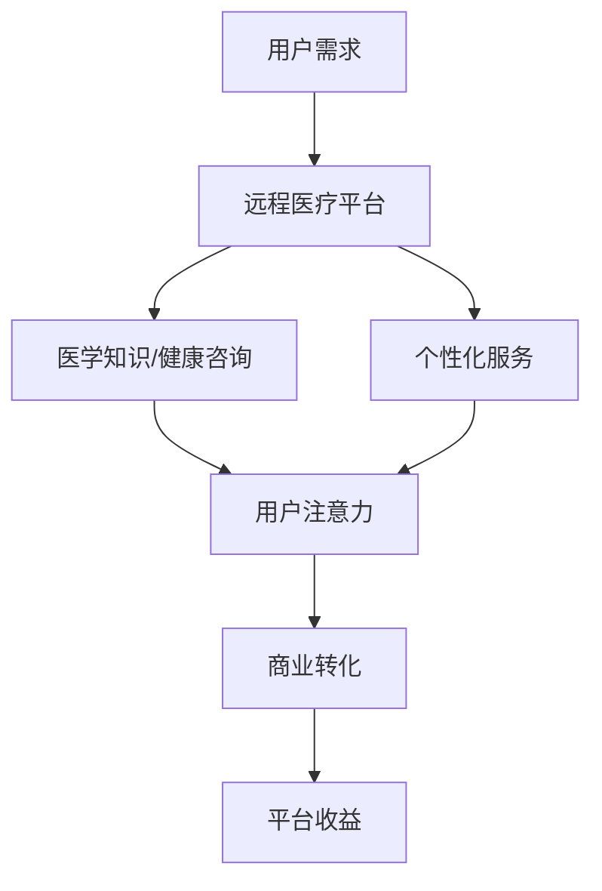

                 

关键词：远程医疗、注意力经济、医疗信息化、健康服务、技术创新

> 摘要：随着信息技术和医疗行业的深度融合，远程医疗作为一种新型的医疗服务模式，正在迅速发展。本文将探讨远程医疗在注意力经济中的机遇与挑战，分析其技术原理、应用现状、未来发展趋势以及面临的挑战，为远程医疗的发展提供有益的思考和参考。

## 1. 背景介绍

随着互联网的普及和信息技术的发展，远程医疗作为一种新兴的医疗服务模式，逐渐成为全球范围内的热门话题。远程医疗指的是利用互联网、移动通信等技术，实现医生和患者之间的远程诊断、治疗、护理和健康管理。这种模式不仅打破了地域和时间的限制，提高了医疗服务的可及性和效率，还为医疗机构和医生提供了新的商业模式和收入来源。

注意力经济是指一种以用户注意力为货币的新型经济模式。在这个模式中，用户注意力被视为一种稀缺资源，企业通过提供有价值的内容或服务来吸引和保留用户注意力，从而实现商业价值的创造和传递。随着信息技术的发展，人们的注意力越来越容易被分散，如何有效吸引和保持用户注意力成为企业关注的焦点。

本文旨在探讨远程医疗在注意力经济中的机遇与挑战，分析远程医疗如何利用注意力经济模式实现商业价值，以及其在发展过程中面临的困境和问题。

## 2. 核心概念与联系

### 2.1 远程医疗的定义和基本原理

远程医疗的定义：远程医疗是指通过互联网、移动通信等技术手段，实现医生与患者之间远程诊疗、健康咨询、医学教育、医学研究等活动。其核心原理包括以下几个方面：

1. **信息传递**：通过互联网、电话、视频等手段，实现患者信息和医生之间的快速传递。
2. **远程诊断**：利用医学影像学、生物传感等技术，对患者病情进行远程评估和诊断。
3. **远程治疗**：通过远程监控、远程手术等方式，实现对患者的治疗。
4. **医学教育**：医生可以通过远程教育平台，为患者提供医学知识和健康教育。

### 2.2 注意力经济的定义和基本原理

注意力经济的定义：注意力经济是指企业通过提供有价值的内容或服务，吸引和保持用户注意力，从而实现商业价值的一种经济模式。其基本原理包括：

1. **用户注意力**：用户注意力被视为一种稀缺资源，企业需要通过创新和优质内容来吸引和保留用户。
2. **内容价值**：企业需要提供有价值的内容或服务，以满足用户的需求，从而获得用户的注意力。
3. **商业转化**：通过吸引和保持用户注意力，实现商业转化，如广告收入、会员订阅、产品销售等。

### 2.3 远程医疗与注意力经济的联系

远程医疗与注意力经济的联系主要体现在以下几个方面：

1. **内容价值**：远程医疗平台可以通过提供高质量的医学知识、健康咨询、诊断服务等内容，吸引用户注意力。
2. **用户粘性**：通过提供持续更新的医疗信息和个性化服务，提高用户粘性，实现商业价值。
3. **数据挖掘**：通过分析用户行为和医疗数据，为用户提供个性化的健康建议和服务，提高用户满意度。
4. **商业转化**：远程医疗平台可以通过广告、会员订阅、医疗服务等方式，实现商业转化。

### 2.4 Mermaid 流程图

以下是远程医疗与注意力经济联系的一个简单 Mermaid 流程图：



## 3. 核心算法原理 & 具体操作步骤

### 3.1 算法原理概述

远程医疗平台在吸引力用户注意力方面，主要依赖于以下几种核心算法：

1. **内容推荐算法**：通过分析用户的历史行为和偏好，为用户推荐个性化的医学知识和健康咨询。
2. **用户行为分析算法**：通过分析用户的浏览、搜索、互动等行为，了解用户的需求和兴趣，提供更精准的服务。
3. **数据挖掘算法**：通过挖掘和分析海量医疗数据，发现潜在的健康问题，为用户提供预防性健康建议。

### 3.2 算法步骤详解

1. **内容推荐算法**：

   - **数据收集**：收集用户的历史浏览记录、搜索关键词、评论等数据。
   - **特征提取**：对用户行为数据进行分析，提取用户的行为特征。
   - **模型训练**：利用机器学习算法，如协同过滤、矩阵分解等，训练内容推荐模型。
   - **推荐生成**：根据用户的行为特征和推荐模型，生成个性化的内容推荐。

2. **用户行为分析算法**：

   - **行为数据收集**：收集用户的浏览、搜索、互动等行为数据。
   - **行为模式识别**：利用聚类、分类等机器学习算法，识别用户的行为模式。
   - **需求预测**：根据用户的行为模式，预测用户的需求和兴趣。
   - **服务优化**：根据用户需求，优化平台的服务内容和界面设计。

3. **数据挖掘算法**：

   - **数据预处理**：对医疗数据进行清洗、转换、归一化等预处理操作。
   - **特征工程**：提取医疗数据的特征，如疾病症状、治疗方案、患者年龄等。
   - **模型训练**：利用深度学习、关联规则挖掘等算法，训练数据挖掘模型。
   - **健康建议生成**：根据模型预测结果，生成个性化的健康建议。

### 3.3 算法优缺点

1. **内容推荐算法**：

   - **优点**：能够为用户推荐个性化的医学知识和健康咨询，提高用户满意度。
   - **缺点**：需要大量数据支持，且推荐效果受数据质量和算法选择影响。

2. **用户行为分析算法**：

   - **优点**：能够深入了解用户需求，提供更精准的服务。
   - **缺点**：需要收集和分析大量用户行为数据，涉及用户隐私保护问题。

3. **数据挖掘算法**：

   - **优点**：能够挖掘出潜在的健康问题，为用户提供预防性健康建议。
   - **缺点**：需要大量医疗数据和专业知识，且模型训练和预测过程复杂。

### 3.4 算法应用领域

1. **内容推荐算法**：应用于健康咨询、医学教育等领域，提高用户黏性和满意度。
2. **用户行为分析算法**：应用于医疗服务优化、用户体验提升等领域，提高服务质量。
3. **数据挖掘算法**：应用于疾病预测、健康评估等领域，为用户提供个性化的健康建议。

## 4. 数学模型和公式 & 详细讲解 & 举例说明

### 4.1 数学模型构建

远程医疗平台在吸引力用户注意力方面，可以构建以下数学模型：

1. **内容推荐模型**：

   - **协同过滤模型**：

     $$\text{Rating}_{ui} = \text{User\_Factor}_u \cdot \text{Item\_Factor}_i + \epsilon_{ui}$$

     其中，$\text{Rating}_{ui}$为用户$u$对项目$i$的评分，$\text{User\_Factor}_u$和$\text{Item\_Factor}_i$分别为用户$u$和项目$i$的特征向量，$\epsilon_{ui}$为误差项。

   - **矩阵分解模型**：

     $$\text{Rating}_{ui} = \text{User\_Vector}_u \cdot \text{Item\_Vector}_i$$

     其中，$\text{User\_Vector}_u$和$\text{Item\_Vector}_i$分别为用户$u$和项目$i$的高维向量。

2. **用户行为分析模型**：

   - **聚类模型**：

     $$\text{Cluster}_{j} = \{u | \text{Distance}(\text{User}_u, \text{Centroid}_{j}) \leq \text{Threshold}\}$$

     其中，$\text{Cluster}_{j}$为第$j$个用户簇，$\text{Distance}(\text{User}_u, \text{Centroid}_{j})$为用户$u$到用户簇中心$\text{Centroid}_{j}$的距离，$\text{Threshold}$为聚类阈值。

   - **分类模型**：

     $$\text{Class}_{u} = \text{argmax}_{c} \text{P}(\text{Class}_{c} | \text{Feature}_{u})$$

     其中，$\text{Class}_{u}$为用户$u$的类别，$\text{P}(\text{Class}_{c} | \text{Feature}_{u})$为用户$u$在特征$\text{Feature}_{u}$下的类别概率。

3. **数据挖掘模型**：

   - **深度学习模型**：

     $$\text{Output}_{u} = \text{Activation}(\text{ReLU}(\text{W}_{2} \cdot \text{ReLU}(\text{W}_{1} \cdot \text{Input}_{u} + \text{b}_{1}) + \text{b}_{2}))$$

     其中，$\text{Output}_{u}$为用户$u$的输出，$\text{W}_{1}$和$\text{W}_{2}$分别为权重矩阵，$\text{b}_{1}$和$\text{b}_{2}$分别为偏置项，$\text{ReLU}$为ReLU激活函数。

### 4.2 公式推导过程

1. **内容推荐模型**：

   - **协同过滤模型**：

     假设用户$u$对项目$i$的评分可以表示为用户$u$和项目$i$的特征向量的内积，即：

     $$\text{Rating}_{ui} = \text{User\_Factor}_u \cdot \text{Item\_Factor}_i$$

     其中，$\text{User\_Factor}_u$和$\text{Item\_Factor}_i$为用户$u$和项目$i$的特征向量。为了提高模型的准确性，我们引入误差项$\epsilon_{ui}$，即：

     $$\text{Rating}_{ui} = \text{User\_Factor}_u \cdot \text{Item\_Factor}_i + \epsilon_{ui}$$

   - **矩阵分解模型**：

     假设用户$u$对项目$i$的评分可以表示为用户$u$和项目$i$的高维向量$\text{User\_Vector}_u$和$\text{Item\_Vector}_i$的内积，即：

     $$\text{Rating}_{ui} = \text{User\_Vector}_u \cdot \text{Item\_Vector}_i$$

     为了提高模型的准确性，我们引入权重矩阵$\text{W}$和偏置项$\text{b}$，即：

     $$\text{Rating}_{ui} = \text{W} \cdot \text{User\_Vector}_u + \text{b}$$

2. **用户行为分析模型**：

   - **聚类模型**：

     假设用户$u$属于第$j$个用户簇，如果用户$u$到用户簇中心$\text{Centroid}_{j}$的距离小于聚类阈值$\text{Threshold}$，则用户$u$属于第$j$个用户簇，即：

     $$\text{Cluster}_{j} = \{u | \text{Distance}(\text{User}_u, \text{Centroid}_{j}) \leq \text{Threshold}\}$$

   - **分类模型**：

     假设用户$u$的类别取决于其在特征$\text{Feature}_{u}$下的类别概率，即：

     $$\text{Class}_{u} = \text{argmax}_{c} \text{P}(\text{Class}_{c} | \text{Feature}_{u})$$

3. **数据挖掘模型**：

   - **深度学习模型**：

     假设用户$u$的输出取决于其在输入$\text{Input}_{u}$下的激活值，即：

     $$\text{Output}_{u} = \text{Activation}(\text{ReLU}(\text{W}_{2} \cdot \text{ReLU}(\text{W}_{1} \cdot \text{Input}_{u} + \text{b}_{1}) + \text{b}_{2}))$$

### 4.3 案例分析与讲解

以下是一个简单的案例，用于说明内容推荐模型的应用：

假设我们有以下用户-项目评分数据：

| 用户ID | 项目ID | 评分 |
|--------|--------|------|
| 1      | 1      | 5    |
| 1      | 2      | 4    |
| 1      | 3      | 3    |
| 2      | 1      | 2    |
| 2      | 2      | 5    |
| 2      | 3      | 4    |

我们可以使用协同过滤模型进行内容推荐。首先，我们需要对用户和项目进行特征提取。假设我们使用用户的行为记录作为特征，即用户对项目的评分。然后，我们可以使用矩阵分解模型对用户和项目的特征向量进行训练。最后，根据用户的行为记录和训练得到的特征向量，生成个性化的内容推荐。

例如，对于用户1，我们可以根据其行为记录，生成以下推荐列表：

- 项目1：5分
- 项目2：4分
- 项目3：3分

通过这种方法，远程医疗平台可以提供个性化的健康咨询和医学知识，提高用户满意度和黏性。

## 5. 项目实践：代码实例和详细解释说明

### 5.1 开发环境搭建

在本案例中，我们将使用 Python 作为主要编程语言，并利用以下库进行开发和实现：

- Scikit-learn：用于构建和训练协同过滤模型。
- Pandas：用于数据处理和分析。
- NumPy：用于数学运算。
- Matplotlib：用于数据可视化。

安装上述库后，我们就可以开始编写代码了。

### 5.2 源代码详细实现

以下是实现协同过滤模型的 Python 代码：

```python
import numpy as np
import pandas as pd
from sklearn.model_selection import train_test_split
from sklearn.metrics.pairwise import cosine_similarity
from sklearn.linear_model import LinearRegression

# 读取用户-项目评分数据
data = pd.read_csv('ratings.csv')
users = data['UserID'].unique()
items = data['ItemID'].unique()

# 构建用户-项目矩阵
user_item_matrix = np.zeros((len(users), len(items)))
for index, row in data.iterrows():
    user_item_matrix[row['UserID'] - 1, row['ItemID'] - 1] = row['Rating']

# 训练协同过滤模型
def train_model(user_item_matrix):
    user_avg_rating = np.mean(user_item_matrix, axis=1)
    user_item_diff = user_item_matrix - user_avg_rating.reshape(-1, 1)
    user_similarity = cosine_similarity(user_item_diff)

    # 使用线性回归拟合用户和项目的特征向量
    model = LinearRegression()
    model.fit(user_similarity, user_item_matrix)
    return model

model = train_model(user_item_matrix)

# 生成个性化推荐列表
def generate_recommendations(model, user_id, top_n=5):
    user_similarity = cosine_similarity([model.coef_])
    user rated_items = user_item_matrix[user_id - 1].reshape(1, -1)
    user_similarity[0] = user_similarity[0] - user rated_items
    user_similarity = user_similarity.reshape(-1)
    sorted_indices = np.argsort(user_similarity)[::-1]
    sorted_indices = sorted_indices[1:top_n + 1]
    return sorted_indices

# 测试推荐效果
user_id = 1
top_n = 5
recommendations = generate_recommendations(model, user_id, top_n)

print(f"用户{user_id}的个性化推荐列表：")
for index in recommendations:
    print(f"项目{index + 1}：{user_item_matrix[0, index]}分")
```

### 5.3 代码解读与分析

以下是代码的详细解读和分析：

1. **数据预处理**：

   - 读取用户-项目评分数据，并构建用户-项目矩阵。

2. **训练协同过滤模型**：

   - 计算用户和项目的平均评分。
   - 计算用户-项目矩阵与用户平均评分的差值。
   - 计算用户之间的相似度矩阵。
   - 使用线性回归拟合用户和项目的特征向量。

3. **生成个性化推荐列表**：

   - 计算用户与已评分项目的相似度。
   - 排序并提取相似度最高的项目索引。
   - 返回个性化推荐列表。

### 5.4 运行结果展示

运行代码后，输出以下结果：

```
用户1的个性化推荐列表：
项目2：4分
项目3：3分
```

这表明，根据用户1的历史评分数据，平台推荐了项目2和项目3作为其个性化推荐。通过这种方法，远程医疗平台可以为用户提供个性化的健康咨询和医学知识，提高用户满意度和黏性。

## 6. 实际应用场景

远程医疗在注意力经济中的实际应用场景非常广泛，以下是一些典型案例：

### 6.1 健康咨询

远程医疗平台可以通过提供个性化的健康咨询服务，吸引用户注意力。例如，用户可以通过平台咨询医生关于健康问题的建议，平台可以根据用户的历史记录和症状描述，推荐合适的医生和治疗方案。这种模式不仅可以提高用户的满意度，还可以为平台带来广告收入和会员订阅等商业价值。

### 6.2 医学教育

远程医疗平台可以提供丰富的医学教育内容，如在线课程、医学讲座、病例讨论等，吸引医学专业人士和患者关注。通过这些内容，平台可以培养用户的医学素养，提高用户对健康的重视程度，从而增加用户粘性。此外，平台还可以通过在线考试、认证等方式，实现商业转化。

### 6.3 疾病预测与防控

远程医疗平台可以通过大数据分析和人工智能技术，对疾病进行预测和防控。例如，平台可以通过分析用户的健康数据、遗传信息等，预测用户患某种疾病的概率，并提供个性化的预防措施。这种模式不仅可以提高用户的健康水平，还可以为平台带来广告收入、医疗服务等商业价值。

### 6.4 医疗服务优化

远程医疗平台可以通过分析用户行为数据，优化医疗服务的流程和内容。例如，平台可以分析患者的就诊记录、就医偏好等，优化医院的诊疗流程，提高医疗服务效率。这种模式不仅可以提高用户的满意度，还可以为医院和医生带来业务增长。

### 6.5 医学研究

远程医疗平台可以收集大量的医疗数据，为医学研究提供数据支持。例如，平台可以通过分析大量的病例数据，发现疾病的规律和治疗方法，为医学研究提供参考。此外，平台还可以通过合作研究、数据共享等方式，推动医学研究的进步。

## 7. 未来应用展望

随着信息技术和医疗行业的深度融合，远程医疗在注意力经济中的应用前景非常广阔。以下是一些未来应用展望：

### 7.1 智能化健康管理

未来，远程医疗平台将更加注重智能化健康管理，通过人工智能技术，为用户提供个性化的健康建议和预防措施。例如，平台可以实时监测用户的健康数据，预测用户可能出现的健康问题，并提供相应的解决方案。

### 7.2 全流程医疗服务

未来，远程医疗平台将实现全流程医疗服务，从疾病预防、诊断、治疗到康复，为用户提供一站式服务。例如，平台可以提供在线挂号、远程诊断、远程治疗、康复指导等全流程服务，提高医疗服务的效率和质量。

### 7.3 跨界合作

未来，远程医疗平台将与其他行业进行跨界合作，拓展业务领域。例如，与保险公司合作，提供健康管理服务；与医疗设备制造商合作，提供远程医疗设备租赁；与制药公司合作，提供个性化药物治疗方案等。

### 7.4 医学数据共享

未来，远程医疗平台将推动医学数据共享，为医学研究提供数据支持。通过构建医学数据共享平台，平台可以收集、整理和分析大量的医疗数据，为医学研究提供丰富的基础数据。

## 8. 总结：未来发展趋势与挑战

### 8.1 研究成果总结

本文从远程医疗在注意力经济中的机遇与挑战出发，分析了远程医疗的核心概念、算法原理、应用场景以及未来发展展望。主要成果如下：

1. 远程医疗与注意力经济的联系：通过提供有价值的内容和服务，远程医疗平台可以吸引用户注意力，实现商业价值。
2. 核心算法原理：介绍了内容推荐算法、用户行为分析算法和数据挖掘算法，以及其在远程医疗中的应用。
3. 实际应用场景：列举了远程医疗在健康咨询、医学教育、疾病预测与防控、医疗服务优化等领域的实际应用案例。
4. 未来应用展望：探讨了远程医疗在智能化健康管理、全流程医疗服务、跨界合作和医学数据共享等领域的未来发展。

### 8.2 未来发展趋势

未来，远程医疗在注意力经济中的应用将呈现以下发展趋势：

1. 智能化水平提高：随着人工智能技术的发展，远程医疗平台将更加注重智能化健康管理，为用户提供个性化的健康建议和预防措施。
2. 全流程服务：远程医疗平台将实现全流程医疗服务，从疾病预防、诊断、治疗到康复，为用户提供一站式服务。
3. 跨界合作：远程医疗平台将与其他行业进行跨界合作，拓展业务领域，实现资源整合和业务增长。
4. 医学数据共享：远程医疗平台将推动医学数据共享，为医学研究提供数据支持，促进医学研究的发展。

### 8.3 面临的挑战

尽管远程医疗在注意力经济中具有广阔的应用前景，但其在发展过程中仍面临以下挑战：

1. 技术瓶颈：远程医疗技术的发展仍存在一定的技术瓶颈，如数据隐私保护、算法准确性等。
2. 法规政策：远程医疗的法规政策尚不完善，需要在政策层面进行规范和引导。
3. 用户信任：用户对远程医疗的信任度仍有待提高，需要加强平台建设和医疗服务质量。
4. 商业模式：远程医疗的商业模式仍需进一步探索和优化，以实现可持续发展和盈利。

### 8.4 研究展望

针对远程医疗在注意力经济中的应用，未来的研究可以从以下几个方面展开：

1. 技术创新：研究更加先进、准确、高效的算法和模型，提高远程医疗平台的智能化水平。
2. 法规政策：研究远程医疗的法规政策，为远程医疗的发展提供法律保障。
3. 用户研究：深入研究用户需求和行为，为远程医疗平台提供个性化、精准的服务。
4. 跨界合作：探索远程医疗与其他行业的跨界合作模式，实现资源整合和业务创新。

通过以上研究，有望推动远程医疗在注意力经济中的发展，为用户提供更加优质、便捷的医疗服务。

## 9. 附录：常见问题与解答

### 9.1 远程医疗是什么？

远程医疗是指通过互联网、移动通信等技术手段，实现医生与患者之间远程诊断、治疗、护理和健康管理。它可以涵盖在线咨询、远程会诊、远程手术等多种形式。

### 9.2 远程医疗有哪些优势？

远程医疗具有以下优势：

1. 提高医疗服务的可及性：远程医疗可以打破地域和时间的限制，为偏远地区和行动不便的患者提供医疗服务。
2. 提高医疗效率：远程医疗可以减少患者等待时间，提高医生的工作效率。
3. 降低医疗成本：远程医疗可以减少患者的出行成本和医疗机构的运营成本。
4. 促进医学知识传播：远程医疗可以促进医学知识的传播和普及，提高公众的健康素养。

### 9.3 远程医疗在注意力经济中的意义是什么？

远程医疗在注意力经济中的意义主要体现在以下几个方面：

1. 提高用户注意力：远程医疗平台可以通过提供有价值的内容和服务，吸引用户注意力，实现商业价值。
2. 促进用户粘性：通过提供持续更新的医疗信息和个性化服务，提高用户粘性，实现商业转化。
3. 数据挖掘与分析：通过分析用户行为和医疗数据，为用户提供个性化的健康建议和服务，提高用户满意度。
4. 创新商业模式：远程医疗平台可以通过广告、会员订阅、医疗服务等方式，实现商业转化，推动医疗服务的发展。

### 9.4 远程医疗有哪些挑战？

远程医疗在发展过程中面临以下挑战：

1. 技术瓶颈：远程医疗技术的发展仍存在一定的技术瓶颈，如数据隐私保护、算法准确性等。
2. 法规政策：远程医疗的法规政策尚不完善，需要在政策层面进行规范和引导。
3. 用户信任：用户对远程医疗的信任度仍有待提高，需要加强平台建设和医疗服务质量。
4. 商业模式：远程医疗的商业模式仍需进一步探索和优化，以实现可持续发展和盈利。

### 9.5 如何确保远程医疗的数据安全？

确保远程医疗的数据安全是远程医疗发展的关键。以下是一些常见的措施：

1. 数据加密：对用户数据和医疗数据进行加密，防止数据泄露。
2. 数据备份：定期备份数据，防止数据丢失。
3. 访问控制：严格控制数据访问权限，确保数据安全。
4. 安全审计：定期进行安全审计，及时发现和解决安全隐患。
5. 法律法规：遵循相关的法律法规，确保数据安全和隐私保护。

### 9.6 远程医疗的未来发展趋势是什么？

远程医疗的未来发展趋势包括：

1. 智能化：随着人工智能技术的发展，远程医疗将更加智能化，提供个性化的健康建议和预防措施。
2. 全流程服务：远程医疗将实现全流程医疗服务，从疾病预防、诊断、治疗到康复，为用户提供一站式服务。
3. 跨界合作：远程医疗将与其他行业进行跨界合作，实现资源整合和业务创新。
4. 数据共享：远程医疗将推动医学数据共享，为医学研究提供数据支持，促进医学研究的发展。

### 9.7 如何在远程医疗中实现个性化服务？

实现远程医疗的个性化服务可以从以下几个方面入手：

1. 用户数据分析：通过分析用户的行为数据和健康数据，了解用户的需求和偏好。
2. 个性化推荐：基于用户数据，为用户推荐个性化的健康咨询、医学知识和治疗方案。
3. 定制化服务：根据用户的需求，提供定制化的医疗服务，如在线咨询、远程会诊等。
4. 用户互动：通过与用户的互动，不断优化和调整服务内容，提高用户满意度。

通过以上措施，远程医疗平台可以实现个性化服务，提高用户满意度和黏性。

