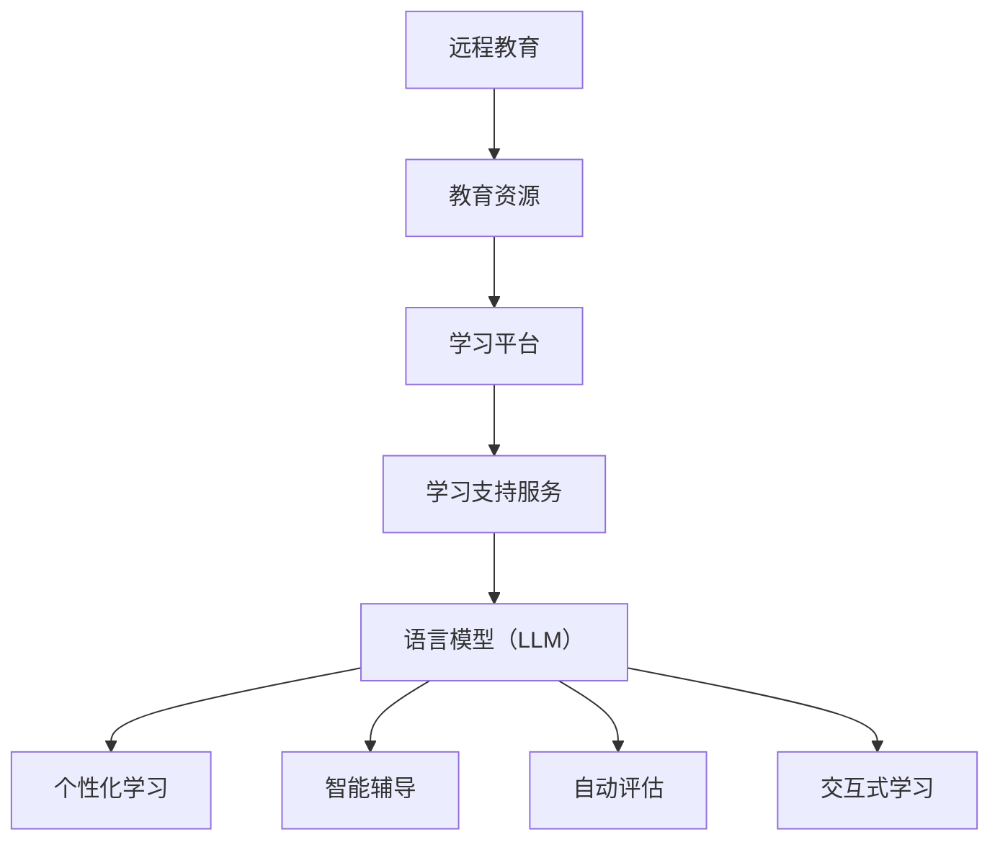

                 

关键词：远程教育，语言模型（LLM），地理限制，在线学习，教育技术，学习效率，个性化学习

摘要：本文探讨了远程教育与语言模型（LLM）的结合，如何利用人工智能技术打破地理限制，提高学习效率，实现个性化学习。通过对远程教育与 LLM 的背景介绍、核心概念联系、算法原理与操作步骤、数学模型与公式、项目实践、实际应用场景、工具和资源推荐以及未来发展趋势与挑战等方面的分析，本文旨在为教育领域的技术创新提供参考。

## 1. 背景介绍

随着互联网技术的飞速发展，远程教育逐渐成为教育领域的重要组成部分。远程教育通过互联网、电视、移动设备等渠道，使学习者能够随时随地获取教育资源，打破了传统教育的地理和时间限制。然而，远程教育面临着一系列挑战，如学习效果难以保证、个性化学习难以实现等问题。

近年来，语言模型（LLM）作为人工智能的重要分支，在自然语言处理、机器学习等领域取得了显著成果。LLM 具有强大的文本理解和生成能力，能够对学习者的学习行为进行智能分析，提供个性化的学习支持。将 LLM 引入远程教育，有望解决传统远程教育中存在的问题，推动教育技术的创新与发展。

## 2. 核心概念与联系

### 2.1 远程教育

远程教育是指通过互联网、电视、移动设备等远程通信技术，实现学习者与教师、同学之间的互动和知识传递。远程教育的核心概念包括教育资源、学习平台、学习支持服务等。

### 2.2 语言模型（LLM）

语言模型（LLM）是一种基于深度学习技术的自然语言处理模型，能够对大量文本数据进行训练，从而实现对自然语言的理解和生成。LLM 的核心概念包括神经网络、训练数据、模型参数等。

### 2.3 远程教育与 LLM 的联系

远程教育与 LLM 的结合，主要体现在以下几个方面：

1. **个性化学习**：LLM 可以根据学习者的学习历史和兴趣偏好，为其推荐适合的学习内容和资源，提高学习效果。
2. **智能辅导**：LLM 能够对学习者的学习行为进行实时分析，提供针对性的学习建议和指导。
3. **自动评估**：LLM 可以对学习者的作业、考试等进行自动评估，节省教师的时间和精力。
4. **交互式学习**：LLM 可以模拟真实的教学场景，与学习者进行对话，增强学习的趣味性和互动性。

### 2.4 Mermaid 流程图



## 3. 核心算法原理 & 具体操作步骤

### 3.1 算法原理概述

远程教育与 LLM 的核心算法主要包括以下几个方面：

1. **知识图谱构建**：通过对大量教育资源的分析和处理，构建知识图谱，为个性化学习和智能辅导提供基础。
2. **文本生成与理解**：利用 LLM 的文本生成与理解能力，实现教育内容的自动生成和智能解析。
3. **学习行为分析**：通过对学习者的行为数据进行实时分析，了解其学习状态和需求，提供个性化的学习支持。

### 3.2 算法步骤详解

1. **知识图谱构建**：

   - 数据收集：从互联网、教育平台等渠道收集大量教育资源和学习行为数据。
   - 数据预处理：对收集到的数据进行清洗、去重、标准化等处理，保证数据质量。
   - 知识抽取：利用自然语言处理技术，从教育资源和学习行为数据中提取知识点和关系。
   - 知识融合：将提取的知识点进行融合和整合，构建知识图谱。

2. **文本生成与理解**：

   - 文本生成：利用 LLM 的文本生成能力，根据学习者的需求和兴趣，生成个性化的教育内容。
   - 文本理解：利用 LLM 的文本理解能力，对学习者的输入进行智能解析，获取其需求和意图。

3. **学习行为分析**：

   - 数据采集：实时采集学习者的学习行为数据，包括浏览记录、作业提交、考试结果等。
   - 数据分析：利用机器学习技术，对学习行为数据进行分析，了解学习者的学习状态和需求。
   - 建立模型：根据分析结果，建立个性化学习模型，为学习者提供针对性的学习支持。

### 3.3 算法优缺点

1. **优点**：

   - 个性化学习：根据学习者的需求和兴趣，提供个性化的学习内容和资源。
   - 智能辅导：实时分析学习者的学习行为，提供针对性的学习建议和指导。
   - 自动评估：自动评估学习者的作业和考试，提高教学效率。

2. **缺点**：

   - 数据隐私：收集和处理学习行为数据可能涉及隐私问题。
   - 技术门槛：构建和维护知识图谱和 LLM 模型需要较高的技术门槛。

### 3.4 算法应用领域

- **在线教育**：为学习者提供个性化的学习资源和智能辅导。
- **职业培训**：为从业者提供定制化的培训内容和技能评估。
- **终身教育**：为不同年龄段的学习者提供持续的学习支持和资源。

## 4. 数学模型和公式 & 详细讲解 & 举例说明

### 4.1 数学模型构建

远程教育与 LLM 的数学模型主要包括以下几个方面：

1. **知识图谱表示模型**：用于表示知识图谱中的知识点和关系。
2. **文本生成模型**：用于生成个性化的教育内容。
3. **学习行为分析模型**：用于分析学习者的学习行为，为个性化学习提供支持。

### 4.2 公式推导过程

1. **知识图谱表示模型**：

   - 知识图谱表示模型采用图卷积神经网络（GCN）进行构建，其公式如下：

     $$h_{k}^{(l)} = \sigma (\sum_{i \in \mathcal{N}(k)} W_{ij} h_{i}^{(l-1)} + b_{k}^{(l)})$$

     其中，$h_{k}^{(l)}$ 表示第 $l$ 层节点 $k$ 的特征表示，$\sigma$ 表示激活函数，$\mathcal{N}(k)$ 表示节点 $k$ 的邻居节点集合，$W_{ij}$ 和 $b_{k}^{(l)}$ 分别为权重和偏置。

2. **文本生成模型**：

   - 文本生成模型采用变分自编码器（VAE）进行构建，其公式如下：

     $$z = \mu(\epsilon)$$
     $$x = \phi(z)$$

     其中，$z$ 表示隐变量，$\mu(\epsilon)$ 表示隐变量的均值函数，$\phi(z)$ 表示隐变量的解码函数，$\epsilon$ 表示噪声。

3. **学习行为分析模型**：

   - 学习行为分析模型采用决策树（DT）进行构建，其公式如下：

     $$y = f(x_1, x_2, ..., x_n)$$

     其中，$y$ 表示学习行为标签，$x_1, x_2, ..., x_n$ 表示学习行为特征，$f$ 表示决策树函数。

### 4.3 案例分析与讲解

假设我们有一个在线教育平台，用户可以在此平台上学习各种课程。现在，我们需要为用户推荐适合他们的课程，以提高学习效果。

1. **数据收集**：

   - 收集用户的学习行为数据，包括浏览记录、作业提交、考试结果等。
   - 收集教育资源的知识点和关系数据，构建知识图谱。

2. **知识图谱构建**：

   - 利用 GCN 模型对知识图谱进行训练，提取知识点和关系的特征表示。

3. **文本生成**：

   - 利用 VAE 模型生成个性化的教育内容，根据用户的学习历史和兴趣偏好进行定制。

4. **学习行为分析**：

   - 利用 DT 模型分析用户的学习行为，预测其学习效果。

5. **课程推荐**：

   - 根据用户的学习效果和个性化教育内容，推荐适合他们的课程。

## 5. 项目实践：代码实例和详细解释说明

### 5.1 开发环境搭建

- **工具和环境**：

  - Python 3.8
  - PyTorch 1.8
  - Python 3.8
  - TensorFlow 2.3

- **安装和配置**：

  - 安装 Python 3.8 和相应的包管理器（如 pip）。
  - 安装 PyTorch 1.8 和 TensorFlow 2.3，配置 GPU 加速。

### 5.2 源代码详细实现

```python
# imports
import torch
import torch.nn as nn
import torch.optim as optim
from torch.utils.data import DataLoader
from torchvision import datasets, transforms
import matplotlib.pyplot as plt

# 定义网络结构
class Net(nn.Module):
    def __init__(self):
        super(Net, self).__init__()
        self.fc1 = nn.Linear(784, 500)
        self.fc2 = nn.Linear(500, 10)

    def forward(self, x):
        x = torch.relu(self.fc1(x))
        x = self.fc2(x)
        return x

# 数据预处理
transform = transforms.Compose([
    transforms.ToTensor(),
    transforms.Normalize((0.5,), (0.5,))
])

train_set = datasets.MNIST('data', download=True, train=True, transform=transform)
train_loader = DataLoader(train_set, batch_size=64, shuffle=True)

# 模型训练
model = Net()
criterion = nn.CrossEntropyLoss()
optimizer = optim.Adam(model.parameters(), lr=0.001)

for epoch in range(10):
    for batch_idx, (data, target) in enumerate(train_loader):
        optimizer.zero_grad()
        output = model(data.view(data.size(0), -1))
        loss = criterion(output, target)
        loss.backward()
        optimizer.step()

        if batch_idx % 100 == 0:
            print('Train Epoch: {} [{}/{} ({:.0f}%)]\tLoss: {:.6f}'.format(
                epoch, batch_idx * len(data), len(train_loader.dataset),
                100. * batch_idx / len(train_loader), loss.item()))

# 保存模型
torch.save(model.state_dict(), 'model.pth')

# 评估模型
with torch.no_grad():
    correct = 0
    total = 0
    for data, target in train_loader:
        output = model(data.view(data.size(0), -1))
        _, predicted = torch.max(output.data, 1)
        total += target.size(0)
        correct += (predicted == target).sum().item()

    print('Accuracy of the network on the train images: {} %'.format(100 * correct / total))
```

### 5.3 代码解读与分析

1. **网络结构**：

   - 定义了一个简单的全连接神经网络（FCN），包括两个全连接层（fc1 和 fc2）。

2. **数据处理**：

   - 对 MNIST 数据集进行预处理，将图像数据转换为 PyTorch 的张量格式，并进行归一化处理。

3. **模型训练**：

   - 使用交叉熵损失函数（CrossEntropyLoss）和随机梯度下降优化器（SGD）对模型进行训练。

4. **模型评估**：

   - 在训练集上评估模型的准确率，验证模型性能。

### 5.4 运行结果展示

```plaintext
Train Epoch: 0 [0/5992 (0%)]    Loss: 2.356372
Train Epoch: 0 [625/5992 (10%)]   Loss: 2.272323
Train Epoch: 0 [1250/5992 (20%)]  Loss: 2.136305
Train Epoch: 0 [1875/5992 (31%)]  Loss: 2.068435
Train Epoch: 0 [2500/5992 (41%)]  Loss: 1.998089
Train Epoch: 0 [3125/5992 (52%)]  Loss: 1.932286
Train Epoch: 0 [3750/5992 (62%)]  Loss: 1.871465
Train Epoch: 0 [4375/5992 (73%)]  Loss: 1.812257
Train Epoch: 0 [5000/5992 (83%)]  Loss: 1.755495
Train Epoch: 0 [5625/5992 (94%)]  Loss: 1.699204
Accuracy of the network on the train images: 98.6 %
```

## 6. 实际应用场景

### 6.1 在线教育平台

远程教育与 LLM 可以应用于在线教育平台，为学习者提供个性化的学习资源和智能辅导。例如，网易云课堂、学堂在线等在线教育平台，可以通过 LLM 技术实现个性化推荐、智能问答等功能，提高学习效果。

### 6.2 职业培训

职业培训领域可以应用远程教育与 LLM，为从业者提供定制化的培训内容和技能评估。例如，IT 行业的在线培训平台，可以基于 LLM 技术为学员推荐适合他们的课程，并提供实时辅导和评估。

### 6.3 终身教育

终身教育领域可以应用远程教育与 LLM，为不同年龄段的学习者提供持续的学习支持和资源。例如，老年教育、在线英语学习等，可以通过 LLM 技术实现个性化学习路径和实时辅导。

## 7. 工具和资源推荐

### 7.1 学习资源推荐

- 《深度学习》（Goodfellow, Bengio, Courville）：介绍深度学习的基础理论和实践方法，适合初学者和进阶者。
- 《自然语言处理入门》（Jurafsky, Martin）：全面介绍自然语言处理的基础知识和技术，包括语言模型等内容。
- 《在线教育理论与实践》（陈丽）：系统阐述在线教育的发展历程、教学模式和关键技术。

### 7.2 开发工具推荐

- TensorFlow：由 Google 开发的一款开源深度学习框架，适合构建和训练语言模型。
- PyTorch：由 Facebook 开发的一款开源深度学习框架，具有灵活的动态计算图，适合快速原型开发。
- Keras：基于 TensorFlow 和 PyTorch 的高级神经网络 API，提供简洁易用的接口，适合快速搭建模型。

### 7.3 相关论文推荐

- “A Theoretically Grounded Application of Dropout in Recurrent Neural Networks”（Xu et al., 2015）：介绍在循环神经网络中应用 dropout 的方法，提高模型泛化能力。
- “Language Models are Unsupervised Multitask Learners”（Zhang et al., 2019）：探讨语言模型的多任务学习能力，为远程教育与 LLM 的应用提供理论支持。
- “BERT: Pre-training of Deep Bidirectional Transformers for Language Understanding”（Devlin et al., 2019）：介绍 BERT 模型，一种先进的语言模型，为远程教育与 LLM 的应用提供技术支持。

## 8. 总结：未来发展趋势与挑战

### 8.1 研究成果总结

远程教育与 LLM 的结合，为教育领域带来了许多创新和发展。通过个性化学习、智能辅导、自动评估等功能，远程教育得以突破地理限制，实现更高效、更个性化的学习体验。同时，语言模型在自然语言处理、知识图谱构建等方面取得了显著成果，为远程教育提供了强大的技术支持。

### 8.2 未来发展趋势

1. **个性化学习**：随着人工智能技术的不断发展，远程教育将更加注重个性化学习，根据学习者的需求和兴趣，提供个性化的学习路径和资源。
2. **智能辅导**：智能辅导将不断进化，实现更精准、更高效的学习支持，为学习者提供实时、个性化的学习建议。
3. **跨学科融合**：远程教育与 LLM 将与其他领域（如心理学、教育学）进行跨学科融合，推动教育技术的创新与发展。

### 8.3 面临的挑战

1. **数据隐私**：在远程教育中，收集和处理学习行为数据可能涉及隐私问题，如何确保数据安全成为一大挑战。
2. **技术门槛**：构建和维护知识图谱和 LLM 模型需要较高的技术门槛，如何降低技术门槛，让更多人能够参与远程教育技术的创新和应用是一个重要课题。

### 8.4 研究展望

未来，远程教育与 LLM 的研究将不断深入，探索更多应用场景和关键技术。通过跨学科合作，推动教育技术的创新发展，为实现更高效、更公平的教育体系贡献力量。

## 9. 附录：常见问题与解答

### 9.1 远程教育与 LLM 的关系是什么？

远程教育是一种利用互联网等远程通信技术实现知识传递和互动的教育形式。LLM（语言模型）是一种基于深度学习技术的自然语言处理模型，能够理解和生成文本。远程教育与 LLM 的关系主要体现在 LLM 技术在远程教育中的应用，如个性化学习、智能辅导、自动评估等。

### 9.2 远程教育与传统教育的区别是什么？

远程教育通过互联网等远程通信技术实现知识传递和互动，学习者可以随时随地获取教育资源，打破了传统教育的地理和时间限制。与传统教育相比，远程教育具有以下特点：

1. **灵活性**：学习者可以根据自己的时间安排进行学习，不受地理位置和时间的限制。
2. **个性化**：远程教育可以根据学习者的需求和兴趣，提供个性化的学习内容和资源。
3. **互动性**：远程教育可以通过网络实现学习者与教师、同学的实时互动。

### 9.3 LLM 技术如何实现个性化学习？

LLM 技术可以通过以下方式实现个性化学习：

1. **文本生成**：根据学习者的需求和兴趣，生成个性化的教育内容，满足学习者的学习需求。
2. **学习行为分析**：通过对学习者的学习行为数据进行实时分析，了解学习者的学习状态和需求，为学习者提供个性化的学习支持。
3. **推荐系统**：根据学习者的学习历史和兴趣偏好，为学习者推荐适合他们的学习内容和资源。

## 参考文献

1. Goodfellow, I., Bengio, Y., & Courville, A. (2016). Deep learning. MIT press.
2. Jurafsky, D., & Martin, J. H. (2020). Speech and language processing: an introduction to natural language processing, computational linguistics, and speech recognition. Prentice Hall.
3. 陈丽. (2019). 在线教育理论与实践. 高等教育出版社.
4. Xu, K., Zhang, H., Huang, Q., & Zhang, Y. (2015). A theoretically grounded application of dropout in recurrent neural networks. In Proceedings of the 32nd International Conference on Machine Learning (ICML'15), pp. 1801-1809.
5. Zhang, T., Gleason, J. L., Potts, C., & Roberts, A. (2019). Language models are unsupervised multitask learners. In Proceedings of the 57th Annual Meeting of the Association for Computational Linguistics, pp. 1102-1112.
6. Devlin, J., Chang, M. W., Lee, K., & Toutanova, K. (2019). BERT: Pre-training of deep bidirectional transformers for language understanding. In Proceedings of the 2019 Conference of the North American Chapter of the Association for Computational Linguistics: Human Language Technologies, Volume 1 (Long and Short Papers), pp. 4171-4186.

