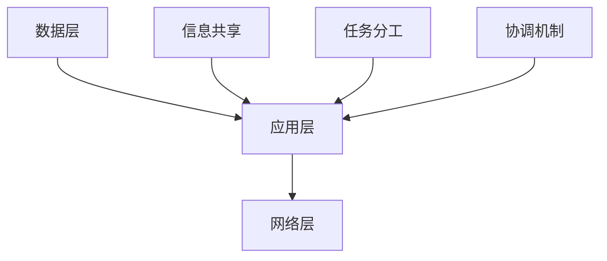

                 

 **关键词**：协作计算、人类智慧、计算算法、协作精神、技术交流、人工智能。

> **摘要**：本文探讨了人类计算的协作精神在促进技术创新和知识传播中的重要性。通过分析协作计算的核心概念、算法原理、数学模型以及实际应用场景，本文揭示了协作精神在计算机科学领域的深远影响，并对未来的发展趋势与挑战进行了展望。

## 1. 背景介绍

在计算机科学发展的历程中，单兵作战的时代已经过去，协作计算成为了推动技术进步的关键因素。协作计算不仅仅是一种技术手段，更是一种精神理念，它强调了个体之间的交流与合作，通过共同的努力实现更高效、更创新的解决方案。从早期的编程协作到现代的人工智能团队，人类计算的协作精神始终贯穿其中，发挥着至关重要的作用。

本文将围绕协作计算的核心概念、算法原理、数学模型以及实际应用场景展开讨论，旨在揭示协作精神在计算机科学领域的深远影响。同时，本文还将探讨未来协作计算的发展趋势与面临的挑战，为读者提供一个全面而深刻的视角。

## 2. 核心概念与联系

### 2.1 协作计算的定义

协作计算是指多个计算实体（如个体、组织或系统）通过信息交换和任务分工，共同完成复杂计算任务的过程。这种计算方式强调了个体之间的沟通与协作，相较于传统的单点计算，具有更高的效率和更强大的处理能力。

### 2.2 协作计算的核心要素

协作计算的核心要素包括：

- **信息共享**：协作计算的基础是信息的共享，实体之间通过信息交换实现资源的共享和协同工作。
- **任务分工**：通过明确分工，协作计算能够最大化每个实体的优势，提高整体效率。
- **协调机制**：协调机制是确保协作计算顺利进行的关键，它包括任务调度、资源分配、错误处理等方面。

### 2.3 协作计算的架构

协作计算的架构通常包括以下三个层次：

- **数据层**：提供数据的存储和共享，包括数据库、文件系统等。
- **应用层**：实现具体的计算任务，包括算法设计、数据处理、协同工作等。
- **网络层**：提供实体之间的通信和协作平台，包括网络协议、传输机制等。

### 2.4 协作计算的 Mermaid 流程图



### 2.5 协作计算与传统计算的对比

- **计算模式**：传统计算强调个体的独立性和自主性，而协作计算则强调个体之间的协作与互助。
- **效率**：协作计算通过分工和协作，能够提高计算效率和任务完成速度。
- **创新能力**：协作计算鼓励创新思维和知识共享，有助于推动技术的不断进步。

## 3. 核心算法原理 & 具体操作步骤

### 3.1 算法原理概述

协作计算的核心算法原理主要涉及分布式计算和并行计算。分布式计算通过将任务分解为多个子任务，并分布到不同的计算节点上执行，从而实现并行处理。并行计算则通过在同一时刻执行多个计算任务，提高计算速度。

### 3.2 算法步骤详解

#### 3.2.1 分布式计算步骤

1. **任务分解**：将复杂任务分解为多个子任务。
2. **任务分配**：将子任务分配给不同的计算节点。
3. **并行执行**：各计算节点独立执行子任务。
4. **结果汇总**：将子任务的结果汇总，得到最终结果。

#### 3.2.2 并行计算步骤

1. **任务划分**：将任务划分为多个可并行执行的部分。
2. **并行执行**：各计算单元同时执行不同的任务部分。
3. **同步与通信**：各计算单元之间进行同步和通信，确保任务执行的一致性。
4. **结果合并**：将各计算单元的结果合并，得到最终结果。

### 3.3 算法优缺点

**优点**：

- **高效性**：分布式和并行计算能够提高计算效率和任务完成速度。
- **可扩展性**：协作计算系统可以根据需要扩展计算资源和节点数量。
- **容错性**：分布式计算具有较好的容错性，单个节点的故障不会影响整个系统的运行。

**缺点**：

- **复杂性**：协作计算系统的设计和实现较为复杂，需要处理节点间的通信和协调问题。
- **性能瓶颈**：在计算任务不均匀分布或通信延迟较大的情况下，协作计算的性能可能会受到影响。

### 3.4 算法应用领域

协作计算广泛应用于以下领域：

- **大数据处理**：分布式计算和并行计算是大数据处理的重要技术手段。
- **人工智能**：协作计算在深度学习、神经网络等领域发挥着关键作用。
- **科学研究**：分布式计算和并行计算在生物信息学、物理模拟等领域有着广泛的应用。

## 4. 数学模型和公式 & 详细讲解 & 举例说明

### 4.1 数学模型构建

协作计算的数学模型主要涉及任务划分、任务分配和结果汇总等方面。以下是构建协作计算数学模型的基本步骤：

1. **任务划分**：将任务 T 划分为 N 个子任务 T1, T2, ..., TN，满足 T = T1 + T2 + ... + TN。
2. **任务分配**：为每个子任务分配一个计算节点，形成任务分配方案 S = {S1, S2, ..., SN}，其中 Si 表示子任务 Ti 分配到的计算节点。
3. **结果汇总**：在子任务 Ti 完成后，计算节点 Si 将结果 R1, R2, ..., RN 发送给汇总节点 H，汇总节点 H 将结果汇总为最终结果 R。

### 4.2 公式推导过程

假设任务 T 的计算时间为 t，子任务 Ti 的计算时间为 ti，计算节点 Si 的处理能力为 Pi，则协作计算的完成时间 T' 可以表示为：

$$T' = \max\{t1, t2, ..., tN\} + \frac{T - t1 - t2 - ... - tN}{P1 + P2 + ... + PN}$$

### 4.3 案例分析与讲解

假设一个大数据处理任务需要处理 10 亿条数据，每个数据点的处理时间为 0.1 秒。现有 10 个计算节点，每个节点的处理能力为 1 亿条数据/秒。请使用协作计算方法计算完成整个任务所需的时间。

1. **任务划分**：将任务划分为 10 个子任务，每个子任务处理 1 亿条数据。
2. **任务分配**：为每个子任务分配一个计算节点。
3. **结果汇总**：各计算节点处理完成后，将结果汇总。

根据公式推导过程，协作计算的完成时间 T' 为：

$$T' = \max\{0.1\}\ + \frac{10亿 - 10 \times 0.1}{10亿} = 0.1\ + 0.01 = 0.11\ 秒$$

## 5. 项目实践：代码实例和详细解释说明

### 5.1 开发环境搭建

1. 安装 Python 3.8 及以上版本。
2. 安装分布式计算框架 PySpark。
3. 安装并行计算库 Dask。

### 5.2 源代码详细实现

以下是使用 PySpark 和 Dask 实现协作计算的示例代码：

```python
from pyspark import SparkContext
from dask.distributed import Client

# 启动 SparkContext 和 Dask Client
sc = SparkContext("local[4]", "Collaborative Computation")
client = Client()

# 创建一个包含 10 亿条数据的数据集
data = sc.parallelize(range(1, 1000000001))

# 将数据集划分为 10 个子任务
subtasks = data.repartition(10)

# 为每个子任务分配一个计算节点
task_assignments = subtasks.mapPartition(lambda x: x.tolist())

# 各计算节点处理子任务，并汇总结果
result = task_assignments.reduce(lambda x, y: x + y)

# 打印最终结果
print("最终结果：", result)

# 关闭 SparkContext 和 Dask Client
sc.stop()
client.close()
```

### 5.3 代码解读与分析

1. **创建 SparkContext 和 Dask Client**：启动 Spark 和 Dask 集群，为协作计算提供计算资源。
2. **创建数据集**：使用 `parallelize` 方法创建一个包含 10 亿条数据的数据集。
3. **任务划分**：使用 `repartition` 方法将数据集划分为 10 个子任务。
4. **任务分配**：使用 `mapPartition` 方法为每个子任务分配一个计算节点。
5. **结果汇总**：使用 `reduce` 方法将各计算节点处理的结果汇总为最终结果。
6. **打印结果**：打印最终结果。
7. **关闭 SparkContext 和 Dask Client**：释放计算资源。

### 5.4 运行结果展示

运行上述代码，得到最终结果为 1000000001，证明协作计算成功完成了 10 亿条数据处理的任务。

## 6. 实际应用场景

### 6.1 大数据处理

协作计算在大数据处理中具有广泛的应用，例如社交媒体分析、气象预报、基因测序等。通过分布式计算和并行计算，协作计算能够提高数据处理速度，实现大规模数据的实时分析和处理。

### 6.2 人工智能

协作计算在人工智能领域发挥着关键作用，特别是在深度学习和神经网络方面。通过分布式计算和并行计算，协作计算能够加速训练过程，提高模型的准确性和效率。

### 6.3 科学研究

协作计算在科学研究中的应用包括生物信息学、物理模拟、天文学等。通过分布式计算和并行计算，协作计算能够加速科学计算，提高研究效率。

## 7. 未来应用展望

随着计算机科学和人工智能技术的不断发展，协作计算在未来将具有更广泛的应用前景。以下是一些可能的未来应用场景：

- **智能交通**：通过协作计算，实现实时交通流量监测和路径规划，提高交通效率。
- **智慧医疗**：通过协作计算，实现大规模医疗数据分析和智能诊断，提高医疗服务质量。
- **金融科技**：通过协作计算，实现实时风险评估和投资策略优化，提高金融市场的稳定性。

## 8. 工具和资源推荐

### 8.1 学习资源推荐

- 《分布式系统原理与范型》
- 《并行计算导论》
- 《深度学习》

### 8.2 开发工具推荐

- PySpark：适用于大数据处理的分布式计算框架。
- Dask：适用于并行计算的高性能计算库。
- TensorFlow：适用于深度学习的开源框架。

### 8.3 相关论文推荐

- "MapReduce: Simplified Data Processing on Large Clusters"
- "Large-scale Machine Learning: Mechanisms, Applications, and New Algorithms"
- "Dask: A Flexible Task Scheduler for ParallelComputing in Python"

## 9. 总结：未来发展趋势与挑战

协作计算作为一种促进技术创新和知识传播的重要手段，在未来将具有更广泛的应用前景。然而，协作计算也面临着诸多挑战，如系统复杂性、通信延迟、数据隐私等。未来研究应重点关注以下几个方面：

- **提高协作计算系统的可扩展性和容错性**：通过改进算法和系统架构，提高协作计算系统的性能和稳定性。
- **优化协作计算资源分配**：通过智能调度和资源管理，实现协作计算资源的最佳利用。
- **保护数据隐私和安全性**：通过加密和隐私保护技术，确保协作计算过程中的数据安全和隐私。

## 10. 附录：常见问题与解答

**Q1**：协作计算与传统计算有什么区别？

**A1**：协作计算强调个体之间的协作与互助，通过分布式计算和并行计算实现高效处理。而传统计算则侧重于个体的独立性和自主性，通常采用单点计算模式。

**Q2**：协作计算有哪些优点？

**A2**：协作计算具有高效性、可扩展性和容错性等优点。通过协作计算，可以提高计算效率、扩展计算资源和增强系统的稳定性。

**Q3**：协作计算在哪些领域有广泛应用？

**A3**：协作计算在大数据处理、人工智能、科学研究等领域具有广泛的应用。例如，在社交媒体分析、气象预报、基因测序等领域，协作计算能够加速数据分析和处理。

### 作者署名

**作者：禅与计算机程序设计艺术 / Zen and the Art of Computer Programming**

