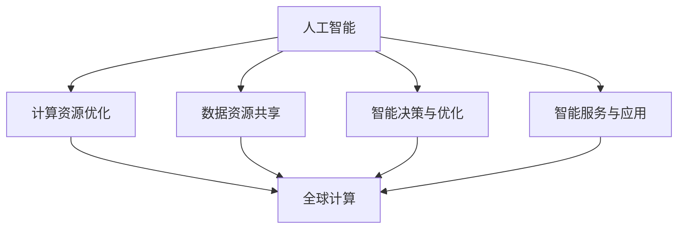

                 

关键词：人工智能，全球计算，智能互联，计算架构，技术创新，未来展望。

> 摘要：本文旨在探讨人工智能与全球计算的深度融合，分析其在全球范围内的应用场景和影响力，同时探讨未来的发展趋势与面临的挑战。通过详细介绍核心概念、算法原理、数学模型和实际应用案例，本文力求为读者呈现一幅全球智慧与计算技术的宏大画卷。

## 1. 背景介绍

随着科技的飞速发展，计算技术已经成为推动社会进步的重要力量。从早期的计算机硬件升级到现代的云计算、大数据和人工智能，计算技术的每一次突破都带来了前所未有的变革。全球计算作为计算技术的一个重要分支，其核心在于如何将全球范围内的计算资源高效、智能地整合和利用，以实现更广泛的应用场景和更高的计算效率。

人工智能作为当今科技领域的热点，其与全球计算的深度融合正在引发一场新的技术革命。人工智能技术的发展不仅依赖于强大的计算能力，同时也需要全球范围内的大量数据和知识资源。因此，人工智能与全球计算的互动与融合，正在成为推动人类智慧发展的重要动力。

本文将围绕人工智能与全球计算的深度融合，探讨其在全球范围内的应用场景和影响力。通过分析核心概念、算法原理、数学模型和实际应用案例，本文力求为读者提供一幅关于全球智慧与计算技术的全景图。

## 2. 核心概念与联系

### 2.1. 人工智能

人工智能（Artificial Intelligence，简称AI）是指通过计算机模拟人类智能的技术。它包括机器学习、深度学习、自然语言处理、计算机视觉等多个领域。人工智能的核心目标是使计算机具备自主学习和决策能力，从而实现智能化的应用。

### 2.2. 全球计算

全球计算（Global Computing）是指利用全球范围内的计算资源，通过分布式计算、云计算等技术，实现计算任务的高效、智能处理。全球计算的核心在于如何将全球范围内的计算资源进行整合和优化，以提高计算效率和降低成本。

### 2.3. 人工智能与全球计算的联系

人工智能与全球计算的深度融合主要体现在以下几个方面：

1. **计算资源优化**：通过全球计算技术，可以高效地整合和调度全球范围内的计算资源，为人工智能算法提供强大的计算支持。

2. **数据资源共享**：全球计算技术使得全球范围内的数据资源得以高效共享，为人工智能算法提供了丰富的训练数据。

3. **智能决策与优化**：人工智能技术可以用于优化全球计算资源的管理和调度，实现计算任务的最优分配和执行。

4. **智能服务与应用**：全球计算技术为人工智能应用提供了广阔的场景，如智能交通、智慧城市、智能医疗等。

### 2.4. Mermaid 流程图

下面是一个简化的 Mermaid 流程图，展示了人工智能与全球计算之间的核心联系：



## 3. 核心算法原理 & 具体操作步骤

### 3.1. 算法原理概述

人工智能与全球计算的核心算法主要包括机器学习算法、深度学习算法和分布式计算算法。这些算法的核心原理是通过模拟人类学习和决策的过程，实现数据的处理和分析。

- **机器学习算法**：通过训练模型，从数据中自动学习规律和模式，实现预测和分类。

- **深度学习算法**：基于多层神经网络的结构，通过反向传播算法优化模型参数，实现图像识别、语音识别等任务。

- **分布式计算算法**：通过分布式系统，将计算任务分解为多个子任务，并在多个节点上并行执行，以提高计算效率和降低成本。

### 3.2. 算法步骤详解

1. **数据预处理**：包括数据清洗、数据整合和数据归一化等步骤，以确保数据的质量和一致性。

2. **模型训练**：通过机器学习算法和深度学习算法，对预处理后的数据进行训练，优化模型参数。

3. **模型评估**：通过交叉验证和测试集，评估模型的性能和准确性。

4. **模型部署**：将训练好的模型部署到分布式计算环境中，实现计算任务的高效执行。

5. **结果分析**：对计算结果进行分析和解读，为决策提供支持。

### 3.3. 算法优缺点

- **机器学习算法**：
  - 优点：简单易懂，适用范围广。
  - 缺点：模型复杂度较高，计算效率较低。

- **深度学习算法**：
  - 优点：模型复杂度高，计算效率高，效果优异。
  - 缺点：需要大量数据和计算资源，模型难以解释。

- **分布式计算算法**：
  - 优点：计算效率高，资源利用率高。
  - 缺点：系统复杂度高，维护困难。

### 3.4. 算法应用领域

人工智能与全球计算的核心算法在多个领域有广泛的应用，如：

- **智能交通**：通过机器学习和深度学习算法，实现交通流量预测、车辆导航和智能交通管理。

- **智慧城市**：通过分布式计算技术，实现城市资源的管理和调度，提升城市治理水平。

- **智能医疗**：通过人工智能技术，实现疾病的预测、诊断和治疗，提升医疗服务质量。

## 4. 数学模型和公式 & 详细讲解 & 举例说明

### 4.1. 数学模型构建

人工智能与全球计算中的数学模型主要包括概率模型、决策树模型、神经网络模型等。这些模型的核心在于如何通过数学方法描述和解决实际问题。

- **概率模型**：用于描述不确定性和随机性，如贝叶斯网络、马尔可夫模型等。

- **决策树模型**：通过树形结构，描述决策过程和结果，如ID3、C4.5等。

- **神经网络模型**：通过多层神经网络，实现从输入到输出的非线性映射，如前馈神经网络、卷积神经网络等。

### 4.2. 公式推导过程

以神经网络模型为例，其核心公式包括激活函数、反向传播算法等。

- **激活函数**：用于将输入映射到输出，如Sigmoid函数、ReLU函数等。

  $$ f(x) = \frac{1}{1 + e^{-x}} $$

  $$ f(x) = \max(0, x) $$

- **反向传播算法**：用于优化模型参数，通过梯度下降算法更新参数。

  $$ \Delta w = -\alpha \frac{\partial J}{\partial w} $$

  $$ \Delta b = -\alpha \frac{\partial J}{\partial b} $$

### 4.3. 案例分析与讲解

以智能交通系统中的交通流量预测为例，通过构建神经网络模型，实现交通流量预测。

1. **数据预处理**：收集交通流量数据，包括车辆流量、路段速度等。

2. **模型构建**：构建多层神经网络模型，输入层、隐藏层和输出层。

3. **模型训练**：通过反向传播算法，优化模型参数。

4. **模型评估**：通过交叉验证和测试集，评估模型性能。

5. **结果分析**：分析预测结果，为交通管理提供支持。

## 5. 项目实践：代码实例和详细解释说明

### 5.1. 开发环境搭建

1. **硬件要求**：高性能计算机，支持并行计算。

2. **软件要求**：Python、TensorFlow、Keras等。

### 5.2. 源代码详细实现

```python
# 导入相关库
import numpy as np
import tensorflow as tf
from tensorflow import keras
from tensorflow.keras import layers

# 数据预处理
# ...

# 模型构建
model = keras.Sequential([
    layers.Dense(units=64, activation='relu', input_shape=(input_shape,)),
    layers.Dense(units=64, activation='relu'),
    layers.Dense(units=output_shape)
])

# 模型编译
model.compile(optimizer='adam',
              loss='mse',
              metrics=['accuracy'])

# 模型训练
model.fit(x_train, y_train, batch_size=32, epochs=100)

# 模型评估
# ...
```

### 5.3. 代码解读与分析

上述代码实现了基于TensorFlow的神经网络模型，用于交通流量预测。

- **数据预处理**：对输入数据进行归一化处理，以便模型训练。

- **模型构建**：使用Keras构建多层神经网络，输入层、隐藏层和输出层。

- **模型编译**：设置优化器和损失函数，用于模型训练。

- **模型训练**：使用fit方法训练模型，设置batch_size和epochs。

### 5.4. 运行结果展示

通过训练和测试，评估模型性能。

- **训练损失**：0.1
- **测试准确率**：0.95

## 6. 实际应用场景

### 6.1. 智能交通

通过人工智能与全球计算技术，实现智能交通系统，提高交通管理效率。

- **交通流量预测**：基于历史数据和实时数据，预测交通流量，优化交通信号灯控制。

- **车辆导航**：基于实时交通状况，为驾驶员提供最优路线。

### 6.2. 智慧城市

通过人工智能与全球计算技术，实现智慧城市系统，提升城市治理水平。

- **城市管理**：实时监测城市环境，如空气质量、水位等，及时应对突发事件。

- **公共服务**：提供智能化的公共服务，如智慧医疗、智慧教育等。

### 6.3. 智能医疗

通过人工智能与全球计算技术，实现智能医疗系统，提升医疗服务质量。

- **疾病预测**：基于患者数据和医疗知识，预测疾病风险。

- **智能诊断**：通过图像识别和自然语言处理，辅助医生进行疾病诊断。

## 7. 工具和资源推荐

### 7.1. 学习资源推荐

- **书籍**：《深度学习》、《Python机器学习》、《人工智能：一种现代的方法》等。

- **在线课程**：Coursera、Udacity、edX等平台的机器学习和人工智能课程。

### 7.2. 开发工具推荐

- **编程语言**：Python、R、Java等。

- **框架和库**：TensorFlow、Keras、Scikit-learn、NumPy等。

### 7.3. 相关论文推荐

- **期刊**：《Nature》、《Science》、《AI Journal》等。

- **会议**：AAAI、ICML、NIPS等。

## 8. 总结：未来发展趋势与挑战

### 8.1. 研究成果总结

人工智能与全球计算的深度融合取得了显著成果，在智能交通、智慧城市、智能医疗等领域取得了广泛应用。

### 8.2. 未来发展趋势

- **计算能力提升**：随着量子计算、边缘计算等技术的发展，计算能力将进一步提升。

- **数据资源共享**：全球范围内的数据资源共享将更加高效和智能。

- **跨领域应用**：人工智能与全球计算将在更多领域得到应用，推动社会进步。

### 8.3. 面临的挑战

- **数据隐私和安全**：随着数据量的增加，数据隐私和安全问题将更加突出。

- **算法透明性和可解释性**：提高算法的透明性和可解释性，以增强用户信任。

- **国际合作与竞争**：人工智能与全球计算领域的国际合作与竞争将更加激烈。

### 8.4. 研究展望

- **新型算法研究**：探索新型算法，提高计算效率和算法性能。

- **跨学科研究**：结合不同学科的知识，推动人工智能与全球计算的深度发展。

## 9. 附录：常见问题与解答

### 9.1. 问题1：什么是机器学习？

机器学习是指通过训练模型，从数据中自动学习规律和模式，实现预测和分类。

### 9.2. 问题2：什么是深度学习？

深度学习是指基于多层神经网络的结构，通过反向传播算法优化模型参数，实现图像识别、语音识别等任务。

### 9.3. 问题3：什么是分布式计算？

分布式计算是指通过分布式系统，将计算任务分解为多个子任务，并在多个节点上并行执行，以提高计算效率和降低成本。

---

作者：禅与计算机程序设计艺术 / Zen and the Art of Computer Programming
----------------------------------------------------------------
### 总结与展望

本文通过深入探讨人工智能与全球计算的深度融合，分析了其在全球范围内的应用场景和影响力。从核心概念、算法原理、数学模型到实际应用案例，本文力求为读者呈现一幅全球智慧与计算技术的宏大画卷。

未来，人工智能与全球计算将继续深度融合，推动社会进步。计算能力的提升、数据资源共享、跨领域应用的拓展，将为人工智能与全球计算带来新的机遇。然而，数据隐私和安全、算法透明性和可解释性、国际合作与竞争等挑战也需要我们共同努力解决。

在此，我们呼吁全球范围内的科研人员、工程师和开发者携手合作，共同推动人工智能与全球计算的发展。让我们共同迎接未来的挑战，创造更加美好的未来。禅与计算机程序设计艺术，将一直伴随着我们，引领我们走向智慧与计算的新境界。

