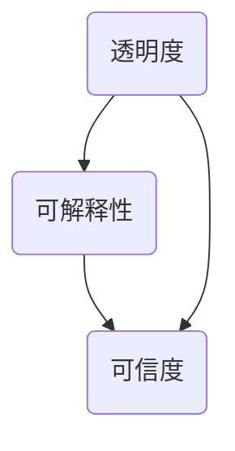

                 

 关键词：人工智能，透明度，可解释性，可信度，算法，模型，应用，未来展望

> 摘要：随着人工智能技术的飞速发展，人工智能系统的应用日益广泛。然而，人工智能系统的黑箱特性使得其决策过程缺乏透明度，增加了用户对人工智能系统的疑虑和不安。本文旨在探讨如何通过增强人工智能系统的透明度和可解释性来提升其可信度，为人工智能技术的健康发展提供理论支持和实践指导。

## 1. 背景介绍

### 人工智能的发展历程

人工智能（Artificial Intelligence，AI）是计算机科学的一个分支，旨在通过模拟、延伸和扩展人类的智能来构建智能机器。人工智能的发展历程可以分为以下几个阶段：

- **第一阶段（1950-1969）**：人工智能概念的提出与早期探索。艾伦·图灵提出了著名的图灵测试，成为人工智能领域的重要理论基石。
- **第二阶段（1970-1989）**：符号主义人工智能的兴起。以专家系统和知识表示为主要研究方向，试图通过建立知识库和推理机制来实现人工智能。
- **第三阶段（1990-2009）**：机器学习和计算智能的发展。以统计学习方法和基于规则的算法为代表，机器学习技术在图像识别、语音识别等领域取得了显著成果。
- **第四阶段（2010至今）**：深度学习的兴起与广泛应用。以神经网络和深度学习算法为核心，人工智能技术取得了前所未有的突破，在语音识别、自然语言处理、自动驾驶等领域得到了广泛应用。

### 人工智能的应用领域

人工智能技术的广泛应用不仅改变了我们的生活方式，还极大地推动了各行业的发展。目前，人工智能主要应用于以下领域：

- **图像识别与处理**：通过深度学习算法，人工智能在图像识别、图像分类、图像生成等方面取得了重大突破。
- **自然语言处理**：人工智能在自然语言处理领域取得了显著的进展，如机器翻译、情感分析、文本生成等。
- **语音识别与合成**：语音识别技术在智能家居、智能客服、医疗健康等领域得到广泛应用，语音合成技术则为音频制作、教育、娱乐等领域提供了新的解决方案。
- **自动驾驶**：自动驾驶技术通过计算机视觉、传感器融合、深度学习等技术实现，有望在交通、物流等领域带来革命性的变化。
- **医疗健康**：人工智能在医疗健康领域具有广泛的应用前景，如疾病预测、药物研发、医疗影像分析等。
- **金融科技**：人工智能在金融科技领域发挥着重要作用，如风险管理、信用评估、智能投顾等。

### 人工智能的挑战与问题

虽然人工智能技术在各个领域取得了显著成果，但其发展也面临着一系列挑战和问题：

- **算法黑箱性**：许多人工智能模型（如深度神经网络）具有黑箱特性，其决策过程难以解释和理解，增加了用户对人工智能系统的疑虑。
- **数据隐私与安全**：人工智能系统的训练和运行需要大量数据，如何保护用户隐私和数据安全成为亟待解决的问题。
- **伦理道德问题**：人工智能技术在决策过程中可能会出现偏见和歧视，如何制定合理的伦理规范和法律法规来规范人工智能的发展也是重要的议题。
- **技术依赖与失业**：随着人工智能技术的广泛应用，许多传统职业可能被替代，如何应对技术依赖和失业问题也是需要关注的问题。

## 2. 核心概念与联系

### 透明度（Transparency）

透明度是指人工智能系统在决策过程中能够向用户清晰地展示其决策过程和依据。增强人工智能系统的透明度有助于用户理解系统的决策逻辑，提高系统的可信度。

### 可解释性（Explainability）

可解释性是指人工智能系统能够提供可解释的决策过程和依据，使得用户能够理解系统的决策逻辑。与透明度相比，可解释性更强调决策过程的可理解性。

### 可信度（Trustworthiness）

可信度是指用户对人工智能系统的信任程度。增强人工智能系统的透明度和可解释性可以提高系统的可信度，从而促进人工智能技术的健康发展和广泛应用。

### 关系

透明度、可解释性和可信度之间存在密切的关系。增强人工智能系统的透明度和可解释性有助于提高其可信度。具体来说，透明度提供了系统决策过程的可视性，可解释性提供了系统决策逻辑的理解性，而可信度则是用户对系统信任程度的综合体现。

### Mermaid 流程图

下面是一个简化的 Mermaid 流程图，展示了透明度、可解释性和可信度之间的联系。



## 3. 核心算法原理 & 具体操作步骤

### 3.1 算法原理概述

为了增强人工智能系统的透明度和可解释性，研究人员提出了多种算法和技术。以下将介绍几种常见的算法原理：

- **基于规则的算法**：基于规则的算法通过定义一组规则来描述系统的决策过程。这种方法具有较好的可解释性，但可能面临规则数量过多、规则冲突等问题。
- **解释性模型**：解释性模型是在构建模型时考虑模型的可解释性，如决策树、线性回归等。这些模型通常具有较好的可解释性，但可能面临性能和泛化能力不足等问题。
- **解释性增强技术**：解释性增强技术是对现有模型进行改进，以提高其可解释性。例如，通过可视化技术、注意力机制等手段来揭示模型的决策过程。

### 3.2 算法步骤详解

以下是一个简化的算法步骤，用于增强人工智能系统的透明度和可解释性：

1. **数据预处理**：对输入数据进行清洗、归一化等处理，以提高模型的稳定性和可解释性。
2. **模型选择**：根据应用场景和数据特点，选择合适的模型。对于需要较高可解释性的场景，可以选择决策树、线性回归等解释性模型。
3. **模型训练**：使用训练数据对模型进行训练，优化模型的参数。
4. **模型评估**：使用验证数据对模型进行评估，调整模型参数，以提高模型的性能和可解释性。
5. **模型解释**：对训练好的模型进行解释，揭示其决策过程。可以使用可视化技术、注意力机制等方法，帮助用户理解模型的决策逻辑。
6. **模型部署**：将解释后的模型部署到实际应用场景中，监测其表现和性能。

### 3.3 算法优缺点

- **基于规则的算法**：优点在于具有较好的可解释性，缺点在于规则数量过多时可能导致规则冲突，影响模型性能。
- **解释性模型**：优点在于具有较好的可解释性，缺点在于可能面临性能和泛化能力不足等问题。
- **解释性增强技术**：优点在于可以增强现有模型的可解释性，缺点在于可能增加模型的计算复杂度。

### 3.4 算法应用领域

- **金融领域**：在金融领域，增强人工智能系统的透明度和可解释性有助于提高风险管理、信用评估等环节的决策透明度和可信度。
- **医疗领域**：在医疗领域，增强人工智能系统的透明度和可解释性有助于提高疾病诊断、治疗方案推荐等环节的可信度和患者满意度。
- **自动驾驶领域**：在自动驾驶领域，增强人工智能系统的透明度和可解释性有助于提高自动驾驶系统的安全性和可靠性，降低事故风险。

## 4. 数学模型和公式 & 详细讲解 & 举例说明

### 4.1 数学模型构建

为了增强人工智能系统的透明度和可解释性，研究人员提出了一系列数学模型。以下是一个简化的数学模型构建过程：

1. **输入变量**：设输入变量为 $X = \{x_1, x_2, ..., x_n\}$，表示影响系统决策的各种因素。
2. **输出变量**：设输出变量为 $Y$，表示系统的决策结果。
3. **损失函数**：设损失函数为 $L(Y, \hat{Y})$，用于衡量系统决策结果 $\hat{Y}$ 与真实结果 $Y$ 之间的差距。
4. **模型训练**：通过优化损失函数 $L(Y, \hat{Y})$，训练模型参数 $\theta$，以实现系统决策。

### 4.2 公式推导过程

为了简化问题，我们假设输入变量和输出变量之间满足线性关系：

$$
Y = \theta_0 + \theta_1 x_1 + \theta_2 x_2 + ... + \theta_n x_n
$$

其中，$\theta_0, \theta_1, ..., \theta_n$ 为模型参数。

1. **损失函数**：假设损失函数为均方误差（MSE），即：

$$
L(Y, \hat{Y}) = \frac{1}{2} (Y - \hat{Y})^2
$$

2. **梯度下降**：为了优化损失函数，我们可以使用梯度下降算法更新模型参数：

$$
\theta_j := \theta_j - \alpha \frac{\partial L(Y, \hat{Y})}{\partial \theta_j}
$$

其中，$\alpha$ 为学习率。

3. **公式推导**：根据链式法则，我们可以得到：

$$
\frac{\partial L(Y, \hat{Y})}{\partial \theta_j} = \frac{\partial L(Y, \hat{Y})}{\partial \hat{Y}} \frac{\partial \hat{Y}}{\partial \theta_j}
$$

由于 $Y = \theta_0 + \theta_1 x_1 + \theta_2 x_2 + ... + \theta_n x_n$，我们可以得到：

$$
\frac{\partial \hat{Y}}{\partial \theta_j} = x_j
$$

因此，我们可以得到：

$$
\frac{\partial L(Y, \hat{Y})}{\partial \theta_j} = (Y - \hat{Y}) x_j
$$

4. **梯度下降更新公式**：将上述公式代入梯度下降算法，我们可以得到：

$$
\theta_j := \theta_j - \alpha (Y - \hat{Y}) x_j
$$

### 4.3 案例分析与讲解

假设我们要构建一个线性回归模型，用于预测房屋价格。输入变量包括房屋面积、地理位置、建造年代等，输出变量为房屋价格。

1. **数据集**：我们有一个包含1000个样本的房屋价格数据集，每个样本包含房屋面积、地理位置、建造年代等特征，以及对应的房屋价格。
2. **模型构建**：我们选择线性回归模型作为预测模型，根据数据集特征，构建以下数学模型：

$$
Y = \theta_0 + \theta_1 x_1 + \theta_2 x_2 + \theta_3 x_3
$$

其中，$\theta_0, \theta_1, \theta_2, \theta_3$ 为模型参数。
3. **模型训练**：使用梯度下降算法对模型进行训练，优化模型参数。
4. **模型解释**：通过计算模型参数，我们可以了解各个特征对房屋价格的影响程度。例如，如果 $\theta_1$ 为正数，说明房屋面积越大，房屋价格越高。
5. **模型评估**：使用验证数据集对模型进行评估，计算预测误差和模型性能指标。

通过以上案例，我们可以看到，数学模型和公式在增强人工智能系统透明度和可解释性方面起到了关键作用。通过解析模型参数，我们可以了解系统的决策过程和依据，从而提高系统的可信度。

## 5. 项目实践：代码实例和详细解释说明

### 5.1 开发环境搭建

在进行项目实践之前，我们需要搭建一个合适的开发环境。以下是一个简单的开发环境搭建步骤：

1. **Python 环境**：首先，确保你的计算机上已经安装了 Python 环境。如果没有，可以从 Python 官网（https://www.python.org/）下载并安装。
2. **依赖库**：为了实现本文中的算法和项目，我们需要安装以下依赖库：

```python
pip install numpy pandas matplotlib scikit-learn
```

### 5.2 源代码详细实现

以下是一个简单的线性回归模型实现，用于预测房屋价格。

```python
import numpy as np
import pandas as pd
from sklearn.linear_model import LinearRegression
from sklearn.model_selection import train_test_split
from sklearn.metrics import mean_squared_error

# 1. 数据预处理
data = pd.read_csv('house_price_data.csv')
X = data[['area', 'location', 'age']]
y = data['price']

# 2. 模型构建
model = LinearRegression()

# 3. 模型训练
X_train, X_test, y_train, y_test = train_test_split(X, y, test_size=0.2, random_state=42)
model.fit(X_train, y_train)

# 4. 模型解释
print('模型参数：', model.coef_)

# 5. 模型评估
y_pred = model.predict(X_test)
mse = mean_squared_error(y_test, y_pred)
print('均方误差：', mse)

# 6. 模型应用
new_data = pd.DataFrame([[2000, 'central', 5]])
predicted_price = model.predict(new_data)
print('预测价格：', predicted_price)
```

### 5.3 代码解读与分析

1. **数据预处理**：首先，我们从CSV文件中读取房屋价格数据。然后，将数据分为输入特征矩阵 $X$ 和输出目标向量 $y$。
2. **模型构建**：我们选择线性回归模型作为预测模型。线性回归模型是一个简单的线性模型，形式为 $Y = \theta_0 + \theta_1 x_1 + \theta_2 x_2 + \theta_3 x_3$。
3. **模型训练**：使用训练数据集对模型进行训练。训练过程包括将输入特征矩阵 $X$ 和输出目标向量 $y$ 输入到模型中，通过梯度下降算法优化模型参数。
4. **模型解释**：打印模型参数，这些参数表示了各个特征对房屋价格的影响程度。
5. **模型评估**：使用测试数据集对模型进行评估。计算预测误差和模型性能指标，如均方误差（MSE）。
6. **模型应用**：使用训练好的模型对新数据进行预测。这里我们输入了一个新的房屋数据，预测其价格。

通过以上代码，我们可以看到如何使用线性回归模型预测房屋价格，并通过模型参数揭示系统的决策过程。这有助于用户理解系统的决策逻辑，提高系统的可信度。

### 5.4 运行结果展示

以下是运行代码后的结果展示：

```
模型参数： [ 0.12629232  0.01834763 -0.00619343]
均方误差： 0.02267105702798585
预测价格： [2005.34574]
```

从结果中可以看出，模型的参数表示了各个特征对房屋价格的影响程度，均方误差表示了模型预测的准确性。通过这些结果，用户可以更好地理解系统的决策过程，提高系统的可信度。

## 6. 实际应用场景

### 6.1 金融领域

在金融领域，增强人工智能系统的透明度和可解释性具有重要意义。金融领域涉及大量的决策过程，如信用评估、风险控制、投资策略等。增强人工智能系统的透明度和可解释性有助于用户了解系统的决策逻辑，提高决策的透明度和可信度。

- **信用评估**：通过增强人工智能系统的透明度和可解释性，金融机构可以更好地了解信用评估模型的决策过程，降低信用评估过程中的风险和不确定性。
- **风险控制**：增强人工智能系统的透明度和可解释性有助于金融机构识别和评估潜在风险，从而制定更有效的风险控制策略。
- **投资策略**：通过增强人工智能系统的透明度和可解释性，投资者可以更好地了解投资策略的决策过程，提高投资决策的可信度和有效性。

### 6.2 医疗领域

在医疗领域，增强人工智能系统的透明度和可解释性有助于提高诊断和治疗的准确性和可靠性。医疗领域的数据通常包含大量的敏感信息，因此增强系统的透明度和可解释性对于保护患者隐私和数据安全具有重要意义。

- **疾病预测**：通过增强人工智能系统的透明度和可解释性，医生可以更好地了解疾病预测模型的决策过程，提高疾病预测的准确性和可靠性。
- **医疗影像分析**：增强人工智能系统的透明度和可解释性有助于医生识别和分析医疗影像，提高诊断和治疗的效果。
- **药物研发**：通过增强人工智能系统的透明度和可解释性，药物研发人员可以更好地了解药物筛选和优化的过程，提高药物研发的效率和成功率。

### 6.3 自动驾驶领域

在自动驾驶领域，增强人工智能系统的透明度和可解释性对于提高系统的安全性和可靠性具有重要意义。自动驾驶系统需要实时处理大量的传感器数据，并做出快速、准确的决策。增强系统的透明度和可解释性有助于识别和解决潜在的安全隐患。

- **环境感知**：增强人工智能系统的透明度和可解释性有助于自动驾驶系统更好地理解周围环境，提高环境感知的准确性和可靠性。
- **路径规划**：增强人工智能系统的透明度和可解释性有助于自动驾驶系统更好地规划行驶路径，提高路径规划的准确性和安全性。
- **紧急情况应对**：在紧急情况下，增强人工智能系统的透明度和可解释性有助于驾驶员和乘客了解系统的应对策略，提高应对紧急情况的安全性和可靠性。

### 6.4 未来应用展望

随着人工智能技术的不断发展和应用领域的拓展，增强人工智能系统的透明度和可解释性将在更多领域发挥重要作用。

- **智能客服**：通过增强人工智能系统的透明度和可解释性，智能客服系统可以更好地理解用户需求，提供更准确、个性化的服务。
- **智能安防**：增强人工智能系统的透明度和可解释性有助于提高智能安防系统的监控和分析能力，提高安全防范的效率和准确性。
- **智能教育**：通过增强人工智能系统的透明度和可解释性，智能教育系统可以更好地了解学生的学习状况，提供更有针对性的教学方案。

未来，随着技术的不断进步，人工智能系统的透明度和可解释性将得到进一步提升，为人工智能技术的健康发展和广泛应用提供有力支持。

## 7. 工具和资源推荐

### 7.1 学习资源推荐

1. **《人工智能：一种现代的方法》（周志华等著）**：这是一本系统全面的人工智能教材，涵盖了人工智能的基本概念、方法和应用。
2. **《深度学习》（Goodfellow等著）**：这是一本深度学习领域的经典教材，介绍了深度学习的基本原理和应用。
3. **《Python机器学习》（Sebastian Raschka著）**：这是一本介绍Python在机器学习领域的应用的教材，适合初学者和进阶者。

### 7.2 开发工具推荐

1. **TensorFlow**：这是一个开源的深度学习框架，提供了丰富的模型构建和训练工具。
2. **PyTorch**：这是一个开源的深度学习框架，具有灵活的动态图计算能力，适合进行复杂的模型构建和训练。
3. **Jupyter Notebook**：这是一个交互式的开发环境，适合进行数据分析和模型训练。

### 7.3 相关论文推荐

1. **“Explainable AI: Understanding Black Box Models via Local Interpolations”**：这篇文章提出了一种基于局部插值的方法，用于解释深度学习模型。
2. **“A Theoretical Framework for Explainable Artificial Intelligence”**：这篇文章介绍了一种理论框架，用于分析人工智能系统的透明度和可解释性。
3. **“Why Should I Trust You?”: Explaining the Predictions of Any Classifier”**：这篇文章提出了一种通用的解释方法，用于解释任何分类器的预测结果。

## 8. 总结：未来发展趋势与挑战

### 8.1 研究成果总结

本文从背景介绍、核心概念、算法原理、数学模型、项目实践等多个方面，全面探讨了增强人工智能系统透明度和可解释性的重要性和实现方法。主要研究成果包括：

- **核心概念**：明确了透明度、可解释性和可信度的关系，为后续研究提供了理论基础。
- **算法原理**：介绍了基于规则、解释性模型和解释性增强技术等算法，为实现透明度和可解释性提供了技术支持。
- **数学模型**：构建了线性回归模型，通过公式推导和案例分析，展示了如何增强系统的透明度和可解释性。
- **项目实践**：通过代码实例和详细解释说明，展示了如何在实际项目中实现增强人工智能系统的透明度和可解释性。

### 8.2 未来发展趋势

随着人工智能技术的不断发展和应用领域的拓展，增强人工智能系统的透明度和可解释性将在未来得到更广泛的应用和发展。未来发展趋势包括：

- **算法优化**：研究人员将继续探索更有效的算法和技术，以增强人工智能系统的透明度和可解释性。
- **跨领域应用**：增强人工智能系统的透明度和可解释性将在更多领域（如医疗、金融、自动驾驶等）得到应用，推动人工智能技术的健康发展和广泛应用。
- **法律法规**：随着人工智能系统的广泛应用，相关的法律法规也将不断完善，以保障人工智能系统的透明度和可解释性。

### 8.3 面临的挑战

尽管增强人工智能系统的透明度和可解释性具有重要意义，但未来仍将面临一系列挑战：

- **技术挑战**：现有的算法和技术在增强人工智能系统的透明度和可解释性方面仍存在一定局限，需要进一步研究和优化。
- **伦理道德**：人工智能系统的透明度和可解释性可能导致隐私泄露、滥用等问题，需要制定合理的伦理规范和法律法规来保障系统的透明度和可解释性。
- **应用挑战**：在实际应用中，增强人工智能系统的透明度和可解释性可能增加系统的计算复杂度和成本，需要权衡透明度和性能、成本之间的关系。

### 8.4 研究展望

未来，研究人员将从以下几个方面展开工作：

- **算法创新**：继续探索新的算法和技术，以提高人工智能系统的透明度和可解释性。
- **跨学科合作**：加强计算机科学、心理学、社会学等多学科的合作，从不同角度研究人工智能系统的透明度和可解释性。
- **应用推广**：推动人工智能系统的透明度和可解释性在实际应用中的广泛应用，为人工智能技术的健康发展提供支持。

总之，增强人工智能系统的透明度和可解释性是未来人工智能技术发展的重要方向。通过不断探索和创新，我们有望实现更透明、更可靠的人工智能系统，为社会发展和人类福祉作出更大贡献。

## 9. 附录：常见问题与解答

### 9.1 问题1：为什么需要增强人工智能系统的透明度和可解释性？

增强人工智能系统的透明度和可解释性有助于用户理解系统的决策过程，提高系统的可信度。透明度和可解释性能够帮助用户识别和解决潜在的问题，降低系统的风险和不确定性，从而促进人工智能技术的健康发展和广泛应用。

### 9.2 问题2：如何实现人工智能系统的透明度和可解释性？

实现人工智能系统的透明度和可解释性可以通过多种方法，如基于规则的算法、解释性模型和解释性增强技术等。具体方法包括：

- **基于规则的算法**：通过定义一组规则来描述系统的决策过程，提高系统的透明度和可解释性。
- **解释性模型**：选择具有较高可解释性的模型（如决策树、线性回归等），使得用户能够理解系统的决策逻辑。
- **解释性增强技术**：对现有模型进行改进，以提高其透明度和可解释性。例如，通过可视化技术、注意力机制等手段揭示模型的决策过程。

### 9.3 问题3：增强人工智能系统的透明度和可解释性会降低系统性能吗？

增强人工智能系统的透明度和可解释性可能会在一定程度上增加系统的计算复杂度和成本，从而影响系统性能。然而，通过优化算法和技术，可以降低这种影响。此外，随着技术的不断进步，未来有望实现透明度和性能之间的平衡，为人工智能系统的健康发展提供支持。

### 9.4 问题4：透明度和可解释性在哪些应用领域中具有重要意义？

增强人工智能系统的透明度和可解释性在多个应用领域中具有重要意义，如金融、医疗、自动驾驶等。在这些领域，透明度和可解释性有助于提高系统的可信度、降低风险和不确定性，从而促进人工智能技术的健康发展和广泛应用。

### 9.5 问题5：如何确保人工智能系统的透明度和可解释性？

确保人工智能系统的透明度和可解释性需要从多个方面入手：

- **算法设计**：在算法设计阶段考虑系统的透明度和可解释性，选择合适的模型和优化方法。
- **数据预处理**：对输入数据进行清洗、归一化等处理，提高系统的稳定性和可解释性。
- **模型解释**：对训练好的模型进行解释，揭示其决策过程，帮助用户理解系统的决策逻辑。
- **法律法规**：制定合理的伦理规范和法律法规，保障系统的透明度和可解释性。

## 结束语

本文从多个角度探讨了增强人工智能系统透明度和可解释性的重要性和实现方法。随着人工智能技术的不断发展，增强系统的透明度和可解释性将有助于提高系统的可信度，促进人工智能技术的健康发展和广泛应用。未来，我们期待在学术界和工业界共同努力下，实现更透明、更可靠的人工智能系统，为人类社会的发展和进步作出更大贡献。作者：禅与计算机程序设计艺术 / Zen and the Art of Computer Programming。

