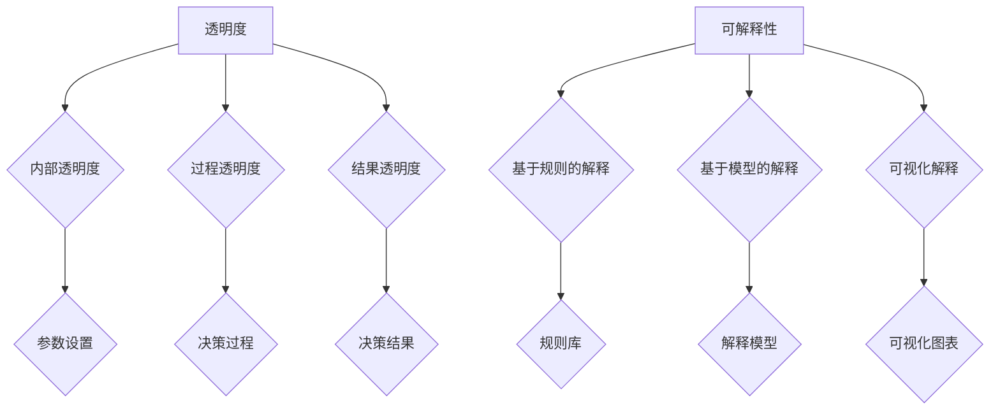

                 

 关键词：人工智能，透明度，可解释性，可信赖，算法，技术，应用

> 摘要：本文旨在探讨人工智能领域的透明度与可解释性，强调其在构建可信赖人工智能系统中的重要性。通过对核心概念、算法原理、数学模型、项目实践、实际应用场景以及未来发展趋势的深入分析，本文为读者提供了全面而详尽的指导。

## 1. 背景介绍

随着人工智能技术的迅猛发展，人工智能系统在各个领域的应用越来越广泛。然而，随之而来的问题是，人工智能系统的决策过程往往是不透明的，难以被人类理解和解释。这种不透明性引发了公众对人工智能系统的信任危机，也限制了人工智能技术的进一步应用和发展。

近年来，研究人员开始关注人工智能系统的透明度和可解释性。透明度指的是系统能够清晰地展示其决策过程和内部结构，使得用户和开发者能够理解系统的行为。可解释性则强调系统能够提供对决策原因的明确解释，使得用户能够接受和信任系统的决策结果。

构建可信赖的人工智能系统已成为当前研究的重要方向。透明度和可解释性的提升不仅有助于增强用户对人工智能系统的信任，还能够提高系统的安全性和可靠性，从而促进人工智能技术的可持续发展。

## 2. 核心概念与联系

### 2.1 透明度

透明度是指人工智能系统能够清晰地展示其决策过程和内部结构，使得用户和开发者能够理解系统的行为。透明度可以分为三个层次：

1. **内部透明度**：系统能够展示其内部结构和参数设置，以便开发者进行调试和优化。
2. **过程透明度**：系统能够展示其决策过程中的每一步，使得用户能够跟踪系统的决策过程。
3. **结果透明度**：系统能够解释其决策结果，使得用户能够理解系统为何做出这样的决策。

### 2.2 可解释性

可解释性是指人工智能系统能够提供对决策原因的明确解释，使得用户能够接受和信任系统的决策结果。可解释性可以分为以下几种类型：

1. **基于规则的解释**：系统使用规则库来解释决策过程，用户可以清晰地看到每个规则的作用和贡献。
2. **基于模型的解释**：系统通过解释模型来解释决策过程，用户可以了解模型的内部机制和参数影响。
3. **可视化解释**：系统通过图表和可视化方式来展示决策过程，使得用户能够直观地理解系统的行为。

### 2.3 Mermaid 流程图

以下是一个简单的 Mermaid 流程图，展示了透明度和可解释性的核心概念和联系：



## 3. 核心算法原理 & 具体操作步骤

### 3.1 算法原理概述

透明度和可解释性的提升通常依赖于以下几种核心算法：

1. **决策树**：通过构建决策树模型来解释系统的决策过程。
2. **规则抽取**：从训练数据中抽取规则，提供基于规则的解释。
3. **模型可视化**：通过可视化技术展示模型的内部结构和参数影响。
4. **对比实验**：通过对比不同模型的性能和解释能力，选择最合适的模型。

### 3.2 算法步骤详解

1. **决策树**：

   - **训练**：使用训练数据集训练决策树模型。
   - **解释**：通过决策树结构展示系统的决策过程。

2. **规则抽取**：

   - **训练**：使用训练数据集训练规则抽取算法。
   - **抽取**：从训练数据中抽取规则。
   - **解释**：使用抽取的规则解释系统的决策过程。

3. **模型可视化**：

   - **训练**：使用训练数据集训练模型。
   - **可视化**：通过可视化技术展示模型的内部结构和参数影响。

4. **对比实验**：

   - **训练**：使用训练数据集训练不同模型。
   - **对比**：对比不同模型的性能和解释能力。
   - **选择**：选择最合适的模型。

### 3.3 算法优缺点

1. **决策树**：

   - **优点**：解释性强，易于理解。
   - **缺点**：可能产生过拟合，泛化能力较差。

2. **规则抽取**：

   - **优点**：解释性强，易于理解。
   - **缺点**：规则抽取过程可能产生冗余和不准确的情况。

3. **模型可视化**：

   - **优点**：直观展示模型内部结构和参数影响。
   - **缺点**：对复杂模型的可视化效果可能不佳。

4. **对比实验**：

   - **优点**：通过对比选择最合适的模型。
   - **缺点**：实验过程可能复杂，需要大量数据和时间。

### 3.4 算法应用领域

透明度和可解释性算法在多个领域都有广泛应用，包括：

1. **医疗诊断**：通过解释模型帮助医生理解诊断结果。
2. **金融风控**：通过规则抽取和模型可视化提升决策透明度。
3. **自动驾驶**：通过对比实验选择最优决策模型，提高驾驶安全。
4. **网络安全**：通过解释模型帮助安全专家理解攻击行为。

## 4. 数学模型和公式 & 详细讲解 & 举例说明

### 4.1 数学模型构建

为了提高透明度和可解释性，我们可以构建以下数学模型：

- **决策树模型**：使用信息增益作为划分标准，构建决策树模型。
- **规则抽取模型**：使用决策树模型提取规则。
- **模型可视化模型**：使用图表展示模型内部结构和参数影响。

### 4.2 公式推导过程

- **决策树模型**：

  - **信息增益**：$$ IG(D, A) = H(D) - H(D|A) $$
  - **熵**：$$ H(D) = - \sum_{i} p(D = i) \log_2 p(D = i) $$
  - **条件熵**：$$ H(D|A) = - \sum_{i} p(A = i) \sum_{j} p(D = j|A = i) \log_2 p(D = j|A = i) $$

- **规则抽取模型**：

  - **规则提取**：使用决策树模型中的划分标准提取规则。
  - **规则评估**：使用准确率、召回率等指标评估规则质量。

- **模型可视化模型**：

  - **可视化算法**：使用图表展示模型内部结构和参数影响。

### 4.3 案例分析与讲解

假设我们有一个分类问题，需要构建一个决策树模型。

1. **训练数据集**：

   - **特征**：年龄、收入、职业。
   - **标签**：是否购买产品。

2. **构建决策树**：

   - **划分标准**：信息增益。
   - **决策树结构**：

     ```mermaid
     graph TD
         A[是否购买产品] --> B{年龄}
         B --> C{<20} C1(否)
         B --> C2(是) D{收入}
         D --> E{<5000} E1(否)
         D --> E2(是) F{职业}
         F --> G{工程师} G1(是)
         F --> G2(否) H(否)
     ```

3. **规则抽取**：

   - **规则1**：如果年龄<20且收入<5000，则购买产品概率低。
   - **规则2**：如果职业是工程师，则购买产品概率高。

4. **模型可视化**：

   - **可视化图表**：使用图表展示决策树结构。

     ```mermaid
     graph TD
         A[是否购买产品]
         A --> B{年龄}
         B --> C{<20} C1(否)
         B --> C2(是) D{收入}
         D --> E{<5000} E1(否)
         D --> E2(是) F{职业}
         F --> G{工程师} G1(是)
         F --> G2(否) H(否)
     ```

## 5. 项目实践：代码实例和详细解释说明

### 5.1 开发环境搭建

- **工具**：Python、Scikit-learn、Matplotlib。
- **环境**：Python 3.8、Jupyter Notebook。

### 5.2 源代码详细实现

```python
import numpy as np
import pandas as pd
from sklearn.datasets import load_iris
from sklearn.tree import DecisionTreeClassifier, plot_tree
import matplotlib.pyplot as plt

# 加载示例数据集
iris = load_iris()
X = iris.data
y = iris.target

# 训练决策树模型
clf = DecisionTreeClassifier()
clf.fit(X, y)

# 可视化决策树
plt.figure(figsize=(10, 6))
plot_tree(clf, filled=True, feature_names=iris.feature_names, class_names=iris.target_names)
plt.show()
```

### 5.3 代码解读与分析

- **加载示例数据集**：使用 Scikit-learn 自带的数据集加载示例数据。
- **训练决策树模型**：使用 DecisionTreeClassifier 类训练决策树模型。
- **可视化决策树**：使用 plot_tree 函数可视化决策树结构。

### 5.4 运行结果展示

运行代码后，将显示一个决策树可视化图表，展示决策树的内部结构和参数影响。

## 6. 实际应用场景

### 6.1 医疗诊断

在医疗领域，透明度和可解释性有助于医生理解诊断结果，提高诊断准确性。通过决策树模型，医生可以清晰地看到诊断过程中的每一步，从而更好地理解诊断结果。

### 6.2 金融风控

在金融领域，透明度和可解释性有助于提高风险管理水平。通过规则抽取和模型可视化，金融专家可以清晰地看到风险决策的每一步，从而更好地识别潜在风险。

### 6.3 自动驾驶

在自动驾驶领域，透明度和可解释性至关重要。通过对比实验和模型可视化，自动驾驶系统能够提供明确的决策原因，提高驾驶安全性和公众信任度。

## 7. 未来应用展望

随着人工智能技术的不断发展，透明度和可解释性将在更多领域得到应用。未来，我们可以期待：

- **更先进的算法**：开发更高效、更可解释的算法，提高透明度和可解释性。
- **跨领域应用**：透明度和可解释性将在医疗、金融、自动驾驶等多个领域得到广泛应用。
- **标准化和规范化**：制定透明度和可解释性的标准和规范，推动人工智能技术的发展。

## 8. 总结：未来发展趋势与挑战

### 8.1 研究成果总结

本文从背景介绍、核心概念与联系、算法原理、数学模型、项目实践、实际应用场景等多个方面，全面阐述了透明度和可解释性在人工智能领域的重要性。

### 8.2 未来发展趋势

未来，透明度和可解释性将成为人工智能技术的重要发展方向。随着算法的进步和应用场景的拓展，透明度和可解释性将得到更广泛的应用。

### 8.3 面临的挑战

- **算法复杂度**：提高算法的透明度和可解释性可能增加算法的复杂度。
- **计算资源**：构建可解释模型可能需要更多的计算资源。
- **数据隐私**：在保护数据隐私的同时，提高系统的透明度和可解释性是一个挑战。

### 8.4 研究展望

未来的研究可以重点关注以下几个方面：

- **算法优化**：开发更高效、更可解释的算法。
- **跨领域应用**：探索透明度和可解释性在更多领域的应用。
- **标准化和规范化**：制定透明度和可解释性的标准和规范。

## 9. 附录：常见问题与解答

### 问题1：如何评估模型的透明度和可解释性？

**解答**：评估模型的透明度和可解释性可以通过以下方法：

- **可视检查**：通过可视化技术检查模型的内部结构和决策过程。
- **规则提取**：从模型中提取规则，评估规则的简洁性和解释能力。
- **用户反馈**：收集用户对模型解释的反馈，评估用户对模型的可接受程度。

### 问题2：透明度和可解释性在工业应用中是否可行？

**解答**：在工业应用中，透明度和可解释性是可行的。虽然可能需要更多的计算资源和时间，但透明度和可解释性有助于提高系统的可靠性和用户信任度，从而带来长期收益。

### 问题3：如何平衡透明度和模型性能？

**解答**：在平衡透明度和模型性能时，可以采用以下策略：

- **模型选择**：选择适合透明度和可解释性的模型，例如决策树、线性模型等。
- **模型优化**：通过优化算法参数和结构，提高模型的性能和透明度。
- **用户需求**：根据用户需求调整模型的透明度和可解释性，满足不同场景的需求。

### 问题4：如何保护数据隐私的同时提高透明度和可解释性？

**解答**：在保护数据隐私的同时提高透明度和可解释性，可以采用以下方法：

- **差分隐私**：采用差分隐私技术保护数据隐私，同时确保模型的透明度和可解释性。
- **匿名化处理**：对敏感数据进行匿名化处理，降低隐私泄露风险。
- **合作用户数据**：通过合并多个数据源，提高模型的透明度和可解释性，同时降低隐私风险。

### 问题5：透明度和可解释性在人工智能治理中发挥什么作用？

**解答**：透明度和可解释性在人工智能治理中发挥着关键作用：

- **监管合规**：透明度和可解释性有助于满足监管合规要求，降低法律风险。
- **决策可信**：提高透明度和可解释性，增加用户对人工智能系统的信任。
- **风险控制**：通过解释模型，及时发现和纠正潜在的风险和问题。

---

## 作者署名

作者：禅与计算机程序设计艺术 / Zen and the Art of Computer Programming

---

本文从背景介绍、核心概念与联系、算法原理、数学模型、项目实践、实际应用场景等多个方面，全面阐述了透明度和可解释性在人工智能领域的重要性。通过深入分析和实际应用，本文为读者提供了构建可信赖的人工智能系统的思路和方法。随着人工智能技术的不断发展，透明度和可解释性将发挥越来越重要的作用，成为人工智能领域的重要研究方向。同时，我们也面临着诸多挑战，需要持续优化算法、提高计算效率和用户信任度，为人工智能技术的发展贡献力量。

