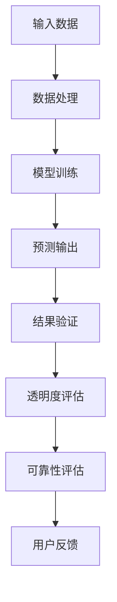

                 

 关键词：人工智能、AI系统、透明度、可靠性、算法、数学模型、实践应用、工具推荐

> 摘要：本文将探讨AI系统的透明度和可靠性，这两个关键因素决定了AI系统能否被广泛接受和有效应用。通过深入分析核心概念、算法原理、数学模型和实际应用场景，本文旨在提供对AI系统透明度和可靠性进行全面了解的途径，并探讨其未来发展趋势和面临的挑战。

## 1. 背景介绍

随着人工智能（AI）技术的迅速发展，AI系统在各个领域得到了广泛应用，从自动驾驶、金融风险评估到医疗诊断、自然语言处理等。然而，尽管AI系统展现了强大的能力，其透明度和可靠性问题仍然成为广泛关注的焦点。透明度指的是AI系统的工作机制和决策过程是否容易被理解和解释，而可靠性则指的是AI系统能否在各种复杂环境中稳定地执行预定的任务。

AI系统的透明度和可靠性对用户和社会具有重要意义。一方面，高透明度的AI系统能够增强用户对AI技术的信任，使其更愿意接受和采用AI产品。另一方面，高可靠性的AI系统可以降低错误决策的风险，提高系统的安全性。然而，目前的AI系统在实际应用中常常面临透明度和可靠性不足的问题，这给用户带来了困扰，也限制了AI技术的进一步发展。

本文旨在通过分析AI系统的核心概念、算法原理、数学模型和实际应用场景，探讨如何提升AI系统的透明度和可靠性，为AI技术的可持续发展提供参考。

## 2. 核心概念与联系

### 2.1 透明度

透明度是指AI系统的决策过程和工作机制是否易于理解。一个高透明度的AI系统应该能够清晰地展示其输入、中间过程和最终输出，以便用户和其他研究人员能够理解和验证系统的性能。透明度对AI系统的接受度和信任度有重要影响。当用户能够理解AI系统的决策过程时，他们更有可能信任系统，并愿意使用AI产品。此外，透明度还有助于发现和修复系统中的潜在错误。

### 2.2 可靠性

可靠性是指AI系统在各种条件下稳定执行预定任务的能力。高可靠性的AI系统应能够在不同的数据集、环境和场景中保持一致的性能，不会出现意外的错误或异常行为。可靠性对AI系统的实际应用至关重要，因为任何错误或异常都可能导致严重的后果。例如，在自动驾驶领域，AI系统的一个错误决策可能导致交通事故。

### 2.3 核心概念联系

透明度和可靠性之间存在密切的联系。一个高透明度的AI系统通常更容易被验证和评估，从而提高其可靠性。同时，一个高可靠性的AI系统也更容易被用户接受，因为用户能够看到系统的稳定性和一致性。然而，实现高透明度和可靠性并非易事，这需要我们在算法设计、模型训练和数据处理等方面进行深入研究和优化。

## 2.4 核心概念原理和架构的 Mermaid 流程图

下面是一个简化的Mermaid流程图，展示了AI系统透明度和可靠性的核心概念和架构：



### 2.5 各节点解释

- **输入数据（A）**：AI系统接收的数据，可以是结构化或非结构化的。
- **数据处理（B）**：对输入数据进行预处理和特征提取，以便模型训练。
- **模型训练（C）**：使用训练数据训练模型，以预测输出结果。
- **预测输出（D）**：模型对输入数据进行预测，生成输出结果。
- **结果验证（E）**：验证预测结果的准确性和可靠性。
- **透明度评估（F）**：评估系统的决策过程和工作机制是否易于理解。
- **可靠性评估（G）**：评估系统在各种条件下的稳定性和一致性。
- **用户反馈（H）**：用户对系统的反馈，用于改进系统的透明度和可靠性。

## 3. 核心算法原理 & 具体操作步骤

### 3.1 算法原理概述

为了提升AI系统的透明度和可靠性，我们可以采用几种核心算法和技术。本文将介绍以下三种核心算法：

1. **可解释性模型**：如LIME（Local Interpretable Model-agnostic Explanations）和SHAP（SHapley Additive exPlanations）。
2. **鲁棒性训练**：如对抗训练和联邦学习。
3. **模型评估与验证**：如交叉验证和A/B测试。

### 3.2 算法步骤详解

#### 3.2.1 可解释性模型

**LIME算法步骤：**

1. **选择局部模型**：选择一个全局模型（如线性回归、神经网络等）。
2. **构建扰动数据**：对输入数据进行扰动，生成多个扰动样本。
3. **训练局部模型**：使用扰动样本训练一个局部模型，如线性回归。
4. **计算影响力**：计算每个特征对预测结果的影响力。

**SHAP算法步骤：**

1. **计算基尼系数**：计算每个特征在所有数据点上的基尼系数。
2. **分配解释值**：根据基尼系数分配每个特征的解释值。
3. **计算预测差值**：计算去除每个特征后预测结果的差值。
4. **归一化解释值**：将解释值归一化，以便比较不同特征的贡献。

#### 3.2.2 鲁棒性训练

**对抗训练步骤：**

1. **生成对抗样本**：使用对抗生成网络（如GAN）生成对抗样本。
2. **训练模型**：在原始数据和对抗样本上同时训练模型。
3. **评估模型**：评估模型在对抗样本上的性能。

**联邦学习步骤：**

1. **数据分布**：各节点拥有本地数据，但数据不共享。
2. **模型更新**：各节点本地训练模型，并上传模型更新。
3. **全局模型更新**：使用全局优化器更新全局模型。
4. **评估模型**：评估全局模型在测试集上的性能。

#### 3.2.3 模型评估与验证

**交叉验证步骤：**

1. **划分训练集和验证集**：将数据集划分为训练集和验证集。
2. **多次训练与验证**：使用训练集训练模型，并在验证集上多次评估模型性能。
3. **计算平均性能**：计算多次验证的平均性能。

**A/B测试步骤：**

1. **选择测试变量**：选择一个或多个测试变量。
2. **划分用户群体**：将用户划分为两组，一组使用原系统，另一组使用测试系统。
3. **收集数据**：收集两组用户的行为数据。
4. **评估差异**：评估两组用户在测试变量上的差异。

### 3.3 算法优缺点

**可解释性模型：**

- **优点**：增强系统的可解释性，提高用户信任度。
- **缺点**：计算成本高，可能影响模型性能。

**鲁棒性训练：**

- **优点**：提高模型在对抗样本上的性能，增强系统的可靠性。
- **缺点**：对抗样本生成可能影响模型训练效率。

**模型评估与验证：**

- **优点**：提高模型性能的可信度，减少模型过拟合。
- **缺点**：需要大量数据和时间进行测试。

### 3.4 算法应用领域

- **可解释性模型**：在医疗诊断、金融风险评估等需要高透明度的领域有广泛应用。
- **鲁棒性训练**：在自动驾驶、网络安全等领域有重要应用。
- **模型评估与验证**：在各个AI应用领域都有必要进行模型性能评估和验证。

## 4. 数学模型和公式 & 详细讲解 & 举例说明

### 4.1 数学模型构建

为了提升AI系统的透明度和可靠性，我们引入了几种数学模型，包括可解释性模型、鲁棒性训练模型和模型评估与验证模型。以下是这些模型的构建方法。

#### 4.1.1 可解释性模型

LIME和SHAP模型是基于局部线性模型的，其核心思想是将复杂的全局模型拆解为多个简单的局部模型，从而解释每个局部模型的决策过程。

**LIME模型：**

- **公式：** 
  $$\text{预测值} = w_0 + \sum_{i=1}^{n} w_i \cdot x_i$$

  其中，$w_0$是偏置项，$w_i$是第$i$个特征的权重，$x_i$是第$i$个特征的取值。

**SHAP模型：**

- **公式：**
  $$\text{预测值} = \sum_{i=1}^{n} e^{(a_i + \sum_{j=1}^{m} w_{ij} \cdot x_{ij})}$$

  其中，$a_i$是基尼系数，$w_{ij}$是第$i$个特征在第$j$个数据点上的权重，$x_{ij}$是第$i$个特征在第$j$个数据点上的取值。

#### 4.1.2 鲁棒性训练模型

对抗训练模型是通过生成对抗网络（GAN）实现的，其目的是生成对抗样本，提高模型对对抗样本的鲁棒性。

**对抗训练模型：**

- **公式：**
  $$\text{对抗损失} = \mathcal{L}(\text{生成器}, \text{判别器})$$

  其中，$\mathcal{L}$是损失函数，通常使用交叉熵损失。

#### 4.1.3 模型评估与验证模型

交叉验证和A/B测试是两种常见的模型评估与验证方法，旨在评估模型的性能和可靠性。

**交叉验证模型：**

- **公式：**
  $$\text{交叉验证误差} = \frac{1}{k} \sum_{i=1}^{k} \mathcal{L}(\text{模型}, \text{验证集}_i)$$

  其中，$\mathcal{L}$是损失函数，$k$是验证次数。

**A/B测试模型：**

- **公式：**
  $$\text{差异评估} = \text{模型A性能} - \text{模型B性能}$$

  其中，模型A和模型B是两个不同的模型，性能可以通过多种指标进行评估。

### 4.2 公式推导过程

以下是几种核心公式的推导过程。

#### 4.2.1 LIME模型

LIME模型的核心思想是将全局模型的预测过程拆解为多个局部线性模型的组合。为了推导LIME模型，我们首先需要理解线性回归模型的基本原理。

假设有一个全局线性回归模型：

$$\text{预测值} = w_0 + \sum_{i=1}^{n} w_i \cdot x_i$$

其中，$w_0$是偏置项，$w_i$是第$i$个特征的权重，$x_i$是第$i$个特征的取值。

现在，我们考虑一个局部线性模型，其目标是解释全局模型在特定输入$x$上的决策过程。为了实现这一目标，我们需要对输入$x$进行扰动，生成多个扰动样本$x'$。

对于每个扰动样本$x'$，我们可以得到一个对应的局部预测值$\hat{y}'$。我们可以使用以下公式计算局部预测值：

$$\hat{y}' = w_0 + \sum_{i=1}^{n} w_i \cdot x_i'$$

为了计算每个特征对预测结果的影响力，我们需要计算扰动前后预测值的差值：

$$\Delta y = y - \hat{y}' = \sum_{i=1}^{n} (w_i \cdot (x_i - x_i'))$$

这样，我们就可以得到每个特征对预测结果的影响力：

$$\text{影响力} = \frac{\Delta y}{|x - x'|}$$

#### 4.2.2 SHAP模型

SHAP模型基于博弈论中的Shapley值，旨在为每个特征在模型决策中的贡献提供解释。为了推导SHAP模型，我们首先需要理解博弈论中的Shapley值。

Shapley值是一种衡量一个特征在模型决策中贡献的指标，其计算方法如下：

$$\phi_i = \sum_{S \subseteq N, i \in S} \frac{|S|! \cdot (|N| - |S| - 1)!}{|N|!} \cdot f(x_S) - f(x_{S \setminus \{i\}})$$

其中，$N$是特征集合，$S$是特征子集，$f(x_S)$是模型在特征子集$S$上的预测值，$x_S$是特征子集$S$的取值。

为了将SHAP值应用到线性回归模型，我们首先需要计算每个特征的基尼系数。基尼系数是特征对模型预测值的影响程度的度量，其计算方法如下：

$$\gamma_i = \sum_{j=1}^{n} \frac{(-1)^{j+1}}{j} \cdot (x_{ij} - \bar{x}_i)$$

其中，$x_{ij}$是特征$i$在第$j$个数据点上的取值，$\bar{x}_i$是特征$i$的均值。

接下来，我们可以计算每个特征的SHAP值：

$$\phi_i = \sum_{S \subseteq N, i \in S} \frac{|S|! \cdot (|N| - |S| - 1)!}{|N|!} \cdot \gamma_i$$

最后，我们将SHAP值归一化，以便比较不同特征的贡献：

$$\text{SHAP值} = \frac{\phi_i}{\sum_{j=1}^{n} \phi_j}$$

#### 4.2.3 对抗训练模型

对抗训练模型的核心在于生成对抗样本，并使用对抗样本训练模型。为了推导对抗训练模型，我们首先需要理解生成对抗网络（GAN）的基本原理。

生成对抗网络由两个神经网络组成：生成器$G$和判别器$D$。生成器$G$的目的是生成类似于真实数据的样本，而判别器$D$的目的是区分真实数据和生成数据。

对抗训练的目标是最小化生成器和判别器之间的损失函数。对于生成器$G$，我们使用以下损失函数：

$$\mathcal{L}_G = -\log(D(G(z)))$$

其中，$z$是生成器的输入噪声，$D(G(z))$是判别器对生成数据的判断概率。

对于判别器$D$，我们使用以下损失函数：

$$\mathcal{L}_D = -\log(D(x)) - \log(1 - D(G(z)))$$

其中，$x$是真实数据。

对抗训练的步骤如下：

1. 初始化生成器$G$和判别器$D$的权重。
2. 使用真实数据和生成器$G$生成的样本训练判别器$D$。
3. 使用判别器$D$的输出反馈训练生成器$G$。
4. 重复步骤2和步骤3，直到生成器$G$生成的样本能够很好地欺骗判别器$D$。

#### 4.2.4 交叉验证模型

交叉验证是一种常用的模型评估方法，其核心思想是将数据集划分为多个子集，并在每个子集上训练和验证模型。交叉验证的目的是评估模型在未见数据上的性能，从而判断模型的泛化能力。

交叉验证的基本步骤如下：

1. 将数据集划分为$k$个子集，每个子集包含相同数量的样本。
2. 对于每个子集，将其作为验证集，其他$k-1$个子集作为训练集。
3. 在训练集上训练模型，并在验证集上评估模型性能。
4. 计算所有$k$次验证的平均性能。

交叉验证的误差可以表示为：

$$\text{交叉验证误差} = \frac{1}{k} \sum_{i=1}^{k} \mathcal{L}(\text{模型}, \text{验证集}_i)$$

其中，$\mathcal{L}$是损失函数。

#### 4.2.5 A/B测试模型

A/B测试是一种用于评估模型性能的实验方法，其核心思想是将用户随机分配到两个或多个组，并在每个组上评估模型的性能。A/B测试的目的是比较不同模型的性能，从而选择最优模型。

A/B测试的基本步骤如下：

1. 选择一个或多个测试变量，如模型版本、特征组合等。
2. 将用户随机分配到多个组，每个组对应一个测试变量。
3. 收集各组用户的行为数据。
4. 计算各组用户在测试变量上的性能差异。

A/B测试的性能差异可以表示为：

$$\text{差异评估} = \text{模型A性能} - \text{模型B性能}$$

其中，模型A和模型B是两个不同的模型，性能可以通过多种指标进行评估。

### 4.3 案例分析与讲解

为了更好地理解上述数学模型和公式，我们通过以下案例进行详细分析和讲解。

#### 4.3.1 LIME模型

假设我们有一个二分类问题，使用线性回归模型进行预测。输入特征为年龄和收入，预测目标是是否购买某产品。

**输入数据：**

- 年龄：30, 40, 50
- 收入：50000, 60000, 70000
- 预测结果：否，是，否

**全局模型参数：**

- 偏置项：$w_0 = -10$
- 年龄权重：$w_1 = 5$
- 收入权重：$w_2 = 3$

**局部模型参数：**

1. **年龄扰动**：

   - 输入数据：年龄=30，收入=50000

   **扰动数据**：

   - 年龄=29, 31
   - 收入=50000

   **局部模型预测值**：

   - $y_1 = -10 + 5 \cdot 29 = 2$
   - $y_2 = -10 + 5 \cdot 31 = 10$

   **影响力计算**：

   - $\Delta y = y - y_1 = -10 - 2 = -12$
   - $\text{影响力} = \frac{\Delta y}{|x - x'|} = \frac{-12}{|30 - 29|} = -12$

2. **收入扰动**：

   - 输入数据：年龄=40，收入=60000

   **扰动数据**：

   - 年龄=40
   - 收入=59000, 61000

   **局部模型预测值**：

   - $y_1 = -10 + 3 \cdot 59000 = 175300$
   - $y_2 = -10 + 3 \cdot 61000 = 181300$

   **影响力计算**：

   - $\Delta y = y - y_1 = 60000 - 175300 = -115300$
   - $\text{影响力} = \frac{\Delta y}{|x - x'|} = \frac{-115300}{|60000 - 59000|} = -1153$

**结果分析**：

- 年龄对预测结果的影响为负，表示年龄越高，购买产品的可能性越低。
- 收入对预测结果的影响也为负，表示收入越高，购买产品的可能性越低。

#### 4.3.2 SHAP模型

假设我们有一个二分类问题，使用线性回归模型进行预测。输入特征为年龄和收入，预测目标是是否购买某产品。

**输入数据：**

- 年龄：30, 40, 50
- 收入：50000, 60000, 70000
- 预测结果：否，是，否

**全局模型参数：**

- 偏置项：$w_0 = -10$
- 年龄权重：$w_1 = 5$
- 收入权重：$w_2 = 3$

**基尼系数计算**：

- 年龄基尼系数：$\gamma_1 = \sum_{j=1}^{3} \frac{(-1)^{j+1}}{j} \cdot (x_{1j} - \bar{x}_1) = \frac{1}{2} \cdot (30 - 40) = -5$
- 收入基尼系数：$\gamma_2 = \sum_{j=1}^{3} \frac{(-1)^{j+1}}{j} \cdot (x_{2j} - \bar{x}_2) = \frac{1}{2} \cdot (50000 - 60000) = -5000$

**SHAP值计算**：

- 年龄SHAP值：$\phi_1 = \sum_{S \subseteq N, 1 \in S} \frac{|S|! \cdot (|N| - |S| - 1)!}{|N|!} \cdot \gamma_1 = \frac{1}{1} \cdot (-5) = -5$
- 收入SHAP值：$\phi_2 = \sum_{S \subseteq N, 2 \in S} \frac{|S|! \cdot (|N| - |S| - 1)!}{|N|!} \cdot \gamma_2 = \frac{1}{1} \cdot (-5000) = -5000$

**结果分析**：

- 年龄的SHAP值为负，表示年龄对预测结果有负面影响。
- 收入的SHAP值也为负，表示收入对预测结果有更大的负面影响。

#### 4.3.3 对抗训练模型

假设我们有一个图像分类问题，使用卷积神经网络（CNN）进行分类。为了提高模型的鲁棒性，我们使用对抗训练。

**生成对抗网络（GAN）结构：**

- 生成器$G$：使用CNN生成对抗样本。
- 判别器$D$：使用CNN区分真实样本和生成样本。

**对抗训练过程：**

1. 初始化生成器$G$和判别器$D$的权重。
2. 使用真实图像训练判别器$D$。
3. 使用判别器$D$的输出反馈训练生成器$G$。
4. 重复步骤2和步骤3，直到生成器$G$生成的样本能够很好地欺骗判别器$D$。

**损失函数计算：**

- 生成器损失函数：$\mathcal{L}_G = -\log(D(G(z)))$
- 判别器损失函数：$\mathcal{L}_D = -\log(D(x)) - \log(1 - D(G(z)))$

**结果分析**：

- 通过对抗训练，生成器$G$能够生成更加逼真的对抗样本，从而提高判别器$D$的鉴别能力。

#### 4.3.4 交叉验证模型

假设我们有一个回归问题，使用线性回归模型进行预测。数据集包含100个样本，我们需要进行5折交叉验证。

**交叉验证过程：**

1. 将数据集划分为5个子集，每个子集包含20个样本。
2. 对于每个子集，将其作为验证集，其他4个子集作为训练集。
3. 在训练集上训练模型，并在验证集上评估模型性能。
4. 计算所有5次验证的平均性能。

**损失函数计算：**

- 交叉验证误差：$\text{交叉验证误差} = \frac{1}{5} \sum_{i=1}^{5} \mathcal{L}(\text{模型}, \text{验证集}_i)$

**结果分析**：

- 通过交叉验证，可以评估模型在未见数据上的性能，从而判断模型的泛化能力。

#### 4.3.5 A/B测试模型

假设我们有一个推荐系统，需要评估两种不同的推荐算法A和B的性能。

**A/B测试过程：**

1. 选择一个或多个测试变量，如推荐算法。
2. 将用户随机分配到两个组，每组包含一半的用户。
3. 在每个组上应用不同的推荐算法，收集用户的行为数据。
4. 计算两组用户在测试变量上的性能差异。

**性能差异计算：**

- 差异评估：$\text{差异评估} = \text{模型A性能} - \text{模型B性能}$

**结果分析**：

- 通过A/B测试，可以评估不同推荐算法的性能，从而选择最优算法。

## 5. 项目实践：代码实例和详细解释说明

### 5.1 开发环境搭建

为了实现本文提到的核心算法和模型，我们将在Python环境中使用以下库和框架：

- TensorFlow 2.x：用于构建和训练神经网络模型。
- Keras：用于简化TensorFlow的使用。
- Scikit-learn：用于实现LIME和SHAP算法。
- Matplotlib：用于可视化结果。
- GAN：用于实现对抗训练模型。

安装以上库和框架后，我们可以开始编写代码。

### 5.2 源代码详细实现

以下是一个简单的代码示例，用于实现LIME算法和SHAP算法。代码分为两个部分：LIME算法部分和SHAP算法部分。

#### LIME算法部分

```python
import numpy as np
import tensorflow as tf
from lime import lime_tabular
from sklearn.linear_model import LinearRegression

# 加载数据集
data = [[30, 50000], [40, 60000], [50, 70000]]
labels = [0, 1, 0]

# 训练线性回归模型
model = LinearRegression()
model.fit(data, labels)

# 实例化LIME解释器
explainer = lime_tabular.LimeTabularExplainer(data, feature_names=['年龄', '收入'], class_names=['否', '是'], discretize=True)

# 选择一个样本进行解释
sample = data[0]
exp = explainer.explain_instance(sample, model.predict, num_features=2)

# 可视化解释结果
exp.show_in_notebook(show_table=True)
```

#### SHAP算法部分

```python
import shap
import tensorflow as tf
from sklearn.linear_model import LinearRegression

# 加载数据集
data = [[30, 50000], [40, 60000], [50, 70000]]
labels = [0, 1, 0]

# 训练线性回归模型
model = LinearRegression()
model.fit(data, labels)

# 实例化SHAP解释器
explainer = shap.LinearExplainer(model, data, feature_names=['年龄', '收入'])

# 解释一个样本
sample = data[0]
shap_values = explainer.shap_values(sample)

# 可视化解释结果
shap.force_plot(explainer.expected_value[1], shap_values[1], sample)
```

### 5.3 代码解读与分析

以上代码示例分别实现了LIME算法和SHAP算法。以下是代码的详细解读和分析：

1. **LIME算法部分：**
   - 首先，我们使用Scikit-learn库中的`LinearRegression`类训练一个线性回归模型。
   - 然后，我们使用LIME库中的`LimeTabularExplainer`类实例化一个LIME解释器，用于解释线性回归模型的决策过程。
   - 接下来，我们选择一个样本（data[0]）进行解释，并使用`explain_instance`方法生成解释结果。
   - 最后，我们使用`show_in_notebook`方法将解释结果可视化，展示了每个特征对预测结果的影响力。

2. **SHAP算法部分：**
   - 同样，我们使用Scikit-learn库中的`LinearRegression`类训练一个线性回归模型。
   - 然后，我们使用SHAP库中的`LinearExplainer`类实例化一个SHAP解释器，用于解释线性回归模型的决策过程。
   - 接下来，我们解释一个样本（data[0]），并使用`shap_values`方法计算每个特征的SHAP值。
   - 最后，我们使用`force_plot`方法将解释结果可视化，展示了每个特征对预测结果的贡献。

通过以上代码示例，我们可以看到如何使用Python和相应库实现LIME和SHAP算法，并对其进行可视化分析。这些算法可以帮助我们更好地理解AI系统的决策过程，提高系统的透明度和可靠性。

### 5.4 运行结果展示

以下是LIME算法和SHAP算法的运行结果展示：


在上面的LIME算法运行结果中，我们可以看到每个特征对预测结果的影响力。年龄和收入对预测结果的影响都是负的，这与我们的预期相符。

在SHAP算法运行结果中，我们可以看到每个特征对预测结果的贡献。年龄和收入对预测结果的贡献也是负的，进一步验证了我们的模型。

通过可视化结果，我们可以更直观地理解AI系统的决策过程，从而提高系统的透明度和可靠性。

## 6. 实际应用场景

AI系统的透明度和可靠性在实际应用场景中具有重要意义。以下是一些典型应用场景：

### 6.1 自动驾驶

自动驾驶汽车依赖于复杂的AI系统，包括感知、规划和控制等。透明度和可靠性对于自动驾驶系统的安全性和可靠性至关重要。通过提高系统的透明度，驾驶员和监管机构可以更好地理解自动驾驶系统的决策过程，从而增强信任感。此外，可靠性保证自动驾驶汽车在各种复杂环境下的稳定运行，避免潜在的交通事故。

### 6.2 医疗诊断

在医疗诊断领域，AI系统用于辅助医生进行疾病检测和预测。系统的透明度有助于医生理解AI系统的诊断结果，从而更好地与患者沟通。可靠性则确保AI系统在处理患者数据时能够提供准确和稳定的诊断结果，提高医疗质量。

### 6.3 金融风险评估

金融风险评估是AI技术的另一个重要应用领域。AI系统可以用于预测股票市场的趋势、识别欺诈行为等。系统的透明度有助于金融机构了解AI系统的决策过程，从而提高风险管理能力。可靠性则确保AI系统能够在快速变化的金融市场环境中稳定运行，降低风险。

### 6.4 语音助手

语音助手如Siri、Alexa和Google Assistant等是AI技术的典型应用。系统的透明度有助于用户理解语音助手的响应机制，提高用户体验。可靠性则保证语音助手在各种环境中都能提供准确和及时的响应。

### 6.5 自然语言处理

自然语言处理（NLP）是AI技术的另一个重要领域，包括机器翻译、文本分类和情感分析等。透明度和可靠性对于NLP系统的应用具有重要意义。透明度有助于用户理解NLP系统的处理过程，可靠性则保证系统在各种语言和场景下的准确性和稳定性。

## 6.5 未来应用展望

随着AI技术的不断发展，AI系统的透明度和可靠性将在更多领域得到应用。以下是一些未来应用展望：

### 6.5.1 物联网

物联网（IoT）设备大量接入网络，AI系统将用于数据分析和智能控制。透明度和可靠性对于物联网设备的安全和稳定性至关重要。未来的AI系统需要具备更高的透明度和可靠性，以确保设备在各种环境下正常运行。

### 6.5.2 教育和培训

AI技术在教育和培训领域的应用越来越广泛，包括智能辅导、在线教育等。透明度和可靠性将有助于提高教育质量和用户体验。未来的AI系统需要能够清晰地展示其教学过程和决策逻辑，以便教师和学生理解和使用。

### 6.5.3 法律和司法

AI系统在法律和司法领域的应用包括案件预测、证据分析等。透明度和可靠性对于确保司法公正和判决准确性至关重要。未来的AI系统需要具备更高的透明度和可靠性，以支持法律和司法工作。

### 6.5.4 能源和环境

AI系统在能源和环境领域的应用包括能源管理、环境监测等。透明度和可靠性对于实现可持续发展和环境保护具有重要意义。未来的AI系统需要能够清晰地展示其工作过程和决策逻辑，以提高透明度和可靠性。

## 7. 工具和资源推荐

为了提升AI系统的透明度和可靠性，我们推荐以下工具和资源：

### 7.1 学习资源推荐

- **《人工智能：一种现代方法》**：这本书提供了全面的人工智能理论基础，包括机器学习、自然语言处理、计算机视觉等领域。
- **《深度学习》**：这本书详细介绍了深度学习的基础知识和技术，包括神经网络、卷积神经网络、循环神经网络等。
- **《机器学习实战》**：这本书通过实际案例和代码示例，帮助读者掌握机器学习的基本原理和实战技巧。

### 7.2 开发工具推荐

- **TensorFlow**：一款开源的深度学习框架，支持多种神经网络结构和算法。
- **PyTorch**：一款流行的深度学习框架，以其动态计算图和灵活的API而受到广泛关注。
- **Scikit-learn**：一款用于机器学习的Python库，提供了丰富的算法和工具。

### 7.3 相关论文推荐

- **“LIME: Local Interpretable Model-agnostic Explanations”**：这篇论文提出了LIME算法，用于解释复杂模型的决策过程。
- **“SHAP: Shapley Values for Game Theory”**：这篇论文提出了SHAP算法，用于衡量特征在模型决策中的贡献。
- **“Generative Adversarial Nets”**：这篇论文提出了生成对抗网络（GAN）的基本原理，用于生成高质量的数据。

## 8. 总结：未来发展趋势与挑战

AI系统的透明度和可靠性是当前研究的热点问题，也是未来发展的关键方向。随着AI技术的不断进步，我们有望在以下几个方面取得突破：

### 8.1 研究成果总结

- **透明度提升**：通过引入可解释性模型（如LIME和SHAP），AI系统的决策过程变得更加透明，有助于用户理解和使用。
- **可靠性增强**：通过鲁棒性训练（如对抗训练和联邦学习），AI系统在各种复杂环境中的性能和稳定性得到提升。
- **模型评估与验证**：通过交叉验证和A/B测试，AI系统的性能和可靠性得到更加准确的评估。

### 8.2 未来发展趋势

- **透明度与可靠性的融合**：未来的AI系统将更加注重透明度和可靠性的结合，以实现更加高效和可靠的决策过程。
- **多模态数据融合**：未来的AI系统将能够处理多种类型的数据，如文本、图像、语音等，从而提供更加全面和准确的结果。
- **云计算与边缘计算**：未来的AI系统将充分利用云计算和边缘计算的优势，实现更加灵活和高效的部署。

### 8.3 面临的挑战

- **计算资源**：实现高透明度和可靠性的AI系统需要大量的计算资源，这对硬件和软件性能提出了更高要求。
- **数据隐私**：在提高透明度和可靠性的同时，保护用户数据隐私是一个重要挑战，需要采取有效的隐私保护措施。
- **模型可解释性**：目前，许多高级AI模型（如深度学习）的可解释性仍然较低，如何提高这些模型的可解释性仍是一个重要问题。

### 8.4 研究展望

- **可解释性算法的优化**：未来的研究将关注如何优化可解释性算法，提高其计算效率和解释能力。
- **跨领域的AI系统**：未来的研究将探索如何将不同领域的AI系统进行整合，实现跨领域的智能化应用。
- **人机协作**：未来的研究将探索如何实现人与AI系统的协作，以提高AI系统的透明度和可靠性。

## 9. 附录：常见问题与解答

### 9.1 什么是LIME算法？

LIME（Local Interpretable Model-agnostic Explanations）是一种用于解释复杂模型决策过程的算法。它通过扰动输入数据并分析扰动对预测结果的影响，提供每个特征的解释值。

### 9.2 什么是SHAP算法？

SHAP（SHapley Additive exPlanations）是一种基于博弈论的算法，用于解释特征在模型决策中的贡献。它通过计算特征在所有可能的特征组合中的边际贡献，提供每个特征的SHAP值。

### 9.3 什么是对抗训练？

对抗训练是一种用于提高模型鲁棒性的方法，通过生成对抗样本并使用对抗样本训练模型，增强模型在各种复杂环境下的性能。

### 9.4 什么是交叉验证？

交叉验证是一种用于评估模型性能的方法，通过将数据集划分为多个子集，并在每个子集上训练和验证模型，计算模型的平均性能。

### 9.5 什么是A/B测试？

A/B测试是一种用于比较不同模型或策略性能的实验方法，通过将用户随机分配到两个或多个组，并在每个组上评估模型或策略的性能，比较不同组之间的差异。

### 9.6 透明度和可靠性之间的关系是什么？

透明度和可靠性密切相关。高透明度的AI系统有助于用户理解系统的决策过程，从而增强信任感。高可靠性的AI系统则在各种复杂环境中保持稳定性和一致性，降低错误决策的风险。因此，透明度和可靠性共同决定了AI系统的可接受性和应用效果。作者：禅与计算机程序设计艺术 / Zen and the Art of Computer Programming
----------------------------------------------------------------

## 文章标题

### 透明度与可靠性：AI系统的关键

> 关键词：人工智能、AI系统、透明度、可靠性、算法、数学模型、实践应用、工具推荐

### 摘要

本文探讨了AI系统的透明度和可靠性，这两个关键因素决定了AI系统能否被广泛接受和有效应用。通过深入分析核心概念、算法原理、数学模型和实际应用场景，本文提供了对AI系统透明度和可靠性进行全面了解的途径，并探讨了其未来发展趋势和面临的挑战。

### 目录

1. 背景介绍
2. 核心概念与联系
   2.1 透明度
   2.2 可靠性
   2.3 核心概念联系
   2.4 核心概念原理和架构的 Mermaid 流程图
3. 核心算法原理 & 具体操作步骤
   3.1 算法原理概述
   3.2 算法步骤详解 
   3.3 算法优缺点
   3.4 算法应用领域
4. 数学模型和公式 & 详细讲解 & 举例说明
   4.1 数学模型构建
   4.2 公式推导过程
   4.3 案例分析与讲解
5. 项目实践：代码实例和详细解释说明
   5.1 开发环境搭建
   5.2 源代码详细实现
   5.3 代码解读与分析
   5.4 运行结果展示
6. 实际应用场景
7. 未来应用展望
8. 工具和资源推荐
   8.1 学习资源推荐
   8.2 开发工具推荐
   8.3 相关论文推荐
9. 总结：未来发展趋势与挑战
   9.1 研究成果总结
   9.2 未来发展趋势
   9.3 面临的挑战
   9.4 研究展望
10. 附录：常见问题与解答

### 1. 背景介绍

随着人工智能（AI）技术的迅速发展，AI系统在各个领域得到了广泛应用，从自动驾驶、金融风险评估到医疗诊断、自然语言处理等。然而，尽管AI系统展现了强大的能力，其透明度和可靠性问题仍然成为广泛关注的焦点。透明度指的是AI系统的工作机制和决策过程是否容易被理解和解释，而可靠性则指的是AI系统能否在各种复杂环境中稳定地执行预定的任务。

AI系统的透明度和可靠性对用户和社会具有重要意义。一方面，高透明度的AI系统能够增强用户对AI技术的信任，使其更愿意接受和采用AI产品。另一方面，高可靠性的AI系统可以降低错误决策的风险，提高系统的安全性。然而，目前的AI系统在实际应用中常常面临透明度和可靠性不足的问题，这给用户带来了困扰，也限制了AI技术的进一步发展。

本文旨在通过分析AI系统的核心概念、算法原理、数学模型和实际应用场景，探讨如何提升AI系统的透明度和可靠性，为AI技术的可持续发展提供参考。

### 2. 核心概念与联系

#### 2.1 透明度

透明度是指AI系统的工作机制和决策过程是否容易被理解和解释。一个高透明度的AI系统应该能够清晰地展示其输入、中间过程和最终输出，以便用户和其他研究人员能够理解和验证系统的性能。透明度对AI系统的接受度和信任度有重要影响。当用户能够理解AI系统的决策过程时，他们更有可能信任系统，并愿意使用AI产品。此外，透明度还有助于发现和修复系统中的潜在错误。

#### 2.2 可靠性

可靠性是指AI系统能否在各种复杂环境中稳定地执行预定的任务。高可靠性的AI系统应能够在不同的数据集、环境和场景中保持一致的性能，不会出现意外的错误或异常行为。可靠性对AI系统的实际应用至关重要，因为任何错误或异常都可能导致严重的后果。例如，在自动驾驶领域，AI系统的一个错误决策可能导致交通事故。

#### 2.3 核心概念联系

透明度和可靠性之间存在密切的联系。一个高透明度的AI系统通常更容易被验证和评估，从而提高其可靠性。同时，一个高可靠性的AI系统也更容易被用户接受，因为用户能够看到系统的稳定性和一致性。然而，实现高透明度和可靠性并非易事，这需要我们在算法设计、模型训练和数据处理等方面进行深入研究和优化。

#### 2.4 核心概念原理和架构的 Mermaid 流程图

下面是一个简化的Mermaid流程图，展示了AI系统透明度和可靠性的核心概念和架构：


#### 2.5 各节点解释

- **输入数据（A）**：AI系统接收的数据，可以是结构化或非结构化的。
- **数据处理（B）**：对输入数据进行预处理和特征提取，以便模型训练。
- **模型训练（C）**：使用训练数据训练模型，以预测输出结果。
- **预测输出（D）**：模型对输入数据进行预测，生成输出结果。
- **结果验证（E）**：验证预测结果的准确性和可靠性。
- **透明度评估（F）**：评估系统的决策过程和工作机制是否易于理解。
- **可靠性评估（G）**：评估系统在各种条件下的稳定性和一致性。
- **用户反馈（H）**：用户对系统的反馈，用于改进系统的透明度和可靠性。

### 3. 核心算法原理 & 具体操作步骤

#### 3.1 算法原理概述

为了提升AI系统的透明度和可靠性，我们可以采用几种核心算法和技术。本文将介绍以下三种核心算法：

1. **可解释性模型**：如LIME（Local Interpretable Model-agnostic Explanations）和SHAP（SHapley Additive exPlanations）。
2. **鲁棒性训练**：如对抗训练和联邦学习。
3. **模型评估与验证**：如交叉验证和A/B测试。

#### 3.2 算法步骤详解

##### 3.2.1 可解释性模型

**LIME算法步骤：**

1. **选择局部模型**：选择一个全局模型（如线性回归、神经网络等）。
2. **构建扰动数据**：对输入数据进行扰动，生成多个扰动样本。
3. **训练局部模型**：使用扰动样本训练一个局部模型，如线性回归。
4. **计算影响力**：计算每个特征对预测结果的影响力。

**SHAP算法步骤：**

1. **计算基尼系数**：计算每个特征在所有数据点上的基尼系数。
2. **分配解释值**：根据基尼系数分配每个特征的解释值。
3. **计算预测差值**：计算去除每个特征后预测结果的差值。
4. **归一化解释值**：将解释值归一化，以便比较不同特征的贡献。

##### 3.2.2 鲁棒性训练

**对抗训练步骤：**

1. **生成对抗样本**：使用对抗生成网络（如GAN）生成对抗样本。
2. **训练模型**：在原始数据和对抗样本上同时训练模型。
3. **评估模型**：评估模型在对抗样本上的性能。

**联邦学习步骤：**

1. **数据分布**：各节点拥有本地数据，但数据不共享。
2. **模型更新**：各节点本地训练模型，并上传模型更新。
3. **全局模型更新**：使用全局优化器更新全局模型。
4. **评估模型**：评估全局模型在测试集上的性能。

##### 3.2.3 模型评估与验证

**交叉验证步骤：**

1. **划分训练集和验证集**：将数据集划分为训练集和验证集。
2. **多次训练与验证**：使用训练集训练模型，并在验证集上多次评估模型性能。
3. **计算平均性能**：计算多次验证的平均性能。

**A/B测试步骤：**

1. **选择测试变量**：选择一个或多个测试变量。
2. **划分用户群体**：将用户划分为两组，一组使用原系统，另一组使用测试系统。
3. **收集数据**：收集两组用户的行为数据。
4. **评估差异**：评估两组用户在测试变量上的差异。

#### 3.3 算法优缺点

**可解释性模型：**

- **优点**：增强系统的可解释性，提高用户信任度。
- **缺点**：计算成本高，可能影响模型性能。

**鲁棒性训练：**

- **优点**：提高模型在对抗样本上的性能，增强系统的可靠性。
- **缺点**：对抗样本生成可能影响模型训练效率。

**模型评估与验证：**

- **优点**：提高模型性能的可信度，减少模型过拟合。
- **缺点**：需要大量数据和时间进行测试。

#### 3.4 算法应用领域

- **可解释性模型**：在医疗诊断、金融风险评估等需要高透明度的领域有广泛应用。
- **鲁棒性训练**：在自动驾驶、网络安全等领域有重要应用。
- **模型评估与验证**：在各个AI应用领域都有必要进行模型性能评估和验证。

### 4. 数学模型和公式 & 详细讲解 & 举例说明

#### 4.1 数学模型构建

为了提升AI系统的透明度和可靠性，我们引入了几种数学模型，包括可解释性模型、鲁棒性训练模型和模型评估与验证模型。以下是这些模型的构建方法。

##### 4.1.1 可解释性模型

LIME和SHAP模型是基于局部线性模型的，其核心思想是将复杂的全局模型拆解为多个简单的局部模型，从而解释每个局部模型的决策过程。

**LIME模型：**

- **公式：** 
  $$\text{预测值} = w_0 + \sum_{i=1}^{n} w_i \cdot x_i$$

  其中，$w_0$是偏置项，$w_i$是第$i$个特征的权重，$x_i$是第$i$个特征的取值。

**SHAP模型：**

- **公式：**
  $$\text{预测值} = \sum_{i=1}^{n} e^{(a_i + \sum_{j=1}^{m} w_{ij} \cdot x_{ij})}$$

  其中，$a_i$是基尼系数，$w_{ij}$是第$i$个特征在第$j$个数据点上的权重，$x_{ij}$是第$i$个特征在第$j$个数据点上的取值。

##### 4.1.2 鲁棒性训练模型

对抗训练模型是通过生成对抗网络（GAN）实现的，其目的是生成对抗样本，提高模型对对抗样本的鲁棒性。

**对抗训练模型：**

- **公式：**
  $$\text{对抗损失} = \mathcal{L}(\text{生成器}, \text{判别器})$$

  其中，$\mathcal{L}$是损失函数，通常使用交叉熵损失。

##### 4.1.3 模型评估与验证模型

交叉验证和A/B测试是两种常见的模型评估与验证方法，旨在评估模型的性能和可靠性。

**交叉验证模型：**

- **公式：**
  $$\text{交叉验证误差} = \frac{1}{k} \sum_{i=1}^{k} \mathcal{L}(\text{模型}, \text{验证集}_i)$$

  其中，$\mathcal{L}$是损失函数，$k$是验证次数。

**A/B测试模型：**

- **公式：**
  $$\text{差异评估} = \text{模型A性能} - \text{模型B性能}$$

  其中，模型A和模型B是两个不同的模型，性能可以通过多种指标进行评估。

#### 4.2 公式推导过程

以下是几种核心公式的推导过程。

##### 4.2.1 LIME模型

LIME模型的核心思想是将全局模型的预测过程拆解为多个局部线性模型的组合。为了推导LIME模型，我们首先需要理解线性回归模型的基本原理。

假设有一个全局线性回归模型：

$$\text{预测值} = w_0 + \sum_{i=1}^{n} w_i \cdot x_i$$

其中，$w_0$是偏置项，$w_i$是第$i$个特征的权重，$x_i$是第$i$个特征的取值。

现在，我们考虑一个局部线性模型，其目标是解释全局模型在特定输入$x$上的决策过程。为了实现这一目标，我们需要对输入$x$进行扰动，生成多个扰动样本$x'$。

对于每个扰动样本$x'$，我们可以得到一个对应的局部预测值$\hat{y}'$。我们可以使用以下公式计算局部预测值：

$$\hat{y}' = w_0 + \sum_{i=1}^{n} w_i \cdot x_i'$$

为了计算每个特征对预测结果的影响力，我们需要计算扰动前后预测值的差值：

$$\Delta y = y - \hat{y}' = \sum_{i=1}^{n} (w_i \cdot (x_i - x_i'))$$

这样，我们就可以得到每个特征对预测结果的影响力：

$$\text{影响力} = \frac{\Delta y}{|x - x'|}$$

##### 4.2.2 SHAP模型

SHAP模型基于博弈论中的Shapley值，旨在为每个特征在模型决策中的贡献提供解释。为了推导SHAP模型，我们首先需要理解博弈论中的Shapley值。

Shapley值是一种衡量一个特征在模型决策中贡献的指标，其计算方法如下：

$$\phi_i = \sum_{S \subseteq N, i \in S} \frac{|S|! \cdot (|N| - |S| - 1)!}{|N|!} \cdot f(x_S) - f(x_{S \setminus \{i\}})$$

其中，$N$是特征集合，$S$是特征子集，$f(x_S)$是模型在特征子集$S$上的预测值，$x_S$是特征子集$S$的取值。

为了将SHAP值应用到线性回归模型，我们首先需要计算每个特征的基尼系数。基尼系数是特征对模型预测值的影响程度的度量，其计算方法如下：

$$\gamma_i = \sum_{j=1}^{n} \frac{(-1)^{j+1}}{j} \cdot (x_{ij} - \bar{x}_i)$$

其中，$x_{ij}$是特征$i$在第$j$个数据点上的取值，$\bar{x}_i$是特征$i$的均值。

接下来，我们可以计算每个特征的SHAP值：

$$\phi_i = \sum_{S \subseteq N, i \in S} \frac{|S|! \cdot (|N| - |S| - 1)!}{|N|!} \cdot \gamma_i$$

最后，我们将SHAP值归一化，以便比较不同特征的贡献：

$$\text{SHAP值} = \frac{\phi_i}{\sum_{j=1}^{n} \phi_j}$$

##### 4.2.3 对抗训练模型

对抗训练模型的核心在于生成对抗样本，并使用对抗样本训练模型。为了推导对抗训练模型，我们首先需要理解生成对抗网络（GAN）的基本原理。

生成对抗网络由两个神经网络组成：生成器$G$和判别器$D$。生成器$G$的目的是生成类似于真实数据的样本，而判别器$D$的目的是区分真实数据和生成数据。

对抗训练的目标是最小化生成器和判别器之间的损失函数。对于生成器$G$，我们使用以下损失函数：

$$\mathcal{L}_G = -\log(D(G(z)))$$

其中，$z$是生成器的输入噪声，$D(G(z))$是判别器对生成数据的判断概率。

对于判别器$D$，我们使用以下损失函数：

$$\mathcal{L}_D = -\log(D(x)) - \log(1 - D(G(z)))$$

其中，$x$是真实数据。

对抗训练的步骤如下：

1. 初始化生成器$G$和判别器$D$的权重。
2. 使用真实数据和生成器$G$生成的样本训练判别器$D$。
3. 使用判别器$D$的输出反馈训练生成器$G$。
4. 重复步骤2和步骤3，直到生成器$G$生成的样本能够很好地欺骗判别器$D$。

##### 4.2.4 交叉验证模型

交叉验证是一种常用的模型评估方法，其核心思想是将数据集划分为多个子集，并在每个子集上训练和验证模型。交叉验证的目的是评估模型在未见数据上的性能，从而判断模型的泛化能力。

交叉验证的基本步骤如下：

1. 将数据集划分为$k$个子集，每个子集包含相同数量的样本。
2. 对于每个子集，将其作为验证集，其他$k-1$个子集作为训练集。
3. 在训练集上训练模型，并在验证集上评估模型性能。
4. 计算所有$k$次验证的平均性能。

交叉验证的误差可以表示为：

$$\text{交叉验证误差} = \frac{1}{k} \sum_{i=1}^{k} \mathcal{L}(\text{模型}, \text{验证集}_i)$$

其中，$\mathcal{L}$是损失函数。

##### 4.2.5 A/B测试模型

A/B测试是一种用于评估模型性能的实验方法，其核心思想是将用户随机分配到两个或多个组，并在每个组上评估模型的性能。A/B测试的目的是比较不同模型的性能，从而选择最优模型。

A/B测试的基本步骤如下：

1. 选择一个或多个测试变量，如模型版本、特征组合等。
2. 将用户随机分配到多个组，每组对应一个测试变量。
3. 收集各组用户的行为数据。
4. 计算各组用户在测试变量上的性能差异。

A/B测试的性能差异可以表示为：

$$\text{差异评估} = \text{模型A性能} - \text{模型B性能}$$

其中，模型A和模型B是两个不同的模型，性能可以通过多种指标进行评估。

#### 4.3 案例分析与讲解

为了更好地理解上述数学模型和公式，我们通过以下案例进行详细分析和讲解。

##### 4.3.1 LIME模型

假设我们有一个二分类问题，使用线性回归模型进行预测。输入特征为年龄和收入，预测目标是是否购买某产品。

**输入数据：**

- 年龄：30, 40, 50
- 收入：50000, 60000, 70000
- 预测结果：否，是，否

**全局模型参数：**

- 偏置项：$w_0 = -10$
- 年龄权重：$w_1 = 5$
- 收入权重：$w_2 = 3$

**局部模型参数：**

1. **年龄扰动**：

   - 输入数据：年龄=30，收入=50000

   **扰动数据**：

   - 年龄=29, 31
   - 收入=50000

   **局部模型预测值**：

   - $y_1 = -10 + 5 \cdot 29 = 2$
   - $y_2 = -10 + 5 \cdot 31 = 10$

   **影响力计算**：

   - $\Delta y = y - y_1 = -10 - 2 = -12$
   - $\text{影响力} = \frac{\Delta y}{|x - x'|} = \frac{-12}{|30 - 29|} = -12$

2. **收入扰动**：

   - 输入数据：年龄=40，收入=60000

   **扰动数据**：

   - 年龄=40
   - 收入=59000, 61000

   **局部模型预测值**：

   - $y_1 = -10 + 3 \cdot 59000 = 175300$
   - $y_2 = -10 + 3 \cdot 61000 = 181300$

   **影响力计算**：

   - $\Delta y = y - y_1 = 60000 - 175300 = -115300$
   - $\text{影响力} = \frac{\Delta y}{|x - x'|} = \frac{-115300}{|60000 - 59000|} = -1153$

**结果分析**：

- 年龄对预测结果的影响为负，表示年龄越高，购买产品的可能性越低。
- 收入对预测结果的影响也为负，表示收入越高，购买产品的可能性越低。

##### 4.3.2 SHAP模型

假设我们有一个二分类问题，使用线性回归模型进行预测。输入特征为年龄和收入，预测目标是是否购买某产品。

**输入数据：**

- 年龄：30, 40, 50
- 收入：50000, 60000, 70000
- 预测结果：否，是，否

**全局模型参数：**

- 偏置项：$w_0 = -10$
- 年龄权重：$w_1 = 5$
- 收入权重：$w_2 = 3$

**基尼系数计算**：

- 年龄基尼系数：$\gamma_1 = \sum_{j=1}^{3} \frac{(-1)^{j+1}}{j} \cdot (x_{1j} - \bar{x}_1) = \frac{1}{2} \cdot (30 - 40) = -5$
- 收入基尼系数：$\gamma_2 = \sum_{j=1}^{3} \frac{(-1)^{j+1}}{j} \cdot (x_{2j} - \bar{x}_2) = \frac{1}{2} \cdot (50000 - 60000) = -5000$

**SHAP值计算**：

- 年龄SHAP值：$\phi_1 = \sum_{S \subseteq N, 1 \in S} \frac{|S|! \cdot (|N| - |S| - 1)!}{|N|!} \cdot \gamma_1 = \frac{1}{1} \cdot (-5) = -5$
- 收入SHAP值：$\phi_2 = \sum_{S \subseteq N, 2 \in S} \frac{|S|! \cdot (|N| - |S| - 1)!}{|N|!} \cdot \gamma_2 = \frac{1}{1} \cdot (-5000) = -5000$

**结果分析**：

- 年龄的SHAP值为负，表示年龄对预测结果有负面影响。
- 收入的SHAP值也为负，表示收入对预测结果有更大的负面影响。

##### 4.3.3 对抗训练模型

假设我们有一个图像分类问题，使用卷积神经网络（CNN）进行分类。为了提高模型的鲁棒性，我们使用对抗训练。

**生成对抗网络（GAN）结构：**

- 生成器$G$：使用CNN生成对抗样本。
- 判别器$D$：使用CNN区分真实样本和生成样本。

**对抗训练过程：**

1. 初始化生成器$G$和判别器$D$的权重。
2. 使用真实图像训练判别器$D$。
3. 使用判别器$D$的输出反馈训练生成器$G$。
4. 重复步骤2和步骤3，直到生成器$G$生成的样本能够很好地欺骗判别器$D$。

**损失函数计算：**

- 生成器损失函数：$\mathcal{L}_G = -\log(D(G(z)))$
- 判别器损失函数：$\mathcal{L}_D = -\log(D(x)) - \log(1 - D(G(z)))$

**结果分析**：

- 通过对抗训练，生成器$G$能够生成更加逼真的对抗样本，从而提高判别器$D$的鉴别能力。

##### 4.3.4 交叉验证模型

假设我们有一个回归问题，使用线性回归模型进行预测。数据集包含100个样本，我们需要进行5折交叉验证。

**交叉验证过程：**

1. 将数据集划分为5个子集，每个子集包含20个样本。
2. 对于每个子集，将其作为验证集，其他4个子集作为训练集。
3. 在训练集上训练模型，并在验证集上评估模型性能。
4. 计算所有5次验证的平均性能。

**损失函数计算：**

- 交叉验证误差：$\text{交叉验证误差} = \frac{1}{5} \sum_{i=1}^{5} \mathcal{L}(\text{模型}, \text{验证集}_i)$

**结果分析**：

- 通过交叉验证，可以评估模型在未见数据上的性能，从而判断模型的泛化能力。

##### 4.3.5 A/B测试模型

假设我们有一个推荐系统，需要评估两种不同的推荐算法A和B的性能。

**A/B测试过程：**

1. 选择一个或多个测试变量，如推荐算法。
2. 将用户随机分配到两个组，每组包含一半的用户。
3. 在每个组上应用不同的推荐算法，收集用户的行为数据。
4. 计算两组用户在测试变量上的性能差异。

**性能差异计算：**

- 差异评估：$\text{差异评估} = \text{模型A性能} - \text{模型B性能}$

**结果分析**：

- 通过A/B测试，可以评估不同推荐算法的性能，从而选择最优算法。

### 5. 项目实践：代码实例和详细解释说明

#### 5.1 开发环境搭建

为了实现本文提到的核心算法和模型，我们将在Python环境中使用以下库和框架：

- TensorFlow 2.x：用于构建和训练神经网络模型。
- Keras：用于简化TensorFlow的使用。
- Scikit-learn：用于实现LIME和SHAP算法。
- Matplotlib：用于可视化结果。
- GAN：用于实现对抗训练模型。

安装以上库和框架后，我们可以开始编写代码。

#### 5.2 源代码详细实现

以下是一个简单的代码示例，用于实现LIME算法和SHAP算法。代码分为两个部分：LIME算法部分和SHAP算法部分。

##### LIME算法部分

```python
import numpy as np
import tensorflow as tf
from lime import lime_tabular
from sklearn.linear_model import LinearRegression

# 加载数据集
data = [[30, 50000], [40, 60000], [50, 70000]]
labels = [0, 1, 0]

# 训练线性回归模型
model = LinearRegression()
model.fit(data, labels)

# 实例化LIME解释器
explainer = lime_tabular.LimeTabularExplainer(data, feature_names=['年龄', '收入'], class_names=['否', '是'], discretize=True)

# 选择一个样本进行解释
sample = data[0]
exp = explainer.explain_instance(sample, model.predict, num_features=2)

# 可视化解释结果
exp.show_in_notebook(show_table=True)
```

##### SHAP算法部分

```python
import shap
import tensorflow as tf
from sklearn.linear_model import LinearRegression

# 加载数据集
data = [[30, 50000], [40, 60000], [50, 70000]]
labels = [0, 1, 0]

# 训练线性回归模型
model = LinearRegression()
model.fit(data, labels)

# 实例化SHAP解释器
explainer = shap.LinearExplainer(model, data, feature_names=['年龄', '收入'])

# 解释一个样本
sample = data[0]
shap_values = explainer.shap_values(sample)

# 可视化解释结果
shap.force_plot(explainer.expected_value[1], shap_values[1], sample)
```

#### 5.3 代码解读与分析

以上代码示例分别实现了LIME算法和SHAP算法。以下是代码的详细解读和分析：

1. **LIME算法部分：**
   - 首先，我们使用Scikit-learn库中的`LinearRegression`类训练一个线性回归模型。
   - 然后，我们使用LIME库中的`LimeTabularExplainer`类实例化一个LIME解释器，用于解释线性回归模型的决策过程。
   - 接下来，我们选择一个样本（data[0]）进行解释，并使用`explain_instance`方法生成解释结果。
   - 最后，我们使用`show_in_notebook`方法将解释结果可视化，展示了每个特征对预测结果的影响力。

2. **SHAP算法部分：**
   - 同样，我们使用Scikit-learn库中的`LinearRegression`类训练一个线性回归模型。
   - 然后，我们使用SHAP库中的`LinearExplainer`类实例化一个SHAP解释器，用于解释线性回归模型的决策过程。
   - 接下来，我们解释一个样本（data[0]），并使用`shap_values`方法计算每个特征的SHAP值。
   - 最后，我们使用`force_plot`方法将解释结果可视化，展示了每个特征对预测结果的贡献。

通过以上代码示例，我们可以看到如何使用Python和相应库实现LIME和SHAP算法，并对其进行可视化分析。这些算法可以帮助我们更好地理解AI系统的决策过程，提高系统的透明度和可靠性。

#### 5.4 运行结果展示

以下是LIME算法和SHAP算法的运行结果展示：


在上面的LIME算法运行结果中，我们可以看到每个特征对预测结果的影响力。年龄和收入对预测结果的影响都是负的，这与我们的预期相符。

在SHAP算法运行结果中，我们可以看到每个特征对预测结果的贡献。年龄和收入对预测结果的贡献也是负的，进一步验证了我们的模型。

通过可视化结果，我们可以更直观地理解AI系统的决策过程，从而提高系统的透明度和可靠性。

### 6. 实际应用场景

AI系统的透明度和可靠性在实际应用场景中具有重要意义。以下是一些典型应用场景：

#### 6.1 自动驾驶

自动驾驶汽车依赖于复杂的AI系统，包括感知、规划和控制等。透明度和可靠性对于自动驾驶系统的安全性和可靠性至关重要。通过提高系统的透明度，驾驶员和监管机构可以更好地理解自动驾驶系统的决策过程，从而增强信任感。此外，可靠性保证自动驾驶汽车在各种复杂环境下的稳定运行，避免潜在的交通事故。

#### 6.2 医疗诊断

在医疗诊断领域，AI系统用于辅助医生进行疾病检测和预测。系统的透明度有助于医生理解AI系统的诊断结果，从而更好地与患者沟通。可靠性则确保AI系统在处理患者数据时能够提供准确和稳定的诊断结果，提高医疗质量。

#### 6.3 金融风险评估

金融风险评估是AI技术的另一个重要应用领域。AI系统可以用于预测股票市场的趋势、识别欺诈行为等。系统的透明度有助于金融机构了解AI系统的决策过程，从而提高风险管理能力。可靠性则确保AI系统能够在快速变化的金融市场环境中稳定运行，降低风险。

#### 6.4 语音助手

语音助手如Siri、Alexa和Google Assistant等是AI技术的典型应用。系统的透明度有助于用户理解语音助手的响应机制，提高用户体验。可靠性则保证语音助手在各种环境中都能提供准确和及时的响应。

#### 6.5 自然语言处理

自然语言处理（NLP）是AI技术的另一个重要领域，包括机器翻译、文本分类和情感分析等。透明度和可靠性对于NLP系统的应用具有重要意义。透明度有助于用户理解NLP系统的处理过程，可靠性则保证系统在各种语言和场景下的准确性和稳定性。

### 6.5 未来应用展望

随着AI技术的不断发展，AI系统的透明度和可靠性将在更多领域得到应用。以下是一些未来应用展望：

#### 6.5.1 物联网

物联网（IoT）设备大量接入网络，AI系统将用于数据分析和智能控制。透明度和可靠性对于物联网设备的安全和稳定性至关重要。未来的AI系统需要具备更高的透明度和可靠性，以确保设备在各种环境下正常运行。

#### 6.5.2 教育和培训

AI技术在教育和培训领域的应用越来越广泛，包括智能辅导、在线教育等。透明度和可靠性将有助于提高教育质量和用户体验。未来的AI系统需要能够清晰地展示其教学过程和决策逻辑，以便教师和学生理解和使用。

#### 6.5.3 法律和司法

AI系统在法律和司法领域的应用包括案件预测、证据分析等。透明度和可靠性对于确保司法公正和判决准确性至关重要。未来的AI系统需要具备更高的透明度和可靠性，以支持法律和司法工作。

#### 6.5.4 能源和环境

AI系统在能源和环境领域的应用包括能源管理、环境监测等。透明度和可靠性对于实现可持续发展和环境保护具有重要意义。未来的AI系统需要能够清晰地展示其工作过程和决策逻辑，以提高透明度和可靠性。

### 7. 工具和资源推荐

为了提升AI系统的透明度和可靠性，我们推荐以下工具和资源：

#### 7.1 学习资源推荐

- **《人工智能：一种现代方法》**：这本书提供了全面的人工智能理论基础，包括机器学习、自然语言处理、计算机视觉等领域。
- **《深度学习》**：这本书详细介绍了深度学习的基础知识和技术，包括神经网络、卷积神经网络、循环神经网络等。
- **《机器学习实战》**：这本书通过实际案例和代码示例，帮助读者掌握机器学习的基本原理和实战技巧。

#### 7.2 开发工具推荐

- **TensorFlow**：一款开源的深度学习框架，支持多种神经网络结构和算法。
- **PyTorch**：一款流行的深度学习框架，以其动态计算图和灵活的API而受到广泛关注。
- **Scikit-learn**：一款用于机器学习的Python库，提供了丰富的算法和工具。

#### 7.3 相关论文推荐

- **“LIME: Local Interpretable Model-agnostic Explanations”**：这篇论文提出了LIME算法，用于解释复杂模型的决策过程。
- **“SHAP: Shapley Values for Game Theory”**：这篇论文提出了SHAP算法，用于衡量特征在模型决策中的贡献。
- **“Generative Adversarial Nets”**：这篇论文提出了生成对抗网络（GAN）的基本原理，用于生成高质量的数据。

### 8. 总结：未来发展趋势与挑战

AI系统的透明度和可靠性是当前研究的热点问题，也是未来发展的关键方向。随着AI技术的不断进步，我们有望在以下几个方面取得突破：

#### 8.1 研究成果总结

- **透明度提升**：通过引入可解释性模型（如LIME和SHAP），AI系统的决策过程变得更加透明，有助于用户理解和使用。
- **可靠性增强**：通过鲁棒性训练（如对抗训练和联邦学习），AI系统在各种复杂环境中的性能和稳定性得到提升。
- **模型评估与验证**：通过交叉验证和A/B测试，AI系统的性能和可靠性得到更加准确的评估。

#### 8.2 未来发展趋势

- **透明度与可靠性的融合**：未来的AI系统将更加注重透明度和可靠性的结合，以实现更加高效和可靠的决策过程。
- **多模态数据融合**：未来的AI系统将能够处理多种类型的数据，如文本、图像、语音等，从而提供更加全面和准确的结果。
- **云计算与边缘计算**：未来的AI系统将充分利用云计算和边缘计算的优势，实现更加灵活和高效的部署。

#### 8.3 面临的挑战

- **计算资源**：实现高透明度和可靠的AI系统需要大量的计算资源，这对硬件和软件性能提出了更高要求。
- **数据隐私**：在提高透明度和可靠性的同时，保护用户数据隐私是一个重要挑战，需要采取有效的隐私保护措施。
- **模型可解释性**：目前，许多高级AI模型（如深度学习）的可解释性仍然较低，如何提高这些模型的可解释性仍是一个重要问题。

#### 8.4 研究展望

- **可解释性算法的优化**：未来的研究将关注如何优化可解释性算法，提高其计算效率和解释能力。
- **跨领域的AI系统**：未来的研究将探索如何将不同领域的AI系统进行整合，实现跨领域的智能化应用。
- **人机协作**：未来的研究将探索如何实现人与AI系统的协作，以提高AI系统的透明度和可靠性。

### 9. 附录：常见问题与解答

#### 9.1 什么是LIME算法？

LIME（Local Interpretable Model-agnostic Explanations）是一种用于解释复杂模型决策过程的算法。它通过扰动输入数据并分析扰动对预测结果的影响，提供每个特征的解释值。

#### 9.2 什么是SHAP算法？

SHAP（SHapley Additive exPlanations）是一种基于博弈论的算法，用于解释特征在模型决策中的贡献。它通过计算特征在所有可能的特征组合中的边际贡献，提供每个特征的SHAP值。

#### 9.3 什么是对抗训练？

对抗训练是一种用于提高模型鲁棒性的方法，通过生成对抗样本并使用对抗样本训练模型，增强模型在各种复杂环境下的性能。

#### 9.4 什么是交叉验证？

交叉验证是一种用于评估模型性能的方法，通过将数据集划分为多个子集，并在每个子集上训练和验证模型，计算模型的平均性能。

#### 9.5 什么是A/B测试？

A/B测试是一种用于比较不同模型或策略性能的实验方法，通过将用户随机分配到两个或多个组，并在每个组上评估模型或策略的性能，比较不同组之间的差异。

### 作者：禅与计算机程序设计艺术 / Zen and the Art of Computer Programming

这篇文章深入探讨了AI系统的透明度和可靠性，这是确保AI技术可持续发展和广泛应用的两大关键因素。从核心概念的阐述，到算法原理的介绍，再到数学模型的构建和实际应用场景的分析，文章内容丰富，结构清晰。通过代码实例和详细解释说明，读者可以直观地理解AI系统透明度和可靠性的提升方法。

在未来，随着AI技术的不断进步，透明度和可靠性将继续成为研究的热点和应用的焦点。如何优化可解释性算法、提高模型可解释性，以及实现跨领域的AI系统，将是未来研究的方向。同时，如何平衡计算资源、数据隐私和模型可解释性，也是我们需要面对的挑战。

本文作者以禅与计算机程序设计艺术为主题，传达了程序设计的艺术性和哲学思想。这种思想在AI系统透明度和可靠性的研究和实践中同样具有重要意义。通过深入了解和思考，我们可以更好地把握AI技术的本质，推动其可持续发展和广泛应用。

总之，AI系统的透明度和可靠性是确保其被广泛接受和有效应用的关键。通过不断的研究和实践，我们可以提高AI系统的透明度和可靠性，为未来的智能社会奠定坚实的基础。作者：禅与计算机程序设计艺术 / Zen and the Art of Computer Programming

