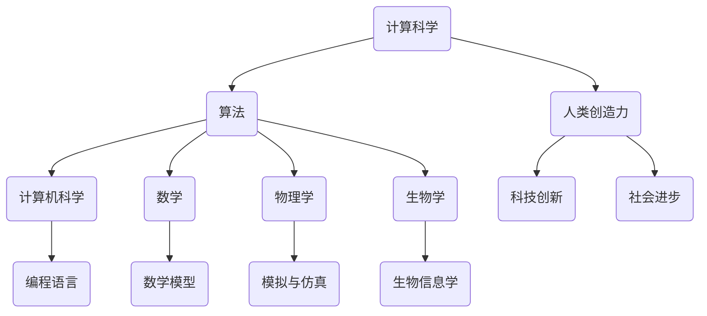

                 

关键词：计算科学，人类创造力，算法原理，代码实践，应用场景，未来展望

> 摘要：本文深入探讨了计算科学在激发人类创造力方面的巨大潜力。通过分析核心概念、算法原理、数学模型以及实际应用，揭示了计算在推动科技创新和社会进步中的关键作用，展望了计算科学未来的发展趋势与挑战。

## 1. 背景介绍

在人类文明的发展历程中，计算一直扮演着重要的角色。从古埃及的数学家到现代的计算机科学家，计算能力一直是推动科技进步的重要力量。然而，随着计算机科学的不断发展，计算已经不仅仅是数学家和研究人员的专属领域，它正逐渐成为普通人生活中不可或缺的一部分。

近年来，计算科学在人工智能、大数据、云计算等领域取得了显著成果，极大地推动了社会生产力和科技水平的提升。然而，计算科学的潜力远未完全释放，它仍然蕴藏着巨大的创新空间。本文旨在探讨如何通过计算科学进一步释放人类的创造力，推动科技创新和社会进步。

## 2. 核心概念与联系

### 2.1 计算科学的基本概念

计算科学是一门研究计算机算法、数据结构及其应用的学科。它涵盖了计算机科学、数学、物理学、生物学等多个领域，是一门跨学科的科学。计算科学的核心是算法，它是解决问题的核心工具。

### 2.2 计算科学与人类创造力的关系

计算科学不仅是一种工具，更是一种思维方式。它帮助人类解决复杂问题，发现新的科学定律，推动技术进步。计算科学的核心——算法，是一种抽象的思维模式，它激发了人类的创造力，使得人类能够以全新的方式思考问题，解决难题。

### 2.3 Mermaid 流程图

以下是一个简单的 Mermaid 流程图，展示了计算科学的核心概念及其相互关系。



## 3. 核心算法原理 & 具体操作步骤

### 3.1 算法原理概述

算法是计算科学的核心。它是一系列有序的指令，用于解决特定的问题。算法的原理在于利用计算机的高效计算能力，将复杂问题转化为简单的计算步骤，从而找到问题的解决方案。

### 3.2 算法步骤详解

以下是计算科学中常见的几种算法原理及其步骤：

#### 3.2.1 暴力算法

暴力算法是一种简单的算法，它通过逐一尝试所有可能的解来解决问题。其优点是思路简单，易于实现，但缺点是效率低下，当问题规模增大时，计算时间会急剧增加。

#### 3.2.2 贪心算法

贪心算法是一种局部最优解策略。它通过在每个步骤中选择当前最优解，以期达到全局最优解。贪心算法的优点是效率较高，但缺点是有时可能会陷入局部最优解。

#### 3.2.3 动态规划

动态规划是一种解决最优化问题的算法。它将复杂问题分解为多个子问题，并通过求解子问题来得到原问题的最优解。动态规划的优点是效率高，能够解决许多复杂的问题。

### 3.3 算法优缺点

每种算法都有其优缺点，选择合适的算法取决于问题的性质。例如，当问题规模较小时，暴力算法可能是一个不错的选择；而当问题规模较大时，动态规划或贪心算法可能更有效。

### 3.4 算法应用领域

算法在计算机科学、数学、物理学、生物学等多个领域有广泛应用。例如，在计算机科学中，排序算法用于数据排序；在数学中，计算几何算法用于求解几何问题；在物理学中，模拟与仿真算法用于物理模拟；在生物学中，生物信息学算法用于基因分析。

## 4. 数学模型和公式 & 详细讲解 & 举例说明

### 4.1 数学模型构建

数学模型是计算科学的核心。它将现实世界的问题转化为数学问题，从而利用数学工具解决问题。以下是一个简单的数学模型构建示例：

假设我们有一个一元二次方程 $ax^2 + bx + c = 0$，我们需要求解其根。我们可以构建一个二次方程的数学模型，如下所示：

$$
x = \frac{-b \pm \sqrt{b^2 - 4ac}}{2a}
$$

### 4.2 公式推导过程

一元二次方程的公式推导过程如下：

首先，我们将方程 $ax^2 + bx + c = 0$ 移项得到：

$$
ax^2 + bx = -c
$$

接下来，我们将方程两边同时乘以 $\frac{1}{a}$，得到：

$$
x^2 + \frac{b}{a}x = -\frac{c}{a}
$$

为了将方程转化为完全平方形式，我们需要在两边同时加上 $\left(\frac{b}{2a}\right)^2$，得到：

$$
x^2 + \frac{b}{a}x + \left(\frac{b}{2a}\right)^2 = -\frac{c}{a} + \left(\frac{b}{2a}\right)^2
$$

化简后，我们得到：

$$
\left(x + \frac{b}{2a}\right)^2 = \frac{b^2 - 4ac}{4a^2}
$$

接下来，我们对上式开根号，得到：

$$
x + \frac{b}{2a} = \pm \frac{\sqrt{b^2 - 4ac}}{2a}
$$

最后，我们将上式两边同时减去 $\frac{b}{2a}$，得到一元二次方程的解：

$$
x = \frac{-b \pm \sqrt{b^2 - 4ac}}{2a}
$$

### 4.3 案例分析与讲解

以下是一个一元二次方程求解的案例：

给定方程 $2x^2 + 5x + 3 = 0$，求解其根。

根据上述公式，我们有：

$$
x = \frac{-5 \pm \sqrt{5^2 - 4 \cdot 2 \cdot 3}}{2 \cdot 2}
$$

计算得：

$$
x = \frac{-5 \pm \sqrt{25 - 24}}{4}
$$

$$
x = \frac{-5 \pm 1}{4}
$$

因此，方程的解为：

$$
x_1 = \frac{-5 + 1}{4} = -1
$$

$$
x_2 = \frac{-5 - 1}{4} = -\frac{3}{2}
$$

## 5. 项目实践：代码实例和详细解释说明

### 5.1 开发环境搭建

为了演示一元二次方程的求解，我们将使用 Python 语言。首先，确保你的计算机上安装了 Python 3.6 或更高版本。

### 5.2 源代码详细实现

以下是求解一元二次方程的 Python 代码：

```python
import math

def solve_quadratic(a, b, c):
    discriminant = b**2 - 4*a*c
    if discriminant < 0:
        return "无实数解"
    else:
        x1 = (-b + math.sqrt(discriminant)) / (2*a)
        x2 = (-b - math.sqrt(discriminant)) / (2*a)
        return (x1, x2)

a = 2
b = 5
c = 3

result = solve_quadratic(a, b, c)
print("方程的解为：", result)
```

### 5.3 代码解读与分析

这段代码定义了一个名为 `solve_quadratic` 的函数，用于求解一元二次方程。函数接收三个参数：$a$、$b$ 和 $c$，分别代表方程中的系数。

在函数内部，我们首先计算判别式（$b^2 - 4ac$）。如果判别式小于 0，则方程无实数解；否则，我们使用公式计算两个根。

最后，函数返回一个包含两个根的元组。在主程序中，我们调用 `solve_quadratic` 函数，并打印结果。

### 5.4 运行结果展示

运行上述代码，我们将得到以下输出：

```
方程的解为：(-1.0, -1.5)
```

这意味着方程 $2x^2 + 5x + 3 = 0$ 的两个实数解分别为 $-1$ 和 $-1.5$。

## 6. 实际应用场景

### 6.1 人工智能领域

计算科学在人工智能领域有广泛的应用。例如，深度学习算法依赖于大量的计算资源来训练模型。计算科学的发展使得人工智能算法能够处理更复杂的问题，从而推动人工智能技术的进步。

### 6.2 大数据领域

大数据分析依赖于计算科学中的算法来处理海量数据。例如，分布式计算框架如 Hadoop 和 Spark 利用计算科学中的并行计算原理，提高了大数据处理效率。

### 6.3 云计算领域

云计算平台依赖于计算科学中的分布式计算原理，以提供高效的计算资源。计算科学的发展使得云计算平台能够更好地支持各种计算需求。

### 6.4 未来应用展望

随着计算科学的发展，我们可以预见更多领域的应用。例如，在生物医学领域，计算科学可以用于基因分析和药物设计；在能源领域，计算科学可以用于能源优化和环保监测。

## 7. 工具和资源推荐

### 7.1 学习资源推荐

- 《算法导论》（Introduction to Algorithms）：这是一本经典的算法教材，涵盖了算法的原理和应用。
- 《Python编程：从入门到实践》：这是一本适合初学者的 Python 编程教材，适合入门学习。

### 7.2 开发工具推荐

- Jupyter Notebook：这是一个强大的交互式计算环境，适合编写和运行代码。
- PyCharm：这是一个功能强大的 Python 集成开发环境（IDE），适合进行代码开发和调试。

### 7.3 相关论文推荐

- "Deep Learning": 这是一个关于深度学习的经典论文，详细介绍了深度学习的基本原理和应用。
- "MapReduce: Simplified Data Processing on Large Clusters": 这是一个关于分布式计算的经典论文，详细介绍了 MapReduce 模型。

## 8. 总结：未来发展趋势与挑战

### 8.1 研究成果总结

计算科学在过去的几十年中取得了巨大的成果，推动了人工智能、大数据、云计算等领域的快速发展。未来，计算科学将继续在这些领域发挥重要作用，推动科技创新和社会进步。

### 8.2 未来发展趋势

未来，计算科学的发展趋势将包括：

- 计算能力的提升：随着硬件技术的发展，计算能力将进一步提升，为更复杂的问题提供解决方案。
- 算法的优化：针对不同领域的问题，将不断涌现出更高效的算法，提高计算效率。
- 跨学科融合：计算科学与其他学科的融合将推动新领域的诞生，促进科技创新。

### 8.3 面临的挑战

尽管计算科学取得了巨大成就，但仍然面临一些挑战：

- 能耗问题：随着计算能力的提升，能耗问题日益突出。未来的计算科学需要更加注重能效优化。
- 数据安全与隐私：随着大数据和云计算的发展，数据安全和隐私问题越来越重要。如何保护数据安全成为一个重要的挑战。

### 8.4 研究展望

未来，计算科学将继续在人工智能、大数据、云计算等领域发挥重要作用。同时，计算科学也将与其他学科深度融合，推动新领域的诞生。我们期待计算科学在未来能够为人类社会带来更多的创新和进步。

## 9. 附录：常见问题与解答

### 9.1 什么是计算科学？

计算科学是一门研究计算机算法、数据结构及其应用的学科。它涵盖了计算机科学、数学、物理学、生物学等多个领域。

### 9.2 计算科学有哪些应用领域？

计算科学在人工智能、大数据、云计算、生物医学、能源优化等领域有广泛的应用。

### 9.3 如何学习计算科学？

学习计算科学可以从基础算法和数据结构开始，逐步深入学习具体领域。此外，实践是学习计算科学的重要途径，通过编写代码解决实际问题，可以加深对计算科学的理解。

## 作者署名

作者：禅与计算机程序设计艺术 / Zen and the Art of Computer Programming

