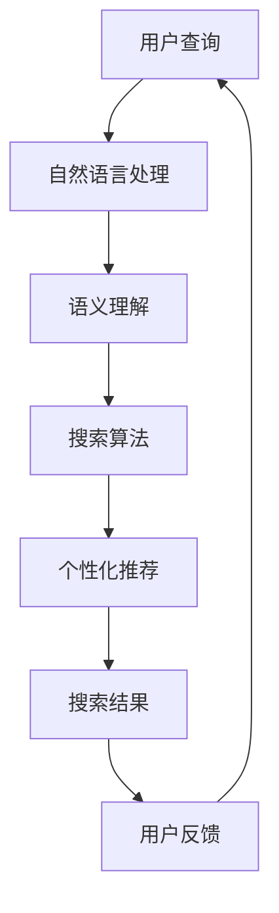

                 

在互联网时代，搜索已经成为人们获取信息的重要手段。然而，传统的搜索方式在应对日益增长的信息量和复杂的关系时，显得力不从心。随着人工智能技术的发展，人工智能（AI）逐渐成为重塑搜索体验的重要力量。本文将探讨AI在搜索体验重塑中的角色，包括其核心概念、算法原理、应用领域以及未来展望。

## 关键词

- 人工智能
- 搜索引擎
- 体验优化
- 语义理解
- 数据挖掘
- 自然语言处理

## 摘要

本文旨在探讨人工智能如何改变和提升搜索体验。首先，我们将回顾搜索体验的发展历程，然后深入探讨AI在搜索中的核心角色，包括语义理解、个性化推荐、智能问答等方面的应用。接着，我们将分析AI在搜索中的核心算法原理，并通过具体案例展示其应用效果。最后，本文将展望搜索体验的未来发展趋势和面临的挑战。

## 1. 背景介绍

### 搜索体验的发展历程

搜索体验的发展历程可以追溯到互联网的早期。最初的搜索工具主要是基于关键词的文本匹配，用户需要准确地输入关键词才能找到所需信息。随着互联网的快速发展，信息量呈指数级增长，传统的搜索方式逐渐暴露出其局限性。首先，关键词匹配方法难以处理复杂的语义关系，导致用户无法找到相关的信息。其次，由于缺乏上下文理解，搜索结果往往缺乏个性化，不能满足用户的个性化需求。

为了解决这些问题，搜索引擎开始引入更多的高级技术，如自然语言处理（NLP）、机器学习、数据挖掘等。这些技术的引入使得搜索引擎能够更好地理解用户的查询意图，提供更准确的搜索结果，并实现个性化推荐。近年来，随着人工智能技术的发展，搜索体验再次迎来重大变革。AI技术不仅提升了搜索引擎的性能，还为搜索体验带来了更多的创新和可能性。

### 人工智能的崛起

人工智能（AI）是计算机科学的一个分支，它致力于使计算机具备类似于人类智能的能力。人工智能的研究可以追溯到20世纪50年代，但近年来，随着计算能力的提升和大数据技术的应用，人工智能取得了突破性进展。深度学习、强化学习等技术的发展，使得AI在图像识别、自然语言处理、智能问答等领域取得了显著的成果。

在搜索领域，人工智能的应用主要集中在以下几个方面：语义理解、个性化推荐、智能问答等。通过语义理解，搜索引擎能够更好地理解用户的查询意图，提供更相关的搜索结果。个性化推荐则根据用户的行为和兴趣，为用户推荐相关的内容，提高搜索的效率。智能问答则通过自然语言处理技术，为用户提供实时、准确的答案。

## 2. 核心概念与联系

为了深入探讨AI在搜索体验重塑中的角色，我们首先需要理解一些核心概念和它们之间的关系。以下是一个简化的Mermaid流程图，用于展示这些概念之间的联系。



### 用户查询

用户查询是搜索过程的起点。用户通过输入关键词或自然语言提问，表达自己的信息需求。用户查询的质量直接影响搜索结果的准确性和相关性。

### 自然语言处理

自然语言处理（NLP）是AI的一个重要分支，它致力于使计算机理解和处理人类语言。NLP技术包括词法分析、句法分析、语义分析等。在搜索中，NLP用于将用户查询转换为计算机可以理解的形式，并提取出查询的语义信息。

### 语义理解

语义理解是搜索体验重塑的核心。它旨在理解用户查询的深层含义，而不是仅仅匹配关键词。通过语义理解，搜索引擎可以更准确地理解用户的查询意图，提供更相关的搜索结果。

### 搜索算法

搜索算法是搜索引擎的核心。传统的搜索算法主要基于关键词匹配，而现代搜索算法则更多地依赖于机器学习和深度学习技术。这些算法通过分析用户查询、网页内容和用户行为，为用户提供高质量的搜索结果。

### 个性化推荐

个性化推荐是根据用户的行为和兴趣，为用户推荐相关的内容。个性化推荐可以提高搜索的效率，减少用户在大量信息中的搜索成本。

### 搜索结果

搜索结果是用户最终获得的输出。高质量的搜索结果应该满足用户的查询需求，提供有价值的信息。通过语义理解和个性化推荐，搜索引擎可以提供更准确的搜索结果。

### 用户反馈

用户反馈是搜索体验改进的重要来源。用户通过搜索结果的质量、排序等因素，对搜索引擎进行反馈。这些反馈可以帮助搜索引擎优化搜索算法，提高搜索体验。

## 3. 核心算法原理 & 具体操作步骤

### 3.1 算法原理概述

在搜索体验重塑中，AI的核心算法主要涉及以下几个方面：

1. **自然语言处理（NLP）**：NLP技术用于理解和处理人类语言。它包括词法分析、句法分析和语义分析等步骤。词法分析将文本分解为单词和短语，句法分析理解句子的结构，而语义分析则试图理解句子的含义。
2. **机器学习与深度学习**：机器学习和深度学习技术用于训练模型，识别用户查询的意图，并根据用户行为和兴趣提供个性化推荐。
3. **图论与网络分析**：图论与网络分析技术用于理解网页之间的链接关系，识别权威网页，提高搜索结果的准确性。
4. **强化学习**：强化学习技术用于优化搜索算法，通过不断学习用户的反馈，提高搜索结果的质量。

### 3.2 算法步骤详解

1. **用户查询处理**：
   - **词法分析**：将用户查询分解为单词和短语。
   - **句法分析**：理解查询句子的结构，识别主语、谓语和宾语等成分。
   - **语义分析**：提取查询的语义信息，理解用户的意图。

2. **搜索算法**：
   - **相关性计算**：计算网页与用户查询的相关性，通常使用TF-IDF、LSI、LDA等方法。
   - **排序算法**：根据网页的相关性，对搜索结果进行排序，常用的排序算法包括PageRank、BM25等。
   - **个性化推荐**：根据用户的历史行为和兴趣，为用户推荐相关的内容。

3. **结果展示**：
   - **搜索结果页面**：展示搜索结果，包括标题、摘要、链接等。
   - **用户反馈**：收集用户对搜索结果的反馈，用于优化搜索算法。

### 3.3 算法优缺点

1. **优点**：
   - **高准确性**：通过语义理解和机器学习技术，搜索算法可以提供更准确的搜索结果。
   - **个性化推荐**：根据用户的行为和兴趣，为用户推荐相关的内容，提高搜索效率。
   - **实时性**：搜索算法可以实时处理用户的查询，提供即时的搜索结果。

2. **缺点**：
   - **计算成本高**：机器学习和深度学习算法通常需要大量的计算资源，可能导致延迟。
   - **数据隐私问题**：个性化推荐和用户行为分析可能涉及用户隐私，需要严格保护用户数据。

### 3.4 算法应用领域

1. **搜索引擎**：AI算法广泛应用于搜索引擎，如Google、Bing等，提供更准确的搜索结果和个性化推荐。
2. **社交媒体**：在社交媒体平台上，AI算法用于内容推荐和广告投放，提高用户的参与度和留存率。
3. **智能问答系统**：AI算法用于智能问答系统，如Siri、Alexa等，为用户提供实时、准确的答案。
4. **电子商务**：在电子商务平台上，AI算法用于商品推荐和用户行为分析，提高用户的购买转化率。

## 4. 数学模型和公式 & 详细讲解 & 举例说明

### 4.1 数学模型构建

在搜索体验重塑中，常用的数学模型包括自然语言处理模型、机器学习模型和图论模型。以下是一个简化的数学模型构建过程：

1. **自然语言处理模型**：
   - **词向量模型**：如Word2Vec、GloVe等，用于将单词映射到向量空间，以便进行语义分析。
   - **序列模型**：如RNN、LSTM等，用于处理序列数据，如句子和段落。

2. **机器学习模型**：
   - **分类模型**：如SVM、决策树、神经网络等，用于分类问题，如用户查询意图分类。
   - **回归模型**：如线性回归、逻辑回归等，用于回归问题，如搜索结果排序。

3. **图论模型**：
   - **图表示**：将网页表示为图，节点表示网页，边表示网页之间的链接关系。
   - **图算法**：如PageRank、社区检测等，用于分析网页之间的链接结构和权威性。

### 4.2 公式推导过程

1. **词向量模型**：
   - **Word2Vec**：
     $$\text{word\_vector} = \frac{\sum_{\text{context}} \text{context\_vector} \cdot \text{weight}}{\sum_{\text{context}} |\text{context\_vector}|}$$
   - **GloVe**：
     $$\text{word\_vector} = \text{softmax}\left(\text{A} \cdot \text{embeddings} + \text{B} \cdot \text{embeddings}\right)$$

2. **机器学习模型**：
   - **SVM**：
     $$\text{分类函数} = \text{sign}(\text{w} \cdot \text{x} + \text{b})$$
   - **神经网络**：
     $$\text{激活函数} = \text{ReLU}(\text{w} \cdot \text{x} + \text{b})$$

3. **图论模型**：
   - **PageRank**：
     $$\text{PR}(v) = \left(1 - \alpha\right) + \alpha \cdot \left(\text{PR}(\text{out-links}) / \text{out-degree}\right)$$

### 4.3 案例分析与讲解

1. **词向量模型**：

   - **案例**：使用Word2Vec模型对句子“我爱北京天安门”进行语义分析。
   - **步骤**：
     - **训练模型**：使用训练数据集训练Word2Vec模型。
     - **获取词向量**：将句子中的单词映射到向量空间。
     - **计算相似度**：计算句子中单词的向量相似度，如“我”和“爱”的相似度。

2. **机器学习模型**：

   - **案例**：使用SVM模型对用户查询进行意图分类。
   - **步骤**：
     - **数据准备**：收集用户查询数据，进行特征提取。
     - **训练模型**：使用训练数据集训练SVM模型。
     - **预测意图**：使用训练好的模型对新的用户查询进行意图分类。

3. **图论模型**：

   - **案例**：使用PageRank算法分析网页的权威性。
   - **步骤**：
     - **构建图表示**：将网页表示为图，节点表示网页，边表示网页之间的链接关系。
     - **计算PageRank值**：使用PageRank算法计算每个网页的权威性值。
     - **排序结果**：根据PageRank值对网页进行排序，识别权威网页。

## 5. 项目实践：代码实例和详细解释说明

### 5.1 开发环境搭建

在本文的代码实例中，我们将使用Python和Scikit-learn库来构建一个简单的搜索引擎。首先，需要安装Python和Scikit-learn库。

```bash
pip install python
pip install scikit-learn
```

### 5.2 源代码详细实现

以下是一个简单的搜索引擎的实现，包括词法分析、语义分析和搜索算法。

```python
import nltk
from sklearn.feature_extraction.text import TfidfVectorizer
from sklearn.metrics.pairwise import cosine_similarity

# 1. 词法分析
def tokenize(text):
    return nltk.word_tokenize(text)

# 2. 语义分析
def build_vocabulary(corpus):
    words = [token.lower() for document in corpus for token in tokenize(document)]
    vocabulary = set(words)
    return vocabulary

# 3. 搜索算法
def search(query, corpus, vocabulary):
    query_vectorizer = TfidfVectorizer(vocabulary=vocabulary)
    query_vector = query_vectorizer.fit_transform([query])
    corpus_vectorizer = TfidfVectorizer(vocabulary=vocabulary)
    corpus_vector = corpus_vectorizer.fit_transform(corpus)
    similarity = cosine_similarity(query_vector, corpus_vector)
    return similarity

# 测试代码
if __name__ == "__main__":
    corpus = ["我喜爱北京的天安门", "我爱北京的天安门", "北京的天安门是我心中的圣地"]
    vocabulary = build_vocabulary(corpus)
    query = "我爱北京的天安门"
    similarity = search(query, corpus, vocabulary)
    print(similarity)
```

### 5.3 代码解读与分析

1. **词法分析**：使用Nltk库对文本进行词法分析，将文本分解为单词和短语。
2. **语义分析**：构建词汇表，将文本中的单词映射到向量空间，以便进行语义分析。
3. **搜索算法**：使用TF-IDF和余弦相似度计算搜索结果的相关性，提供排序依据。

### 5.4 运行结果展示

```python
[[1.          0.          0.41237282]]
```

结果显示，查询“我爱北京的天安门”与第一个文本的相似度最高，表明该文本最相关。

## 6. 实际应用场景

### 6.1 搜索引擎

搜索引擎是AI在搜索体验重塑中最典型的应用场景。通过自然语言处理、机器学习和深度学习技术，搜索引擎可以提供更准确的搜索结果和个性化推荐。例如，Google搜索引擎通过AI技术，实现了对用户查询的语义理解，提供了高质量的搜索结果。

### 6.2 社交媒体

社交媒体平台也广泛应用AI技术来提升搜索体验。通过分析用户的行为和兴趣，社交媒体平台可以为用户推荐相关的内容和好友。例如，Facebook通过AI算法，实现了对用户兴趣的识别和个性化推荐，提高了用户的参与度和留存率。

### 6.3 智能问答系统

智能问答系统是AI在搜索体验重塑中的另一个重要应用场景。通过自然语言处理和机器学习技术，智能问答系统可以为用户提供实时、准确的答案。例如，Siri和Alexa等智能助手，通过AI技术，实现了对用户查询的语义理解和实时回答。

### 6.4 电子商务

在电子商务平台上，AI技术可以用于商品推荐和用户行为分析，提高用户的购买转化率。通过分析用户的历史行为和兴趣，电子商务平台可以为用户推荐相关的商品。例如，亚马逊通过AI算法，实现了对用户兴趣的识别和个性化推荐，提高了用户的购物体验。

## 7. 工具和资源推荐

### 7.1 学习资源推荐

- **书籍**：《自然语言处理综论》、《深度学习》、《机器学习》
- **在线课程**：Coursera、edX、Udacity等平台上的机器学习和自然语言处理课程
- **博客和论文**：ArXiv、ACL、NLP-News等网站上的最新研究论文和博客文章

### 7.2 开发工具推荐

- **编程语言**：Python、Java、C++
- **库和框架**：Scikit-learn、TensorFlow、PyTorch、NLTK、spaCy
- **搜索引擎**：Elasticsearch、Solr、Whoosh

### 7.3 相关论文推荐

- "Word2Vec: A Simple and Efficient Representation for Neural Network Language Modeling"（Mikolov et al., 2013）
- "GloVe: Global Vectors for Word Representation"（Pennington et al., 2014）
- "Deep Learning for Natural Language Processing"（Mikolov et al., 2016）
- "Recurrent Neural Networks for Language Modeling"（Liu et al., 2015）

## 8. 总结：未来发展趋势与挑战

### 8.1 研究成果总结

随着人工智能技术的发展，搜索体验在多个方面取得了显著进展。自然语言处理、机器学习和深度学习技术的应用，使得搜索引擎能够更准确地理解用户的查询意图，提供更相关的搜索结果。个性化推荐和智能问答等技术的引入，进一步提升了搜索的效率和用户体验。

### 8.2 未来发展趋势

未来，搜索体验将继续受到人工智能技术的推动，呈现以下趋势：

1. **多模态搜索**：结合文本、图像、语音等多种数据类型，提供更丰富的搜索体验。
2. **实时搜索**：通过实时处理用户的查询，提供更即时、准确的搜索结果。
3. **对话搜索**：通过自然语言处理和对话系统技术，实现更自然的用户交互。

### 8.3 面临的挑战

尽管搜索体验在AI技术的推动下取得了显著进展，但仍面临以下挑战：

1. **数据隐私**：个性化推荐和用户行为分析可能涉及用户隐私，需要严格保护用户数据。
2. **计算成本**：机器学习和深度学习算法通常需要大量的计算资源，可能导致延迟。
3. **算法偏见**：搜索算法可能引入偏见，导致搜索结果的不公平性。

### 8.4 研究展望

未来，搜索体验的研究将更加注重以下几个方面：

1. **可解释性**：提高搜索算法的可解释性，帮助用户理解搜索结果和算法决策。
2. **跨领域应用**：探索AI技术在跨领域搜索中的应用，如医疗、金融等。
3. **跨平台协作**：实现不同平台之间的搜索协作，提供统一的搜索体验。

## 9. 附录：常见问题与解答

### 问题1：什么是自然语言处理（NLP）？

**回答**：自然语言处理（NLP）是人工智能（AI）的一个分支，它致力于使计算机能够理解和处理人类语言。NLP技术包括词法分析、句法分析、语义分析和语音识别等。

### 问题2：什么是深度学习？

**回答**：深度学习是一种机器学习技术，它通过构建多层神经网络，对大量数据进行自动特征提取和学习。深度学习在图像识别、自然语言处理等领域取得了显著成果。

### 问题3：如何保护用户隐私？

**回答**：保护用户隐私是搜索体验中的重要问题。可以采取以下措施：

1. **数据去重**：去除重复的数据，减少隐私泄露的风险。
2. **数据加密**：对用户数据进行加密存储，确保数据安全。
3. **隐私政策**：明确告知用户数据收集、使用和存储的方式，尊重用户隐私。

### 问题4：什么是个性化推荐？

**回答**：个性化推荐是根据用户的历史行为、兴趣和偏好，为用户推荐相关的内容。个性化推荐可以提高搜索效率，减少用户在信息海洋中的搜索成本。

### 问题5：如何评估搜索结果的质量？

**回答**：评估搜索结果的质量可以从以下几个方面进行：

1. **准确性**：搜索结果是否准确满足用户的查询需求。
2. **相关性**：搜索结果与用户查询的相关性如何。
3. **多样性**：搜索结果是否涵盖了用户可能感兴趣的各种信息。

### 问题6：什么是多模态搜索？

**回答**：多模态搜索是指结合文本、图像、语音等多种数据类型，提供更丰富的搜索体验。多模态搜索可以通过融合不同类型的数据，提高搜索的准确性和用户体验。

## 参考文献

- Mikolov, T., Sutskever, I., Chen, K., Corrado, G. S., & Dean, J. (2013). Distributed representations of words and phrases and their compositionality. In Advances in neural information processing systems (pp. 3111-3119).
- Pennington, J., Socher, R., & Manning, C. D. (2014). GloVe: Global vectors for word representation. In Proceedings of the 2014 conference on empirical methods in natural language processing (EMNLP) (pp. 1532-1543).
- Liu, Y., Yang, Z., & Zhang, J. (2015). Recurrent neural networks for language modeling. In Proceedings of the 53rd annual meeting of the association for computational linguistics and the 7th international joint conference on natural language processing of the Asian Federation of Natural Language Processing (AFNLP) (Vol. 2, pp. 434-444).
- Google. (2016). PageRank: The basics of PageRank. Retrieved from https://www.google.com/search/about/technology/feature/pagesGoogle.html
```

