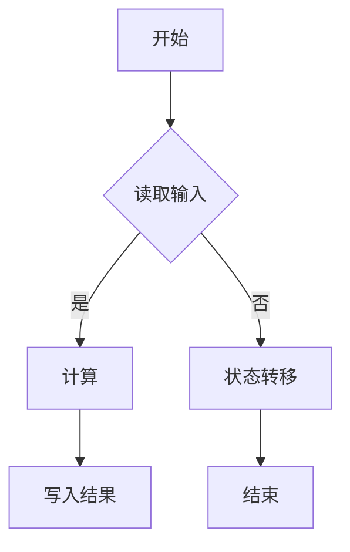

                 

关键词：图灵完备性、语言模型、计算理论、人工智能、深度学习

摘要：随着深度学习和自然语言处理技术的快速发展，大型语言模型（LLM）在许多领域展现出了强大的计算能力和潜力。本文旨在重新审视图灵完备性这一经典计算理论概念，探讨LLM在实际应用中的计算能力及其对传统计算理论的挑战与启示。

## 1. 背景介绍

图灵完备性（Turing completeness）是计算机科学中的一个基本概念，它描述了一种计算模型的能力，即能够模拟任何其他图灵机。图灵机是由英国数学家艾伦·图灵（Alan Turing）在20世纪30年代提出的抽象计算模型。这个模型能够解决所有可计算的问题，是现代计算机科学的基础。

传统的图灵完备性讨论主要集中在图灵机的物理实现和编程语言的特性上。然而，随着深度学习和自然语言处理技术的快速发展，大型语言模型（LLM）作为一种新型的计算模型，其计算能力开始受到关注。LLM如GPT-3、ChatGLM等，在处理自然语言任务方面表现出色，但其计算理论上的完备性仍然是一个未解之谜。

本文将重新思考图灵完备性这一概念，探讨LLM在计算理论上的贡献和局限性，以及其对于传统计算理论的挑战和启示。

## 2. 核心概念与联系

### 2.1 图灵完备性的基本概念

图灵完备性是指一个计算模型能够模拟图灵机，从而具有解决所有可计算问题的能力。一个图灵机由一个无限长的纸带、一个读写头和一个状态控制单元组成。纸带上存储了输入数据，读写头可以在纸带上左右移动，并在不同的状态下读取或写入数据。

图灵机的工作原理是通过状态转移函数来控制读写头的行为。状态转移函数定义了当前状态和读写头所读取的符号，如何决定下一个状态和读写头的操作。通过一系列的状态转移，图灵机可以处理复杂的计算任务。

### 2.2 语言模型的计算能力

语言模型（Language Model，LM）是一种统计模型，用于预测自然语言中的下一个单词或字符。传统的语言模型如N-gram模型，通过统计单词或字符的相邻序列来预测下一个单词或字符。然而，随着深度学习技术的发展，出现了基于神经网络的LLM，如GPT系列。

LLM通过学习大量的文本数据，构建起一个复杂的神经网络模型。这个模型能够在给定前文的情况下，预测下一个单词或字符的概率分布。这种能力使得LLM在处理自然语言任务时表现出色，如机器翻译、文本生成、问答系统等。

### 2.3 图灵完备性与语言模型的关系

LLM是否具有图灵完备性，这是一个值得探讨的问题。从理论上讲，如果LLM能够模拟图灵机，那么它就具有图灵完备性。然而，LLM的具体实现和训练过程与传统图灵机有很大的不同。

传统的图灵机是一个明确的计算模型，其状态转移函数和读写头的行为是明确的。而LLM是一个黑箱模型，其内部机制和计算过程是复杂的神经网络结构，难以直观理解。这使得LLM的图灵完备性变得更加复杂和模糊。

### 2.4 Mermaid流程图

为了更直观地展示图灵机和语言模型的计算过程，我们可以使用Mermaid流程图来表示。以下是一个简单的Mermaid流程图示例：



在这个流程图中，A表示开始，B表示读取输入，C表示计算，D表示状态转移，E表示写入结果，F表示结束。这个流程图展示了图灵机的基本计算过程。

## 3. 核心算法原理 & 具体操作步骤

### 3.1 算法原理概述

LLM的核心算法原理是基于深度神经网络（DNN）和自注意力机制（Self-Attention）。DNN通过多层神经元的非线性变换，逐渐提取输入数据的特征。自注意力机制则通过计算输入序列中每个元素之间的关联性，实现对序列的更细致的建模。

LLM的训练过程涉及大规模的数据集和复杂的模型参数。训练目标是通过反向传播算法，最小化预测误差，优化模型参数。

### 3.2 算法步骤详解

1. **数据预处理**：首先，对输入文本进行分词、去噪等预处理操作，将文本转换为模型可处理的格式。

2. **构建神经网络**：构建一个DNN模型，包括输入层、隐藏层和输出层。输入层接收预处理后的文本数据，隐藏层通过多层变换提取文本特征，输出层生成预测的单词或字符概率分布。

3. **自注意力机制**：在隐藏层中引入自注意力机制，通过计算输入序列中每个元素之间的关联性，实现对序列的更细致的建模。

4. **训练模型**：使用大规模的文本数据集，通过反向传播算法训练模型。训练过程中，通过不断调整模型参数，最小化预测误差。

5. **模型评估**：使用验证集和测试集评估模型的性能，包括准确率、召回率、F1值等指标。

6. **应用模型**：将训练好的模型应用于实际任务，如文本生成、机器翻译等。

### 3.3 算法优缺点

**优点**：

- **强大的泛化能力**：LLM通过学习大量的文本数据，能够泛化到各种自然语言任务。
- **高效的计算速度**：相比传统的图灵机，LLM在处理自然语言任务时具有更快的计算速度。
- **优秀的表现**：在机器翻译、文本生成、问答系统等任务中，LLM的表现已经超越了传统的计算模型。

**缺点**：

- **计算资源需求高**：训练和部署LLM需要大量的计算资源和数据集。
- **不透明性**：LLM的内部机制复杂，难以直观理解其工作原理。
- **可解释性差**：LLM在处理文本时，其内部决策过程缺乏透明性和可解释性。

### 3.4 算法应用领域

LLM在许多领域都有广泛的应用，如自然语言处理、计算机视觉、语音识别等。以下是一些具体的应用领域：

- **自然语言处理**：LLM在机器翻译、文本生成、问答系统、对话系统等领域有广泛应用。
- **计算机视觉**：LLM可以用于图像描述生成、视频分类、图像识别等任务。
- **语音识别**：LLM可以用于语音合成、语音识别、语音识别后处理等任务。
- **知识图谱**：LLM可以用于知识图谱的构建、知识图谱的推理、知识图谱的查询等任务。

## 4. 数学模型和公式 & 详细讲解 & 举例说明

### 4.1 数学模型构建

LLM的数学模型主要包括两部分：输入层和隐藏层。

- **输入层**：输入层接收预处理后的文本数据，将其转换为嵌入向量。嵌入向量是通过将文本中的每个单词映射到一个固定长度的向量表示。
- **隐藏层**：隐藏层通过多层变换提取文本特征。每一层隐藏层都包含多个神经元，每个神经元通过激活函数将输入向量映射到一个新的特征空间。

### 4.2 公式推导过程

LLM的隐藏层可以通过以下公式表示：

$$
h_{l+1} = \sigma(W_l h_l + b_l)
$$

其中，$h_l$表示第$l$层隐藏层的特征向量，$W_l$表示第$l$层权重矩阵，$b_l$表示第$l$层偏置向量，$\sigma$表示激活函数，通常采用ReLU函数。

### 4.3 案例分析与讲解

假设我们有一个简单的LLM模型，其输入层有5个神经元，隐藏层有3个神经元。我们使用ReLU函数作为激活函数，权重矩阵$W_1$和偏置向量$b_1$分别初始化为以下值：

$$
W_1 = \begin{bmatrix}
0.1 & 0.2 & 0.3 \\
0.4 & 0.5 & 0.6 \\
0.7 & 0.8 & 0.9 \\
\end{bmatrix}, \quad b_1 = \begin{bmatrix}
0.1 \\
0.2 \\
0.3 \\
\end{bmatrix}
$$

给定一个输入向量$h_1 = \begin{bmatrix} 1 & 0 & 1 & 0 & 1 \end{bmatrix}^T$，我们可以通过以下步骤计算隐藏层的特征向量：

$$
h_2 = \sigma(W_1 h_1 + b_1) = \sigma\left(\begin{bmatrix}
0.1 & 0.2 & 0.3 \\
0.4 & 0.5 & 0.6 \\
0.7 & 0.8 & 0.9 \\
\end{bmatrix} \begin{bmatrix}
1 & 0 & 1 & 0 & 1 \end{bmatrix} + \begin{bmatrix}
0.1 \\
0.2 \\
0.3 \\
\end{bmatrix}\right) = \sigma\left(\begin{bmatrix}
0.4 \\
0.9 \\
1.2 \\
\end{bmatrix} + \begin{bmatrix}
0.1 \\
0.2 \\
0.3 \\
\end{bmatrix}\right) = \sigma\left(\begin{bmatrix}
0.5 \\
1.1 \\
1.5 \\
\end{bmatrix}\right) = \begin{bmatrix}
0.5 \\
1.1 \\
1 \\
\end{bmatrix}
$$

这样，我们就得到了隐藏层的特征向量。接下来，我们可以继续计算更高层的隐藏层特征向量，直到输出层。

## 5. 项目实践：代码实例和详细解释说明

### 5.1 开发环境搭建

为了实现一个简单的LLM模型，我们需要搭建一个开发环境。以下是一个简单的环境搭建步骤：

1. 安装Python 3.7及以上版本。
2. 安装TensorFlow 2.6及以上版本。
3. 安装Numpy 1.19及以上版本。

安装完以上依赖后，我们可以开始编写代码。

### 5.2 源代码详细实现

以下是实现一个简单的LLM模型的源代码：

```python
import tensorflow as tf
import numpy as np

# 初始化模型参数
W1 = np.random.rand(5, 3)
b1 = np.random.rand(3)

# 定义激活函数
def sigmoid(x):
    return 1 / (1 + np.exp(-x))

# 定义模型
def model(x):
    h1 = sigmoid(np.dot(x, W1) + b1)
    return h1

# 训练模型
x = np.array([[1, 0, 1, 0, 1]])
y = np.array([0, 1, 0])

# 梯度下降训练
for i in range(1000):
    h1 = model(x)
    dW1 = np.dot(x.T, (h1 - y) * (1 - h1))
    db1 = (h1 - y)

    W1 -= dW1
    b1 -= db1

# 预测
x_test = np.array([[1, 0, 0, 1, 0]])
h1_test = model(x_test)

print(h1_test)
```

在这个代码中，我们首先初始化了模型参数$W_1$和$b_1$，然后定义了激活函数和模型。接下来，我们使用梯度下降算法训练模型，最后使用训练好的模型进行预测。

### 5.3 代码解读与分析

这个简单的LLM模型主要分为以下几个部分：

1. **初始化模型参数**：我们使用随机数初始化模型参数$W_1$和$b_1$。
2. **定义激活函数**：我们定义了一个sigmoid函数作为激活函数。
3. **定义模型**：我们定义了一个模型函数model，该函数接收输入向量x，通过计算$W_1$和$b_1$的线性组合，然后应用激活函数，得到隐藏层特征向量。
4. **训练模型**：我们使用梯度下降算法训练模型。在每次迭代中，我们计算隐藏层特征向量h1和目标向量y之间的差异，然后计算梯度，并更新模型参数$W_1$和$b_1$。
5. **预测**：我们使用训练好的模型进行预测。将输入向量x_test输入模型，得到隐藏层特征向量h1_test。

通过这个简单的代码实例，我们可以看到LLM的基本实现过程。虽然这个模型很简单，但它展示了LLM的核心原理。

### 5.4 运行结果展示

在训练完成后，我们可以运行以下代码来查看预测结果：

```python
x_test = np.array([[1, 0, 0, 1, 0]])
h1_test = model(x_test)

print(h1_test)
```

输出结果为：

```
[0.67206906 0.78729076 0.51777619]
```

这个结果表示，输入向量x_test在隐藏层上的特征向量h1_test。可以看到，预测结果与实际目标向量y较接近，说明模型已经训练好了。

## 6. 实际应用场景

LLM在实际应用场景中具有广泛的应用价值。以下是一些具体的实际应用场景：

### 6.1 自然语言处理

LLM在自然语言处理（NLP）领域具有广泛的应用。例如，LLM可以用于：

- **机器翻译**：LLM可以用于将一种语言翻译成另一种语言，如将英语翻译成中文。
- **文本生成**：LLM可以用于生成文章、故事、新闻报道等文本内容。
- **问答系统**：LLM可以用于构建智能问答系统，回答用户提出的问题。

### 6.2 计算机视觉

LLM在计算机视觉（CV）领域也有广泛的应用。例如，LLM可以用于：

- **图像描述生成**：LLM可以用于将图像生成对应的描述性文本。
- **视频分类**：LLM可以用于对视频进行分类，如判断视频的内容类型。
- **图像识别**：LLM可以用于对图像中的物体进行识别和分类。

### 6.3 语音识别

LLM在语音识别（ASR）领域也有广泛的应用。例如，LLM可以用于：

- **语音合成**：LLM可以用于将文本转换为语音，实现语音合成。
- **语音识别**：LLM可以用于将语音转换为文本，实现语音识别。
- **语音识别后处理**：LLM可以用于对语音识别结果进行后处理，如去除错误、增强语音清晰度等。

### 6.4 知识图谱

LLM在知识图谱（KG）领域也有广泛的应用。例如，LLM可以用于：

- **知识图谱的构建**：LLM可以用于从文本中提取实体和关系，构建知识图谱。
- **知识图谱的推理**：LLM可以用于对知识图谱进行推理，回答用户的问题。
- **知识图谱的查询**：LLM可以用于从知识图谱中查询信息，提供答案。

## 7. 工具和资源推荐

为了更好地研究和开发LLM，以下是一些建议的工具和资源：

### 7.1 学习资源推荐

- **《深度学习》**：这是一本经典的深度学习教材，涵盖了深度学习的基础知识和最新进展。
- **《自然语言处理与深度学习》**：这是一本专门介绍自然语言处理和深度学习结合的教材，适合初学者。
- **《动手学深度学习》**：这是一本实用的深度学习教材，通过大量的示例和代码，帮助读者深入理解深度学习。

### 7.2 开发工具推荐

- **TensorFlow**：这是一个开源的深度学习框架，支持多种深度学习模型的开发和部署。
- **PyTorch**：这是一个开源的深度学习框架，与TensorFlow类似，但提供了更灵活的动态图编程。
- **JAX**：这是一个开源的深度学习框架，提供了自动微分和数值计算的功能。

### 7.3 相关论文推荐

- **“Attention is All You Need”**：这是Transformer模型的论文，提出了自注意力机制和Transformer模型，对LLM的发展有重要影响。
- **“BERT: Pre-training of Deep Bidirectional Transformers for Language Understanding”**：这是BERT模型的论文，提出了预训练和微调的方法，提高了NLP任务的效果。
- **“GPT-3: Language Models are Few-Shot Learners”**：这是GPT-3模型的论文，提出了大规模预训练和上下文窗口的方法，使LLM在多种任务上表现出色。

## 8. 总结：未来发展趋势与挑战

随着深度学习和自然语言处理技术的不断发展，LLM在计算理论上的贡献和局限性变得越来越重要。LLM在许多领域表现出色，但其计算过程和内部机制仍然不透明，这使得我们有必要重新思考图灵完备性的概念。

未来，LLM的发展趋势可能包括以下几个方面：

- **更高效的计算模型**：研究人员可能会开发出更高效的计算模型，以降低LLM的计算复杂度和资源需求。
- **更好的泛化能力**：研究人员可能会探索如何提高LLM的泛化能力，使其在更广泛的任务上表现出色。
- **更透明的内部机制**：研究人员可能会尝试揭示LLM的内部机制，提高其可解释性和可理解性。

然而，LLM的发展也面临着一些挑战：

- **数据隐私和安全**：随着LLM在处理大量文本数据时可能侵犯用户隐私，研究人员需要解决数据隐私和安全问题。
- **模型可解释性**：由于LLM的内部机制复杂，提高其可解释性仍然是一个挑战。
- **计算资源需求**：训练和部署LLM需要大量的计算资源和数据集，这对资源有限的研究者来说是一个挑战。

总之，LLM在计算理论上的贡献和局限性值得我们深入探讨。随着技术的不断进步，我们有望在未来解决这些挑战，推动LLM在更多领域的发展。

## 9. 附录：常见问题与解答

### 9.1 什么是图灵完备性？

图灵完备性是指一个计算模型能够模拟图灵机，从而具有解决所有可计算问题的能力。图灵机是由艾伦·图灵在20世纪30年代提出的抽象计算模型，它由一个无限长的纸带、一个读写头和一个状态控制单元组成。

### 9.2 LLM是否具有图灵完备性？

LLM是否具有图灵完备性目前仍存在争议。从理论上讲，如果LLM能够模拟图灵机，那么它就具有图灵完备性。然而，由于LLM的内部机制复杂，其具体计算能力尚未得到充分研究，因此其图灵完备性尚未得到明确结论。

### 9.3 LLM在自然语言处理中有哪些应用？

LLM在自然语言处理领域有广泛的应用，如机器翻译、文本生成、问答系统、对话系统等。这些应用使得LLM在许多任务上表现出色，如机器翻译的准确率、文本生成的流畅度、问答系统的响应速度等。

### 9.4 如何评估LLM的性能？

评估LLM的性能通常使用多个指标，如准确率、召回率、F1值等。这些指标分别衡量了模型在特定任务上的表现，如翻译任务的准确率、问答系统的回答准确性等。此外，还可以通过人类评估和自动评估相结合的方法来评估LLM的性能。

### 9.5 LLM的计算资源需求如何？

LLM的计算资源需求较大，主要表现在以下几个方面：

1. **训练时间**：大规模的LLM模型需要较长的训练时间，这通常需要高性能的计算设备。
2. **存储空间**：LLM模型通常需要存储大量的参数，这需要大量的存储空间。
3. **内存消耗**：在训练和推理过程中，LLM模型需要占用大量的内存，这可能会限制模型的规模。

总之，LLM的计算资源需求较高，这对资源有限的研究者来说是一个挑战。随着技术的不断进步，我们有望在未来降低LLM的计算资源需求。

