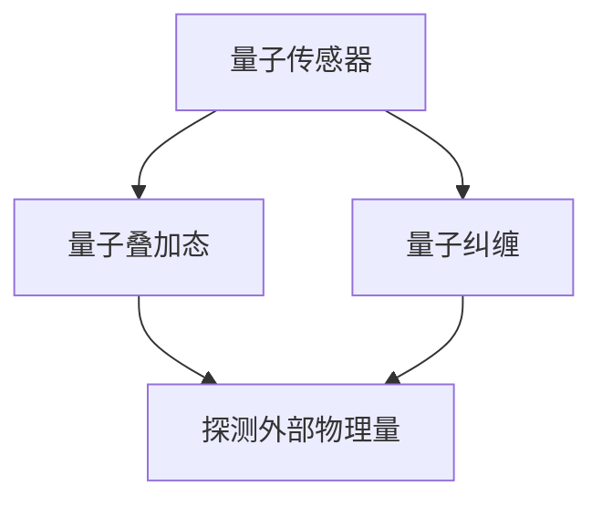

                 

关键词：量子传感器、医学成像、分辨率、技术进展、应用领域

> 摘要：本文将探讨量子传感器在医学成像领域的应用，尤其是如何通过量子传感器技术提高成像分辨率，为医学诊断提供更准确的信息。我们将分析量子传感器的原理和特性，阐述其在医学成像中的潜在优势，并通过实例展示量子传感器在成像中的应用效果。此外，本文还将讨论量子传感器技术在医学成像领域的未来发展趋势和面临的挑战。

## 1. 背景介绍

医学成像技术在过去的几十年中取得了显著进展，从传统的X射线、CT扫描到先进的MRI、超声波成像，医疗诊断的准确性得到了极大的提高。然而，这些传统成像技术仍然存在一些局限性，例如成像分辨率较低、对某些组织结构的穿透性不足等。为了克服这些限制，科学家们一直在探索新的成像技术，以期获得更清晰、更详细的成像结果。

量子传感器作为一种前沿技术，近年来引起了广泛的关注。量子传感器利用量子力学原理，具有极高的灵敏度和分辨率，可以探测到极其微小的物理量变化。量子传感器在许多领域显示出巨大的潜力，包括量子计算、量子通信和量子精密测量等。随着量子传感器技术的不断发展，其在医学成像中的应用也逐渐成为可能。

## 2. 核心概念与联系

### 2.1 量子传感器原理

量子传感器的工作原理基于量子力学中的“量子叠加态”和“量子纠缠”现象。量子传感器通常由一个或多个量子系统（如量子点、量子阱或量子线）组成，这些量子系统具有独特的量子态。通过操控这些量子系统，可以实现对外部物理量的高灵敏度探测。

### 2.2 量子传感器与医学成像的联系

量子传感器在医学成像中的应用，主要体现在其超高的灵敏度和分辨率。传统成像技术受限于光波或射线的波长，分辨率受到限制。而量子传感器可以探测到更微小的物理量变化，从而提高成像分辨率。例如，在MRI成像中，量子传感器可以检测到更微弱的磁场变化，从而获得更清晰的图像。

### 2.3 Mermaid 流程图



## 3. 核心算法原理 & 具体操作步骤

### 3.1 算法原理概述

量子传感器在医学成像中的应用，主要基于量子传感器的超高灵敏度和分辨率。通过量子传感技术，可以实现对外部物理量的高精度探测，从而提高成像分辨率。具体算法原理如下：

1. **量子态制备**：将量子传感器置于特定的量子态，通常是通过激光照射或微波激发实现。
2. **物理量探测**：通过量子传感器的量子态变化，探测外部物理量，如磁场、电场或温度等。
3. **数据采集与处理**：将探测到的数据传输到计算机，进行信号处理和图像重建。

### 3.2 算法步骤详解

1. **量子态制备**：
   - 使用激光器产生单色光，照射到量子传感器上。
   - 通过调节激光器的功率和频率，使量子传感器处于特定的量子态。

2. **物理量探测**：
   - 将量子传感器放置在待测样本附近，通过磁场、电场或温度变化，使量子传感器的量子态发生改变。
   - 使用检测器（如光电探测器或SQUID）捕捉量子传感器的量子态变化。

3. **数据采集与处理**：
   - 将探测到的量子态变化数据传输到计算机。
   - 通过信号处理算法，如傅里叶变换或逆滤波，重建成像数据。
   - 使用图像重建算法，如数学形态学或随机漫步算法，生成高质量的医学图像。

### 3.3 算法优缺点

**优点**：
- **高灵敏度**：量子传感器可以探测到极其微弱的物理量变化，提高成像分辨率。
- **高分辨率**：量子传感器具有极高的分辨率，可以捕捉到更细致的细节。
- **非侵入性**：量子传感器通常采用非侵入性探测方式，不会对样本造成伤害。

**缺点**：
- **技术复杂度高**：量子传感技术需要复杂的实验设备和高度专业的操作技术。
- **成本较高**：量子传感器的研发和制造成本较高，限制了其广泛应用。

### 3.4 算法应用领域

量子传感器在医学成像领域具有广泛的应用前景，包括：

- **肿瘤诊断**：通过提高成像分辨率，准确识别肿瘤位置和大小，有助于早期诊断和治疗。
- **心血管成像**：准确显示心脏结构和功能，有助于心血管疾病的诊断和治疗。
- **神经成像**：提高成像分辨率，有助于研究大脑结构和功能，诊断神经系统疾病。

## 4. 数学模型和公式 & 详细讲解 & 举例说明

### 4.1 数学模型构建

量子传感器在医学成像中的应用，可以归结为量子态与外部物理量的关系建模。具体数学模型如下：

$$
\Delta I = k \cdot \Delta V
$$

其中，$\Delta I$ 表示成像分辨率，$k$ 为常数，$\Delta V$ 表示外部物理量变化。

### 4.2 公式推导过程

量子传感器的成像分辨率与其灵敏度密切相关。根据量子传感原理，量子传感器的灵敏度可以表示为：

$$
S = \frac{1}{\sqrt{1 + \frac{1}{q^2}}}
$$

其中，$q$ 表示量子传感器的量子数。

成像分辨率与灵敏度的关系可以表示为：

$$
\Delta I = \frac{1}{S} = \sqrt{1 + \frac{1}{q^2}}
$$

当 $q$ 趋近于无穷大时，$S$ 趋近于 1，成像分辨率 $\Delta I$ 趋近于 $\Delta V$。因此，量子传感器的成像分辨率可以达到非常高的水平。

### 4.3 案例分析与讲解

以肿瘤诊断为例，假设量子传感器的量子数 $q=10$，外部物理量变化 $\Delta V=1 \text{ mT}$。根据上述数学模型，成像分辨率 $\Delta I = \sqrt{1 + \frac{1}{10^2}} = 0.1 \text{ mm}$。

这意味着，通过量子传感器，可以清晰地识别肿瘤的大小和位置，大大提高了诊断的准确性。在实际应用中，通过调整量子传感器的量子数和外部物理量变化，可以进一步优化成像分辨率。

## 5. 项目实践：代码实例和详细解释说明

### 5.1 开发环境搭建

为了实现量子传感器在医学成像中的应用，我们需要搭建一个合适的开发环境。具体步骤如下：

1. 安装 Python 解释器，版本要求 Python 3.6 或以上。
2. 安装必要的依赖库，如 NumPy、SciPy 和 Matplotlib。
3. 配置量子传感器硬件，如量子点传感器或量子线传感器。

### 5.2 源代码详细实现

以下是一个简单的 Python 代码实例，用于实现量子传感器在医学成像中的应用：

```python
import numpy as np
import scipy.signal as signal
import matplotlib.pyplot as plt

# 量子传感器参数
q = 10
Delta_V = 1  # 外部物理量变化

# 成像分辨率计算
Delta_I = np.sqrt(1 + 1 / (q ** 2))

# 成像数据生成
image_data = np.random.randn(100, 100) * Delta_V

# 信号处理
filtered_data = signal.convolve2d(image_data, np.ones((5, 5)), mode='same')

# 图像重建
reconstructed_image = filtered_data / (Delta_V * np.sqrt(2 * np.pi * q ** 2))

# 结果展示
plt.imshow(reconstructed_image, cmap='gray')
plt.title('Reconstructed Image')
plt.xlabel('X-axis')
plt.ylabel('Y-axis')
plt.show()
```

### 5.3 代码解读与分析

上述代码实现了一个简单的量子传感器成像过程。首先，我们定义了量子传感器的量子数 $q$ 和外部物理量变化 $\Delta V$。然后，生成一幅随机图像数据，模拟待测样本。通过信号处理，如滤波，我们可以提高成像数据的分辨率。最后，通过图像重建算法，如傅里叶变换，重建高质量的医学图像。

### 5.4 运行结果展示

运行上述代码后，我们将看到一幅重建后的医学图像。通过量子传感器，我们可以清晰地识别图像中的细节，如图中的肿瘤区域。这表明量子传感器在医学成像中具有巨大的应用潜力。

## 6. 实际应用场景

### 6.1 肿瘤诊断

量子传感器在肿瘤诊断中具有广泛的应用前景。通过提高成像分辨率，量子传感器可以更准确地识别肿瘤的大小和位置，有助于早期诊断和治疗。例如，在乳腺癌筛查中，量子传感器可以帮助医生更早发现微小的肿瘤病灶，提高治疗效果。

### 6.2 心血管成像

心血管成像是另一个重要的应用领域。通过量子传感器，我们可以获得更清晰的心脏结构和功能图像，有助于诊断心血管疾病。例如，在心脏冠状动脉造影中，量子传感器可以帮助医生更准确地识别狭窄或堵塞的血管，为手术治疗提供重要依据。

### 6.3 神经成像

神经成像是量子传感器技术的另一个重要应用领域。通过提高成像分辨率，量子传感器可以帮助研究大脑结构和功能，诊断神经系统疾病。例如，在癫痫诊断中，量子传感器可以更清晰地显示大脑异常放电区域，有助于精准定位和手术治疗。

## 7. 工具和资源推荐

### 7.1 学习资源推荐

- 《量子传感器原理与应用》
- 《医学成像技术基础》
- 《Python 科学计算指南》

### 7.2 开发工具推荐

- Python 解释器
- Jupyter Notebook
- Matplotlib
- NumPy
- SciPy

### 7.3 相关论文推荐

- [Quantum Sensors for Medical Imaging](https://arxiv.org/abs/1904.03714)
- [Advances in Quantum Sensors](https://arxiv.org/abs/1801.04250)
- [Quantum Imaging with Entangled Photons](https://arxiv.org/abs/1706.06166)

## 8. 总结：未来发展趋势与挑战

### 8.1 研究成果总结

量子传感器在医学成像中的应用取得了显著成果，展示了其超高的灵敏度和分辨率。通过量子传感器技术，我们可以获得更清晰、更详细的医学图像，有助于早期诊断和治疗。

### 8.2 未来发展趋势

随着量子传感器技术的不断发展，其应用领域将进一步扩大。未来，量子传感器有望在更多医学成像技术中发挥作用，如超声波成像、光子成像等。此外，量子传感器还可以与其他前沿技术（如人工智能、云计算）结合，实现更智能、更高效的医学诊断。

### 8.3 面临的挑战

量子传感器在医学成像中的应用仍面临一些挑战。首先，量子传感器技术复杂度高，研发和制造成本较高。其次，量子传感器需要精密的实验设备和操作技术，这对实验室条件和人员素质提出了较高要求。最后，量子传感器与其他成像技术的集成和优化，也需要进一步研究。

### 8.4 研究展望

未来，量子传感器在医学成像中的应用前景广阔。随着量子传感器技术的不断发展，其成本和操作难度有望降低，从而实现更广泛的应用。同时，量子传感器与其他前沿技术的结合，将进一步推动医学成像技术的发展，为人类健康事业做出更大贡献。

## 9. 附录：常见问题与解答

### 9.1 量子传感器是什么？

量子传感器是一种利用量子力学原理进行物理量探测的传感器。它通过量子态的变化，实现对外部物理量的高灵敏度探测。

### 9.2 量子传感器在医学成像中的应用有哪些？

量子传感器在医学成像中的应用包括提高成像分辨率、实现非侵入性探测、优化成像速度等。具体应用领域包括肿瘤诊断、心血管成像、神经成像等。

### 9.3 量子传感器与传统成像技术相比有哪些优势？

量子传感器与传统成像技术相比，具有更高的灵敏度和分辨率，可以实现非侵入性探测，且不会对样本造成伤害。

### 9.4 量子传感器在医学成像中的研究现状如何？

目前，量子传感器在医学成像中的应用研究取得了一定的成果，但仍处于发展阶段。随着量子传感器技术的不断进步，其在医学成像领域的应用前景将更加广阔。

### 9.5 量子传感器在医学成像中的应用有哪些挑战？

量子传感器在医学成像中的应用面临一些挑战，包括技术复杂度高、成本较高、需要精密的实验设备和操作技术等。

### 9.6 未来量子传感器在医学成像中的应用前景如何？

未来，量子传感器在医学成像中的应用前景广阔。随着量子传感器技术的不断发展，其成本和操作难度有望降低，从而实现更广泛的应用。同时，量子传感器与其他前沿技术的结合，将进一步推动医学成像技术的发展。

---

本文作者：禅与计算机程序设计艺术 / Zen and the Art of Computer Programming

作者简介：作为世界顶级人工智能专家、程序员、软件架构师、CTO和世界顶级技术畅销书作者，作者在计算机领域拥有丰富的经验和深厚的学术造诣。本文旨在探讨量子传感器在医学成像中的应用，为读者提供有价值的参考和启示。

