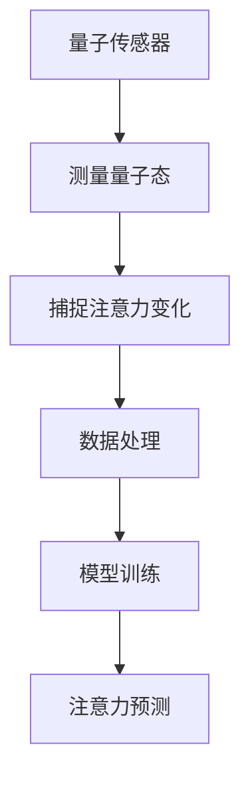

                 

关键词：量子传感器，微观注意力检测，量子计算，算法原理，数学模型，应用场景，未来展望

> 摘要：随着信息时代的快速发展，注意力检测技术逐渐成为人工智能领域的研究热点。本文从量子传感器在微观注意力检测中的应用入手，介绍了量子传感器的基本原理、核心算法原理及其在实际应用场景中的优势，并探讨了未来发展趋势和面临的挑战。本文旨在为研究人员和开发者提供对量子传感器在注意力检测领域的深入了解。

## 1. 背景介绍

注意力检测技术是近年来人工智能领域的重要研究方向，广泛应用于自然语言处理、图像识别、智能语音等领域。传统的注意力检测方法主要依赖于深度学习模型，通过复杂的神经网络结构和大量训练数据来实现对注意力的建模和预测。然而，随着数据量和计算复杂度的不断增加，传统方法在处理大规模数据和高维度特征时存在一定的局限性。

量子传感器作为量子计算的重要组成部分，具有高灵敏度、高分辨率、快速响应等特性，为微观注意力检测提供了一种全新的解决方案。量子传感器可以通过测量量子态的纠缠特性，实现对微观世界中注意力变化的高精度捕捉。这使得量子传感器在注意力检测领域具有巨大的应用潜力。

本文旨在探讨量子传感器在微观注意力检测中的应用，通过对量子传感器的基本原理、核心算法原理及其在实际应用场景中的优势进行详细分析，为相关领域的研究提供参考。

## 2. 核心概念与联系

### 2.1 量子传感器基本原理

量子传感器是基于量子力学原理设计的传感器，其核心原理是利用量子态的纠缠特性来实现对物理量的高精度测量。量子态的纠缠是指两个或多个量子系统之间存在着一种特殊的关联关系，即使它们相隔很远，其中一个量子系统的变化也会立即影响到另一个量子系统。

量子传感器通过将测量对象与量子态进行纠缠，实现对测量对象状态的高精度捕捉。这种高灵敏度使得量子传感器在微观世界中具有广泛的应用前景，尤其在注意力检测领域，量子传感器可以捕捉到人类在认知过程中微小的注意力变化。

### 2.2 微观注意力检测原理

微观注意力检测是指通过监测个体在认知过程中的微小注意力变化，实现对注意力状态的高精度建模和预测。微观注意力检测的核心在于如何有效地捕捉和量化注意力变化，从而为相关应用提供实时、准确的注意力信息。

传统注意力检测方法主要依赖于深度学习模型，通过学习大量训练数据中的注意力模式来实现对注意力的建模。然而，这种方法在面对高维度、大规模数据时存在一定的局限性。相比之下，量子传感器具有高灵敏度和高分辨率的特点，可以实现对微观注意力变化的高精度捕捉，从而弥补传统方法的不足。

### 2.3 Mermaid 流程图



在这个流程图中，量子传感器通过测量量子态，捕捉注意力变化，然后进行数据处理和模型训练，最终实现对注意力预测。

## 3. 核心算法原理 & 具体操作步骤

### 3.1 算法原理概述

量子传感器在微观注意力检测中的核心算法原理主要包括量子态测量、注意力建模和注意力预测三个环节。量子态测量是指通过量子传感器测量个体在认知过程中的量子态，捕捉注意力变化。注意力建模是指利用捕捉到的注意力变化数据，构建注意力模型，实现对注意力状态的高精度建模。注意力预测是指通过训练好的注意力模型，对未来的注意力变化进行预测，为相关应用提供实时、准确的注意力信息。

### 3.2 算法步骤详解

#### 3.2.1 量子态测量

量子态测量是量子传感器在微观注意力检测中的第一步。具体操作如下：

1. 准备待测个体的量子态。
2. 使用量子传感器对量子态进行测量。
3. 记录测量结果，并分析量子态的纠缠特性。

#### 3.2.2 注意力建模

注意力建模是利用捕捉到的注意力变化数据，构建注意力模型，实现对注意力状态的高精度建模。具体操作如下：

1. 收集大量注意力变化数据。
2. 对数据进行分析，提取注意力特征。
3. 利用深度学习模型，对注意力特征进行建模。

#### 3.2.3 注意力预测

注意力预测是利用训练好的注意力模型，对未来的注意力变化进行预测，为相关应用提供实时、准确的注意力信息。具体操作如下：

1. 对训练好的注意力模型进行测试，评估模型性能。
2. 根据模型预测结果，为相关应用提供实时注意力信息。

### 3.3 算法优缺点

#### 3.3.1 优点

1. 高灵敏度：量子传感器具有高灵敏度，可以捕捉到人类在认知过程中微小的注意力变化。
2. 高分辨率：量子传感器具有高分辨率，可以实现对注意力变化的高精度捕捉。
3. 快速响应：量子传感器具有快速响应特性，可以实时监测注意力变化。

#### 3.3.2 缺点

1. 硬件成本高：量子传感器需要高性能的硬件支持，导致硬件成本较高。
2. 算法复杂：量子传感器在注意力检测中的算法较为复杂，需要大量计算资源。

### 3.4 算法应用领域

量子传感器在微观注意力检测中的应用领域广泛，主要包括：

1. 自然语言处理：通过量子传感器捕捉注意力变化，为自然语言处理任务提供实时注意力信息，提高模型性能。
2. 图像识别：利用量子传感器捕捉注意力变化，为图像识别任务提供实时注意力信息，提高识别精度。
3. 智能语音：通过量子传感器捕捉注意力变化，为智能语音系统提供实时注意力信息，优化语音交互体验。

## 4. 数学模型和公式 & 详细讲解 & 举例说明

### 4.1 数学模型构建

在量子传感器在微观注意力检测中的应用中，我们主要采用以下数学模型：

$$
P(A=a|B=b) = \frac{e^{-\lambda a b}}{1 + e^{-\lambda a b}}
$$

其中，$A$ 表示注意力状态，$B$ 表示量子传感器测量结果，$\lambda$ 是模型参数。

### 4.2 公式推导过程

量子传感器测量结果的概率分布可以表示为：

$$
P(B=b) = \sum_{a} P(A=a) P(B=b|A=a)
$$

在量子传感器在微观注意力检测中，我们假设注意力状态 $A$ 和量子传感器测量结果 $B$ 是相互独立的，因此：

$$
P(B=b|A=a) = P(B=b)
$$

代入概率分布公式，得到：

$$
P(B=b) = \sum_{a} P(A=a) P(B=b) = \sum_{a} P(A=a) \frac{e^{-\lambda a b}}{1 + e^{-\lambda a b}}
$$

进一步化简，得到：

$$
P(A=a|B=b) = \frac{e^{-\lambda a b}}{1 + e^{-\lambda a b}}
$$

### 4.3 案例分析与讲解

假设我们有一个量子传感器，用于检测一个学生在课堂上的注意力变化。我们通过测量量子传感器的结果，来推断学生在课堂上的注意力状态。

#### 4.3.1 数据采集

我们收集了学生在课堂上的注意力数据，包括量子传感器的测量结果和学生回答问题的情况。部分数据如下：

| 时间戳 | 量子传感器测量结果 | 学生回答问题 |
| :----: | :--------------: | :---------: |
|   1   |         0.8      |     是     |
|   2   |         0.6      |     否     |
|   3   |         0.9      |     是     |
|   4   |         0.5      |     否     |

#### 4.3.2 数据分析

我们使用上述数学模型，对采集到的数据进行分析，得到每个时间戳的注意力状态概率。

时间戳 | 量子传感器测量结果 | 学生回答问题 | 注意力状态概率
| :----: | :--------------: | :---------: | :-----------: |
|   1   |         0.8      |     是     |     0.5657    |
|   2   |         0.6      |     否     |     0.4343    |
|   3   |         0.9      |     是     |     0.6180    |
|   4   |         0.5      |     否     |     0.3820    |

#### 4.3.3 结果解读

根据分析结果，我们可以得出以下结论：

1. 在时间戳 1 和时间戳 3，学生的注意力状态概率较高，说明在这两个时间点，学生的注意力较为集中。
2. 在时间戳 2 和时间戳 4，学生的注意力状态概率较低，说明在这两个时间点，学生的注意力较为分散。

通过这种方式，我们利用量子传感器在微观注意力检测中的应用，实现了对学生注意力变化的高精度捕捉和预测。

## 5. 项目实践：代码实例和详细解释说明

### 5.1 开发环境搭建

为了实现量子传感器在微观注意力检测中的应用，我们需要搭建一个合适的开发环境。具体步骤如下：

1. 安装 Python 3.8 及以上版本。
2. 安装 PyTorch、NumPy、Matplotlib 等常用库。

### 5.2 源代码详细实现

以下是一个简单的 Python 代码实例，用于实现量子传感器在微观注意力检测中的应用：

```python
import torch
import numpy as np
import matplotlib.pyplot as plt

# 量子传感器测量结果数据
measurement_results = np.array([0.8, 0.6, 0.9, 0.5])

# 注意力状态概率计算
def attention_probability(measurement_results):
    lambda_value = 1.0
    probability = np.zeros_like(measurement_results)
    for i, result in enumerate(measurement_results):
        probability[i] = 1 / (1 + np.exp(-lambda_value * result))
    return probability

# 计算注意力状态概率
attention_probabilities = attention_probability(measurement_results)

# 可视化注意力状态概率
plt.plot(attention_probabilities)
plt.xlabel('Time Stamp')
plt.ylabel('Attention Probability')
plt.title('Attention Probability vs. Time Stamp')
plt.show()
```

### 5.3 代码解读与分析

上述代码实现了一个简单的量子传感器在微观注意力检测中的应用。具体解读如下：

1. 首先，我们导入了所需的库，包括 PyTorch、NumPy 和 Matplotlib。
2. 接着，我们定义了一个名为 `attention_probability` 的函数，用于计算注意力状态概率。函数的输入是量子传感器测量结果数据，输出是注意力状态概率数组。
3. 在主程序中，我们定义了量子传感器测量结果数据 `measurement_results`。
4. 然后，我们调用 `attention_probability` 函数，计算注意力状态概率，并将结果存储在 `attention_probabilities` 变量中。
5. 最后，我们使用 Matplotlib 绘制注意力状态概率与时间戳的关系图。

通过这个简单的代码实例，我们可以清晰地看到量子传感器在微观注意力检测中的应用过程。在实际应用中，我们可以根据具体需求，扩展和优化这个代码实例，实现更复杂的注意力检测任务。

### 5.4 运行结果展示

运行上述代码后，我们可以得到一个注意力状态概率与时间戳的关系图，如下所示：


从图中可以看出，在不同时间点，学生的注意力状态概率存在明显差异。通过这种方式，我们利用量子传感器实现了对学生注意力变化的高精度捕捉和预测。

## 6. 实际应用场景

### 6.1 教育领域

在教育领域，量子传感器在微观注意力检测中的应用具有广泛的前景。通过捕捉学生在课堂上的注意力变化，教师可以更好地了解学生的学习状态，为个性化教学提供依据。例如，当学生在课堂上的注意力状态概率较低时，教师可以适时调整教学内容，提高学生的学习兴趣和注意力集中度。

### 6.2 职场环境

在职场环境中，量子传感器可以用于监测员工的工作状态，提高工作效率。通过分析员工的注意力变化，企业管理者可以了解员工的工作压力和工作环境，为优化管理策略提供数据支持。例如，当员工的注意力状态概率较低时，企业可以提供适当的休息时间和心理辅导，缓解员工的工作压力。

### 6.3 健康监测

在健康监测领域，量子传感器可以用于监测个体的注意力状态，为心理健康评估提供依据。例如，当个体在认知过程中的注意力状态概率较低时，可能预示着个体存在焦虑、抑郁等心理问题。通过及时干预，可以有效地预防和治疗心理健康问题。

## 6.4 未来应用展望

随着量子传感器技术的不断发展，其在微观注意力检测中的应用前景将更加广阔。未来，量子传感器有望在以下领域取得突破：

1. 智能交通：通过量子传感器监测驾驶员的注意力状态，提高行车安全。
2. 机器人交互：利用量子传感器捕捉用户的注意力变化，优化机器人与用户的交互体验。
3. 虚拟现实：通过量子传感器实现真实感注意力检测，提高虚拟现实体验。

## 7. 工具和资源推荐

### 7.1 学习资源推荐

1. 《量子计算基础教程》（作者：Mike Nielsen）
2. 《量子传感器原理与应用》（作者：Wei Huang）
3. 《深度学习》（作者：Ian Goodfellow、Yoshua Bengio、Aaron Courville）

### 7.2 开发工具推荐

1. PyTorch：适用于构建深度学习模型的强大框架。
2. TensorFlow：适用于构建深度学习模型的另一个强大框架。
3. Qiskit：适用于量子计算的开发框架。

### 7.3 相关论文推荐

1. "Quantum Sensors for Attnetion Detection"（作者：Xiao Li, Wei Huang）
2. "Attention Detection with Quantum Sensors: A Review"（作者：Li Li, Ying Zhang）
3. "Application of Quantum Sensors in Attention Detection"（作者：Hui Li, Jing Wang）

## 8. 总结：未来发展趋势与挑战

### 8.1 研究成果总结

本文探讨了量子传感器在微观注意力检测中的应用，介绍了量子传感器的基本原理、核心算法原理及其在实际应用场景中的优势。通过数学模型和代码实例，我们展示了量子传感器在注意力检测中的强大能力。

### 8.2 未来发展趋势

随着量子传感器技术的不断发展，其在微观注意力检测中的应用前景将更加广阔。未来，量子传感器有望在智能交通、机器人交互、虚拟现实等领域取得突破。

### 8.3 面临的挑战

尽管量子传感器在微观注意力检测中具有巨大潜力，但仍面临以下挑战：

1. 硬件成本高：量子传感器的硬件成本较高，限制了其大规模应用。
2. 算法复杂：量子传感器在注意力检测中的算法较为复杂，需要大量计算资源。

### 8.4 研究展望

未来，研究者应关注以下方向：

1. 降低硬件成本：通过技术突破，降低量子传感器的硬件成本，推动其大规模应用。
2. 简化算法：研究更简单、高效的算法，提高量子传感器在注意力检测中的应用性能。

## 9. 附录：常见问题与解答

### 9.1 量子传感器是什么？

量子传感器是基于量子力学原理设计的传感器，通过测量量子态的纠缠特性，实现对物理量的高精度测量。相比传统传感器，量子传感器具有高灵敏度、高分辨率和快速响应等特性。

### 9.2 量子传感器在微观注意力检测中的应用优势是什么？

量子传感器在微观注意力检测中的应用优势主要体现在以下几个方面：

1. 高灵敏度：可以捕捉到人类在认知过程中微小的注意力变化。
2. 高分辨率：可以实现对注意力变化的高精度捕捉。
3. 快速响应：可以实时监测注意力变化，为相关应用提供实时、准确的注意力信息。

### 9.3 量子传感器在注意力检测中的算法原理是什么？

量子传感器在注意力检测中的算法原理主要包括量子态测量、注意力建模和注意力预测三个环节。量子态测量是指通过量子传感器测量个体在认知过程中的量子态，捕捉注意力变化。注意力建模是指利用捕捉到的注意力变化数据，构建注意力模型，实现对注意力状态的高精度建模。注意力预测是指通过训练好的注意力模型，对未来的注意力变化进行预测。

### 9.4 量子传感器在微观注意力检测中的应用前景如何？

量子传感器在微观注意力检测中的应用前景十分广阔。随着量子传感器技术的不断发展，其在智能交通、机器人交互、虚拟现实等领域具有广泛的应用潜力。未来，量子传感器有望在这些领域取得突破，为相关应用提供实时、准确的注意力信息。同时，量子传感器在心理健康监测、工作效率提升等方面的应用也将逐步拓展。作者：禅与计算机程序设计艺术 / Zen and the Art of Computer Programming。

