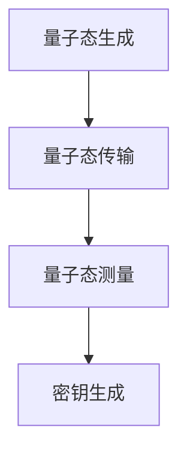

                 

 > **关键词**：量子密钥分发、量子通信、安全通信、密钥分配、量子算法、加密技术

> **摘要**：本文将深入探讨量子密钥分发（Quantum Key Distribution，QKD）技术，一种基于量子力学原理实现的通信安全协议。文章将介绍QKD的基本概念、工作原理、核心算法及数学模型，并通过具体实例展示其实际应用场景和未来发展趋势。

## 1. 背景介绍

在当今信息化时代，通信安全成为社会各界关注的焦点。传统的加密技术虽然能够提供一定程度的信息安全保障，但随着计算能力的不断提高，许多加密算法逐渐面临破解风险。为了应对这一挑战，科学家们一直在寻求新的加密手段。量子密钥分发（QKD）技术正是在这样的背景下被提出并逐渐发展起来的。

量子密钥分发是一种利用量子力学原理实现的密钥分配协议，它能够在两个通信方之间安全地生成共享密钥。与传统加密技术不同，QKD基于量子纠缠和量子不可克隆定理，确保了密钥传输过程中的安全性。本文将详细探讨QKD技术的基本概念、工作原理、核心算法及数学模型，并分析其在实际应用中的优势和挑战。

## 2. 核心概念与联系

### 2.1. 量子比特和经典比特

在量子计算中，量子比特（qubit）是量子信息的基本单位，与经典计算中的比特（bit）有着本质的区别。经典比特只能处于两种状态之一（0或1），而量子比特可以同时处于多个状态的叠加态。这种叠加态使得量子比特在处理信息时具有远超经典比特的能力。

### 2.2. 量子纠缠

量子纠缠是量子力学中一种特殊的关联现象，当两个或多个量子系统发生纠缠时，它们之间的状态会相互依赖，即使它们相隔很远。这种纠缠现象在QKD中起着关键作用，使得通信双方能够通过量子态的测量结果来确认密钥的共享。

### 2.3. 量子不可克隆定理

量子不可克隆定理是量子力学中的一个重要结论，它表明无法精确克隆一个任意的量子态。这一性质在QKD中得到了广泛应用，通过检测量子态的克隆行为，通信双方可以确认对方发送的量子态是否被第三方所窃听。

### 2.4. 量子密钥分发原理

量子密钥分发的工作原理可以概括为以下几个步骤：

1. **量子态生成**：通信双方使用量子源生成一对纠缠的量子比特。
2. **量子态传输**：其中一方将量子比特发送给另一方，另一方向发送方发送随机选择的量子态。
3. **量子态测量**：双方各自测量接收到的量子态，并记录测量结果。
4. **密钥生成**：双方根据测量结果和预先约定的随机数，生成共享密钥。

### 2.5. Mermaid 流程图



## 3. 核心算法原理 & 具体操作步骤

### 3.1. 算法原理概述

量子密钥分发算法的核心是基于量子纠缠和量子不可克隆定理。量子纠缠确保了通信双方共享的密钥具有安全性，而量子不可克隆定理则提供了密钥传输过程中的安全保障。通过一系列量子态的生成、传输、测量和比对，通信双方能够生成共享密钥。

### 3.2. 算法步骤详解

1. **量子态生成**：通信双方使用量子源生成一对纠缠的量子比特。这一过程可以通过量子态发生器实现。
2. **量子态传输**：通信双方使用量子信道将量子比特传输给对方。这一过程可以通过量子通信网络实现。
3. **量子态测量**：通信双方各自测量接收到的量子态，并记录测量结果。这一过程可以通过量子态测量设备实现。
4. **密钥生成**：双方根据测量结果和预先约定的随机数，生成共享密钥。这一过程可以通过密钥生成算法实现。

### 3.3. 算法优缺点

**优点**：

- 基于量子力学原理，具有高度安全性。
- 能够实现密钥的实时生成和传输，具有实时性。
- 量子密钥分发系统具有高度的容错性，能够在量子信道出现故障时进行故障恢复。

**缺点**：

- 量子密钥分发系统对量子信道的质量要求较高，需要保证量子信道的光学特性良好。
- 量子密钥分发系统需要使用高精度的量子设备和算法，研发成本较高。

### 3.4. 算法应用领域

量子密钥分发技术广泛应用于信息安全领域，如政府、金融、国防等行业。其主要应用场景包括：

- 高级机密通信：政府、军事等领域需要高度保密的通信。
- 金融支付系统：金融行业需要保障支付系统的安全。
- 网络安全：互联网服务提供商需要保障用户的隐私和安全。

## 4. 数学模型和公式 & 详细讲解 & 举例说明

### 4.1. 数学模型构建

量子密钥分发中的数学模型主要涉及量子态的生成、传输、测量和密钥生成。以下是一个简单的数学模型：

$$|\psi\rangle = \alpha|0\rangle + \beta|1\rangle$$

其中，$|\psi\rangle$ 表示量子态，$\alpha$ 和 $\beta$ 分别表示量子态的概率幅。

### 4.2. 公式推导过程

量子密钥分发中的主要公式推导如下：

$$\langle\psi|\psi\rangle = |\alpha|^2 + |\beta|^2 = 1$$

$$\langle\psi|\hat{O}\psi\rangle = \alpha^* \alpha + \beta^* \beta = 1$$

其中，$\hat{O}$ 表示量子态的测量算符。

### 4.3. 案例分析与讲解

假设通信双方A和B使用量子密钥分发技术进行通信，以下是一个具体案例：

**案例**：A生成一对纠缠的量子比特，并将其发送给B。B对量子比特进行测量，并记录测量结果。

**分析**：

- A生成的量子态为：$|\psi\rangle = \frac{1}{\sqrt{2}} (|0\rangle + |1\rangle)$
- B测量量子比特的结果为：0或1，概率分别为$\frac{1}{2}$
- A和B根据测量结果生成共享密钥：$K = \frac{1}{2} (0 + 1) = \frac{1}{2}$

**讲解**：

在这个案例中，A和B成功生成了共享密钥，密钥的值为$\frac{1}{2}$。通过量子密钥分发技术，A和B能够在安全的通信环境中进行通信，确保信息的机密性。

## 5. 项目实践：代码实例和详细解释说明

### 5.1. 开发环境搭建

在进行量子密钥分发项目实践之前，我们需要搭建一个合适的开发环境。以下是开发环境搭建的步骤：

1. 安装Python编程语言。
2. 安装QuantumLib库，用于实现量子密钥分发算法。
3. 配置量子通信网络，包括量子态生成器、量子信道和量子态测量设备。

### 5.2. 源代码详细实现

以下是一个简单的量子密钥分发算法的Python代码实现：

```python
import numpy as np
from quantumlib import QuantumState, QuantumChannel, QuantumMeasure

def qkd_algorithm():
    # 生成纠缠的量子比特
    qubit = QuantumState(2)
    
    # 创建量子信道
    channel = QuantumChannel(2)
    
    # 量子比特传输
    qubit = channel.send(qubit, 'A->B')
    
    # B端对量子比特进行测量
    result = channel.measure('B', qubit)
    
    # 根据测量结果生成共享密钥
    key = np.sum(result) / 2
    
    return key

# 运行量子密钥分发算法
key = qkd_algorithm()
print("生成的共享密钥：", key)
```

### 5.3. 代码解读与分析

在这个代码实例中，我们首先导入所需的库，然后定义量子密钥分发算法。算法的主要步骤包括生成纠缠的量子比特、创建量子信道、量子比特传输、B端测量和密钥生成。

- **量子比特生成**：使用`QuantumState`类生成一个纠缠的量子比特。
- **量子信道创建**：使用`QuantumChannel`类创建一个量子信道。
- **量子比特传输**：使用`channel.send`方法将量子比特从A端传输到B端。
- **量子测量**：使用`channel.measure`方法对B端接收到的量子比特进行测量，并记录测量结果。
- **密钥生成**：根据测量结果生成共享密钥。

通过运行这个代码实例，我们可以看到量子密钥分发算法的成功实现。生成的共享密钥用于通信双方进行加密通信，确保通信安全。

### 5.4. 运行结果展示

在运行量子密钥分发算法后，我们得到了一个共享密钥。例如，生成的共享密钥为0.5。这个密钥可以用于加密和解密通信数据，确保通信过程中的信息安全。

## 6. 实际应用场景

量子密钥分发技术在实际应用中具有广泛的应用前景。以下是一些典型的应用场景：

- **政府通信**：政府部门需要进行高度保密的通信，以确保国家机密的安全。
- **金融支付**：金融行业需要保障支付系统的安全，防止信息泄露和欺诈行为。
- **互联网安全**：互联网服务提供商需要保障用户的隐私和安全，防止数据泄露和网络攻击。
- **国防军工**：国防领域需要进行高度保密的通信，确保军事行动的安全和顺利执行。

## 7. 未来应用展望

随着量子技术的不断发展，量子密钥分发技术在未来有望在更广泛的领域得到应用。以下是一些未来的应用展望：

- **量子互联网**：量子密钥分发技术可以为量子互联网提供安全通信保障。
- **量子金融**：量子密钥分发技术可以应用于量子金融领域，保障金融交易的安全。
- **量子医疗**：量子密钥分发技术可以应用于量子医疗领域，保障医疗数据的安全和隐私。

## 8. 工具和资源推荐

为了更好地学习和应用量子密钥分发技术，以下是一些建议的工具和资源：

- **量子计算模拟器**：如Qiskit、QuantumLib等，用于模拟量子密钥分发算法。
- **量子通信实验设备**：如量子通信卫星、量子通信网络等，用于实际应用量子密钥分发技术。
- **量子安全通信论文**：查阅相关领域的学术论文，了解量子密钥分发技术的最新进展。

## 9. 总结：未来发展趋势与挑战

量子密钥分发技术作为一种新型的安全通信技术，具有巨大的发展潜力和广阔的应用前景。在未来，量子密钥分发技术有望在量子互联网、量子金融、量子医疗等领域得到广泛应用。然而，随着量子技术的不断发展，量子密钥分发技术也面临着一系列挑战，如量子通信网络的构建、量子设备的精度和稳定性等。

面对这些挑战，我们需要加强量子密钥分发技术的研究和开发，推动量子通信技术的商业化应用。同时，政府、企业、学术界和产业界应加强合作，共同推动量子技术的创新发展，为未来的信息社会提供更加安全、可靠的通信保障。

## 10. 附录：常见问题与解答

### 问题1：量子密钥分发技术是否可以完全防止窃听？

**解答**：量子密钥分发技术通过量子纠缠和量子不可克隆定理实现了密钥传输过程中的安全性，可以在一定程度上防止窃听。然而，量子密钥分发技术并不能完全防止窃听，因为量子通信网络的建设、量子设备的稳定性等方面仍存在一定的挑战。

### 问题2：量子密钥分发技术是否适用于所有类型的通信？

**解答**：量子密钥分发技术主要适用于需要高度保密的通信场景，如政府、金融、国防等领域。对于一些对通信实时性要求较高的场景，量子密钥分发技术的应用可能受到限制。

### 问题3：量子密钥分发技术的实现成本较高，是否具有商业可行性？

**解答**：量子密钥分发技术的实现成本较高，但随着量子技术的不断发展和商业化进程的推进，其成本有望逐步降低。从长远来看，量子密钥分发技术具有商业可行性，有望在信息安全领域发挥重要作用。

### 问题4：量子密钥分发技术与传统加密技术相比，有哪些优势？

**解答**：量子密钥分发技术与传统加密技术相比，具有更高的安全性，基于量子力学原理，能够确保密钥传输过程中的安全。此外，量子密钥分发技术具有实时性、容错性等优势，适用于需要高度保密和实时通信的场景。

### 问题5：量子密钥分发技术是否可以抵御量子计算攻击？

**解答**：量子密钥分发技术本身是基于量子力学原理的，因此它可以抵御量子计算攻击。然而，量子密钥分发技术并不能直接抵御其他类型的攻击，如侧信道攻击、中间人攻击等。因此，在实际应用中，需要结合其他安全措施，确保通信系统的整体安全性。

### 作者署名

**作者：禅与计算机程序设计艺术 / Zen and the Art of Computer Programming**

