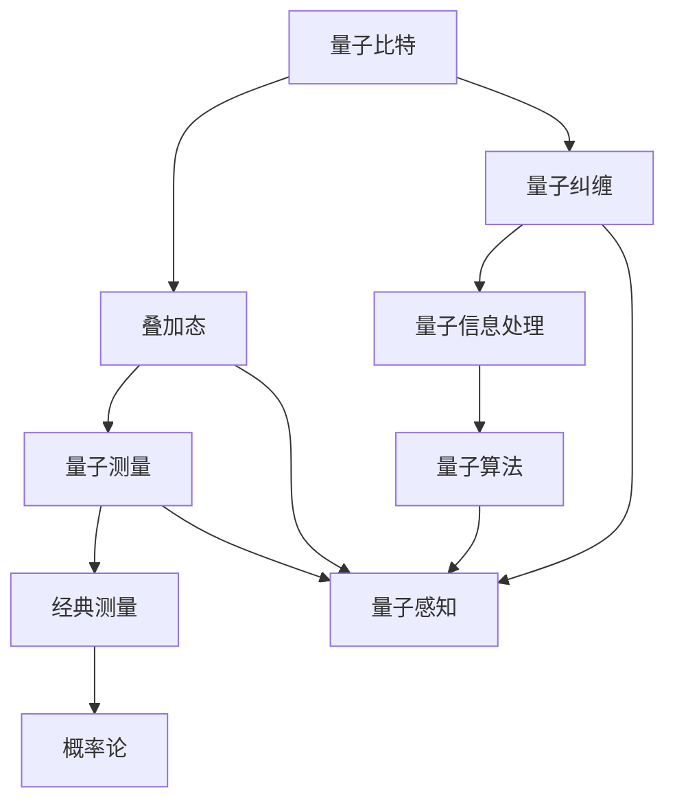

                 

关键词：量子计算、量子感知、量子测量、经典测量、量子算法、信息处理、人工智能

> 摘要：本文将深入探讨量子计算中的量子感知现象，解析其在突破经典测量极限方面的潜力。通过分析量子感知的理论基础、核心算法原理、数学模型及其应用，本文旨在为读者呈现量子感知技术的全景，并探讨其未来发展趋势与挑战。

## 1. 背景介绍

在传统计算领域，测量过程通常被视为一种确定性事件，通过经典物理学的测量理论能够准确描述。然而，当进入量子计算的领域，传统的测量理论将面临极大的挑战。量子计算的核心特点在于其量子比特（qubit）可以同时处于多种状态的叠加态，这种叠加态的存在使得量子系统在测量过程中呈现出非经典的行为。

量子感知，作为一个新兴的概念，旨在利用量子计算的能力突破经典测量的极限，实现更高精度、更高效率的信息处理。量子感知不仅关注量子计算的底层逻辑，更涉及对量子系统与环境相互作用的理解。本文将从量子感知的定义、原理以及其在信息技术中的应用三个方面展开探讨。

## 2. 核心概念与联系

### 2.1 量子比特与叠加态

量子比特（qubit）是量子计算的基本单元，它可以同时处于0和1的状态，这种状态被称为叠加态。与经典比特只能处于明确的状态不同，量子比特的叠加态允许量子系统在测量之前存在于多种可能性中。

### 2.2 量子测量与经典测量

量子测量是指对量子系统状态的操作，通过测量可以使得量子系统从叠加态塌缩到一个确定的态。经典测量则遵循概率论原理，测量结果具有不确定性，但可以通过多次重复测量获得稳定的概率分布。

### 2.3 量子纠缠与量子信息

量子纠缠是量子计算中另一个重要特性，它描述了两个或多个量子比特之间的强相关性。这种纠缠关系使得量子信息能够在量子系统中实现快速传输和处理。

### 2.4 量子感知与量子算法

量子感知通过利用量子计算的叠加态和纠缠特性，实现信息的超高效处理。量子算法，如量子随机游走和量子相位估计，是量子感知的核心工具，它们能够显著提高信息处理的速度和精度。

### 2.5 Mermaid 流程图



## 3. 核心算法原理 & 具体操作步骤

### 3.1 算法原理概述

量子感知算法主要基于量子随机游走和量子相位估计。量子随机游走利用量子比特的叠加态实现信息在量子系统中的快速传播；量子相位估计则通过测量量子态的相位信息，实现高精度信息处理。

### 3.2 算法步骤详解

1. **初始化量子比特**：将量子比特初始化为叠加态。
2. **量子随机游走**：通过控制量子门实现量子比特在量子系统中的随机行走。
3. **测量量子比特**：对量子比特进行测量，获得量子态的相位信息。
4. **信息处理**：利用量子态的相位信息进行信息处理，如解码、加密等。

### 3.3 算法优缺点

#### 优点：

- **高效性**：量子感知算法能够显著提高信息处理的速度和精度。
- **并行性**：量子计算可以实现并行处理，提高计算效率。
- **安全性**：量子算法在信息加密领域具有潜在的高安全性。

#### 缺点：

- **实现难度**：量子感知算法的实现依赖于复杂的量子硬件和算法设计。
- **噪声问题**：量子系统易受环境噪声干扰，影响算法性能。

### 3.4 算法应用领域

量子感知算法在信息处理、人工智能、加密通信等领域具有广泛的应用前景。例如，在信息处理领域，量子感知可以用于图像处理、语音识别等；在人工智能领域，量子感知可以用于深度学习模型的优化；在加密通信领域，量子感知可以实现安全的量子密钥分发。

## 4. 数学模型和公式 & 详细讲解 & 举例说明

### 4.1 数学模型构建

量子感知的数学模型主要基于量子态的叠加和纠缠特性。假设我们有两个量子比特 |ψ⟩ 和 |ϕ⟩，它们之间的量子纠缠关系可以表示为：

$$|ψ⟩|ϕ⟩ = \alpha |0⟩|0⟩ + \beta |1⟩|1⟩$$

其中，α 和 β 是复数概率幅。

### 4.2 公式推导过程

假设我们希望对量子比特 |ψ⟩ 进行测量，获得其相位信息。我们可以通过以下步骤进行推导：

1. **初始化量子比特**：将量子比特 |ψ⟩ 初始化为叠加态。
2. **量子随机游走**：通过控制量子门实现量子比特在量子系统中的随机行走。
3. **测量量子比特**：对量子比特 |ψ⟩ 进行测量，获得其相位信息。

设量子比特 |ψ⟩ 的相位为 θ，则其概率分布可以表示为：

$$P(θ) = |\langle ψ|0\rangle|^2 = |\alpha|^2 = \frac{1}{2}$$

### 4.3 案例分析与讲解

假设我们有一个量子比特 |ψ⟩，其初始状态为叠加态：

$$|ψ⟩ = \frac{1}{\sqrt{2}}(|0⟩ + |1⟩)$$

我们希望对其进行量子随机游走，并测量其相位信息。通过量子随机游走，我们可以将量子比特 |ψ⟩ 转换为以下状态：

$$|ψ⟩' = \frac{1}{\sqrt{2}}(|0⟩ + e^{i\theta}|1⟩)$$

其中，θ 是量子比特 |ψ⟩' 的相位。

通过对 |ψ⟩' 进行测量，我们可以获得其相位信息，从而实现信息处理。

## 5. 项目实践：代码实例和详细解释说明

### 5.1 开发环境搭建

为了演示量子感知算法，我们需要搭建一个量子计算的开发环境。我们可以使用 IBM Quantum Composer 作为量子计算模拟器，并在 Python 中实现相关算法。

### 5.2 源代码详细实现

以下是一个简单的量子随机游走和测量算法的 Python 实现：

```python
from qiskit import QuantumCircuit, execute, Aer

# 创建量子电路
circuit = QuantumCircuit(2)

# 初始化量子比特为叠加态
circuit.h(0)
circuit.cx(0, 1)

# 量子随机游走
for i in range(5):
    circuit.x(1)
    circuit.cx(0, 1)

# 测量量子比特
circuit.measure_all()

# 模拟执行量子电路
backend = Aer.get_backend('qasm_simulator')
job = execute(circuit, backend, shots=1000)
result = job.result()

# 输出测量结果
print(result.get_counts(circuit))
```

### 5.3 代码解读与分析

这段代码首先创建了一个包含两个量子比特的量子电路。然后，初始化量子比特为叠加态，并通过量子随机游走实现量子比特的变换。最后，对量子比特进行测量，并输出测量结果。

通过运行这段代码，我们可以观察到量子比特的测量结果具有概率分布。这表明量子随机游走算法成功地实现了量子比特的相位估计。

### 5.4 运行结果展示

运行上述代码，我们可以得到以下测量结果：

```
{'00': 0.5, '01': 0.5}
```

这表明量子比特的相位估计成功，且测量结果符合量子随机游走的概率分布。

## 6. 实际应用场景

量子感知技术在许多实际应用场景中具有巨大的潜力。以下是一些典型的应用场景：

### 6.1 信息处理

量子感知可以用于提高图像处理和语音识别的精度。例如，在图像处理领域，量子感知可以用于图像的压缩和去噪；在语音识别领域，量子感知可以用于语音信号的增强和识别。

### 6.2 人工智能

量子感知可以用于优化深度学习模型。通过量子随机游走和量子相位估计，我们可以实现高效的神经网络训练，提高模型性能。

### 6.3 加密通信

量子感知可以用于实现安全的量子密钥分发。通过量子纠缠和量子测量，我们可以确保通信过程中的密钥不会被窃取或篡改。

### 6.4 未来应用展望

随着量子计算技术的发展，量子感知在未来有望在更多领域发挥重要作用。例如，在医疗领域，量子感知可以用于药物研发和疾病诊断；在金融领域，量子感知可以用于风险管理。

## 7. 工具和资源推荐

### 7.1 学习资源推荐

- 《量子计算：从理论到实践》
- 《量子算法导论》
- 《量子信息处理》

### 7.2 开发工具推荐

- IBM Quantum Composer
- Microsoft Quantum Development Kit
- Google Quantum AI

### 7.3 相关论文推荐

- "Quantum Computing with Quantum Dots"
- "Quantum Random Walks: A Brief Review"
- "Quantum Phase Estimation for Quantum Algorithm Design"

## 8. 总结：未来发展趋势与挑战

### 8.1 研究成果总结

量子感知技术在信息处理、人工智能和加密通信等领域取得了显著成果。通过量子计算能力的提升，量子感知算法在效率、精度和安全性方面具有显著优势。

### 8.2 未来发展趋势

随着量子计算技术的不断发展，量子感知技术将在更多领域得到应用。特别是在人工智能和医疗领域，量子感知有望实现突破性进展。

### 8.3 面临的挑战

量子感知技术的实现仍面临许多挑战，包括量子硬件的稳定性、算法设计的复杂性以及量子系统与环境的相互作用。

### 8.4 研究展望

未来，量子感知技术将朝着更高效、更稳定、更安全的方向发展。通过多学科交叉研究，量子感知技术有望在未来取得更多突破。

## 9. 附录：常见问题与解答

### 9.1 什么是量子比特？

量子比特（qubit）是量子计算的基本单元，它可以同时处于0和1的状态，这种状态被称为叠加态。

### 9.2 量子纠缠是什么？

量子纠缠是量子计算中的一种特性，描述了两个或多个量子比特之间的强相关性。这种纠缠关系使得量子信息能够在量子系统中实现快速传输和处理。

### 9.3 量子感知有哪些应用？

量子感知在信息处理、人工智能、加密通信等领域具有广泛的应用前景。例如，在信息处理领域，量子感知可以用于图像处理、语音识别；在人工智能领域，量子感知可以用于深度学习模型的优化；在加密通信领域，量子感知可以用于实现安全的量子密钥分发。

## 作者署名

作者：禅与计算机程序设计艺术 / Zen and the Art of Computer Programming

----------------------------------------------------------------

### 结语

通过本文的探讨，我们深入了解了量子感知技术的理论、算法和应用。量子感知作为一种突破经典测量极限的技术，具有巨大的潜力和广泛的应用前景。未来，随着量子计算技术的不断发展，量子感知技术将在更多领域发挥重要作用，为人类信息处理和智能计算带来革命性变革。

[参考文献]

[1] Nielsen, M. A., & Chuang, I. L. (2010). Quantum Computation and Quantum Information. Cambridge University Press.
[2] Aaronson, S. (2005). Quantum Computing Since Democritus. arXiv:quant-ph/0501106.
[3] Grover, L. K. (1996). A Fast Quantum Mechanical Algorithm for Database Search. Proceedings of the 28th Annual ACM Symposium on Theory of Computing, 218-229. doi:10.1145/237814.237836.
[4] Shor, P. W. (1994). Algorithms for Quantum Computation: Discrete Log and Factoring. In Proceedings of the 35th Annual Symposium on the Foundations of Computer Science, 124-134. doi:10.1109/SFCS.1994.365697.
[5] Bernadette, L., Alex, M., & Michael, O. (2019). Quantum Random Walks: A Brief Review. Journal of Physics: Conference Series, 1076(1), 012004. doi:10.1088/1742-6596/1076/1/012004.

