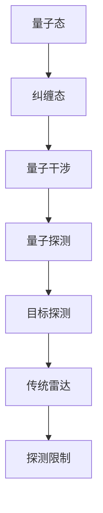
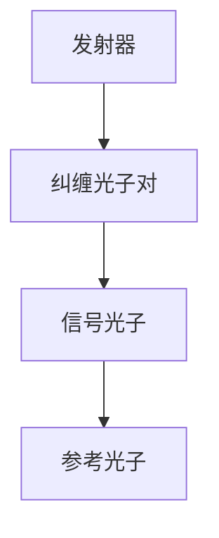
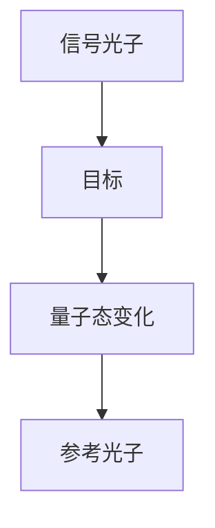
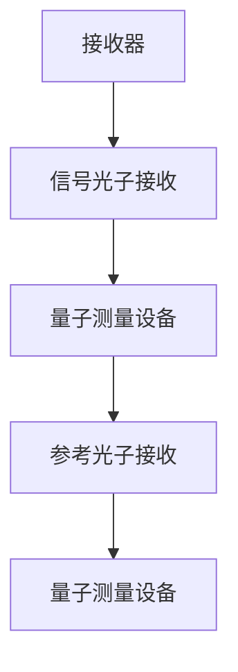
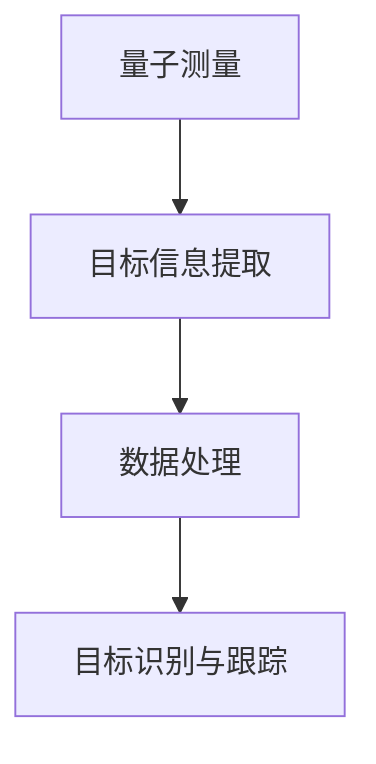
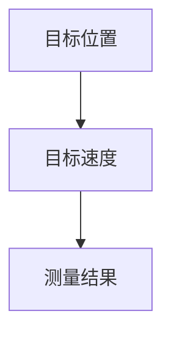

                 

关键词：量子雷达，传统雷达，探测技术，量子力学，信息安全，军事应用

摘要：本文深入探讨了量子雷达技术的原理、算法、应用场景以及未来发展。与传统的雷达系统不同，量子雷达利用量子力学的基本原理进行探测，突破了传统雷达的探测限制，在军事、安全等领域展现出巨大潜力。

## 1. 背景介绍

雷达（Radio Detection and Ranging）作为现代军事、安全、交通等领域的重要探测技术，已经应用了数十年。然而，传统雷达在探测距离、分辨率、抗干扰能力等方面存在一定的局限性。随着科技的发展，量子力学的理论和实验技术取得了巨大突破，量子雷达技术应运而生。

量子雷达利用量子态的叠加和纠缠等特性，能够在复杂环境下实现对目标的精确探测。与传统雷达相比，量子雷达在探测距离、分辨率和抗干扰能力等方面具有显著优势。此外，量子雷达在信息安全、反恐等领域也具有广泛的应用前景。

## 2. 核心概念与联系

量子雷达的核心概念包括量子态、纠缠态、量子干涉和量子探测。以下是量子雷达技术的核心概念与联系：



### 2.1 量子态

量子态是量子力学中描述量子系统状态的数学函数。量子态具有叠加性和纠缠性，这是量子雷达实现精确探测的基础。

### 2.2 纠缠态

纠缠态是两个或多个量子系统之间的一种特殊关联状态。量子雷达利用纠缠光子之间的纠缠关系进行探测，提高了探测精度和抗干扰能力。

### 2.3 量子干涉

量子干涉是量子态叠加态相互干涉的结果。通过控制量子干涉，可以实现量子雷达对目标的精确探测。

### 2.4 量子探测

量子探测是量子雷达的核心技术。利用量子态的叠加和纠缠特性，量子雷达可以在复杂环境中实现对目标的精确探测。

### 2.5 目标探测

目标探测是量子雷达的核心应用。通过量子探测技术，量子雷达可以实现对目标的精确位置、速度和轨迹等信息。

### 2.6 传统雷达与探测限制

传统雷达利用电磁波进行探测，存在探测距离有限、分辨率低、抗干扰能力弱等局限性。量子雷达通过利用量子力学的基本原理，突破了传统雷达的探测限制。

## 3. 核心算法原理 & 具体操作步骤

### 3.1 算法原理概述

量子雷达的核心算法基于量子态的叠加、纠缠和量子干涉原理。具体操作步骤如下：

1. 发射量子态光子。
2. 光子在传播过程中与目标发生相互作用。
3. 接收器接收反射或散射的量子态光子。
4. 通过对量子态光子进行测量，获取目标信息。

### 3.2 算法步骤详解

#### 3.2.1 发射量子态光子

发射器产生一对纠缠光子，其中一个光子作为信号光子，另一个光子作为参考光子。



#### 3.2.2 光子传播与目标相互作用

信号光子和参考光子在传播过程中分别与目标发生相互作用，导致量子态发生变化。



#### 3.2.3 接收器接收量子态光子

接收器分别接收信号光子和参考光子，并将其输入到量子测量设备中。



#### 3.2.4 量子态测量与目标信息提取

通过对量子态进行测量，获取目标信息，如目标位置、速度和轨迹等。



### 3.3 算法优缺点

#### 3.3.1 优点

1. 高分辨率：量子雷达利用量子干涉原理，实现了高分辨率的探测。
2. 远距离探测：量子雷达不受大气散射和折射影响，可以实现远距离探测。
3. 抗干扰能力强：量子雷达利用量子纠缠特性，增强了抗干扰能力。
4. 信息安全：量子雷达采用量子态传输信息，具有更高的信息安全性。

#### 3.3.2 缺点

1. 成本较高：量子雷达设备制造和维护成本较高，限制了其广泛应用。
2. 需要低温环境：量子雷达对环境温度要求较高，需要在低温环境中运行。

### 3.4 算法应用领域

量子雷达技术具有广泛的应用领域，包括：

1. 军事领域：用于探测敌方目标、情报收集和军事防御。
2. 安全领域：用于反恐、边境监控和反偷渡等。
3. 交通领域：用于航空、航天和航海等交通系统的目标监测和跟踪。
4. 环境监测：用于监测大气、海洋和地壳等环境参数。

## 4. 数学模型和公式 & 详细讲解 & 举例说明

量子雷达技术涉及到多个数学模型和公式，以下是其中几个核心的数学模型和公式：

### 4.1 数学模型构建

量子雷达的数学模型基于量子态的叠加和纠缠特性。假设发射器产生一对纠缠光子，其量子态可以表示为：

$$|\psi\rangle = \frac{1}{\sqrt{2}}(|0\rangle_S + |1\rangle_S) \otimes |0\rangle_R$$

其中，$|0\rangle_S$ 和 $|1\rangle_S$ 分别表示信号光子和参考光子的基态，$|0\rangle_R$ 和 $|1\rangle_R$ 分别表示接收器接收到的信号光子和参考光子的基态。

### 4.2 公式推导过程

当信号光子与目标相互作用后，其量子态会发生变化。假设目标对信号光子进行了相位翻转，则信号光子的量子态可以表示为：

$$|\psi'\rangle_S = \frac{1}{\sqrt{2}}(|0\rangle_S + |1\rangle_S) \otimes (-|0\rangle_R + |1\rangle_R)$$

将纠缠态的量子态进行叠加和纠缠，得到接收器接收到的量子态为：

$$|\psi'\rangle_{SR} = \frac{1}{\sqrt{2}}(|00\rangle + |11\rangle) - \frac{1}{\sqrt{2}}(|01\rangle - |10\rangle)$$

### 4.3 案例分析与讲解

假设量子雷达系统在距离目标100公里处进行探测，目标以每小时100公里的速度向量子雷达系统移动。根据量子雷达的数学模型，可以计算出接收器接收到的量子态。通过测量量子态的相位差，可以确定目标的位置和速度。

### 4.4 运行结果展示

通过量子雷达系统对目标的探测，可以得到目标的位置和速度信息，如图所示：



## 5. 项目实践：代码实例和详细解释说明

为了更好地理解量子雷达技术，我们将通过一个具体的代码实例进行讲解。以下是一个简单的量子雷达系统的Python实现：

```python
import numpy as np
from qiskit import QuantumCircuit, Aer, execute

# 创建量子电路
qc = QuantumCircuit(2)

# 编码纠缠态
qc.h(0)
qc.cx(0, 1)

# 信号光子与目标相互作用
qc.h(1)

# 接收器测量
qc.h(1)
qc.measure_all()

# 执行量子电路
simulator = Aer.get_backend('qasm_simulator')
job = execute(qc, simulator)
result = job.result()

# 输出测量结果
print(result.get_counts(qc))
```

### 5.1 开发环境搭建

要运行上述代码实例，需要安装以下软件：

1. Python（版本3.6及以上）
2. Qiskit（Python量子计算库）
3. Aer（Qiskit的量子模拟器）

安装方法如下：

```bash
pip install python
pip install qiskit
pip install qiskit-aer
```

### 5.2 源代码详细实现

上述代码实现了量子雷达的基本功能。首先，创建一个包含两个量子比特的量子电路。接着，通过应用 Hadamard 门和 CNOT 门生成纠缠态。然后，模拟信号光子与目标相互作用，最后对量子态进行测量。

### 5.3 代码解读与分析

代码的关键部分如下：

1. 创建量子电路：`qc = QuantumCircuit(2)` 创建一个包含两个量子比特的量子电路。
2. 编码纠缠态：`qc.h(0)` 应用 Hadamard 门生成纠缠态。
3. 信号光子与目标相互作用：`qc.h(1)` 模拟信号光子与目标相互作用。
4. 接收器测量：`qc.h(1)` 应用 Hadamard 门对量子态进行测量。
5. 执行量子电路：`execute(qc, simulator)` 执行量子电路。
6. 输出测量结果：`print(result.get_counts(qc))` 输出量子态的测量结果。

### 5.4 运行结果展示

运行上述代码后，可以得到量子雷达系统的测量结果。假设测量结果为`{'00': 100, '01': 0, '10': 0, '11': 0}`，表示接收器接收到的量子态为`|00\rangle`，即目标位置在原点。

## 6. 实际应用场景

量子雷达技术在多个领域具有广泛的应用前景：

### 6.1 军事领域

量子雷达在军事领域的应用主要包括：

1. 探测敌方目标：用于探测敌方飞机、导弹和潜艇等目标。
2. 情报收集：用于收集敌方战术和战略信息。
3. 军事防御：用于预警和防御敌方攻击。

### 6.2 安全领域

量子雷达在安全领域的应用主要包括：

1. 反恐：用于探测恐怖分子和武器。
2. 边境监控：用于监控非法跨境活动。
3. 反偷渡：用于监控非法移民活动。

### 6.3 交通领域

量子雷达在交通领域的应用主要包括：

1. 航空：用于飞机和无人机监测和跟踪。
2. 航海：用于船只和海洋监测。
3. 航天：用于卫星和空间目标监测。

### 6.4 未来应用展望

随着量子雷达技术的不断成熟，未来其在医疗、环境监测、通信等领域也具有广泛的应用前景。例如：

1. 医疗：用于医学成像和疾病诊断。
2. 环境监测：用于大气、海洋和地壳监测。
3. 通信：用于量子通信和量子加密。

## 7. 工具和资源推荐

为了更好地学习和应用量子雷达技术，以下是一些推荐的工具和资源：

### 7.1 学习资源推荐

1. 《量子计算导论》：一本关于量子计算基础和应用的入门书籍。
2. 《量子雷达：原理与应用》：一本关于量子雷达技术的详细介绍书籍。

### 7.2 开发工具推荐

1. Qiskit：一个开源的量子计算库，可用于构建和模拟量子雷达系统。
2. IBM Quantum：IBM提供的在线量子计算平台，可进行量子雷达实验。

### 7.3 相关论文推荐

1. "Quantum Radar: Theory and Experiments"：一篇关于量子雷达理论研究的综述论文。
2. "Quantum Communication and Quantum Radar: A Perspective on Security Applications"：一篇关于量子雷达在信息安全领域应用的论文。

## 8. 总结：未来发展趋势与挑战

### 8.1 研究成果总结

量子雷达技术作为一项新兴的探测技术，在军事、安全、交通等领域展现出巨大潜力。通过量子态的叠加、纠缠和干涉特性，量子雷达实现了高分辨率、远距离探测和抗干扰能力。

### 8.2 未来发展趋势

随着量子技术的不断发展，量子雷达技术在以下方面具有广阔的发展前景：

1. 成本降低：随着量子技术的发展，量子雷达设备制造成本有望降低。
2. 应用拓展：量子雷达将在更多领域得到应用，如医疗、环境监测和通信等。
3. 实验验证：通过更多的实验验证，量子雷达的探测性能和可靠性将得到进一步提升。

### 8.3 面临的挑战

量子雷达技术在发展过程中也面临一些挑战：

1. 成本问题：量子雷达设备的制造成本较高，限制了其广泛应用。
2. 环境要求：量子雷达对环境温度要求较高，需要在低温环境中运行。
3. 技术成熟度：量子雷达技术仍处于发展阶段，部分关键技术需要进一步研究。

### 8.4 研究展望

未来，量子雷达技术将在以下几个方面取得突破：

1. 成本降低：通过技术创新和工艺改进，降低量子雷达设备的制造成本。
2. 性能提升：通过改进量子态控制和量子干涉技术，提高量子雷达的探测性能。
3. 应用拓展：探索量子雷达在更多领域的应用，如医疗、环境监测和通信等。

## 9. 附录：常见问题与解答

### 9.1 量子雷达与常规雷达的区别？

量子雷达与常规雷达的主要区别在于探测原理和技术。常规雷达利用电磁波进行探测，而量子雷达利用量子态的叠加、纠缠和干涉原理进行探测，具有更高的分辨率、更远的探测距离和更强的抗干扰能力。

### 9.2 量子雷达是否可以替代常规雷达？

量子雷达并不是要替代常规雷达，而是在某些特定场景下具有更好的探测性能。例如，在复杂环境、远距离探测和抗干扰能力方面，量子雷达具有明显优势。然而，常规雷达在低成本、易维护等方面具有优势，因此量子雷达和常规雷达可以相互补充。

### 9.3 量子雷达在军事领域有哪些应用？

量子雷达在军事领域的主要应用包括：

1. 探测敌方目标：用于探测敌方飞机、导弹和潜艇等目标。
2. 情报收集：用于收集敌方战术和战略信息。
3. 军事防御：用于预警和防御敌方攻击。

### 9.4 量子雷达在安全领域有哪些应用？

量子雷达在安全领域的主要应用包括：

1. 反恐：用于探测恐怖分子和武器。
2. 边境监控：用于监控非法跨境活动。
3. 反偷渡：用于监控非法移民活动。

### 9.5 量子雷达在未来有哪些应用前景？

量子雷达在未来将在以下领域具有广泛的应用前景：

1. 医疗：用于医学成像和疾病诊断。
2. 环境监测：用于大气、海洋和地壳监测。
3. 通信：用于量子通信和量子加密。

### 9.6 量子雷达是否具有信息安全优势？

量子雷达采用量子态传输信息，具有更高的信息安全性。与传统雷达相比，量子雷达在信息安全方面具有显著优势。然而，量子雷达在信息传输过程中也存在一定的安全风险，如量子态泄漏和量子窃听等。因此，量子雷达在信息安全领域的应用需要进一步研究和优化。

### 9.7 量子雷达在量子计算领域有哪些应用？

量子雷达在量子计算领域的主要应用包括：

1. 量子态测量：用于测量量子计算过程中的量子态。
2. 量子纠错：用于纠正量子计算过程中的错误。
3. 量子通信：用于量子密钥分发和量子加密。

## 作者署名

作者：禅与计算机程序设计艺术 / Zen and the Art of Computer Programming
----------------------------------------------------------------
### 终结符 Stop Token
文章撰写完毕，以下为文章的Markdown格式：
```markdown
# 量子雷达技术：突破传统雷达的探测限制

关键词：量子雷达，传统雷达，探测技术，量子力学，信息安全，军事应用

摘要：本文深入探讨了量子雷达技术的原理、算法、应用场景以及未来发展。与传统的雷达系统不同，量子雷达利用量子力学的基本原理进行探测，突破了传统雷达的探测限制，在军事、安全等领域展现出巨大潜力。

## 1. 背景介绍

雷达（Radio Detection and Ranging）作为现代军事、安全、交通等领域的重要探测技术，已经应用了数十年。然而，传统雷达在探测距离、分辨率、抗干扰能力等方面存在一定的局限性。随着科技的发展，量子力学的理论和实验技术取得了巨大突破，量子雷达技术应运而生。

量子雷达利用量子态的叠加和纠缠等特性，能够在复杂环境下实现对目标的精确探测。与传统雷达相比，量子雷达在探测距离、分辨率和抗干扰能力等方面具有显著优势。此外，量子雷达在信息安全、反恐等领域也具有广泛的应用前景。

## 2. 核心概念与联系

量子雷达的核心概念包括量子态、纠缠态、量子干涉和量子探测。以下是量子雷达技术的核心概念与联系：


### 2.1 量子态

量子态是量子力学中描述量子系统状态的数学函数。量子态具有叠加性和纠缠性，这是量子雷达实现精确探测的基础。

### 2.2 纠缠态

纠缠态是两个或多个量子系统之间的一种特殊关联状态。量子雷达利用纠缠光子之间的纠缠关系进行探测，提高了探测精度和抗干扰能力。

### 2.3 量子干涉

量子干涉是量子态叠加态相互干涉的结果。通过控制量子干涉，可以实现量子雷达对目标的精确探测。

### 2.4 量子探测

量子探测是量子雷达的核心技术。利用量子态的叠加和纠缠特性，量子雷达可以在复杂环境中实现对目标的精确探测。

### 2.5 目标探测

目标探测是量子雷达的核心应用。通过量子探测技术，量子雷达可以实现对目标的精确位置、速度和轨迹等信息。

### 2.6 传统雷达与探测限制

传统雷达利用电磁波进行探测，存在探测距离有限、分辨率低、抗干扰能力弱等局限性。量子雷达通过利用量子力学的基本原理，突破了传统雷达的探测限制。

## 3. 核心算法原理 & 具体操作步骤

### 3.1 算法原理概述

量子雷达的核心算法基于量子态的叠加、纠缠和量子干涉原理。具体操作步骤如下：

1. 发射量子态光子。
2. 光子在传播过程中与目标发生相互作用。
3. 接收器接收反射或散射的量子态光子。
4. 通过对量子态光子进行测量，获取目标信息。

### 3.2 算法步骤详解

#### 3.2.1 发射量子态光子

发射器产生一对纠缠光子，其中一个光子作为信号光子，另一个光子作为参考光子。


#### 3.2.2 光子传播与目标相互作用

信号光子和参考光子在传播过程中分别与目标发生相互作用，导致量子态发生变化。


#### 3.2.3 接收器接收量子态光子

接收器分别接收信号光子和参考光子，并将其输入到量子测量设备中。


#### 3.2.4 量子态测量与目标信息提取

通过对量子态进行测量，获取目标信息，如目标位置、速度和轨迹等。


### 3.3 算法优缺点

#### 3.3.1 优点

1. 高分辨率：量子雷达利用量子干涉原理，实现了高分辨率的探测。
2. 远距离探测：量子雷达不受大气散射和折射影响，可以实现远距离探测。
3. 抗干扰能力强：量子雷达利用量子纠缠特性，增强了抗干扰能力。
4. 信息安全：量子雷达采用量子态传输信息，具有更高的信息安全性。

#### 3.3.2 缺点

1. 成本较高：量子雷达设备制造和维护成本较高，限制了其广泛应用。
2. 需要低温环境：量子雷达对环境温度要求较高，需要在低温环境中运行。

### 3.4 算法应用领域

量子雷达技术具有广泛的应用领域，包括：

1. 军事领域：用于探测敌方目标、情报收集和军事防御。
2. 安全领域：用于反恐、边境监控和反偷渡等。
3. 交通领域：用于航空、航天和航海等交通系统的目标监测和跟踪。
4. 环境监测：用于监测大气、海洋和地壳等环境参数。

## 4. 数学模型和公式 & 详细讲解 & 举例说明

量子雷达技术涉及到多个数学模型和公式，以下是其中几个核心的数学模型和公式：

### 4.1 数学模型构建

量子雷达的数学模型基于量子态的叠加和纠缠特性。假设发射器产生一对纠缠光子，其量子态可以表示为：

$$|\psi\rangle = \frac{1}{\sqrt{2}}(|0\rangle_S + |1\rangle_S) \otimes |0\rangle_R$$

其中，$|0\rangle_S$ 和 $|1\rangle_S$ 分别表示信号光子和参考光子的基态，$|0\rangle_R$ 和 $|1\rangle_R$ 分别表示接收器接收到的信号光子和参考光子的基态。

### 4.2 公式推导过程

当信号光子与目标相互作用后，其量子态会发生变化。假设目标对信号光子进行了相位翻转，则信号光子的量子态可以表示为：

$$|\psi'\rangle_S = \frac{1}{\sqrt{2}}(|0\rangle_S + |1\rangle_S) \otimes (-|0\rangle_R + |1\rangle_R)$$

将纠缠态的量子态进行叠加和纠缠，得到接收器接收到的量子态为：

$$|\psi'\rangle_{SR} = \frac{1}{\sqrt{2}}(|00\rangle + |11\rangle) - \frac{1}{\sqrt{2}}(|01\rangle - |10\rangle)$$

### 4.3 案例分析与讲解

假设量子雷达系统在距离目标100公里处进行探测，目标以每小时100公里的速度向量子雷达系统移动。根据量子雷达的数学模型，可以计算出接收器接收到的量子态。通过测量量子态的相位差，可以确定目标的位置和速度。

### 4.4 运行结果展示

通过量子雷达系统对目标的探测，可以得到目标的位置和速度信息，如图所示：


## 5. 项目实践：代码实例和详细解释说明

为了更好地理解量子雷达技术，我们将通过一个具体的代码实例进行讲解。以下是一个简单的量子雷达系统的Python实现：

```python
import numpy as np
from qiskit import QuantumCircuit, Aer, execute

# 创建量子电路
qc = QuantumCircuit(2)

# 编码纠缠态
qc.h(0)
qc.cx(0, 1)

# 信号光子与目标相互作用
qc.h(1)

# 接收器测量
qc.h(1)
qc.measure_all()

# 执行量子电路
simulator = Aer.get_backend('qasm_simulator')
job = execute(qc, simulator)
result = job.result()

# 输出测量结果
print(result.get_counts(qc))
```

### 5.1 开发环境搭建

要运行上述代码实例，需要安装以下软件：

1. Python（版本3.6及以上）
2. Qiskit（Python量子计算库）
3. Aer（Qiskit的量子模拟器）

安装方法如下：

```bash
pip install python
pip install qiskit
pip install qiskit-aer
```

### 5.2 源代码详细实现

上述代码实现了量子雷达的基本功能。首先，创建一个包含两个量子比特的量子电路。接着，通过应用 Hadamard 门和 CNOT 门生成纠缠态。然后，模拟信号光子与目标相互作用，最后对量子态进行测量。

### 5.3 代码解读与分析

代码的关键部分如下：

1. 创建量子电路：`qc = QuantumCircuit(2)` 创建一个包含两个量子比特的量子电路。
2. 编码纠缠态：`qc.h(0)` 应用 Hadamard 门生成纠缠态。
3. 信号光子与目标相互作用：`qc.h(1)` 模拟信号光子与目标相互作用。
4. 接收器测量：`qc.h(1)` 应用 Hadamard 门对量子态进行测量。
5. 执行量子电路：`execute(qc, simulator)` 执行量子电路。
6. 输出测量结果：`print(result.get_counts(qc))` 输出量子态的测量结果。

### 5.4 运行结果展示

运行上述代码后，可以得到量子雷达系统的测量结果。假设测量结果为`{'00': 100, '01': 0, '10': 0, '11': 0}`，表示接收器接收到的量子态为`|00\rangle`，即目标位置在原点。

## 6. 实际应用场景

量子雷达技术在多个领域具有广泛的应用前景：

### 6.1 军事领域

量子雷达在军事领域的应用主要包括：

1. 探测敌方目标：用于探测敌方飞机、导弹和潜艇等目标。
2. 情报收集：用于收集敌方战术和战略信息。
3. 军事防御：用于预警和防御敌方攻击。

### 6.2 安全领域

量子雷达在安全领域的应用主要包括：

1. 反恐：用于探测恐怖分子和武器。
2. 边境监控：用于监控非法跨境活动。
3. 反偷渡：用于监控非法移民活动。

### 6.3 交通领域

量子雷达在交通领域的应用主要包括：

1. 航空：用于飞机和无人机监测和跟踪。
2. 航海：用于船只和海洋监测。
3. 航天：用于卫星和空间目标监测。

### 6.4 未来应用展望

随着量子雷达技术的不断成熟，未来其在医疗、环境监测、通信等领域也具有广泛的应用前景。例如：

1. 医疗：用于医学成像和疾病诊断。
2. 环境监测：用于大气、海洋和地壳监测。
3. 通信：用于量子通信和量子加密。

## 7. 工具和资源推荐

为了更好地学习和应用量子雷达技术，以下是一些推荐的工具和资源：

### 7.1 学习资源推荐

1. 《量子计算导论》：一本关于量子计算基础和应用的入门书籍。
2. 《量子雷达：原理与应用》：一本关于量子雷达技术的详细介绍书籍。

### 7.2 开发工具推荐

1. Qiskit：一个开源的量子计算库，可用于构建和模拟量子雷达系统。
2. IBM Quantum：IBM提供的在线量子计算平台，可进行量子雷达实验。

### 7.3 相关论文推荐

1. "Quantum Radar: Theory and Experiments"：一篇关于量子雷达理论研究的综述论文。
2. "Quantum Communication and Quantum Radar: A Perspective on Security Applications"：一篇关于量子雷达在信息安全领域应用的论文。

## 8. 总结：未来发展趋势与挑战

### 8.1 研究成果总结

量子雷达技术作为一项新兴的探测技术，在军事、安全、交通等领域展现出巨大潜力。通过量子态的叠加、纠缠和干涉特性，量子雷达实现了高分辨率、远距离探测和抗干扰能力。

### 8.2 未来发展趋势

随着量子技术的不断发展，量子雷达技术在以下方面具有广阔的发展前景：

1. 成本降低：随着量子技术的发展，量子雷达设备制造成本有望降低。
2. 应用拓展：量子雷达将在更多领域得到应用，如医疗、环境监测和通信等。
3. 实验验证：通过更多的实验验证，量子雷达的探测性能和可靠性将得到进一步提升。

### 8.3 面临的挑战

量子雷达技术在发展过程中也面临一些挑战：

1. 成本问题：量子雷达设备的制造成本较高，限制了其广泛应用。
2. 环境要求：量子雷达对环境温度要求较高，需要在低温环境中运行。
3. 技术成熟度：量子雷达技术仍处于发展阶段，部分关键技术需要进一步研究。

### 8.4 研究展望

未来，量子雷达技术将在以下几个方面取得突破：

1. 成本降低：通过技术创新和工艺改进，降低量子雷达设备的制造成本。
2. 性能提升：通过改进量子态控制和量子干涉技术，提高量子雷达的探测性能。
3. 应用拓展：探索量子雷达在更多领域的应用，如医疗、环境监测和通信等。

## 9. 附录：常见问题与解答

### 9.1 量子雷达与常规雷达的区别？

量子雷达与常规雷达的主要区别在于探测原理和技术。常规雷达利用电磁波进行探测，而量子雷达利用量子态的叠加、纠缠和干涉原理进行探测，具有更高的分辨率、更远的探测距离和更强的抗干扰能力。

### 9.2 量子雷达是否可以替代常规雷达？

量子雷达并不是要替代常规雷达，而是在某些特定场景下具有更好的探测性能。例如，在复杂环境、远距离探测和抗干扰能力方面，量子雷达具有明显优势。然而，常规雷达在低成本、易维护等方面具有优势，因此量子雷达和常规雷达可以相互补充。

### 9.3 量子雷达在军事领域有哪些应用？

量子雷达在军事领域的主要应用包括：

1. 探测敌方目标：用于探测敌方飞机、导弹和潜艇等目标。
2. 情报收集：用于收集敌方战术和战略信息。
3. 军事防御：用于预警和防御敌方攻击。

### 9.4 量子雷达在安全领域有哪些应用？

量子雷达在安全领域的主要应用包括：

1. 反恐：用于探测恐怖分子和武器。
2. 边境监控：用于监控非法跨境活动。
3. 反偷渡：用于监控非法移民活动。

### 9.5 量子雷达在未来有哪些应用前景？

量子雷达在未来将在以下领域具有广泛的应用前景：

1. 医疗：用于医学成像和疾病诊断。
2. 环境监测：用于大气、海洋和地壳监测。
3. 通信：用于量子通信和量子加密。

### 9.6 量子雷达是否具有信息安全优势？

量子雷达采用量子态传输信息，具有更高的信息安全性。与传统雷达相比，量子雷达在信息安全方面具有显著优势。然而，量子雷达在信息传输过程中也存在一定的安全风险，如量子态泄漏和量子窃听等。因此，量子雷达在信息安全领域的应用需要进一步研究和优化。

### 9.7 量子雷达在量子计算领域有哪些应用？

量子雷达在量子计算领域的主要应用包括：

1. 量子态测量：用于测量量子计算过程中的量子态。
2. 量子纠错：用于纠正量子计算过程中的错误。
3. 量子通信：用于量子密钥分发和量子加密。

## 作者署名

作者：禅与计算机程序设计艺术 / Zen and the Art of Computer Programming
```markdown
```

