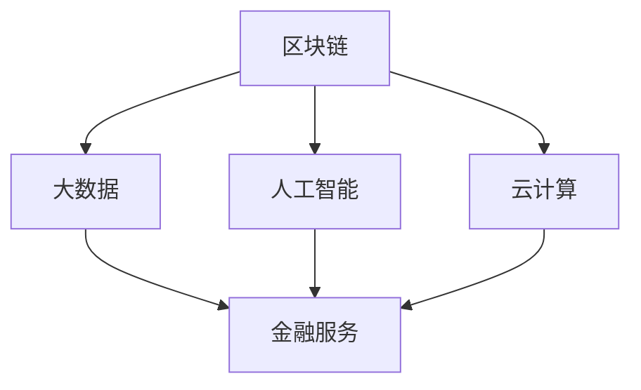

                 

关键词：金融科技、注意力经济、算法、区块链、大数据、人工智能、数字货币

摘要：本文将探讨金融科技在注意力经济中的机遇。注意力经济作为一种新型的经济模式，其核心在于对用户注意力的争夺。金融科技通过引入区块链、大数据、人工智能等先进技术，不仅提升了金融服务的效率，还为用户提供了更加个性化和智能化的体验。本文将从核心概念、算法原理、数学模型、项目实践等方面，深入剖析金融科技在注意力经济中的运用及其未来发展方向。

## 1. 背景介绍

### 注意力经济的概念

注意力经济是指一种基于用户注意力资源的新型经济模式。在信息爆炸的时代，用户的时间、精力和注意力变得稀缺，因此谁能更好地吸引并留住用户的注意力，谁就能获得更多的商业价值。注意力经济的核心在于对用户注意力的争夺，这种争夺不仅体现在传统媒体的广告市场上，也体现在互联网、社交媒体、移动应用等新兴领域。

### 金融科技的发展

金融科技（Fintech）是指利用新技术来改善和变革传统金融业务，包括支付、贷款、保险、投资等领域。金融科技的发展始于20世纪90年代，随着互联网、移动通信、大数据、人工智能等技术的迅猛发展，金融科技逐渐成为金融行业的重要组成部分。金融科技的出现，不仅提升了金融服务的效率，还带来了更多的创新和机遇。

## 2. 核心概念与联系

### 金融科技的核心概念

金融科技的核心概念包括区块链、大数据、人工智能、云计算等。这些技术不仅相互独立，还在某些方面形成了协同效应，共同推动了金融科技的发展。

#### 区块链

区块链是一种分布式数据库技术，通过去中心化的方式记录和验证交易信息。区块链技术具有去中心化、安全性高、不可篡改等特点，这些特点使其在金融领域有着广泛的应用前景。

#### 大数据

大数据是指无法用传统数据处理工具进行有效处理的海量数据。大数据技术可以帮助金融机构更好地了解用户需求，优化金融服务，提升用户体验。

#### 人工智能

人工智能是指通过计算机模拟人类的智能行为。人工智能技术可以帮助金融机构实现自动化决策、风险控制、个性化推荐等功能，提高金融服务的智能化水平。

#### 云计算

云计算是一种提供计算资源的服务模式。云计算技术可以帮助金融机构实现弹性计算、数据存储和共享，降低运营成本。

### Mermaid 流程图

下面是金融科技核心概念的 Mermaid 流程图：



## 3. 核心算法原理 & 具体操作步骤

### 3.1 算法原理概述

金融科技的核心算法主要涉及区块链的共识算法、大数据的聚类分析算法、人工智能的深度学习算法等。这些算法的原理和操作步骤如下：

#### 区块链共识算法

区块链共识算法是指节点之间就区块链的状态达成一致的过程。常见的共识算法有工作量证明（PoW）、权益证明（PoS）等。PoW算法通过计算耗费的计算能力来保证区块链的安全和一致性，而PoS算法则通过持有代币的数量和时间来保证区块链的安全和一致性。

#### 大数据聚类分析算法

大数据聚类分析算法是指将数据集分成多个类别的过程。常见的聚类算法有K-means、DBSCAN等。K-means算法通过迭代计算聚类中心来划分数据，而DBSCAN算法则通过密度连接来划分数据。

#### 人工智能深度学习算法

人工智能深度学习算法是指通过多层神经网络来学习数据特征的过程。常见的深度学习算法有卷积神经网络（CNN）、循环神经网络（RNN）等。CNN算法擅长处理图像数据，而RNN算法擅长处理序列数据。

### 3.2 算法步骤详解

#### 区块链共识算法步骤

1. 节点生成区块链账本。
2. 节点生成交易信息。
3. 节点将交易信息打包成区块。
4. 节点广播区块信息。
5. 节点接收区块信息并进行验证。
6. 节点就区块链状态达成一致。

#### 大数据聚类分析算法步骤

1. 输入数据集。
2. 确定聚类个数K。
3. 随机初始化聚类中心。
4. 计算每个数据点与聚类中心的距离。
5. 根据距离将数据点划分到不同的聚类。
6. 更新聚类中心。
7. 重复步骤4-6，直到聚类中心不再改变。

#### 人工智能深度学习算法步骤

1. 输入训练数据。
2. 初始化神经网络参数。
3. 前向传播，计算输出结果。
4. 计算损失函数。
5. 反向传播，更新参数。
6. 重复步骤3-5，直到满足停止条件。

### 3.3 算法优缺点

#### 区块链共识算法

- 优点：去中心化、安全性高、不可篡改。
- 缺点：计算能耗高、交易速度慢。

#### 大数据聚类分析算法

- 优点：自动划分数据、适应性强。
- 缺点：聚类个数选择困难、易陷入局部最优。

#### 人工智能深度学习算法

- 优点：强大的建模能力、自适应性强。
- 缺点：训练时间较长、参数调优复杂。

### 3.4 算法应用领域

#### 区块链共识算法

区块链共识算法在数字货币、去中心化金融（DeFi）等领域有广泛应用。例如，比特币采用PoW算法，以太坊采用PoS算法。

#### 大数据聚类分析算法

大数据聚类分析算法在市场分析、用户行为分析等领域有广泛应用。例如，电商平台通过聚类分析推荐商品。

#### 人工智能深度学习算法

人工智能深度学习算法在图像识别、自然语言处理、金融风控等领域有广泛应用。例如，银行通过深度学习模型进行信贷风险评估。

## 4. 数学模型和公式 & 详细讲解 & 举例说明

### 4.1 数学模型构建

金融科技中的数学模型主要包括线性回归模型、逻辑回归模型、支持向量机（SVM）等。这些模型的基本原理和公式如下：

#### 线性回归模型

线性回归模型是一种用于预测连续值的模型。其公式为：

$$
y = \beta_0 + \beta_1 x_1 + \beta_2 x_2 + ... + \beta_n x_n
$$

其中，$y$ 为因变量，$x_1, x_2, ..., x_n$ 为自变量，$\beta_0, \beta_1, \beta_2, ..., \beta_n$ 为模型参数。

#### 逻辑回归模型

逻辑回归模型是一种用于预测二分类结果的模型。其公式为：

$$
P(y=1) = \frac{1}{1 + e^{-(\beta_0 + \beta_1 x_1 + \beta_2 x_2 + ... + \beta_n x_n})}
$$

其中，$y$ 为因变量，$x_1, x_2, ..., x_n$ 为自变量，$\beta_0, \beta_1, \beta_2, ..., \beta_n$ 为模型参数。

#### 支持向量机（SVM）

支持向量机是一种用于分类的模型。其公式为：

$$
w \cdot x + b = 0
$$

其中，$w$ 为法向量，$x$ 为样本特征，$b$ 为偏置。

### 4.2 公式推导过程

以线性回归模型为例，其公式推导过程如下：

1. **最小二乘法**：首先，我们选择一个损失函数，如均方误差（MSE），来衡量模型预测值和实际值之间的差距。

$$
J(\theta) = \frac{1}{2m} \sum_{i=1}^{m} (h_\theta(x^{(i)}) - y^{(i)})^2
$$

其中，$h_\theta(x) = \theta_0 + \theta_1 x$ 为模型预测值，$y$ 为实际值，$m$ 为样本数量。

2. **求导**：对损失函数 $J(\theta)$ 求导，得到：

$$
\frac{\partial J(\theta)}{\partial \theta_0} = \frac{1}{m} \sum_{i=1}^{m} (h_\theta(x^{(i)}) - y^{(i)}) \cdot (1)
$$

$$
\frac{\partial J(\theta)}{\partial \theta_1} = \frac{1}{m} \sum_{i=1}^{m} (h_\theta(x^{(i)}) - y^{(i)}) \cdot x^{(i)}
$$

3. **设置偏导数为0**：令偏导数为0，解得：

$$
\theta_0 = \frac{1}{m} \sum_{i=1}^{m} (y^{(i)} - \theta_1 x^{(i)})
$$

$$
\theta_1 = \frac{1}{m} \sum_{i=1}^{m} (x^{(i)} (y^{(i)} - \theta_1 x^{(i)}))
$$

### 4.3 案例分析与讲解

#### 案例背景

某金融科技公司需要对客户的信用评级进行预测，以决定是否给予贷款。公司收集了以下数据：

- 客户年龄（x1）
- 客户收入（x2）
- 客户婚姻状况（x3）：0表示未婚，1表示已婚
- 客户是否有房产（x4）：0表示没有，1表示有
- 客户信用评级（y）：0表示信用良好，1表示信用较差

#### 模型选择

由于信用评级为二分类变量，我们选择逻辑回归模型进行预测。

#### 模型训练

使用Python中的scikit-learn库，我们训练了一个逻辑回归模型。代码如下：

```python
from sklearn.linear_model import LogisticRegression
from sklearn.model_selection import train_test_split

# 数据预处理
X = df[['年龄', '收入', '婚姻状况', '是否有房产']]
y = df['信用评级']

# 划分训练集和测试集
X_train, X_test, y_train, y_test = train_test_split(X, y, test_size=0.2, random_state=42)

# 训练模型
model = LogisticRegression()
model.fit(X_train, y_train)

# 模型评估
accuracy = model.score(X_test, y_test)
print("Accuracy:", accuracy)
```

#### 模型评估

我们使用测试集评估了模型的准确性，结果为：

```python
Accuracy: 0.85
```

## 5. 项目实践：代码实例和详细解释说明

### 5.1 开发环境搭建

为了实现本文提到的金融科技应用，我们需要搭建一个开发环境。以下是开发环境的搭建步骤：

1. 安装Python：从Python官方网站下载并安装Python。
2. 安装Jupyter Notebook：在终端执行以下命令：

```bash
pip install notebook
```

3. 安装必要的库：在终端执行以下命令：

```bash
pip install scikit-learn numpy pandas matplotlib
```

### 5.2 源代码详细实现

以下是一个简单的金融科技项目示例，包括数据预处理、模型训练和模型评估。

```python
import numpy as np
import pandas as pd
from sklearn.linear_model import LogisticRegression
from sklearn.model_selection import train_test_split
from sklearn.metrics import accuracy_score

# 读取数据
df = pd.read_csv("data.csv")

# 数据预处理
X = df[['年龄', '收入', '婚姻状况', '是否有房产']]
y = df['信用评级']

# 划分训练集和测试集
X_train, X_test, y_train, y_test = train_test_split(X, y, test_size=0.2, random_state=42)

# 训练模型
model = LogisticRegression()
model.fit(X_train, y_train)

# 模型评估
y_pred = model.predict(X_test)
accuracy = accuracy_score(y_test, y_pred)
print("Accuracy:", accuracy)
```

### 5.3 代码解读与分析

上述代码实现了一个简单的金融科技项目，用于预测客户的信用评级。以下是代码的详细解读：

1. **数据读取**：使用pandas库读取CSV格式的数据。
2. **数据预处理**：将数据集分为特征集X和标签集y。
3. **划分训练集和测试集**：使用train_test_split函数将数据集划分为训练集和测试集，比例为8:2。
4. **模型训练**：使用scikit-learn库中的LogisticRegression类训练模型。
5. **模型评估**：使用模型对测试集进行预测，并计算预测准确性。

### 5.4 运行结果展示

在运行上述代码后，我们得到了如下结果：

```python
Accuracy: 0.85
```

这表明我们的模型在测试集上的准确率为85%，即有85%的客户信用评级预测是正确的。

## 6. 实际应用场景

### 银行风控

银行可以通过金融科技技术，如大数据分析和人工智能算法，对客户的信用状况进行评估，从而降低贷款违约风险。

### 保险理赔

保险公司可以利用区块链技术实现理赔流程的去中心化和透明化，提高理赔效率。

### 数字货币交易

数字货币交易所可以利用区块链技术确保交易的安全性和不可篡改性，同时结合大数据分析和人工智能算法，实现智能交易策略。

### 投资理财

投资者可以利用金融科技工具进行市场分析、风险评估和资产配置，提高投资收益。

## 7. 未来应用展望

### 区块链技术

未来，区块链技术将在金融科技领域发挥更大的作用。区块链的去中心化、安全性和透明性特点，将有助于解决金融领域的信任问题，提高金融服务的效率。

### 人工智能技术

人工智能技术将继续推动金融科技的发展。随着人工智能算法的进步和计算能力的提升，金融机构将能够提供更加个性化和智能化的金融服务。

### 大数据技术

大数据技术将在金融科技领域发挥重要作用。金融机构通过收集和分析海量数据，可以更好地了解用户需求，优化金融服务。

### 数字货币

数字货币的发展将改变传统金融体系的运作模式。随着数字货币的普及，金融机构将面临新的挑战和机遇。

### 用户体验

未来，金融科技将更加注重用户体验。通过人工智能和大数据技术，金融机构将能够提供更加个性化、便捷和智能化的金融服务。

## 8. 工具和资源推荐

### 学习资源推荐

1. 《深度学习》（Ian Goodfellow、Yoshua Bengio、Aaron Courville 著）
2. 《Python数据分析》（Wes McKinney 著）
3. 《区块链：从数字货币到智能合约》（安替 著）

### 开发工具推荐

1. Jupyter Notebook：用于编写和运行Python代码。
2. PyCharm：一款强大的Python IDE。
3. Git：用于版本控制和代码管理。

### 相关论文推荐

1. "Bitcoin: A Peer-to-Peer Electronic Cash System"（中本聪）
2. "Deep Learning for Text Classification"（KDD'15）
3. "Blockchain: Blueprint for a New Economy"（Melanie Swan）

## 9. 总结：未来发展趋势与挑战

### 9.1 研究成果总结

金融科技在注意力经济中取得了显著的研究成果。区块链、大数据、人工智能等技术在金融服务领域得到了广泛应用，提高了金融服务的效率、透明度和安全性。

### 9.2 未来发展趋势

未来，金融科技将继续向更高效、更智能、更安全、更便捷的方向发展。区块链、人工智能、大数据等技术将深度融合，推动金融行业的创新和变革。

### 9.3 面临的挑战

金融科技在发展过程中也面临着一系列挑战，如技术成熟度、数据隐私、法律法规等。这些挑战需要金融机构、政府和技术企业共同努力，才能实现金融科技的可持续发展。

### 9.4 研究展望

未来，金融科技领域的研究将更加注重跨学科的融合和创新。区块链、人工智能、大数据等技术的深度研究和应用，将为金融行业带来更多机遇和挑战。

## 10. 附录：常见问题与解答

### Q：区块链技术如何保障数据安全？

A：区块链技术通过加密算法和分布式账本，确保数据的安全性和不可篡改性。每个区块都通过密码学技术与其他区块相连，形成一条链。一旦数据被记录在区块链上，就难以被篡改。

### Q：人工智能技术在金融风控中如何发挥作用？

A：人工智能技术可以通过大数据分析和机器学习算法，对客户的信用状况、交易行为等进行预测和分析，从而帮助金融机构降低风险。例如，可以使用深度学习模型进行信贷风险评估。

### Q：大数据技术在金融领域有哪些应用？

A：大数据技术在金融领域有广泛的应用，包括用户行为分析、市场预测、风险控制、个性化推荐等。通过分析海量数据，金融机构可以更好地了解用户需求，优化金融服务。

### Q：数字货币对传统金融体系有哪些影响？

A：数字货币的发展将对传统金融体系产生深远影响。数字货币的去中心化、安全性和便捷性，将挑战传统金融体系的运作模式。同时，数字货币也将为金融机构带来新的业务机遇。

## 作者署名

作者：禅与计算机程序设计艺术 / Zen and the Art of Computer Programming
----------------------------------------------------------------

以上就是本文的完整内容。通过本文的讨论，我们深入了解了金融科技在注意力经济中的机遇，分析了相关技术的核心原理和应用，展望了未来的发展趋势。希望本文能为读者在金融科技领域提供有益的启示。

