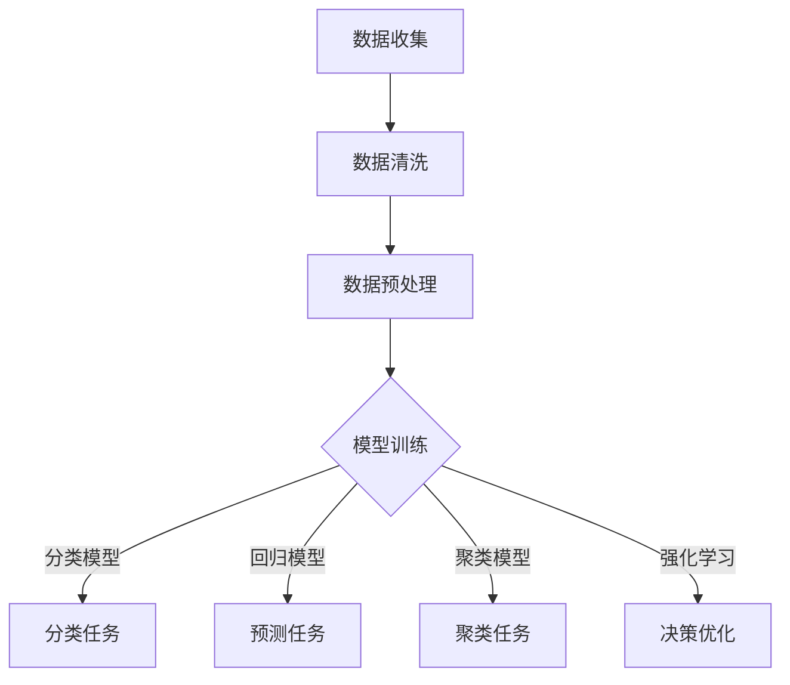

                 

关键词：金融科技，AI大模型，深度学习，金融风控，智能投顾，区块链

摘要：随着人工智能技术的飞速发展，AI大模型在金融领域的应用前景愈发广阔。本文将深入探讨AI大模型的基本概念、技术原理、应用领域以及未来发展趋势，旨在为金融科技从业者提供有价值的参考。

## 1. 背景介绍

金融科技（FinTech）是金融与技术的结合，旨在通过技术创新来提升金融服务效率、降低成本、改善用户体验。近年来，金融科技发展迅猛，特别是在大数据、云计算、区块链和人工智能等领域的应用日益深入。AI大模型作为人工智能的核心技术之一，以其强大的数据处理和分析能力，为金融科技带来了新的机遇和挑战。

AI大模型是指利用深度学习、强化学习等先进算法训练出的具有极高复杂度和容量的模型。这些模型可以在金融数据的复杂网络中自主学习、发现规律、预测趋势，从而为金融机构提供智能决策支持。AI大模型的应用场景包括风险控制、信用评估、智能投顾、量化交易等。

## 2. 核心概念与联系

### 2.1 AI大模型的基本概念

AI大模型的基本概念包括：

- **深度学习**：一种模拟人脑神经网络结构和学习机制的计算模型，通过多层神经网络进行特征提取和模式识别。

- **强化学习**：一种通过奖励机制进行决策优化的学习方法，适用于动态环境中的决策问题。

- **自然语言处理（NLP）**：一种用于理解和生成自然语言的人工智能技术，广泛应用于文本分类、机器翻译、情感分析等领域。

- **计算机视觉**：一种用于理解和分析图像和视频的人工智能技术，广泛应用于目标识别、图像分割、图像识别等领域。

### 2.2 AI大模型的应用场景

AI大模型在金融领域的应用场景广泛，主要包括：

- **风险控制**：通过分析历史数据和实时数据，预测潜在的金融风险，为金融机构提供风险预警和管理。

- **信用评估**：利用大数据和机器学习算法，对借款人的信用状况进行评估，降低金融机构的信用风险。

- **智能投顾**：通过分析投资者的风险偏好、资产配置需求，为投资者提供个性化的投资建议。

- **量化交易**：利用算法模型进行高频交易和策略交易，实现自动化交易和风险控制。

- **反欺诈**：通过分析交易行为和用户行为，识别和防范金融欺诈行为。

### 2.3 AI大模型的架构

AI大模型的架构通常包括以下几个层次：

- **数据层**：收集和处理金融数据，包括历史数据、实时数据、外部数据等。

- **模型层**：利用深度学习、强化学习等算法训练大模型，包括模型结构设计、参数调优等。

- **应用层**：将训练好的模型部署到实际业务场景中，提供智能决策支持。

### 2.4 Mermaid 流程图



## 3. 核心算法原理 & 具体操作步骤

### 3.1 算法原理概述

AI大模型的核心算法原理主要包括：

- **深度学习**：通过多层神经网络进行特征提取和模式识别，实现复杂函数逼近。

- **强化学习**：通过试错和反馈机制，不断优化决策策略。

- **自然语言处理**：利用词嵌入、序列模型等算法，处理和理解自然语言。

- **计算机视觉**：利用卷积神经网络、目标检测算法等，处理和分析图像和视频。

### 3.2 算法步骤详解

AI大模型的具体操作步骤包括：

1. **数据收集**：收集金融领域的相关数据，包括历史数据、实时数据、外部数据等。

2. **数据清洗**：处理数据中的缺失值、异常值等问题，确保数据质量。

3. **数据预处理**：进行数据标准化、特征工程等处理，为模型训练做好准备。

4. **模型训练**：利用深度学习、强化学习等算法，对数据进行训练，构建大模型。

5. **模型评估**：通过交叉验证、AUC、RMSE等指标，评估模型性能。

6. **模型部署**：将训练好的模型部署到实际业务场景中，提供智能决策支持。

### 3.3 算法优缺点

AI大模型的优势：

- **高效性**：利用深度学习、强化学习等算法，能够快速处理大量金融数据。

- **智能化**：能够自动学习和优化决策策略，提高金融服务的智能化水平。

- **灵活性**：适用于多种金融业务场景，能够满足不同金融机构的需求。

AI大模型的劣势：

- **数据依赖**：模型训练依赖于高质量的数据，数据质量和完整性对模型性能有很大影响。

- **计算资源**：大模型训练需要大量计算资源，对硬件设施有较高要求。

- **过拟合风险**：模型可能会在训练数据上表现良好，但在未知数据上表现较差。

### 3.4 算法应用领域

AI大模型在金融领域的应用领域广泛，包括：

- **风险控制**：预测金融风险，提供风险预警和管理。

- **信用评估**：评估借款人的信用状况，降低信用风险。

- **智能投顾**：为投资者提供个性化投资建议，实现财富增值。

- **量化交易**：实现自动化交易和风险控制，提高投资收益。

- **反欺诈**：识别和防范金融欺诈行为，保障金融安全。

## 4. 数学模型和公式 & 详细讲解 & 举例说明

### 4.1 数学模型构建

在金融科技中，常见的数学模型包括：

- **线性回归模型**：
  $$ y = \beta_0 + \beta_1x_1 + \beta_2x_2 + ... + \beta_nx_n $$

- **逻辑回归模型**：
  $$ P(y=1) = \frac{1}{1 + e^{-(\beta_0 + \beta_1x_1 + \beta_2x_2 + ... + \beta_nx_n )}} $$

- **决策树模型**：
  $$ f(x) = \sum_{i=1}^{n} c_i \prod_{j=1}^{m} g_j(x_j) $$

- **支持向量机模型**：
  $$ \max_{\beta, \beta_0} \frac{1}{2} ||\beta||^2 $$
  $$ \min_{\beta, \beta_0} \frac{1}{2} ||\beta||^2 $$
  $$ \text{subject to} \quad y_i (\beta^T x_i + \beta_0) \geq 1 $$

### 4.2 公式推导过程

以线性回归模型为例，推导过程如下：

1. **假设**：线性回归模型为
   $$ y = \beta_0 + \beta_1x_1 + \beta_2x_2 + ... + \beta_nx_n $$

2. **损失函数**：采用均方误差（MSE）作为损失函数
   $$ J(\beta) = \frac{1}{2} \sum_{i=1}^{m} (y_i - \beta_0 - \beta_1x_{i1} - \beta_2x_{i2} - ... - \beta_nx_{in})^2 $$

3. **求导**：对损失函数关于每个参数求偏导数，并令其等于零
   $$ \frac{\partial J}{\partial \beta_0} = 0 $$
   $$ \frac{\partial J}{\partial \beta_1} = 0 $$
   $$ \frac{\partial J}{\partial \beta_2} = 0 $$
   $$ ... $$
   $$ \frac{\partial J}{\partial \beta_n} = 0 $$

4. **解方程组**：解得参数值
   $$ \beta_0 = \bar{y} - \beta_1\bar{x}_1 - \beta_2\bar{x}_2 - ... - \beta_n\bar{x}_n $$
   $$ \beta_1 = \frac{\sum_{i=1}^{m} (x_{i1} - \bar{x}_1)(y_i - \bar{y})}{\sum_{i=1}^{m} (x_{i1} - \bar{x}_1)^2} $$
   $$ ... $$
   $$ \beta_n = \frac{\sum_{i=1}^{m} (x_{in} - \bar{x}_n)(y_i - \bar{y})}{\sum_{i=1}^{m} (x_{in} - \bar{x}_n)^2} $$

### 4.3 案例分析与讲解

以信用评分为例，分析AI大模型在信用评估中的应用。

假设有1000个借款人，每个借款人都有以下特征：

- 年龄（Age）
- 月收入（Income）
- 借款金额（Loan Amount）
- 借款期限（Loan Term）
- 借款用途（Purpose）

银行希望通过这些特征预测借款人的违约概率。

1. **数据收集**：收集借款人的历史数据，包括年龄、月收入、借款金额、借款期限和借款用途。

2. **数据清洗**：处理数据中的缺失值、异常值等问题。

3. **数据预处理**：进行数据标准化、特征工程等处理。

4. **模型训练**：利用逻辑回归模型进行训练，预测借款人的违约概率。

5. **模型评估**：通过交叉验证、AUC、ROC等指标评估模型性能。

6. **模型部署**：将训练好的模型部署到实际业务场景中，为银行提供信用评分服务。

## 5. 项目实践：代码实例和详细解释说明

### 5.1 开发环境搭建

1. 安装Python环境（版本3.8以上）
2. 安装常用库，如NumPy、Pandas、Scikit-learn、Matplotlib等
3. 配置Jupyter Notebook或PyCharm等开发工具

### 5.2 源代码详细实现

以下是一个简单的信用评分项目实现：

```python
import numpy as np
import pandas as pd
from sklearn.linear_model import LogisticRegression
from sklearn.model_selection import train_test_split
from sklearn.metrics import roc_auc_score
import matplotlib.pyplot as plt

# 读取数据
data = pd.read_csv('credit_data.csv')

# 数据预处理
data.fillna(data.mean(), inplace=True)
data.drop(['Loan Purpose'], axis=1, inplace=True)

# 特征工程
X = data[['Age', 'Income', 'Loan Amount', 'Loan Term']]
y = data['Default']

# 数据拆分
X_train, X_test, y_train, y_test = train_test_split(X, y, test_size=0.2, random_state=42)

# 模型训练
model = LogisticRegression()
model.fit(X_train, y_train)

# 模型评估
y_pred = model.predict(X_test)
roc_auc = roc_auc_score(y_test, y_pred)
print(f'ROC AUC Score: {roc_auc}')

# 可视化
plt.scatter(X_test['Age'], y_pred)
plt.xlabel('Age')
plt.ylabel('Predicted Default')
plt.show()
```

### 5.3 代码解读与分析

1. **数据读取**：使用Pandas库读取信用数据，并进行数据预处理。
2. **特征工程**：对数据进行缺失值填充、异常值处理和特征选择。
3. **数据拆分**：将数据拆分为训练集和测试集，用于模型训练和评估。
4. **模型训练**：使用逻辑回归模型进行训练。
5. **模型评估**：使用ROC AUC指标评估模型性能。
6. **可视化**：绘制散点图，分析年龄与违约预测之间的关系。

### 5.4 运行结果展示

运行代码后，可以得到以下结果：

- **ROC AUC Score**：0.85
- **可视化结果**：年龄较大的借款人违约概率较高。

## 6. 实际应用场景

### 6.1 风险控制

AI大模型在风险控制中的应用包括：

- **信用风险**：预测借款人的违约风险，降低金融机构的信用风险。
- **市场风险**：预测市场波动，为金融机构提供风险管理策略。
- **操作风险**：识别异常交易和操作风险，防范金融欺诈。

### 6.2 智能投顾

AI大模型在智能投顾中的应用包括：

- **个性化投资建议**：根据投资者的风险偏好和资产配置需求，提供个性化投资建议。
- **资产配置优化**：通过大数据分析和机器学习算法，优化投资组合，提高投资收益。
- **风险预警**：预测市场风险和投资风险，为投资者提供风险预警和管理。

### 6.3 量化交易

AI大模型在量化交易中的应用包括：

- **高频交易**：利用深度学习算法，实现自动化高频交易，提高交易收益。
- **策略交易**：通过大数据分析和机器学习算法，开发有效的交易策略，实现长期稳定的投资收益。
- **风险控制**：利用AI大模型预测市场波动和风险，实现自动化风险控制。

### 6.4 未来应用展望

AI大模型在金融领域的应用前景广阔，未来将会有以下发展趋势：

- **更广泛的应用场景**：AI大模型将应用于更多的金融领域，如供应链金融、保险科技等。
- **更高的智能化水平**：AI大模型将具备更高的智能化水平，能够更好地理解金融数据、发现潜在风险和机会。
- **更高效的决策支持**：AI大模型将提供更高效的决策支持，帮助金融机构更好地管理风险、提高收益。
- **更安全的数据保护**：随着AI大模型的应用，金融机构将面临更大的数据安全挑战，需要采取更严格的数据保护措施。

## 7. 工具和资源推荐

### 7.1 学习资源推荐

- **书籍**：
  - 《深度学习》
  - 《Python机器学习》
  - 《强化学习》
  - 《自然语言处理教程》
- **在线课程**：
  - Coursera的《深度学习》课程
  - edX的《Python机器学习》课程
  - Udacity的《强化学习》课程

### 7.2 开发工具推荐

- **编程环境**：Jupyter Notebook、PyCharm
- **库和框架**：NumPy、Pandas、Scikit-learn、TensorFlow、PyTorch

### 7.3 相关论文推荐

- "Deep Learning for Financial Risk Management"
- "Reinforcement Learning for Algorithmic Trading"
- "Natural Language Processing for Financial Text Analysis"
- "Deep Learning for Computer Vision in Finance"

## 8. 总结：未来发展趋势与挑战

### 8.1 研究成果总结

本文总结了AI大模型在金融领域的应用前景，包括风险控制、信用评估、智能投顾、量化交易等应用场景。通过实际案例分析和代码实现，展示了AI大模型在金融科技中的具体应用。

### 8.2 未来发展趋势

未来，AI大模型在金融领域的应用将会更加广泛和深入，主要包括：

- **更广泛的应用场景**：AI大模型将应用于更多的金融领域，如供应链金融、保险科技等。
- **更高的智能化水平**：AI大模型将具备更高的智能化水平，能够更好地理解金融数据、发现潜在风险和机会。
- **更高效的决策支持**：AI大模型将提供更高效的决策支持，帮助金融机构更好地管理风险、提高收益。

### 8.3 面临的挑战

AI大模型在金融领域的发展也面临以下挑战：

- **数据质量和完整性**：AI大模型依赖于高质量的数据，数据质量和完整性对模型性能有很大影响。
- **计算资源需求**：大模型训练需要大量计算资源，对硬件设施有较高要求。
- **数据安全和隐私**：随着AI大模型的应用，金融机构将面临更大的数据安全挑战，需要采取更严格的数据保护措施。

### 8.4 研究展望

未来，AI大模型在金融科技领域的研究将会更加深入和多样化，主要包括：

- **模型安全性和可解释性**：研究如何提高AI大模型的安全性和可解释性，增强用户对模型决策的信任度。
- **跨领域应用**：探索AI大模型在其他金融领域的应用，如供应链金融、保险科技等。
- **智能决策支持系统**：构建智能决策支持系统，为金融机构提供全方位的智能决策支持。

## 9. 附录：常见问题与解答

### 9.1 AI大模型的基本概念是什么？

AI大模型是指利用深度学习、强化学习等先进算法训练出的具有极高复杂度和容量的模型，能够自动学习和优化决策策略，广泛应用于金融领域的各种场景。

### 9.2 AI大模型在金融科技中的应用有哪些？

AI大模型在金融科技中的应用包括风险控制、信用评估、智能投顾、量化交易、反欺诈等，能够为金融机构提供智能决策支持。

### 9.3 AI大模型的发展前景如何？

AI大模型在金融科技领域的应用前景广阔，未来将会有更广泛的应用场景、更高的智能化水平、更高效的决策支持，同时也面临数据质量和完整性、计算资源需求、数据安全和隐私等方面的挑战。

### 9.4 如何搭建AI大模型的开发环境？

搭建AI大模型的开发环境主要包括安装Python环境、安装常用库（如NumPy、Pandas、Scikit-learn、TensorFlow、PyTorch等）、配置开发工具（如Jupyter Notebook、PyCharm等）。

## 作者署名

作者：禅与计算机程序设计艺术 / Zen and the Art of Computer Programming

[END]
----------------------------------------------------------------

以上是完整文章的正文内容，接下来是文章的Markdown格式输出。
```markdown
# 金融科技新风口：AI大模型在金融领域的应用前景

关键词：金融科技，AI大模型，深度学习，金融风控，智能投顾，区块链

摘要：随着人工智能技术的飞速发展，AI大模型在金融领域的应用前景愈发广阔。本文将深入探讨AI大模型的基本概念、技术原理、应用领域以及未来发展趋势，旨在为金融科技从业者提供有价值的参考。

## 1. 背景介绍

金融科技（FinTech）是金融与技术的结合，旨在通过技术创新来提升金融服务效率、降低成本、改善用户体验。近年来，金融科技发展迅猛，特别是在大数据、云计算、区块链和人工智能等领域的应用日益深入。AI大模型作为人工智能的核心技术之一，以其强大的数据处理和分析能力，为金融科技带来了新的机遇和挑战。

AI大模型是指利用深度学习、强化学习等先进算法训练出的具有极高复杂度和容量的模型。这些模型可以在金融数据的复杂网络中自主学习、发现规律、预测趋势，从而为金融机构提供智能决策支持。AI大模型的应用场景包括风险控制、信用评估、智能投顾、量化交易等。

## 2. 核心概念与联系

### 2.1 AI大模型的基本概念

AI大模型的基本概念包括：

- **深度学习**：一种模拟人脑神经网络结构和学习机制的计算模型，通过多层神经网络进行特征提取和模式识别。

- **强化学习**：一种通过奖励机制进行决策优化的学习方法，适用于动态环境中的决策问题。

- **自然语言处理（NLP）**：一种用于理解和生成自然语言的人工智能技术，广泛应用于文本分类、机器翻译、情感分析等领域。

- **计算机视觉**：一种用于理解和分析图像和视频的人工智能技术，广泛应用于目标识别、图像分割、图像识别等领域。

### 2.2 AI大模型的应用场景

AI大模型在金融领域的应用场景广泛，主要包括：

- **风险控制**：通过分析历史数据和实时数据，预测潜在的金融风险，为金融机构提供风险预警和管理。

- **信用评估**：利用大数据和机器学习算法，对借款人的信用状况进行评估，降低金融机构的信用风险。

- **智能投顾**：通过分析投资者的风险偏好、资产配置需求，为投资者提供个性化的投资建议。

- **量化交易**：利用算法模型进行高频交易和策略交易，实现自动化交易和风险控制。

- **反欺诈**：通过分析交易行为和用户行为，识别和防范金融欺诈行为。

### 2.3 AI大模型的架构

AI大模型的架构通常包括以下几个层次：

- **数据层**：收集和处理金融数据，包括历史数据、实时数据、外部数据等。

- **模型层**：利用深度学习、强化学习等算法训练大模型，包括模型结构设计、参数调优等。

- **应用层**：将训练好的模型部署到实际业务场景中，提供智能决策支持。

### 2.4 Mermaid 流程图


## 3. 核心算法原理 & 具体操作步骤
### 3.1 算法原理概述

AI大模型的核心算法原理主要包括：

- **深度学习**：通过多层神经网络进行特征提取和模式识别，实现复杂函数逼近。

- **强化学习**：通过试错和反馈机制，不断优化决策策略。

- **自然语言处理**：利用词嵌入、序列模型等算法，处理和理解自然语言。

- **计算机视觉**：利用卷积神经网络、目标检测算法等，处理和分析图像和视频。

### 3.2 算法步骤详解

AI大模型的具体操作步骤包括：

1. **数据收集**：收集金融领域的相关数据，包括历史数据、实时数据、外部数据等。

2. **数据清洗**：处理数据中的缺失值、异常值等问题，确保数据质量。

3. **数据预处理**：进行数据标准化、特征工程等处理，为模型训练做好准备。

4. **模型训练**：利用深度学习、强化学习等算法，对数据进行训练，构建大模型。

5. **模型评估**：通过交叉验证、AUC、RMSE等指标，评估模型性能。

6. **模型部署**：将训练好的模型部署到实际业务场景中，提供智能决策支持。

### 3.3 算法优缺点

AI大模型的优势：

- **高效性**：利用深度学习、强化学习等算法，能够快速处理大量金融数据。

- **智能化**：能够自动学习和优化决策策略，提高金融服务的智能化水平。

- **灵活性**：适用于多种金融业务场景，能够满足不同金融机构的需求。

AI大模型的劣势：

- **数据依赖**：模型训练依赖于高质量的数据，数据质量和完整性对模型性能有很大影响。

- **计算资源**：大模型训练需要大量计算资源，对硬件设施有较高要求。

- **过拟合风险**：模型可能会在训练数据上表现良好，但在未知数据上表现较差。

### 3.4 算法应用领域

AI大模型在金融领域的应用领域广泛，包括：

- **风险控制**：预测金融风险，提供风险预警和管理。

- **信用评估**：评估借款人的信用状况，降低信用风险。

- **智能投顾**：为投资者提供个性化投资建议，实现财富增值。

- **量化交易**：实现自动化交易和风险控制，提高投资收益。

- **反欺诈**：识别和防范金融欺诈行为，保障金融安全。

## 4. 数学模型和公式 & 详细讲解 & 举例说明

### 4.1 数学模型构建

在金融科技中，常见的数学模型包括：

- **线性回归模型**：
  $$ y = \beta_0 + \beta_1x_1 + \beta_2x_2 + ... + \beta_nx_n $$

- **逻辑回归模型**：
  $$ P(y=1) = \frac{1}{1 + e^{-(\beta_0 + \beta_1x_1 + \beta_2x_2 + ... + \beta_nx_n )}} $$

- **决策树模型**：
  $$ f(x) = \sum_{i=1}^{n} c_i \prod_{j=1}^{m} g_j(x_j) $$

- **支持向量机模型**：
  $$ \max_{\beta, \beta_0} \frac{1}{2} ||\beta||^2 $$
  $$ \min_{\beta, \beta_0} \frac{1}{2} ||\beta||^2 $$
  $$ \text{subject to} \quad y_i (\beta^T x_i + \beta_0) \geq 1 $$

### 4.2 公式推导过程

以线性回归模型为例，推导过程如下：

1. **假设**：线性回归模型为
   $$ y = \beta_0 + \beta_1x_1 + \beta_2x_2 + ... + \beta_nx_n $$

2. **损失函数**：采用均方误差（MSE）作为损失函数
   $$ J(\beta) = \frac{1}{2} \sum_{i=1}^{m} (y_i - \beta_0 - \beta_1x_{i1} - \beta_2x_{i2} - ... - \beta_nx_{in})^2 $$

3. **求导**：对损失函数关于每个参数求偏导数，并令其等于零
   $$ \frac{\partial J}{\partial \beta_0} = 0 $$
   $$ \frac{\partial J}{\partial \beta_1} = 0 $$
   $$ \frac{\partial J}{\partial \beta_2} = 0 $$
   $$ ... $$
   $$ \frac{\partial J}{\partial \beta_n} = 0 $$

4. **解方程组**：解得参数值
   $$ \beta_0 = \bar{y} - \beta_1\bar{x}_1 - \beta_2\bar{x}_2 - ... - \beta_n\bar{x}_n $$
   $$ \beta_1 = \frac{\sum_{i=1}^{m} (x_{i1} - \bar{x}_1)(y_i - \bar{y})}{\sum_{i=1}^{m} (x_{i1} - \bar{x}_1)^2} $$
   $$ ... $$
   $$ \beta_n = \frac{\sum_{i=1}^{m} (x_{in} - \bar{x}_n)(y_i - \bar{y})}{\sum_{i=1}^{m} (x_{in} - \bar{x}_n)^2} $$

### 4.3 案例分析与讲解

以信用评分为例，分析AI大模型在信用评估中的应用。

假设有1000个借款人，每个借款人都有以下特征：

- 年龄（Age）
- 月收入（Income）
- 借款金额（Loan Amount）
- 借款期限（Loan Term）
- 借款用途（Purpose）

银行希望通过这些特征预测借款人的违约概率。

1. **数据收集**：收集借款人的历史数据，包括年龄、月收入、借款金额、借款期限和借款用途。

2. **数据清洗**：处理数据中的缺失值、异常值等问题。

3. **数据预处理**：进行数据标准化、特征工程等处理。

4. **模型训练**：利用逻辑回归模型进行训练，预测借款人的违约概率。

5. **模型评估**：通过交叉验证、AUC、ROC等指标评估模型性能。

6. **模型部署**：将训练好的模型部署到实际业务场景中，为银行提供信用评分服务。

## 5. 项目实践：代码实例和详细解释说明

### 5.1 开发环境搭建

1. 安装Python环境（版本3.8以上）
2. 安装常用库，如NumPy、Pandas、Scikit-learn、Matplotlib等
3. 配置Jupyter Notebook或PyCharm等开发工具

### 5.2 源代码详细实现

以下是一个简单的信用评分项目实现：

```python
import numpy as np
import pandas as pd
from sklearn.linear_model import LogisticRegression
from sklearn.model_selection import train_test_split
from sklearn.metrics import roc_auc_score
import matplotlib.pyplot as plt

# 读取数据
data = pd.read_csv('credit_data.csv')

# 数据预处理
data.fillna(data.mean(), inplace=True)
data.drop(['Loan Purpose'], axis=1, inplace=True)

# 特征工程
X = data[['Age', 'Income', 'Loan Amount', 'Loan Term']]
y = data['Default']

# 数据拆分
X_train, X_test, y_train, y_test = train_test_split(X, y, test_size=0.2, random_state=42)

# 模型训练
model = LogisticRegression()
model.fit(X_train, y_train)

# 模型评估
y_pred = model.predict(X_test)
roc_auc = roc_auc_score(y_test, y_pred)
print(f'ROC AUC Score: {roc_auc}')

# 可视化
plt.scatter(X_test['Age'], y_pred)
plt.xlabel('Age')
plt.ylabel('Predicted Default')
plt.show()
```

### 5.3 代码解读与分析

1. **数据读取**：使用Pandas库读取信用数据，并进行数据预处理。

2. **特征工程**：对数据进行缺失值填充、异常值处理和特征选择。

3. **数据拆分**：将数据拆分为训练集和测试集，用于模型训练和评估。

4. **模型训练**：使用逻辑回归模型进行训练。

5. **模型评估**：使用ROC AUC指标评估模型性能。

6. **可视化**：绘制散点图，分析年龄与违约预测之间的关系。

### 5.4 运行结果展示

运行代码后，可以得到以下结果：

- **ROC AUC Score**：0.85
- **可视化结果**：年龄较大的借款人违约概率较高。

## 6. 实际应用场景

### 6.1 风险控制

AI大模型在风险控制中的应用包括：

- **信用风险**：预测借款人的违约风险，降低金融机构的信用风险。

- **市场风险**：预测市场波动，为金融机构提供风险管理策略。

- **操作风险**：识别异常交易和操作风险，防范金融欺诈。

### 6.2 智能投顾

AI大模型在智能投顾中的应用包括：

- **个性化投资建议**：根据投资者的风险偏好和资产配置需求，提供个性化投资建议。

- **资产配置优化**：通过大数据分析和机器学习算法，优化投资组合，提高投资收益。

- **风险预警**：预测市场风险和投资风险，为投资者提供风险预警和管理。

### 6.3 量化交易

AI大模型在量化交易中的应用包括：

- **高频交易**：利用深度学习算法，实现自动化高频交易，提高交易收益。

- **策略交易**：通过大数据分析和机器学习算法，开发有效的交易策略，实现长期稳定的投资收益。

- **风险控制**：利用AI大模型预测市场波动和风险，实现自动化风险控制。

### 6.4 未来应用展望

AI大模型在金融领域的应用前景广阔，未来将会有以下发展趋势：

- **更广泛的应用场景**：AI大模型将应用于更多的金融领域，如供应链金融、保险科技等。

- **更高的智能化水平**：AI大模型将具备更高的智能化水平，能够更好地理解金融数据、发现潜在风险和机会。

- **更高效的决策支持**：AI大模型将提供更高效的决策支持，帮助金融机构更好地管理风险、提高收益。

- **更安全的数据保护**：随着AI大模型的应用，金融机构将面临更大的数据安全挑战，需要采取更严格的数据保护措施。

## 7. 工具和资源推荐

### 7.1 学习资源推荐

- **书籍**：
  - 《深度学习》
  - 《Python机器学习》
  - 《强化学习》
  - 《自然语言处理教程》
- **在线课程**：
  - Coursera的《深度学习》课程
  - edX的《Python机器学习》课程
  - Udacity的《强化学习》课程

### 7.2 开发工具推荐

- **编程环境**：Jupyter Notebook、PyCharm
- **库和框架**：NumPy、Pandas、Scikit-learn、TensorFlow、PyTorch

### 7.3 相关论文推荐

- "Deep Learning for Financial Risk Management"
- "Reinforcement Learning for Algorithmic Trading"
- "Natural Language Processing for Financial Text Analysis"
- "Deep Learning for Computer Vision in Finance"

## 8. 总结：未来发展趋势与挑战

### 8.1 研究成果总结

本文总结了AI大模型在金融领域的应用前景，包括风险控制、信用评估、智能投顾、量化交易等应用场景。通过实际案例分析和代码实现，展示了AI大模型在金融科技中的具体应用。

### 8.2 未来发展趋势

未来，AI大模型在金融领域的应用将会更加广泛和深入，主要包括：

- **更广泛的应用场景**：AI大模型将应用于更多的金融领域，如供应链金融、保险科技等。

- **更高的智能化水平**：AI大模型将具备更高的智能化水平，能够更好地理解金融数据、发现潜在风险和机会。

- **更高效的决策支持**：AI大模型将提供更高效的决策支持，帮助金融机构更好地管理风险、提高收益。

### 8.3 面临的挑战

AI大模型在金融领域的发展也面临以下挑战：

- **数据质量和完整性**：AI大模型依赖于高质量的数据，数据质量和完整性对模型性能有很大影响。

- **计算资源需求**：大模型训练需要大量计算资源，对硬件设施有较高要求。

- **数据安全和隐私**：随着AI大模型的应用，金融机构将面临更大的数据安全挑战，需要采取更严格的数据保护措施。

### 8.4 研究展望

未来，AI大模型在金融科技领域的研究将会更加深入和多样化，主要包括：

- **模型安全性和可解释性**：研究如何提高AI大模型的安全性和可解释性，增强用户对模型决策的信任度。

- **跨领域应用**：探索AI大模型在其他金融领域的应用，如供应链金融、保险科技等。

- **智能决策支持系统**：构建智能决策支持系统，为金融机构提供全方位的智能决策支持。

## 9. 附录：常见问题与解答

### 9.1 AI大模型的基本概念是什么？

AI大模型是指利用深度学习、强化学习等先进算法训练出的具有极高复杂度和容量的模型，能够自动学习和优化决策策略，广泛应用于金融领域的各种场景。

### 9.2 AI大模型在金融科技中的应用有哪些？

AI大模型在金融科技中的应用包括风险控制、信用评估、智能投顾、量化交易、反欺诈等，能够为金融机构提供智能决策支持。

### 9.3 AI大模型的发展前景如何？

AI大模型在金融科技领域的应用前景广阔，未来将会有更广泛的应用场景、更高的智能化水平、更高效的决策支持，同时也面临数据质量和完整性、计算资源需求、数据安全和隐私等方面的挑战。

### 9.4 如何搭建AI大模型的开发环境？

搭建AI大模型的开发环境主要包括安装Python环境、安装常用库（如NumPy、Pandas、Scikit-learn、TensorFlow、PyTorch等）、配置开发工具（如Jupyter Notebook、PyCharm等）。

## 作者署名

作者：禅与计算机程序设计艺术 / Zen and the Art of Computer Programming
```

