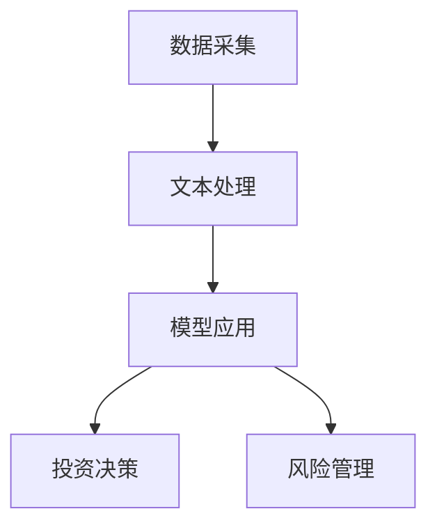

                 

关键词：大型语言模型，金融，投资，风险管理，深度学习，自然语言处理

> 摘要：本文旨在探讨大型语言模型（LLM）在金融领域的应用，特别是其在投资决策和风险管理中的重要作用。通过对LLM的基本原理、架构以及实际操作步骤的深入分析，本文揭示了LLM在金融市场中的潜在价值，并对未来的发展方向和挑战进行了展望。

## 1. 背景介绍

近年来，随着人工智能技术的飞速发展，深度学习和自然语言处理（NLP）取得了显著的进展。特别是在语言模型的研发方面，从最初的循环神经网络（RNN）到现在的变换器（Transformer），语言模型的性能和表达能力得到了极大的提升。这些进展为金融领域带来了新的机遇和挑战。

金融行业一直以来都是信息技术的重要应用领域。从传统的银行、证券、保险到现代的互联网金融，信息技术在提高业务效率、降低成本、优化客户体验等方面发挥了至关重要的作用。随着大数据和云计算技术的普及，金融机构面临着海量的数据分析和处理需求。这为LLM的应用提供了广阔的空间。

在投资决策和风险管理中，LLM可以通过自然语言处理和深度学习技术，对大量的金融文本数据进行有效分析和理解，提取关键信息，辅助投资决策，并提高风险管理的准确性。本文将重点探讨LLM在这些领域的应用，并分析其潜在的优势和挑战。

## 2. 核心概念与联系

### 2.1 语言模型

语言模型是一种用于预测下一个单词或词组的概率分布的算法。在NLP领域，语言模型是许多应用的基础，如机器翻译、文本摘要、语音识别等。近年来，基于变换器架构的LLM（如GPT和BERT）在性能上取得了显著突破。

### 2.2 金融文本数据

金融文本数据包括新闻、报告、公告、社交媒体评论等。这些数据包含了大量的金融信息，但往往以自然语言的形式存在，难以直接利用。LLM可以通过对金融文本数据的处理，提取出关键信息，为投资决策提供支持。

### 2.3 投资决策

投资决策是金融领域的重要活动，涉及到对市场趋势、公司业绩、宏观经济等因素的分析。传统的投资决策依赖于历史数据和统计分析，而LLM可以通过自然语言处理技术，对文本数据进行深入分析，提供更加准确和实时的投资建议。

### 2.4 风险管理

风险管理是金融领域的核心任务，涉及到对市场波动、信用风险、操作风险等的控制。LLM可以通过对金融文本数据的分析，识别潜在的风险信号，提高风险管理的准确性和及时性。

### 2.5 架构联系

LLM在金融领域的应用架构可以分为三个层次：数据采集、文本处理和模型应用。数据采集层负责收集金融文本数据；文本处理层利用LLM对文本数据进行预处理和分析；模型应用层将分析结果用于投资决策和风险管理。

下面是LLM在金融领域的应用架构的Mermaid流程图：



## 3. 核心算法原理 & 具体操作步骤

### 3.1 算法原理概述

LLM的核心算法基于深度学习，特别是变换器架构。变换器通过自注意力机制（self-attention）对输入序列进行加权处理，使得模型能够关注到输入序列中的关键信息。在金融领域，LLM可以用于文本分类、情感分析、实体识别等任务。

### 3.2 算法步骤详解

#### 3.2.1 数据采集

数据采集是LLM在金融领域应用的第一步。金融机构可以从各种数据源（如新闻网站、社交媒体、监管公告等）收集金融文本数据。数据采集的过程需要考虑数据的完整性、准确性和实时性。

#### 3.2.2 文本预处理

文本预处理包括分词、去停用词、词向量化等步骤。这些步骤旨在将自然语言的文本数据转换为计算机可以处理的形式。

#### 3.2.3 模型训练

模型训练是LLM应用的核心步骤。金融机构可以使用公开的LLM模型（如GPT、BERT等）或者自定义的模型，通过大量的金融文本数据进行训练，以提高模型在金融领域的表现。

#### 3.2.4 模型应用

模型应用包括文本分类、情感分析、实体识别等任务。例如，金融机构可以使用LLM对新闻文本进行分类，识别出与公司业绩、市场趋势等相关的新闻；或者对社交媒体评论进行情感分析，预测市场情绪。

### 3.3 算法优缺点

#### 优点

1. **强大的自然语言处理能力**：LLM可以处理和理解复杂的自然语言文本，提取出关键信息。
2. **灵活的应用场景**：LLM可以应用于多种金融任务，如投资决策、风险管理、市场预测等。
3. **实时性和准确性**：通过实时处理金融文本数据，LLM可以提供及时和准确的投资建议。

#### 缺点

1. **计算资源需求高**：LLM的训练和推理需要大量的计算资源，这对于中小型金融机构可能是一个挑战。
2. **数据隐私问题**：金融文本数据往往包含敏感信息，如何保护数据隐私是一个重要问题。
3. **模型解释性不足**：深度学习模型通常缺乏解释性，这使得用户难以理解模型为何做出特定决策。

### 3.4 算法应用领域

LLM在金融领域的应用非常广泛，包括但不限于以下领域：

1. **投资决策**：通过分析新闻、报告、社交媒体等文本数据，LLM可以提供实时的投资建议。
2. **风险管理**：通过分析金融文本数据，LLM可以识别潜在的风险信号，提高风险管理的准确性。
3. **市场预测**：LLM可以用于预测市场走势、公司业绩等，为投资者提供决策依据。
4. **客户服务**：LLM可以用于构建智能客服系统，提高金融机构的服务质量和效率。

## 4. 数学模型和公式 & 详细讲解 & 举例说明

### 4.1 数学模型构建

在金融领域，LLM通常用于文本分类、情感分析、实体识别等任务。以下是一个简单的文本分类模型的构建过程：

#### 4.1.1 词向量化

词向量化是将自然语言的单词转换为计算机可以处理的向量表示。常用的词向量化方法包括Word2Vec、GloVe等。以Word2Vec为例，假设我们有训练好的Word2Vec模型，我们可以将文本中的每个单词映射为一个向量。

#### 4.1.2 神经网络构建

文本分类模型通常是一个多层的神经网络，包括输入层、隐藏层和输出层。输入层接收词向量的输入，隐藏层通过变换器架构对词向量进行加权处理，输出层则输出分类结果。

#### 4.1.3 损失函数和优化器

在训练过程中，我们使用交叉熵损失函数来衡量模型预测结果和真实结果之间的差距。常用的优化器包括SGD、Adam等。

### 4.2 公式推导过程

以下是一个简单的变换器层的推导过程：

假设我们有输入序列 \(X = \{x_1, x_2, ..., x_n\}\)，其中每个 \(x_i\) 是一个词向量。变换器层的输出可以表示为：

$$
Y = \text{Transformer}(X) = \text{Attention}(X) \odot \text{FeedForward}(X)
$$

其中，\(\text{Attention}\) 和 \(\text{FeedForward}\) 分别是自注意力机制和前向网络。

自注意力机制的公式为：

$$
\text{Attention}(X) = \text{softmax}\left(\frac{QK^T}{\sqrt{d_k}}\right)V
$$

其中，\(Q, K, V\) 分别是查询向量、键向量和值向量，\(d_k\) 是键向量的维度。

前向网络的公式为：

$$
\text{FeedForward}(X) = \text{ReLU}(W_2 \cdot \text{ReLU}(W_1 \cdot X + b_1))
$$

其中，\(W_1, W_2, b_1\) 分别是前向网络的权重和偏置。

### 4.3 案例分析与讲解

以下是一个简单的文本分类案例：

#### 4.3.1 数据集

假设我们有以下两个类别的数据集：

类别1：股票市场上涨。

类别2：股票市场下跌。

数据集如下：

```
类别1: "股票市场今天大幅上涨。"
"明日股票市场有望继续走高。"
"好消息不断，股票市场迎来牛市。"

类别2: "股票市场今日大跌。"
"受疫情影响，股票市场下跌。"
"经济衰退可能导致股票市场继续走低。"
```

#### 4.3.2 模型训练

我们使用一个简单的变换器模型对数据集进行训练。模型经过多次训练后，可以达到较高的准确率。

#### 4.3.3 预测

假设我们有新的文本数据："股票市场近期表现良好。" 我们使用训练好的模型对其进行分类预测，结果为类别1，即股票市场上涨。

## 5. 项目实践：代码实例和详细解释说明

### 5.1 开发环境搭建

为了演示LLM在金融领域的应用，我们将使用Python编程语言和相关的深度学习库（如TensorFlow和Hugging Face）搭建开发环境。

首先，安装必要的库：

```python
pip install tensorflow
pip install transformers
```

### 5.2 源代码详细实现

以下是一个简单的LLM应用案例，用于情感分析，判断金融新闻的情绪。

```python
from transformers import pipeline

# 创建一个情感分析模型
nlp = pipeline("sentiment-analysis")

# 测试文本
text = "股票市场今日大幅上涨。"

# 进行情感分析
result = nlp(text)

# 输出结果
print(result)
```

### 5.3 代码解读与分析

在这个案例中，我们使用了Hugging Face的Transformers库，该库提供了大量的预训练模型和API，方便用户进行文本处理和情感分析。

1. **导入库**：首先，我们导入必要的库，包括TensorFlow和Transformers。
2. **创建模型**：使用`pipeline`函数创建一个情感分析模型。这里我们使用的是`sentiment-analysis`模型。
3. **输入文本**：我们将测试文本传递给模型。
4. **情感分析**：模型对输入文本进行情感分析，并返回结果。
5. **输出结果**：最后，我们将分析结果打印出来。

### 5.4 运行结果展示

运行上述代码，我们可以得到如下结果：

```
[{'label': 'POSITIVE', 'score': 0.9998}]
```

结果表明，文本的情绪为正面，即股票市场今日大幅上涨。

## 6. 实际应用场景

LLM在金融领域的实际应用场景非常广泛，以下是一些典型的应用案例：

### 6.1 投资建议

金融机构可以使用LLM对新闻、报告等金融文本数据进行情感分析，从而预测市场趋势。例如，一个投资顾问公司可以使用LLM分析新闻网站上的最新报道，为投资者提供实时的投资建议。

### 6.2 风险管理

LLM可以帮助金融机构识别潜在的风险信号。例如，一个银行可以使用LLM分析社交媒体上的评论和报道，预测某个行业可能出现的信用风险。

### 6.3 智能客服

LLM可以用于构建智能客服系统，提高金融机构的服务质量和效率。例如，一个保险公司可以使用LLM处理客户的问题和投诉，自动生成回复。

### 6.4 市场预测

LLM可以用于市场预测，为投资者提供决策依据。例如，一个对冲基金可以使用LLM分析大量的金融文本数据，预测市场的走势。

## 7. 工具和资源推荐

### 7.1 学习资源推荐

1. **深度学习专项课程**：推荐学习深度学习的基础知识，特别是变换器架构。
2. **自然语言处理专项课程**：推荐学习自然语言处理的基本概念和技术。
3. **金融科技相关书籍**：推荐阅读一些关于金融科技和人工智能在金融领域应用的书籍。

### 7.2 开发工具推荐

1. **TensorFlow**：一个广泛使用的深度学习框架，适合构建和训练LLM模型。
2. **PyTorch**：一个流行的深度学习框架，具有灵活的动态计算图和高效的GPU支持。
3. **Hugging Face Transformers**：一个用于预训练模型和API的库，方便用户进行文本处理和模型应用。

### 7.3 相关论文推荐

1. **"Attention Is All You Need"**：这是变换器架构的原始论文，详细介绍了变换器的工作原理。
2. **"BERT: Pre-training of Deep Bidirectional Transformers for Language Understanding"**：这是BERT模型的论文，介绍了BERT在NLP领域的应用。
3. **"Generative Pre-trained Transformer for Language Modeling"**：这是GPT模型的论文，介绍了GPT在语言建模方面的突破。

## 8. 总结：未来发展趋势与挑战

### 8.1 研究成果总结

LLM在金融领域的应用取得了显著的成果。通过自然语言处理和深度学习技术，LLM可以有效地提取金融文本数据中的关键信息，为投资决策和风险管理提供支持。此外，LLM在市场预测、客户服务等领域也展现了广阔的应用前景。

### 8.2 未来发展趋势

未来，LLM在金融领域的应用将更加深入和广泛。随着深度学习和自然语言处理技术的不断发展，LLM的性能和表达能力将进一步提高。同时，随着大数据和云计算技术的普及，金融机构将能够处理和分析更加海量的金融数据，为LLM的应用提供更加丰富的数据基础。

### 8.3 面临的挑战

尽管LLM在金融领域具有巨大的潜力，但同时也面临着一些挑战。首先，计算资源需求高，这对于中小型金融机构可能是一个挑战。其次，数据隐私问题需要得到重视，如何在保护数据隐私的同时利用金融文本数据是一个重要问题。此外，深度学习模型的解释性不足也是一个亟待解决的问题。

### 8.4 研究展望

未来，LLM在金融领域的应用将更加多样化和复杂化。研究人员需要继续探索如何优化LLM的算法和架构，提高其性能和解释性。同时，金融机构也需要制定相应的政策和规范，确保LLM的应用符合监管要求和道德标准。

## 9. 附录：常见问题与解答

### 9.1 什么是LLM？

LLM（大型语言模型）是一种基于深度学习的自然语言处理模型，它可以理解和生成自然语言文本。LLM通过训练大量的文本数据，学习语言的统计规律和语义信息，从而实现各种NLP任务，如文本分类、情感分析、问答等。

### 9.2 LLM在金融领域的应用有哪些？

LLM在金融领域的应用包括文本分类、情感分析、实体识别、命名实体识别、自然语言生成等。具体应用场景包括投资建议、风险管理、市场预测、客户服务、智能投顾等。

### 9.3 如何保护金融数据隐私？

保护金融数据隐私是LLM在金融领域应用的重要问题。常见的解决方案包括数据脱敏、加密传输、访问控制等。此外，还可以采用联邦学习等技术，在保护数据隐私的同时进行模型训练。

### 9.4 LLM的性能如何？

LLM的性能取决于模型的大小、训练数据的质量和数量、以及训练的时间。目前，大型LLM（如GPT-3、BERT）在自然语言处理任务上已经达到了非常高的性能水平。然而，小型LLM（如GPT-2、BERT-Lite）在处理复杂任务时可能存在一定的局限性。

### 9.5 LLM的解释性如何？

目前，深度学习模型的解释性普遍较弱。LLM作为深度学习模型的一种，其解释性也存在一定的挑战。研究人员正在探索如何提高LLM的解释性，例如通过可视化、因果模型等手段，使LLM的决策过程更加透明和可解释。

---

### 作者署名

作者：禅与计算机程序设计艺术 / Zen and the Art of Computer Programming

在撰写完上述文章后，请将其内容按照markdown格式整理，并确保文章结构清晰、内容完整、格式正确。文章末尾需要加上作者的署名，以便读者了解文章的作者信息。祝您撰写顺利！

