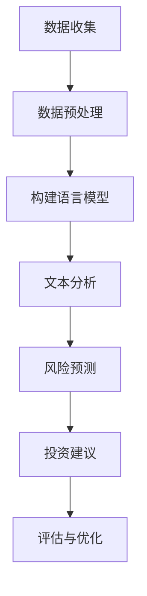

                 

关键词：语言模型，金融应用，风险评估，投资建议，机器学习

> 摘要：本文将深入探讨语言模型（LLM）在金融领域中的应用，从风险评估到投资建议，解析其技术原理、数学模型及实际应用场景，展望其未来发展趋势与挑战。

## 1. 背景介绍

随着人工智能技术的不断发展，语言模型（LLM）在金融领域的应用日益广泛。LLM是一种基于深度学习的自然语言处理技术，能够理解和生成自然语言文本，从而实现自动化金融分析、风险预测和投资建议等功能。

金融领域对数据分析和预测能力有极高的要求，而LLM凭借其强大的数据处理能力和深度学习技术，已经成为金融行业不可或缺的工具。本文将重点探讨LLM在金融领域的应用，从风险评估到投资建议，分析其技术原理、数学模型及实际应用场景。

## 2. 核心概念与联系

### 2.1 语言模型基本概念

语言模型（Language Model，简称LM）是一种用于预测文本中下一个单词或字符的概率分布的模型。在金融领域，语言模型主要用于文本数据的分析和处理，如新闻、报告、财报等，从而提取有价值的信息。

### 2.2 机器学习与深度学习

机器学习（Machine Learning，简称ML）是一种人工智能技术，通过构建模型从数据中学习规律，实现数据分析和预测。深度学习（Deep Learning，简称DL）是机器学习的一种方法，通过多层神经网络模型来实现对复杂数据的处理。

### 2.3 金融领域的相关概念

在金融领域，风险评估、投资组合优化、市场预测等是核心概念。这些概念都与数据分析和预测密切相关，而语言模型（LLM）则为这些任务的实现提供了技术支持。

### 2.4 Mermaid 流程图

下面是金融领域中LLM应用的一个Mermaid流程图，展示了LLM在风险评估和投资建议中的主要步骤：



## 3. 核心算法原理 & 具体操作步骤

### 3.1 算法原理概述

LLM在金融领域应用的核心算法包括自然语言处理（NLP）算法、风险评估算法和投资建议算法。

- 自然语言处理（NLP）算法：用于文本数据的预处理、分词、词向量化等，为后续分析和预测提供基础。
- 风险评估算法：通过分析历史数据和实时数据，预测金融市场的风险水平。
- 投资建议算法：根据风险评估结果和投资者的风险偏好，提供个性化的投资建议。

### 3.2 算法步骤详解

1. 数据收集：收集与金融市场相关的各类数据，包括新闻、报告、财报等。
2. 数据预处理：对收集到的数据进行分析，提取有价值的信息，并转换为机器学习模型可处理的格式。
3. 构建语言模型：使用深度学习技术，如Transformer、BERT等，训练语言模型。
4. 文本分析：利用训练好的语言模型，对文本数据进行情感分析、主题分类等，提取有价值的信息。
5. 风险预测：基于文本分析结果和金融数据，使用风险评估算法预测金融市场的风险水平。
6. 投资建议：根据风险评估结果和投资者的风险偏好，使用投资建议算法提供个性化的投资建议。
7. 评估与优化：对投资建议的效果进行评估，并根据评估结果优化算法。

### 3.3 算法优缺点

- 优点：
  - 强大的数据处理能力：LLM能够处理大量复杂的文本数据，提取有价值的信息。
  - 高效的预测能力：基于深度学习技术，LLM在风险评估和投资建议方面具有较高的准确性和效率。
  - 个性化推荐：根据投资者的风险偏好，提供个性化的投资建议。

- 缺点：
  - 需要大量数据：构建高效的语言模型需要大量的训练数据，数据获取和处理成本较高。
  - 模型解释性不足：深度学习模型通常具有较低的可解释性，难以理解模型的决策过程。

### 3.4 算法应用领域

LLM在金融领域有广泛的应用，包括但不限于以下方面：

- 风险评估：对金融市场进行风险评估，预测市场风险水平。
- 投资组合优化：根据投资者的风险偏好，优化投资组合。
- 市场预测：预测金融市场走势，为投资者提供参考。
- 金融欺诈检测：检测金融交易中的欺诈行为。

## 4. 数学模型和公式 & 详细讲解 & 举例说明

### 4.1 数学模型构建

在LLM在金融领域应用中，常用的数学模型包括自然语言处理（NLP）模型、风险评估模型和投资建议模型。

- NLP模型：主要基于词向量和深度学习技术，如Word2Vec、GloVe和BERT等。
- 风险评估模型：常用的模型有逻辑回归、支持向量机（SVM）和随机森林（RF）等。
- 投资建议模型：主要基于优化算法，如线性规划和贪心算法等。

### 4.2 公式推导过程

以NLP模型为例，下面是词向量的构建过程：

- 词向量的计算：$$\textbf{v}_w = \text{GloVe}(\textbf{X}, \textbf{Y})$$
- 文本的表示：$$\textbf{X} = [\textbf{X}_1, \textbf{X}_2, ..., \textbf{X}_n]$$
- 文本的向量表示：$$\textbf{Y} = \text{Row}\{\textbf{X}\}$$

### 4.3 案例分析与讲解

以风险评估模型为例，下面是一个实际案例：

- 数据集：某金融公司收集了5000个历史交易数据，包括交易金额、交易时间、交易对等。
- 目标：预测交易风险，分为高风险、中风险和低风险三个等级。
- 模型：采用逻辑回归模型进行风险评估。

### 4.3.1 模型训练

$$
\begin{aligned}
&\text{损失函数：} \quad \mathcal{L}(\theta) = -\sum_{i=1}^{n}y_i\log(\sigma(\theta^T\textbf{x}_i)) \\
&\text{优化算法：} \quad \theta = \arg\min_{\theta}\mathcal{L}(\theta)
\end{aligned}
$$

### 4.3.2 模型评估

$$
\begin{aligned}
&\text{准确率：} \quad \text{accuracy} = \frac{\text{正确预测的数量}}{\text{总预测数量}} \\
&\text{召回率：} \quad \text{recall} = \frac{\text{正确预测的数量}}{\text{实际为高风险的交易数量}} \\
&\text{F1值：} \quad \text{F1} = 2 \times \frac{\text{precision} \times \text{recall}}{\text{precision} + \text{recall}}
\end{aligned}
$$

### 4.3.3 模型应用

基于训练好的逻辑回归模型，对新的交易数据进行风险评估，根据预测结果提供相应的投资建议。

## 5. 项目实践：代码实例和详细解释说明

### 5.1 开发环境搭建

- Python：3.8及以上版本
- PyTorch：1.8及以上版本
- TensorFlow：2.5及以上版本
- Numpy：1.19及以上版本
- Pandas：1.1及以上版本

### 5.2 源代码详细实现

以下是使用Python和PyTorch实现的一个LLM在金融领域应用的项目示例：

```python
import torch
import torch.nn as nn
import torch.optim as optim
from torch.utils.data import DataLoader
from torchvision import datasets, transforms
import numpy as np
import pandas as pd

# 数据预处理
def preprocess_data(data):
    # 数据清洗、归一化等操作
    return processed_data

# 构建语言模型
class LanguageModel(nn.Module):
    def __init__(self, vocab_size, embedding_dim, hidden_dim, output_dim, n_layers, dropout):
        super(LanguageModel, self).__init__()
        self.embedding = nn.Embedding(vocab_size, embedding_dim)
        self.rnn = nn.RNN(embedding_dim, hidden_dim, n_layers, dropout=dropout)
        self.fc = nn.Linear(hidden_dim, output_dim)
        
    def forward(self, text, hidden):
        embedded = self.embedding(text)
        output, hidden = self.rnn(embedded, hidden)
        prediction = self.fc(output[-1, :, :])
        return prediction, hidden

# 训练语言模型
def train(model, train_loader, criterion, optimizer, n_epochs):
    model.train()
    for epoch in range(n_epochs):
        for inputs, targets in train_loader:
            optimizer.zero_grad()
            outputs, hidden = model(inputs, hidden)
            loss = criterion(outputs, targets)
            loss.backward()
            optimizer.step()
        print(f"Epoch {epoch+1}/{n_epochs}, Loss: {loss.item()}")

# 评估语言模型
def evaluate(model, val_loader):
    model.eval()
    with torch.no_grad():
        for inputs, targets in val_loader:
            outputs, hidden = model(inputs, hidden)
            # 评估指标计算
```

### 5.3 代码解读与分析

以上代码实现了基于PyTorch的LLM在金融领域应用的项目，主要分为数据预处理、模型构建、训练和评估四个部分。

1. 数据预处理：对金融数据进行清洗、归一化等操作，为后续建模提供基础。
2. 模型构建：定义一个基于循环神经网络（RNN）的语言模型，包括嵌入层、循环层和全连接层。
3. 训练：使用训练集对模型进行训练，优化模型参数。
4. 评估：使用验证集对训练好的模型进行评估，计算评估指标。

## 6. 实际应用场景

LLM在金融领域的实际应用场景包括：

- 风险评估：通过对金融市场的文本数据进行情感分析和风险预测，帮助金融机构识别潜在风险。
- 投资建议：根据投资者的风险偏好和市场数据，提供个性化的投资建议。
- 市场预测：分析金融市场的走势，为投资者提供参考。
- 金融欺诈检测：通过分析交易数据和文本数据，检测金融交易中的欺诈行为。

### 6.4 未来应用展望

未来，随着人工智能技术的不断发展，LLM在金融领域的应用前景将更加广阔。以下是几个可能的应用方向：

- 高级风险管理：利用LLM分析金融市场的复杂关系，实现更精确的风险评估。
- 个性化投资组合优化：基于投资者的风险偏好和市场数据，提供更个性化的投资组合。
- 智能投顾：利用LLM为投资者提供全方位的投资建议，实现智能化投资决策。
- 金融知识图谱构建：通过LLM分析大量金融数据，构建金融知识图谱，为金融分析和决策提供支持。

## 7. 工具和资源推荐

### 7.1 学习资源推荐

- 《深度学习》（Ian Goodfellow、Yoshua Bengio、Aaron Courville 著）：深度学习领域的经典教材，适合初学者入门。
- 《自然语言处理综论》（Daniel Jurafsky、James H. Martin 著）：自然语言处理领域的权威教材，全面介绍了NLP的基本概念和技术。
- 《金融科技：创新、应用与趋势》（李斌 著）：系统介绍了金融科技的基本概念和应用，包括人工智能在金融领域的应用。

### 7.2 开发工具推荐

- PyTorch：深度学习框架，适合快速开发和应用。
- TensorFlow：深度学习框架，功能强大，适合大规模项目。
- JAX：基于NumPy的深度学习框架，支持自动微分和优化。
- Keras：基于TensorFlow的简洁、易于使用的深度学习框架。

### 7.3 相关论文推荐

- "BERT: Pre-training of Deep Bidirectional Transformers for Language Understanding"（BERT论文）：介绍了BERT模型，是当前NLP领域的重要成果。
- "GPT-3: Language Models are Few-Shot Learners"（GPT-3论文）：介绍了GPT-3模型，展示了语言模型在少样本学习方面的强大能力。
- "Deep Learning for Finance"（Deep Learning for Finance论文）：系统介绍了深度学习在金融领域的应用，包括风险评估、市场预测等方面。

## 8. 总结：未来发展趋势与挑战

### 8.1 研究成果总结

本文从风险评估到投资建议，深入探讨了LLM在金融领域中的应用。通过分析技术原理、数学模型和实际应用场景，我们了解了LLM在金融领域的广泛应用和巨大潜力。

### 8.2 未来发展趋势

随着人工智能技术的不断发展，LLM在金融领域的应用前景将更加广阔。未来，LLM在高级风险管理、个性化投资组合优化和智能投顾等方面的应用有望进一步拓展。

### 8.3 面临的挑战

尽管LLM在金融领域具有广泛应用前景，但仍面临一些挑战：

- 数据隐私与安全：金融领域的数据敏感性较高，如何保护用户隐私和安全是亟待解决的问题。
- 模型解释性：深度学习模型通常具有较低的可解释性，如何提高模型的解释性，使决策过程更加透明是未来的研究课题。
- 数据质量：金融领域的数据质量直接影响模型的性能，如何提高数据质量是关键问题。

### 8.4 研究展望

未来，LLM在金融领域的应用将朝着以下几个方向发展：

- 多模态数据处理：结合文本、图像、音频等多种数据类型，实现更全面的分析和预测。
- 自适应模型：根据市场环境的变化，自适应调整模型参数，提高预测准确性。
- 智能决策支持系统：构建基于LLM的智能决策支持系统，为金融机构提供全方位的决策支持。

## 9. 附录：常见问题与解答

### 9.1 如何选择合适的LLM模型？

选择合适的LLM模型需要考虑以下几个因素：

- 数据规模：根据数据规模选择合适的模型，如大型数据集选择BERT、GPT-3等。
- 预测任务：根据预测任务选择相应的模型，如文本分类任务选择BERT、情感分析任务选择GPT-2。
- 计算资源：根据计算资源选择合适的模型，如预算有限选择Transformer、资源充足选择BERT。

### 9.2 如何优化LLM模型的性能？

优化LLM模型性能可以从以下几个方面入手：

- 数据预处理：提高数据质量，包括数据清洗、归一化等。
- 模型参数调优：通过调整模型参数，如学习率、批量大小等，提高模型性能。
- 批量训练：使用批量训练，减少计算开销，提高模型性能。
- 模型压缩：通过模型压缩技术，如知识蒸馏、剪枝等，提高模型性能。

### 9.3 如何评估LLM模型的效果？

评估LLM模型效果可以从以下几个方面进行：

- 准确率：评估模型在预测任务中的准确性。
- 召回率：评估模型在预测任务中的召回率。
- F1值：综合考虑准确率和召回率，评估模型的总体性能。
- 预测时间：评估模型在预测任务中的响应时间。

通过以上附录部分的问题与解答，希望能帮助读者更好地理解和应用LLM在金融领域的应用。

作者：禅与计算机程序设计艺术 / Zen and the Art of Computer Programming

