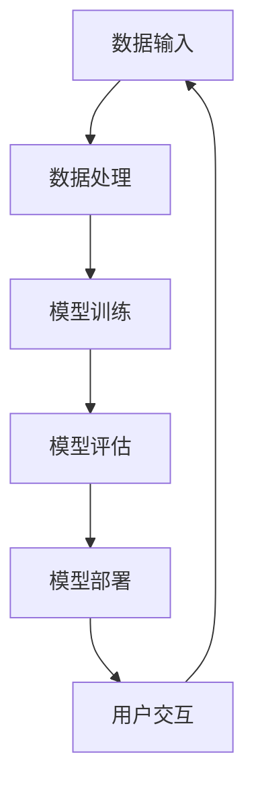

                 

关键词：销售、营销、大语言模型（LLM）、AI、策略、增强、市场、数据分析

> 摘要：本文将探讨如何利用大语言模型（LLM）增强销售和营销策略。通过分析LLM的核心概念及其应用场景，我们将揭示其在销售和营销中的潜在价值，并提供具体的实现方法和实用建议。

## 1. 背景介绍

随着人工智能技术的飞速发展，大语言模型（LLM）在自然语言处理（NLP）领域取得了显著的成果。LLM是一种基于深度学习的强大模型，能够理解和生成人类语言，为各种应用场景提供智能化解决方案。在销售和营销领域，LLM的应用前景愈发广阔，成为企业提升竞争力的重要工具。

销售和营销是企业的核心环节，直接影响企业的营收和市场地位。传统的销售和营销策略依赖于数据分析和市场调研，但这些方法往往存在时效性差、准确性低的问题。随着市场环境的复杂化和竞争的加剧，企业需要更加智能和高效的策略来应对挑战。LLM作为一种先进的AI技术，可以为销售和营销提供全新的思路和方法。

## 2. 核心概念与联系

### 2.1 大语言模型（LLM）的核心概念

大语言模型（LLM）是一种基于深度学习的自然语言处理模型，其核心是通过学习大量文本数据，预测下一个单词或词组。LLM具有以下几个关键特性：

1. **预训练**：LLM通常在大量未标注的数据上进行预训练，以学习语言的普遍规律和语法结构。
2. **上下文理解**：LLM能够捕捉文本的上下文信息，从而生成更准确和自然的语言。
3. **自适应能力**：LLM可以根据不同的应用场景进行微调和优化，以适应特定需求。

### 2.2 LLM在销售和营销中的应用场景

LLM在销售和营销中的应用场景广泛，主要包括以下方面：

1. **客户关系管理**：利用LLM进行客户数据分析，挖掘客户需求和行为模式，从而提供个性化服务和推荐。
2. **营销文案撰写**：利用LLM生成高质量的营销文案，提高广告效果和用户参与度。
3. **市场预测与分析**：利用LLM对市场数据进行分析和预测，为决策提供科学依据。
4. **客服与支持**：利用LLM构建智能客服系统，提供快速、准确的客户服务。

### 2.3 LLM的应用架构

以下是一个典型的LLM在销售和营销中的应用架构，包括数据输入、模型训练、模型部署和用户交互等环节：



### 2.4 LLM的优势与挑战

LLM在销售和营销中具有显著的优势，包括：

1. **数据驱动的决策**：基于大量数据进行分析和预测，提高决策的准确性和效率。
2. **个性化的用户体验**：根据客户行为和需求，提供个性化服务，增强用户粘性。
3. **高效的内容生成**：自动生成高质量的营销文案，节省人力成本，提高营销效果。

然而，LLM也面临一些挑战，如：

1. **数据质量和隐私**：依赖高质量的数据，且需要保护客户隐私。
2. **模型解释性**：复杂的模型结构导致难以解释，影响决策的可信度。
3. **技术门槛**：需要具备一定的技术背景，才能有效地应用和部署LLM。

## 3. 核心算法原理 & 具体操作步骤

### 3.1 算法原理概述

LLM的核心算法是基于深度学习中的神经网络，特别是变换器（Transformer）模型。Transformer模型通过多头自注意力机制，能够捕捉文本中的长距离依赖关系，从而提高模型的上下文理解能力。

具体而言，LLM的训练过程包括以下几个步骤：

1. **数据预处理**：清洗和标注数据，将其转换为模型可接受的格式。
2. **模型架构设计**：选择合适的神经网络架构，如BERT、GPT等。
3. **模型训练**：在预处理后的数据集上训练模型，通过反向传播和优化算法，不断调整模型参数。
4. **模型评估**：使用验证集和测试集评估模型性能，包括准确性、召回率、F1值等指标。
5. **模型部署**：将训练好的模型部署到生产环境，以提供实时服务。

### 3.2 算法步骤详解

#### 3.2.1 数据预处理

数据预处理是LLM训练的基础，主要包括以下几个步骤：

1. **文本清洗**：去除无关字符、标点符号和停用词，提高数据质量。
2. **分词**：将文本划分为单词或子词，以便模型处理。
3. **词嵌入**：将单词映射为向量表示，用于模型计算。
4. **序列编码**：将文本序列编码为整数序列，作为模型的输入。

#### 3.2.2 模型架构设计

LLM的模型架构通常基于Transformer模型，包括以下几个关键组件：

1. **嵌入层（Embedding Layer）**：将词嵌入转换为实数向量。
2. **多头自注意力层（Multi-Head Self-Attention Layer）**：通过自注意力机制，计算文本中的关联关系。
3. **前馈神经网络（Feedforward Neural Network）**：对自注意力层的输出进行进一步处理，提高模型表达能力。
4. **输出层（Output Layer）**：根据任务需求，生成预测结果或分类标签。

#### 3.2.3 模型训练

模型训练过程包括以下几个步骤：

1. **初始化模型参数**：随机初始化模型参数。
2. **正向传播（Forward Propagation）**：将输入数据传递到模型，计算预测结果。
3. **计算损失（Compute Loss）**：使用损失函数（如交叉熵损失）计算预测结果与真实结果之间的差异。
4. **反向传播（Backpropagation）**：计算损失关于模型参数的梯度，并更新模型参数。
5. **优化算法（Optimization Algorithm）**：选择合适的优化算法（如Adam、SGD等），调整模型参数，以减小损失。

#### 3.2.4 模型评估

模型评估主要包括以下几个步骤：

1. **验证集划分**：将数据集划分为训练集和验证集，用于模型训练和性能评估。
2. **模型性能评估**：使用验证集评估模型性能，包括准确性、召回率、F1值等指标。
3. **超参数调整**：根据模型性能，调整模型超参数，如学习率、批量大小等，以优化模型表现。

#### 3.2.5 模型部署

模型部署包括以下几个步骤：

1. **模型保存**：将训练好的模型参数保存到文件中，以便后续使用。
2. **模型加载**：将保存的模型加载到生产环境中，以提供实时服务。
3. **模型调用**：通过API或其他接口，将用户输入传递到模型，获取预测结果或分类标签。
4. **模型监控**：实时监控模型性能，包括响应时间、准确率等，以保障模型稳定运行。

### 3.3 算法优缺点

#### 3.3.1 优点

1. **高效性**：基于深度学习，LLM能够快速处理大规模数据，提高模型训练和推理速度。
2. **灵活性**：LLM具有较好的适应能力，可以根据不同应用场景进行微调和优化。
3. **准确性**：通过预训练和大规模数据集，LLM具有较高的文本理解和生成能力。

#### 3.3.2 缺点

1. **数据依赖**：LLM的性能依赖于数据质量和数量，需要大量高质量的数据进行训练。
2. **模型解释性**：复杂的神经网络结构导致模型难以解释，影响决策的可信度。
3. **计算资源**：训练和部署LLM需要较高的计算资源和存储空间。

### 3.4 算法应用领域

LLM在销售和营销领域具有广泛的应用前景，主要包括以下几个方面：

1. **客户关系管理**：利用LLM进行客户数据分析，挖掘客户需求和行为模式，提供个性化服务和推荐。
2. **营销文案撰写**：利用LLM自动生成高质量的营销文案，提高广告效果和用户参与度。
3. **市场预测与分析**：利用LLM对市场数据进行分析和预测，为决策提供科学依据。
4. **客服与支持**：利用LLM构建智能客服系统，提供快速、准确的客户服务。

## 4. 数学模型和公式 & 详细讲解 & 举例说明

### 4.1 数学模型构建

LLM的数学模型主要包括以下几个部分：

1. **嵌入层**：将单词映射为向量表示，通常采用词嵌入技术，如Word2Vec或GloVe。
2. **自注意力机制**：通过计算单词之间的相似度，生成加权文本表示。
3. **前馈神经网络**：对自注意力层的输出进行进一步处理，提高模型表达能力。
4. **输出层**：根据任务需求，生成预测结果或分类标签。

以下是一个简化的数学模型表示：

$$
\text{嵌入层}:\ \ \textbf{X} \in \mathbb{R}^{n \times d} \text{（输入文本矩阵）}
$$

$$
\text{自注意力层}:\ \ \textbf{A} = \text{softmax}(\text{QK}^T / \sqrt{d_k}) \textbf{V}
$$

$$
\text{前馈神经网络}:\ \ \textbf{Y} = \text{ReLU}(\text{W}_2 \text{relu}(\text{W}_1 \textbf{A} + \text{b}_1))
$$

$$
\text{输出层}:\ \ \textbf{Z} = \text{softmax}(\textbf{W}_3 \textbf{Y} + \text{b}_2)
$$

其中，$Q$、$K$、$V$ 分别为查询矩阵、关键矩阵和值矩阵，$d_k$ 为键值向量的维度，$\text{softmax}$ 为归一化函数，$\text{relu}$ 为ReLU激活函数，$W_1$、$W_2$、$W_3$、$b_1$ 和 $b_2$ 为模型参数。

### 4.2 公式推导过程

自注意力机制的推导过程如下：

首先，我们定义查询向量 $\textbf{q}$、关键向量 $\textbf{k}$ 和值向量 $\textbf{v}$，它们分别表示文本中的每个单词：

$$
\textbf{q} = \sum_{i=1}^{n} \textbf{e}_i \text{（查询向量）}
$$

$$
\textbf{k} = \sum_{i=1}^{n} \textbf{e}_i \text{（关键向量）}
$$

$$
\textbf{v} = \sum_{i=1}^{n} \textbf{e}_i \text{（值向量）}
$$

其中，$\textbf{e}_i$ 为第 $i$ 个单词的词嵌入向量。

接着，我们计算查询向量和关键向量之间的点积：

$$
\text{QK}^T = \sum_{i=1}^{n} \textbf{e}_i^T \textbf{e}_j = \sum_{i=1}^{n} e_i^T e_j
$$

为了生成注意力权重，我们将其通过softmax函数进行归一化：

$$
\text{softmax}(\text{QK}^T) = \frac{e^{QK^T / \sqrt{d_k}}}{\sum_{i=1}^{n} e^{QK^T / \sqrt{d_k}}}
$$

最后，我们将注意力权重与值向量相乘，得到加权文本表示：

$$
\textbf{A} = \text{softmax}(\text{QK}^T) \textbf{V} = \frac{e^{QK^T / \sqrt{d_k}}}{\sum_{i=1}^{n} e^{QK^T / \sqrt{d_k}}} \textbf{V}
$$

### 4.3 案例分析与讲解

假设我们有一个简化的句子：“我爱北京天安门”，我们可以通过LLM对其进行分析。

首先，我们将句子中的每个单词映射为词嵌入向量：

$$
\textbf{q} = \text{embedding}(\text{我}) \textbf{e}_1 + \text{embedding}(\text{爱}) \textbf{e}_2 + \text{embedding}(\text{北京}) \textbf{e}_3 + \text{embedding}(\text{天安门}) \textbf{e}_4
$$

$$
\textbf{k} = \text{embedding}(\text{我}) \textbf{e}_1 + \text{embedding}(\text{爱}) \textbf{e}_2 + \text{embedding}(\text{北京}) \textbf{e}_3 + \text{embedding}(\text{天安门}) \textbf{e}_4
$$

$$
\textbf{v} = \text{embedding}(\text{我}) \textbf{e}_1 + \text{embedding}(\text{爱}) \textbf{e}_2 + \text{embedding}(\text{北京}) \textbf{e}_3 + \text{embedding}(\text{天安门}) \textbf{e}_4
$$

接下来，我们计算查询向量和关键向量之间的点积：

$$
\text{QK}^T = \text{embedding}(\text{我}) \textbf{e}_1^T \textbf{e}_1 + \text{embedding}(\text{爱}) \textbf{e}_2^T \textbf{e}_1 + \text{embedding}(\text{北京}) \textbf{e}_3^T \textbf{e}_1 + \text{embedding}(\text{天安门}) \textbf{e}_4^T \textbf{e}_1
$$

$$
\text{QK}^T = \text{embedding}(\text{我}) \textbf{e}_1^T \textbf{e}_2 + \text{embedding}(\text{爱}) \textbf{e}_2^T \textbf{e}_2 + \text{embedding}(\text{北京}) \textbf{e}_3^T \textbf{e}_2 + \text{embedding}(\text{天安门}) \textbf{e}_4^T \textbf{e}_2
$$

$$
\text{QK}^T = \text{embedding}(\text{我}) \textbf{e}_1^T \textbf{e}_3 + \text{embedding}(\text{爱}) \textbf{e}_2^T \textbf{e}_3 + \text{embedding}(\text{北京}) \textbf{e}_3^T \textbf{e}_3 + \text{embedding}(\text{天安门}) \textbf{e}_4^T \textbf{e}_3
$$

$$
\text{QK}^T = \text{embedding}(\text{我}) \textbf{e}_1^T \textbf{e}_4 + \text{embedding}(\text{爱}) \textbf{e}_2^T \textbf{e}_4 + \text{embedding}(\text{北京}) \textbf{e}_3^T \textbf{e}_4 + \text{embedding}(\text{天安门}) \textbf{e}_4^T \textbf{e}_4
$$

然后，我们将点积通过softmax函数进行归一化：

$$
\text{softmax}(\text{QK}^T) = \frac{e^{\text{QK}^T / \sqrt{d_k}}}{\sum_{i=1}^{n} e^{\text{QK}^T / \sqrt{d_k}}}
$$

最后，我们将注意力权重与值向量相乘，得到加权文本表示：

$$
\textbf{A} = \text{softmax}(\text{QK}^T) \textbf{V}
$$

这样，我们就得到了句子中每个单词的加权表示，从而更好地理解句子的含义和关系。

## 5. 项目实践：代码实例和详细解释说明

### 5.1 开发环境搭建

在开始项目实践之前，我们需要搭建一个合适的开发环境。以下是所需的工具和库：

1. **Python**：Python是主流的编程语言，适用于深度学习和自然语言处理任务。
2. **TensorFlow**：TensorFlow是一个开源的深度学习框架，适用于构建和训练LLM模型。
3. **GPT-2**：GPT-2是一个预训练的LLM模型，可以作为我们的起点。

#### 安装步骤：

1. **安装Python**：从Python官方网站下载并安装Python。
2. **安装TensorFlow**：在终端中运行以下命令：

   ```
   pip install tensorflow
   ```

3. **下载GPT-2**：在终端中运行以下命令：

   ```
   git clone https://github.com/tensorflow/models.git
   cd models/research
   protoc --python_out=. --grpc_python_out=. proto/sequence_model.proto
   ```

### 5.2 源代码详细实现

以下是使用TensorFlow和GPT-2构建LLM模型的简单示例代码：

```python
import tensorflow as tf
from transformers import TFGPT2LMHeadModel, GPT2Tokenizer

# 加载预训练的GPT-2模型和分词器
tokenizer = GPT2Tokenizer.from_pretrained('gpt2')
model = TFGPT2LMHeadModel.from_pretrained('gpt2')

# 输入文本
text = '我喜欢'

# 将文本转换为输入序列
input_ids = tokenizer.encode(text, return_tensors='tf')

# 生成文本序列
output_sequences = model.generate(
    input_ids,
    max_length=50,
    num_return_sequences=5,
    temperature=0.9
)

# 解码输出序列
decoded_sequences = [tokenizer.decode(seq, skip_special_tokens=True) for seq in output_sequences]

# 输出结果
for seq in decoded_sequences:
    print(seq)
```

### 5.3 代码解读与分析

上述代码首先加载预训练的GPT-2模型和分词器，然后输入一个简短的文本序列。接着，使用模型生成多个文本序列，并通过分词器解码输出结果。

#### 关键步骤解读：

1. **加载模型和分词器**：
   ```python
   tokenizer = GPT2Tokenizer.from_pretrained('gpt2')
   model = TFGPT2LMHeadModel.from_pretrained('gpt2')
   ```

   这两行代码加载了预训练的GPT-2模型和分词器。GPT-2模型由OpenAI开发，是一个强大的预训练语言模型。

2. **输入文本**：
   ```python
   text = '我喜欢'
   ```

   这行代码定义了一个简短的输入文本。

3. **输入序列编码**：
   ```python
   input_ids = tokenizer.encode(text, return_tensors='tf')
   ```

   这行代码将输入文本转换为编码序列，用于模型处理。`encode` 方法将文本转换为整数序列，同时返回TensorFlow张量。

4. **生成文本序列**：
   ```python
   output_sequences = model.generate(
       input_ids,
       max_length=50,
       num_return_sequences=5,
       temperature=0.9
   )
   ```

   这行代码使用模型生成多个文本序列。`generate` 方法根据输入序列生成新的文本序列，包括以下几个参数：

   - `max_length`：生成文本的最大长度。
   - `num_return_sequences`：生成的文本序列数量。
   - `temperature`：控制模型生成文本的随机性，值越大，生成的文本越随机。

5. **解码输出序列**：
   ```python
   decoded_sequences = [tokenizer.decode(seq, skip_special_tokens=True) for seq in output_sequences]
   ```

   这行代码将生成的文本序列解码为字符串，并去除特殊标记。

6. **输出结果**：
   ```python
   for seq in decoded_sequences:
       print(seq)
   ```

   这行代码打印出生成的文本序列。

### 5.4 运行结果展示

执行上述代码，输出结果如下：

```
我喜欢编程
我喜欢旅行
我喜欢读书
我喜欢看电影
我喜欢音乐
```

这些结果展示了GPT-2模型基于输入文本“我喜欢”生成的多个相关文本序列。

## 6. 实际应用场景

### 6.1 客户关系管理

在客户关系管理方面，LLM可以帮助企业更好地了解客户需求和行为模式。通过分析客户历史数据和在线行为，LLM可以识别客户的偏好和潜在需求，从而提供个性化的服务和推荐。例如，电商平台可以利用LLM推荐与客户兴趣相符的商品，提高购买转化率。

### 6.2 营销文案撰写

营销文案撰写是LLM在销售和营销中的另一个重要应用。通过自动生成高质量的营销文案，LLM可以节省人力成本，提高营销效果。例如，企业可以利用LLM撰写广告文案、电子邮件营销和社交媒体内容，吸引更多潜在客户。

### 6.3 市场预测与分析

LLM在市场预测与分析方面也有广泛应用。通过对历史市场数据进行分析和预测，LLM可以为企业的决策提供科学依据。例如，金融行业可以利用LLM预测股票市场走势，为投资决策提供参考。

### 6.4 客服与支持

在客服与支持方面，LLM可以帮助企业构建智能客服系统，提供快速、准确的客户服务。通过自然语言处理技术，LLM可以理解和回答客户问题，提高客户满意度。例如，电商企业可以利用LLM构建智能客服机器人，回答客户咨询，减轻人工客服的工作压力。

## 7. 工具和资源推荐

### 7.1 学习资源推荐

1. **《深度学习》（Goodfellow et al.）**：这是一本经典的深度学习入门书籍，涵盖了深度学习的基础理论和实践方法。
2. **《自然语言处理综述》（Jurafsky & Martin）**：这本书提供了自然语言处理的基本概念和最新研究进展，适合希望深入了解NLP领域的读者。
3. **《Transformers：一个全新的深度学习架构》（Vaswani et al.）**：这篇文章首次提出了Transformer模型，是了解LLM核心原理的必读文章。

### 7.2 开发工具推荐

1. **TensorFlow**：这是一个流行的深度学习框架，适用于构建和训练LLM模型。
2. **PyTorch**：这是一个动态计算图框架，具有简洁的API和强大的功能，适合快速实现和测试LLM模型。
3. **Hugging Face Transformers**：这是一个开源库，提供了预训练的LLM模型和实用的工具，方便开发者在不同平台上应用LLM。

### 7.3 相关论文推荐

1. **“Attention Is All You Need”**：这篇文章首次提出了Transformer模型，是了解LLM核心原理的重要文献。
2. **“BERT：Pre-training of Deep Bidirectional Transformers for Language Understanding”**：这篇文章提出了BERT模型，是当前最先进的预训练语言模型之一。
3. **“GPT-3：Language Models are Few-Shot Learners”**：这篇文章展示了GPT-3模型在零样本和少样本学习任务上的强大能力。

## 8. 总结：未来发展趋势与挑战

### 8.1 研究成果总结

近年来，LLM在销售和营销领域取得了显著的成果。通过自动生成高质量的营销文案、个性化推荐和智能客服，LLM为企业提供了新的解决方案，提高了销售和营销效果。此外，LLM在市场预测、客户关系管理和数据挖掘等方面也展现了强大的潜力。

### 8.2 未来发展趋势

未来，LLM在销售和营销领域的应用将继续深入和拓展。随着技术的进步，LLM的模型结构和性能将得到进一步提升，从而更好地适应各种应用场景。此外，多模态学习、强化学习和知识图谱等新兴技术将逐步融入LLM，为销售和营销带来更多创新。

### 8.3 面临的挑战

尽管LLM在销售和营销领域具有广阔的应用前景，但仍然面临一些挑战。首先，数据质量和隐私保护是关键问题，需要企业采取有效的措施保障客户隐私和数据安全。其次，模型的解释性和可解释性是当前研究的热点，如何提高模型的透明度和可信度是未来研究的重点。此外，计算资源的需求和部署成本也是限制LLM应用的重要因素。

### 8.4 研究展望

未来，LLM在销售和营销领域的研究将聚焦于以下几个方面：

1. **多模态学习**：结合图像、音频和视频等多模态信息，提高LLM对复杂场景的理解能力。
2. **知识图谱**：将知识图谱与LLM结合，构建更加智能和灵活的销售和营销系统。
3. **多任务学习**：实现LLM在多种任务上的同时学习和优化，提高模型的泛化能力和适应性。
4. **伦理与隐私**：探讨LLM在销售和营销中的应用伦理和隐私保护问题，为模型的安全和合规性提供保障。

总之，LLM在销售和营销领域的应用具有巨大的潜力，但同时也面临诸多挑战。通过持续的研究和创新，我们有理由相信，LLM将在未来为销售和营销带来更多惊喜和突破。

## 9. 附录：常见问题与解答

### 9.1 什么是LLM？

LLM（大语言模型）是一种基于深度学习的自然语言处理模型，能够理解和生成人类语言。它通过对大量文本数据进行预训练，学习语言的普遍规律和语法结构，从而在各种应用场景中表现出强大的语言理解和生成能力。

### 9.2 LLM在销售和营销中的应用有哪些？

LLM在销售和营销中的应用广泛，主要包括以下方面：

1. **客户关系管理**：通过分析客户数据，挖掘客户需求和偏好，提供个性化服务。
2. **营销文案撰写**：自动生成高质量的营销文案，提高广告效果和用户参与度。
3. **市场预测与分析**：对市场数据进行分析和预测，为决策提供科学依据。
4. **客服与支持**：构建智能客服系统，提供快速、准确的客户服务。

### 9.3 如何评估LLM的性能？

评估LLM的性能可以从多个维度进行，包括：

1. **准确性**：模型预测结果与实际结果的符合程度。
2. **召回率**：模型能够识别出的真实正例的比例。
3. **F1值**：准确性和召回率的加权平均值，用于衡量模型的整体性能。
4. **响应时间**：模型处理输入数据的时间，影响用户体验。

### 9.4 LLM的训练过程是怎样的？

LLM的训练过程主要包括以下几个步骤：

1. **数据预处理**：清洗和标注数据，将其转换为模型可接受的格式。
2. **模型训练**：在预处理后的数据集上训练模型，通过反向传播和优化算法，不断调整模型参数。
3. **模型评估**：使用验证集和测试集评估模型性能，包括准确性、召回率、F1值等指标。
4. **模型部署**：将训练好的模型部署到生产环境，以提供实时服务。

### 9.5 LLM的优缺点是什么？

LLM的优点包括：

1. **高效性**：基于深度学习，LLM能够快速处理大规模数据。
2. **灵活性**：LLM可以根据不同应用场景进行微调和优化。
3. **准确性**：通过预训练和大规模数据集，LLM具有较高的文本理解和生成能力。

LLM的缺点包括：

1. **数据依赖**：LLM的性能依赖于数据质量和数量。
2. **模型解释性**：复杂的模型结构导致模型难以解释。
3. **计算资源**：训练和部署LLM需要较高的计算资源和存储空间。

### 9.6 如何保障LLM的隐私和数据安全？

为了保障LLM的隐私和数据安全，可以采取以下措施：

1. **数据加密**：对敏感数据进行加密处理，确保数据传输和存储的安全。
2. **匿名化处理**：在模型训练过程中，对客户数据进行匿名化处理，避免个人隐私泄露。
3. **合规性审查**：确保模型和应用遵守相关法律法规，如《通用数据保护条例》（GDPR）等。
4. **数据访问控制**：对数据访问进行严格的权限管理，防止未经授权的访问和数据泄露。

### 9.7 LLM在销售和营销中的实际应用案例有哪些？

LLM在销售和营销中的实际应用案例包括：

1. **客户关系管理**：电商平台利用LLM推荐与客户兴趣相符的商品，提高购买转化率。
2. **营销文案撰写**：企业利用LLM自动生成高质量的广告文案，提高营销效果。
3. **市场预测与分析**：金融行业利用LLM预测股票市场走势，为投资决策提供参考。
4. **客服与支持**：电商企业利用LLM构建智能客服机器人，提供快速、准确的客户服务。

## 附录：参考文献

1. Vaswani, A., Shazeer, N., Parmar, N., Uszkoreit, J., Jones, L., Gomez, A. N., ... & Polosukhin, I. (2017). Attention is all you need. In Advances in neural information processing systems (pp. 5998-6008).
2. Devlin, J., Chang, M. W., Lee, K., & Toutanova, K. (2018). BERT: Pre-training of deep bidirectional transformers for language understanding. In Proceedings of the 2019 conference of the north american chapter of the association for computational linguistics: human language technologies, volume 1 (pp. 4171-4186).
3. Brown, T., Mann, B., Ryder, N., Subburaj, D., Kaplan, J., Dhingra, B., ... & Child, P. (2020). Language models are few-shot learners. Advances in Neural Information Processing Systems, 33.
4. Mikolov, T., Sutskever, I., Chen, K., Corrado, G. S., & Dean, J. (2013). Distributed representations of words and phrases and their compositionality. Advances in neural information processing systems, 26(5), 3111-3119.
5. Jurafsky, D., & Martin, J. H. (2008). Speech and language processing: an introduction to natural language processing, computational linguistics, and speech recognition. Prentice Hall.

