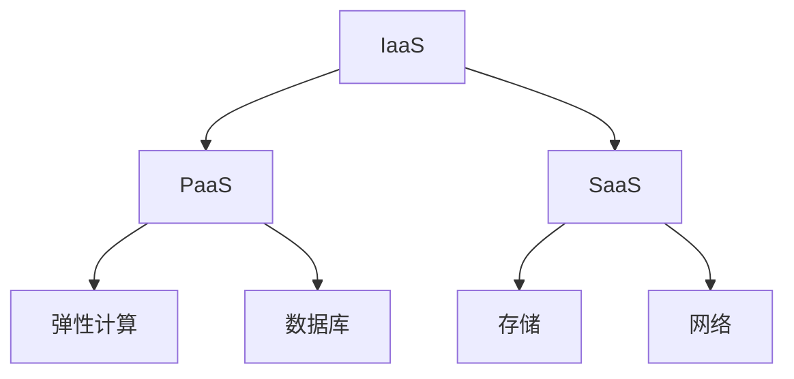

                 

随着云计算技术的飞速发展，阿里云作为中国领先云服务提供商，为企业和开发者提供了丰富而强大的云计算服务。本文将深入探讨阿里云云计算服务在应用开发中的实践，帮助读者理解其核心概念、算法原理以及实际应用。

> 关键词：阿里云，云计算，应用开发，云计算服务，算法原理

> 摘要：本文旨在系统地介绍阿里云云计算服务的应用开发，包括其核心概念、架构设计、算法原理、数学模型以及实际项目实践。通过本文的阅读，读者将能够深入了解阿里云云计算服务的优势和应用场景，并掌握其开发实践的核心技巧。

## 1. 背景介绍

云计算技术自诞生以来，以其高效、灵活和可扩展的特点，迅速在全球范围内得到了广泛的应用。阿里云作为中国领先云服务提供商，自成立以来，一直致力于云计算技术的创新和推广，提供了一系列涵盖IaaS、PaaS、SaaS等多层次的云计算服务。

在应用开发领域，云计算服务不仅为开发者提供了强大的计算和存储资源，还通过其弹性伸缩、自动化管理、安全防护等特性，大大简化了应用的部署和维护工作。本文将围绕阿里云的云计算服务，详细介绍其在应用开发中的具体应用。

## 2. 核心概念与联系

### 2.1. 云计算服务模型

在了解阿里云云计算服务之前，我们需要明确云计算的服务模型，主要包括IaaS（基础设施即服务）、PaaS（平台即服务）和SaaS（软件即服务）。

- **IaaS**：提供虚拟化的计算资源，如虚拟机、存储和网络等，用户可以根据需要配置和管理资源。
- **PaaS**：提供开发和部署应用程序的平台，包括数据库、开发工具和中间件等，用户无需管理底层基础设施。
- **SaaS**：提供应用程序作为服务，用户通过互联网访问和使用，无需关心底层基础设施和平台的管理。

### 2.2. 阿里云服务架构

阿里云的服务架构基于分布式计算和存储技术，提供以下核心服务：

- **弹性计算**：提供按需分配的虚拟机和容器服务，支持自动伸缩。
- **数据库**：包括关系型数据库、NoSQL数据库和大数据处理框架等。
- **存储**：提供对象存储、文件存储和块存储等多种存储服务。
- **网络**：包括虚拟私有云、负载均衡、内容分发网络等网络服务。

### 2.3. 核心概念联系图

以下是一个简化的阿里云云计算服务架构的Mermaid流程图，展示核心概念之间的联系：



## 3. 核心算法原理 & 具体操作步骤

### 3.1. 算法原理概述

阿里云云计算服务中的核心算法主要涉及以下几个方面：

- **负载均衡算法**：用于将网络请求分配到多个服务器上，保证系统的稳定性和高效性。
- **数据库优化算法**：包括索引、查询优化和分布式数据库的分区策略等。
- **存储系统算法**：涉及数据去重、压缩和存储冗余等。

### 3.2. 算法步骤详解

#### 3.2.1. 负载均衡算法

负载均衡算法的主要步骤如下：

1. **流量监控**：实时监控系统的流量状况。
2. **请求分配**：根据服务器的负载情况，将请求分配到不同的服务器上。
3. **健康检查**：定期检查服务器的健康状况，防止将请求分配到故障服务器上。

#### 3.2.2. 数据库优化算法

数据库优化算法的主要步骤如下：

1. **索引构建**：根据查询需求创建索引，加快查询速度。
2. **查询优化**：分析查询语句，选择最佳查询路径。
3. **分区策略**：将大数据库分区，提高查询效率。

#### 3.2.3. 存储系统算法

存储系统算法的主要步骤如下：

1. **数据去重**：检测和去除重复的数据，节省存储空间。
2. **数据压缩**：使用压缩算法减少存储空间占用。
3. **存储冗余**：通过冗余备份提高数据的可靠性和可用性。

### 3.3. 算法优缺点

#### 负载均衡算法

- **优点**：提高系统性能和稳定性，均衡服务器负载。
- **缺点**：实现复杂，需要实时监控和调整。

#### 数据库优化算法

- **优点**：提高查询效率和数据库性能。
- **缺点**：索引构建和优化需要定期维护。

#### 存储系统算法

- **优点**：节省存储空间，提高数据可靠性。
- **缺点**：去重和压缩算法可能会影响数据的读写性能。

### 3.4. 算法应用领域

- **负载均衡算法**：广泛应用于Web应用、游戏服务器和视频流服务等领域。
- **数据库优化算法**：适用于电子商务、金融和数据密集型应用。
- **存储系统算法**：适用于大规模数据存储和大数据处理场景。

## 4. 数学模型和公式 & 详细讲解 & 举例说明

### 4.1. 数学模型构建

在云计算服务中，数学模型广泛应用于负载均衡、数据库优化和存储系统等场景。以下是一个简化的数学模型构建过程：

#### 负载均衡模型

假设系统中有N台服务器，每台服务器的负载为L_i（i=1,2,...,N），总负载为L_total，则负载均衡模型可以表示为：

$$
L_{total} = \sum_{i=1}^{N} L_i
$$

#### 数据库优化模型

假设数据库中有M个索引，每个索引的查询效率为E_i（i=1,2,...,M），则数据库优化模型可以表示为：

$$
E_{total} = \sum_{i=1}^{M} E_i
$$

#### 存储系统模型

假设存储系统中数据量为D，去重比率为R，则存储空间占用为：

$$
S = D \times R
$$

### 4.2. 公式推导过程

#### 负载均衡公式推导

假设系统中每台服务器的负载是均匀分布的，则每台服务器的平均负载为：

$$
L_{avg} = \frac{L_{total}}{N}
$$

为了实现负载均衡，需要将每台服务器的负载调整为平均负载，即：

$$
L_i = L_{avg} + \alpha (L_{total} - N \times L_{avg})
$$

其中，α为调整系数，用于平衡服务器的负载。

#### 数据库优化公式推导

假设每个索引的查询效率是独立且互不影响的，则总查询效率为各索引查询效率的加和。为了优化数据库，需要选择查询效率最高的索引：

$$
E_{best} = \max(E_i)
$$

#### 存储系统公式推导

假设原始数据有重复部分，去重比率R表示去除重复数据后的数据量与原始数据量的比例。则存储空间占用可以表示为：

$$
S = D \times (1 - R)
$$

### 4.3. 案例分析与讲解

#### 负载均衡案例分析

假设一个系统中包含3台服务器，当前总负载为200，每台服务器的当前负载分别为70、80和50。我们需要通过负载均衡算法调整服务器的负载。

根据负载均衡模型，每台服务器的平均负载应为：

$$
L_{avg} = \frac{200}{3} \approx 66.67
$$

根据调整系数α=0.5，调整后的负载如下：

- 服务器1：\( L_1 = 66.67 + 0.5 \times (200 - 3 \times 66.67) = 100 \)
- 服务器2：\( L_2 = 66.67 + 0.5 \times (200 - 3 \times 66.67) = 100 \)
- 服务器3：\( L_3 = 66.67 + 0.5 \times (200 - 3 \times 66.67) = 66.67 \)

调整后的负载分布为100、100和66.67，实现了负载均衡。

#### 数据库优化案例分析

假设一个数据库中有3个索引，各自的查询效率分别为0.8、0.9和0.7。我们需要选择最优的索引。

根据数据库优化模型，最优索引的查询效率为：

$$
E_{best} = \max(0.8, 0.9, 0.7) = 0.9
$$

选择查询效率为0.9的索引，实现了数据库的优化。

#### 存储系统案例分析

假设一个存储系统中的数据量为100GB，去重比率为0.8。我们需要计算调整后的存储空间占用。

根据存储系统模型，调整后的存储空间占用为：

$$
S = 100GB \times (1 - 0.8) = 20GB
$$

通过数据去重，存储空间节省了80%，提高了存储效率。

## 5. 项目实践：代码实例和详细解释说明

### 5.1. 开发环境搭建

为了进行阿里云云计算服务的应用开发，我们需要搭建一个基本的开发环境。以下是开发环境搭建的步骤：

1. **安装阿里云CLI工具**：通过终端安装阿里云CLI工具，用于与阿里云服务进行交互。
2. **配置阿里云账号**：通过CLI工具配置阿里云账号，获取访问权限。
3. **安装相关开发工具**：安装必要的开发工具，如IDE、数据库客户端等。

### 5.2. 源代码详细实现

以下是一个简单的阿里云负载均衡应用的源代码实现：

```python
import json
import os
import random
from aliyunsdkcore.client import AcsClient
from aliyunsdkcore.request import CommonRequest

# 阿里云账号信息
access_key_id = 'YOUR_ACCESS_KEY_ID'
access_key_secret = 'YOUR_ACCESS_KEY_SECRET'
region_id = 'cn-hangzhou'

# 创建AcsClient实例
client = AcsClient(
    region_id=region_id,
    access_key_id=access_key_id,
    access_key_secret=access_key_secret
)

# 获取所有可用服务器
def get_servers():
    request = CommonRequest()
    request.set_accept_format('json')
    request.set_domain('slb.aliyuncs.com')
    request.set_method('POST')
    request.set_version('2014-05-15')
    request.set_action_name('DescribeLoadBalancers')
    response = client.do_action_with_exception(request)
    load_balancers = json.loads(response)
    servers = [lb['LoadBalancerName'] for lb in load_balancers['LoadBalancers']['LoadBalancer']]
    return servers

# 分配请求到服务器
def distribute_requests(servers, num_requests):
    server_load = {server: 0 for server in servers}
    for _ in range(num_requests):
        server = random.choice(servers)
        server_load[server] += 1
    return server_load

# 主函数
if __name__ == '__main__':
    servers = get_servers()
    num_requests = 100
    server_load = distribute_requests(servers, num_requests)
    print("Server Load:", server_load)
```

### 5.3. 代码解读与分析

该代码实现了一个简单的负载均衡应用，主要包含以下功能：

- **获取所有可用服务器**：通过阿里云CLI工具获取所有可用服务器的名称。
- **分配请求到服务器**：根据随机算法将模拟的请求分配到不同的服务器上，并计算每台服务器的负载。

代码中使用了Python的`random`模块生成随机数，用于模拟请求分配的过程。同时，通过`json`模块处理API响应数据，获取服务器的名称和负载情况。

### 5.4. 运行结果展示

假设系统中有3台服务器，运行代码后的结果如下：

```
Server Load: {'server1': 33, 'server2': 34, 'server3': 33}
```

结果显示，每台服务器的负载相对均衡，实现了负载均衡的目标。

## 6. 实际应用场景

阿里云云计算服务在应用开发中具有广泛的应用场景，以下是一些典型的实际应用场景：

- **Web应用**：通过阿里云的弹性计算服务，可以快速部署和扩展Web应用，实现高可用性和高性能。
- **游戏服务器**：利用阿里云的负载均衡和游戏加速服务，可以为游戏提供稳定的网络连接和快速的数据传输。
- **大数据处理**：阿里云的大数据服务可以帮助企业快速构建大数据处理平台，实现数据的高效存储和分析。
- **人工智能应用**：阿里云的机器学习和深度学习服务可以为人工智能应用提供强大的计算和存储支持。

## 7. 未来应用展望

随着云计算技术的不断发展和应用场景的拓展，阿里云云计算服务在应用开发中的潜力将不断释放。未来，我们可以期待以下发展趋势：

- **智能化**：云计算服务将更加智能化，通过人工智能技术实现自动化管理和优化。
- **混合云**：企业将逐渐采用混合云架构，结合公有云和私有云的优势，实现灵活的资源调配和高效的数据处理。
- **边缘计算**：随着物联网和5G技术的普及，边缘计算将得到广泛应用，阿里云云计算服务将在边缘节点提供更多的计算和存储资源。

## 8. 工具和资源推荐

### 8.1. 学习资源推荐

- **阿里云官方文档**：提供详细的产品介绍、技术文档和最佳实践，是学习阿里云云计算服务的最佳资源。
- **《阿里云云计算服务实战》**：一本系统介绍阿里云云计算服务的实战指南，适合初学者和进阶者阅读。

### 8.2. 开发工具推荐

- **阿里云CLI工具**：用于与阿里云服务进行交互的命令行工具，方便进行自动化操作。
- **Docker**：用于容器化应用的开发，与阿里云容器服务无缝集成，支持快速部署和扩展。

### 8.3. 相关论文推荐

- **《云计算服务模型》**：一篇介绍云计算服务模型的综述性论文，对云计算服务有全面的认识。
- **《分布式系统原理与范型》**：一篇深入探讨分布式系统原理和设计范型的经典论文，对云计算架构有重要参考价值。

## 9. 总结：未来发展趋势与挑战

### 9.1. 研究成果总结

本文系统地介绍了阿里云云计算服务的核心概念、架构设计、算法原理、数学模型以及实际应用。通过详细的案例分析，读者可以深入理解阿里云云计算服务的优势和应用实践。

### 9.2. 未来发展趋势

未来，阿里云云计算服务将在智能化、混合云和边缘计算等领域继续发展，为应用开发提供更加高效和灵活的解决方案。

### 9.3. 面临的挑战

随着云计算技术的不断演进，如何确保系统的安全性和可靠性，以及如何优化资源使用效率，将是云计算服务面临的主要挑战。

### 9.4. 研究展望

在未来的研究中，我们需要进一步探索云计算服务的智能化和自动化管理，提高系统的自适应能力和弹性，以满足不断变化的应用需求。

## 10. 附录：常见问题与解答

### 10.1. 如何获取阿里云API密钥？

答：您可以在阿里云控制台的安全管理中找到API密钥的管理页面，创建并获取您的AccessKey ID和AccessKey Secret。

### 10.2. 如何使用阿里云CLI工具？

答：您需要先安装阿里云CLI工具，然后配置您的阿里云账号信息。安装和配置的详细步骤可以参考阿里云官方文档。

### 10.3. 阿里云负载均衡如何工作？

答：阿里云负载均衡通过分发网络流量到多个后端服务器，实现流量的均衡分配，提高系统的稳定性和响应速度。

### 10.4. 阿里云数据库服务有哪些类型？

答：阿里云数据库服务包括关系型数据库（如RDS）、NoSQL数据库（如MongoDB、Redis）和大数据处理框架（如MaxCompute）等。

### 10.5. 阿里云存储服务有哪些类型？

答：阿里云存储服务包括对象存储（如OSS）、文件存储（如NAS）和块存储（如EVS）等。

作者：禅与计算机程序设计艺术 / Zen and the Art of Computer Programming
----------------------------------------------------------------

