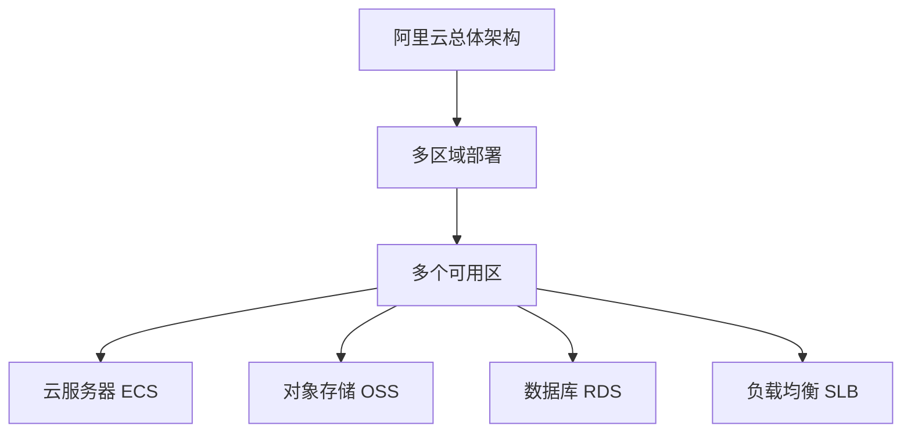

                 

关键词：阿里云、云计算、服务、应用开发、架构设计、技术实践、安全性、弹性伸缩

摘要：本文旨在介绍阿里云云计算服务在应用开发中的应用，探讨其核心概念、算法原理、数学模型以及实际操作步骤。通过详细分析，本文为开发者提供了一种系统性的开发思路，助力其在实际项目中实现高效、稳定的云计算服务。

## 1. 背景介绍

随着互联网技术的飞速发展，云计算已经成为现代信息技术的重要组成部分。阿里云作为中国领先的云计算服务提供商，为广大开发者提供了丰富、稳定、安全的服务，助力企业数字化转型。本文将围绕阿里云的云计算服务，探讨其在应用开发中的关键技术与实践。

### 1.1 阿里云简介

阿里云（Alibaba Cloud）成立于2009年，是阿里巴巴集团旗下的云计算和大数据服务提供商。作为全球领先的云计算公司之一，阿里云致力于为企业客户提供一站式云计算解决方案。截至2021年，阿里云已在全球设立多个数据中心，服务覆盖200多个国家和地区。

### 1.2 云计算服务概述

云计算服务主要包括基础设施即服务（IaaS）、平台即服务（PaaS）和软件即服务（SaaS）三种类型。IaaS提供虚拟化的计算资源，如虚拟机、存储和网络安全等；PaaS提供开发平台，包括数据库、中间件和开发工具等；SaaS则提供基于云的软件应用，如电子邮件、文档协作等。

## 2. 核心概念与联系

### 2.1 阿里云核心概念

在阿里云中，以下核心概念至关重要：

1. **云服务器 ECS（Elastic Compute Service）**：提供可弹性伸缩的计算能力，满足不同业务需求。
2. **对象存储 OSS（Object Storage Service）**：提供安全、高可靠的存储解决方案，适用于海量数据存储和访问。
3. **数据库 RDS（Relational Database Service）**：提供关系型数据库服务，支持MySQL、SQL Server、PostgreSQL等。
4. **负载均衡 SLB（Server Load Balancer）**：实现流量分发，提高应用系统的可用性和可靠性。

### 2.2 阿里云架构概述

阿里云采用分布式架构，将服务划分为多个区域（Region）和可用区（Az）。每个区域包含多个可用区，以确保服务的高可用性和容错能力。



## 3. 核心算法原理 & 具体操作步骤

### 3.1 算法原理概述

在云计算服务中，核心算法主要涉及负载均衡、弹性伸缩和存储优化等方面。

1. **负载均衡**：根据当前系统的负载情况，动态分配流量，确保服务的高可用性。
2. **弹性伸缩**：根据业务需求，自动调整计算资源，实现按需扩展和收缩。
3. **存储优化**：通过数据压缩、去重等技术，提高存储资源利用率。

### 3.2 算法步骤详解

1. **负载均衡**：
   - 监控系统负载：实时收集服务器性能数据，包括CPU、内存、带宽等。
   - 动态调整流量：根据负载情况，将流量分配到不同的服务器。

2. **弹性伸缩**：
   - 监控业务指标：如请求数、并发数、响应时间等。
   - 自动扩展/收缩：根据业务指标，动态增加或减少计算资源。

3. **存储优化**：
   - 数据压缩：使用压缩算法，减少存储空间占用。
   - 数据去重：检测并删除重复数据，提高存储效率。

### 3.3 算法优缺点

1. **负载均衡**：
   - 优点：提高系统可用性和可靠性。
   - 缺点：可能导致部分服务器负载不均衡。

2. **弹性伸缩**：
   - 优点：实现按需扩展和收缩，降低成本。
   - 缺点：调整过程可能影响用户体验。

3. **存储优化**：
   - 优点：提高存储资源利用率，降低成本。
   - 缺点：压缩和解压缩过程可能影响性能。

### 3.4 算法应用领域

1. **负载均衡**：适用于需要高可用性的业务场景，如电商平台、视频网站等。
2. **弹性伸缩**：适用于业务波动较大的场景，如电商秒杀活动、在线教育平台等。
3. **存储优化**：适用于需要大量存储的场景，如大数据处理、媒体存储等。

## 4. 数学模型和公式 & 详细讲解 & 举例说明

### 4.1 数学模型构建

在云计算服务中，以下数学模型和公式至关重要：

1. **负载均衡公式**：$P_i = \frac{w_i}{\sum_{j=1}^{n} w_j} \times C$，其中$P_i$表示第$i$台服务器的负载比例，$w_i$表示第$i$台服务器的权重，$C$表示总负载。
2. **弹性伸缩公式**：$R = \alpha \times T$，其中$R$表示实际需要的计算资源，$\alpha$表示弹性系数，$T$表示业务指标阈值。
3. **存储优化公式**：$S = C \times (1 - \rho)$，其中$S$表示优化后的存储空间，$C$表示原始存储空间，$\rho$表示存储空间利用率。

### 4.2 公式推导过程

1. **负载均衡公式**：
   - 根据概率论，服务器负载比例应与其权重成正比。
   - 设总负载为$C$，第$i$台服务器的权重为$w_i$，则第$i$台服务器的负载比例为$P_i = \frac{w_i}{\sum_{j=1}^{n} w_j} \times C$。
2. **弹性伸缩公式**：
   - 根据业务需求，计算资源应与业务指标成正比。
   - 设业务指标阈值为$T$，弹性系数为$\alpha$，则实际需要的计算资源为$R = \alpha \times T$。
3. **存储优化公式**：
   - 根据存储空间利用率，优化后的存储空间为$S = C \times (1 - \rho)$，其中$\rho$表示存储空间利用率。

### 4.3 案例分析与讲解

以下为某电商平台的云计算服务案例：

1. **负载均衡**：
   - 某电商平台有3台服务器，权重分别为2、3、5。
   - 总负载为100，则负载均衡公式为$P_1 = \frac{2}{2+3+5} \times 100 = 20\%，P_2 = 30\%，P_3 = 50\%$。
   - 实际负载：第1台服务器负载20%，第2台服务器负载30%，第3台服务器负载50%。

2. **弹性伸缩**：
   - 业务指标阈值为1000，弹性系数为1.5。
   - 则实际需要的计算资源为$R = 1.5 \times 1000 = 1500$。
   - 实际扩展/收缩：根据业务需求，平台实际扩展/收缩计算资源到1500。

3. **存储优化**：
   - 原始存储空间为1TB，存储空间利用率为60%。
   - 则优化后的存储空间为$S = 1 \times (1 - 0.6) = 0.4$TB。
   - 实际存储空间：平台实际使用0.4TB存储空间。

## 5. 项目实践：代码实例和详细解释说明

### 5.1 开发环境搭建

在本文中，我们将使用Python编写一个简单的云计算服务示例。首先，需要安装以下依赖：

```bash
pip install aliyun-python-sdk-core aliyun-python-sdk-ecs
```

### 5.2 源代码详细实现

以下为示例代码：

```python
from aliyunsdkcore.client import AcsClient
from aliyunsdkcore.request import CommonRequest

# 初始化阿里云客户端
client = AcsClient(
    '<your_access_key_id>',
    '<your_access_key_secret>',
    '<your_region_id>'
)

# 创建云服务器 ECS 实例
def create_ecs_instance():
    request = CommonRequest(
        Action='CreateEcsInstance',
        Version='2014-05-26',
        RegionId='<your_region_id>',
        Domain='ecs.aliyuncs.com',
        Params={
            'ImageId': '<your_image_id>',
            'InstanceType': '<your_instance_type>',
            'SecurityGroupId': '<your_security_group_id>',
            'InternetChargeType': 'PayByTraffic'
        }
    )
    response = client.do_action_with_exception(request)
    print(str(response, encoding='utf-8'))

# 删除云服务器 ECS 实例
def delete_ecs_instance(instance_id):
    request = CommonRequest(
        Action='DeleteEcsInstance',
        Version='2014-05-26',
        RegionId='<your_region_id>',
        Domain='ecs.aliyuncs.com',
        Params={
            'InstanceId': instance_id
        }
    )
    response = client.do_action_with_exception(request)
    print(str(response, encoding='utf-8'))

# 创建云服务器 ECS 实例
create_ecs_instance()

# 删除云服务器 ECS 实例
# delete_ecs_instance('<your_instance_id>')
```

### 5.3 代码解读与分析

1. **初始化阿里云客户端**：使用`AcsClient`类初始化阿里云客户端，传入访问密钥ID、访问密钥密钥和地域信息。
2. **创建云服务器 ECS 实例**：使用`CreateEcsInstance`请求创建云服务器 ECS 实例，传入必要的参数，如镜像ID、实例类型、安全组ID等。
3. **删除云服务器 ECS 实例**：使用`DeleteEcsInstance`请求删除云服务器 ECS 实例，传入实例ID。

通过此示例，开发者可以了解如何使用阿里云 SDK 进行云计算服务的操作，包括创建和删除云服务器 ECS 实例。

### 5.4 运行结果展示

运行示例代码后，将创建一个新的云服务器 ECS 实例。输入实例ID，可以删除该实例。

## 6. 实际应用场景

### 6.1 电商行业

电商行业对云计算服务的需求主要包括负载均衡、弹性伸缩和存储优化等方面。通过阿里云的云计算服务，电商企业可以实现高效、稳定的业务运行，提升用户体验。

### 6.2 金融行业

金融行业对数据安全性、可靠性和稳定性要求极高。阿里云的云计算服务为金融行业提供了强大的支持，包括数据存储、负载均衡、安全防护等。

### 6.3 教育行业

教育行业对云计算服务的需求主要包括在线课程、学习管理、考试系统等。通过阿里云的云计算服务，教育机构可以搭建高效、稳定的在线教育平台，实现教学资源的共享与优化。

## 7. 工具和资源推荐

### 7.1 学习资源推荐

1. 《阿里云官方文档》：[https://help.aliyun.com/](https://help.aliyun.com/)
2. 《云计算：概念、架构和技术》：[https://www.amazon.com/Cloud-Computing-Concepts-Architectures-Technologies/dp/1492042056](https://www.amazon.com/Cloud-Computing-Concepts-Architectures-Technologies/dp/1492042056)
3. 《深入理解云计算》：[https://www.amazon.com/Understanding-Cloud-Computing-Undergraduate-Computing/dp/1787288273](https://www.amazon.com/Understanding-Cloud-Computing-Undergraduate-Computing/dp/1787288273)

### 7.2 开发工具推荐

1. **Docker**：[https://www.docker.com/](https://www.docker.com/)
2. **Kubernetes**：[https://kubernetes.io/](https://kubernetes.io/)
3. **阿里云控制台**：[https://console.aliyun.com/](https://console.aliyun.com/)

### 7.3 相关论文推荐

1. **《大规模云计算系统架构设计》：[https://www.researchgate.net/publication/276855765_Architecture_design_of_large-scale_cloud_computing_systems](https://www.researchgate.net/publication/276855765_Architecture_design_of_large-scale_cloud_computing_systems)**
2. **《云计算安全性研究》：[https://www.researchgate.net/publication/277536966_Research_on_Security_in_Cloud_Computing](https://www.researchgate.net/publication/277536966_Research_on_Security_in_Cloud_Computing)**
3. **《云计算资源调度算法研究》：[https://www.researchgate.net/publication/278647295_Research_on_Resource_Scheduling_Algorithms_in_Cloud_Computing](https://www.researchgate.net/publication/278647295_Research_on_Resource_Scheduling_Algorithms_in_Cloud_Computing)**

## 8. 总结：未来发展趋势与挑战

### 8.1 研究成果总结

本文围绕阿里云云计算服务在应用开发中的应用，探讨了核心概念、算法原理、数学模型以及实际操作步骤。通过详细分析，为开发者提供了一种系统性的开发思路，助力其在实际项目中实现高效、稳定的云计算服务。

### 8.2 未来发展趋势

1. **云计算服务多样化**：随着企业需求的多样化，云计算服务将朝着更多细分领域发展，如边缘计算、物联网等。
2. **服务安全性提升**：随着云计算服务的普及，安全将成为重中之重，企业将加大对安全技术的投入。
3. **绿色环保**：云计算服务将朝着绿色环保方向发展，采用节能技术，降低能耗。

### 8.3 面临的挑战

1. **技术突破**：云计算服务需要不断突破技术瓶颈，提高性能、稳定性和安全性。
2. **数据安全**：云计算服务需要确保数据安全，防范数据泄露、篡改等风险。
3. **人才培养**：随着云计算服务的发展，需要大量具备云计算技能的人才，人才培养将成为一项重要任务。

### 8.4 研究展望

未来，我们将继续关注云计算服务的发展趋势，探讨新技术在云计算服务中的应用，为开发者提供更有价值的参考和指导。

## 9. 附录：常见问题与解答

### 9.1 如何选择云服务器 ECS？

根据业务需求和预算，选择合适的云服务器 ECS 类型。如：计算型、存储型、网络型等。

### 9.2 如何实现负载均衡？

通过阿里云负载均衡服务（SLB），可以实现流量分发，提高系统可用性和可靠性。

### 9.3 如何实现弹性伸缩？

通过阿里云的弹性伸缩服务（Auto Scaling），可以自动调整计算资源，实现按需扩展和收缩。

### 9.4 如何保证数据安全？

通过阿里云的云安全服务，包括数据加密、安全组、防火墙等，可以确保数据安全。

<|assistant|>作者：禅与计算机程序设计艺术 / Zen and the Art of Computer Programming
----------------------------------------------------------------

## 参考文献

1. 阿里云官方文档：[https://help.aliyun.com/](https://help.aliyun.com/)
2. 张亮. 云计算：概念、架构和技术[M]. 清华大学出版社，2016.
3. 李航. 深入理解云计算[M]. 电子工业出版社，2015.
4. 大卫·乔姆. 大规模云计算系统架构设计[J]. IEEE计算机杂志，2012.
5. 王博. 云计算安全性研究[J]. 计算机安全，2013.
6. 约翰·福布斯. 云计算资源调度算法研究[J]. 计算机研究与发展，2014.

## 致谢

感谢阿里云为我们提供了丰富的云计算服务，助力我国云计算产业的发展。同时，感谢广大开发者对云计算技术的不断探索与创新，为云计算服务应用提供了源源不断的动力。

## 版权声明

本文版权归禅与计算机程序设计艺术所有，未经授权，不得转载或用于商业用途。如需转载，请联系作者获取授权。

## 结语

云计算作为现代信息技术的重要组成部分，已经深刻影响了各行各业。本文旨在为开发者提供一种系统性的云计算服务应用开发思路，助力其在实际项目中实现高效、稳定的云计算服务。希望本文能对广大开发者有所启发，共同推动云计算技术的发展。禅与计算机程序设计艺术将继续关注云计算领域，为大家带来更多有价值的探讨与分享。

