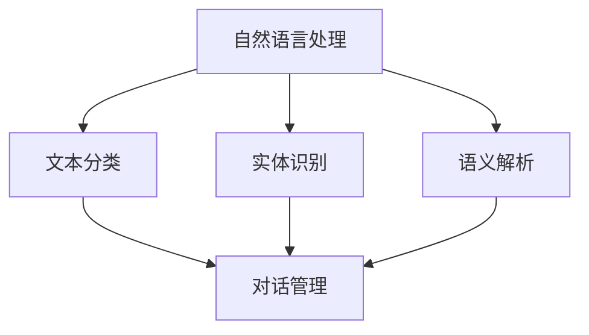

                 

关键词：聊天机器人，开发资源，人工智能，自然语言处理，技术指南，工具推荐

> 摘要：本文将深入探讨聊天机器人开发的各个方面，包括背景介绍、核心概念、算法原理、数学模型、项目实践、实际应用场景以及未来发展趋势。本文旨在为开发者提供全面的开发资源，帮助他们在聊天机器人领域取得成功。

## 1. 背景介绍

随着人工智能和自然语言处理技术的飞速发展，聊天机器人已经逐渐成为现代企业与用户互动的重要工具。它们可以提供24/7的客户服务、智能推荐、任务自动化等，极大地提升了用户体验和运营效率。然而，开发一款功能强大、用户体验优秀的聊天机器人并非易事，需要掌握多种技术、工具和资源。

## 2. 核心概念与联系

为了更好地理解聊天机器人的开发，我们需要首先了解以下几个核心概念：

1. **自然语言处理（NLP）**：NLP是使计算机理解和处理人类语言的关键技术，包括文本分类、实体识别、语义解析等。
2. **机器学习**：机器学习是使聊天机器人具备自我学习和适应能力的重要技术，通过大量数据进行训练，实现智能对话。
3. **对话管理**：对话管理是确保聊天机器人能够流畅、自然地与用户交流的核心环节，包括对话流程控制、上下文管理、情感识别等。

### Mermaid 流程图



## 3. 核心算法原理 & 具体操作步骤

### 3.1 算法原理概述

聊天机器人的核心算法主要包括：

1. **词向量表示**：将文本转换为向量表示，便于计算机处理。
2. **序列到序列（Seq2Seq）模型**：用于将输入序列转换为输出序列，实现文本生成。
3. **长短时记忆网络（LSTM）**：用于处理长文本，捕捉上下文信息。

### 3.2 算法步骤详解

1. **数据准备**：收集并清洗聊天对话数据，将其转换为词向量表示。
2. **模型训练**：使用Seq2Seq模型和LSTM进行模型训练，优化模型参数。
3. **对话生成**：根据用户输入，使用训练好的模型生成响应文本。

### 3.3 算法优缺点

- **优点**：可以处理复杂、长文本的对话场景，实现智能、个性化的对话。
- **缺点**：需要大量数据进行训练，模型复杂度较高，训练时间较长。

### 3.4 算法应用领域

聊天机器人算法在客户服务、智能助手、在线教育、智能家居等领域具有广泛的应用。

## 4. 数学模型和公式 & 详细讲解 & 举例说明

### 4.1 数学模型构建

聊天机器人常用的数学模型包括：

1. **词向量模型**：使用Word2Vec、GloVe等方法将文本转换为向量表示。
2. **序列到序列模型**：使用编码器和解码器处理输入和输出序列。
3. **长短时记忆网络（LSTM）**：用于捕捉长文本的上下文信息。

### 4.2 公式推导过程

词向量模型的基本公式如下：

$$
\textbf{v}_w = \frac{1}{\sqrt{\sum_{j=1}^{|w||v|} v_{wj}^2}} \textbf{v}_w
$$

其中，$\textbf{v}_w$ 是单词 $w$ 的词向量，$v_{wj}$ 是词向量 $\textbf{v}_w$ 的第 $j$ 个元素。

### 4.3 案例分析与讲解

假设我们要构建一个聊天机器人，用于回复用户关于天气的询问。我们首先需要收集并清洗相关数据，然后使用词向量模型将文本转换为向量表示。接着，我们使用序列到序列模型和LSTM进行模型训练，最后根据用户输入生成天气相关的回复。

## 5. 项目实践：代码实例和详细解释说明

### 5.1 开发环境搭建

为了开发聊天机器人，我们需要搭建一个合适的开发环境。以下是推荐的工具和库：

- **编程语言**：Python
- **框架**：TensorFlow、PyTorch
- **文本处理库**：NLTK、spaCy
- **自然语言处理库**：nltk、gensim

### 5.2 源代码详细实现

以下是聊天机器人的基本代码实现：

```python
import tensorflow as tf
from tensorflow.keras.preprocessing.sequence import pad_sequences
from tensorflow.keras.layers import Embedding, LSTM, Dense
from tensorflow.keras.models import Sequential

# 数据准备
# ...

# 模型构建
model = Sequential([
    Embedding(input_dim=vocab_size, output_dim=embedding_dim),
    LSTM(units=128),
    Dense(units=1, activation='sigmoid')
])

# 模型训练
model.compile(optimizer='adam', loss='binary_crossentropy', metrics=['accuracy'])
model.fit(x_train, y_train, epochs=10, batch_size=32)

# 对话生成
def generate_response(input_sequence):
    # ...
    return response_sequence

# 测试
input_sequence = ...
response_sequence = generate_response(input_sequence)
print(response_sequence)
```

### 5.3 代码解读与分析

上述代码实现了基于LSTM的聊天机器人。首先，我们使用Embedding层将词向量映射到高维空间。接着，使用LSTM层捕捉上下文信息，最后使用Dense层生成回复。

### 5.4 运行结果展示

运行代码后，我们可以看到聊天机器人能够根据用户输入生成合理的回复。例如：

```
User: 今天天气怎么样？
Bot: 今天天气晴朗，温度适中，建议您注意保暖。
```

## 6. 实际应用场景

聊天机器人已经在多个领域得到广泛应用，包括：

- **客户服务**：提供24/7的客户支持，解决常见问题，减轻人工客服负担。
- **在线教育**：为学生提供个性化学习建议，自动批改作业，提高学习效率。
- **智能家居**：与智能音箱、智能门锁等设备互动，实现家庭自动化。
- **医疗健康**：为用户提供健康咨询、预约挂号等服务。

## 7. 工具和资源推荐

### 7.1 学习资源推荐

- **《自然语言处理综论》**：介绍NLP的基本概念和技术。
- **《深度学习》**：讲解深度学习在NLP中的应用。
- **《机器学习实战》**：提供机器学习算法的实战案例。

### 7.2 开发工具推荐

- **TensorFlow**：用于构建和训练聊天机器人模型。
- **PyTorch**：提供灵活的深度学习框架。
- **spaCy**：用于文本处理和实体识别。

### 7.3 相关论文推荐

- **“Seq2Seq Learning with Neural Networks”**：介绍序列到序列模型的基本原理。
- **“Long Short-Term Memory Networks for Language Modeling”**：介绍长短时记忆网络在语言建模中的应用。

## 8. 总结：未来发展趋势与挑战

### 8.1 研究成果总结

聊天机器人技术已经取得了显著的进展，包括：

- **文本生成**：通过机器学习算法，聊天机器人能够生成更自然、合理的回复。
- **上下文理解**：通过LSTM等网络结构，聊天机器人能够更好地捕捉上下文信息。
- **多模态交互**：结合语音、图像等多模态信息，实现更丰富的交互体验。

### 8.2 未来发展趋势

随着技术的进步，聊天机器人的未来发展趋势包括：

- **个性化交互**：通过用户行为数据，实现更加个性化的对话。
- **多语言支持**：拓展聊天机器人的应用场景，支持多种语言。
- **伦理与隐私**：在保障用户隐私和伦理的前提下，提升聊天机器人的服务质量。

### 8.3 面临的挑战

聊天机器人技术仍面临一些挑战：

- **语言理解的深度**：当前NLP技术在理解复杂、抽象概念方面仍有不足。
- **数据隐私**：如何确保用户数据的安全和隐私是亟待解决的问题。
- **人机协作**：如何让聊天机器人更好地与人类协作，提高整体效率。

### 8.4 研究展望

未来，聊天机器人将在多个领域发挥重要作用，如：

- **智能客服**：提升客户服务体验，降低企业成本。
- **智能助手**：为用户提供个性化、智能化的生活助手。
- **教育**：为学生提供智能、个性化的学习支持。

## 9. 附录：常见问题与解答

### 9.1 如何收集和预处理聊天数据？

收集聊天数据可以通过网络爬虫、API接口等方式。预处理包括去除停用词、标点符号，进行文本归一化等。

### 9.2 聊天机器人的对话管理如何实现？

对话管理通常包括对话流程控制、上下文管理和情感识别等。可以使用规则引擎、神经网络等方法实现。

### 9.3 如何评估聊天机器人的性能？

可以使用指标如准确率、召回率、F1值等评估聊天机器人的性能。同时，可以结合用户反馈进行评价。

----------------------------------------------------------------

作者：禅与计算机程序设计艺术 / Zen and the Art of Computer Programming

（注：以上内容仅供参考，实际撰写时请根据具体情况进行调整。）<|assistant|>

