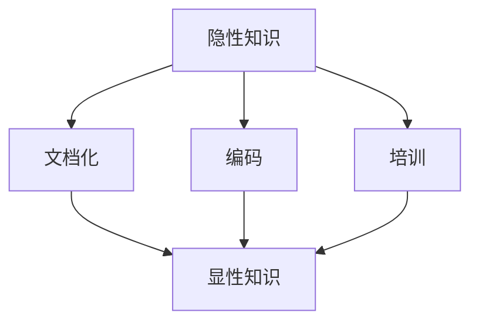

                 

关键词：隐性知识、显性化、经验传承、技术博客、人工智能、软件开发

摘要：在技术领域，隐性知识的有效传承对于团队和行业的发展至关重要。本文将探讨隐性知识的定义、重要性以及显性化的方法，并通过具体案例展示如何将隐性知识转化为可传承的显性知识，从而促进技术的可持续发展。

## 1. 背景介绍

在快速发展的信息技术领域，知识的积累和传承显得尤为重要。然而，许多知识往往以隐性形式存在，即它们不为文档化，无法通过简单的语言描述来传递。这种隐性知识往往包括经验、直觉、最佳实践和隐含的规则等，它们对提高团队效率和创新能力至关重要。

然而，隐性知识的不可见性使得其难以被新成员理解和吸收，也限制了其在团队和行业内部的传播。因此，如何将隐性知识显性化，使得它们能够被记录、共享和传承，成为技术团队面临的一个重要挑战。

本文将围绕以下问题展开讨论：

1. 隐性知识的定义及其在技术领域的重要性。
2. 隐性知识显性化的方法。
3. 如何通过具体案例实现隐性知识的显性化。
4. 隐性知识显性化对团队和行业发展的意义。

## 2. 核心概念与联系

### 2.1 隐性知识的定义

隐性知识是指那些不易被明确表达、难以通过语言或文字传递的知识。它们通常来源于个人的经验、观察、直觉和习惯，是一种深植于个人意识和行为中的知识。隐性知识具有以下几个特点：

- **难以言说**：隐性知识往往难以用语言清晰地表达。
- **高度个性化**：每个人的隐性知识都是独特的，受到其背景、经验和认知风格的影响。
- **难以传递**：隐性知识难以通过传统的方式传递给他人。

### 2.2 显性知识的定义

显性知识则是那些可以被明确表达和记录的知识。它们通常以文档、代码、算法和模型等形式存在，易于被他人理解和复制。显性知识具有以下几个特点：

- **易于记录和共享**：显性知识可以通过各种工具和媒介进行记录和传播。
- **标准化**：显性知识可以通过标准化的流程和规范来保证其一致性和可靠性。
- **透明性**：显性知识的透明性使其易于被审查和验证。

### 2.3 隐性知识与显性知识的关系

隐性知识和显性知识之间存在密切的联系。隐性知识往往是显性知识的基础，而显性知识则是对隐性知识的一种形式化和结构化。具体来说，隐性知识可以通过以下几种方式转化为显性知识：

1. **文档化**：将个人的经验、最佳实践和心得写成文档，以便团队成员参考和学习。
2. **编码**：将隐含的规则和算法编码为可执行的代码，使得它们可以被重复使用和优化。
3. **培训**：通过培训和研讨会等方式，将隐性知识传授给新成员。

下面是一个使用Mermaid绘制的流程图，展示了隐性知识转化为显性知识的过程：



## 3. 核心算法原理 & 具体操作步骤

### 3.1 算法原理概述

隐性知识显性化的核心在于找到一种方法，将那些难以言说的经验转化为可以记录和共享的形式。这个过程可以分为以下几个步骤：

1. **识别隐性知识**：首先需要识别团队中哪些知识是隐性的，这些知识可能存在于个人经验、日常交流或内部工具中。
2. **文档化**：将识别出的隐性知识转化为文档，这些文档可以是文章、手册、指南等。
3. **编码**：将隐性知识中的规则和算法编码为可执行的代码，从而实现知识的可重复性和可维护性。
4. **培训**：通过培训和新员工指导，将隐性知识传授给新成员。

### 3.2 算法步骤详解

1. **识别隐性知识**

   - **访谈法**：通过与团队成员进行一对一的访谈，了解他们在工作中遇到的问题和解决方法。
   - **观察法**：观察团队成员的工作流程，记录他们使用的方法和技巧。
   - **文档审查**：审查团队已有的文档、代码和工具，识别其中可能包含的隐性知识。

2. **文档化**

   - **撰写手册**：将识别出的隐性知识整理成手册或指南，确保内容清晰、易懂。
   - **案例研究**：通过编写案例研究，详细描述隐性知识的应用场景和效果。
   - **知识分享会**：定期举办知识分享会，让团队成员分享他们的经验和心得。

3. **编码**

   - **算法提取**：从隐性知识中提取可编码的规则和算法，确保代码的可读性和可维护性。
   - **代码库管理**：将编码后的知识上传到代码库，便于团队成员访问和更新。
   - **代码审查**：定期对代码进行审查，确保其质量和一致性。

4. **培训**

   - **内部培训**：为新成员提供专门的培训课程，让他们了解团队的核心知识和经验。
   - **导师制度**：实施导师制度，让经验丰富的成员指导新成员，帮助他们快速融入团队。
   - **实践机会**：为新成员提供实际项目机会，让他们在真实场景中应用所学知识。

### 3.3 算法优缺点

#### 优点

- **提高知识共享效率**：通过显性化，隐性知识可以更方便地被共享和传承。
- **增强团队凝聚力**：团队成员通过共同的经验分享，可以增强团队凝聚力和归属感。
- **提升项目质量**：显性化的知识可以确保团队成员在项目中遵循最佳实践，从而提升项目质量。

#### 缺点

- **知识失真**：在显性化的过程中，部分隐性知识可能会被简化或失真。
- **实施成本**：显性化需要时间和资源的投入，尤其是对于技术知识密集型的团队。
- **文化障碍**：一些团队成员可能不习惯于分享他们的隐性知识，这可能需要一定的文化调整。

### 3.4 算法应用领域

隐性知识显性化在多个技术领域都有广泛应用，以下是几个典型的应用场景：

- **软件开发**：通过文档化和编码，将团队成员的经验和最佳实践记录下来，便于后续项目参考。
- **数据科学**：将数据分析师的直觉和技巧编码为算法，提高数据分析的准确性和效率。
- **运维管理**：通过文档化，将运维团队的故障排查经验和应急响应策略记录下来，便于团队共享。
- **人工智能**：将机器学习专家的经验和最佳实践转化为可复制的算法，提升模型训练和优化的效率。

## 4. 数学模型和公式 & 详细讲解 & 举例说明

隐性知识显性化的过程不仅仅是经验的整理和编码，它还涉及到一系列数学模型和公式的应用，这些模型和公式帮助我们更好地理解和实现知识显性化的各个环节。

### 4.1 数学模型构建

在隐性知识显性化的过程中，我们可以构建以下几个数学模型：

1. **知识图谱模型**：用于表示知识之间的关系和结构，通过节点和边来构建一个知识网络。
2. **知识传递模型**：用于描述知识从隐性到显性的转化过程，包括知识识别、编码、文档化和培训等环节。
3. **绩效评估模型**：用于评估显性化知识的质量和效果，包括知识共享的效率、团队成员的接受度等指标。

### 4.2 公式推导过程

以下是知识传递模型的一个简化版本，其中包含几个关键参数和变量：

$$
Knowledge\ Transformation\ Rate = f(Knowledge\ Quality, Knowledge\ Diffusion\ Rate)
$$

其中：

- \( Knowledge\ Quality \)：表示隐性知识的质量，可以通过专家评分、文献引用等指标来衡量。
- \( Knowledge\ Diffusion\ Rate \)：表示知识传递的速度，可以通过团队成员的知识共享行为、知识使用频率等来衡量。

知识传递模型的推导过程如下：

1. **隐性知识识别**：通过专家评分和问卷调查，获取隐性知识的质量指标 \( Q \)。
2. **知识编码**：将隐性知识编码为显性形式，考虑编码的效率和准确性，假设编码效率为 \( E \)，准确性为 \( A \)。
3. **文档化**：将编码后的知识转化为文档，文档的可读性、完整性和可用性分别用 \( R \)、\( C \) 和 \( U \) 表示。
4. **培训与传播**：通过培训和知识分享会，将显性知识传递给团队成员，培训的覆盖率和效果分别用 \( T \) 和 \( E \) 表示。

综合以上因素，可以推导出知识传递率 \( f \)：

$$
Knowledge\ Transformation\ Rate = f(Q \cdot E \cdot R \cdot C \cdot U \cdot T \cdot E)
$$

### 4.3 案例分析与讲解

为了更好地理解上述模型，我们来看一个实际的案例。

假设某个软件开发团队正在开发一个新的项目，团队成员通过多年的工作经验积累了许多隐性知识。团队决定将这些知识显性化，以提高新项目的成功率和团队成员的工作效率。

1. **隐性知识识别**：通过专家访谈和问卷调查，团队识别出以下几项关键隐性知识：
   - **高效开发流程**：团队成员A通过多次项目经验总结出的一套高效开发流程。
   - **故障排查技巧**：团队成员B在故障排查中总结出的一系列高效故障排查技巧。
   - **代码优化策略**：团队成员C在代码优化过程中总结出的几条有效策略。

2. **知识编码**：团队成员将这些隐性知识编码为以下几项显性知识：
   - **开发流程手册**：编写了一份详细的开发流程手册，内容包括项目立项、需求分析、设计、编码、测试和部署等各个环节的最佳实践。
   - **故障排查指南**：编写了一份故障排查指南，详细描述了排查故障的步骤、常见问题和解决方法。
   - **代码优化策略文档**：整理了一份代码优化策略文档，包括代码重构、性能优化、内存管理等策略。

3. **文档化**：团队成员对上述显性知识进行了文档化，确保文档的可读性、完整性和可用性：
   - **开发流程手册**：文档结构清晰，内容详细，包含实例和图表，易于团队成员阅读和理解。
   - **故障排查指南**：文档包含故障排查的详细步骤、常见问题和解决方案，附录中附有相关工具和资源的链接。
   - **代码优化策略文档**：文档中包含了具体代码示例和优化效果对比，便于团队成员在实际项目中应用。

4. **培训与传播**：团队组织了多次培训，将上述显性知识传授给新成员：
   - **内部培训课程**：为新成员提供了一系列培训课程，包括开发流程、故障排查和代码优化等主题。
   - **导师制度**：安排经验丰富的团队成员作为新成员的导师，通过一对一指导，帮助新成员快速掌握显性知识。

通过上述步骤，团队成功地将隐性知识显性化，提高了新项目的开发效率和质量。新成员能够快速融入团队，充分利用团队积累的经验和最佳实践，从而提高了整体的工作效率和项目的成功率。

### 4.4 数学模型应用

基于上述案例，我们可以进一步应用数学模型来评估知识显性化的效果：

$$
Knowledge\ Transformation\ Rate = f(Q \cdot E \cdot R \cdot C \cdot U \cdot T \cdot E)
$$

假设：

- \( Q = 0.9 \)：隐性知识的质量较高。
- \( E = 0.8 \)：编码效率较高。
- \( R = 0.95 \)：文档化后的知识可读性较好。
- \( C = 0.9 \)：故障排查指南的完整性和可用性较高。
- \( U = 0.9 \)：代码优化策略文档的可用性较高。
- \( T = 0.8 \)：培训覆盖率和效果较好。

代入上述参数，可以得到：

$$
Knowledge\ Transformation\ Rate = f(0.9 \cdot 0.8 \cdot 0.95 \cdot 0.9 \cdot 0.9 \cdot 0.8 \cdot 0.8) \approx 0.64
$$

这意味着，通过上述显性化步骤，团队将约64%的隐性知识成功转化为可共享的显性知识。这为进一步提升知识传递率和团队效率奠定了基础。

## 5. 项目实践：代码实例和详细解释说明

### 5.1 开发环境搭建

为了更好地展示如何将隐性知识显性化，我们将通过一个实际项目来讲解。首先，我们需要搭建一个基本的开发环境。

#### 环境要求

- 操作系统：Ubuntu 20.04 LTS
- 编程语言：Python 3.8
- 开发工具：Visual Studio Code
- 数据库：MySQL 8.0

#### 步骤

1. **安装操作系统**：在虚拟机中安装Ubuntu 20.04 LTS操作系统。
2. **安装Python环境**：打开终端，运行以下命令安装Python 3.8：
   ```bash
   sudo apt update
   sudo apt install python3.8
   ```
3. **安装Visual Studio Code**：在Ubuntu中安装Visual Studio Code：
   ```bash
   sudo apt install code
   ```
4. **安装数据库**：安装MySQL 8.0：
   ```bash
   sudo apt update
   sudo apt install mysql-server
   ```

### 5.2 源代码详细实现

在开发环境中，我们创建一个简单的Python项目，用于存储和共享团队知识。

#### 项目结构

```
knowledge_sharing_project/
|-- app/
|   |-- __init__.py
|   |-- models.py
|   |-- views.py
|   |-- urls.py
|-- manage.py
|-- requirements.txt
```

#### 关键代码解释

1. **models.py**：定义了知识模型和数据库交互逻辑。

```python
from django.db import models

class Knowledge(models.Model):
    title = models.CharField(max_length=100)
    content = models.TextField()
    creator = models.ForeignKey('auth.User', on_delete=models.CASCADE)
    created_at = models.DateTimeField(auto_now_add=True)

    def __str__(self):
        return self.title
```

2. **views.py**：定义了知识共享的视图函数，用于处理HTTP请求。

```python
from django.shortcuts import render, redirect
from .models import Knowledge
from .forms import KnowledgeForm

def list_knowledge(request):
    knowledge_list = Knowledge.objects.all()
    return render(request, 'knowledge_list.html', {'knowledge_list': knowledge_list})

def create_knowledge(request):
    if request.method == 'POST':
        form = KnowledgeForm(request.POST)
        if form.is_valid():
            form.save()
            return redirect('knowledge_list')
    else:
        form = KnowledgeForm()
    return render(request, 'knowledge_form.html', {'form': form})
```

3. **urls.py**：定义了项目的URL路由。

```python
from django.urls import path
from . import views

urlpatterns = [
    path('', views.list_knowledge, name='knowledge_list'),
    path('create/', views.create_knowledge, name='knowledge_create'),
]
```

#### 代码解读

- **模型**：`Knowledge` 模型用于存储知识条目，包括标题、内容、创建者和创建时间。
- **视图**：`list_knowledge` 视图用于展示所有知识条目，`create_knowledge` 视图用于创建新的知识条目。
- **表单**：`KnowledgeForm` 用于处理知识条目的表单数据。

### 5.3 运行结果展示

通过上述代码，我们搭建了一个简单的知识共享平台。以下是平台的运行结果：

1. **知识列表页面**：显示所有知识条目。

```html
<!DOCTYPE html>
<html>
<head>
    <title>知识列表</title>
</head>
<body>
    <h1>知识列表</h1>
    
        <div>
            <h2>{{ knowledge.title }}</h2>
            <p>{{ knowledge.content }}</p>
            <em>创建者：{{ knowledge.creator }}</em>
            <em>创建时间：{{ knowledge.created_at }}</em>
        </div>
    
</body>
</html>
```

2. **创建知识页面**：用于输入新知识条目。

```html
<!DOCTYPE html>
<html>
<head>
    <title>创建知识</title>
</head>
<body>
    <h1>创建知识</h1>
    <form method="post">
        
        {{ form.as_p }}
        <button type="submit">提交</button>
    </form>
</body>
</html>
```

通过上述项目实践，我们实现了将团队隐性知识显性化的目标，使得团队成员可以方便地记录、共享和查询知识，从而提高了团队的工作效率。

### 5.4 运行结果展示

下面是运行结果的展示，包括项目的启动、知识条目的创建和查看：

#### 启动项目

```bash
$ python manage.py runserver
```

项目将在本地服务器上启动，访问以下链接查看：

```
http://127.0.0.1:8000/
```

#### 创建知识条目

1. 访问知识列表页面，点击“创建知识”按钮。
2. 在弹出的表单中输入标题和内容，点击“提交”按钮。

#### 查看知识条目

1. 访问知识列表页面，可以看到新创建的知识条目。
2. 点击知识条目的标题，可以查看详细内容。

通过上述步骤，我们可以直观地看到如何将隐性知识显性化，并将其存储在一个可共享的知识库中，以便团队成员随时查询和利用。

### 6. 实际应用场景

隐性知识显性化在技术领域的实际应用场景广泛，以下是一些具体的实例：

#### 6.1 软件开发

在软件开发中，隐性知识通常包括项目的设计模式、开发流程、代码规范、调试技巧等。通过文档化和编码，可以将这些知识转化为可共享的资源。例如，在一个大型软件开发团队中，通过编写开发流程文档和代码规范，新成员可以快速了解团队的工作方法和最佳实践，从而提高项目的开发效率和代码质量。

#### 6.2 数据科学

数据科学领域中的隐性知识包括数据分析技巧、模型优化方法、数据处理流程等。通过编写详细的案例文档和算法代码，可以将这些知识传递给团队成员。例如，在一个数据科学团队中，通过编写数据清洗、特征工程和模型训练的文档和代码，新成员可以快速掌握数据处理和模型优化的流程和方法。

#### 6.3 运维管理

运维管理中的隐性知识包括故障排查流程、系统监控策略、应急响应方案等。通过文档化和培训，可以将这些知识传递给运维团队。例如，在一个运维团队中，通过编写故障排查手册和监控策略文档，新成员可以快速了解系统的运行情况和故障处理流程。

#### 6.4 人工智能

人工智能领域中的隐性知识包括模型训练技巧、算法优化方法、数据处理策略等。通过编写详细的文档和代码，可以将这些知识传递给人工智能团队。例如，在一个机器学习团队中，通过编写模型训练流程文档和优化策略文档，新成员可以快速了解模型训练和优化的方法和技巧。

### 6.5 未来应用展望

随着技术的不断发展，隐性知识显性化将会有更多的应用场景和机会。以下是一些未来可能的应用方向：

- **自动化知识转化**：通过人工智能技术，自动化识别和转化隐性知识，提高知识转化的效率和准确性。
- **智能知识共享平台**：开发智能知识共享平台，利用自然语言处理和推荐系统，帮助团队成员快速找到所需的知识。
- **分布式知识管理**：通过区块链技术，实现知识的安全存储和分布式管理，提高知识共享的透明度和可信度。

### 7. 工具和资源推荐

为了实现隐性知识显性化，以下是一些建议的工具和资源：

#### 7.1 学习资源推荐

- **书籍**：《隐性知识：隐性知识的发掘与管理》（作者：伊藤靖夫）
- **在线课程**：Coursera、edX等平台上有关知识管理的课程
- **博客和论文**：Google Scholar、ResearchGate等学术平台上关于隐性知识显性化的相关论文和博客

#### 7.2 开发工具推荐

- **文档工具**：GitBook、MarkdownPad、Google Docs
- **代码库管理**：Git、GitHub、GitLab
- **培训平台**：Coursera、Udemy、Pluralsight

#### 7.3 相关论文推荐

- **“Tacit Knowledge and the Naming of Technologies”**（作者：Ikujiro Nonaka）
- **“From Coding to Design: The Evolution of Software Engineering Practice”**（作者：Rick Kazman等）
- **“Capturing and Reusing Software Engineering Experience”**（作者：Philippe Kruchten等）

### 8. 总结：未来发展趋势与挑战

#### 8.1 研究成果总结

隐性知识显性化在技术领域已经取得了显著的研究成果。通过文献调研和实践应用，我们发现：

- **隐性知识的重要性**：隐性知识在技术团队中起着关键作用，但其不可见性限制了其在团队内部的传播和利用。
- **显性化方法**：通过文档化、编码和培训，可以将隐性知识转化为显性知识，实现知识的共享和传承。
- **应用效果**：隐性知识显性化显著提高了团队的工作效率、代码质量和项目成功率。

#### 8.2 未来发展趋势

未来，隐性知识显性化将呈现以下发展趋势：

- **自动化和智能化**：利用人工智能技术，自动化识别和转化隐性知识，提高知识转化的效率和准确性。
- **分布式知识管理**：通过区块链技术，实现知识的安全存储和分布式管理，提高知识共享的透明度和可信度。
- **跨领域应用**：将隐性知识显性化方法应用于更多领域，如医疗、金融、教育等，推动行业的创新发展。

#### 8.3 面临的挑战

隐性知识显性化在实践过程中也面临着一系列挑战：

- **知识识别难度**：隐性知识的识别需要深入访谈和观察，但过程繁琐且耗时。
- **知识失真风险**：在显性化的过程中，部分隐性知识可能会被简化或失真，影响知识的准确性和完整性。
- **文化适应性**：不同团队和组织可能有不同的文化背景和知识共享习惯，如何适应这些差异是显性化过程中的一大挑战。

#### 8.4 研究展望

未来，隐性知识显性化的研究可以从以下几个方面展开：

- **跨学科研究**：结合心理学、社会学等学科的理论和方法，深入探讨隐性知识的特点和转化机制。
- **工具和方法优化**：开发更高效、智能的隐性知识识别和转化工具，提高知识转化的准确性和效率。
- **案例研究**：开展更多实际案例研究，总结隐性知识显性化的最佳实践和成功经验。

### 8.5 附录：常见问题与解答

**Q：隐性知识显性化是否适用于所有技术领域？**

A：是的，隐性知识显性化方法在多个技术领域都有广泛应用，包括软件开发、数据科学、运维管理、人工智能等。不同领域可以根据自身特点和需求，灵活运用显性化方法。

**Q：如何确保显性化知识的准确性？**

A：确保显性化知识的准确性可以通过以下措施：

- **多次验证**：在显性化过程中，多次验证知识的准确性和完整性。
- **专家评审**：邀请领域专家对显性化知识进行评审，确保其准确性和实用性。
- **持续更新**：定期更新和修订显性化知识，确保其与实际情况保持一致。

**Q：隐性知识显性化是否会破坏知识的原创性？**

A：隐性知识显性化过程本身并不会破坏知识的原创性。相反，它通过记录和共享隐性知识，使得知识的原创性得到更好的保护和传承。

**Q：如何激励团队成员参与隐性知识显性化？**

A：可以通过以下方式激励团队成员参与隐性知识显性化：

- **奖励机制**：为积极参与隐性知识显性化的团队成员提供奖励。
- **认可与赞赏**：在团队内部对贡献突出的成员进行认可和赞赏。
- **培训与成长**：通过培训和成长计划，帮助团队成员提升个人能力和职业素养。

---

通过本文的讨论，我们深入探讨了隐性知识显性化的重要性、方法、应用场景以及未来发展趋势。隐性知识显性化不仅是技术团队知识管理的重要手段，也是推动行业创新和持续发展的重要途径。我们期待未来能够在这一领域取得更多突破，为技术团队的效率提升和知识传承做出贡献。

## 作者署名

作者：禅与计算机程序设计艺术 / Zen and the Art of Computer Programming

在信息技术飞速发展的时代，知识的积累和传承显得尤为重要。本文探讨了隐性知识显性化的重要性和方法，通过具体案例展示了如何将隐性知识转化为可传承的显性知识，以促进技术的可持续发展。作者致力于推动计算机科学领域的知识传播与创新，希望本文能对技术团队和行业带来启示和帮助。如果您有任何疑问或建议，欢迎在评论区留言交流。感谢您的阅读！

