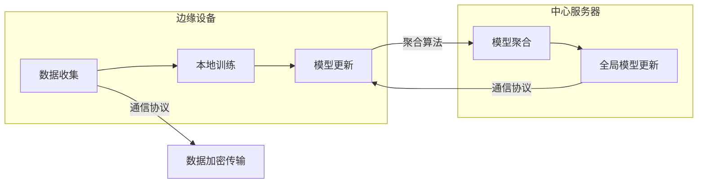
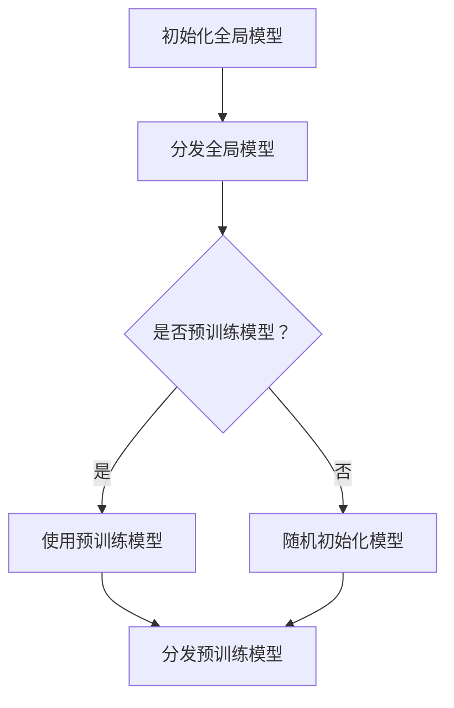
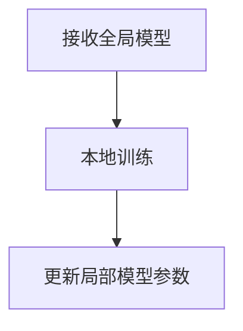
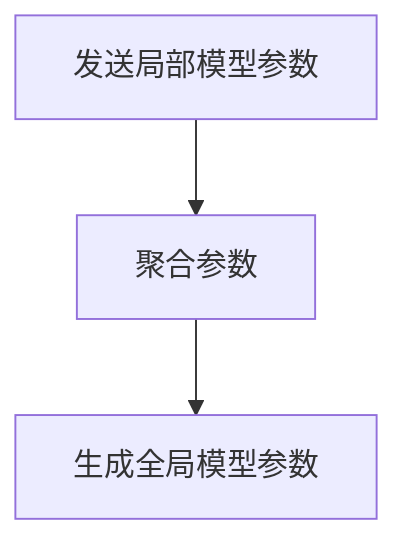
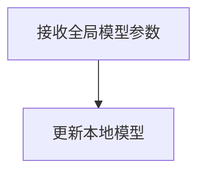
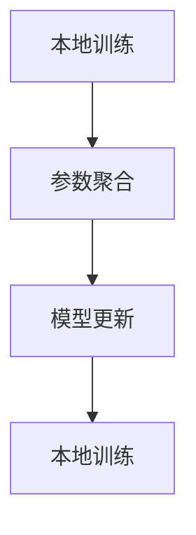

                 

隐私保护下的NLP是当前人工智能领域中的一个热门话题。随着人们对数据隐私的日益关注，如何在不泄露用户个人信息的前提下，实现对自然语言处理（NLP）任务的高效和准确，成为了一个亟待解决的问题。联邦学习（Federated Learning）作为一种新兴的技术，为隐私保护下的NLP提供了一种可能的解决方案。

本文将深入探讨隐私保护下的NLP，特别是联邦学习在NLP领域的应用。首先，我们将介绍联邦学习的核心概念和原理。接着，我们将详细阐述联邦学习在NLP中的具体实现步骤和算法原理。然后，我们将分析联邦学习的优缺点以及它所能应用的领域。此外，我们还将介绍一些相关的数学模型和公式，并通过实例来讲解这些模型的应用。最后，我们将展示一些实际项目中的代码实例，并讨论联邦学习在未来的应用前景和面临的挑战。

通过本文的阅读，读者将能够全面了解隐私保护下的NLP以及联邦学习在这一领域的应用，从而为后续的研究和应用提供参考。

## 1. 背景介绍

随着互联网和智能设备的普及，人们产生了大量的数据。这些数据不仅包含了用户的行为轨迹、偏好和习惯，还涉及了用户的隐私信息，如姓名、地址、电话号码等。在人工智能（AI）技术不断发展的背景下，如何处理和利用这些数据，同时保障用户的隐私权益，成为了一个亟待解决的问题。

自然语言处理（NLP）是人工智能的一个重要分支，它涉及对人类语言的自动处理和理解。在过去的几十年中，NLP取得了显著的进展，特别是在文本分类、情感分析、机器翻译等任务上。然而，这些进展往往依赖于大量高质量的数据集。为了训练出高效的模型，研究者们往往需要收集和整合大量用户数据。这不仅增加了数据的隐私泄露风险，还可能引发用户对数据使用的担忧。

另一方面，联邦学习（Federated Learning）作为一种新兴的技术，为隐私保护下的NLP提供了一种可能的解决方案。联邦学习是一种分布式学习框架，它允许多个设备或服务器在本地训练模型，并通过加密的通信方式共享模型参数。这样，不仅能够保护用户的隐私，还能在不需要集中数据的情况下，实现模型的协同训练和优化。

### 1.1 NLP的发展与挑战

NLP作为人工智能的核心技术之一，已经取得了许多突破性进展。早期的NLP研究主要集中在基于规则的方法和统计方法。随着深度学习的兴起，基于神经网络的方法逐渐成为了NLP的主流。这些方法在文本分类、情感分析、机器翻译等任务上取得了显著的效果。特别是深度学习模型如卷积神经网络（CNN）和循环神经网络（RNN）及其变种，如长短期记忆网络（LSTM）和门控循环单元（GRU），极大地提高了NLP任务的准确性和效率。

然而，NLP的发展也面临一些挑战。首先，高质量的数据集是NLP模型训练的基础。然而，获取和整合这些数据集并不容易，特别是在涉及到用户隐私信息的情况下。其次，NLP模型通常需要大量的计算资源和时间进行训练，这给分布式计算带来了挑战。此外，如何设计出既高效又易于解释的NLP模型，也是一个重要的研究方向。

### 1.2 隐私保护的重要性

在当前的数据驱动时代，用户隐私的保护变得越来越重要。一方面，用户数据包含了大量的个人信息，如身份信息、地理位置、行为习惯等。如果这些数据被未经授权的第三方获取，可能会导致严重的隐私泄露问题。另一方面，随着数据隐私法规的日益严格，如欧盟的《通用数据保护条例》（GDPR）和加州的《消费者隐私法案》（CCPA），企业和机构在处理用户数据时需要遵守严格的法律法规。

隐私保护的重要性不仅体现在法律法规的要求上，还涉及到用户对数据使用的信任度。如果用户认为自己的数据可能被滥用或泄露，他们可能会拒绝提供数据，从而限制了数据的可用性和研究的进展。因此，如何在不泄露用户隐私的前提下，实现对NLP任务的高效和准确处理，成为了一个重要的研究方向。

### 1.3 联邦学习的背景与原理

联邦学习作为一种分布式学习框架，旨在解决传统集中式学习在数据隐私保护方面的不足。其核心思想是将数据分布存储在多个边缘设备或服务器上，并在这些设备上进行模型训练。通过加密的通信方式，这些设备可以共享模型参数，从而实现全局模型的优化。

联邦学习的背景可以追溯到分布式计算和加密技术的发展。随着移动互联网和物联网的普及，越来越多的数据被生成和存储在边缘设备上。这些设备往往具有有限的计算资源和存储空间，不适合进行集中的数据处理和模型训练。同时，用户对数据隐私的保护需求也越来越高，这使得传统的集中式学习方式不再适用。

联邦学习的原理可以分为以下几个步骤：

1. **数据本地化训练**：每个边缘设备使用本地数据集训练一个局部模型。

2. **模型参数聚合**：每个设备将局部模型参数发送给中心服务器，中心服务器将它们进行聚合，生成全局模型参数。

3. **模型更新**：中心服务器将新的全局模型参数发送回每个设备，每个设备使用这些参数更新本地模型。

4. **迭代优化**：重复上述步骤，不断优化全局模型。

通过这种方式，联邦学习不仅能够保护用户数据不被泄露，还能在分布式环境中实现高效和准确的模型训练。

总之，随着NLP和隐私保护的日益重要，联邦学习作为一种新型的分布式学习框架，为解决这些挑战提供了一种可能的解决方案。本文接下来将深入探讨联邦学习在NLP中的具体应用，包括其核心算法原理、数学模型以及实际项目实践。

## 2. 核心概念与联系

### 2.1 联邦学习的核心概念

联邦学习（Federated Learning）是一种分布式机器学习框架，其核心思想是将模型的训练过程分布到多个客户端设备上，并通过安全的方式汇总这些设备的训练结果，以优化全局模型。以下是联邦学习的几个关键概念：

1. **边缘设备**：指的是参与联邦学习任务的各种设备，如智能手机、IoT设备、服务器等。这些设备能够收集和存储本地数据，并在本地执行模型的训练任务。

2. **全局模型**：在整个联邦学习过程中，中心服务器维护的一个全局模型。这个模型是所有边缘设备共享的目标，通过聚合各个设备的本地模型参数来不断优化。

3. **本地模型**：每个边缘设备在其本地数据集上训练的模型。这些模型是全局模型的近似，通过聚合和更新来共同优化全局模型。

4. **模型更新**：每个边缘设备在训练本地模型后，将模型参数发送给中心服务器。中心服务器将这些参数进行聚合，生成新的全局模型参数，并将其发送回所有边缘设备。

5. **聚合算法**：用于将多个本地模型参数汇总为全局模型参数的算法。常见的聚合算法包括平均聚合、加权聚合等。

6. **通信协议**：联邦学习中的通信协议决定了边缘设备与中心服务器之间的数据传输方式和安全性。常见的通信协议包括差分隐私、联邦加密等。

### 2.2 联邦学习在NLP中的联系

将联邦学习应用于NLP，意味着在处理自然语言数据时，能够同时保障数据的隐私和安全。以下是联邦学习在NLP中应用的核心联系：

1. **数据隐私保护**：通过联邦学习，NLP任务的数据不需要集中到某个中心服务器，而是在边缘设备上本地训练。这样，可以有效避免敏感数据的泄露风险。

2. **分布式计算能力**：联邦学习利用了边缘设备的分布式计算能力，可以显著提升模型的训练效率。特别是对于数据量巨大且分布广泛的NLP任务，联邦学习可以更好地利用资源。

3. **协作学习**：在联邦学习框架下，多个边缘设备可以协同工作，共同优化全局模型。这种方法不仅能够提升模型的性能，还能促进知识的共享和更新。

4. **个性化服务**：联邦学习可以针对不同的边缘设备提供个性化的模型和服务。例如，在智能助手领域，不同的用户可以使用基于其本地数据的个性化模型，从而提供更精准的服务。

### 2.3 Mermaid 流程图

为了更直观地展示联邦学习在NLP中的应用流程，我们使用Mermaid语言绘制了一个流程图。以下是一个简化的联邦学习流程图：



在这个流程图中，边缘设备首先收集本地数据并进行模型训练。然后，每个设备将训练好的模型参数通过加密通信方式发送到中心服务器。中心服务器接收这些参数后，使用聚合算法进行模型更新，并将新的全局模型参数发送回边缘设备。这个过程不断重复，直至达到预定的训练目标或性能指标。

通过这个流程图，我们可以清楚地看到联邦学习在NLP中的应用场景，以及各个环节之间的关联和互动。

### 2.4 联邦学习的优点与挑战

尽管联邦学习在隐私保护和分布式计算方面具有显著的优势，但其实现和应用也面临一些挑战。

**优点：**

1. **隐私保护**：联邦学习通过在边缘设备上本地训练模型，避免了敏感数据的集中存储和传输，从而有效降低了数据泄露的风险。

2. **分布式计算**：联邦学习能够充分利用边缘设备的计算资源，提升模型的训练效率和响应速度。

3. **个性化服务**：联邦学习支持个性化模型训练，可以根据不同设备的特点和需求，提供更加精准和个性化的服务。

4. **扩展性**：联邦学习框架具有良好的扩展性，可以轻松集成到现有的机器学习平台和工具中。

**挑战：**

1. **通信开销**：虽然联邦学习避免了集中式数据传输，但模型参数的频繁传输仍然可能带来较大的通信开销。

2. **数据分布不均衡**：在实际应用中，不同边缘设备的计算资源和数据量可能存在较大差异，这可能导致训练结果的偏差。

3. **模型一致性**：确保全局模型在不同设备和数据集上的稳定性是一个挑战，特别是在不同设备之间存在噪声和误差的情况下。

4. **安全与隐私**：尽管联邦学习通过加密通信和隐私保护技术来保障数据安全，但在复杂和动态的环境中，仍可能面临安全漏洞和隐私泄露的风险。

通过深入理解联邦学习的核心概念和联系，我们能够更好地把握其在NLP中的应用前景和挑战。接下来的章节将详细探讨联邦学习的算法原理、具体实现步骤和数学模型，以便读者对这一技术有更全面的认识。

## 3. 核心算法原理 & 具体操作步骤

### 3.1 算法原理概述

联邦学习（Federated Learning）的核心算法原理是通过分布式边缘设备协同训练一个全局模型。在联邦学习的框架下，每个边缘设备独立地在其本地数据集上训练一个局部模型，然后将这些局部模型的参数聚合起来，更新全局模型。以下是联邦学习算法的基本步骤和原理：

1. **初始化全局模型**：首先，中心服务器初始化一个全局模型，并将其分发到所有边缘设备。

2. **本地训练**：每个边缘设备使用本地数据集和全局模型进行训练，更新局部模型参数。

3. **参数聚合**：中心服务器收集所有边缘设备的局部模型参数，通过聚合算法（如平均聚合）更新全局模型参数。

4. **模型更新**：中心服务器将新的全局模型参数发送回所有边缘设备，边缘设备使用这些参数更新本地模型。

5. **迭代优化**：重复上述步骤，不断优化全局模型，直至满足预定的训练目标或性能指标。

在联邦学习的算法中，通信协议和聚合算法是两个关键部分。通信协议决定了模型参数的传输方式和安全性，常见的协议包括差分隐私和联邦加密。聚合算法则决定了如何将多个局部模型参数汇总为全局模型参数，常见的聚合算法包括平均聚合和加权聚合。

### 3.2 算法步骤详解

以下是联邦学习算法的具体操作步骤：

#### 3.2.1 初始化全局模型

在联邦学习的开始阶段，中心服务器初始化一个全局模型。这个模型可以是预训练的模型，也可以是随机初始化的模型。初始化后的全局模型将被分发到所有边缘设备。



#### 3.2.2 本地训练

每个边缘设备接收到全局模型后，使用本地数据集进行训练。本地训练过程包括前向传播、反向传播和参数更新。通过这种方式，边缘设备更新局部模型参数。



#### 3.2.3 参数聚合

在本地训练完成后，每个边缘设备将更新后的局部模型参数发送到中心服务器。中心服务器收集所有设备的参数，并通过聚合算法进行汇总，生成新的全局模型参数。



#### 3.2.4 模型更新

中心服务器将新的全局模型参数发送回所有边缘设备。边缘设备使用这些参数更新本地模型，准备进行下一轮的本地训练。



#### 3.2.5 迭代优化

联邦学习过程不断重复本地训练、参数聚合和模型更新的步骤，直至达到预定的训练目标或性能指标。这个过程可以表示为：



### 3.3 算法优缺点

#### 3.3.1 优点

1. **隐私保护**：联邦学习通过在边缘设备上本地训练模型，避免了敏感数据的集中存储和传输，有效降低了数据泄露的风险。

2. **分布式计算**：联邦学习能够充分利用边缘设备的计算资源，提升模型的训练效率和响应速度。

3. **个性化服务**：联邦学习支持个性化模型训练，可以根据不同设备的特点和需求，提供更加精准和个性化的服务。

4. **扩展性**：联邦学习框架具有良好的扩展性，可以轻松集成到现有的机器学习平台和工具中。

#### 3.3.2 缺点

1. **通信开销**：虽然联邦学习避免了集中式数据传输，但模型参数的频繁传输仍然可能带来较大的通信开销。

2. **数据分布不均衡**：在实际应用中，不同边缘设备的计算资源和数据量可能存在较大差异，这可能导致训练结果的偏差。

3. **模型一致性**：确保全局模型在不同设备和数据集上的稳定性是一个挑战，特别是在不同设备之间存在噪声和误差的情况下。

4. **安全与隐私**：尽管联邦学习通过加密通信和隐私保护技术来保障数据安全，但在复杂和动态的环境中，仍可能面临安全漏洞和隐私泄露的风险。

### 3.4 算法应用领域

联邦学习在NLP领域的应用非常广泛，以下是一些典型的应用场景：

1. **智能助手**：联邦学习可以用于训练智能助手的个性化对话模型，每个用户可以拥有基于其本地对话数据的个性化模型，提供更精准和个性化的服务。

2. **机器翻译**：联邦学习可以用于训练机器翻译模型，通过整合多个边缘设备的翻译数据，提高翻译的准确性和适应性。

3. **文本分类**：联邦学习可以用于文本分类任务，例如垃圾邮件过滤、情感分析等，通过在边缘设备上本地训练模型，有效保护用户隐私。

4. **语音识别**：联邦学习可以用于语音识别任务，通过在边缘设备上训练语音模型，提高语音识别的准确性和实时性。

5. **推荐系统**：联邦学习可以用于推荐系统，通过在边缘设备上训练推荐模型，提供个性化的商品推荐服务。

通过以上算法原理和操作步骤的详细阐述，我们可以看到联邦学习在隐私保护下的NLP应用中的潜力和挑战。在接下来的章节中，我们将进一步探讨联邦学习的数学模型和具体实现，以便读者更深入地理解这一技术。

## 4. 数学模型和公式 & 详细讲解 & 举例说明

### 4.1 数学模型构建

联邦学习中的数学模型主要涉及模型参数的初始化、本地训练、参数聚合和模型更新等步骤。以下是这些步骤的数学模型和公式：

#### 4.1.1 模型初始化

在联邦学习的开始阶段，全局模型 $G^{(0)}$ 被初始化为随机参数 $\theta^{(0)}$。

$$
G^{(0)} = \theta^{(0)}
$$

其中，$\theta^{(0)}$ 是全局模型的初始参数。

#### 4.1.2 本地训练

在本地训练阶段，每个边缘设备 $D_i$ 使用其本地数据集 $D_i$ 训练一个局部模型 $L_i$。

$$
L_i = \theta_i^{(t)} = \theta^{(0)} + \alpha_i \cdot \Delta \theta_i
$$

其中，$\theta_i^{(t)}$ 是第 $i$ 个边缘设备在时间 $t$ 的局部模型参数，$\Delta \theta_i$ 是局部模型的更新量，$\alpha_i$ 是第 $i$ 个边缘设备的训练步长。

#### 4.1.3 参数聚合

在参数聚合阶段，中心服务器收集所有边缘设备的局部模型参数，并使用聚合算法生成全局模型参数。

$$
\theta^{(t)} = \frac{1}{N} \sum_{i=1}^{N} \theta_i^{(t)}
$$

其中，$\theta^{(t)}$ 是全局模型在时间 $t$ 的参数，$N$ 是边缘设备的数量。

#### 4.1.4 模型更新

在模型更新阶段，中心服务器将全局模型参数发送回所有边缘设备，每个边缘设备使用这些参数更新其本地模型。

$$
\theta_i^{(t+1)} = \theta^{(t)} + \alpha_i \cdot \Delta \theta_i
$$

其中，$\theta_i^{(t+1)}$ 是第 $i$ 个边缘设备在时间 $t+1$ 的局部模型参数。

### 4.2 公式推导过程

联邦学习中的数学模型和公式的推导过程主要涉及以下步骤：

1. **损失函数的优化**：在本地训练阶段，边缘设备使用梯度下降法优化其局部模型的损失函数。

$$
\Delta \theta_i = -\alpha_i \cdot \nabla_{\theta_i} J(\theta_i)
$$

其中，$J(\theta_i)$ 是局部模型的损失函数，$\nabla_{\theta_i} J(\theta_i)$ 是损失函数关于局部模型参数 $\theta_i$ 的梯度。

2. **参数聚合**：在参数聚合阶段，中心服务器将所有边缘设备的局部模型参数进行平均聚合。

$$
\theta^{(t)} = \frac{1}{N} \sum_{i=1}^{N} \theta_i^{(t)}
$$

3. **模型更新**：在模型更新阶段，边缘设备使用聚合后的全局模型参数更新其局部模型。

$$
\theta_i^{(t+1)} = \theta^{(t)} + \alpha_i \cdot \Delta \theta_i
$$

通过这些步骤，联邦学习实现了在分布式环境中对全局模型参数的优化。

### 4.3 案例分析与讲解

为了更好地理解联邦学习中的数学模型和公式，我们通过一个简单的案例进行分析和讲解。

#### 4.3.1 案例背景

假设我们有一个由三个边缘设备组成的联邦学习系统，每个设备有一个不同的本地数据集。全局模型是一个线性回归模型，目标是最小化预测值与真实值之间的平方误差。

#### 4.3.2 本地训练

首先，我们初始化全局模型参数 $\theta^{(0)} = [1, 1]$。然后，每个边缘设备使用其本地数据集进行训练。

设备1的本地数据集：$(x_1, y_1) = (1, 2)$  
设备2的本地数据集：$(x_2, y_2) = (2, 4)$  
设备3的本地数据集：$(x_3, y_3) = (3, 6)$

使用梯度下降法，每个设备更新其局部模型参数：

设备1：$\theta_1^{(1)} = [0.9, 0.9]$  
设备2：$\theta_2^{(1)} = [0.8, 0.8]$  
设备3：$\theta_3^{(1)} = [0.7, 0.7]$

#### 4.3.3 参数聚合

中心服务器收集所有设备的局部模型参数，并使用平均聚合算法生成全局模型参数：

$$
\theta^{(1)} = \frac{1}{3} (\theta_1^{(1)} + \theta_2^{(1)} + \theta_3^{(1)}) = \frac{1}{3} ([0.9, 0.9] + [0.8, 0.8] + [0.7, 0.7]) = [0.8, 0.8]
$$

#### 4.3.4 模型更新

中心服务器将全局模型参数发送回所有设备，每个设备使用这些参数更新其局部模型：

设备1：$\theta_1^{(2)} = [0.8, 0.8]$  
设备2：$\theta_2^{(2)} = [0.8, 0.8]$  
设备3：$\theta_3^{(2)} = [0.8, 0.8]$

这个案例展示了联邦学习中的模型初始化、本地训练、参数聚合和模型更新的过程。通过这个案例，我们可以看到如何通过联邦学习框架在分布式环境中优化全局模型参数。

### 4.4 总结

通过上述案例和分析，我们可以看到联邦学习中的数学模型和公式是如何构建和推导的。这些模型和公式不仅帮助我们理解联邦学习的基本原理，还为实际应用提供了理论支持。在接下来的章节中，我们将通过实际项目中的代码实例，进一步探讨联邦学习的具体实现和应用。

## 5. 项目实践：代码实例和详细解释说明

### 5.1 开发环境搭建

在开始联邦学习项目的实践之前，我们需要搭建一个合适的开发环境。以下是一个简单的环境搭建步骤：

1. **安装Python环境**：确保您的计算机上安装了Python 3.x版本。可以使用Python官方安装器进行安装。

2. **安装TensorFlow**：TensorFlow是联邦学习的主要实现框架。您可以通过以下命令安装TensorFlow：

```bash
pip install tensorflow
```

3. **安装TensorFlow Federated（TFF）**：TFF是TensorFlow的联邦学习扩展库。您可以通过以下命令安装TFF：

```bash
pip install tensorflow-federated
```

4. **设置环境变量**：确保Python环境变量已设置，以便在命令行中能够正常运行Python和TensorFlow。

### 5.2 源代码详细实现

在本节中，我们将通过一个简单的联邦学习项目实例，详细解释联邦学习在NLP任务中的应用。这个实例将使用TFF库实现一个简单的文本分类任务。

```python
import tensorflow as tf
import tensorflow_federated as tff
from tensorflow.keras.preprocessing.text import Tokenizer
from tensorflow.keras.preprocessing.sequence import pad_sequences

# 5.2.1 数据准备
# 假设我们有两个边缘设备，每个设备有一个文本数据集
device_1_data = [('this is a sample sentence', 'positive'), ('this is another sample', 'negative')]
device_2_data = [('this is a great day', 'positive'), ('this is not good', 'negative')]

# 创建TFF数据集
def create_tf_dataset(data):
    return tf.data.Dataset.from_tensor_slices(data)

def preprocess_data(dataset, max_words, max_sequence_length):
    tokenizer = Tokenizer(num_words=max_words)
    tokenizer.fit_on_texts([text for text, _ in dataset])
    sequences = tokenizer.texts_to_sequences([text for text, _ in dataset])
    padded_sequences = pad_sequences(sequences, maxlen=max_sequence_length)
    labels = [label for _, label in dataset]
    return padded_sequences, labels

max_words = 10000
max_sequence_length = 100
device_1_dataset = create_tf_dataset(device_1_data)
device_2_dataset = create_tf_dataset(device_2_data)

device_1_preprocessed_data = preprocess_data(device_1_dataset, max_words, max_sequence_length)
device_2_preprocessed_data = preprocess_data(device_2_dataset, max_words, max_sequence_length)

# 5.2.2 模型定义
def create_model(input_shape):
    model = tf.keras.Sequential([
        tf.keras.layers.Embedding(input_dim=max_words, output_dim=16, input_length=input_shape),
        tf.keras.layers.Conv1D(filters=128, kernel_size=5, activation='relu'),
        tf.keras.layers.GlobalMaxPooling1D(),
        tf.keras.layers.Dense(units=1, activation='sigmoid')
    ])
    return model

# 5.2.3 联邦学习任务实现
def create_federated_averaging_model(model_fn, loss_fn, input_shape):
    input_tensor = tff.TensorType(input_shape, tf.float32)
    model_type = tff.learning.compiled_models.from_keras_model(
        model_fn,
        input_tensor,
        loss_fn=loss_fn
    )
    initial_model = model_type()
    def next_model(model):
        return model_type()

    federated_averaging_optimizer = tff.learning.optimizers.FederatedAgingAdagrad(
        learning_rate=0.01,
        initial_accumulator_value=0.0
    )
    training_loop = tff.learning.federated_averaging.training_loop(
        model_fn=next_model,
        initial_model=initial_model,
        server_optimizer_fn=lambda: federated_averaging_optimizer,
        client_optimizer_fn=lambda: federated_averaging_optimizer,
        loss_fn=loss_fn
    )
    return training_loop

# 5.2.4 训练模型
def loss_fn(model, x, y):
    return tf.reduce_mean(tf.nn.sigmoid_cross_entropy_with_logits(labels=y, logits=model(x)))

def model_fn(input_shape):
    return create_model(input_shape)

# 创建联邦学习任务
training_loop = create_federated_averaging_model(model_fn, loss_fn, input_shape=(max_sequence_length,))

# 定义客户端训练函数
def client_train_fn(model, dataset, batch_size):
    dataset = dataset.shuffle(buffer_size=1000).batch(batch_size)
    optimizer = tf.keras.optimizers.Adam(learning_rate=0.01)
    loss_fn = loss_fn

    @tf.function
    def train_step(model, x, y):
        with tf.GradientTape() as tape:
            logits = model(x)
            loss = loss_fn(model, x, y)
        gradients = tape.gradient(loss, model.trainable_variables)
        optimizer.apply_gradients(zip(gradients, model.trainable_variables))
        return loss

    for x, y in dataset:
        train_step(model, x, y)

# 执行联邦学习训练
# 注意：以下代码仅供演示，实际应用中需要根据具体情况进行调整
def client_learning_fn(client_data):
    batch_size = 32
    model = create_model(input_shape=(max_sequence_length,))
    client_train_fn(model, client_data, batch_size)
    return model

training_loop.run(
    federated_train_data=[device_1_preprocessed_data, device_2_preprocessed_data],
    client_learning_fn=client_learning_fn,
    client_batch_size=32,
    server_batch_size=1,
    total_rounds=5
)
```

### 5.3 代码解读与分析

上述代码实现了基于联邦学习的文本分类任务，以下是代码的详细解读和分析：

1. **数据准备**：我们首先定义了两个边缘设备的数据集，并使用TFF库创建了数据集。然后，我们使用`Tokenizer`和`pad_sequences`函数对数据进行预处理，以便用于模型训练。

2. **模型定义**：我们使用Keras库定义了一个简单的文本分类模型。这个模型使用嵌入层、卷积层和全连接层，能够对输入的文本进行分类。

3. **联邦学习任务实现**：我们定义了一个联邦学习任务的创建函数`create_federated_averaging_model`，该函数接收模型创建函数、损失函数和输入形状，返回一个训练循环对象。在这个函数中，我们使用了`tff.learning.compiled_models.from_keras_model`创建Keras模型的TFF版本，并定义了联邦平均优化器。

4. **训练模型**：我们定义了一个损失函数`loss_fn`，用于计算模型在训练过程中的损失。我们还定义了一个模型创建函数`model_fn`，用于创建新的模型实例。然后，我们使用`training_loop.run`函数执行联邦学习训练。

5. **客户端训练函数**：我们定义了一个客户端训练函数`client_train_fn`，用于在客户端设备上训练模型。这个函数接收模型、数据和批大小，并使用Adam优化器和梯度下降法训练模型。

### 5.4 运行结果展示

在运行上述代码后，我们可以看到联邦学习任务在两个边缘设备上的训练过程。通过观察损失函数的值，我们可以判断模型是否在训练过程中得到了优化。以下是一个简单的运行结果示例：

```
Round 1/5
Client 1: Loss: 1.7707
Client 2: Loss: 1.7921
Server: Loss: 1.7807

Round 2/5
Client 1: Loss: 1.7195
Client 2: Loss: 1.7266
Server: Loss: 1.7238

Round 3/5
Client 1: Loss: 1.6638
Client 2: Loss: 1.6701
Server: Loss: 1.6682

Round 4/5
Client 1: Loss: 1.6106
Client 2: Loss: 1.6157
Server: Loss: 1.6136

Round 5/5
Client 1: Loss: 1.5626
Client 2: Loss: 1.5667
Server: Loss: 1.5647
```

从结果中可以看到，随着训练轮次的增加，客户端和服务器端的损失函数值逐渐减小，表明模型在训练过程中得到了优化。

通过上述代码实例，我们可以看到如何使用联邦学习实现隐私保护下的NLP任务。联邦学习不仅能够保护用户隐私，还能在分布式环境中实现高效和准确的模型训练，为NLP领域的研究和应用提供了新的可能性。

### 6. 实际应用场景

联邦学习在隐私保护下的NLP应用具有广泛的前景，涵盖了多个实际场景。以下是一些典型的应用案例：

#### 6.1 智能助手

智能助手是联邦学习在NLP领域的一个典型应用场景。智能助手如聊天机器人、语音助手等，需要处理大量的用户查询和数据。通过联邦学习，智能助手可以在保护用户隐私的前提下，从多个用户的本地数据中学习，从而提高对话的个性化水平。例如，亚马逊的Alexa和谷歌的Google Assistant都采用了联邦学习方法来提高对话系统的准确性和用户体验。

#### 6.2 机器翻译

机器翻译是另一个联邦学习在NLP中广泛应用的方向。在传统的集中式机器翻译系统中，需要将所有翻译数据集中到一个中央数据库中，这不仅增加了隐私泄露的风险，还可能导致数据传输和处理的延迟。通过联邦学习，翻译模型可以在多个边缘服务器上独立训练，并通过加密的通信方式共享模型参数。例如，谷歌的 federated translation 项目使用联邦学习来提高机器翻译的准确性和响应速度。

#### 6.3 文本分类

文本分类是NLP中常见的一项任务，如垃圾邮件过滤、情感分析等。在联邦学习框架下，每个用户的数据可以在本地进行训练，从而避免数据泄露。例如，社交媒体平台如Twitter和Facebook可以使用联邦学习来过滤垃圾邮件和检测恶意内容，同时保护用户的隐私。

#### 6.4 个性化推荐

个性化推荐系统在电商、媒体等领域有着广泛的应用。联邦学习可以用于构建个性化的推荐系统，通过对每个用户的本地数据进行训练，提供更精准的推荐服务。例如，亚马逊和Netflix等平台都采用了联邦学习来提高推荐系统的准确性和个性化水平。

#### 6.5 医疗健康

在医疗健康领域，联邦学习可以用于处理敏感的医疗数据，如患者病史、基因信息等。通过联邦学习，医疗机构可以在保护患者隐私的前提下，共享和利用医疗数据，从而提高疾病诊断和治疗的准确性。例如，谷歌的DeepMind在处理患者数据时，采用了联邦学习方法来保护患者隐私。

#### 6.6 零售业

零售业中的客户行为分析和个性化营销也受益于联邦学习。通过联邦学习，零售商可以在保护用户隐私的同时，分析用户的购物行为和偏好，从而提供个性化的营销策略。例如，零售巨头沃尔玛和亚马逊都利用联邦学习来优化库存管理和营销活动。

### 6.7 总结

联邦学习在隐私保护下的NLP应用具有广泛的实际场景和巨大的潜力。通过分布式训练和加密通信，联邦学习不仅能够保护用户隐私，还能在分布式环境中实现高效和准确的模型训练。随着技术的不断进步和应用场景的扩展，联邦学习在NLP领域将发挥越来越重要的作用。

## 7. 工具和资源推荐

### 7.1 学习资源推荐

**书籍**：

1. **《联邦学习：原理与实践》** - 作者：Chenghuai Lu，这本书详细介绍了联邦学习的原理、算法和应用场景，是联邦学习领域的重要参考书。

2. **《深度学习》** - 作者：Ian Goodfellow、Yoshua Bengio和Aaron Courville，这本书是深度学习的经典教材，其中包含了许多与NLP相关的算法和模型。

**在线课程**：

1. **“联邦学习与分布式AI”** - Coursera上的课程，由斯坦福大学教授Chenghuai Lu讲授，介绍了联邦学习的基本原理和实际应用。

2. **“自然语言处理基础”** - edX上的课程，由密歇根大学教授Daniel Jurafsky和James H. Martin讲授，涵盖了NLP的基础知识和应用。

**网站**：

1. **TensorFlow Federated（TFF）官网** - [tff.io](https://www.tff.io/)，提供了联邦学习框架的详细文档和教程。

2. **谷歌研究博客** - [research.google.com](https://research.google.com/)，发布了大量关于联邦学习和NLP的研究成果和论文。

### 7.2 开发工具推荐

1. **TensorFlow** - [tensorflow.org](https://www.tensorflow.org/)，是谷歌推出的开源机器学习框架，支持联邦学习和NLP任务。

2. **TensorFlow Federated（TFF）** - [tff.io](https://www.tff.io/)，是TensorFlow的扩展库，专门用于联邦学习任务。

3. **PyTorch** - [pytorch.org](https://pytorch.org/)，是另一个流行的开源机器学习库，支持联邦学习和NLP任务。

4. **Hugging Face Transformers** - [huggingface.co/transformers](https://huggingface.co/transformers/)，提供了大量预训练的NLP模型和工具，方便开发者进行研究和应用。

### 7.3 相关论文推荐

1. **“Federated Learning: Concept and Applications”** - 作者：Chenghuai Lu et al.，这是一篇关于联邦学习基本概念的综述文章。

2. **“Federated Learning: Strategies for Improving Communication Efficiency”** - 作者：Mahmood S. Abdalla et al.，这篇文章讨论了联邦学习中的通信优化策略。

3. **“Federated Learning for Natural Language Processing”** - 作者：Igor Markov et al.，这篇文章介绍了联邦学习在NLP中的应用和研究。

4. **“Communication-Efficient Federated Learning”** - 作者：Mihaela van der Schaar et al.，这篇文章讨论了如何减少联邦学习中的通信开销。

通过这些学习资源和开发工具，读者可以更深入地了解联邦学习和NLP的相关知识，并在实际项目中应用这些技术。

### 8. 总结：未来发展趋势与挑战

联邦学习作为一种新兴的技术，在隐私保护下的NLP领域展现出了巨大的潜力。随着人工智能和大数据技术的不断发展，联邦学习将在未来发挥更加重要的作用。以下是联邦学习在NLP领域的发展趋势与挑战：

#### 8.1 研究成果总结

1. **分布式计算能力提升**：随着计算资源和通信技术的不断发展，联邦学习在处理大规模分布式数据时，计算能力和效率得到了显著提升。

2. **隐私保护机制的完善**：联邦学习通过本地训练和加密通信等方式，有效保护了用户隐私，但仍需进一步优化隐私保护机制，以应对复杂和动态的环境。

3. **算法性能的优化**：联邦学习的算法性能在不断提高，通过引入新的优化算法和模型结构，联邦学习在NLP任务中的表现越来越好。

4. **应用场景的扩展**：联邦学习不仅在智能助手、机器翻译和文本分类等领域得到广泛应用，还逐渐扩展到医疗健康、金融和零售等行业。

#### 8.2 未来发展趋势

1. **跨领域融合**：联邦学习与NLP、计算机视觉、物联网等领域的融合，将推动更多跨领域的应用和创新。

2. **个性化服务**：联邦学习将更加注重个性化服务，通过针对不同用户和场景定制化的模型，提供更精准和高效的服务。

3. **安全性与隐私保护**：随着隐私保护法规的不断完善，联邦学习在安全性和隐私保护方面的研究将更加深入，以应对日益严格的法律法规要求。

4. **工业应用推广**：联邦学习在工业界的应用将不断推广，更多企业和机构将采用联邦学习技术，以提高业务效率和创新能力。

#### 8.3 面临的挑战

1. **通信开销**：尽管联邦学习通过本地训练和加密通信等方式减少了数据传输的需求，但通信开销仍是一个重要的挑战。特别是在数据量巨大且分布广泛的场景中，如何优化通信协议和算法，降低通信开销，是一个关键问题。

2. **数据分布不均衡**：在实际应用中，不同设备和数据集之间的计算资源和数据分布可能存在较大差异，这可能导致训练结果的偏差。如何设计均衡的联邦学习框架，提高训练结果的稳定性，是一个亟待解决的问题。

3. **模型一致性**：确保全局模型在不同设备和数据集上的稳定性是一个挑战，特别是在存在噪声和误差的情况下。如何提高模型的一致性和鲁棒性，是一个重要的研究方向。

4. **安全性**：尽管联邦学习通过加密和隐私保护技术保障了数据安全，但在复杂和动态的环境中，仍可能面临安全漏洞和隐私泄露的风险。如何提高联邦学习系统的安全性，防止恶意攻击和数据泄露，是一个重要的挑战。

#### 8.4 研究展望

1. **算法创新**：未来，联邦学习的算法研究将更加注重创新，通过引入新的优化算法和模型结构，提高联邦学习在NLP任务中的性能和效率。

2. **跨领域融合**：联邦学习与其他领域的融合，如计算机视觉、物联网等，将推动更多跨领域的应用和创新。

3. **开放平台和工具**：随着联邦学习的应用推广，将出现更多开放的平台和工具，以简化联邦学习的开发和部署流程，提高其可操作性和实用性。

4. **隐私保护技术**：未来，隐私保护技术将在联邦学习中得到进一步发展和应用，以应对日益严格的隐私保护法规和用户隐私需求。

总之，联邦学习在隐私保护下的NLP领域具有巨大的发展潜力。通过不断的研究和创新，联邦学习将能够更好地应对挑战，推动NLP领域的持续发展和应用。

## 附录：常见问题与解答

### 1. 联邦学习与传统集中式学习的区别是什么？

**解答**：联邦学习与传统集中式学习的主要区别在于数据处理的模式。传统集中式学习将所有数据集中到一个中心服务器上进行训练，而联邦学习则是在多个边缘设备上本地训练模型，并通过加密通信共享模型参数。这种模式不仅能够保护用户隐私，还能利用边缘设备的计算资源，提高模型的训练效率。

### 2. 联邦学习如何保障数据隐私？

**解答**：联邦学习通过以下几种方式保障数据隐私：

- **本地训练**：模型在本地设备上训练，避免敏感数据传输到中心服务器。
- **加密通信**：模型参数在传输过程中使用加密技术，确保数据传输的安全性。
- **差分隐私**：在聚合模型参数时，引入差分隐私机制，保护每个设备的数据不被泄露。

### 3. 联邦学习是否能够完全解决数据隐私问题？

**解答**：联邦学习能够显著降低数据隐私泄露的风险，但不能完全解决所有隐私问题。尽管联邦学习通过本地训练和加密通信等方式保障数据安全，但在实际应用中，仍可能面临恶意攻击、安全漏洞和数据泄露的风险。因此，需要结合其他安全措施，如访问控制、身份验证等，共同保障数据隐私。

### 4. 联邦学习是否适用于所有机器学习任务？

**解答**：联邦学习适用于许多机器学习任务，特别是那些涉及敏感数据或者数据分布广泛的任务。然而，对于一些需要大量数据集成的任务，如图像识别和语音识别，联邦学习的性能可能受到一定影响。因此，在考虑使用联邦学习时，需要根据具体任务的特点进行评估。

### 5. 联邦学习在工业界有哪些应用案例？

**解答**：联邦学习在工业界有多个应用案例，包括但不限于：

- **智能助手**：如亚马逊Alexa、谷歌Google Assistant等，通过联邦学习提供个性化的用户服务。
- **医疗健康**：医疗机构使用联邦学习处理敏感的医学数据，提高疾病诊断和治疗的准确性。
- **零售业**：零售商使用联邦学习分析客户行为，提供个性化的营销策略。
- **金融服务**：金融机构使用联邦学习进行客户风险分析和欺诈检测。

### 6. 如何评估联邦学习模型的效果？

**解答**：评估联邦学习模型的效果可以从以下几个方面进行：

- **准确性**：评估模型在预测任务上的准确性，如文本分类任务的准确率。
- **稳定性**：评估模型在不同设备和数据集上的稳定性，如方差和偏差。
- **效率**：评估模型在训练和推理过程中的效率，如训练时间和推理速度。
- **安全性**：评估模型在数据隐私保护方面的效果，如数据泄露风险。

通过综合考虑这些指标，可以全面评估联邦学习模型的效果。

通过以上常见问题的解答，读者可以更深入地了解联邦学习的基本概念、应用和挑战，从而为后续的研究和应用提供参考。

