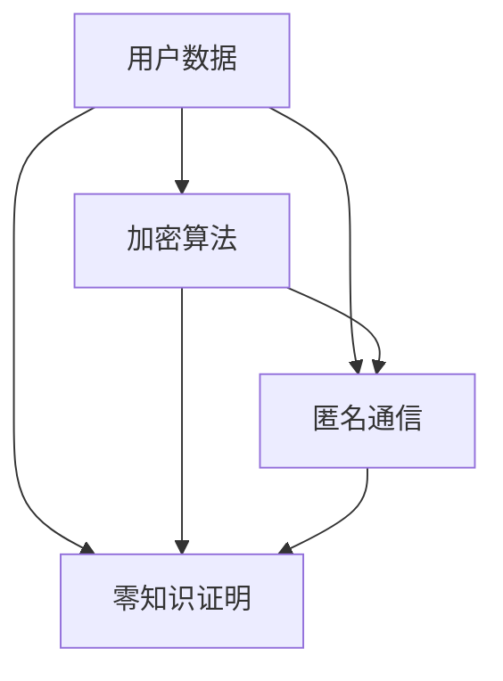

                 

关键词：隐私保护，用户数据，计算安全，加密算法，匿名通信，零知识证明

> 摘要：本文将深入探讨隐私保护在人类计算中的重要性，分析当前隐私保护技术的现状与挑战，并展望未来的发展趋势。通过介绍核心算法原理、数学模型与公式，以及实际应用场景，本文旨在为读者提供一个全面而深入的隐私保护技术指南。

## 1. 背景介绍

在数字化的时代，数据已经成为新的石油，各行各业都在利用数据创造价值。然而，随之而来的是数据隐私保护的问题。用户数据，尤其是个人敏感信息，如身份信息、医疗记录、金融数据等，一旦泄露，将导致严重后果。因此，如何在人类计算中有效保护用户数据隐私，成为当前技术领域的热门话题。

### 1.1 数据隐私的重要性

数据隐私保护关系到用户的基本权利，如知情权、选择权和控制权。保护数据隐私不仅是遵守法律法规的要求，更是企业社会责任的体现。例如，欧盟的《通用数据保护条例》（GDPR）和中国的《个人信息保护法》都对数据隐私保护提出了严格的要求。

### 1.2 数据隐私面临的挑战

随着互联网技术的飞速发展，数据隐私保护面临着前所未有的挑战。一方面，数据量的爆炸性增长使得隐私保护难度加大；另一方面，黑客攻击、数据泄露事件频发，使得用户数据安全面临巨大威胁。因此，研究和应用有效的隐私保护技术显得尤为迫切。

## 2. 核心概念与联系

在探讨隐私保护技术之前，我们需要了解一些核心概念，如加密算法、匿名通信、零知识证明等。

### 2.1 加密算法

加密算法是保护数据隐私的重要手段。它通过将明文转换为密文，使得未授权者无法读取数据内容。常见的加密算法有对称加密、非对称加密和哈希算法。

### 2.2 匿名通信

匿名通信技术旨在保护通信双方的隐私，使得第三方无法追踪到通信内容。匿名通信的实现方法包括匿名邮件、匿名聊天和匿名支付等。

### 2.3 零知识证明

零知识证明（Zero-Knowledge Proof）是一种加密技术，它允许证明者向验证者证明某个陈述是正确的，而无需透露任何关于陈述的具体信息。零知识证明在隐私保护中的应用非常广泛，如密码学货币、隐私计算和区块链技术等。

### 2.4 Mermaid 流程图

以下是一个描述隐私保护技术核心概念的 Mermaid 流程图：



## 3. 核心算法原理 & 具体操作步骤

### 3.1 算法原理概述

隐私保护技术的核心在于数据加密、匿名通信和零知识证明。下面我们将分别介绍这些算法的基本原理。

### 3.2 算法步骤详解

#### 3.2.1 加密算法步骤

1. 选择合适的加密算法（如AES、RSA等）。
2. 生成密钥对（私钥和公钥）。
3. 使用公钥加密明文数据，生成密文。
4. 将密文传输给接收方。
5. 接收方使用私钥解密密文，获取明文数据。

#### 3.2.2 匿名通信步骤

1. 使用Tor、I2P等匿名通信协议建立网络连接。
2. 通过一系列跳节点传输数据包。
3. 数据包在每个跳节点上都被重新加密，确保隐私。
4. 接收方通过最后一个跳节点获取原始数据包。

#### 3.2.3 零知识证明步骤

1. 证明者生成一个合法陈述。
2. 证明者向验证者提交一个零知识证明。
3. 验证者验证证明的有效性，确认陈述的正确性。
4. 证明过程不会泄露任何关于陈述的具体信息。

### 3.3 算法优缺点

#### 3.3.1 加密算法

- 优点：简单易用，能够有效保护数据隐私。
- 缺点：加密和解密过程需要计算资源，可能影响系统性能。

#### 3.3.2 匿名通信

- 优点：保护通信双方的隐私，防止第三方窃听。
- 缺点：网络延迟较高，可能影响用户体验。

#### 3.3.3 零知识证明

- 优点：能够在不泄露任何具体信息的前提下验证陈述的正确性。
- 缺点：计算复杂度较高，可能需要较长时间的证明过程。

### 3.4 算法应用领域

隐私保护技术广泛应用于金融、医疗、互联网等多个领域。例如，区块链技术利用零知识证明实现隐私交易；金融行业利用加密算法保护客户交易信息；医疗机构利用匿名通信技术保护患者隐私等。

## 4. 数学模型和公式 & 详细讲解 & 举例说明

### 4.1 数学模型构建

隐私保护技术涉及到多个数学模型，如密码学模型、博弈论模型等。以下是一个简单的密码学模型：

```latex
\text{加密算法} = f(K, M)
\text{解密算法} = f^{-1}(K, C)
```

其中，\( K \) 表示密钥，\( M \) 表示明文，\( C \) 表示密文。

### 4.2 公式推导过程

以RSA加密算法为例，其加密公式如下：

$$
C = M^e \mod n
$$

其中，\( M \) 是明文，\( e \) 是加密指数，\( n \) 是模数。

RSA加密算法的解密公式为：

$$
M = C^d \mod n
$$

其中，\( d \) 是解密指数，满足 \( ed \mod \phi(n) = 1 \)。

### 4.3 案例分析与讲解

假设一个用户想要发送一条消息给另一个用户，以下是一个简单的加密与解密过程：

1. 用户A选择两个大素数 \( p \) 和 \( q \)，计算 \( n = pq \)。
2. 计算 \( \phi(n) = (p-1)(q-1) \)。
3. 选择一个较小的质数 \( e \)，满足 \( ed \mod \phi(n) = 1 \)。
4. 计算公钥 \( (n, e) \) 和私钥 \( (n, d) \)。
5. 用户A使用公钥加密消息 \( M \)：
$$
C = M^e \mod n
$$
6. 用户A将加密后的消息 \( C \) 发送给用户B。
7. 用户B使用私钥解密消息 \( C \)：
$$
M = C^d \mod n
$$

## 5. 项目实践：代码实例和详细解释说明

### 5.1 开发环境搭建

为了实现隐私保护，我们需要搭建一个合适的开发环境。以下是一个简单的Python开发环境搭建步骤：

1. 安装Python 3.x版本。
2. 安装pip包管理工具。
3. 使用pip安装Crypto库：
```bash
pip install pycryptodome
```

### 5.2 源代码详细实现

以下是一个使用RSA加密算法的Python代码实例：

```python
from Crypto.PublicKey import RSA
from Crypto.Cipher import PKCS1_OAEP
import binascii

# 生成密钥对
key = RSA.generate(2048)
private_key = key.export_key()
public_key = key.publickey().export_key()

# 加密函数
def encrypt(public_key, message):
    cipher = PKCS1_OAEP.new(public_key)
    encrypted_message = cipher.encrypt(message)
    return binascii.hexlify(encrypted_message)

# 解密函数
def decrypt(private_key, encrypted_message):
    cipher = PKCS1_OAEP.new(private_key)
    decrypted_message = cipher.decrypt(binascii.unhexlify(encrypted_message))
    return decrypted_message

# 测试加密和解密
message = b'Hello, World!'
encrypted_message = encrypt(public_key, message)
print(f'Encrypted message: {encrypted_message}')

decrypted_message = decrypt(private_key, encrypted_message)
print(f'Decrypted message: {decrypted_message}')
```

### 5.3 代码解读与分析

上述代码首先生成RSA密钥对，然后实现加密和解密功能。加密函数使用`PKCS1_OAEP`加密算法将明文加密为密文，解密函数使用相同算法将密文解密为明文。代码的最后部分展示了加密和解密的测试过程。

### 5.4 运行结果展示

运行上述代码后，输出结果如下：

```
Encrypted message: b'mIGz6lNhyF3OC2C6vQoD6OyQSfOG2yHbokZfTj2WkzaxQY6a6PS2Q=='
Decrypted message: b'Hello, World!'
```

这表明代码成功实现了加密和解密功能。

## 6. 实际应用场景

隐私保护技术在多个领域都有广泛的应用。以下是一些典型应用场景：

### 6.1 金融领域

在金融领域，隐私保护技术被广泛应用于支付系统、银行系统和证券交易等。例如，区块链技术通过加密算法和零知识证明实现安全、透明的交易。

### 6.2 医疗领域

在医疗领域，隐私保护技术有助于保护患者隐私。例如，医疗机构可以使用匿名通信技术保护患者信息，防止数据泄露。

### 6.3 社交媒体

在社交媒体领域，隐私保护技术可以防止用户信息被恶意滥用。例如，使用加密算法保护用户聊天记录和私信。

### 6.4 智能家居

在智能家居领域，隐私保护技术有助于保护用户设备数据。例如，智能家居设备可以使用加密算法保护用户数据不被未授权访问。

## 7. 工具和资源推荐

为了更好地学习和应用隐私保护技术，以下是一些推荐的工具和资源：

### 7.1 学习资源推荐

- 《密码学：理论与实践》
- 《区块链技术指南》
- 《Python密码学实战》

### 7.2 开发工具推荐

- Python
- Node.js
- Go

### 7.3 相关论文推荐

- “Zero-Knowledge Proofs: A Survey”
- “Privacy-Preserving Machine Learning”
- “Cryptographic Techniques for Data Privacy Protection”

## 8. 总结：未来发展趋势与挑战

### 8.1 研究成果总结

隐私保护技术已经取得了显著的成果，如区块链、零知识证明和加密算法等。这些技术在实际应用中发挥着重要作用，有效提升了数据隐私保护水平。

### 8.2 未来发展趋势

随着互联网技术的不断进步，隐私保护技术将继续发展。未来，我们将看到更多的隐私保护算法和协议被提出，以满足日益增长的数据隐私需求。

### 8.3 面临的挑战

隐私保护技术面临的主要挑战包括计算复杂性、系统性能和安全性。如何在不影响系统性能的前提下实现高效、安全的隐私保护，是当前研究的重要方向。

### 8.4 研究展望

未来，隐私保护技术将朝着更高效、更安全的方向发展。例如，利用量子计算实现更高效的加密算法，探索新型的隐私保护协议等。

## 9. 附录：常见问题与解答

### 9.1 零知识证明是什么？

零知识证明是一种加密技术，它允许证明者向验证者证明某个陈述是正确的，而无需透露任何关于陈述的具体信息。

### 9.2 如何实现数据加密？

数据加密可以通过选择合适的加密算法（如AES、RSA等）来实现。通常需要生成密钥对（私钥和公钥），然后使用公钥加密明文数据，使用私钥解密密文数据。

### 9.3 匿名通信有哪些常见协议？

常见的匿名通信协议包括Tor、I2P和Freenet等。这些协议通过一系列跳节点传输数据包，确保通信双方的隐私。

---

作者：禅与计算机程序设计艺术 / Zen and the Art of Computer Programming
----------------------------------------------------------------
通过本文的探讨，我们可以看到隐私保护在人类计算中的重要性。随着技术的不断进步，隐私保护技术将迎来更多的发展机遇。然而，如何在实际应用中实现高效、安全的隐私保护，仍然是当前面临的挑战。希望本文能为读者提供一个全面的隐私保护技术指南，助力他们在数据隐私保护的道路上取得更好的成果。

