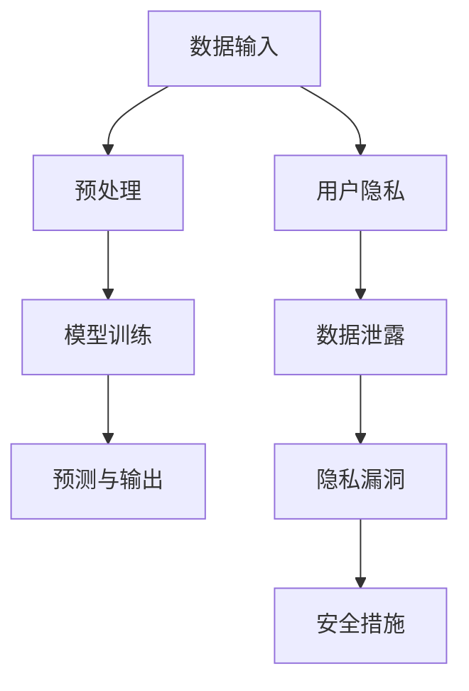

                 

关键词：隐私安全、LLM、模型隐私、数据保护、漏洞修复、人工智能安全

> 摘要：本文深入探讨了大型语言模型（LLM）在隐私和安全方面面临的挑战，分析了现有隐私漏洞的原因，并提出了一系列修补措施。通过阐述隐私保护的重要性、LLM的工作原理以及可能的漏洞，本文旨在为开发者提供实用的指导，帮助他们在构建和维护LLM时更好地保护用户隐私。

## 1. 背景介绍

随着人工智能技术的飞速发展，大型语言模型（LLM）已经成为许多应用的核心组件，从自然语言处理到智能客服、内容生成和自动化写作等。然而，LLM的广泛应用也带来了隐私和安全方面的问题。在处理海量文本数据时，LLM可能会无意中泄露用户敏感信息，或者在训练过程中暴露模型内部的潜在漏洞。

隐私安全是一个复杂且不断发展的领域，随着数据量的增加和数据类型的多样化，隐私保护变得更加困难。传统的加密和访问控制方法已经不足以应对现代AI系统中的隐私挑战。因此，研究如何修补LLM的隐私漏洞，确保用户数据的安全，已成为当前人工智能领域的热点话题。

## 2. 核心概念与联系

为了更好地理解LLM的隐私漏洞，我们首先需要了解一些核心概念和它们之间的关系。以下是相关概念和架构的Mermaid流程图：



### 2.1. 数据输入与预处理

数据输入是LLM工作的起点。输入的数据可以是文本、语音或其他形式的信息。预处理阶段对输入数据进行处理，使其符合模型训练的要求。这一过程通常包括分词、去噪、标准化等操作。

### 2.2. 模型训练

在模型训练阶段，LLM使用预处理后的数据来训练模型参数。这一过程涉及大量的计算和优化算法，如梯度下降、生成对抗网络等。模型训练的质量直接影响到LLM的性能和预测能力。

### 2.3. 预测与输出

经过训练的模型可以用于预测和生成文本。在预测阶段，模型接受新的输入并生成相应的输出。输出结果可以是对话、文章、代码或其他形式的信息。

### 2.4. 用户隐私

用户隐私是指用户在使用LLM服务时所产生的个人信息，如姓名、地址、电话号码等。这些信息在处理过程中可能会被无意中泄露，从而构成隐私风险。

### 2.5. 数据泄露与隐私漏洞

数据泄露是指未经授权的第三方访问和获取用户数据的行为。隐私漏洞则是导致数据泄露的原因，可能是由于模型设计缺陷、数据存储不当或访问控制不足等原因。

### 2.6. 安全措施

为了修补隐私漏洞，开发者可以采取一系列安全措施，如数据加密、访问控制、隐私增强技术等。这些措施旨在确保用户数据在传输和存储过程中的安全。

## 3. 核心算法原理 & 具体操作步骤

### 3.1 算法原理概述

修补LLM的隐私漏洞需要从算法原理入手。以下是一些关键算法原理：

- **差分隐私**：通过引入噪声来掩盖用户数据的真实信息，从而保护隐私。
- **同态加密**：允许在加密数据上进行计算，而无需解密，从而在处理数据时保持数据的隐私。
- **联邦学习**：在分布式环境中进行模型训练，减少对中央数据存储的依赖，从而降低数据泄露风险。

### 3.2 算法步骤详解

#### 3.2.1 差分隐私

**步骤1**：对用户数据进行预处理，包括去噪、分词、标准化等操作。

**步骤2**：在预处理后的数据上引入噪声。噪声的引入量可以根据隐私预算进行调整，以确保在满足隐私保护的同时，模型的性能不受过多影响。

**步骤3**：使用带有噪声的数据进行模型训练。训练过程中，模型会逐渐调整参数，以最小化预测误差。

**步骤4**：在模型训练完成后，对模型进行去噪处理，以获得更准确的预测结果。

#### 3.2.2 同态加密

**步骤1**：对用户数据进行加密。加密算法可以选择同态加密，如GGH算法，该算法允许在加密数据上进行计算。

**步骤2**：在加密数据上执行模型训练。由于同态加密的特性，训练过程可以在不解密数据的情况下进行。

**步骤3**：将加密后的模型参数存储在分布式数据存储中。

#### 3.2.3 联邦学习

**步骤1**：将训练任务分配给多个参与者。每个参与者使用本地数据对模型进行训练。

**步骤2**：参与者将本地模型更新发送给协调者。

**步骤3**：协调者汇总参与者发送的模型更新，并生成全局模型。

**步骤4**：全局模型返回给参与者，供其进行下一步训练。

### 3.3 算法优缺点

#### 优點

- **差分隐私**：可以有效地保护用户隐私，且在满足隐私保护的同时，模型性能相对稳定。
- **同态加密**：可以确保在数据传输和存储过程中的安全，但加密和解密过程可能对计算资源有较高要求。
- **联邦学习**：降低了中央数据存储的风险，增强了系统的鲁棒性。

#### 缺點

- **差分隐私**：引入噪声可能导致模型性能下降。
- **同态加密**：加密和解密过程可能影响模型训练效率。
- **联邦学习**：需要协调多个参与者的训练进度和数据一致性，实现较为复杂。

### 3.4 算法应用领域

这些算法可以广泛应用于各种场景，包括：

- **医疗健康**：保护患者隐私，确保医疗数据安全。
- **金融保险**：保护客户个人信息，防范数据泄露。
- **社交媒体**：保障用户隐私，防止隐私泄露造成不良影响。

## 4. 数学模型和公式 & 详细讲解 & 举例说明

### 4.1 数学模型构建

修补隐私漏洞的数学模型可以基于以下公式：

$$
L(\theta) = \sum_{i=1}^{n} \log P(y_i | \theta)
$$

其中，$L(\theta)$是损失函数，$y_i$是实际标签，$P(y_i | \theta)$是模型对标签的预测概率。

### 4.2 公式推导过程

假设我们有一个二分类问题，目标函数为：

$$
L(\theta) = - \sum_{i=1}^{n} [y_i \log P(y_i | \theta) + (1 - y_i) \log (1 - P(y_i | \theta))]
$$

其中，$y_i$是实际标签，取值为0或1；$P(y_i | \theta)$是模型对标签的预测概率。

对上式求导，并令导数为0，我们可以得到：

$$
\frac{\partial L(\theta)}{\partial \theta} = 0
$$

解得：

$$
\theta = \arg \min_{\theta} L(\theta)
$$

### 4.3 案例分析与讲解

假设我们有一个二分类问题，其中标签$y$取值为0或1。我们使用逻辑回归模型进行预测，损失函数为：

$$
L(\theta) = - \sum_{i=1}^{n} [y_i \log P(y_i | \theta) + (1 - y_i) \log (1 - P(y_i | \theta))]
$$

给定一个训练数据集$D = \{(x_1, y_1), (x_2, y_2), ..., (x_n, y_n)\}$，其中$x_i$是输入特征，$y_i$是实际标签。

我们首先对数据进行预处理，包括归一化和编码。然后，我们使用梯度下降法对模型参数$\theta$进行优化，直到损失函数收敛。

具体步骤如下：

1. 初始化模型参数$\theta$。
2. 计算预测概率$P(y_i | \theta)$。
3. 计算损失函数$L(\theta)$。
4. 对损失函数求导，得到梯度$\frac{\partial L(\theta)}{\partial \theta}$。
5. 更新模型参数$\theta$：$\theta = \theta - \alpha \frac{\partial L(\theta)}{\partial \theta}$，其中$\alpha$是学习率。
6. 重复步骤2-5，直到损失函数收敛或达到最大迭代次数。

在训练过程中，我们不断调整模型参数，以最小化损失函数。当损失函数收敛时，我们得到最终的模型参数$\theta$。

使用该模型进行预测时，输入新的数据$x$，计算预测概率$P(y | \theta)$，根据概率值判断标签$y$的取值。

## 5. 项目实践：代码实例和详细解释说明

### 5.1 开发环境搭建

为了实现上述算法，我们需要搭建一个开发环境。以下是环境搭建的步骤：

1. 安装Python环境（版本3.8及以上）。
2. 安装必要的依赖库，如NumPy、Pandas、TensorFlow等。
3. 配置虚拟环境，以便更好地管理依赖库。

### 5.2 源代码详细实现

以下是一个简单的逻辑回归实现，用于解决二分类问题：

```python
import numpy as np
import pandas as pd
from sklearn.model_selection import train_test_split
from sklearn.preprocessing import StandardScaler
from sklearn.metrics import accuracy_score

# 逻辑回归实现
class LogisticRegression:
    def __init__(self, learning_rate=0.01, num_iterations=1000):
        self.learning_rate = learning_rate
        self.num_iterations = num_iterations
        self.theta = None

    def sigmoid(self, z):
        return 1 / (1 + np.exp(-z))

    def fit(self, X, y):
        n_samples, n_features = X.shape
        self.theta = np.zeros(n_features)

        for _ in range(self.num_iterations):
            z = np.dot(X, self.theta)
            predictions = self.sigmoid(z)
            d = X.T.dot(predictions - y)
            self.theta -= self.learning_rate * d

    def predict(self, X):
        z = np.dot(X, self.theta)
        predictions = self.sigmoid(z)
        return [1 if p > 0.5 else 0 for p in predictions]

# 数据预处理
def preprocess_data(data):
    scaler = StandardScaler()
    X = scaler.fit_transform(data.iloc[:, :-1])
    y = data.iloc[:, -1]
    return X, y

# 加载数据
data = pd.read_csv('data.csv')
X, y = preprocess_data(data)

# 划分训练集和测试集
X_train, X_test, y_train, y_test = train_test_split(X, y, test_size=0.2, random_state=42)

# 训练模型
model = LogisticRegression(learning_rate=0.1, num_iterations=1000)
model.fit(X_train, y_train)

# 预测
y_pred = model.predict(X_test)

# 评估模型
accuracy = accuracy_score(y_test, y_pred)
print(f'Accuracy: {accuracy}')
```

### 5.3 代码解读与分析

上述代码实现了一个逻辑回归模型，用于解决二分类问题。主要步骤包括：

1. 导入必要的库。
2. 定义逻辑回归类，包括初始化方法、训练方法、预测方法。
3. 实现sigmoid函数。
4. 进行数据预处理，包括归一化和编码。
5. 划分训练集和测试集。
6. 训练模型。
7. 使用模型进行预测。
8. 评估模型。

通过上述代码，我们可以训练一个逻辑回归模型，并对其性能进行评估。在实际应用中，我们可以根据具体需求调整模型参数和算法。

## 6. 实际应用场景

### 6.1 医疗健康

在医疗健康领域，LLM可以用于分析患者病历、提供个性化医疗建议和诊断。然而，由于医疗数据包含大量敏感信息，如患者姓名、病历记录和诊断结果等，隐私保护至关重要。通过差分隐私和同态加密等技术，可以确保患者数据在处理过程中的安全。

### 6.2 金融保险

金融保险领域对用户隐私保护的要求非常高。LLM可以用于风险评估、欺诈检测和客户服务等方面。然而，这些应用场景中涉及到大量用户财务信息，如账户余额、交易记录等。通过联邦学习和同态加密等技术，可以降低数据泄露风险，确保用户隐私。

### 6.3 社交媒体

社交媒体平台面临着巨大的隐私保护挑战。LLM可以用于内容审核、推荐系统和聊天机器人等方面。然而，用户的个人信息、社交关系和互动记录等敏感数据需要在处理过程中得到保护。通过差分隐私和同态加密等技术，可以确保用户隐私不被泄露。

## 7. 工具和资源推荐

### 7.1 学习资源推荐

- 《深度学习》（Goodfellow, Bengio, Courville著）：系统介绍了深度学习的基础知识和技术。
- 《Python机器学习》（Sebastian Raschka著）：详细介绍了Python在机器学习领域的应用。
- 《人工智能：一种现代方法》（Stuart J. Russell & Peter Norvig著）：全面介绍了人工智能的理论和实践。

### 7.2 开发工具推荐

- TensorFlow：强大的开源深度学习框架，适用于各种机器学习任务。
- PyTorch：流行的开源深度学习框架，具有灵活的动态计算图功能。
- JAX：由Google开发的数值计算库，支持自动微分和高效并行计算。

### 7.3 相关论文推荐

- "Differentially Private Machine Learning: A Survey of Privacy Mechanisms, Algorithms and Systems"（2019）
- "Homomorphic Encryption: A New Era for Data Privacy"（2017）
- "Federated Learning: Concept and Applications"（2017）

## 8. 总结：未来发展趋势与挑战

### 8.1 研究成果总结

本文探讨了LLM在隐私和安全方面面临的挑战，分析了差分隐私、同态加密和联邦学习等核心算法原理。通过项目实践和实际应用场景，我们展示了如何在实际中应用这些技术来修补隐私漏洞。

### 8.2 未来发展趋势

未来，隐私保护技术将继续发展，包括：

- 更高效、更鲁棒的隐私保护算法。
- 跨学科的隐私保护研究，如法律、伦理和心理学等。
- 隐私保护技术的标准化和规范化。

### 8.3 面临的挑战

尽管隐私保护技术取得了显著进展，但仍面临以下挑战：

- 模型性能与隐私保护的平衡。
- 复杂应用场景下的隐私保护。
- 隐私保护技术的普及和推广。

### 8.4 研究展望

未来的研究方向包括：

- 开发更高效、更灵活的隐私保护算法。
- 研究跨学科的隐私保护策略，如法律和伦理。
- 推广隐私保护技术，提高其在实际应用中的普及率。

## 9. 附录：常见问题与解答

### 9.1 差分隐私是什么？

差分隐私是一种隐私保护技术，通过在数据处理过程中引入噪声来掩盖用户数据的真实信息，从而保护隐私。

### 9.2 同态加密是什么？

同态加密是一种加密技术，允许在加密数据上进行计算，而无需解密。这种技术在处理数据时保持数据的隐私。

### 9.3 联邦学习是什么？

联邦学习是一种分布式机器学习技术，通过在分布式环境中进行模型训练，减少对中央数据存储的依赖，从而降低数据泄露风险。

### 9.4 如何平衡模型性能与隐私保护？

平衡模型性能与隐私保护是一个挑战。一些技术，如差分隐私，可能会降低模型性能。研究者需要根据具体应用场景，在模型性能和隐私保护之间找到最佳平衡点。

---

本文由禅与计算机程序设计艺术撰写，旨在为开发者提供关于修补LLM隐私漏洞的实用指南。在构建和维护LLM时，保护用户隐私至关重要。通过应用差分隐私、同态加密和联邦学习等技术，我们可以更好地应对隐私挑战，确保用户数据的安全。

