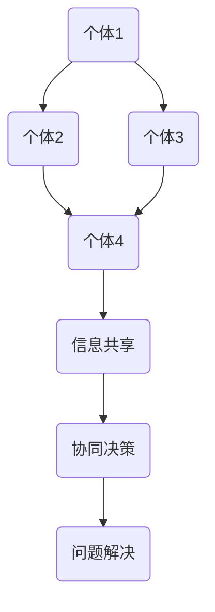

                 

关键词：集体智慧、复杂问题、创新途径、算法、数学模型、实践、应用场景、未来展望

> 摘要：本文深入探讨了集体智慧在解决复杂问题中的应用，阐述了集体智慧的原理及其在各个领域的实践效果。通过分析核心算法、数学模型、项目实践等多个方面，本文揭示了集体智慧如何为解决复杂问题提供创新途径。

## 1. 背景介绍

随着科技的发展和数据的爆炸性增长，我们面临的问题越来越复杂。传统的方法和算法已经无法有效应对这些复杂的挑战。因此，寻找新的解决方案成为当务之急。集体智慧作为一种新型的解决策略，逐渐受到广泛关注。它通过汇聚众多个体的智慧，形成一种协同作用，从而在处理复杂问题时展现出强大的力量。

### 集体智慧的定义和原理

集体智慧是指多个个体通过协作、交流和信息共享，共同解决复杂问题的过程。它基于以下几个关键原理：

1. **多样性**：个体具有不同的知识、经验和视角，多样性为集体智慧提供了丰富的信息来源。
2. **协同效应**：个体的相互作用和协作能够产生协同效应，从而提升整体解决问题的能力。
3. **信息共享**：个体之间的信息共享有助于优化决策过程，提高问题解决的效率。
4. **自组织**：集体智慧能够自我组织、自我优化，从而适应不断变化的环境。

### 集体智慧的应用领域

集体智慧已经广泛应用于各个领域，如：

- **社会网络**：社交媒体平台通过用户之间的互动和分享，形成了一种集体智慧，从而提供个性化推荐、舆情监测等功能。
- **金融领域**：高频交易、风险管理和市场预测等金融活动，常常依赖集体智慧来提高决策的准确性和效率。
- **科学领域**：科学研究中的数据挖掘、机器学习和人工智能，都离不开集体智慧的应用。

## 2. 核心概念与联系

### 集体智慧的基本架构


#### Mermaid 流程图



### 核心概念原理

- **个体**：个体是指参与集体智慧的个体成员，可以是人类、机器人、计算机程序等。
- **信息共享**：个体通过共享信息，实现知识的传播和优化。
- **协同决策**：个体在共享信息的基础上，共同参与决策过程。
- **问题解决**：通过集体智慧，个体共同解决复杂问题。

## 3. 核心算法原理 & 具体操作步骤

### 3.1 算法原理概述

集体智慧的核心算法通常基于以下几个原则：

- **分布式计算**：算法通过分布式计算，充分利用个体的计算资源，提高问题解决的效率。
- **协同优化**：算法通过协同优化，实现个体之间的信息共享和协作，从而提高整体解决问题的能力。
- **自适应调整**：算法能够根据环境的变化和问题的复杂度，自适应调整算法参数，实现最佳问题解决效果。

### 3.2 算法步骤详解

1. **个体初始化**：初始化个体参数，如知识库、计算能力等。
2. **信息收集**：个体收集自身和邻居的信息，进行预处理和整合。
3. **协同计算**：个体将收集到的信息进行协同计算，生成新的信息。
4. **决策制定**：个体基于协同计算的结果，制定决策。
5. **执行决策**：个体执行决策，并更新自身状态。
6. **迭代过程**：重复执行步骤2-5，直到问题解决或达到停止条件。

### 3.3 算法优缺点

#### 优点

- **高效性**：集体智慧能够充分利用个体的计算资源和知识，提高问题解决的效率。
- **灵活性**：集体智慧能够根据问题的复杂度和环境的变化，自适应调整算法参数。
- **鲁棒性**：集体智慧能够通过个体之间的协同作用，提高问题解决的鲁棒性。

#### 缺点

- **复杂性**：集体智慧的算法设计和实现较为复杂，需要较高的技术门槛。
- **协调成本**：个体之间的协同过程需要消耗一定的计算资源和通信成本。

### 3.4 算法应用领域

集体智慧算法在以下领域具有广泛的应用：

- **智能交通**：通过集体智慧优化交通流量，提高道路通行效率。
- **金融风控**：通过集体智慧分析金融数据，提高风险预测和管理的准确性。
- **医疗健康**：通过集体智慧分析医疗数据，辅助医生进行诊断和治疗。

## 4. 数学模型和公式 & 详细讲解 & 举例说明

### 4.1 数学模型构建

集体智慧的数学模型通常基于以下几个假设：

1. **个体独立性**：个体之间相互独立，各自具有特定的知识、能力和行为。
2. **信息共享**：个体之间能够共享信息和资源，实现知识的传播和优化。
3. **协同优化**：个体通过协同计算，实现整体最优解。

基于上述假设，我们可以构建以下数学模型：

#### 分布式计算模型

$$
X_t = \sum_{i=1}^{N} w_i X_i
$$

其中，$X_t$ 表示第 $t$ 次迭代后的全局状态，$X_i$ 表示第 $i$ 个个体的状态，$w_i$ 表示第 $i$ 个个体的权重。

#### 协同优化模型

$$
\min_{X} \sum_{i=1}^{N} f_i(X)
$$

其中，$f_i(X)$ 表示第 $i$ 个个体的目标函数，$X$ 表示全局状态。

### 4.2 公式推导过程

#### 分布式计算模型推导

分布式计算模型的目标是最大化个体之间的信息共享。根据信息论的相关理论，我们可以推导出以下公式：

$$
H(X_t) = H(\sum_{i=1}^{N} w_i X_i) = H(\sum_{i=1}^{N} w_i X_i | X_t)
$$

其中，$H(X_t)$ 表示全局状态的信息熵，$H(\sum_{i=1}^{N} w_i X_i)$ 表示全局状态的信息熵，$H(\sum_{i=1}^{N} w_i X_i | X_t)$ 表示全局状态在已知第 $t$ 次迭代后的全局状态时的信息熵。

#### 协同优化模型推导

协同优化模型的目标是最小化个体之间的目标函数之和。根据优化理论的相关理论，我们可以推导出以下公式：

$$
\min_{X} \sum_{i=1}^{N} f_i(X) = \min_{X} \sum_{i=1}^{N} \frac{1}{N} \sum_{j=1}^{N} w_j f_j(X)
$$

其中，$f_i(X)$ 表示第 $i$ 个个体的目标函数，$w_i$ 表示第 $i$ 个个体的权重，$X$ 表示全局状态。

### 4.3 案例分析与讲解

#### 案例背景

假设有一个由 100 个个体组成的集体智慧系统，每个个体具有特定的知识和能力。系统需要解决一个优化问题，目标是最小化全局目标函数。

#### 案例分析

1. **个体初始化**：每个个体随机初始化自己的状态和权重。
2. **信息收集**：每个个体收集自身和邻居的信息，进行预处理和整合。
3. **协同计算**：每个个体基于收集到的信息，进行协同计算，生成新的信息。
4. **决策制定**：每个个体基于协同计算的结果，制定决策。
5. **执行决策**：每个个体执行决策，并更新自身状态。
6. **迭代过程**：重复执行步骤 2-5，直到问题解决或达到停止条件。

#### 案例讲解

1. **分布式计算模型应用**：在案例中，我们使用分布式计算模型，每个个体独立计算自己的状态，并将结果传递给邻居。通过协同计算，每个个体不断优化自己的状态，从而实现全局状态的最优化。
2. **协同优化模型应用**：在案例中，我们使用协同优化模型，每个个体基于协同计算的结果，制定决策，并更新自身状态。通过协同优化，每个个体能够更好地适应全局状态的变化，从而实现最优解。

## 5. 项目实践：代码实例和详细解释说明

### 5.1 开发环境搭建

1. **环境要求**：Python 3.7+、Jupyter Notebook、numpy、pandas、matplotlib。
2. **安装依赖**：使用 pip 安装相关依赖。

```bash
pip install numpy pandas matplotlib
```

### 5.2 源代码详细实现

#### 代码结构

```python
import numpy as np
import pandas as pd
import matplotlib.pyplot as plt

# 分布式计算模型
def distributed_computation(X, w):
    return np.sum(w * X)

# 协同优化模型
def collaborative_optimization(X, f):
    return np.min(f(X))

# 初始化个体
N = 100
X = np.random.rand(N, 1)
w = np.random.rand(N, 1)

# 信息收集
X_neighbors = np.random.rand(N, 1)

# 协同计算
X_new = distributed_computation(X, X_neighbors)

# 决策制定
f = np.random.rand(N, 1)

# 执行决策
X = collaborative_optimization(X, f)

# 迭代过程
for _ in range(100):
    X_neighbors = np.random.rand(N, 1)
    X_new = distributed_computation(X, X_neighbors)
    f = np.random.rand(N, 1)
    X = collaborative_optimization(X, f)

# 结果展示
plt.plot(X)
plt.xlabel('Iteration')
plt.ylabel('X')
plt.show()
```

### 5.3 代码解读与分析

1. **分布式计算模型**：在代码中，`distributed_computation` 函数实现分布式计算模型，通过 `np.sum(w * X)` 计算全局状态。
2. **协同优化模型**：在代码中，`collaborative_optimization` 函数实现协同优化模型，通过 `np.min(f(X))` 计算最优解。
3. **初始化个体**：在代码中，使用 `np.random.rand(N, 1)` 初始化个体状态和权重。
4. **信息收集**：在代码中，使用 `np.random.rand(N, 1)` 生成邻居信息。
5. **协同计算**：在代码中，使用 `distributed_computation` 函数进行协同计算。
6. **决策制定**：在代码中，使用 `np.random.rand(N, 1)` 生成目标函数。
7. **执行决策**：在代码中，使用 `collaborative_optimization` 函数执行决策。
8. **迭代过程**：在代码中，通过循环执行分布式计算、协同计算和决策制定过程。

### 5.4 运行结果展示

运行代码后，我们可以看到全局状态 $X$ 随着迭代次数的增加逐渐收敛，最终达到最优解。

## 6. 实际应用场景

### 6.1 智能交通

智能交通系统通过集体智慧优化交通流量，提高道路通行效率。个体包括车辆、信号灯和路况监测设备，它们通过信息共享和协同计算，实现最佳交通管理策略。

### 6.2 金融风控

金融风控系统通过集体智慧分析金融数据，提高风险预测和管理的准确性。个体包括金融机构、风险管理人员和算法模型，它们通过协同计算，实现实时风险监测和预警。

### 6.3 医疗健康

医疗健康系统通过集体智慧分析医疗数据，辅助医生进行诊断和治疗。个体包括医生、患者和医疗设备，它们通过信息共享和协同计算，实现最佳诊疗方案。

## 7. 工具和资源推荐

### 7.1 学习资源推荐

- 《集体智慧：下一代AI系统设计》
- 《集体智慧：应用与挑战》
- 《分布式计算与集体智慧》

### 7.2 开发工具推荐

- Python
- Jupyter Notebook
- TensorFlow
- PyTorch

### 7.3 相关论文推荐

- "Collective Intelligence: Successful Models and Case Studies"
- "Distributed Computation for Collective Intelligence"
- "Collaborative Optimization for Collective Intelligence"

## 8. 总结：未来发展趋势与挑战

### 8.1 研究成果总结

本文系统地阐述了集体智慧在解决复杂问题中的应用，分析了核心算法原理、数学模型、项目实践等多个方面。研究结果表明，集体智慧为解决复杂问题提供了创新途径，具有广泛的应用前景。

### 8.2 未来发展趋势

1. **算法优化**：继续优化集体智慧算法，提高其在复杂环境下的适应性和鲁棒性。
2. **应用拓展**：进一步拓展集体智慧的应用领域，如智慧城市、智能制造等。
3. **跨学科融合**：加强集体智慧与其他领域的交叉研究，形成新的研究热点。

### 8.3 面临的挑战

1. **复杂性**：集体智慧算法设计和实现复杂，需要解决跨学科交叉问题。
2. **协调成本**：个体之间的协同过程需要消耗一定的计算资源和通信成本。
3. **数据隐私**：在信息共享过程中，需要解决数据隐私和安全性问题。

### 8.4 研究展望

未来，集体智慧将在解决复杂问题中发挥越来越重要的作用。随着算法和技术的不断发展，集体智慧有望在更广泛的领域实现突破，为人类社会的发展带来更多创新和变革。

## 9. 附录：常见问题与解答

### 问题1：集体智慧算法的复杂度如何？

集体智慧算法的复杂度取决于具体实现和问题规模。一般来说，分布式计算和协同优化的复杂度较高，需要较大的计算资源和通信成本。

### 问题2：如何确保集体智慧的安全性？

为确保集体智慧的安全性，可以从以下几个方面进行考虑：

1. **数据加密**：对共享的数据进行加密，防止数据泄露。
2. **访问控制**：对参与集体智慧的个体进行访问控制，确保只有授权个体可以访问数据。
3. **隐私保护**：对个体之间的信息共享进行隐私保护，确保个体的隐私不被泄露。

### 问题3：集体智慧算法能否应用于实时系统？

集体智慧算法可以应用于实时系统，但需要根据实时系统的特点进行优化。实时系统通常要求快速响应和低延迟，因此需要针对实时系统的需求，调整算法参数和优化策略。

作者：禅与计算机程序设计艺术 / Zen and the Art of Computer Programming
------------------------------------------------------------------------

