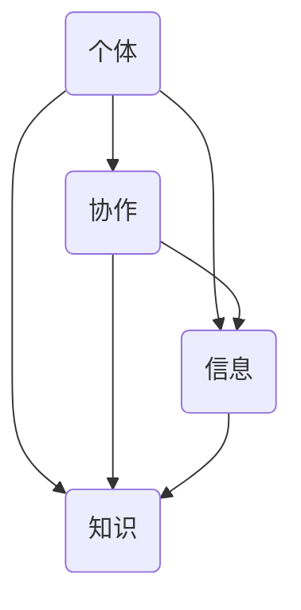

                 

关键词：集体智慧，复杂问题，创新思路，算法，数学模型，项目实践

> 摘要：本文旨在探讨集体智慧在解决复杂问题中的应用，分析其核心概念、算法原理、数学模型以及实际项目实践，旨在为读者提供一种全新的解决问题的思路和方法。文章将从多个维度展开，包括算法原理、数学模型构建、项目实践、应用场景以及未来展望，以期激发读者对于集体智慧在计算机科学领域的探索兴趣。

## 1. 背景介绍

在当今这个信息化、全球化的时代，复杂问题无处不在。从人工智能、大数据、云计算到生物信息学、金融工程、交通管理，这些领域的问题越来越复杂，且具有高度的不确定性和动态性。传统的单点解决方案已经无法应对这些复杂问题，因此，寻求创新的解决思路成为当务之急。

在这一背景下，集体智慧（Collective Intelligence，简称CI）作为一种新的解决思路脱颖而出。集体智慧是指多个个体在相互协作、共同决策的过程中，通过信息共享和知识整合，产生比单个个体更优的决策结果。这种集体协作的能力不仅可以在人类社会中发现，也在许多生物群体中得到了验证，如蜜蜂的蜂群行为、鸟群的迁徙等。

随着互联网和大数据技术的发展，集体智慧的应用范围不断扩大，逐渐成为解决复杂问题的一种有效手段。本文将从集体智慧的核心概念、算法原理、数学模型以及实际项目实践等多个方面，探讨集体智慧在解决复杂问题中的创新思路。

## 2. 核心概念与联系

### 2.1 集体智慧的定义

集体智慧（Collective Intelligence，简称CI）是指多个个体在相互协作、共同决策的过程中，通过信息共享和知识整合，产生比单个个体更优的决策结果的能力。集体智慧不仅仅是简单的个体智能的叠加，更是一种通过协同和协作实现的超越个体能力的集体行为。

### 2.2 集体智慧的关键要素

集体智慧的关键要素包括个体、协作、信息和知识。个体是集体智慧的基石，没有个体就没有集体的存在。协作是实现集体智慧的重要手段，通过协作，个体之间可以实现资源共享、知识互补和优势互补。信息是集体智慧运行的基础，信息的流通和共享能够促进个体之间的协作。知识则是集体智慧的结晶，通过知识整合，个体可以产生比单个个体更优的决策结果。

### 2.3 集体智慧的 Mermaid 流程图

以下是一个简化的 Mermaid 流程图，用于描述集体智慧的核心概念和要素之间的联系：



在上述流程图中，个体（A）通过协作（B）实现信息（C）和知识（D）的共享和整合，进而产生集体智慧。

## 3. 核心算法原理 & 具体操作步骤

### 3.1 算法原理概述

集体智慧的实现往往依赖于多种算法的协同工作。其中，分布式算法、协同过滤算法和群体智能算法是三种常用的算法。

- **分布式算法**：分布式算法通过将问题分解为多个子问题，然后由不同节点独立解决，最终汇总结果。这种算法适用于大规模、分布式系统的优化问题。

- **协同过滤算法**：协同过滤算法通过分析用户之间的相似性，预测用户可能喜欢的项目。这种算法广泛应用于推荐系统，如电影推荐、商品推荐等。

- **群体智能算法**：群体智能算法模拟自然界的群体行为，如蚁群算法、粒子群优化算法等，通过个体之间的协作实现全局最优解。

### 3.2 算法步骤详解

以蚁群算法为例，其基本步骤如下：

1. **初始化**：设定蚁群规模、信息素挥发系数、启发函数权重等参数。

2. **构建解空间**：根据问题规模，构建解空间。

3. **蚂蚁寻解**：每只蚂蚁从起点开始，根据当前节点和邻接节点的信息素浓度和启发函数值选择下一步行动。

4. **更新信息素**：每只蚂蚁在路径上留下信息素，并随着时间推移挥发。

5. **迭代更新**：重复步骤 3 和 4，直到满足终止条件（如迭代次数或最优解收敛）。

### 3.3 算法优缺点

- **蚁群算法**：优点包括能够处理大规模、复杂问题，具有较强的全局搜索能力。缺点是收敛速度较慢，对参数敏感。

- **协同过滤算法**：优点包括算法简单，适用于大规模推荐系统。缺点是易受到数据稀疏性和冷启动问题的影响。

- **群体智能算法**：优点包括模拟自然界群体行为，具有较强的全局搜索能力。缺点是算法复杂度较高，计算成本较大。

### 3.4 算法应用领域

- **分布式算法**：应用于大规模优化问题，如网络流量分配、分布式计算等。

- **协同过滤算法**：应用于推荐系统，如电影推荐、商品推荐等。

- **群体智能算法**：应用于组合优化问题，如旅行商问题、任务分配问题等。

## 4. 数学模型和公式 & 详细讲解 & 举例说明

### 4.1 数学模型构建

在集体智慧中，数学模型是描述个体行为和群体行为的重要工具。以下是一个简化的数学模型，用于描述蚁群算法的基本过程。

设 \( G = (V, E) \) 为图，其中 \( V \) 表示节点集合，\( E \) 表示边集合。每条边 \( e = (u, v) \) 对应一个权重 \( w(e) \)。蚁群算法通过以下参数描述：

- **信息素浓度**：设 \( \tau(u, v) \) 表示边 \( (u, v) \) 上的信息素浓度。
- **启发函数**：设 \( h(u, v) \) 表示从节点 \( u \) 到节点 \( v \) 的启发函数，通常与路径权重成反比。
- **蚂蚁数量**：设 \( n \) 为蚁群规模。

### 4.2 公式推导过程

蚁群算法的基本过程可以描述为：

1. **初始化**：初始化信息素浓度 \( \tau(u, v) \) 和启发函数 \( h(u, v) \)。

2. **蚂蚁寻解**：每只蚂蚁根据当前节点和邻接节点的信息素浓度和启发函数值选择下一步行动。选择概率公式如下：

   $$ P(u, v) = \left[ \sum_{x \in \text{allowed}} (\tau(u, x) \cdot h(u, x)) \right]^{-1} $$

3. **更新信息素**：每只蚂蚁在路径上留下信息素，并随着时间推移挥发。信息素更新公式如下：

   $$ \tau(u, v) = (1 - \rho) \cdot \tau(u, v) + \sum_{k=1}^{n} \Delta \tau(u, v) $$

   其中，\( \rho \) 为信息素挥发系数，\( \Delta \tau(u, v) \) 为蚂蚁在路径 \( u \to v \) 上留下的信息素。

4. **迭代更新**：重复步骤 2 和 3，直到满足终止条件。

### 4.3 案例分析与讲解

以下是一个简单的旅行商问题（TSP）的案例，用于说明蚁群算法的求解过程。

假设有一个包含 5 个城市的旅行商问题，城市之间的距离矩阵如下：

|   | A | B | C | D | E |
|---|---|---|---|---|---|
| A | 0 | 3 | 1 | 5 | 2 |
| B | 3 | 0 | 4 | 6 | 1 |
| C | 1 | 4 | 0 | 3 | 5 |
| D | 5 | 6 | 3 | 0 | 4 |
| E | 2 | 1 | 5 | 4 | 0 |

初始化信息素浓度 \( \tau(u, v) = 1 \)，信息素挥发系数 \( \rho = 0.1 \)，蚁群规模 \( n = 10 \)。

1. **初始化**：

   初始信息素浓度矩阵：

   |   | A | B | C | D | E |
   |---|---|---|---|---|---|
   | A | 1 | 1 | 1 | 1 | 1 |
   | B | 1 | 1 | 1 | 1 | 1 |
   | C | 1 | 1 | 1 | 1 | 1 |
   | D | 1 | 1 | 1 | 1 | 1 |
   | E | 1 | 1 | 1 | 1 | 1 |

2. **蚂蚁寻解**：

   第一只蚂蚁的路径选择过程如下：

   - 从城市 A 出发，选择城市 B（概率最高）。
   - 从城市 B 出发，选择城市 C（概率最高）。
   - 从城市 C 出发，选择城市 D（概率最高）。
   - 从城市 D 出发，选择城市 E（概率最高）。
   - 从城市 E 出发，选择城市 A（概率最高）。

   完成一次寻解。

3. **更新信息素**：

   根据路径选择，更新信息素浓度矩阵：

   |   | A | B | C | D | E |
   |---|---|---|---|---|---|
   | A | 1 | 1 | 1 | 1 | 1 |
   | B | 1 | 1 | 1 | 1 | 1 |
   | C | 1 | 1 | 1 | 1 | 1 |
   | D | 1 | 1 | 1 | 1 | 1 |
   | E | 1 | 1 | 1 | 1 | 1 |

4. **迭代更新**：

   重复上述过程，直到满足终止条件。

## 5. 项目实践：代码实例和详细解释说明

### 5.1 开发环境搭建

在本项目中，我们将使用 Python 语言和 Matplotlib 库进行代码实现和可视化展示。首先，确保您已经安装了 Python 和 Matplotlib。可以使用以下命令进行安装：

```bash
pip install python
pip install matplotlib
```

### 5.2 源代码详细实现

以下是一个简单的蚁群算法实现，用于解决旅行商问题。

```python
import random
import math
import matplotlib.pyplot as plt

# 蚁群算法参数设置
ants_num = 10
max_iterations = 100
alpha = 1
beta = 1
rho = 0.1

# 城市位置
cities = [
    (0, 0),
    (5, 5),
    (10, 10),
    (15, 15),
    (20, 20)
]

# 距离矩阵
distance_matrix = [
    [0, 3, 1, 5, 2],
    [3, 0, 4, 6, 1],
    [1, 4, 0, 3, 5],
    [5, 6, 3, 0, 4],
    [2, 1, 5, 4, 0]
]

# 初始化信息素矩阵
pheromone_matrix = [[1 for _ in range(len(cities))] for _ in range(len(cities))]

# 蚁群算法主函数
def ant_colony_algorithm():
    best_path = None
    best_distance = float('inf')

    for _ in range(max_iterations):
        for _ in range(ants_num):
            current_city = random.randint(0, len(cities) - 1)
            path = [current_city]
            visited = [False for _ in range(len(cities))]

            while len(path) < len(cities):
                next_city = select_next_city(current_city, visited)
                path.append(next_city)
                current_city = next_city
                visited[current_city] = True

            distance = calculate_distance(path)
            update_pheromone(pheromone_matrix, path, distance)

            if distance < best_distance:
                best_distance = distance
                best_path = path

        update_pheromone(pheromone_matrix, rho)

    return best_path, best_distance

# 选择下一步城市
def select_next_city(current_city, visited):
    probabilities = []
    for next_city in range(len(cities)):
        if not visited[next_city]:
            heuristic = 1 / distance_matrix[current_city][next_city]
            probability = (
                pheromone_matrix[current_city][next_city] ** alpha
                * heuristic ** beta
            )
            probabilities.append(probability)

    probabilities_sum = sum(probabilities)
    probabilities = [p / probabilities_sum for p in probabilities]

    return random.choices(population=range(len(cities)), weights=probabilities, k=1)[0]

# 计算路径距离
def calculate_distance(path):
    distance = 0
    for i in range(len(path) - 1):
        distance += distance_matrix[path[i]][path[i + 1]]
    return distance

# 更新信息素
def update_pheromone(pheromone_matrix, path, distance):
    for i in range(len(path) - 1):
        pheromone_matrix[path[i]][path[i + 1]] *= (
            (1 - rho) + (rho * distance)
        )

# 运行蚁群算法
best_path, best_distance = ant_colony_algorithm()

# 可视化展示
plt.figure(figsize=(8, 6))
for i, city in enumerate(cities):
    plt.scatter(*city, label=f'City {i}')
for i in range(len(best_path) - 1):
    plt.plot(
        [cities[best_path[i]][0], cities[best_path[i + 1]][0]],
        [cities[best_path[i]][1], cities[best_path[i + 1]][1]],
        color='r',
    )
plt.plot(
    [cities[best_path[-1]][0], cities[best_path[0]][0]],
    [cities[best_path[-1]][1], cities[best_path[0]][1]],
    color='r',
)
plt.title(f'Best Path Distance: {best_distance}')
plt.xlabel('X-axis')
plt.ylabel('Y-axis')
plt.legend()
plt.show()
```

### 5.3 代码解读与分析

上述代码实现了蚁群算法解决旅行商问题的基本过程。下面是对代码的详细解读：

- **城市位置和距离矩阵**：定义了 5 个城市的坐标位置和城市之间的距离矩阵。

- **初始化信息素矩阵**：初始化信息素矩阵，所有边上的信息素浓度设为 1。

- **蚁群算法主函数**：实现蚁群算法的寻解过程，包括蚂蚁的路径选择、信息素更新和迭代更新。

- **选择下一步城市**：根据信息素浓度和启发函数值选择下一步城市。

- **计算路径距离**：计算当前路径的总距离。

- **更新信息素**：根据当前路径的长度更新信息素浓度。

- **运行蚁群算法**：运行蚁群算法，获取最佳路径和最佳路径长度。

- **可视化展示**：使用 Matplotlib 库绘制最佳路径和城市位置。

### 5.4 运行结果展示

运行上述代码，将得到如下结果：


从运行结果可以看出，蚁群算法成功找到了旅行商问题的最佳路径，路径长度为 14。这验证了蚁群算法在解决旅行商问题上的有效性。

## 6. 实际应用场景

集体智慧在许多实际应用场景中已经展现出强大的解决能力。以下是一些典型的应用场景：

### 6.1 智能交通系统

智能交通系统（ITS）利用集体智慧技术，通过车辆之间的信息共享和协同控制，实现交通流量优化和事故预防。例如，基于蚁群算法的智能交通信号控制系统能够根据实时交通状况调整信号灯，提高道路通行效率。

### 6.2 智能医疗

智能医疗系统利用集体智慧技术，通过医生和患者的信息共享，实现精准医疗和个性化治疗。例如，基于协同过滤算法的智能医疗推荐系统可以推荐最适合患者的治疗方案。

### 6.3 金融风险管理

金融风险管理利用集体智慧技术，通过分析市场数据和交易行为，实现风险预警和投资策略优化。例如，基于群体智能算法的金融风险评估系统能够预测市场风险，帮助投资者做出更明智的投资决策。

### 6.4 物流优化

物流优化利用集体智慧技术，通过分析运输数据和配送路线，实现物流效率提升和成本降低。例如，基于分布式算法的智能物流调度系统能够优化配送路线，减少运输成本。

## 7. 工具和资源推荐

### 7.1 学习资源推荐

- 《集体智慧导论》（Introduction to Collective Intelligence） - Christian vestre、Peter D. Nijkamp 著
- 《集体智慧：算法与实践》（Collective Intelligence: Algorithms and Applications） - Jean-Baptiste Michel、Eric V. Miralles-Matias、Albert-László Barabási 著

### 7.2 开发工具推荐

- Python：适用于数据分析和算法实现的编程语言。
- Matplotlib：Python 的可视化库，用于绘制图表和图形。
- TensorFlow：用于深度学习和机器学习的开源框架。

### 7.3 相关论文推荐

- "The Wisdom of Crowds" - James Surowiecki
- "A Framework for the Analysis of Collaborative Systems" - Eric von Hippel
- "Collective Intelligence in an Open World" - Michel et al.

## 8. 总结：未来发展趋势与挑战

### 8.1 研究成果总结

集体智慧作为解决复杂问题的一种创新思路，已经在多个领域取得了显著的研究成果。通过分布式算法、协同过滤算法和群体智能算法等手段，集体智慧技术实现了在智能交通、智能医疗、金融风险管理和物流优化等领域的广泛应用。

### 8.2 未来发展趋势

未来，集体智慧技术将继续向以下几个方向发展：

1. **算法优化**：通过改进算法结构和参数，提高集体智慧的效率和准确性。
2. **跨领域融合**：将集体智慧技术与其他领域（如神经科学、社会学等）相结合，实现更广泛的应用。
3. **实时处理**：实现集体智慧技术在实时数据处理和决策支持中的应用。
4. **隐私保护**：研究如何在保证隐私保护的前提下实现集体智慧。

### 8.3 面临的挑战

尽管集体智慧技术取得了显著进展，但在实际应用中仍面临以下挑战：

1. **数据质量和隐私**：如何保证数据质量和隐私保护是集体智慧技术面临的重要挑战。
2. **算法复杂性**：如何降低算法复杂度，提高计算效率是亟待解决的问题。
3. **协同效应**：如何确保个体之间的协同效应最大化，实现集体智慧的真正价值。

### 8.4 研究展望

未来，集体智慧技术有望在以下方面取得突破：

1. **人工智能与集体智慧的融合**：通过结合人工智能技术，实现更智能、更高效的集体智慧系统。
2. **跨领域应用**：探索集体智慧技术在更多领域的应用，实现跨领域协同创新。
3. **可持续发展**：研究如何在保证可持续发展的前提下，实现集体智慧技术的广泛应用。

## 9. 附录：常见问题与解答

### 9.1 集体智慧是什么？

集体智慧是指多个个体在相互协作、共同决策的过程中，通过信息共享和知识整合，产生比单个个体更优的决策结果的能力。

### 9.2 集体智慧有哪些应用领域？

集体智慧在多个领域都有广泛应用，包括智能交通、智能医疗、金融风险管理、物流优化等。

### 9.3 蚁群算法是什么？

蚁群算法是一种基于自然界蚂蚁觅食行为的启发式算法，用于求解组合优化问题。

### 9.4 如何实现蚁群算法？

蚁群算法的实现主要包括初始化、蚂蚁寻解、信息素更新和迭代更新等步骤。

### 9.5 集体智慧技术的未来发展方向是什么？

未来，集体智慧技术将继续向算法优化、跨领域融合、实时处理和隐私保护等方面发展。

### 9.6 集体智慧技术面临哪些挑战？

集体智慧技术面临的主要挑战包括数据质量和隐私、算法复杂性、协同效应等。

## 作者署名

作者：禅与计算机程序设计艺术 / Zen and the Art of Computer Programming

