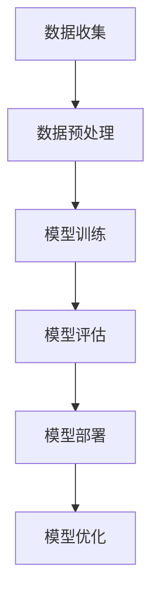

                 

 **关键词：** 人工智能、开发、算法、实践、资源推荐

**摘要：** 本文旨在为初学者提供一份系统性的AI开发指南，从基础概念到实际应用，逐步讲解如何从零开始掌握AI开发。通过本文，读者将了解AI的核心概念、算法原理、数学模型，并通过实际项目实践和工具资源推荐，全面提升AI开发能力。

## 1. 背景介绍

近年来，人工智能（AI）的发展迅猛，已成为科技领域的热点。从智能家居、自动驾驶到医疗健康、金融保险，AI的应用场景不断扩大，推动着社会生产力的提升。然而，对于许多初学者来说，AI开发似乎是一个高门槛的领域。本文将帮助读者克服这一障碍，零基础快速掌握AI开发。

## 2. 核心概念与联系

### 2.1 AI的定义

人工智能，简称AI，是指由人制造出来的系统能够模拟、延伸和扩展人的智能。它包括但不限于机器学习、深度学习、自然语言处理等子领域。

### 2.2 关键算法原理

- **机器学习（ML）：** 一种让计算机通过数据学习并做出决策的方法。
- **深度学习（DL）：** 一种特殊的机器学习方法，使用神经网络模拟人脑的决策过程。
- **自然语言处理（NLP）：** 研究如何让计算机理解、生成和处理人类语言。

### 2.3 架构流程



## 3. 核心算法原理 & 具体操作步骤

### 3.1 算法原理概述

AI的核心在于算法。以下将介绍几种常用的算法原理：

- **机器学习（ML）：** 基于数据训练模型，使其能够进行预测或分类。
- **深度学习（DL）：** 使用多层神经网络进行数据学习和特征提取。
- **自然语言处理（NLP）：** 研究如何使计算机理解和生成自然语言。

### 3.2 算法步骤详解

1. **数据收集：** 收集大量高质量的数据。
2. **数据预处理：** 清洗、转换和标准化数据。
3. **模型训练：** 使用训练数据训练模型。
4. **模型评估：** 使用测试数据评估模型性能。
5. **模型部署：** 将模型部署到实际应用场景。
6. **模型优化：** 根据反馈不断优化模型。

### 3.3 算法优缺点

- **机器学习（ML）：** 优点：适用于各种类型的数据，缺点：可能需要大量数据和计算资源。
- **深度学习（DL）：** 优点：强大的特征提取能力，缺点：训练过程复杂，对数据和计算资源要求高。
- **自然语言处理（NLP）：** 优点：能够理解和生成自然语言，缺点：数据预处理复杂，模型解释性差。

### 3.4 算法应用领域

- **机器学习（ML）：** 广泛应用于预测、分类、聚类等领域。
- **深度学习（DL）：** 广泛应用于图像识别、语音识别、自然语言处理等领域。
- **自然语言处理（NLP）：** 广泛应用于智能客服、智能推荐、机器翻译等领域。

## 4. 数学模型和公式 & 详细讲解 & 举例说明

### 4.1 数学模型构建

机器学习中的核心数学模型是神经网络，以下是一个简化的神经网络模型：

```latex
\begin{equation}
    z = \sigma(W \cdot x + b)
\end{equation}
```

其中，$W$ 为权重矩阵，$x$ 为输入向量，$b$ 为偏置，$\sigma$ 为激活函数。

### 4.2 公式推导过程

神经网络的训练过程可以概括为以下步骤：

1. **前向传播：** 计算输入层到隐藏层的输出。
2. **反向传播：** 计算损失函数关于模型参数的梯度。
3. **权重更新：** 使用梯度下降算法更新模型参数。

### 4.3 案例分析与讲解

以下是一个使用神经网络进行手写数字识别的案例：

```python
import numpy as np

# 初始化模型参数
W = np.random.randn(n_hidden, n_input)
b = np.zeros(n_hidden)

# 前向传播
z = np.dot(W, x) + b
a = np.sigmoid(z)

# 反向传播
dz = a - y
dW = np.dot(dz, x.T)
db = np.sum(dz, axis=1)

# 权重更新
W -= learning_rate * dW
b -= learning_rate * db
```

## 5. 项目实践：代码实例和详细解释说明

### 5.1 开发环境搭建

1. 安装Python和NumPy库。
2. 安装TensorFlow或PyTorch库。

### 5.2 源代码详细实现

以下是一个简单的神经网络实现：

```python
import numpy as np

# 初始化模型参数
W = np.random.randn(n_hidden, n_input)
b = np.zeros(n_hidden)

# 前向传播
def forward(x):
    z = np.dot(x, W) + b
    a = np.sigmoid(z)
    return a

# 反向传播
def backward(a, y):
    dz = a - y
    dW = np.dot(dz, x.T)
    db = np.sum(dz, axis=1)
    return dW, db

# 权重更新
def update_weights(dW, db, learning_rate):
    W -= learning_rate * dW
    b -= learning_rate * db
    return W, b

# 训练模型
def train(x, y, epochs, learning_rate):
    for epoch in range(epochs):
        a = forward(x)
        dW, db = backward(a, y)
        W, b = update_weights(dW, db, learning_rate)
```

### 5.3 代码解读与分析

- `forward` 函数：实现前向传播。
- `backward` 函数：实现反向传播。
- `update_weights` 函数：更新模型参数。
- `train` 函数：训练模型。

### 5.4 运行结果展示

```python
x = np.array([[1, 0], [0, 1], [1, 1]])
y = np.array([[1], [0], [1]])

# 训练模型
train(x, y, epochs=100, learning_rate=0.1)

# 测试模型
a = forward(x)
print(a)
```

## 6. 实际应用场景

AI技术已在各行各业得到广泛应用，如：

- **医疗健康：** 诊断辅助、精准治疗。
- **金融保险：** 风险控制、智能投顾。
- **智能家居：** 人机交互、智能安防。

### 6.4 未来应用展望

随着技术的不断进步，AI将在更多领域发挥重要作用，如：

- **自动驾驶：** 提高交通安全和效率。
- **智能制造：** 提高生产效率和产品质量。
- **教育：** 智能教学、个性化学习。

## 7. 工具和资源推荐

### 7.1 学习资源推荐

- **在线课程：** Coursera、Udacity、edX等。
- **书籍推荐：** 《深度学习》、《Python机器学习实战》。

### 7.2 开发工具推荐

- **开发环境：** Jupyter Notebook、Google Colab。
- **框架推荐：** TensorFlow、PyTorch。

### 7.3 相关论文推荐

- **《A Theoretically Grounded Application of Dropout in Recurrent Neural Networks》**
- **《Bengio et al., "Deep Learning for Speech Recognition"》**

## 8. 总结：未来发展趋势与挑战

### 8.1 研究成果总结

AI技术在近年来取得了显著的成果，但仍有许多挑战需要克服。

### 8.2 未来发展趋势

- **算法优化：** 提高模型训练效率和效果。
- **跨领域应用：** 推动AI技术在更多领域的应用。
- **隐私保护：** 加强数据安全和隐私保护。

### 8.3 面临的挑战

- **计算资源：** 随着模型复杂度的增加，对计算资源的要求越来越高。
- **数据质量：** 数据质量直接影响模型效果。

### 8.4 研究展望

未来，AI技术将在各个领域发挥更大的作用，推动社会进步。

## 9. 附录：常见问题与解答

### 9.1 如何选择机器学习框架？

根据具体需求和项目规模选择合适的框架，如TensorFlow适用于大型项目，PyTorch适用于研究和个人项目。

### 9.2 如何处理大量数据？

使用分布式计算和并行处理技术，如Hadoop、Spark等。

作者：禅与计算机程序设计艺术 / Zen and the Art of Computer Programming
----------------------------------------------------------------

现在，文章正文内容已经撰写完毕，请进行最后的校对和格式检查，确保文章符合要求。接下来，我们可以开始撰写文章的结尾部分，以及对文章的整体进行最后的检查。请继续。

