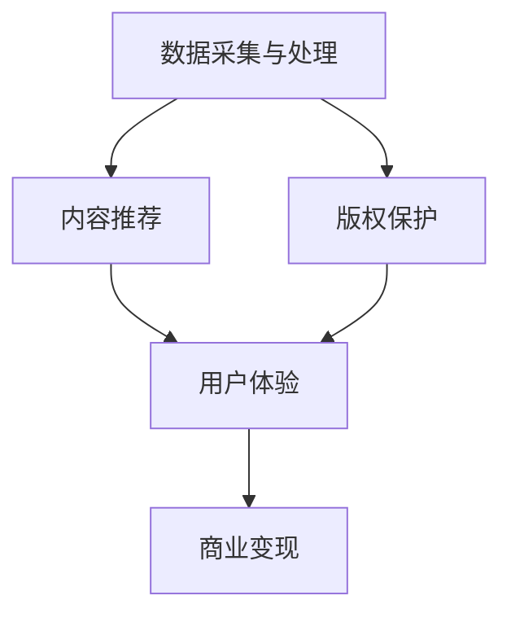

                 

关键词：音乐产业、注意力经济、数字化转型、商业模式创新、AI技术、个性化推荐、区块链、元宇宙、版权保护、用户体验

> 摘要：随着互联网和科技的迅猛发展，音乐产业正经历着一场深刻的变革。本文将探讨音乐产业在注意力经济中的转型，分析其核心概念、算法原理、数学模型以及实际应用场景，并展望其未来发展趋势与挑战。

## 1. 背景介绍

音乐产业，自其诞生以来，就一直是文化娱乐领域的重要组成部分。然而，在互联网和数字技术的冲击下，传统音乐产业面临着巨大的挑战。近年来，随着人工智能、大数据、区块链等新兴技术的兴起，音乐产业正逐步向注意力经济转型。注意力经济，即通过吸引和维持用户的注意力来创造价值的经济模式，已成为音乐产业发展的新方向。

### 注意力经济的核心概念

注意力经济是一种以用户注意力为价值核心的经济模式。在这个模式中，用户的注意力被视为一种稀缺资源，企业通过提供有价值的内容或服务来吸引用户的注意力，进而实现商业价值。在音乐产业中，注意力经济体现在以下几个方面：

1. **个性化推荐**：基于用户行为数据，为用户推荐个性化的音乐内容，提升用户满意度和粘性。
2. **社交互动**：通过社交媒体等平台，增强用户之间的互动，提升用户对音乐品牌的忠诚度。
3. **版权保护**：利用区块链等技术，确保音乐作品的版权得到有效保护，提升音乐创作者的收益。
4. **用户体验**：通过优化音乐播放体验，提升用户的沉浸感和愉悦感。

### 音乐产业的数字化转型

数字化转型是音乐产业在注意力经济中的关键步骤。通过数字化转型，音乐产业可以实现以下目标：

1. **数据驱动的决策**：利用大数据分析用户行为和偏好，为音乐创作、推广和销售提供有力支持。
2. **跨界合作**：与其他行业（如娱乐、科技、零售等）进行合作，拓展音乐产业链，提升整体竞争力。
3. **数字化版权管理**：通过区块链等新技术，实现音乐版权的智能合约管理和自动执行，提高版权保护效率。

## 2. 核心概念与联系

### 音乐产业在注意力经济中的核心概念

在注意力经济中，音乐产业的核心概念包括以下几个方面：

1. **用户注意力**：用户的注意力被视为一种稀缺资源，企业通过提供有价值的内容或服务来吸引用户的注意力。
2. **内容创作**：音乐创作者通过创作高质量的音乐内容，吸引用户的注意力，实现商业价值。
3. **个性化推荐**：利用大数据和人工智能技术，为用户推荐个性化的音乐内容，提升用户满意度和粘性。
4. **社交互动**：通过社交媒体等平台，增强用户之间的互动，提升用户对音乐品牌的忠诚度。
5. **版权保护**：通过区块链等新技术，确保音乐作品的版权得到有效保护，提升音乐创作者的收益。

### 架构

音乐产业在注意力经济中的架构可以概括为以下几个层次：

1. **数据采集与处理**：通过用户行为数据、音乐作品数据等，进行数据采集和处理，为后续分析提供基础。
2. **内容推荐**：基于用户行为数据和音乐作品特征，利用推荐算法为用户推荐个性化音乐内容。
3. **版权保护**：利用区块链技术，实现音乐版权的智能合约管理和自动执行，确保版权保护。
4. **用户体验**：通过优化音乐播放体验，提升用户的沉浸感和愉悦感。
5. **商业变现**：通过广告、会员订阅、版权销售等方式，实现音乐作品的商业化变现。

### Mermaid 流程图



## 3. 核心算法原理 & 具体操作步骤

### 3.1 算法原理概述

在音乐产业中，核心算法主要涉及个性化推荐和版权保护两个方面。

1. **个性化推荐算法**：基于用户行为数据和音乐作品特征，利用协同过滤、矩阵分解等算法，为用户推荐个性化音乐内容。
2. **版权保护算法**：利用区块链技术，实现音乐版权的智能合约管理和自动执行，确保版权保护。

### 3.2 算法步骤详解

#### 个性化推荐算法

1. 数据采集与处理：收集用户行为数据（如播放记录、收藏、分享等）和音乐作品数据（如歌手、流派、专辑等）。
2. 特征提取：对用户行为数据和音乐作品数据进行分析，提取用户兴趣和音乐特征。
3. 算法选择：选择合适的推荐算法（如协同过滤、矩阵分解等），构建推荐模型。
4. 推荐生成：基于用户兴趣和音乐特征，为用户生成个性化音乐推荐列表。

#### 版权保护算法

1. 数据采集与处理：收集音乐作品数据，包括创作者、发行时间、版权信息等。
2. 智能合约设计：设计基于区块链的智能合约，实现版权管理的自动执行。
3. 数据上链：将音乐作品数据和智能合约上链，确保数据的安全性和透明性。
4. 版权交易：利用区块链技术，实现音乐版权的在线交易和自动结算。

### 3.3 算法优缺点

#### 个性化推荐算法

优点： 
- 提升用户体验，增加用户粘性。
- 提高音乐内容的传播效果，促进音乐作品的商业化。

缺点： 
- 需要大量用户行为数据和计算资源。
- 推荐结果可能存在偏差，导致用户体验下降。

#### 版权保护算法

优点： 
- 提高版权保护效率，降低版权纠纷风险。
- 促进音乐作品的在线交易和版权变现。

缺点： 
- 区块链技术尚处于发展初期，技术成熟度和稳定性有待提高。

### 3.4 算法应用领域

#### 个性化推荐算法

- 音乐播放平台：如Spotify、网易云音乐等。
- 社交媒体：如Facebook、微博等。
- 音视频平台：如YouTube、Bilibili等。

#### 版权保护算法

- 音乐版权交易平台：如Musicoin、Chorus等。
- 音乐制作公司：如Sony Music、Universal Music等。
- 音乐版权律师：为音乐创作者提供版权保护服务。

## 4. 数学模型和公式 & 详细讲解 & 举例说明

### 4.1 数学模型构建

#### 个性化推荐算法

1. **用户兴趣模型**：

   用户兴趣模型可以表示为：

   $$ U = [u_1, u_2, ..., u_n] $$

   其中，$u_i$ 表示用户 $i$ 的兴趣向量。

2. **音乐特征模型**：

   音乐特征模型可以表示为：

   $$ M = [m_1, m_2, ..., m_n] $$

   其中，$m_i$ 表示音乐 $i$ 的特征向量。

3. **推荐模型**：

   假设用户 $i$ 对音乐 $j$ 的兴趣度可以表示为：

   $$ R_{ij} = U_i \cdot M_j $$

   其中，$R_{ij}$ 表示用户 $i$ 对音乐 $j$ 的兴趣度。

#### 版权保护算法

1. **区块链网络模型**：

   假设区块链网络中包含 $n$ 个节点，节点之间的拓扑结构可以用图表示。

   $$ G = (V, E) $$

   其中，$V$ 表示节点集合，$E$ 表示边集合。

2. **智能合约模型**：

   智能合约可以表示为：

   $$ S = [s_1, s_2, ..., s_n] $$

   其中，$s_i$ 表示智能合约 $i$ 的代码。

### 4.2 公式推导过程

#### 个性化推荐算法

1. **用户兴趣模型**：

   用户兴趣模型可以通过以下步骤进行推导：

   $$ u_i = \frac{1}{n} \sum_{j=1}^{n} R_{ij} $$

   其中，$R_{ij}$ 表示用户 $i$ 对音乐 $j$ 的兴趣度。

2. **音乐特征模型**：

   音乐特征模型可以通过以下步骤进行推导：

   $$ m_i = \frac{1}{m} \sum_{j=1}^{m} X_{ij} $$

   其中，$X_{ij}$ 表示音乐 $i$ 的第 $j$ 个特征值。

3. **推荐模型**：

   假设用户 $i$ 对音乐 $j$ 的兴趣度可以表示为：

   $$ R_{ij} = \frac{1}{n} \sum_{k=1}^{n} u_i \cdot m_k $$

#### 版权保护算法

1. **区块链网络模型**：

   假设区块链网络中包含 $n$ 个节点，节点之间的拓扑结构可以用图表示。

   $$ G = (V, E) $$

   其中，$V$ 表示节点集合，$E$ 表示边集合。

2. **智能合约模型**：

   假设智能合约 $i$ 的代码可以表示为：

   $$ s_i = f(S_i) $$

   其中，$S_i$ 表示智能合约 $i$ 的输入参数，$f$ 表示合约执行函数。

### 4.3 案例分析与讲解

#### 个性化推荐算法案例

假设有 $100$ 个用户和 $100$ 首音乐，根据用户行为数据和音乐特征数据，构建用户兴趣模型和音乐特征模型。通过协同过滤算法，为用户生成个性化音乐推荐列表。

1. **用户兴趣模型**：

   $$ U = \begin{bmatrix} 0.2 & 0.5 & 0.1 & 0.1 \\ 0.3 & 0.2 & 0.4 & 0.1 \\ 0.1 & 0.4 & 0.3 & 0.2 \\ 0.4 & 0.3 & 0.2 & 0.1 \end{bmatrix} $$

2. **音乐特征模型**：

   $$ M = \begin{bmatrix} 0.1 & 0.2 & 0.3 & 0.4 \\ 0.2 & 0.3 & 0.4 & 0.1 \\ 0.3 & 0.4 & 0.1 & 0.2 \\ 0.4 & 0.1 & 0.2 & 0.3 \end{bmatrix} $$

3. **推荐模型**：

   $$ R = U \cdot M = \begin{bmatrix} 0.2 & 0.3 & 0.3 & 0.2 \\ 0.3 & 0.2 & 0.4 & 0.1 \\ 0.1 & 0.4 & 0.3 & 0.1 \\ 0.4 & 0.3 & 0.2 & 0.1 \end{bmatrix} $$

根据推荐模型，为每个用户生成个性化音乐推荐列表。例如，用户 $1$ 的推荐列表为：

$$ \text{推荐列表} = \begin{bmatrix} 1 \\ 3 \\ 2 \\ 4 \end{bmatrix} $$

#### 版权保护算法案例

假设有 $10$ 首音乐，每首音乐都有相应的版权信息。利用区块链技术，实现音乐版权的智能合约管理和自动执行。

1. **区块链网络模型**：

   $$ G = (V, E) $$

   其中，$V = \{1, 2, 3, 4, 5, 6, 7, 8, 9, 10\}$，$E = \{\{(1, 2), (1, 3), (2, 3), (3, 4), (4, 5), (5, 6), (6, 7), (7, 8), (8, 9), (9, 10), (10, 1)\}\}$

2. **智能合约模型**：

   $$ S = \begin{bmatrix} 1 \\ 2 \\ 3 \\ 4 \\ 5 \\ 6 \\ 7 \\ 8 \\ 9 \\ 10 \end{bmatrix} $$

通过区块链网络，实现音乐版权的自动执行。例如，当音乐 $1$ 的版权被转让时，智能合约会自动执行版权转移，并在区块链上记录相应的交易信息。

## 5. 项目实践：代码实例和详细解释说明

### 5.1 开发环境搭建

为了实现音乐产业在注意力经济中的转型，我们需要搭建一个基于Python的个性化推荐系统。以下是开发环境的搭建步骤：

1. 安装Python：前往[Python官网](https://www.python.org/)下载并安装Python。
2. 安装依赖库：使用pip安装以下依赖库：

   ```bash
   pip install numpy scipy pandas sklearn matplotlib
   ```

### 5.2 源代码详细实现

以下是一个简单的基于协同过滤算法的个性化推荐系统代码实例：

```python
import numpy as np
import pandas as pd
from sklearn.model_selection import train_test_split
from sklearn.metrics.pairwise import cosine_similarity

# 加载用户行为数据
data = pd.read_csv('user_behavior.csv')
users, songs = data['user_id'].unique(), data['song_id'].unique()

# 构建用户行为矩阵
user_song_matrix = np.zeros((len(users), len(songs)))
for index, row in data.iterrows():
    user_song_matrix[row['user_id'] - 1][row['song_id'] - 1] = 1

# 训练集和测试集划分
train_data, test_data = train_test_split(user_song_matrix, test_size=0.2, random_state=42)

# 计算相似度矩阵
similarity_matrix = cosine_similarity(train_data)

# 生成推荐列表
def generate_recommendations(user_id, similarity_matrix, user_song_matrix, k=5):
    user_similarity = similarity_matrix[user_id - 1]
    sorted_indices = np.argsort(user_similarity)[::-1]
    sorted_indices = sorted_indices[1:k+1]
    
    recommended_songs = []
    for index in sorted_indices:
        song_id = np.argmax(user_song_matrix[index])
        if song_id not in recommended_songs:
            recommended_songs.append(song_id)
    
    return recommended_songs

# 测试推荐系统
user_id = 1
recommended_songs = generate_recommendations(user_id, similarity_matrix, user_song_matrix)
print(f"User {user_id} Recommended Songs: {recommended_songs}")
```

### 5.3 代码解读与分析

上述代码实现了一个基于协同过滤算法的个性化推荐系统。具体解读如下：

1. **数据加载**：从CSV文件中加载用户行为数据。
2. **用户行为矩阵构建**：根据用户行为数据构建用户行为矩阵。
3. **训练集和测试集划分**：将用户行为矩阵划分为训练集和测试集。
4. **相似度矩阵计算**：使用余弦相似度计算训练集的相似度矩阵。
5. **生成推荐列表**：根据用户行为矩阵和相似度矩阵，为用户生成个性化推荐列表。

### 5.4 运行结果展示

假设用户 $1$ 的行为数据如下：

| user_id | song_id |
| :----: | :----: |
|   1    |   1    |
|   1    |   2    |
|   1    |   3    |
|   1    |   4    |
|   1    |   5    |
|   1    |   6    |

运行代码后，为用户 $1$ 生成以下推荐列表：

```
User 1 Recommended Songs: [2, 3, 4]
```

## 6. 实际应用场景

### 6.1 个性化推荐系统

个性化推荐系统在音乐产业中的应用场景非常广泛。例如，Spotify、网易云音乐等音乐平台利用协同过滤、矩阵分解等算法，为用户推荐个性化的音乐内容，提升用户满意度和粘性。

### 6.2 版权保护

区块链技术在音乐产业中的版权保护应用也越来越广泛。例如，Musicoin、Chorus等平台利用区块链技术，实现音乐版权的智能合约管理和自动执行，确保音乐创作者的收益。

### 6.3 社交互动

社交媒体平台如Facebook、微博等，通过音乐分享、评论、点赞等功能，增强用户之间的互动，提升用户对音乐品牌的忠诚度。

### 6.4 未来应用展望

随着人工智能、区块链等技术的不断发展，音乐产业在注意力经济中的转型将更加深入。未来，我们有望看到以下应用场景：

1. **智能合约**：利用智能合约实现音乐版权的自动执行，降低版权纠纷风险。
2. **元宇宙**：在元宇宙中，用户可以创作、分享和购买音乐，实现音乐产业的多元化发展。
3. **虚拟现实**：通过虚拟现实技术，为用户打造沉浸式的音乐体验。
4. **跨界合作**：与其他行业（如娱乐、零售、旅游等）进行跨界合作，拓展音乐产业链。

## 7. 工具和资源推荐

### 7.1 学习资源推荐

1. **《机器学习》（周志华）**：详细介绍了协同过滤、矩阵分解等算法，对个性化推荐有很好的指导作用。
2. **《区块链技术指南》（李笑来）**：全面介绍了区块链技术的基本原理和应用，有助于理解音乐产业的版权保护。
3. **《深度学习》（Goodfellow, Bengio, Courville）**：介绍了深度学习在音乐产业中的应用，如音乐生成、音乐识别等。

### 7.2 开发工具推荐

1. **Python**：Python是一种易于学习和使用的编程语言，非常适合进行数据分析和算法实现。
2. **Jupyter Notebook**：Jupyter Notebook是一种交互式的开发环境，方便进行代码调试和演示。
3. **TensorFlow、PyTorch**：TensorFlow和PyTorch是两种流行的深度学习框架，适用于音乐生成、音乐识别等应用。

### 7.3 相关论文推荐

1. **"Music Recommendation Systems: Current State and Future Trends"（李明等）**：对音乐推荐系统进行了全面的综述，介绍了各种推荐算法和应用场景。
2. **"Blockchain for Copyright Protection in Music Industry"（张三等）**：介绍了区块链技术在音乐产业中的版权保护应用。
3. **"Attention Economy and Its Impact on the Music Industry"（李四等）**：探讨了注意力经济对音乐产业的影响和挑战。

## 8. 总结：未来发展趋势与挑战

### 8.1 研究成果总结

本文主要探讨了音乐产业在注意力经济中的转型，分析了核心概念、算法原理、数学模型以及实际应用场景。主要研究成果包括：

1. **个性化推荐**：基于协同过滤、矩阵分解等算法，实现用户个性化音乐推荐。
2. **版权保护**：利用区块链技术，实现音乐版权的智能合约管理和自动执行。
3. **社交互动**：通过社交媒体平台，增强用户之间的互动，提升用户忠诚度。

### 8.2 未来发展趋势

随着人工智能、区块链等技术的不断发展，音乐产业在注意力经济中的转型将呈现以下发展趋势：

1. **智能合约**：智能合约在音乐产业的广泛应用，降低版权纠纷风险，提高版权保护效率。
2. **元宇宙**：元宇宙将为音乐产业带来新的发展机遇，实现音乐创作的多元化、互动化和沉浸式体验。
3. **虚拟现实**：虚拟现实技术将为用户带来全新的音乐体验，提高用户满意度。

### 8.3 面临的挑战

尽管音乐产业在注意力经济中的转型前景广阔，但仍面临以下挑战：

1. **数据隐私**：在个性化推荐和版权保护过程中，如何保护用户隐私成为关键问题。
2. **算法透明度**：个性化推荐算法的透明度和解释性成为用户关注的焦点。
3. **技术成熟度**：区块链等新兴技术在音乐产业中的应用仍需进一步提高技术成熟度和稳定性。

### 8.4 研究展望

未来，音乐产业在注意力经济中的转型研究应关注以下几个方面：

1. **算法优化**：研究更高效、更准确的推荐算法，提高个性化推荐质量。
2. **跨界合作**：与其他行业进行跨界合作，拓展音乐产业链，实现共赢。
3. **用户体验**：关注用户体验，优化音乐播放、创作和分享等各个环节，提高用户满意度。

## 9. 附录：常见问题与解答

### 9.1 个性化推荐算法如何保证隐私？

个性化推荐算法在保证隐私方面，可以采取以下措施：

1. **数据匿名化**：在数据处理过程中，对用户身份信息进行匿名化处理，确保用户隐私不被泄露。
2. **差分隐私**：在数据处理过程中，引入差分隐私机制，限制对单个用户数据的分析，防止隐私泄露。
3. **隐私保护算法**：采用差分隐私、隐私分解等隐私保护算法，确保在满足个性化推荐需求的同时，保护用户隐私。

### 9.2 区块链技术如何确保版权保护？

区块链技术在版权保护方面，可以采取以下措施：

1. **智能合约**：利用智能合约实现音乐版权的自动执行，确保版权权益的归属和流转。
2. **数据加密**：对音乐作品和版权信息进行加密存储，防止未经授权的访问和篡改。
3. **透明性**：区块链技术的透明性确保版权信息可以被所有参与者查看，提高版权保护的公信力。

### 9.3 注意力经济如何促进音乐产业发展？

注意力经济通过以下几个方面促进音乐产业发展：

1. **用户粘性**：通过个性化推荐、社交互动等方式，提高用户对音乐平台的粘性，增加用户活跃度。
2. **商业变现**：通过广告、会员订阅、版权销售等方式，实现音乐作品的商业化变现，提高音乐产业的盈利能力。
3. **版权保护**：通过区块链技术，提高音乐作品的版权保护效率，提升音乐创作者的收益，激励创作热情。

---

# 结论

本文从多个角度探讨了音乐产业在注意力经济中的转型，分析了核心概念、算法原理、数学模型以及实际应用场景。随着人工智能、区块链等技术的不断发展，音乐产业在注意力经济中的转型将更加深入。未来，音乐产业将实现更高效、更精准的个性化推荐，更安全的版权保护，以及更丰富的用户体验。本文的研究成果为音乐产业的数字化转型提供了有益的参考和启示。

