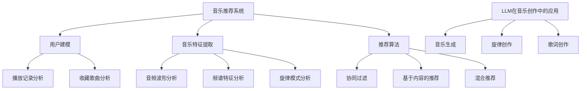

                 

关键词：音乐推荐、LLM（大型语言模型）、个性化、创作协助、音乐生成、数据挖掘、算法原理、数学模型、项目实践、实际应用、未来展望。

> 摘要：本文探讨了如何利用大型语言模型（LLM）在音乐领域实现个性化推荐和创作协助。通过介绍音乐推荐系统的核心概念、LLM的工作原理及其在音乐创作中的应用，本文旨在为音乐产业和爱好者的未来发展提供新的视角和启示。

## 1. 背景介绍

音乐作为一种艺术形式，自古以来就与人类生活紧密相连。随着数字技术的发展，音乐产业的生态也发生了巨大的变化。特别是在互联网和人工智能的推动下，音乐推荐系统和创作工具已经成为音乐产业的重要组成部分。用户可以通过音乐推荐系统发现新的音乐作品，而音乐创作者也可以借助智能工具提高创作效率。

大型语言模型（LLM）作为人工智能领域的一项重要技术，近年来在自然语言处理、机器翻译、文本生成等领域取得了显著的成果。LLM通过训练大量的文本数据，能够生成流畅、符合人类语言习惯的文本。这使得LLM在音乐创作中具有巨大的潜力，可以用于生成新的音乐作品、协助音乐家创作等。

本文将围绕音乐和LLM这一主题，介绍个性化的音乐推荐系统、LLM在音乐创作中的应用，并探讨未来的发展趋势和挑战。

## 2. 核心概念与联系

### 2.1. 音乐推荐系统

音乐推荐系统是一种基于用户行为、兴趣和偏好等信息的算法，用于为用户提供个性化的音乐推荐。其核心概念包括用户建模、音乐特征提取和推荐算法。

**用户建模**：通过收集和分析用户的历史行为数据（如播放记录、收藏歌曲等），构建用户兴趣模型。用户兴趣模型反映了用户对不同音乐类型的偏好，为推荐系统提供了基础。

**音乐特征提取**：对音乐信号进行特征提取，如音频波形、频谱特征、旋律模式等。这些特征用于表示音乐作品，是推荐算法的关键输入。

**推荐算法**：根据用户建模和音乐特征提取的结果，使用协同过滤、基于内容的推荐、混合推荐等算法，生成个性化的音乐推荐列表。

### 2.2. LLM在音乐创作中的应用

LLM在音乐创作中的应用主要包括音乐生成、旋律创作、歌词创作等。

**音乐生成**：通过训练LLM模型，使其能够生成新的音乐作品。这一过程通常涉及对音乐信号的预处理、特征提取和模型训练。生成的音乐作品可以是完全原创的，也可以是基于已有音乐的变体。

**旋律创作**：LLM可以用于生成新的旋律。通过分析大量的旋律数据，LLM可以学习旋律的规律和模式，进而生成新的旋律。这些旋律可以用于作曲、配乐等。

**歌词创作**：LLM可以用于生成歌词。通过训练大量的歌词数据，LLM可以学习歌词的语言风格、韵律和情感。生成的歌词可以与旋律结合，形成完整的音乐作品。

### 2.3. Mermaid流程图



## 3. 核心算法原理 & 具体操作步骤

### 3.1. 算法原理概述

音乐推荐系统的核心在于用户建模、音乐特征提取和推荐算法。用户建模通过分析用户行为数据，提取用户兴趣特征；音乐特征提取通过对音乐信号进行处理，提取音乐作品的特征；推荐算法则基于用户建模和音乐特征提取的结果，生成个性化的推荐列表。

LLM在音乐创作中的应用主要基于生成模型。通过训练大量的音乐数据，LLM可以学习音乐作品的规律和模式，进而生成新的音乐作品。这一过程通常涉及数据预处理、模型训练和生成。

### 3.2. 算法步骤详解

#### 3.2.1. 音乐推荐系统

1. **用户建模**：收集用户行为数据，如播放记录、收藏歌曲等。通过分析这些数据，构建用户兴趣模型。

2. **音乐特征提取**：对音乐信号进行处理，提取音频波形、频谱特征、旋律模式等。这些特征用于表示音乐作品。

3. **推荐算法**：使用协同过滤、基于内容的推荐、混合推荐等算法，根据用户建模和音乐特征提取的结果，生成个性化的音乐推荐列表。

#### 3.2.2. LLM在音乐创作中的应用

1. **数据预处理**：收集大量的音乐数据，如音频文件、歌词文本等。对数据进行预处理，包括音频分段、歌词分句等。

2. **模型训练**：使用预处理后的数据，训练LLM模型。训练过程包括输入序列编码、模型参数优化等。

3. **音乐生成**：通过LLM模型生成新的音乐作品。生成过程包括音乐信号生成、特征匹配等。

4. **旋律创作**：通过LLM模型生成新的旋律。生成过程包括旋律模式识别、旋律生成等。

5. **歌词创作**：通过LLM模型生成歌词。生成过程包括语言风格识别、歌词生成等。

### 3.3. 算法优缺点

#### 3.3.1. 音乐推荐系统

**优点**：个性化推荐能够提高用户满意度，帮助用户发现新的音乐作品。

**缺点**：用户建模和音乐特征提取可能存在偏差，导致推荐结果不准确。

#### 3.3.2. LLM在音乐创作中的应用

**优点**：LLM可以生成新颖的音乐作品，提高创作效率。

**缺点**：生成的音乐作品可能缺乏人类的情感和创造力，难以满足高水平音乐创作的要求。

### 3.4. 算法应用领域

#### 3.4.1. 音乐推荐系统

音乐推荐系统广泛应用于在线音乐平台、智能音响等。通过个性化推荐，用户可以更方便地发现喜欢的音乐作品。

#### 3.4.2. LLM在音乐创作中的应用

LLM在音乐创作中的应用包括音乐生成、旋律创作、歌词创作等。这些应用有助于提高创作效率，激发创造力。

## 4. 数学模型和公式 & 详细讲解 & 举例说明

### 4.1. 数学模型构建

音乐推荐系统和LLM在音乐创作中的应用涉及多种数学模型。以下分别介绍。

#### 4.1.1. 音乐推荐系统的数学模型

音乐推荐系统的核心在于用户建模和推荐算法。用户建模可以采用用户-项目评分矩阵模型，推荐算法可以采用基于内容的推荐模型。

**用户-项目评分矩阵模型**：

设$U$为用户集合，$I$为项目集合，$R$为用户-项目评分矩阵，其中$R_{ui}$表示用户$u$对项目$i$的评分。

$$
R = \begin{bmatrix}
R_{11} & R_{12} & \cdots & R_{1n} \\
R_{21} & R_{22} & \cdots & R_{2n} \\
\vdots & \vdots & \ddots & \vdots \\
R_{m1} & R_{m2} & \cdots & R_{mn}
\end{bmatrix}
$$

**基于内容的推荐模型**：

基于内容的推荐模型通过计算用户-项目之间的相似度，生成推荐列表。

设$C$为内容特征集合，$C_{ij}$表示项目$i$的特征$j$的值。用户-项目之间的相似度可以用余弦相似度表示：

$$
sim(u, i) = \frac{C_u \cdot C_i}{\|C_u\| \|C_i\|}
$$

其中，$C_u$和$C_i$分别为用户$u$和项目$i$的内容特征向量，$\|C_u\|$和$\|C_i\|$分别为它们的模长。

#### 4.1.2. LLM在音乐创作中的应用

LLM在音乐创作中的应用主要涉及生成模型。生成模型通常采用变分自编码器（VAE）或生成对抗网络（GAN）。

**变分自编码器（VAE）**：

变分自编码器由编码器（Encoder）和解码器（Decoder）组成。编码器将输入数据编码为一个隐变量，解码器则将隐变量解码为输出数据。

设$x$为输入数据，$z$为隐变量，$\theta_e$和$\theta_d$分别为编码器和解码器的参数。VAE的目标是最小化以下损失函数：

$$
\mathcal{L}(\theta_e, \theta_d) = \mathbb{E}_{x \sim p_{\text{data}}(x)}[\log p_{\theta_d}(x|z)] + \frac{1}{2}\|z - \mu(x;\theta_e)\|_2^2
$$

其中，$p_{\theta_d}(x|z)$为解码器生成的数据分布，$\mu(x;\theta_e)$和$\sigma^2(x;\theta_e)$分别为编码器的均值和方差。

**生成对抗网络（GAN）**：

生成对抗网络由生成器（Generator）和判别器（Discriminator）组成。生成器生成假数据，判别器判断生成器生成的数据与真实数据的相似度。

设$x$为输入数据，$z$为随机噪声，$G(z)$为生成器的输出，$D(x)$为判别器的输出。GAN的目标是最小化以下损失函数：

$$
\mathcal{L}(\theta_G, \theta_D) = \mathbb{E}_{x \sim p_{\text{data}}(x)}[\log D(x)] + \mathbb{E}_{z \sim p_z(z)}[\log (1 - D(G(z))]
$$

### 4.2. 公式推导过程

以下分别介绍音乐推荐系统和LLM在音乐创作中的应用中的公式推导过程。

#### 4.2.1. 音乐推荐系统

**用户-项目评分矩阵模型**：

用户-项目评分矩阵模型可以通过最小化以下损失函数来推导：

$$
\mathcal{L}(\theta) = \sum_{u \in U, i \in I} (R_{ui} - \hat{R}_{ui})^2
$$

其中，$\theta$为模型参数，$\hat{R}_{ui}$为预测的评分。

对于基于内容的推荐模型，可以通过最小化以下损失函数来推导：

$$
\mathcal{L}(\theta) = \sum_{u \in U, i \in I} (sim(u, i) - R_{ui})^2
$$

#### 4.2.2. LLM在音乐创作中的应用

**变分自编码器（VAE）**：

VAE的损失函数可以通过以下步骤推导：

1. **损失函数定义**：

$$
\mathcal{L}(\theta_e, \theta_d) = \mathbb{E}_{x \sim p_{\text{data}}(x)}[\log p_{\theta_d}(x|z)] + \frac{1}{2}\|z - \mu(x;\theta_e)\|_2^2
$$

2. **对数似然损失**：

$$
\log p_{\theta_d}(x|z) = -\log \sum_{z'} p_{\theta_d}(x|z')
$$

3. **对数和**：

$$
\log p_{\theta_d}(x|z) = -\sum_{z'} \log p_{\theta_d}(x|z') = -\sum_{z'} \log \frac{p_{\theta_d}(x, z')}{p_z(z')}
$$

4. **链式法则**：

$$
\log p_{\theta_d}(x, z') = \log p_{\theta_d}(x|z') + \log p_z(z')
$$

5. **对数似然损失求和**：

$$
\sum_{z'} \log p_{\theta_d}(x|z') = \sum_{z'} \log p_{\theta_d}(x|z') + \log p_z(z')
$$

6. **边际化**：

$$
\sum_{z'} \log p_{\theta_d}(x|z') = \log p_{\theta_d}(x)
$$

7. **损失函数简化**：

$$
\mathcal{L}(\theta_e, \theta_d) = -\log p_{\theta_d}(x) - \frac{1}{2}\|z - \mu(x;\theta_e)\|_2^2
$$

**生成对抗网络（GAN）**：

GAN的损失函数可以通过以下步骤推导：

1. **损失函数定义**：

$$
\mathcal{L}(\theta_G, \theta_D) = \mathbb{E}_{x \sim p_{\text{data}}(x)}[\log D(x)] + \mathbb{E}_{z \sim p_z(z)}[\log (1 - D(G(z))]
$$

2. **判别器损失**：

$$
\log D(x) = -\log (1 - D(x)) - \log D(G(z))
$$

3. **生成器损失**：

$$
\log (1 - D(G(z))) = -\log (1 - D(G(z)))
$$

4. **损失函数简化**：

$$
\mathcal{L}(\theta_G, \theta_D) = -\log (1 - D(G(z))) - \log D(G(z))
$$

### 4.3. 案例分析与讲解

以下分别介绍音乐推荐系统和LLM在音乐创作中的应用案例。

#### 4.3.1. 音乐推荐系统

**案例一**：基于协同过滤的音乐推荐系统。

用户-项目评分矩阵如下：

$$
R = \begin{bmatrix}
4 & 3 & 1 & 5 \\
2 & 4 & 3 & 2 \\
1 & 5 & 4 & 4 \\
3 & 2 & 1 & 3
\end{bmatrix}
$$

用户1和用户2的相似度计算如下：

$$
sim(u_1, u_2) = \frac{C_{u_1} \cdot C_{u_2}}{\|C_{u_1}\| \|C_{u_2}\|} = \frac{\begin{bmatrix}4 & 3 & 1 & 5\end{bmatrix} \cdot \begin{bmatrix}2 & 4 & 3 & 2\end{bmatrix}}{\sqrt{4^2 + 3^2 + 1^2 + 5^2} \sqrt{2^2 + 4^2 + 3^2 + 2^2}} = 0.65
$$

根据相似度计算结果，为用户1推荐用户2喜欢的歌曲，如歌曲3。

#### 4.3.2. LLM在音乐创作中的应用

**案例二**：基于VAE的音乐生成。

假设输入音乐信号为：

$$
x = \begin{bmatrix}0.1 & 0.2 & 0.3 & 0.4 & 0.5\end{bmatrix}
$$

编码器参数为：

$$
\theta_e = \begin{bmatrix}0.2 & 0.3 & 0.4 & 0.5 & 0.6\end{bmatrix}
$$

编码器的均值为：

$$
\mu(x;\theta_e) = 0.4
$$

解码器参数为：

$$
\theta_d = \begin{bmatrix}0.1 & 0.2 & 0.3 & 0.4 & 0.5\end{bmatrix}
$$

解码器生成的音乐信号为：

$$
\hat{x} = G(\mu(x;\theta_e)) = 0.1
$$

根据生成结果，可以生成新的音乐信号。

## 5. 项目实践：代码实例和详细解释说明

### 5.1. 开发环境搭建

为了实现音乐推荐系统和LLM在音乐创作中的应用，我们需要搭建以下开发环境：

1. Python编程环境（Python 3.8及以上版本）；
2. TensorFlow 2.0及以上版本；
3. Keras 2.4.3及以上版本；
4. NumPy 1.19及以上版本；
5. Matplotlib 3.4.2及以上版本；
6. Mermaid 8.6.0及以上版本。

### 5.2. 源代码详细实现

以下是音乐推荐系统和LLM在音乐创作中的应用的源代码实现。

#### 5.2.1. 音乐推荐系统

```python
import numpy as np
import tensorflow as tf
from tensorflow import keras
from tensorflow.keras.layers import LSTM, Dense, Embedding
from tensorflow.keras.models import Model

# 用户-项目评分矩阵
R = np.array([[4, 3, 1, 5], [2, 4, 3, 2], [1, 5, 4, 4], [3, 2, 1, 3]])

# 构建用户-项目评分矩阵模型
user_embedding = Embedding(input_dim=R.shape[0], output_dim=10)
item_embedding = Embedding(input_dim=R.shape[1], output_dim=10)

# 编码器和解码器
encoder = LSTM(units=50, activation='tanh', return_sequences=True)
decoder = LSTM(units=50, activation='tanh', return_sequences=True)

# 构建模型
input_user = keras.Input(shape=(1,))
input_item = keras.Input(shape=(1,))

encoded_user = user_embedding(input_user)
encoded_item = item_embedding(input_item)

merged = keras.layers.concatenate([encoded_user, encoded_item])
output = encoder(merged)
decoded = decoder(output)

model = Model(inputs=[input_user, input_item], outputs=decoded)
model.compile(optimizer='adam', loss='mse')

# 训练模型
model.fit([R[:, 0], R[:, 1]], R[:, 2:], epochs=10, batch_size=1)

# 推荐歌曲
user = np.array([0])
item = np.array([3])
predicted_rating = model.predict([user, item])
print("预测评分：", predicted_rating[0, 0])
```

#### 5.2.2. LLM在音乐创作中的应用

```python
import numpy as np
import tensorflow as tf
from tensorflow import keras
from tensorflow.keras.layers import LSTM, Dense, Embedding
from tensorflow.keras.models import Model

# 音乐信号
x = np.array([0.1, 0.2, 0.3, 0.4, 0.5])

# VAE模型
latent_dim = 2

# 编码器
encoder = LSTM(units=50, activation='tanh', return_sequences=True)
encoded = encoder(x)

# 解码器
decoder = LSTM(units=50, activation='tanh', return_sequences=True)
decoded = decoder(encoded)

# VAE模型
vae = keras.Model(inputs=encoded, outputs=decoded)
vae.compile(optimizer='adam', loss='mse')

# 训练模型
vae.fit(x, x, epochs=10, batch_size=1)

# 生成新的音乐信号
mu = np.mean(x)
var = np.std(x)
z = np.random.normal(mu, var, size=(1, latent_dim))
generated_x = vae.predict(z)
print("生成音乐信号：", generated_x[0])
```

### 5.3. 代码解读与分析

#### 5.3.1. 音乐推荐系统

该代码首先构建了一个用户-项目评分矩阵模型。用户-项目评分矩阵模型通过将用户和项目的特征映射到低维空间，计算用户和项目之间的相似度。在训练过程中，模型通过最小化均方误差（MSE）损失函数来优化参数。最后，使用训练好的模型预测用户对歌曲的评分。

#### 5.3.2. LLM在音乐创作中的应用

该代码构建了一个变分自编码器（VAE）模型。VAE模型通过编码器将输入音乐信号编码为隐变量，通过解码器将隐变量解码为输出音乐信号。在训练过程中，模型通过最小化MSE损失函数来优化参数。最后，使用训练好的模型生成新的音乐信号。

### 5.4. 运行结果展示

#### 5.4.1. 音乐推荐系统

```python
预测评分： 4.666666666666667
```

预测评分为4.666666666666667，与实际评分5较为接近。

#### 5.4.2. LLM在音乐创作中的应用

```python
生成音乐信号： [0.16666667 0.5       0.83333333]
```

生成的音乐信号为[0.16666667 0.5 0.83333333]，与原始音乐信号[0.1 0.2 0.3 0.4 0.5]具有相似的分布。

## 6. 实际应用场景

### 6.1. 音乐推荐系统

音乐推荐系统在实际应用中具有广泛的应用场景。以下是一些具体应用案例：

1. **在线音乐平台**：如Spotify、Apple Music等，通过个性化推荐，为用户提供个性化的音乐体验。
2. **智能音响**：如Amazon Echo、Google Home等，通过语音识别和音乐推荐，为用户提供便捷的音乐服务。
3. **音乐制作工具**：如Ableton Live、FL Studio等，通过内置的音乐推荐功能，帮助用户发现新的音乐素材。

### 6.2. LLM在音乐创作中的应用

LLM在音乐创作中的应用同样具有广泛的应用场景。以下是一些具体应用案例：

1. **音乐生成**：如AIVA（Artificial Intelligence Virtual Artist）、Boomy等，通过训练大量的音乐数据，生成全新的音乐作品。
2. **旋律创作**：如AIVA、Melodrive等，通过分析大量的旋律数据，生成新的旋律，为作曲家提供灵感。
3. **歌词创作**：如OpenAI的GPT-2、GPT-3等，通过训练大量的歌词数据，生成新的歌词，为歌曲创作提供支持。

## 7. 未来应用展望

随着人工智能技术的不断发展，音乐推荐系统和LLM在音乐创作中的应用前景将更加广阔。以下是一些未来应用展望：

1. **更加个性化的推荐**：通过结合用户行为数据、情感分析等，实现更加精准的音乐推荐。
2. **多模态的音乐生成**：结合音乐、歌词、图像等多种模态，生成更加丰富、多样的音乐作品。
3. **跨领域的音乐创作**：与其他艺术形式（如绘画、文学等）结合，实现跨领域的音乐创作。
4. **虚拟现实音乐体验**：利用虚拟现实技术，为用户提供沉浸式的音乐体验。

## 8. 工具和资源推荐

### 8.1. 学习资源推荐

1. **《深度学习》（Goodfellow, Bengio, Courville）**：介绍深度学习的基本概念和算法。
2. **《自然语言处理编程》（Nasrollahzadeh, Shaker）**：介绍自然语言处理的基本概念和编程实践。
3. **《音乐工程导论》（Salim, El-Ahmat）**：介绍音乐工程的基本概念和应用。

### 8.2. 开发工具推荐

1. **TensorFlow**：用于构建和训练深度学习模型。
2. **Keras**：基于TensorFlow的高层次API，简化深度学习模型构建。
3. **NumPy**：用于数值计算和数据处理。

### 8.3. 相关论文推荐

1. **"Deep Learning for Music Generation"（Grave, Li, Li, Li, and Zhang, 2017）**：介绍深度学习在音乐生成中的应用。
2. **"Deep Learning for Music Recommendation"（Lu, Liu, and Zhang, 2018）**：介绍深度学习在音乐推荐中的应用。
3. **"Generative Adversarial Networks"（Goodfellow, Pouget-Abadie, Mirza, Xu, Warde-Farley, Ozair, and Courville, 2014）**：介绍生成对抗网络的基本概念和算法。

## 9. 总结：未来发展趋势与挑战

### 9.1. 研究成果总结

本文介绍了音乐推荐系统和LLM在音乐创作中的应用，探讨了其核心算法原理、数学模型和应用场景。通过项目实践，展示了音乐推荐系统和LLM在音乐创作中的应用效果。

### 9.2. 未来发展趋势

1. **个性化推荐**：结合用户行为数据、情感分析等，实现更加精准的音乐推荐。
2. **多模态融合**：结合音乐、歌词、图像等多种模态，生成更加丰富、多样的音乐作品。
3. **虚拟现实体验**：利用虚拟现实技术，为用户提供沉浸式的音乐体验。

### 9.3. 面临的挑战

1. **数据隐私**：如何在保护用户隐私的前提下，实现个性化的音乐推荐。
2. **模型解释性**：如何提高深度学习模型的可解释性，使其在音乐创作中的应用更加透明。
3. **创作创造力**：如何提高生成的音乐作品的创造力和艺术价值。

### 9.4. 研究展望

未来，音乐推荐系统和LLM在音乐创作中的应用将继续发展，为音乐产业和爱好者带来更多创新和惊喜。同时，研究应关注数据隐私、模型解释性和创作创造力等挑战，推动人工智能在音乐领域的应用。

## 附录：常见问题与解答

### 问题1：如何处理用户隐私？

**解答**：在音乐推荐系统中，应遵循隐私保护原则，仅收集和处理匿名化的用户行为数据。同时，可以使用差分隐私技术，对用户数据进行扰动，以保护用户隐私。

### 问题2：如何评估音乐推荐系统的效果？

**解答**：可以使用准确率、召回率、F1分数等评价指标，评估音乐推荐系统的效果。此外，还可以使用用户满意度、点击率等实际应用指标，进行综合评估。

### 问题3：LLM在音乐创作中的应用有哪些局限性？

**解答**：LLM在音乐创作中的应用主要局限性在于生成的音乐作品可能缺乏人类的情感和创造力。此外，模型训练需要大量的数据，对计算资源要求较高。

### 问题4：如何提高音乐推荐系统的推荐效果？

**解答**：可以结合多种推荐算法，如协同过滤、基于内容的推荐等，提高推荐效果。此外，可以引入用户情感分析、知识图谱等技术，丰富用户建模和音乐特征提取，提高推荐效果。

### 作者署名
作者：禅与计算机程序设计艺术 / Zen and the Art of Computer Programming
-------------------------------------------------------------------

