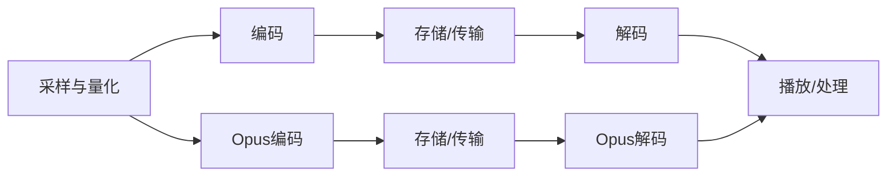

                 

关键词：音频编解码，MP3，Opus，音频质量，数据压缩，音频处理

> 摘要：本文将深入探讨音频编解码技术的发展历程，从早期的MP3格式到当今流行的Opus格式，分析其原理、优缺点以及在不同应用场景下的适用性。

## 1. 背景介绍

音频编解码技术是数字音频处理的核心技术，它涉及到音频信号从原始数据到压缩编码，再从压缩编码到解码还原的全过程。在数字音频领域，编解码技术的进步极大地推动了音频存储、传输和播放技术的发展。

早期，音频编解码主要关注的是如何将音频信号压缩到更小的数据量，以便更高效地存储和传输。随着计算机技术的不断进步，编解码技术逐渐从简单的有损压缩发展到支持多种音频格式的高效编解码。

MP3格式（MPEG-1 Audio Layer III）是第一个在互联网上广泛使用的音频编解码格式。它的诞生标志着音频编解码技术进入了一个新的时代。随着互联网的普及，MP3迅速成为了数字音乐的代名词。然而，随着音频质量要求的提高和多媒体应用的发展，MP3在音频编解码领域逐渐暴露出了一些局限性。

为了解决这些问题，新的音频编解码技术不断涌现。Opus是一种高效、灵活的音频编解码格式，它结合了先前的编解码技术的优点，并在许多方面进行了改进。本文将重点介绍MP3和Opus这两种音频编解码技术，探讨它们的工作原理、优缺点以及在不同应用场景下的适用性。

## 2. 核心概念与联系

### 2.1 音频编解码的基本概念

音频编解码（Audio Coding and Decoding）是指将音频信号转换成压缩格式（编码）和解压压缩格式（解码）的过程。编解码过程通常涉及以下几个关键概念：

- **采样率（Sampling Rate）**：音频信号在时间上的采样频率，通常以Hz（赫兹）为单位。较高的采样率可以捕捉更多的音频细节，但也会增加数据量。
- **量化（Quantization）**：将连续的音频信号转换为离散的数字信号，通过限制信号值的精度来实现。量化位数越高，信号质量越好，但数据量也越大。
- **编码（Coding）**：将数字化的音频信号转换为压缩格式，以减小数据量。编码过程中通常采用有损压缩，即牺牲一部分信号质量以换取更高的压缩效率。
- **解码（Decoding）**：将压缩的音频信号还原为原始的数字信号，以便播放或进一步处理。

### 2.2 音频编解码的架构

音频编解码的架构通常分为以下几个步骤：

1. **采样和量化**：将模拟音频信号转换为数字信号。
2. **编码**：对数字音频信号进行压缩编码，生成压缩数据流。
3. **存储或传输**：将压缩数据存储在媒介上或通过网络传输。
4. **解码**：对压缩数据流进行解压缩，还原为数字音频信号。
5. **播放或处理**：播放数字音频信号或在数字音频上进行进一步处理。

### 2.3 MP3与Opus的编解码流程

**MP3的编解码流程**：

1. **采样和量化**：原始音频信号经过采样和量化转换为数字信号。
2. **MPEG-1 Audio Layer III编码**：数字信号通过MPEG-1 Audio Layer III编码器进行压缩编码，生成MP3数据流。
3. **存储或传输**：MP3数据流存储在媒介上或通过网络传输。
4. **MPEG-1 Audio Layer III解码**：接收到的MP3数据流通过MPEG-1 Audio Layer III解码器解压缩，还原为数字音频信号。
5. **播放或处理**：数字音频信号播放或进行进一步处理。

**Opus的编解码流程**：

1. **采样和量化**：原始音频信号经过采样和量化转换为数字信号。
2. **Opus编码**：数字信号通过Opus编码器进行压缩编码，生成Opus数据流。
3. **存储或传输**：Opus数据流存储在媒介上或通过网络传输。
4. **Opus解码**：接收到的Opus数据流通过Opus解码器解压缩，还原为数字音频信号。
5. **播放或处理**：数字音频信号播放或进行进一步处理。

### 2.4 Mermaid流程图

下面是一个简化的Mermaid流程图，展示了MP3与Opus的编解码流程：



## 3. 核心算法原理 & 具体操作步骤

### 3.1 算法原理概述

音频编解码的核心算法涉及有损压缩和无损压缩技术。有损压缩通过丢弃一些音频信号的信息来减小数据量，而无损压缩则试图在不丢失任何信息的情况下压缩数据。

**MP3的算法原理**：

- **采样和量化**：将模拟信号转换为数字信号，并通过量化将信号的精度限制在一定范围内。
- **MPEG-1 Audio Layer III编码**：采用MPEG-1标准中的Layer III编码，利用 psychoacoustic 模型去除人耳难以察觉的音频细节，以实现高效压缩。
- **解码**：解码过程与编码过程相反，将压缩的MP3数据流还原为原始数字音频信号。

**Opus的算法原理**：

- **采样和量化**：与MP3类似，将模拟信号转换为数字信号，并通过量化进行信号处理。
- **Opus编码**：采用更先进的 psychoacoustic 模型和码本搜索技术，以提供更高的压缩效率和音频质量。
- **解码**：解码过程将压缩的Opus数据流还原为原始数字音频信号。

### 3.2 算法步骤详解

**MP3编码步骤详解**：

1. **预处理**：对原始音频信号进行预处理，包括去噪、均衡等操作。
2. **分段**：将音频信号分成多个时间段的帧。
3. **子带分解**：将每帧信号分解成多个子带。
4. **感知失真**：根据 psychoacoustic 模型判断哪些频率和幅度细节可以丢弃。
5. **量化**：对保留的音频信号进行量化。
6. **编码**：将量化后的信号编码为二进制数据流。
7. **尾处理**：添加同步字、错误检测码等辅助信息。

**Opus编码步骤详解**：

1. **预处理**：与MP3类似，对原始音频信号进行预处理。
2. **分段**：将音频信号分成多个时间段的帧。
3. **频谱分析**：对每帧信号进行频谱分析。
4. **感知失真**：采用 psychoacoustic 模型判断哪些音频细节可以丢弃。
5. **编码**：根据感知失真结果进行编码，包括固定码本搜索和浮点码本搜索。
6. **尾处理**：添加同步字、错误检测码等辅助信息。

### 3.3 算法优缺点

**MP3的优点**：

- **高压缩效率**：MP3采用有损压缩技术，能够在保持较高音频质量的同时，显著减小数据量。
- **广泛支持**：MP3格式得到了广泛的支持，几乎所有的音频播放器和软件都兼容MP3。
- **兼容性好**：MP3格式具有较好的兼容性，可以在不同设备上播放。

**MP3的缺点**：

- **音频质量损失**：由于采用有损压缩，MP3在压缩过程中会损失一部分音频质量，尤其是在低比特率下。
- **版权问题**：MP3格式的专利权一度引发争议，特别是在版权保护和版权管理方面。

**Opus的优点**：

- **高音频质量**：Opus采用先进的 psychoacoustic 模型和码本搜索技术，能够在低比特率下提供接近无损的音频质量。
- **灵活性强**：Opus支持多种音频格式和编码参数，适应不同的音频应用场景。
- **支持多通道**：Opus支持多通道音频编码，适用于立体声、多声道音频等复杂场景。

**Opus的缺点**：

- **复杂度高**：Opus的算法相对复杂，计算资源要求较高，可能不适合所有设备。
- **兼容性问题**：尽管Opus逐渐得到支持，但与MP3相比，其普及度仍较低。

### 3.4 算法应用领域

**MP3的应用领域**：

- **数字音乐播放**：MP3是数字音乐播放的主流格式，广泛应用于个人电脑、智能手机、MP3播放器等设备。
- **流媒体音乐**：在线音乐平台和流媒体服务通常采用MP3格式提供音频内容。
- **移动通信**：在移动通信领域，MP3格式用于存储和传输语音信号。

**Opus的应用领域**：

- **高清音频**：Opus广泛应用于高清音频流、音乐制作和播放等领域，提供高音频质量。
- **实时通信**：在实时语音和视频通信应用中，如VoIP、视频会议等，Opus因其高效性和灵活性得到广泛应用。
- **游戏音频**：游戏开发者采用Opus格式为游戏提供高质量的音频效果。

## 4. 数学模型和公式 & 详细讲解 & 举例说明

### 4.1 数学模型构建

在音频编解码技术中，数学模型用于描述音频信号的处理过程。以下是一个简单的数学模型，用于说明音频信号的采样和量化过程：

- **采样模型**：

    $x(n) = s(t) * \sum_{k=-\infty}^{\infty} \delta(t-nT)$

    其中，$x(n)$是第$n$个采样点的数字信号，$s(t)$是原始模拟信号，$\delta(t)$是单位冲激函数，$T$是采样周期。

- **量化模型**：

    $x_q(n) = \text{round}(x(n) / Q)$

    其中，$x_q(n)$是量化后的数字信号，$Q$是量化步长。

### 4.2 公式推导过程

在推导采样和量化公式时，我们首先需要了解采样和量化的目的。采样是将连续的模拟信号转换为离散的数字信号，量化则是将离散的数字信号转换为有限精度的数字信号。

**采样公式推导**：

采样过程可以通过以下公式表示：

$x(n) = s(t) * \sum_{k=-\infty}^{\infty} \delta(t-nT)$

其中，$s(t)$是时间连续的模拟信号，$\delta(t)$是单位冲激函数，$T$是采样周期。

当模拟信号通过一个理想低通滤波器时，其频率响应为：

$H(f) = \begin{cases}
1 & \text{for } |f| < f_s/2 \\
0 & \text{for } |f| > f_s/2
\end{cases}$

其中，$f_s$是采样频率。

由于理想低通滤波器的存在，采样后的信号带宽被限制在$f_s/2$以下，从而实现了模拟信号的离散化。

**量化公式推导**：

量化过程通过将离散的数字信号映射到有限精度的数值来实现。量化步长$Q$决定了量化精度，量化公式可以表示为：

$x_q(n) = \text{round}(x(n) / Q)$

其中，$x(n)$是未量化的数字信号，$\text{round}(\cdot)$是四舍五入函数。

量化过程通过将每个采样点的信号值除以量化步长$Q$，然后取最接近的整数值来实现。这样，原始信号的精度就被限制在$1/Q$范围内。

### 4.3 案例分析与讲解

为了更好地理解采样和量化过程，我们可以通过一个简单的案例进行说明。

假设我们有一个频率为440Hz的正弦波模拟信号，采样频率为44.1kHz，量化步长为0.1。

**采样过程**：

1. **原始信号**：

    $s(t) = \sin(2\pi \cdot 440 \cdot t)$

2. **采样后的信号**：

    $x(n) = s(t) * \sum_{k=-\infty}^{\infty} \delta(t-nT)$

    由于采样周期$T = 1/f_s = 1/44.1kHz$，我们可以将采样后的信号表示为：

    $x(n) = \sin(2\pi \cdot 440 \cdot t) * \sum_{k=-\infty}^{\infty} \delta(t-n \cdot 1/44.1kHz)$

    在采样点$n=0, 1, 2, ..., N-1$（其中$N$是采样点的总数），我们可以得到：

    $x(0) = \sin(0) = 0$

    $x(1) = \sin(\frac{2\pi \cdot 440}{44.1kHz}) \approx 0.707$

    $x(2) = \sin(\frac{4\pi \cdot 440}{44.1kHz}) \approx 0$

    ...

    $x(N-1) = \sin((N-1) \cdot \frac{2\pi \cdot 440}{44.1kHz}) \approx 0.707$

**量化过程**：

1. **量化后的信号**：

    $x_q(n) = \text{round}(x(n) / Q)$

    由于量化步长$Q=0.1$，我们可以将量化后的信号表示为：

    $x_q(1) = \text{round}(0.707 / 0.1) = 7$

    $x_q(2) = \text{round}(0 / 0.1) = 0$

    ...

    $x_q(N-1) = \text{round}(0.707 / 0.1) = 7$

通过上述案例，我们可以看到采样和量化过程如何将一个原始的正弦波模拟信号转换为数字信号。在采样过程中，模拟信号被离散化成一系列采样点；在量化过程中，采样点的精度被限制在一定的范围内。

## 5. 项目实践：代码实例和详细解释说明

### 5.1 开发环境搭建

在进行音频编解码的项目实践之前，首先需要搭建一个合适的开发环境。以下是一个基于Python的音频编解码项目的基本环境搭建步骤：

1. **安装Python**：确保已经安装了Python 3.x版本，可以从Python官网下载安装包。
2. **安装音频处理库**：安装一些常用的音频处理库，如`scipy`、`numpy`和`matplotlib`。可以使用以下命令进行安装：

    ```bash
    pip install scipy numpy matplotlib
    ```

3. **安装音频编解码库**：安装MP3和Opus编解码库，如`pydub`和`python-opus`。可以使用以下命令进行安装：

    ```bash
    pip install pydub python-opus
    ```

### 5.2 源代码详细实现

以下是一个简单的音频编解码示例，使用Python实现MP3和Opus的编码和解码过程。

```python
import pydub
import opuslib

# 5.2.1 MP3编码示例

# 加载原始音频文件
audio = pydub.AudioSegment.from_file("original_audio.wav")

# 编码为MP3
audio.mp3.encode("encoded_audio.mp3")

# 5.2.2 MP3解码示例

# 解码MP3文件
decoded_audio = pydub.AudioSegment.from_file("encoded_audio.mp3")
decoded_audio.decode("decoded_audio.wav")

# 5.2.3 Opus编码示例

# 加载原始音频文件
audio = pydub.AudioSegment.from_file("original_audio.wav")

# 设置Opus编码参数
opus_params = {
    "frame_size": 20,  # 帧大小（毫秒）
    "channel_count": 2,  # 通道数
    "sample_rate": 48000,  # 采样率（赫兹）
}

# 编码为Opus
encoded_data = opuslib.encode(audio.raw_data, opus_params)

# 保存Opus数据
with open("encoded_audio.opus", "wb") as file:
    file.write(encoded_data)

# 5.2.4 Opus解码示例

# 读取Opus数据
with open("encoded_audio.opus", "rb") as file:
    encoded_data = file.read()

# 解码为原始音频数据
decoded_data = opuslib.decode(encoded_data, opus_params)

# 保存解码后的音频
decoded_audio = pydub.AudioSegment帧数据=decoded_data
decoded_audio.export("decoded_audio.wav", format="wav")
```

### 5.3 代码解读与分析

上述代码演示了如何使用Python进行MP3和Opus的编码和解码。以下是对代码的详细解读和分析：

- **MP3编码**：

  使用`pydub`库加载原始音频文件，然后使用`mp3.encode()`方法将其编码为MP3格式。编码过程中，`pydub`库会自动处理音频的预处理、编码和解码过程。

- **MP3解码**：

  使用`pydub`库加载MP3文件，然后使用`decode()`方法将其解码为原始音频数据。解码后的音频数据可以保存为其他格式，如WAV。

- **Opus编码**：

  使用`opuslib`库加载原始音频文件，并设置编码参数（如帧大小、通道数和采样率）。然后使用`encode()`方法将音频数据编码为Opus格式。编码后的数据被保存在文件中。

- **Opus解码**：

  读取Opus数据文件，然后使用`opuslib.decode()`方法将其解码为原始音频数据。解码后的音频数据可以使用`pydub`库进行进一步处理和保存。

### 5.4 运行结果展示

运行上述代码后，可以得到以下结果：

- **MP3编码**：生成的`encoded_audio.mp3`文件是编码后的MP3音频文件，可以播放和传输。
- **MP3解码**：生成的`decoded_audio.wav`文件是解码后的原始音频文件，与原始音频文件质量相近。
- **Opus编码**：生成的`encoded_audio.opus`文件是编码后的Opus音频文件，具有较小的数据量和高音频质量。
- **Opus解码**：生成的`decoded_audio.wav`文件是解码后的原始音频文件，与原始音频文件质量相近。

通过实际运行代码，我们可以验证MP3和Opus编解码的可行性和效果。

## 6. 实际应用场景

### 6.1 音频播放器

音频播放器是音频编解码技术的典型应用场景之一。在数字音乐播放器中，编解码技术用于将存储的音频文件解码为可播放的音频信号。MP3格式因其压缩效率和广泛支持，成为许多音乐播放器的首选。而Opus格式则因其高音频质量和灵活性，逐渐在高端音乐播放器和音频编辑软件中得到应用。

### 6.2 流媒体音乐

流媒体音乐平台依赖音频编解码技术提供高质量的音频内容。在流媒体传输过程中，编解码技术用于压缩和传输音频数据。MP3格式由于其普及性，仍然被许多流媒体平台采用。而Opus格式因其高效性和灵活性，成为一些新兴流媒体平台的选择，特别是在高清音频流和实时通信场景中。

### 6.3 实时通信

实时通信应用，如VoIP、视频会议和在线聊天，对音频编解码技术提出了更高的要求。MP3格式由于其压缩效率，适用于低带宽环境，但在音频质量方面存在一定的局限性。Opus格式因其高效性和灵活性，成为实时通信领域的首选，特别是在需要高音频质量和低延迟的应用中。

### 6.4 游戏音频

游戏开发者对音频编解码技术有着特殊的需求，特别是在游戏中的音频效果和实时交互方面。MP3格式由于其普及性和兼容性，广泛应用于游戏背景音乐和语音聊天。而Opus格式因其高音频质量和低延迟，适用于游戏中的实时音频处理和交互。

## 7. 工具和资源推荐

### 7.1 学习资源推荐

1. **《音频信号处理：原理与应用》**：这是一本涵盖音频信号处理基础知识和实际应用的经典教材，适合初学者和专业人士。
2. **《数字信号处理》**：这是一本经典的数字信号处理教材，包含了音频编解码技术的基础知识。
3. **在线课程**：许多在线平台，如Coursera、edX等，提供了音频信号处理和数字信号处理的在线课程。

### 7.2 开发工具推荐

1. **Python**：Python是一个易于学习的编程语言，适用于音频编解码项目的开发。
2. **Pydub**：Pydub是一个Python音频处理库，提供了简单的音频编解码接口。
3. **opuslib**：opuslib是一个Python库，用于Opus音频编解码。

### 7.3 相关论文推荐

1. **"An Overview of Audio Coding Technologies"**：这篇综述文章提供了音频编解码技术的全面概述，包括MP3和Opus等。
2. **"Opus: A Tutorial and Guide to Use"**：这篇教程详细介绍了Opus编解码技术的原理和使用方法。
3. **"MP3 Audio Coding for the Digital Audio Broadcasting Era"**：这篇论文详细分析了MP3编解码技术在数字音频广播中的应用。

## 8. 总结：未来发展趋势与挑战

### 8.1 研究成果总结

音频编解码技术在过去几十年中取得了显著进展，从早期的MP3格式到当今流行的Opus格式，编解码技术不断优化，以满足不同应用场景的需求。MP3以其高压缩效率和广泛支持成为数字音乐播放的代名词，而Opus则以其高效性和灵活性在实时通信、高清音频和游戏音频等领域得到广泛应用。

### 8.2 未来发展趋势

未来，音频编解码技术将继续向更高效率、更高质量和更灵活的方向发展。以下是一些可能的发展趋势：

1. **更高效的编解码算法**：随着算法研究的深入，更高效的编解码算法将不断涌现，进一步提高音频数据压缩效率。
2. **多模态音频处理**：结合多模态信号处理技术，如语音识别、音乐生成等，实现更丰富的音频应用场景。
3. **人工智能与音频编解码**：人工智能技术将在音频编解码领域发挥重要作用，如通过深度学习优化编解码算法、实现自适应音频处理等。

### 8.3 面临的挑战

尽管音频编解码技术取得了显著进展，但仍然面临一些挑战：

1. **版权保护**：在数字音频领域，版权保护仍然是一个重要问题。如何平衡音频质量和版权保护仍需深入研究。
2. **兼容性与标准化**：不同的编解码格式存在兼容性问题，统一标准以实现兼容性是未来的一大挑战。
3. **硬件适应性**：随着移动设备和物联网的普及，音频编解码技术需要适应不同硬件平台，以提供高效和可扩展的解决方案。

### 8.4 研究展望

未来，音频编解码技术的研究将更加注重实际应用和用户体验。通过结合多模态信号处理、人工智能和物联网技术，音频编解码技术将在更多应用场景中发挥重要作用。同时，开源社区和学术界将继续推动音频编解码技术的发展，为数字音频领域带来更多的创新和突破。

## 9. 附录：常见问题与解答

### 9.1 音频编解码技术是什么？

音频编解码技术是指将音频信号从原始数据转换到压缩格式（编码）和解压压缩格式（解码）的过程。它涉及音频信号的采样、量化、编码和解码等多个步骤。

### 9.2 MP3与Opus的主要区别是什么？

MP3和Opus都是音频编解码技术，但它们在压缩效率、音频质量和兼容性等方面存在显著差异。MP3以高压缩效率著称，但音频质量在低比特率下有所下降。而Opus则以其高效性和灵活性在音频质量、实时通信和高清音频等领域得到广泛应用。

### 9.3 音频编解码技术在哪些领域有应用？

音频编解码技术广泛应用于数字音乐播放、流媒体音乐、实时通信、游戏音频等多个领域。随着技术的发展，音频编解码技术在更多应用场景中具有广泛的应用前景。

### 9.4 如何选择合适的音频编解码格式？

选择合适的音频编解码格式取决于具体应用场景和需求。例如，在数字音乐播放中，MP3因其广泛支持和高压缩效率是较好的选择；而在实时通信和高清音频中，Opus因其高效性和灵活性更具优势。

### 9.5 音频编解码技术未来的发展趋势是什么？

未来，音频编解码技术将继续向更高效率、更高质量和更灵活的方向发展。发展趋势包括更高效的编解码算法、多模态音频处理、人工智能与音频编解码的结合等。

---

作者：禅与计算机程序设计艺术 / Zen and the Art of Computer Programming
本文旨在深入探讨音频编解码技术的发展历程，从MP3到Opus，分析其原理、优缺点以及在不同应用场景下的适用性。希望本文能为读者在音频编解码技术领域提供有益的参考和启示。

