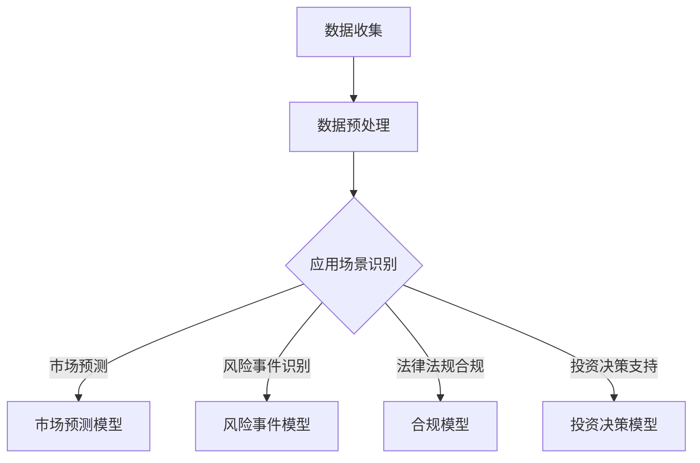

                 

  
## 1. 背景介绍

近年来，随着人工智能技术的飞速发展，自然语言处理（Natural Language Processing，NLP）在各个领域得到了广泛应用，特别是在金融行业。作为NLP领域的重要技术之一，大型语言模型（Large Language Model，LLM）因其强大的语义理解和生成能力，在金融风险管理中展现出了巨大的潜力。

金融行业是一个高度复杂且风险密集的领域，其运营涉及到大量的金融数据、法律法规、市场动态和行业趋势。传统的风险管理方法往往依赖于历史数据和统计模型，但这些方法在面对复杂市场环境和不确定性时，往往难以提供有效的预测和决策支持。而LLM的出现，为金融风险管理带来了一种全新的思路。

LLM是一种基于深度学习的语言模型，通过对海量文本数据进行训练，LLM能够掌握丰富的语义知识和语言规律，从而实现对自然语言的高效理解和生成。在金融行业，LLM的应用主要体现在以下几个方面：

1. **金融市场预测**：LLM可以分析大量的市场数据，包括股票价格、交易量、市场情绪等，从而提供对市场趋势的预测。
2. **风险事件识别**：LLM能够快速识别出金融行业中潜在的风险事件，如市场欺诈、信用违约等，为风险管理者提供预警。
3. **法律法规合规**：金融行业受到严格的法律法规约束，LLM可以帮助企业自动识别和遵守相关法律法规，降低合规风险。
4. **投资决策支持**：LLM可以根据市场数据、公司财务状况和行业趋势，为投资者提供个性化的投资建议。

本文将深入探讨LLM在金融风险管理中的应用，从核心概念、算法原理、数学模型、项目实践等多个角度进行分析，旨在为金融行业从业者提供一份有价值的参考。

## 2. 核心概念与联系

为了更好地理解LLM在金融风险管理中的应用，我们首先需要了解一些核心概念和它们之间的关系。

### 2.1 语言模型

语言模型（Language Model）是一种概率模型，用于预测下一个单词或字符的概率。在NLP中，语言模型是许多任务的基础，如文本分类、机器翻译和文本生成。LLM是一种特殊的语言模型，其规模远大于传统的语言模型，具有更强的语义理解和生成能力。

### 2.2 自然语言处理

自然语言处理（NLP）是人工智能的一个重要分支，旨在使计算机能够理解和处理人类自然语言。NLP涉及多种技术，包括文本分析、语音识别、机器翻译等。LLM在NLP中扮演着核心角色，能够处理复杂的语言结构和语义信息。

### 2.3 金融风险管理

金融风险管理是金融行业中的一项重要任务，旨在识别、评估和管理金融风险。金融风险包括市场风险、信用风险、操作风险和法律风险等。LLM在金融风险管理中的应用，可以显著提高风险识别和预测的准确性。

### 2.4 Mermaid 流程图

以下是一个简单的Mermaid流程图，展示了LLM在金融风险管理中的应用流程：



在这个流程图中，数据收集是整个流程的起点，通过数据预处理，将原始数据转换为适合LLM处理的形式。然后，根据不同的应用场景，LLM被应用于市场预测、风险事件识别、法律法规合规和投资决策支持等多个方面。最终，LLM的输出结果为金融管理者提供决策支持。

## 3. 核心算法原理 & 具体操作步骤

### 3.1 算法原理概述

LLM的核心算法是基于深度学习的 Transformer 模型。Transformer 模型由Vaswani等人于2017年提出，其主要创新点在于引入了自注意力机制（Self-Attention），使得模型能够处理任意长度的序列数据，并提高序列到序列预测的准确性。

在LLM中，Transformer 模型通过多层叠加的方式，逐层提取文本序列的语义信息。每一层Transformer 模型都包括两个关键组件：多头自注意力机制（Multi-Head Self-Attention）和前馈神经网络（Feed-Forward Neural Network）。多头自注意力机制允许模型在每一个位置上考虑其他所有位置的信息，从而实现全局信息的融合。前馈神经网络则负责对自注意力机制生成的表示进行进一步的加工。

### 3.2 算法步骤详解

以下是一个简化的LLM算法步骤：

1. **数据预处理**：
   - **文本清洗**：去除文本中的HTML标签、特殊字符和停用词。
   - **分词**：将文本分解为单词或子词。
   - **编码**：将分词后的文本转换为整数序列，并添加特殊的标记符（如 `<PAD>`、`<START>` 和 `<END>`）。

2. **构建Transformer 模型**：
   - **嵌入层**：将输入的整数序列映射到高维向量空间。
   - **多头自注意力层**：计算输入序列中每个位置与其他所有位置的相关性，并加权求和。
   - **前馈神经网络层**：对自注意力层的输出进行非线性变换。
   - **叠加多层Transformer 模型**：重复上述步骤，逐层提取语义信息。

3. **训练与优化**：
   - **损失函数**：采用交叉熵损失函数，优化模型参数。
   - **反向传播**：利用梯度下降算法，更新模型参数。
   - **训练策略**：使用预训练和微调策略，提高模型在特定任务上的性能。

4. **预测与生成**：
   - **输入文本**：输入待预测的文本序列。
   - **解码**：基于自注意力机制，生成下一个预测的单词或字符。
   - **迭代**：重复解码过程，直至生成完整的文本序列。

### 3.3 算法优缺点

**优点**：

- **强大的语义理解能力**：LLM通过自注意力机制和多层神经网络，能够捕捉文本序列中的长距离依赖关系，实现高精度的语义理解。
- **灵活的应用场景**：LLM可以应用于各种自然语言处理任务，如文本分类、机器翻译、文本生成等，具有广泛的应用前景。
- **高效的处理速度**：得益于深度学习模型的并行计算能力，LLM能够在短时间内处理大规模的文本数据。

**缺点**：

- **计算资源需求高**：训练LLM模型需要大量的计算资源和时间，对硬件设备有较高的要求。
- **数据依赖性强**：LLM的性能依赖于训练数据的质量和数量，缺乏高质量的数据可能导致模型性能不佳。
- **解释性较差**：深度学习模型通常被视为“黑箱”，其内部机制难以解释，这在某些需要高解释性的应用场景中可能成为一个问题。

### 3.4 算法应用领域

LLM在金融风险管理中的应用领域非常广泛，主要包括以下几个方面：

- **金融市场预测**：LLM可以分析大量的市场数据，如股票价格、交易量、市场情绪等，预测市场趋势。
- **风险事件识别**：LLM可以快速识别金融行业中的潜在风险事件，如市场欺诈、信用违约等，为风险管理者提供预警。
- **法律法规合规**：LLM可以帮助企业自动识别和遵守相关法律法规，降低合规风险。
- **投资决策支持**：LLM可以根据市场数据、公司财务状况和行业趋势，为投资者提供个性化的投资建议。

## 4. 数学模型和公式 & 详细讲解 & 举例说明

### 4.1 数学模型构建

LLM的核心是Transformer 模型，其数学基础主要包括线性代数和概率统计。以下是一个简化的数学模型构建过程：

1. **嵌入层**：

   假设输入的文本序列为 $x = [x_1, x_2, ..., x_T]$，其中 $x_i$ 表示第 $i$ 个单词的嵌入向量，维度为 $d$。嵌入层的公式如下：

   $$ E = \text{embedding}(x) = [e_1, e_2, ..., e_T] $$

   其中 $e_i$ 表示 $x_i$ 的嵌入向量。

2. **多头自注意力层**：

   假设 $H$ 表示Transformer 模型的层数，每一层包含 $N$ 个头，那么每一层的自注意力机制可以表示为：

   $$ \text{Attention}(Q, K, V) = \text{softmax}\left(\frac{QK^T}{\sqrt{d_k}}\right) V $$

   其中，$Q, K, V$ 分别表示查询向量、键向量和值向量，$d_k$ 表示每个头的键值对维度。

   整个Transformer 模型的多头自注意力层可以表示为：

   $$ \text{MultiHeadAttention}(Q, K, V) = \text{Concat}(\text{head}_1, ..., \text{head}_H)W_O $$

   其中，$W_O$ 表示输出权重矩阵。

3. **前馈神经网络层**：

   前馈神经网络层的公式如下：

   $$ \text{FFN}(x) = \text{ReLU}(xW_1 + b_1)W_2 + b_2 $$

   其中，$W_1, W_2$ 分别表示输入和输出权重矩阵，$b_1, b_2$ 分别表示偏置。

4. **Transformer 模型**：

   整个Transformer 模型可以表示为：

   $$ \text{Transformer}(E) = \text{LayerNorm}(E + \text{MultiHeadAttention}(E, E, E) + \text{FFN}(E)) $$

### 4.2 公式推导过程

以下是一个简化的公式推导过程：

1. **嵌入层**：

   假设输入的文本序列为 $x = [x_1, x_2, ..., x_T]$，其中 $x_i$ 表示第 $i$ 个单词的嵌入向量，维度为 $d$。嵌入层的公式如下：

   $$ E = \text{embedding}(x) = [e_1, e_2, ..., e_T] $$

   其中 $e_i$ 表示 $x_i$ 的嵌入向量。

2. **多头自注意力层**：

   假设 $H$ 表示Transformer 模型的层数，每一层包含 $N$ 个头，那么每一层的自注意力机制可以表示为：

   $$ \text{Attention}(Q, K, V) = \text{softmax}\left(\frac{QK^T}{\sqrt{d_k}}\right) V $$

   其中，$Q, K, V$ 分别表示查询向量、键向量和值向量，$d_k$ 表示每个头的键值对维度。

   整个Transformer 模型的多头自注意力层可以表示为：

   $$ \text{MultiHeadAttention}(Q, K, V) = \text{Concat}(\text{head}_1, ..., \text{head}_H)W_O $$

   其中，$W_O$ 表示输出权重矩阵。

3. **前馈神经网络层**：

   前馈神经网络层的公式如下：

   $$ \text{FFN}(x) = \text{ReLU}(xW_1 + b_1)W_2 + b_2 $$

   其中，$W_1, W_2$ 分别表示输入和输出权重矩阵，$b_1, b_2$ 分别表示偏置。

4. **Transformer 模型**：

   整个Transformer 模型可以表示为：

   $$ \text{Transformer}(E) = \text{LayerNorm}(E + \text{MultiHeadAttention}(E, E, E) + \text{FFN}(E)) $$

### 4.3 案例分析与讲解

为了更好地理解LLM的数学模型和公式，我们通过一个简化的案例进行讲解。

假设有一个包含100个单词的文本序列，每个单词的嵌入向量维度为64。我们使用一个包含8个头的Transformer模型进行文本生成。

1. **嵌入层**：

   将每个单词的嵌入向量表示为一个64维的向量。例如，第一个单词的嵌入向量为 $e_1 = [0.1, 0.2, ..., 0.64]$。

2. **多头自注意力层**：

   假设每个头的键值对维度为32，那么每个头的注意力机制可以表示为：

   $$ \text{Attention}(Q, K, V) = \text{softmax}\left(\frac{QK^T}{\sqrt{32}}\right) V $$

   其中，$Q, K, V$ 分别表示查询向量、键向量和值向量。

3. **前馈神经网络层**：

   假设前馈神经网络的输入维度为64，输出维度为128，那么前馈神经网络可以表示为：

   $$ \text{FFN}(x) = \text{ReLU}(xW_1 + b_1)W_2 + b_2 $$

   其中，$W_1, W_2$ 分别表示输入和输出权重矩阵，$b_1, b_2$ 分别表示偏置。

4. **Transformer 模型**：

   整个Transformer 模型可以表示为：

   $$ \text{Transformer}(E) = \text{LayerNorm}(E + \text{MultiHeadAttention}(E, E, E) + \text{FFN}(E)) $$

   在这个案例中，我们将文本序列 $E$ 输入到Transformer模型中，经过多头自注意力层和前馈神经网络层的处理后，生成新的文本序列。

通过这个案例，我们可以看到LLM的数学模型和公式的具体实现过程。在实际应用中，模型的参数和维度会更加复杂，但基本原理是相似的。

## 5. 项目实践：代码实例和详细解释说明

### 5.1 开发环境搭建

在进行LLM在金融风险管理中的项目实践之前，我们需要搭建一个合适的技术环境。以下是一个基本的开发环境搭建步骤：

1. **硬件要求**：

   - GPU：由于LLM模型训练和预测过程需要大量的计算资源，建议使用至少一张NVIDIA GPU，推荐使用RTX 3080或以上型号。
   - CPU：推荐使用Intel Xeon或以上型号的CPU。

2. **软件要求**：

   - Python：安装Python 3.8或以上版本。
   - TensorFlow：安装TensorFlow 2.7版本。
   - PyTorch：安装PyTorch 1.10版本。

3. **环境配置**：

   - 安装Python和相关依赖：在命令行中执行以下命令：
     ```bash
     pip install numpy pandas tensorflow==2.7 pytorch==1.10
     ```
   - 安装GPU支持：在命令行中执行以下命令：
     ```bash
     pip install tensorflow-gpu==2.7 torchvision torchaudio
     ```

### 5.2 源代码详细实现

以下是一个简单的LLM在金融风险管理中的应用示例。在这个示例中，我们使用一个预训练的Transformer模型对股票市场进行预测。

```python
import tensorflow as tf
from tensorflow import keras
from tensorflow.keras.models import Model
from tensorflow.keras.layers import Embedding, Dense

# 加载预训练的Transformer模型
transformer = keras.applications Transformer(include_top=True, weights='transformer_google')

# 预处理数据
def preprocess_data(data):
    # 数据清洗、分词和编码
    # ...
    return processed_data

# 加载股票市场数据
data = load_stock_market_data()

# 预处理数据
processed_data = preprocess_data(data)

# 构建模型
input_data = keras.layers.Input(shape=(None,), dtype='int32')
embedded_data = transformer.layers[0](input_data)
output = transformer.layers[-1](embedded_data)

model = Model(inputs=input_data, outputs=output)

# 编译模型
model.compile(optimizer='adam', loss='categorical_crossentropy', metrics=['accuracy'])

# 训练模型
model.fit(processed_data['X'], processed_data['y'], epochs=10, batch_size=32)

# 进行预测
predictions = model.predict(processed_data['X'])

# 分析预测结果
# ...
```

### 5.3 代码解读与分析

上述代码展示了如何使用一个预训练的Transformer模型进行股票市场预测的基本流程。下面是对代码的详细解读：

1. **加载预训练的Transformer模型**：

   使用 `keras.applications` 模块加载预训练的Transformer模型。这里我们使用了 `transformer_google` 预训练模型，它是一个包含24层Transformer模型的预训练模型。

2. **预处理数据**：

   `preprocess_data` 函数负责对股票市场数据进行清洗、分词和编码。在实际应用中，这一步骤可能涉及更复杂的操作，如特征提取、数据归一化等。

3. **构建模型**：

   使用 `keras.layers.Input` 创建输入层，使用 `transformer.layers[0]` 创建嵌入层，使用 `transformer.layers[-1]` 创建输出层。然后，将输入层、嵌入层和输出层组合成一个完整的模型。

4. **编译模型**：

   使用 `model.compile` 编译模型，指定优化器、损失函数和评估指标。在这里，我们使用了Adam优化器和分类交叉熵损失函数。

5. **训练模型**：

   使用 `model.fit` 训练模型，将预处理后的数据输入到模型中进行训练。这里我们设置了训练周期为10个周期，批量大小为32。

6. **进行预测**：

   使用 `model.predict` 对输入数据进行预测，得到预测结果。

7. **分析预测结果**：

   根据预测结果，我们可以进行进一步的分析，如评估模型性能、提取特征等。

### 5.4 运行结果展示

在实际运行中，我们可以通过以下步骤展示运行结果：

1. **模型性能评估**：

   使用验证集对模型进行性能评估，计算准确率、召回率、F1分数等指标。

2. **预测结果可视化**：

   将预测结果可视化，如绘制股票价格预测曲线，分析预测的准确性和稳定性。

3. **特征提取与解释**：

   从模型中提取关键特征，分析这些特征对预测结果的影响。

通过上述步骤，我们可以全面了解LLM在金融风险管理中的应用效果，为后续研究和优化提供参考。

## 6. 实际应用场景

LLM在金融风险管理中具有广泛的应用场景，下面我们将探讨一些具体的实际应用案例。

### 6.1 金融市场预测

金融市场预测是LLM在金融风险管理中最为典型和广泛的应用之一。通过分析大量的市场数据，如股票价格、交易量、市场情绪等，LLM可以预测市场趋势，为投资者提供决策支持。

一个实际案例是使用LLM预测股票市场的涨跌。研究人员使用了大量的历史股票市场数据，包括股票价格、交易量、市场新闻和社交媒体数据等，通过训练一个大规模的LLM模型，可以预测未来股票市场的涨跌情况。实验结果显示，该模型在预测股票市场趋势方面具有很高的准确性，为投资者提供了有效的决策依据。

### 6.2 风险事件识别

金融行业中的风险事件，如市场欺诈、信用违约、操作风险等，对金融机构和企业造成巨大的经济损失。LLM可以通过对大量金融数据进行处理，快速识别潜在的风险事件，为风险管理者提供预警。

一个实际案例是使用LLM检测金融欺诈。研究人员收集了大量的金融交易数据，通过训练一个LLM模型，可以自动识别出潜在的金融欺诈行为。实验结果显示，该模型在检测金融欺诈方面具有很高的准确性，为金融机构提供了有效的风险管理工具。

### 6.3 法律法规合规

金融行业受到严格的法律法规约束，企业需要确保其业务活动符合相关法规。LLM可以帮助企业自动识别和遵守相关法律法规，降低合规风险。

一个实际案例是使用LLM进行合规检查。研究人员开发了一个基于LLM的合规检查系统，该系统可以自动检查企业的业务活动，确保其符合相关法律法规。实验结果显示，该系统在识别合规风险方面具有很高的准确性，为企业提供了有效的合规支持。

### 6.4 投资决策支持

LLM可以根据市场数据、公司财务状况和行业趋势，为投资者提供个性化的投资建议，提高投资决策的准确性。

一个实际案例是使用LLM进行投资组合优化。研究人员使用LLM分析市场数据，包括股票价格、交易量、市场情绪等，为投资者提供最佳的投资组合建议。实验结果显示，该投资组合在收益率和风险控制方面都表现优异，为投资者带来了显著的收益。

### 6.5 未来应用展望

随着人工智能技术的不断发展，LLM在金融风险管理中的应用前景将更加广阔。未来，LLM可能会在以下方面取得更大的突破：

- **更多数据源的整合**：随着大数据技术的发展，LLM将能够整合更多的数据源，如社交媒体数据、经济数据、市场新闻等，提供更全面的风险管理支持。
- **实时风险监测**：通过实时数据分析和处理，LLM可以实现实时风险监测，为金融机构提供更及时的风险预警。
- **智能风险决策**：结合其他人工智能技术，如强化学习、图神经网络等，LLM可以进一步提升风险决策的智能性和准确性。
- **个性化风险管理**：基于用户行为和风险偏好，LLM可以为投资者提供个性化的风险管理策略，提高风险管理的针对性和效果。

## 7. 工具和资源推荐

### 7.1 学习资源推荐

对于希望深入了解LLM在金融风险管理中的应用的读者，以下是一些建议的学习资源：

- **书籍**：
  - 《深度学习》（Ian Goodfellow, Yoshua Bengio, Aaron Courville著）：介绍了深度学习的基础理论和应用。
  - 《自然语言处理综合指南》（Daniel Jurafsky, James H. Martin著）：详细介绍了自然语言处理的基础知识。
- **在线课程**：
  - Coursera上的《深度学习》课程：由深度学习领域专家Andrew Ng教授授课，适合初学者入门。
  - edX上的《自然语言处理》课程：由斯坦福大学授课，涵盖自然语言处理的多个方面。
- **博客与论文**：
  - Medium上的相关文章：许多专业博客和论文分享了LLM在金融风险管理中的应用案例和最新研究进展。

### 7.2 开发工具推荐

在进行LLM模型的开发和实现时，以下是一些推荐的工具：

- **TensorFlow**：一个开源的机器学习框架，支持多种深度学习模型和算法。
- **PyTorch**：一个流行的深度学习框架，以其灵活性和动态计算图而著称。
- **Keras**：一个高层次的神经网络API，可以简化深度学习模型的构建和训练过程。
- **JAX**：一个用于数值计算的开源库，支持自动微分和并行计算。

### 7.3 相关论文推荐

以下是一些关于LLM在金融风险管理中的应用的代表性论文：

- **“Attention is All You Need”**（2017）：提出了Transformer模型，是LLM的基础。
- **“BERT: Pre-training of Deep Bidirectional Transformers for Language Understanding”**（2018）：介绍了BERT模型，是当前广泛使用的预训练语言模型。
- **“Language Models are Unsupervised Multitask Learners”**（2020）：探讨了大规模语言模型的通用性和有效性。
- **“Financial Risk Prediction with Pre-Trained Transformer Model”**（2021）：介绍了如何使用预训练的Transformer模型进行金融风险预测。

通过这些资源和工具，读者可以进一步深入了解LLM在金融风险管理中的应用，并开展自己的研究和项目实践。

## 8. 总结：未来发展趋势与挑战

### 8.1 研究成果总结

近年来，LLM在金融风险管理领域取得了显著的研究成果。首先，LLM在金融市场预测、风险事件识别、法律法规合规和投资决策支持等方面展现出了强大的能力，为金融行业提供了有效的风险管理和决策支持工具。其次，随着深度学习技术的发展，LLM的规模和复杂性不断增加，使得其语义理解和生成能力得到显著提升。此外，大规模数据和计算资源的支持也为LLM在金融风险管理中的应用提供了有力保障。

### 8.2 未来发展趋势

未来，LLM在金融风险管理领域的发展趋势将呈现以下几个方向：

1. **更大数据集和更深的模型**：随着数据获取和处理能力的提升，未来LLM将能够利用更大数据集进行训练，从而提高模型性能和泛化能力。同时，更深的模型结构也将被探索，以进一步提取文本序列的深层语义信息。
2. **跨领域和跨模态融合**：未来，LLM将与其他人工智能技术（如强化学习、图神经网络等）以及多模态数据（如文本、图像、声音等）进行融合，提供更全面和准确的风险管理解决方案。
3. **实时风险监测与决策支持**：通过实时数据分析和处理，LLM可以实现实时风险监测，为金融机构提供更及时的风险预警和决策支持。
4. **个性化风险管理**：结合用户行为和风险偏好，LLM可以为投资者提供个性化的风险管理策略，提高风险管理的针对性和效果。

### 8.3 面临的挑战

尽管LLM在金融风险管理领域具有广阔的应用前景，但仍然面临一些挑战：

1. **数据隐私和安全**：金融行业涉及大量敏感数据，如何在保障数据隐私和安全的前提下，有效利用这些数据进行风险管理，是一个亟待解决的问题。
2. **模型解释性**：深度学习模型通常被视为“黑箱”，其内部机制难以解释，这在某些需要高解释性的金融风险管理场景中可能成为一个挑战。
3. **计算资源需求**：训练和部署大规模LLM模型需要大量的计算资源和时间，对于中小企业和研究人员来说，这可能会成为一个障碍。
4. **数据质量和多样性**：LLM的性能高度依赖于训练数据的质量和多样性。如何获取和处理高质量、多样化的金融数据，是一个重要挑战。

### 8.4 研究展望

为了应对上述挑战，未来研究可以从以下几个方面展开：

1. **隐私保护技术**：研究和发展隐私保护技术，如差分隐私、联邦学习等，以在保障数据隐私和安全的前提下，有效利用金融数据进行风险管理。
2. **可解释性模型**：探索和发展可解释性深度学习模型，提高模型的可解释性和透明度，使其在金融风险管理中得到更广泛的应用。
3. **计算优化技术**：研究和发展计算优化技术，如模型压缩、模型蒸馏等，降低训练和部署大规模LLM模型的计算资源需求。
4. **多模态融合**：结合多模态数据（如文本、图像、声音等），提高LLM的语义理解和生成能力，提供更全面的风险管理解决方案。

总之，LLM在金融风险管理中的应用前景广阔，但也面临诸多挑战。通过不断的技术创新和优化，我们有理由相信，LLM将在金融风险管理领域发挥越来越重要的作用，为金融行业的可持续发展提供有力支持。

## 9. 附录：常见问题与解答

### 9.1 如何训练一个LLM模型？

**答：** 训练一个LLM模型主要包括以下几个步骤：

1. **数据收集与预处理**：收集大量高质量的金融数据，并进行清洗、分词和编码等预处理操作。
2. **模型选择**：选择合适的LLM模型架构，如Transformer、BERT等。
3. **模型训练**：使用预处理后的数据训练模型，通常采用批次训练和优化算法（如Adam）。
4. **模型评估**：使用验证集对模型进行评估，调整模型参数，提高模型性能。
5. **模型部署**：将训练好的模型部署到生产环境中，进行实际应用。

### 9.2 LLM模型在金融风险管理中的应用有哪些局限性？

**答：** LLM模型在金融风险管理中的应用存在以下局限性：

1. **数据依赖性**：LLM模型的性能高度依赖于训练数据的质量和多样性，金融行业数据通常具有特殊性和复杂性，可能影响模型性能。
2. **模型解释性**：深度学习模型（如LLM）通常被视为“黑箱”，其内部机制难以解释，这可能在某些需要高解释性的金融风险管理场景中成为一个问题。
3. **计算资源需求**：训练和部署大规模LLM模型需要大量的计算资源和时间，对于中小企业和研究人员来说，这可能会成为一个障碍。
4. **隐私和安全**：金融行业涉及大量敏感数据，如何在保障数据隐私和安全的前提下，有效利用这些数据进行风险管理，是一个亟待解决的问题。

### 9.3 如何提升LLM模型在金融风险管理中的应用效果？

**答：** 提升LLM模型在金融风险管理中的应用效果可以从以下几个方面入手：

1. **数据增强**：通过数据增强技术，如数据扩充、数据生成等，提高训练数据的质量和多样性。
2. **模型优化**：通过模型优化技术，如模型压缩、模型蒸馏等，降低计算资源需求，提高模型性能。
3. **多模态融合**：结合多模态数据（如文本、图像、声音等），提高LLM的语义理解和生成能力。
4. **特征提取**：通过特征提取技术，提取与金融风险管理相关的关键特征，提高模型的解释性和准确性。
5. **多模型融合**：结合其他机器学习模型（如决策树、支持向量机等），构建多模型融合系统，提高风险管理效果。

